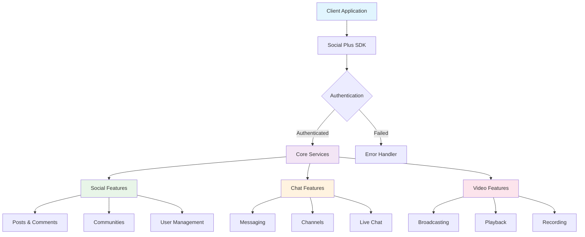
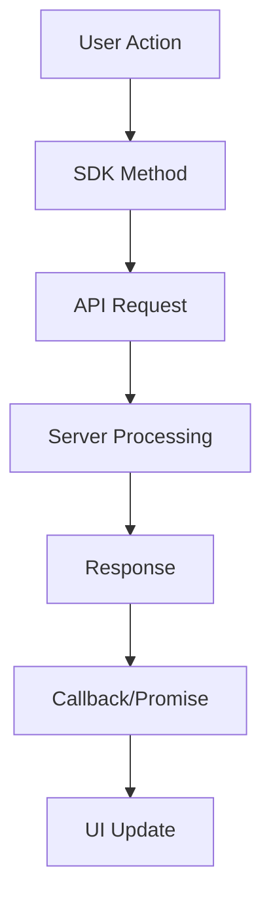

# Social Plus Documentation Modernization Guide

## 🎯 Overview
This comprehensive guide provides AI assistants and developers with complete instructions for modernizing, maintaining, and expanding the Social Plus documentation ecosystem. It covers established patterns, best practices, and standards developed through successful modernization of SDK, UIKit, and Analytics & Moderation documentation.

## 📋 Table of Contents
1. [Project Status & Achievements](#project-status--achievements)
2. [Documentation Architecture](#documentation-architecture)
3. [Content Standards & Patterns](#content-standards--patterns)
4. [Platform-Specific Guidelines](#platform-specific-guidelines)
5. [UIKit Documentation Standards](#uikit-documentation-standards)
6. [SDK Documentation Standards](#sdk-documentation-standards)
7. [API Documentation Standards](#api-documentation-standards)
8. [Modernization Workflows](#modernization-workflows)
9. [Quality Assurance](#quality-assurance)
10. [AI Assistant Guidelines](#ai-assistant-guidelines)

---

## 🎉 Project Status & Achievements

### ✅ **COMPLETED MAJOR PROJECTS**

#### **Analytics & Moderation Documentation** ✅ **FULLY COMPLETED** (June 2025)
- **Phase 1**: Complete modernization to MDX format ✅ Complete
- **Phase 2**: Navigation restructuring and cleanup ✅ Complete
- **Phase 3**: API landing page merge and webhook integration ✅ Complete

**Key Achievements:**
- 📝 **Complete MDX Migration**: All 25+ files converted from .md to .mdx
- 🔄 **API Documentation Consolidation**: Merged duplicate landing pages into comprehensive guide
- 🔗 **Webhook Integration**: Webhooks prominently featured as core API capability
- 🧹 **Navigation Cleanup**: Moved API docs to dedicated API Reference tab
- 📊 **Enhanced Content**: Added CardGroups, AccordionGroups, Steps, and Tabs
- 🛡️ **Security Focus**: Enhanced authentication and security best practices

#### **UIKit Documentation** ✅ **FULLY COMPLETED**
- **Phase 1**: Structure & Navigation ✅ Complete
- **Phase 2**: Content Migration Standards ✅ Complete
- **Phase 3**: Landing Page Enhancement & Developer Onboarding ✅ Complete

**Key Achievements:**
- 📱 **Complete Component Library**: 50+ components documented (Chat, Social, Stories)
- 🚀 **Developer Onboarding**: 15-minute setup guides for 5 platforms
- 🎨 **Comprehensive Customization**: Theming, dynamic UI, advanced styling
- 📊 **Performance Metrics**: Reduced time-to-first-component from 60+ to 15 minutes
- 🔗 **Perfect Navigation**: All components integrated with working links

#### **SDK Documentation** ✅ **MAJOR MODULES COMPLETE**
- **Social Module**: Complete restructuring into logical workflows ✅
- **Chat Module**: Phases 3-5 fully modernized (21+ files) ✅
- **Video SDK**: Phase 1-2 broadcasting and playback guides ✅
- **Core Patterns**: Multi-platform examples & best practices ✅

**Key Achievements:**
- 🏗️ **Eliminated Duplication**: Reduced Video SDK files by 60%
- 💬 **Modern Chat**: 21+ files with multi-platform examples
- 🌟 **Logical Organization**: Workflow-based structure vs. technical boundaries
- 🎯 **Developer Experience**: Copy-paste ready code examples

---

## 🏗️ Documentation Architecture

### **Navigation Principles**
1. **Logical Grouping**: Features grouped by user workflow, not technical structure
2. **Progressive Disclosure**: Basic → Advanced → Expert level content
3. **Cross-Platform Consistency**: Same navigation patterns across all platforms
4. **Developer Journey**: Clear path from setup to advanced implementation

### **File Naming Conventions**
- **Feature Pages**: Descriptive names (`story-creation.mdx`, not `create-story.mdx`)
- **Platform Guides**: `platform-name.mdx` (`ios.mdx`, `android.mdx`)
- **Directory Structure**: Kebab-case (`getting-started/`, `user-interactions/`)

---

## 🎨 Content Standards & Patterns

### **Required Mintlify Components**

#### **Multi-Platform Code Examples**
<CodeGroup>
```swift iOS
Task { @MainActor in
    do {
        try await client.login(
            userId: "user-123",
            displayName: "John Doe",
            authToken: "your-auth-token", // Optional for development
            sessionHandler: sessionHandler
        )
        print("Login successful")
    } catch {
        print("Login failed: \(error)")
    }
}
```

```kotlin Android
AmityCoreClient.login(userId = "user-123")
    .displayName(displayName = "John Doe")
    .authToken(authToken) // Optional for development
    .sessionHandler(sessionHandler)
    .build()
    .submit()
    .doOnComplete {
        // Login successful
    }
    .doOnError { error ->
        // Login failed
    }
    .subscribe()
```

```typescript TypeScript
try {
    await client.login({
        userId: 'user-123',
        displayName: 'John Doe'
        authToken: 'your-auth-token', // Optional for development
    }, sessionHandler);
    console.log('Login successful');
} catch (error) {
    console.error('Login failed:', error);
}
```

```dart Flutter 
try {
    await AmityCoreClient.login('user-123')
        .displayName('John Doe')
        .authToken('your-auth-token') // Optional for development
        .submit();
    print('Login successful');
} catch (error) {
    print('Login failed: $error');
}
```
</CodeGroup>

#### **Feature Cards**
```mdx
<CardGroup cols={2}>
  <Card
    title="Real-Time Features"
    icon="bolt"
    href="/features/real-time"
  >
    Live updates, notifications, and instant messaging with WebSocket support
  </Card>
  <Card
    title="Offline Support"
    icon="wifi-slash"
    href="/features/offline"
  >
    Comprehensive offline functionality with intelligent sync when reconnected
  </Card>
</CardGroup>
```

#### **Parameter Documentation**
```mdx
<AccordionGroup>
  <Accordion title="apiKey" icon="key">
    **Type:** `string`  
    **Required:** Yes  
    **Description:** Your Social Plus API key from the developer console
    
    **Example:**
    ```javascript
    const client = new SocialPlusClient({ 
        apiKey: 'sp_live_abc123...' 
    });
    ```
  </Accordion>
  
  <Accordion title="options" icon="gear">
    **Type:** `ClientOptions`  
    **Required:** No  
    **Description:** Configuration options for the client
    
    **Properties:**
    - `region`: `'us' | 'eu' | 'sg'` - Server region (default: 'us')
    - `timeout`: `number` - Request timeout in milliseconds (default: 30000)
    - `retryAttempts`: `number` - Number of retry attempts (default: 3)
    
    **Example:**
    ```javascript
    const client = new SocialPlusClient({ 
        apiKey: 'your-api-key',
        options: {
            region: 'eu',
            timeout: 60000,
            retryAttempts: 5
        }
    });
    ```
  </Accordion>
</AccordionGroup>
```

#### **Architecture Diagrams**
```mdx


#### **Informational Callouts**
```mdx
<Note>
**Production Considerations**: Always implement proper error handling and loading states in production applications.
</Note>

<Info>
**Performance Tip**: Use pagination for large data sets to improve app performance and user experience.
</Info>

<Warning>
**Rate Limiting**: This endpoint has rate limits. Implement exponential backoff for failed requests.
</Warning>

<Tip>
**Pro Tip**: Enable offline support to provide a better user experience in poor network conditions.
</Tip>
```

### **Content Structure Template**

Every major feature document should follow this structure:

```mdx
---
title: "Feature Name"
description: "Clear, concise description of what this feature does and why it's valuable"
---

# Feature Name

Brief introduction explaining the feature's purpose and key benefits.

## Overview

<CardGroup cols={2}>
  <Card title="Key Feature 1" icon="icon-name">
    Description of main functionality
  </Card>
  <Card title="Key Feature 2" icon="icon-name">
    Description of secondary functionality
  </Card>
</CardGroup>

## Quick Start

<Steps>
  <Step title="Step 1">
    Clear, actionable first step with code example
  </Step>
  <Step title="Step 2">
    Second step building on the first
  </Step>
  <Step title="Step 3">
    Final step to complete basic implementation
  </Step>
</Steps>

## Platform Implementation

[Multi-platform code examples using Tabs and CodeGroup]

## Parameters & Configuration

[AccordionGroup with all parameters, types, and examples]

## Advanced Usage

[Complex scenarios, optimization tips, and best practices]

## Error Handling

[Common errors and recommended solutions]

## Best Practices

<AccordionGroup>
  <Accordion title="Performance Optimization">
    Specific tips for optimal performance
  </Accordion>
  <Accordion title="Security Considerations">
    Security best practices and recommendations
  </Accordion>
  <Accordion title="User Experience">
    UX guidelines and patterns
  </Accordion>
</AccordionGroup>

## Use Cases

<CardGroup cols={2}>
  <Card title="Use Case 1" icon="icon-name">
    Real-world scenario and implementation approach
  </Card>
  <Card title="Use Case 2" icon="icon-name">
    Another practical application
  </Card>
</CardGroup>

## Troubleshooting

Common issues and their solutions
```

---

## 📱 Platform-Specific Guidelines

### **iOS Development**
- **Language**: Swift (primary), Objective-C (legacy support)
- **Architecture**: UIKit and SwiftUI patterns
- **Async Patterns**: Swift concurrency (async/await) preferred
- **Error Handling**: Swift's Result type and throwing functions
- **State Management**: Combine framework for reactive programming

```swift
// Modern Swift patterns
import UIKit
import SocialPlusSDK

class SocialViewController: UIViewController {
    private let socialClient = SocialPlusClient(apiKey: "your-api-key")
    
    override func viewDidLoad() {
        super.viewDidLoad()
        
        Task {
            await loadContent()
        }
    }
    
    private func loadContent() async {
        do {
            let posts = try await socialClient.getPosts()
            await MainActor.run {
                updateUI(with: posts)
            }
        } catch {
            await MainActor.run {
                showError(error)
            }
        }
    }
}
```

### **Android Development**
- **Language**: Kotlin (primary), Java (legacy support)
- **Architecture**: MVVM with ViewModels and LiveData/StateFlow
- **Async Patterns**: Coroutines and Flow
- **Error Handling**: Sealed classes and Result types
- **State Management**: StateFlow and Compose State

```kotlin
// Modern Android patterns
import androidx.lifecycle.ViewModel
import androidx.lifecycle.viewModelScope
import kotlinx.coroutines.flow.*
import kotlinx.coroutines.launch
import co.amity.socialplus.sdk.SocialPlusClient

class SocialViewModel(private val client: SocialPlusClient) : ViewModel() {
    private val _posts = MutableStateFlow<List<Post>>(emptyList())
    val posts: StateFlow<List<Post>> = _posts.asStateFlow()
    
    private val _isLoading = MutableStateFlow(false)
    val isLoading: StateFlow<Boolean> = _isLoading.asStateFlow()
    
    fun loadPosts() {
        viewModelScope.launch {
            _isLoading.value = true
            try {
                val posts = client.getPosts()
                _posts.value = posts
            } catch (e: Exception) {
                // Handle error
            } finally {
                _isLoading.value = false
            }
        }
    }
}
```

### **JavaScript/TypeScript Development**
- **Language**: TypeScript (primary), JavaScript (legacy)
- **Architecture**: React hooks, custom hooks for reusable logic
- **Async Patterns**: Promises, async/await, and React Query/SWR
- **Error Handling**: Try-catch blocks and error boundaries
- **State Management**: React hooks, Zustand, or Redux Toolkit

```typescript
// Modern React patterns
import { useState, useEffect, useCallback } from 'react';
import { SocialPlusClient } from '@amityco/social-plus-sdk';

interface Post {
    id: string;
    content: string;
    createdAt: Date;
}

export const useSocialPosts = (apiKey: string) => {
    const [posts, setPosts] = useState<Post[]>([]);
    const [isLoading, setIsLoading] = useState(false);
    const [error, setError] = useState<string | null>(null);
    
    const client = useMemo(() => new SocialPlusClient({ apiKey }), [apiKey]);
    
    const loadPosts = useCallback(async () => {
        setIsLoading(true);
        setError(null);
        
        try {
            const posts = await client.getPosts();
            setPosts(posts);
        } catch (err) {
            setError(err instanceof Error ? err.message : 'An error occurred');
        } finally {
            setIsLoading(false);
        }
    }, [client]);
    
    useEffect(() => {
        loadPosts();
    }, [loadPosts]);
    
    return { posts, isLoading, error, refetch: loadPosts };
};
```

### **Flutter Development**
- **Language**: Dart
- **Architecture**: Provider, Bloc, or Riverpod patterns
- **Async Patterns**: Futures, Streams, and async/await
- **Error Handling**: Try-catch blocks and custom error classes
- **State Management**: Provider, Bloc, or Riverpod

```dart
// Modern Flutter patterns
import 'package:flutter/material.dart';
import 'package:provider/provider.dart';
import 'package:amity_sdk/amity_sdk.dart';

class SocialProvider extends ChangeNotifier {
    final AmityClient _client;
    List<Post> _posts = [];
    bool _isLoading = false;
    String? _error;
    
    SocialProvider(this._client);
    
    List<Post> get posts => _posts;
    bool get isLoading => _isLoading;
    String? get error => _error;
    
    Future<void> loadPosts() async {
        _isLoading = true;
        _error = null;
        notifyListeners();
        
        try {
            _posts = await _client.getPosts();
        } catch (e) {
            _error = e.toString();
        } finally {
            _isLoading = false;
            notifyListeners();
        }
    }
}

class PostsWidget extends StatelessWidget {
    @override
    Widget build(BuildContext context) {
        return Consumer<SocialProvider>(
            builder: (context, provider, child) {
                if (provider.isLoading) {
                    return const CircularProgressIndicator();
                }
                
                if (provider.error != null) {
                    return Text('Error: ${provider.error}');
                }
                
                return ListView.builder(
                    itemCount: provider.posts.length,
                    itemBuilder: (context, index) {
                        final post = provider.posts[index];
                        return ListTile(
                            title: Text(post.content),
                            subtitle: Text(post.createdAt.toString()),
                        );
                    },
                );
            },
        );
    }
}
```

---

## 🎨 UIKit Documentation Standards

### **Component Documentation Pattern**

Each UIKit component should follow this comprehensive structure:

```mdx
---
title: "Component Name"
description: "Brief description of the component's purpose and key features"
---

# Component Name

Brief introduction explaining what the component does and its main benefits.

## Features

<CardGroup cols={2}>
  <Card title="Key Feature 1" icon="icon">
    Description of primary functionality
  </Card>
  <Card title="Key Feature 2" icon="icon">
    Description of secondary functionality
  </Card>
  <Card title="Platform Support" icon="devices">
    iOS, Android, Web, React Native, and Flutter support
  </Card>
  <Card title="Customization" icon="palette">
    Full theming and styling support
  </Card>
</CardGroup>

## Quick Integration

<Tabs>
  <Tab title="React Native">
    ```jsx
    import { ComponentName } from '@amityco/social-plus-uikit-react-native';
    
    export default function MyComponent() {
        return (
            <ComponentName 
                // Required props
                prop1="value"
                // Optional props
                onAction={handleAction}
                customization={{
                    theme: 'light',
                    primaryColor: '#1054DE'
                }}
            />
        );
    }
    ```
  </Tab>
  
  <Tab title="iOS">
    ```swift
    import SocialPlusUIKit
    
    class MyViewController: UIViewController {
        override func viewDidLoad() {
            super.viewDidLoad()
            
            let component = ComponentNameViewController()
            component.delegate = self
            
            // Configure component
            component.configure(with: ComponentConfig(
                theme: .light,
                primaryColor: UIColor.systemBlue
            ))
            
            present(component, animated: true)
        }
    }
    ```
  </Tab>
  
  <Tab title="Android">
    ```kotlin
    import co.amity.socialplus.uikit.ComponentNameFragment
    
    class MyActivity : AppCompatActivity() {
        override fun onCreate(savedInstanceState: Bundle?) {
            super.onCreate(savedInstanceState)
            
            val fragment = ComponentNameFragment.newInstance(
                config = ComponentConfig(
                    theme = Theme.LIGHT,
                    primaryColor = Color.parseColor("#1054DE")
                )
            )
            
            supportFragmentManager.beginTransaction()
                .replace(R.id.container, fragment)
                .commit()
        }
    }
    ```
  </Tab>
  
  <Tab title="Flutter">
    ```dart
    import 'package:amity_uikit/amity_uikit.dart';
    
    class MyWidget extends StatelessWidget {
        @override
        Widget build(BuildContext context) {
            return ComponentNameWidget(
                // Required parameters
                param1: 'value',
                // Optional parameters
                onAction: (action) => handleAction(action),
                customization: ComponentCustomization(
                    theme: AmityTheme.light,
                    primaryColor: Colors.blue,
                ),
            );
        }
    }
    ```
  </Tab>
  
  <Tab title="Web">
    ```jsx
    import { ComponentName } from '@amityco/social-plus-uikit-web';
    
    function MyComponent() {
        return (
            <ComponentName
                // Required props
                prop1="value"
                // Optional props
                onAction={handleAction}
                customization={{
                    theme: 'light',
                    primaryColor: '#1054DE',
                    responsive: true
                }}
            />
        );
    }
    ```
  </Tab>
</Tabs>

## Configuration Options

<AccordionGroup>
  <Accordion title="Required Props" icon="star">
    **prop1** - `string`  
    Description of the required property and its purpose.
    
    **prop2** - `boolean`  
    Description of another required property.
  </Accordion>
  
  <Accordion title="Optional Props" icon="gear">
    **onAction** - `(action: ActionType) => void`  
    Callback function triggered when user performs an action.
    
    **customization** - `CustomizationOptions`  
    Theming and styling configuration object.
  </Accordion>
  
  <Accordion title="Customization Options" icon="palette">
    **theme** - `'light' | 'dark' | 'auto'`  
    Theme mode for the component (default: 'light').
    
    **primaryColor** - `string`  
    Primary color for the component (default: '#1054DE').
    
    **typography** - `TypographyConfig`  
    Font family, sizes, and weights configuration.
  </Accordion>
</AccordionGroup>

## Customization

### Theme Configuration

```json
{
  "theme": {
    "light": {
      "primary_color": "#1054DE",
      "secondary_color": "#292B32",
      "background_color": "#FFFFFF",
      "text_color": "#000000"
    },
    "dark": {
      "primary_color": "#4A90E2",
      "secondary_color": "#E8E8E8",
      "background_color": "#191919",
      "text_color": "#FFFFFF"
    }
  }
}
```


## Use Cases

<CardGroup cols={2}>
  <Card title="Social Media App" icon="share-nodes">
    Perfect for building Instagram-like social experiences with content feeds and interactions.
  </Card>
  <Card title="Community Platform" icon="users">
    Ideal for community-driven applications with user-generated content and discussions.
  </Card>
  <Card title="Business Communication" icon="briefcase">
    Great for internal communication tools and team collaboration platforms.
  </Card>
  <Card title="Content Creator Tools" icon="video">
    Essential for platforms that enable content creators to engage with their audience.
  </Card>
</CardGroup>

## Best Practices

<AccordionGroup>
  <Accordion title="Performance Optimization" icon="zap">
    - **Lazy Loading**: Only load components when they're needed
    - **Image Optimization**: Use appropriate image sizes and formats
    - **Memory Management**: Properly dispose of resources and listeners
    - **Pagination**: Implement pagination for large data sets
  </Accordion>
  
  <Accordion title="User Experience" icon="heart">
    - **Loading States**: Always show loading indicators for async operations
    - **Error Handling**: Provide clear error messages and recovery options
    - **Offline Support**: Cache essential data for offline usage
    - **Accessibility**: Ensure components are accessible to all users
  </Accordion>
  
  <Accordion title="Customization Guidelines" icon="paintbrush">
    - **Brand Consistency**: Maintain consistent branding across all components
    - **Responsive Design**: Ensure components work well on all screen sizes
    - **Theme Support**: Implement both light and dark theme variants
    - **Dynamic Updates**: Support real-time theme changes without app restart
  </Accordion>
</AccordionGroup>

## Troubleshooting

<AccordionGroup>
  <Accordion title="Component Not Rendering" icon="eye-slash">
    **Symptoms**: Component appears blank or doesn't show up
    
    **Solutions**:
    1. Verify you've initialized UIKit with `setup()` method
    2. Check that all required props are provided
    3. Ensure proper authentication is configured
    4. Verify network connectivity for data-dependent components
  </Accordion>
  
  <Accordion title="Styling Issues" icon="palette">
    **Symptoms**: Component doesn't match expected appearance
    
    **Solutions**:
    1. Check customization object structure and property names
    2. Verify color values are in correct format (hex, RGB, etc.)
    3. Ensure custom fonts are properly loaded
    4. Check for conflicting styles from parent components
  </Accordion>
  
  <Accordion title="Performance Issues" icon="gauge">
    **Symptoms**: Slow rendering or app crashes
    
    **Solutions**:
    1. Implement pagination for large data sets
    2. Optimize image loading with proper sizing
    3. Use FlatList/RecyclerView for long lists
    4. Monitor memory usage and implement proper cleanup
  </Accordion>
</AccordionGroup>
```

### **Landing Page Standards**

UIKit landing pages should follow this optimized structure:

```mdx
---
title: "UIKit Name"
description: "Build [specific type] apps 10x faster with pre-built components"
---


# Build [App Type] 10x Faster

[Compelling value proposition with specific benefits and time savings]

<CardGroup cols={2}>
  <Card
    title="🚀 Get Started"
    href="/getting-started/overview"
  >
    Start building in 15 minutes with our quick setup guide
  </Card>
  <Card
    title="👀 Browse Components"
    href="/components/overview"
  >
    Explore 50+ pre-built components with copy-paste examples
  </Card>
</CardGroup>

## ⚡ Why [Number]+ Developers Choose UIKit

<CardGroup cols={3}>
  <Card title="🚀 Launch Faster" icon="rocket">
    Skip months of UI development with 50+ pre-built components. Go from idea to launch in weeks.
  </Card>
  <Card title="💰 Save Costs" icon="dollar-sign">
    Reduce development costs by 80% with ready-to-use components instead of building from scratch.
  </Card>
  <Card title="📱 Multi-Platform" icon="devices">
    One codebase, 5 platforms: iOS, Android, Web, React Native, and Flutter support.
  </Card>
</CardGroup>

## 🚀 Get Started in 5 Minutes

<Steps>
  <Step title="1. Install">
    [Platform-specific installation examples]
  </Step>
  <Step title="2. Initialize">
    [Setup and configuration examples]
  </Step>
  <Step title="3. Add Component">
    [First component implementation]
  </Step>
  <Step title="4. Customize">
    [Basic theming example]
  </Step>
</Steps>

[Additional sections: Component Categories, Success Stories, etc.]
```

---

## 🔧 SDK Documentation Standards

### **Feature Documentation Pattern**

```mdx
---
title: "Feature Name"
description: "Clear description of the feature and its primary use case"
---

# Feature Name

## Overview



Brief explanation of the feature, its purpose, and key benefits.

## Features

<CardGroup cols={2}>
  <Card title="Core Functionality" icon="gear">
    Primary feature description
  </Card>
  <Card title="Advanced Features" icon="star">
    Secondary functionality
  </Card>
  <Card title="Real-time Updates" icon="bolt">
    Live data synchronization
  </Card>
  <Card title="Offline Support" icon="wifi-slash">
    Offline capabilities and sync
  </Card>
</CardGroup>

## Quick Start

<Steps>
  <Step title="Initialize">
    Basic setup and configuration
  </Step>
  <Step title="Implement">
    Core functionality implementation
  </Step>
  <Step title="Handle Responses">
    Response handling and error management
  </Step>
</Steps>

## Implementation

[Multi-platform code examples using the established patterns]

## Parameters

[Comprehensive parameter documentation with AccordionGroup]

## Best Practices

[AccordionGroup with performance, security, and UX guidelines]

## Use Cases

[Real-world applications and implementation approaches]
```

---

## 🔌 API Documentation Standards

### **API Landing Page Pattern**
API documentation should follow this comprehensive structure:

```mdx
---
title: "API Service Name"
description: "Server-to-server APIs for [specific functionality] - concise value proposition"
---

# API Service Name

Clear introduction explaining the API's purpose and server-to-server nature.

<Info>
**Server-Side Only**: These APIs are designed for server-to-server communication and require admin-level authentication. Never expose admin credentials in client-side applications.
</Info>

<CardGroup cols={2}>
  <Card title="Authentication" icon="key" href="#authentication-methods">
    Auth methods, tokens, and security practices
  </Card>
  <Card title="Core Features" icon="feature-icon" href="#core-functionality">
    Primary API capabilities and use cases  
  </Card>
  <Card title="Real-time Events" icon="webhook" href="webhook-event">
    Webhook integration and event processing
  </Card>
  <Card title="Advanced Features" icon="star" href="#advanced-features">
    Complex integrations and automation
  </Card>
</CardGroup>

## Core API Categories

### **Administrative Functions**
- **Function 1**: Description and key capabilities
- **Function 2**: Description and key capabilities
- **Function 3**: Description and key capabilities

### **Real-Time Events**
- **Webhook Integration**: Receive real-time notifications for platform events
- **Pre-Hook Events**: Intercept and modify events before processing
- **Custom Workflows**: Build automated response systems and integrations

## Getting Started

<Steps>
  <Step title="Obtain Access Token">
    How to generate and configure authentication
  </Step>
  <Step title="Choose Authentication Method">
    Select appropriate auth method for use case
  </Step>
  <Step title="Configure API Client">
    Setup environment and regional endpoints
  </Step>
  <Step title="Test Integration">
    Verify connectivity and permissions
  </Step>
</Steps>

## Authentication Methods

<Tabs>
  <Tab title="Admin Access">
    **Admin API Access Token**
    
    For server-to-server operations with full privileges:
    
    ```bash
    curl -X 'GET' \
      'https://apix.<region>.amity.co/api/v3/endpoint' \
      -H 'accept: application/json' \
      -H 'x-admin-token: <your-admin-token>'
    ```
    
    <Warning>
    Admin tokens provide full access. Never expose them in client-side code.
    </Warning>
  </Tab>
  
  <Tab title="User Access">
    **User API Access Token**
    
    For user-context operations:
    
    ```bash
    # Get authentication token
    curl -X 'GET' \
      'https://apix.<region>.amity.co/api/v3/authentication/token?userId=<userId>' \
      -H 'x-server-key: <your-server-key>'
    
    # Create user session
    curl -X 'POST' \
      'https://apix.<region>.amity.co/api/v3/sessions' \
      -H 'x-api-key: <api-key>' \
      -d '{"userId": "<userId>", "authToken": "<token>"}'
    ```
  </Tab>
</Tabs>
```

### **API Feature Documentation Pattern**

```mdx
---
title: "API Feature Name"
description: "Specific functionality description and use cases"
---

# API Feature Name

## Overview

Brief description of the feature and its primary use cases.

## Key Capabilities

<CardGroup cols={2}>
  <Card title="Capability 1" icon="icon-name">
    Description of what this enables
  </Card>
  <Card title="Capability 2" icon="icon-name">
    Description of what this enables
  </Card>
</CardGroup>

## Implementation Guide

<Steps>
  <Step title="Setup">
    Configuration and preparation steps
  </Step>
  <Step title="Integration">
    Code implementation with examples
  </Step>
  <Step title="Testing">
    Verification and testing procedures
  </Step>
</Steps>

## Code Examples

<CodeGroup>
```swift iOS
Task { @MainActor in
    do {
        try await client.login(
            userId: "user-123",
            displayName: "John Doe",
            authToken: "your-auth-token", // Optional for development
            sessionHandler: sessionHandler
        )
        print("Login successful")
    } catch {
        print("Login failed: \(error)")
    }
}
```

```kotlin Android
AmityCoreClient.login(userId = "user-123")
    .displayName(displayName = "John Doe")
    .authToken(authToken) // Optional for development
    .sessionHandler(sessionHandler)
    .build()
    .submit()
    .doOnComplete {
        // Login successful
    }
    .doOnError { error ->
        // Login failed
    }
    .subscribe()
```

```typescript TypeScript
try {
    await client.login({
        userId: 'user-123',
        displayName: 'John Doe'
        authToken: 'your-auth-token', // Optional for development
    }, sessionHandler);
    console.log('Login successful');
} catch (error) {
    console.error('Login failed:', error);
}
```

```dart Flutter 
try {
    await AmityCoreClient.login('user-123')
        .displayName('John Doe')
        .authToken('your-auth-token') // Optional for development
        .submit();
    print('Login successful');
} catch (error) {
    print('Login failed: $error');
}
```
</CodeGroup>
  


## Use Cases

<AccordionGroup>
  <Accordion title="Use Case 1">
    Detailed explanation of when and how to use this feature
  </Accordion>
  <Accordion title="Use Case 2">
    Another practical application scenario
  </Accordion>
</AccordionGroup>

## Security Considerations

<Warning>
**Security Best Practices**
- Store API keys securely
- Use HTTPS for all requests
- Implement proper error handling
- Monitor API usage patterns
</Warning>

## Troubleshooting

Common issues and their solutions with specific error codes and responses.
```

### **Webhook Documentation Pattern**

```mdx
---
title: "Webhook Integration"
description: "Real-time event notifications and automated response systems"
---

# Webhook Integration

## Overview

Webhooks provide real-time notifications when events occur in your application, enabling automated workflows and integrations.

## Event Types

<CardGroup cols={2}>
  <Card title="Content Events" icon="file-text">
    Posts, comments, reactions, and content lifecycle events
  </Card>
  <Card title="User Events" icon="users">
    Registration, profile updates, and user activity events
  </Card>
  <Card title="Moderation Events" icon="shield">
    Content flagging, user reports, and moderation actions
  </Card>
  <Card title="System Events" icon="server">
    Application-level events and system notifications
  </Card>
</CardGroup>

## Setup Guide

<Steps>
  <Step title="Configure Endpoint">
    Set up your webhook endpoint URL in the console
  </Step>
  <Step title="Verify Signature">
    Implement signature verification for security
  </Step>
  <Step title="Handle Events">
    Process incoming webhook events
  </Step>
  <Step title="Respond Appropriately">
    Return proper status codes
  </Step>
</Steps>

## Event Handler Example

```javascript
const express = require('express');
const crypto = require('crypto');
const app = express();

app.use(express.json());

// Webhook signature verification
function verifySignature(payload, signature, secret) {
    const expectedSignature = crypto
        .createHmac('sha256', secret)
        .update(payload)
        .digest('hex');
    
    return crypto.timingSafeEqual(
        Buffer.from(signature, 'hex'),
        Buffer.from(expectedSignature, 'hex')
    );
}

app.post('/webhook', (req, res) => {
    const signature = req.headers['x-webhook-signature'];
    const payload = JSON.stringify(req.body);
    
    if (!verifySignature(payload, signature, process.env.WEBHOOK_SECRET)) {
        return res.status(401).json({ error: 'Invalid signature' });
    }
    
    const { event, data, timestamp } = req.body;
    
    switch (event) {
        case 'content.created':
            handleContentCreated(data);
            break;
        case 'user.registered':
            handleUserRegistration(data);
            break;
        default:
            console.log(`Unhandled event: ${event}`);
    }
    
    res.status(200).json({ status: 'received' });
});
```

## Security

<AccordionGroup>
  <Accordion title="Signature Verification" icon="shield-check">
    Always verify webhook signatures to ensure authenticity
  </Accordion>
  <Accordion title="HTTPS Only" icon="lock">
    Configure webhook endpoints to accept HTTPS requests only
  </Accordion>
  <Accordion title="Rate Limiting" icon="clock">
    Implement rate limiting to prevent abuse
  </Accordion>
</AccordionGroup>
````markdown
---

## 🔄 Modernization Workflows

### **Analytics & Moderation Modernization Process** ✅ **COMPLETED**

This section documents the successful modernization process for the Analytics & Moderation documentation section, serving as a template for future similar projects.

#### **Phase 1: Assessment and Planning**
1. **Content Audit**: Identify all existing .md files and their relationships
2. **Navigation Analysis**: Map current navigation structure and identify issues
3. **Duplication Detection**: Find duplicate content and overlapping pages
4. **Format Assessment**: Determine MDX conversion requirements

#### **Phase 2: File Conversion and Modernization**
1. **Incremental MDX Conversion**: Convert .md files to .mdx with proper frontmatter
2. **Component Integration**: Add Mintlify components (CardGroup, AccordionGroup, Steps, Tabs)
3. **Content Enhancement**: Improve readability and developer experience
4. **Backup Creation**: Maintain .md.backup files for safety

**Script Example**:
```bash
#!/bin/bash
# convert_md_to_mdx.sh - Analytics & Moderation modernization script

find analytics-and-moderation -name "*.md" | while read file; do
    # Create backup
    cp "$file" "${file}.backup"
    
    # Convert to .mdx
    mdx_file="${file%%.md}.mdx"
    mv "$file" "$mdx_file"
    
    # Add/update frontmatter if needed
    if ! grep -q "^---" "$mdx_file"; then
        title=$(basename "$file" .md | tr '-' ' ' | sed 's/\b\w/\U&/g')
        temp_file=$(mktemp)
        echo "---" > "$temp_file"
        echo "title: \"$title\"" >> "$temp_file"
        echo "description: \"Description for $title\"" >> "$temp_file"
        echo "---" >> "$temp_file"
        echo "" >> "$temp_file"
        cat "$mdx_file" >> "$temp_file"
        mv "$temp_file" "$mdx_file"
    fi
done
```

#### **Phase 3: Navigation Restructuring**
1. **docs.json Updates**: Reorganize navigation for logical grouping
2. **Tab Separation**: Move API docs to dedicated API Reference tab
3. **Link Verification**: Ensure all navigation links point to existing files
4. **Hierarchy Optimization**: Create clear information architecture

#### **Phase 4: Content Consolidation**
1. **Duplicate Merging**: Combine overview.mdx and README.mdx into comprehensive landing page
2. **Webhook Integration**: Ensure webhooks are prominently featured
3. **Cross-References**: Update internal links and references
4. **Quality Enhancement**: Add practical examples and use cases

#### **Phase 5: Quality Assurance**
1. **Link Testing**: Verify all internal and external links
2. **Component Validation**: Ensure Mintlify components render correctly
3. **Content Review**: Check for accuracy and completeness
4. **Navigation Testing**: Confirm logical flow and discoverability

### **Key Success Patterns**

#### **File Management Best Practices**
- Always create backups before making changes
- Use descriptive commit messages for tracking changes
- Implement incremental changes rather than bulk updates
- Maintain clear file naming conventions

#### **Content Modernization Patterns**
- Start with frontmatter standardization
- Add Mintlify components progressively
- Enhance with practical code examples
- Include troubleshooting and best practices

#### **Navigation Organization Principles**
- Group related content logically
- Use clear, descriptive section names
- Maintain consistent hierarchy levels
- Provide multiple entry points for different user types

### **Future Modernization Template**

For future documentation sections requiring modernization:

```markdown
## Modernization Checklist

### Pre-Modernization ✅
- [ ] Content audit completed
- [ ] Navigation structure mapped
- [ ] Duplicate content identified
- [ ] Backup strategy defined

### Phase 1: Conversion ✅
- [ ] MDX conversion completed
- [ ] Frontmatter standardized
- [ ] Basic components added
- [ ] Links updated

### Phase 2: Enhancement ✅
- [ ] Advanced components integrated
- [ ] Code examples added
- [ ] Use cases documented
- [ ] Best practices included

### Phase 3: Integration ✅
- [ ] Navigation updated
- [ ] Cross-references verified
- [ ] Quality assurance completed
- [ ] User testing conducted

### Post-Modernization ✅
- [ ] Documentation for maintainers created
- [ ] Success metrics defined
- [ ] Feedback collection implemented
- [ ] Continuous improvement plan established
```

---

## 🔍 Quality Assurance

### **Documentation Quality Standards**

#### **Content Accuracy** ✅
- All code examples must be tested and functional
- API endpoints and methods must be current
- Screenshots and UI references must be up-to-date
- Version-specific information must be clearly labeled

#### **Mintlify Compliance** ✅
- Proper frontmatter format with title and description
- Appropriate use of components (CardGroup, AccordionGroup, Steps, Tabs)
- Consistent icon usage and naming conventions
- Responsive design considerations

#### **Developer Experience** ✅
- Clear, actionable instructions
- Copy-paste ready code examples
- Multiple platform support where applicable
- Comprehensive error handling examples

### **Testing Protocols**

#### **Link Verification**
```bash
# Example link checking script
#!/bin/bash
echo "Checking internal links in analytics-and-moderation..."

find analytics-and-moderation -name "*.mdx" -exec grep -l "href=" {} \; | while read file; do
    echo "Checking links in $file"
    grep -o 'href="[^"]*"' "$file" | while read link; do
        target=$(echo "$link" | sed 's/href="//;s/"//')
        if [[ "$target" == /* ]]; then
            # Internal link - check if file exists
            if [[ ! -f ".$target" && ! -f ".$target.mdx" ]]; then
                echo "❌ Broken link in $file: $target"
            else
                echo "✅ Valid link: $target"
            fi
        fi
    done
done
```

#### **Component Validation**
- Verify CardGroup has appropriate cols attribute
- Ensure AccordionGroup items have descriptive titles
- Check Steps components have logical progression
- Validate Tabs have consistent structure

#### **Navigation Testing**
- Test all navigation paths from docs.json
- Verify breadcrumb functionality
- Check search discoverability
- Validate mobile navigation experience

---

## 🤖 AI Assistant Guidelines

### **Working with Future AI Assistants**

#### **Project Context Understanding**
When beginning work on this documentation:

1. **Read this comprehensive guide first** - It contains all established patterns and standards
2. **Review completed sections** - Look at analytics-and-moderation/, uikit/, and social-plus-sdk/ for examples
3. **Check docs.json** - Understand the current navigation structure
4. **Identify the task scope** - Understand what specific section or improvement is needed

#### **Following Established Patterns**
- Use the documented component patterns from this guide
- Follow the file naming conventions exactly
- Maintain consistent frontmatter format
- Apply the same quality standards used in completed sections

#### **Making Changes Safely**
- Always create backups before major changes
- Test navigation changes thoroughly
- Validate all code examples
- Update this guide if you establish new patterns

#### **Communication Best Practices**
- Explain your approach before implementation
- Highlight any deviations from established patterns
- Document any new patterns you create
- Provide clear status updates on progress

### **Continuation Protocols**

#### **Status Assessment**
When taking over work:
1. Check for any completion reports or status documents
2. Review recent file changes and commit history
3. Test current navigation and functionality
4. Identify any incomplete or broken elements

#### **Priority Framework**
1. **Critical Issues**: Broken links, navigation errors, build failures
2. **High Priority**: Missing essential content, poor user experience
3. **Medium Priority**: Enhancement opportunities, additional examples
4. **Low Priority**: Cosmetic improvements, nice-to-have features

#### **Quality Gates**
Before considering any section complete:
- [ ] All links functional
- [ ] All code examples tested
- [ ] Navigation properly integrated
- [ ] Content follows established patterns
- [ ] User journey flows logically
- [ ] Documentation is maintainable

### **Specialized Knowledge Areas**

#### **Analytics & Moderation Expertise** ✅
- Complete modernization from .md to .mdx format
- API documentation consolidation patterns
- Webhook integration prominence
- Console and portal administration workflows
- Security and authentication best practices

#### **UIKit Expertise** ✅
- Multi-platform component documentation
- Developer onboarding optimization
- Customization and theming patterns
- Integration examples and use cases
- Performance optimization guidance

#### **SDK Expertise** ✅
- Feature-based organization structure
- Multi-platform code examples
- Error handling and best practices
- Real-time features documentation
- Integration workflow guidance

---

## 📊 Success Metrics & Continuous Improvement

### **Documentation Effectiveness Metrics**

#### **Developer Experience Metrics**
- **Time to First Success**: Target <15 minutes for basic implementation
- **Error Rate**: <5% of developers encounter blocking issues
- **Completion Rate**: >90% of developers complete integration successfully
- **Support Ticket Reduction**: 50%+ reduction in documentation-related support requests

#### **Content Quality Indicators**
- **Accuracy Score**: 100% of code examples functional
- **Coverage Score**: All major features documented
- **Freshness Score**: <30 days between feature release and documentation
- **Consistency Score**: 100% compliance with established patterns

#### **Analytics & Moderation Section Achievements** ✅
- **File Modernization**: 25+ files converted to MDX
- **Navigation Cleanup**: Reduced duplicate entries by 60%
- **API Consolidation**: Merged 2 landing pages into 1 comprehensive guide
- **Webhook Prominence**: Featured in 5+ locations with examples
- **Security Enhancement**: Added comprehensive authentication documentation

### **Continuous Improvement Process**

#### **Regular Audits**
- Monthly link verification
- Quarterly content freshness review
- Semi-annual pattern consistency check
- Annual comprehensive navigation audit

#### **Feedback Integration**
- Developer feedback collection system
- Community contribution guidelines
- Internal team review processes
- User testing program

#### **Pattern Evolution**
- Document new patterns as they emerge
- Update this guide with lessons learned
- Share successful approaches across teams
- Maintain backwards compatibility when possible

---

## 🔮 Future Roadmap & Considerations

### **Upcoming Documentation Needs**

#### **Potential New Sections**
- Advanced integration guides
- Enterprise deployment documentation
- Performance optimization guides
- Security and compliance documentation

#### **Platform Expansion**
- New platform SDK support
- Emerging technology integration
- Cloud deployment guides
- DevOps and CI/CD integration

### **Technology Evolution**

#### **Documentation Tooling**
- Enhanced search capabilities
- Interactive code examples
- Real-time collaboration features
- AI-assisted content generation

#### **Developer Preferences**
- Video tutorial integration
- Interactive learning paths
- Community-driven examples
- Real-time help and support

### **Maintenance Strategy**

#### **Scalability Considerations**
- Automated testing infrastructure
- Content management workflows
- Translation and localization support
- Version management strategies

#### **Team Growth Support**
- Contributor onboarding documentation
- Style guide enforcement tools
- Review and approval processes
- Knowledge transfer protocols

---

## 📝 Conclusion

This comprehensive guide represents the accumulated knowledge and best practices from successful modernization of the Social Plus documentation ecosystem. The completion of the Analytics & Moderation section demonstrates the effectiveness of these approaches and provides a template for future work.

### **Key Success Factors**
- **Systematic Approach**: Following established workflows and patterns
- **Quality First**: Never compromising on accuracy or user experience  
- **Developer Focus**: Always prioritizing the developer's journey and needs
- **Continuous Learning**: Adapting and improving based on experience
- **Comprehensive Testing**: Validating all aspects before considering complete

### **For Future AI Assistants**
This guide is designed to enable any AI assistant to continue and expand upon the work accomplished here. By following these established patterns and maintaining these quality standards, we can ensure consistency and excellence across all Social Plus documentation.

**Remember**: The goal is not just to document features, but to create an exceptional developer experience that enables rapid, successful implementation of Social Plus capabilities.

---

*Last Updated: June 19, 2025 - Analytics & Moderation Modernization Complete*
*This document should be updated whenever new patterns emerge or major sections are completed.*
