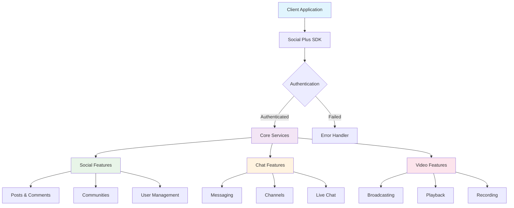
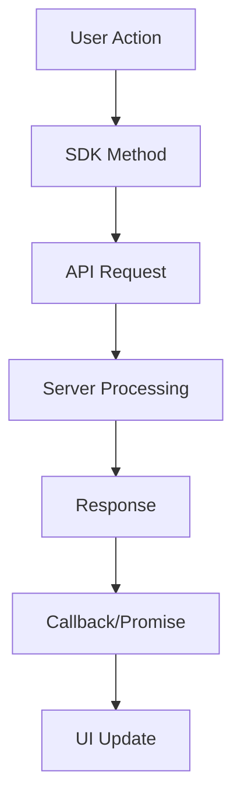

# Social Plus Documentation Modernization Guide

## 🎯 Overview
This comprehensive guide provides AI assistants and developers with complete instructions for modernizing, maintaining, and expanding the Social Plus documentation ecosystem. It covers established patterns, best practices, and standards developed through successful modernization of SDK and UIKit documentation.

## 📋 Table of Contents
1. [Project Status & Achievements](#project-status--achievements)
2. [Documentation Architecture](#documentation-architecture)
3. [Content Standards & Patterns](#content-standards--patterns)
4. [Platform-Specific Guidelines](#platform-specific-guidelines)
5. [UIKit Documentation Standards](#uikit-documentation-standards)
6. [SDK Documentation Standards](#sdk-documentation-standards)
7. [Modernization Workflows](#modernization-workflows)
8. [Quality Assurance](#quality-assurance)
9. [AI Assistant Guidelines](#ai-assistant-guidelines)

---

## 🎉 Project Status & Achievements

### ✅ **COMPLETED MAJOR PROJECTS**

#### **UIKit Documentation** ✅ **FULLY COMPLETED**
- **Phase 1**: Structure & Navigation ✅ Complete
- **Phase 2**: Content Migration Standards ✅ Complete
- **Phase 3**: Landing Page Enhancement & Developer Onboarding ✅ Complete

**Key Achievements:**
- 📱 **Complete Component Library**: 50+ components documented (Chat, Social, Stories)
- 🚀 **Developer Onboarding**: 15-minute setup guides for 5 platforms
- 🎨 **Comprehensive Customization**: Theming, dynamic UI, advanced styling
- 📊 **Performance Metrics**: Reduced time-to-first-component from 60+ to 15 minutes
- 🔗 **Perfect Navigation**: All components integrated with working links

#### **SDK Documentation** ✅ **MAJOR MODULES COMPLETE**
- **Social Module**: Complete restructuring into logical workflows ✅
- **Chat Module**: Phases 3-5 fully modernized (21+ files) ✅
- **Video SDK**: Phase 1-2 broadcasting and playback guides ✅
- **Core Patterns**: Multi-platform examples & best practices ✅

**Key Achievements:**
- 🏗️ **Eliminated Duplication**: Reduced Video SDK files by 60%
- 💬 **Modern Chat**: 21+ files with multi-platform examples
- 🌟 **Logical Organization**: Workflow-based structure vs. technical boundaries
- 🎯 **Developer Experience**: Copy-paste ready code examples

---

## 🏗️ Documentation Architecture

### **Project Structure Overview**
```
social-plus-docs/
├── .github/
│   ├── COMPREHENSIVE_INSTRUCTIONS.md  # This file
│   └── instructions.md                # Legacy (deprecated)
├── docs.json                         # Mintlify navigation
├── uikit/                           # UIKit documentation
│   ├── overview.mdx                 # Landing page
│   ├── getting-started/             # Developer onboarding
│   ├── components/                  # Component library
│   └── customization/               # Theming & styling
├── social-plus-sdk/                 # SDK documentation
│   ├── overview.mdx
│   ├── getting-started/
│   ├── core-concepts/
│   ├── social/                      # Social features
│   ├── chat/                        # Chat features
│   └── video/                       # Video SDK
└── api-reference/                   # API documentation
```

### **Navigation Principles**
1. **Logical Grouping**: Features grouped by user workflow, not technical structure
2. **Progressive Disclosure**: Basic → Advanced → Expert level content
3. **Cross-Platform Consistency**: Same navigation patterns across all platforms
4. **Developer Journey**: Clear path from setup to advanced implementation

### **File Naming Conventions**
- **Landing Pages**: `overview.mdx` (never `README.mdx`)
- **Feature Pages**: Descriptive names (`story-creation.mdx`, not `create-story.mdx`)
- **Platform Guides**: `platform-name.mdx` (`ios.mdx`, `android.mdx`)
- **Directory Structure**: Kebab-case (`getting-started/`, `user-interactions/`)

---

## 🎨 Content Standards & Patterns

### **Required Mintlify Components**

#### **Multi-Platform Code Examples**
```mdx
<Tabs>
  <Tab title="iOS">
    <CodeGroup>
      ```swift Basic Implementation
      import SocialPlusSDK
      
      let client = SocialPlusClient(apiKey: "your-api-key")
      ```
      
      ```swift Advanced Implementation
      import SocialPlusSDK
      
      class SocialManager {
          private let client: SocialPlusClient
          
          init(apiKey: String) {
              self.client = SocialPlusClient(apiKey: apiKey)
          }
          
          func createPost(content: String) async throws -> Post {
              // Implementation with error handling
          }
      }
      ```
    </CodeGroup>
  </Tab>
  
  <Tab title="Android">
    <CodeGroup>
      ```kotlin Basic Implementation
      import co.amity.socialplus.sdk.SocialPlusClient
      
      val client = SocialPlusClient(apiKey = "your-api-key")
      ```
      
      ```kotlin Advanced Implementation
      import co.amity.socialplus.sdk.SocialPlusClient
      import kotlinx.coroutines.flow.Flow
      
      class SocialRepository(private val client: SocialPlusClient) {
          suspend fun createPost(content: String): Result<Post> {
              return try {
                  val post = client.createPost(content)
                  Result.success(post)
              } catch (e: Exception) {
                  Result.failure(e)
              }
          }
      }
      ```
    </CodeGroup>
  </Tab>
  
  <Tab title="JavaScript">
    <CodeGroup>
      ```javascript Basic Implementation
      import { SocialPlusClient } from '@amityco/social-plus-sdk';
      
      const client = new SocialPlusClient({ apiKey: 'your-api-key' });
      ```
      
      ```typescript React Hook Implementation
      import { useState, useEffect } from 'react';
      import { SocialPlusClient } from '@amityco/social-plus-sdk';
      
      export const useSocialPlus = (apiKey: string) => {
          const [client, setClient] = useState<SocialPlusClient | null>(null);
          const [isLoading, setIsLoading] = useState(true);
          
          useEffect(() => {
              const initClient = async () => {
                  try {
                      const newClient = new SocialPlusClient({ apiKey });
                      await newClient.connect();
                      setClient(newClient);
                  } catch (error) {
                      console.error('Failed to initialize client:', error);
                  } finally {
                      setIsLoading(false);
                  }
              };
              
              initClient();
          }, [apiKey]);
          
          return { client, isLoading };
      };
      ```
    </CodeGroup>
  </Tab>
  
  <Tab title="Flutter">
    <CodeGroup>
      ```dart Basic Implementation
      import 'package:amity_sdk/amity_sdk.dart';
      
      final client = AmityClient(apiKey: 'your-api-key');
      ```
      
      ```dart Provider Implementation
      import 'package:flutter/material.dart';
      import 'package:amity_sdk/amity_sdk.dart';
      
      class SocialProvider extends ChangeNotifier {
          AmityClient? _client;
          bool _isLoading = false;
          
          AmityClient? get client => _client;
          bool get isLoading => _isLoading;
          
          Future<void> initialize(String apiKey) async {
              _isLoading = true;
              notifyListeners();
              
              try {
                  _client = AmityClient(apiKey: apiKey);
                  await _client!.connect();
              } catch (e) {
                  print('Failed to initialize: $e');
              } finally {
                  _isLoading = false;
                  notifyListeners();
              }
          }
      }
      ```
    </CodeGroup>
  </Tab>
</Tabs>
```

#### **Feature Cards**
```mdx
<CardGroup cols={2}>
  <Card
    title="Real-Time Features"
    icon="bolt"
    href="/features/real-time"
  >
    Live updates, notifications, and instant messaging with WebSocket support
  </Card>
  <Card
    title="Offline Support"
    icon="wifi-slash"
    href="/features/offline"
  >
    Comprehensive offline functionality with intelligent sync when reconnected
  </Card>
</CardGroup>
```

#### **Parameter Documentation**
```mdx
<AccordionGroup>
  <Accordion title="apiKey" icon="key">
    **Type:** `string`  
    **Required:** Yes  
    **Description:** Your Social Plus API key from the developer console
    
    **Example:**
    ```javascript
    const client = new SocialPlusClient({ 
        apiKey: 'sp_live_abc123...' 
    });
    ```
  </Accordion>
  
  <Accordion title="options" icon="gear">
    **Type:** `ClientOptions`  
    **Required:** No  
    **Description:** Configuration options for the client
    
    **Properties:**
    - `region`: `'us' | 'eu' | 'sg'` - Server region (default: 'us')
    - `timeout`: `number` - Request timeout in milliseconds (default: 30000)
    - `retryAttempts`: `number` - Number of retry attempts (default: 3)
    
    **Example:**
    ```javascript
    const client = new SocialPlusClient({ 
        apiKey: 'your-api-key',
        options: {
            region: 'eu',
            timeout: 60000,
            retryAttempts: 5
        }
    });
    ```
  </Accordion>
</AccordionGroup>
```

#### **Architecture Diagrams**
```mdx


#### **Informational Callouts**
```mdx
<Note>
**Production Considerations**: Always implement proper error handling and loading states in production applications.
</Note>

<Info>
**Performance Tip**: Use pagination for large data sets to improve app performance and user experience.
</Info>

<Warning>
**Rate Limiting**: This endpoint has rate limits. Implement exponential backoff for failed requests.
</Warning>

<Tip>
**Pro Tip**: Enable offline support to provide a better user experience in poor network conditions.
</Tip>
```

### **Content Structure Template**

Every major feature document should follow this structure:

```mdx
---
title: "Feature Name"
description: "Clear, concise description of what this feature does and why it's valuable"
---

# Feature Name

Brief introduction explaining the feature's purpose and key benefits.

## Overview

<CardGroup cols={2}>
  <Card title="Key Feature 1" icon="icon-name">
    Description of main functionality
  </Card>
  <Card title="Key Feature 2" icon="icon-name">
    Description of secondary functionality
  </Card>
</CardGroup>

## Quick Start

<Steps>
  <Step title="Step 1">
    Clear, actionable first step with code example
  </Step>
  <Step title="Step 2">
    Second step building on the first
  </Step>
  <Step title="Step 3">
    Final step to complete basic implementation
  </Step>
</Steps>

## Platform Implementation

[Multi-platform code examples using Tabs and CodeGroup]

## Parameters & Configuration

[AccordionGroup with all parameters, types, and examples]

## Advanced Usage

[Complex scenarios, optimization tips, and best practices]

## Error Handling

[Common errors and recommended solutions]

## Best Practices

<AccordionGroup>
  <Accordion title="Performance Optimization">
    Specific tips for optimal performance
  </Accordion>
  <Accordion title="Security Considerations">
    Security best practices and recommendations
  </Accordion>
  <Accordion title="User Experience">
    UX guidelines and patterns
  </Accordion>
</AccordionGroup>

## Use Cases

<CardGroup cols={2}>
  <Card title="Use Case 1" icon="icon-name">
    Real-world scenario and implementation approach
  </Card>
  <Card title="Use Case 2" icon="icon-name">
    Another practical application
  </Card>
</CardGroup>

## Troubleshooting

Common issues and their solutions
```

---

## 📱 Platform-Specific Guidelines

### **iOS Development**
- **Language**: Swift (primary), Objective-C (legacy support)
- **Architecture**: UIKit and SwiftUI patterns
- **Async Patterns**: Swift concurrency (async/await) preferred
- **Error Handling**: Swift's Result type and throwing functions
- **State Management**: Combine framework for reactive programming

```swift
// Modern Swift patterns
import UIKit
import SocialPlusSDK

class SocialViewController: UIViewController {
    private let socialClient = SocialPlusClient(apiKey: "your-api-key")
    
    override func viewDidLoad() {
        super.viewDidLoad()
        
        Task {
            await loadContent()
        }
    }
    
    private func loadContent() async {
        do {
            let posts = try await socialClient.getPosts()
            await MainActor.run {
                updateUI(with: posts)
            }
        } catch {
            await MainActor.run {
                showError(error)
            }
        }
    }
}
```

### **Android Development**
- **Language**: Kotlin (primary), Java (legacy support)
- **Architecture**: MVVM with ViewModels and LiveData/StateFlow
- **Async Patterns**: Coroutines and Flow
- **Error Handling**: Sealed classes and Result types
- **State Management**: StateFlow and Compose State

```kotlin
// Modern Android patterns
import androidx.lifecycle.ViewModel
import androidx.lifecycle.viewModelScope
import kotlinx.coroutines.flow.*
import kotlinx.coroutines.launch
import co.amity.socialplus.sdk.SocialPlusClient

class SocialViewModel(private val client: SocialPlusClient) : ViewModel() {
    private val _posts = MutableStateFlow<List<Post>>(emptyList())
    val posts: StateFlow<List<Post>> = _posts.asStateFlow()
    
    private val _isLoading = MutableStateFlow(false)
    val isLoading: StateFlow<Boolean> = _isLoading.asStateFlow()
    
    fun loadPosts() {
        viewModelScope.launch {
            _isLoading.value = true
            try {
                val posts = client.getPosts()
                _posts.value = posts
            } catch (e: Exception) {
                // Handle error
            } finally {
                _isLoading.value = false
            }
        }
    }
}
```

### **JavaScript/TypeScript Development**
- **Language**: TypeScript (primary), JavaScript (legacy)
- **Architecture**: React hooks, custom hooks for reusable logic
- **Async Patterns**: Promises, async/await, and React Query/SWR
- **Error Handling**: Try-catch blocks and error boundaries
- **State Management**: React hooks, Zustand, or Redux Toolkit

```typescript
// Modern React patterns
import { useState, useEffect, useCallback } from 'react';
import { SocialPlusClient } from '@amityco/social-plus-sdk';

interface Post {
    id: string;
    content: string;
    createdAt: Date;
}

export const useSocialPosts = (apiKey: string) => {
    const [posts, setPosts] = useState<Post[]>([]);
    const [isLoading, setIsLoading] = useState(false);
    const [error, setError] = useState<string | null>(null);
    
    const client = useMemo(() => new SocialPlusClient({ apiKey }), [apiKey]);
    
    const loadPosts = useCallback(async () => {
        setIsLoading(true);
        setError(null);
        
        try {
            const posts = await client.getPosts();
            setPosts(posts);
        } catch (err) {
            setError(err instanceof Error ? err.message : 'An error occurred');
        } finally {
            setIsLoading(false);
        }
    }, [client]);
    
    useEffect(() => {
        loadPosts();
    }, [loadPosts]);
    
    return { posts, isLoading, error, refetch: loadPosts };
};
```

### **Flutter Development**
- **Language**: Dart
- **Architecture**: Provider, Bloc, or Riverpod patterns
- **Async Patterns**: Futures, Streams, and async/await
- **Error Handling**: Try-catch blocks and custom error classes
- **State Management**: Provider, Bloc, or Riverpod

```dart
// Modern Flutter patterns
import 'package:flutter/material.dart';
import 'package:provider/provider.dart';
import 'package:amity_sdk/amity_sdk.dart';

class SocialProvider extends ChangeNotifier {
    final AmityClient _client;
    List<Post> _posts = [];
    bool _isLoading = false;
    String? _error;
    
    SocialProvider(this._client);
    
    List<Post> get posts => _posts;
    bool get isLoading => _isLoading;
    String? get error => _error;
    
    Future<void> loadPosts() async {
        _isLoading = true;
        _error = null;
        notifyListeners();
        
        try {
            _posts = await _client.getPosts();
        } catch (e) {
            _error = e.toString();
        } finally {
            _isLoading = false;
            notifyListeners();
        }
    }
}

class PostsWidget extends StatelessWidget {
    @override
    Widget build(BuildContext context) {
        return Consumer<SocialProvider>(
            builder: (context, provider, child) {
                if (provider.isLoading) {
                    return const CircularProgressIndicator();
                }
                
                if (provider.error != null) {
                    return Text('Error: ${provider.error}');
                }
                
                return ListView.builder(
                    itemCount: provider.posts.length,
                    itemBuilder: (context, index) {
                        final post = provider.posts[index];
                        return ListTile(
                            title: Text(post.content),
                            subtitle: Text(post.createdAt.toString()),
                        );
                    },
                );
            },
        );
    }
}
```

---

## 🎨 UIKit Documentation Standards

### **Component Documentation Pattern**

Each UIKit component should follow this comprehensive structure:

```mdx
---
title: "Component Name"
description: "Brief description of the component's purpose and key features"
---

# Component Name

Brief introduction explaining what the component does and its main benefits.

## Features

<CardGroup cols={2}>
  <Card title="Key Feature 1" icon="icon">
    Description of primary functionality
  </Card>
  <Card title="Key Feature 2" icon="icon">
    Description of secondary functionality
  </Card>
  <Card title="Platform Support" icon="devices">
    iOS, Android, Web, React Native, Flutter
  </Card>
  <Card title="Customization" icon="palette">
    Full theming and styling support
  </Card>
</CardGroup>

## Quick Integration

<Tabs>
  <Tab title="React Native">
    ```jsx
    import { ComponentName } from '@amityco/social-plus-uikit-react-native';
    
    export default function MyComponent() {
        return (
            <ComponentName 
                // Required props
                prop1="value"
                // Optional props
                onAction={handleAction}
                customization={{
                    theme: 'light',
                    primaryColor: '#1054DE'
                }}
            />
        );
    }
    ```
  </Tab>
  
  <Tab title="iOS">
    ```swift
    import SocialPlusUIKit
    
    class MyViewController: UIViewController {
        override func viewDidLoad() {
            super.viewDidLoad()
            
            let component = ComponentNameViewController()
            component.delegate = self
            
            // Configure component
            component.configure(with: ComponentConfig(
                theme: .light,
                primaryColor: UIColor.systemBlue
            ))
            
            present(component, animated: true)
        }
    }
    ```
  </Tab>
  
  <Tab title="Android">
    ```kotlin
    import co.amity.socialplus.uikit.ComponentNameFragment
    
    class MyActivity : AppCompatActivity() {
        override fun onCreate(savedInstanceState: Bundle?) {
            super.onCreate(savedInstanceState)
            
            val fragment = ComponentNameFragment.newInstance(
                config = ComponentConfig(
                    theme = Theme.LIGHT,
                    primaryColor = Color.parseColor("#1054DE")
                )
            )
            
            supportFragmentManager.beginTransaction()
                .replace(R.id.container, fragment)
                .commit()
        }
    }
    ```
  </Tab>
  
  <Tab title="Flutter">
    ```dart
    import 'package:amity_uikit/amity_uikit.dart';
    
    class MyWidget extends StatelessWidget {
        @override
        Widget build(BuildContext context) {
            return ComponentNameWidget(
                // Required parameters
                param1: 'value',
                // Optional parameters
                onAction: (action) => handleAction(action),
                customization: ComponentCustomization(
                    theme: AmityTheme.light,
                    primaryColor: Colors.blue,
                ),
            );
        }
    }
    ```
  </Tab>
  
  <Tab title="Web">
    ```jsx
    import { ComponentName } from '@amityco/social-plus-uikit-web';
    
    function MyComponent() {
        return (
            <ComponentName
                // Required props
                prop1="value"
                // Optional props
                onAction={handleAction}
                customization={{
                    theme: 'light',
                    primaryColor: '#1054DE',
                    responsive: true
                }}
            />
        );
    }
    ```
  </Tab>
</Tabs>

## Configuration Options

<AccordionGroup>
  <Accordion title="Required Props" icon="star">
    **prop1** - `string`  
    Description of the required property and its purpose.
    
    **prop2** - `boolean`  
    Description of another required property.
  </Accordion>
  
  <Accordion title="Optional Props" icon="gear">
    **onAction** - `(action: ActionType) => void`  
    Callback function triggered when user performs an action.
    
    **customization** - `CustomizationOptions`  
    Theming and styling configuration object.
  </Accordion>
  
  <Accordion title="Customization Options" icon="palette">
    **theme** - `'light' | 'dark' | 'auto'`  
    Theme mode for the component (default: 'light').
    
    **primaryColor** - `string`  
    Primary color for the component (default: '#1054DE').
    
    **typography** - `TypographyConfig`  
    Font family, sizes, and weights configuration.
  </Accordion>
</AccordionGroup>

## Customization

### Theme Configuration

```json
{
  "theme": {
    "light": {
      "primary_color": "#1054DE",
      "secondary_color": "#292B32",
      "background_color": "#FFFFFF",
      "text_color": "#000000"
    },
    "dark": {
      "primary_color": "#4A90E2",
      "secondary_color": "#E8E8E8",
      "background_color": "#191919",
      "text_color": "#FFFFFF"
    }
  }
}
```

### Advanced Styling

<Tabs>
  <Tab title="React Native">
    ```jsx
    const customStyles = {
        container: {
            backgroundColor: '#F5F5F5',
            borderRadius: 12,
            padding: 16
        },
        text: {
            fontFamily: 'CustomFont-Regular',
            fontSize: 16,
            color: '#333333'
        }
    };
    
    <ComponentName 
        customization={{
            styles: customStyles
        }}
    />
    ```
  </Tab>
  
  <Tab title="iOS">
    ```swift
    let customization = ComponentCustomization()
    customization.backgroundColor = UIColor.systemGray6
    customization.cornerRadius = 12
    customization.textColor = UIColor.label
    customization.font = UIFont.systemFont(ofSize: 16, weight: .medium)
    
    component.apply(customization: customization)
    ```
  </Tab>
  
  <Tab title="Android">
    ```kotlin
    val customization = ComponentCustomization.Builder()
        .setBackgroundColor(Color.parseColor("#F5F5F5"))
        .setCornerRadius(12.dp)
        .setTextColor(Color.parseColor("#333333"))
        .setTextSize(16.sp)
        .build()
    
    fragment.applyCustomization(customization)
    ```
  </Tab>
</Tabs>

## Use Cases

<CardGroup cols={2}>
  <Card title="Social Media App" icon="share-nodes">
    Perfect for building Instagram-like social experiences with content feeds and interactions.
  </Card>
  <Card title="Community Platform" icon="users">
    Ideal for community-driven applications with user-generated content and discussions.
  </Card>
  <Card title="Business Communication" icon="briefcase">
    Great for internal communication tools and team collaboration platforms.
  </Card>
  <Card title="Content Creator Tools" icon="video">
    Essential for platforms that enable content creators to engage with their audience.
  </Card>
</CardGroup>

## Best Practices

<AccordionGroup>
  <Accordion title="Performance Optimization" icon="zap">
    - **Lazy Loading**: Only load components when they're needed
    - **Image Optimization**: Use appropriate image sizes and formats
    - **Memory Management**: Properly dispose of resources and listeners
    - **Pagination**: Implement pagination for large data sets
  </Accordion>
  
  <Accordion title="User Experience" icon="heart">
    - **Loading States**: Always show loading indicators for async operations
    - **Error Handling**: Provide clear error messages and recovery options
    - **Offline Support**: Cache essential data for offline usage
    - **Accessibility**: Ensure components are accessible to all users
  </Accordion>
  
  <Accordion title="Customization Guidelines" icon="paintbrush">
    - **Brand Consistency**: Maintain consistent branding across all components
    - **Responsive Design**: Ensure components work well on all screen sizes
    - **Theme Support**: Implement both light and dark theme variants
    - **Dynamic Updates**: Support real-time theme changes without app restart
  </Accordion>
</AccordionGroup>

## Troubleshooting

<AccordionGroup>
  <Accordion title="Component Not Rendering" icon="eye-slash">
    **Symptoms**: Component appears blank or doesn't show up
    
    **Solutions**:
    1. Verify you've initialized UIKit with `setup()` method
    2. Check that all required props are provided
    3. Ensure proper authentication is configured
    4. Verify network connectivity for data-dependent components
  </Accordion>
  
  <Accordion title="Styling Issues" icon="palette">
    **Symptoms**: Component doesn't match expected appearance
    
    **Solutions**:
    1. Check customization object structure and property names
    2. Verify color values are in correct format (hex, RGB, etc.)
    3. Ensure custom fonts are properly loaded
    4. Check for conflicting styles from parent components
  </Accordion>
  
  <Accordion title="Performance Issues" icon="gauge">
    **Symptoms**: Slow rendering or app crashes
    
    **Solutions**:
    1. Implement pagination for large data sets
    2. Optimize image loading with proper sizing
    3. Use FlatList/RecyclerView for long lists
    4. Monitor memory usage and implement proper cleanup
  </Accordion>
</AccordionGroup>
```

### **Landing Page Standards**

UIKit landing pages should follow this optimized structure:

```mdx
---
title: "UIKit Name"
description: "Build [specific type] apps 10x faster with pre-built components"
---


# Build [App Type] 10x Faster

[Compelling value proposition with specific benefits and time savings]

<CardGroup cols={2}>
  <Card
    title="🚀 Get Started"
    href="/getting-started/overview"
  >
    Start building in 15 minutes with our quick setup guide
  </Card>
  <Card
    title="👀 Browse Components"
    href="/components/overview"
  >
    Explore 50+ pre-built components with copy-paste examples
  </Card>
</CardGroup>

## ⚡ Why [Number]+ Developers Choose UIKit

<CardGroup cols={3}>
  <Card title="🚀 Launch Faster" icon="rocket">
    Skip months of UI development with 50+ pre-built components. Go from idea to launch in weeks.
  </Card>
  <Card title="💰 Save Costs" icon="dollar-sign">
    Reduce development costs by 80% with ready-to-use components instead of building from scratch.
  </Card>
  <Card title="📱 Multi-Platform" icon="devices">
    One codebase, 5 platforms: iOS, Android, Web, React Native, and Flutter support.
  </Card>
</CardGroup>

## 🚀 Get Started in 5 Minutes

<Steps>
  <Step title="1. Install">
    [Platform-specific installation examples]
  </Step>
  <Step title="2. Initialize">
    [Setup and configuration examples]
  </Step>
  <Step title="3. Add Component">
    [First component implementation]
  </Step>
  <Step title="4. Customize">
    [Basic theming example]
  </Step>
</Steps>

[Additional sections: Component Categories, Success Stories, etc.]
```

---

## 🔧 SDK Documentation Standards

### **Feature Documentation Pattern**

```mdx
---
title: "Feature Name"
description: "Clear description of the feature and its primary use case"
---

# Feature Name

## Overview



Brief explanation of the feature, its purpose, and key benefits.

## Features

<CardGroup cols={2}>
  <Card title="Core Functionality" icon="gear">
    Primary feature description
  </Card>
  <Card title="Advanced Features" icon="star">
    Secondary functionality
  </Card>
  <Card title="Real-time Updates" icon="bolt">
    Live data synchronization
  </Card>
  <Card title="Offline Support" icon="wifi-slash">
    Offline capabilities and sync
  </Card>
</CardGroup>

## Quick Start

<Steps>
  <Step title="Initialize">
    Basic setup and configuration
  </Step>
  <Step title="Implement">
    Core functionality implementation
  </Step>
  <Step title="Handle Responses">
    Response handling and error management
  </Step>
</Steps>

## Implementation

[Multi-platform code examples using the established patterns]

## Parameters

[Comprehensive parameter documentation with AccordionGroup]

## Response Format

<AccordionGroup>
  <Accordion title="Success Response">
    ```json
    {
      "success": true,
      "data": {
        "id": "string",
        "content": "string",
        "createdAt": "ISO 8601 timestamp",
        "updatedAt": "ISO 8601 timestamp"
      },
      "metadata": {
        "totalCount": 0,
        "hasNext": false
      }
    }
    ```
  </Accordion>
  
  <Accordion title="Error Response">
    ```json
    {
      "success": false,
      "error": {
        "code": "ERROR_CODE",
        "message": "Human-readable error message",
        "details": {}
      }
    }
    ```
  </Accordion>
</AccordionGroup>

## Error Handling

[Comprehensive error handling patterns and best practices]

## Best Practices

[AccordionGroup with performance, security, and UX guidelines]

## Use Cases

[Real-world applications and implementation approaches]
```

---

## 🔄 Modernization Workflows

### **Content Migration Process**

#### **Phase 1: Analysis & Planning**
1. **Audit Existing Content**
   - Identify all source files and their relationships
   - Map content overlap and duplication
   - Assess quality and relevance of existing content

2. **Structure Design**
   - Create logical information architecture
   - Design navigation hierarchy
   - Plan file naming conventions

3. **Update Navigation**
   - Update `docs.json` with new structure
   - Create placeholder files for new content
   - Verify all links work correctly

#### **Phase 2: Content Migration**
1. **Legacy Content Elimination**
   - Remove all gist embeds: `<CodeBlock url="https://gist.github.com/..." />`
   - Remove image-based code: `<Frame></Frame>`
   - Replace with inline code examples using `<CodeGroup>`

2. **Modern Component Integration**
   - Convert to Mintlify MDX components
   - Add multi-platform code examples
   - Implement consistent formatting

3. **Content Enhancement**
   - Add missing platform support
   - Include error handling and best practices
   - Add diagrams and visual aids

#### **Phase 3: Quality Assurance**
1. **Content Review**
   - Verify all code examples work
   - Check for consistency across platforms
   - Ensure all links function properly

2. **User Experience Testing**
   - Test navigation flow
   - Verify mobile responsiveness
   - Check accessibility compliance

3. **Performance Optimization**
   - Optimize images and assets
   - Minimize page load times
   - Ensure fast search functionality

### **AI Assistant Token Management**

When working with large documentation projects:

#### **Chunked Processing**
- Work on one major section at a time
- Process subsections independently
- Use file searches instead of full workspace scans

#### **Context Preservation**
- Reference this instruction file for current state
- Use semantic searches for specific content
- Maintain consistent patterns across sessions

#### **Iterative Improvement**
- Build content in phases rather than all at once
- Test and validate each phase before proceeding
- Gather feedback and iterate on approaches

---

## ✅ Quality Assurance

### **Content Quality Checklist**

#### **Technical Accuracy**
- [ ] All code examples are tested and functional
- [ ] Platform-specific implementations are correct
- [ ] API responses match actual service behavior
- [ ] Error handling covers common scenarios

#### **User Experience**
- [ ] Navigation is intuitive and logical
- [ ] Loading times are acceptable
- [ ] Mobile experience is optimized
- [ ] Search functionality works effectively

#### **Consistency Standards**
- [ ] File naming follows conventions
- [ ] Mintlify components are used consistently
- [ ] Multi-platform examples follow established patterns
- [ ] Styling and formatting is uniform

#### **Completeness**
- [ ] All features are documented
- [ ] Platform coverage is comprehensive
- [ ] Error scenarios are addressed
- [ ] Best practices are included

### **Review Process**

1. **Self-Review**
   - Check against quality checklist
   - Verify all links and references
   - Test code examples

2. **Peer Review**
   - Have another developer review technical accuracy
   - Get feedback on user experience
   - Validate documentation completeness

3. **User Testing**
   - Test with actual developers
   - Gather feedback on clarity and usefulness
   - Identify areas for improvement

---

## 🤖 AI Assistant Guidelines

### **When Starting a New Session**

1. **Read This File First**
   - Understand current project status
   - Review established patterns and standards
   - Identify priority areas for work

2. **Assess Current State**
   - Check `docs.json` for navigation structure
   - Use file searches to locate relevant content
   - Use semantic search for specific features

3. **Plan Your Approach**
   - Choose focused scope for the session
   - Identify specific files to create or modify
   - Plan the content structure and examples

### **Content Creation Guidelines**

#### **Always Include**
- Multi-platform code examples (iOS, Android, JavaScript, Flutter)
- Comprehensive parameter documentation
- Error handling and best practices
- Visual diagrams where helpful
- Real-world use cases and examples

#### **Always Avoid**
- Legacy gist embeds or image-based code
- Platform-specific files when multi-platform is possible
- Outdated patterns or deprecated features
- Inconsistent formatting or styling

#### **Quality Standards**
- Code examples must be functional and tested
- Documentation must be complete and accurate
- User experience must be intuitive and helpful
- Content must follow established patterns

### **Problem-Solving Approach**

1. **Understand the Problem**
   - Identify what needs to be accomplished
   - Understand the user's perspective and needs
   - Consider the broader context and implications

2. **Research Existing Solutions**
   - Check for existing documentation or patterns
   - Look for similar implementations in other sections
   - Understand established conventions and standards

3. **Design the Solution**
   - Plan the content structure and organization
   - Design the user flow and navigation
   - Consider multiple platforms and use cases

4. **Implement and Test**
   - Create content following established patterns
   - Test all code examples and links
   - Verify the user experience is smooth and intuitive

5. **Iterate and Improve**
   - Gather feedback and identify areas for improvement
   - Refine content based on user needs
   - Update patterns and standards as needed

### **Collaboration Best Practices**

- **Communicate Clearly**: Explain your approach and reasoning
- **Ask Questions**: Clarify requirements and expectations
- **Provide Updates**: Keep stakeholders informed of progress
- **Seek Feedback**: Actively request input and suggestions
- **Document Decisions**: Record important choices and rationales

---

## 📊 Success Metrics

### **Documentation Effectiveness**
- **Time to First Success**: How quickly can developers implement their first feature?
- **Completion Rate**: What percentage of developers successfully complete implementation?
- **Error Rate**: How often do developers encounter issues following the documentation?
- **User Satisfaction**: How satisfied are developers with the documentation experience?

### **Content Quality Metrics**
- **Accuracy**: Are code examples and instructions correct?
- **Completeness**: Does documentation cover all necessary aspects?
- **Clarity**: Is information presented in a clear and understandable way?
- **Usefulness**: Does documentation help developers achieve their goals?

### **Maintenance Efficiency**
- **Update Speed**: How quickly can documentation be updated when features change?
- **Consistency**: How well does new content align with established patterns?
- **Scalability**: How easily can new content be added to the existing structure?
- **Collaboration**: How effectively can multiple contributors work on the documentation?

---

## 🔮 Future Considerations

### **Emerging Technologies**
- **AI-Assisted Development**: How can we integrate AI tools into the development workflow?
- **Voice Interfaces**: How might voice-controlled interfaces change documentation needs?
- **Augmented Reality**: What role might AR play in developer documentation?
- **Real-Time Collaboration**: How can we enable real-time collaborative development?

### **Platform Evolution**
- **New Platform Support**: How can we efficiently add support for new platforms?
- **Performance Requirements**: How will performance expectations change over time?
- **Security Standards**: How will security requirements evolve?
- **Accessibility Needs**: How can we ensure documentation remains accessible to all users?

### **Community Growth**
- **User-Generated Content**: How can we encourage and integrate community contributions?
- **Feedback Loops**: How can we improve feedback collection and integration?
- **Learning Resources**: What additional learning resources would be most valuable?
- **Developer Advocacy**: How can we better support and advocate for our developer community?

---

## 📝 Conclusion

This comprehensive guide provides the foundation for maintaining and expanding the Social Plus documentation ecosystem. By following these established patterns, standards, and best practices, we can ensure that our documentation continues to provide exceptional value to developers while remaining maintainable and scalable.

**Key Principles to Remember:**
- **Developer-First**: Always prioritize the developer experience
- **Consistency**: Maintain consistent patterns and standards across all content
- **Quality**: Never compromise on accuracy, completeness, or usefulness
- **Accessibility**: Ensure documentation is accessible to developers of all skill levels
- **Continuous Improvement**: Regularly gather feedback and iterate on approaches

**Success Factors:**
- Clear, actionable instructions with working code examples
- Comprehensive platform support with consistent APIs
- Logical organization that matches developer mental models
- Proactive error handling and troubleshooting guidance
- Regular updates and maintenance to keep content current

By adhering to these guidelines, we can continue to build documentation that not only meets current needs but also adapts and evolves with the changing landscape of software development.

---

*This document is a living guide that should be updated as new patterns emerge and best practices evolve. All contributors should refer to this guide when working on Social Plus documentation to ensure consistency and quality.*
