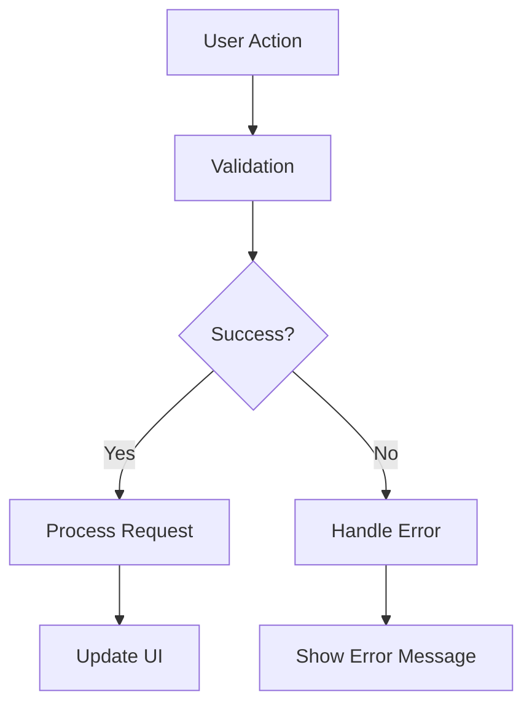

# Social Plus SDK Documentation Modernization Instructions

This document provides comprehensive instructions for modernizing and enhancing the Social Plus SDK documentation, with a focus on replacing legacy content with modern Mintlify MDX components and comprehensive developer-friendly documentation.

## Current Status

### Completed Files
- **Comments System** (All files completed):
  - `/social-plus-sdk/social/comments/README.mdx` ✅
  - `/social-plus-sdk/social/comments/create-comment.mdx` ✅
  - `/social-plus-sdk/social/comments/query-comment.mdx` ✅
  - `/social-plus-sdk/social/comments/mention-in-comment.mdx` ✅
  - `/social-plus-sdk/social/comments/delete-comment.mdx` ✅
  - `/social-plus-sdk/social/comments/edit-comment.mdx` ✅
  - `/social-plus-sdk/social/comments/flag-unflag.mdx` ✅
  - `/social-plus-sdk/social/comments/get-comment.mdx` ✅
  - `/social-plus-sdk/social/comments/get-latest-comment.mdx` ✅
  - `/social-plus-sdk/social/comments/get-comment-reaction-data.mdx` ✅
  - `/social-plus-sdk/social/comments/view-comment.mdx` ✅

- **Stories System** (Completed):
  - `/social-plus-sdk/social/stories/README.mdx` ✅
  - `/social-plus-sdk/social/stories/create-story.mdx` ✅ (Modernized - requires minor syntax cleanup)
  - `/social-plus-sdk/social/stories/get-stories.mdx` ✅
  - `/social-plus-sdk/social/stories/delete-story.mdx` ✅
  - `/social-plus-sdk/social/stories/get-global-story-targets.mdx` ✅
  - `/social-plus-sdk/social/stories/get-story-targets.mdx` ✅
  - `/social-plus-sdk/social/stories/story-impressions.mdx` ✅

- **Reactions System** (Completed):
  - `/social-plus-sdk/social/reactions/README.mdx` ✅
  - `/social-plus-sdk/social/reactions/add-remove-reaction.mdx` ✅
  - `/social-plus-sdk/social/reactions/query-reactions.mdx` ✅

- **Feed System** (Completed):
  - `/social-plus-sdk/social/feed/README.mdx` ✅
  - `/social-plus-sdk/social/feed/custom-post-ranking.mdx` ✅
  - `/social-plus-sdk/social/feed/query-global-feed.mdx` ✅

### Remaining Work

#### Next Priority (Social Module Core Features)
With the Stories, Reactions, Feed, Intelligent Search, Notification Tray, Follow/Unfollow, and Block/Unblock systems now complete, the Social module core features are fully modernized:

1. **`/social-plus-sdk/social/intelligent-search/`** - ✅ **COMPLETED** - All files modernized with multi-platform examples, architecture diagrams, and modern MDX components
2. **`/social-plus-sdk/social/notification-tray/`** - ✅ **COMPLETED** - All files modernized:
   - `/social-plus-sdk/social/notification-tray/README.mdx` ✅
   - `/social-plus-sdk/social/notification-tray/get-notification-tray-seen.mdx` ✅
   - `/social-plus-sdk/social/notification-tray/mark-notification-tray-item-seen.mdx` ✅
   - `/social-plus-sdk/social/notification-tray/mark-notification-tray-seen.mdx` ✅
   - `/social-plus-sdk/social/notification-tray/query-notification-tray-item.mdx` ✅
3. **`/social-plus-sdk/social/follow-unfollow/`** - ✅ **COMPLETED** - All files modernized:
   - `/social-plus-sdk/social/follow-unfollow/README.mdx` ✅
   - `/social-plus-sdk/social/follow-unfollow/accept-decline-follow-request.mdx` ✅
   - `/social-plus-sdk/social/follow-unfollow/follow-unfollow-user.mdx` ✅
   - `/social-plus-sdk/social/follow-unfollow/get-connection-status-and-connection-counter.mdx` ✅
   - `/social-plus-sdk/social/follow-unfollow/get-follower-following-list.mdx` ✅
4. **`/social-plus-sdk/social/block-and-unblock-user.mdx`** - ✅ **COMPLETED** - Individual file modernized with comprehensive MDX components, multi-platform code examples, architecture diagrams, and best practices


#### Future Expansion Areas
With the Social module core features now complete, these areas need modernization:


1. **Chat Module**:
   - `/social-plus-sdk/chat/` (entire directory structure)

2. **Video Module**:
   - `/social-plus-sdk/video/` (entire directory structure)


## Modernization Standards

### Replace Legacy Elements
- **Remove**: `<CodeBlock url="https://gist.github.com/..." />` 
- **Remove**: `<Frame></Frame>`
- **Replace with**: Inline code examples using `<CodeGroup>` and platform-specific tabs

### Required MDX Components
Use these modern MDX components consistently:

```mdx
<Tabs>
  <Tab title="iOS">
    <CodeGroup>
      ```swift Basic Example
      // Code here
      ```
      ```swift Advanced Example  
      // Code here
      ```
    </CodeGroup>
  </Tab>
  <Tab title="Android">
    <CodeGroup>
      ```kotlin Basic Example
      // Code here
      ```
      ```kotlin Advanced Example
      // Code here  
      ```
    </CodeGroup>
  </Tab>
  <Tab title="TypeScript">
    <CodeGroup>
      ```typescript Basic Example
      // Code here
      ```
      ```typescript React Hook Example
      // Code here
      ```
    </CodeGroup>
  </Tab>
  <Tab title="Flutter">
    <CodeGroup>
      ```dart Basic Example
      // Code here
      ```
      ```dart Provider Example
      // Code here
      ```
    </CodeGroup>
  </Tab>
</Tabs>

<CardGroup cols={2}>
  <Card title="Feature Name" icon="icon-name">
    Description of the feature
  </Card>
</CardGroup>

<AccordionGroup>
  <Accordion title="Parameter Name">
    **Type:** `string`
    Description and validation rules
  </Accordion>
</AccordionGroup>

<Note>
Important information that users should be aware of
</Note>

<Info>
Additional helpful information or tips
</Info>
```

### Content Structure Template

Each modernized file should include:

1. **Title and Introduction**
   - Clear, descriptive title
   - Brief overview of functionality
   - Key benefits and use cases

2. **Architecture Overview**
   - Mermaid diagram showing data flow
   - System interactions
   - Key components

3. **Feature Summary**
   - `<CardGroup>` highlighting main features
   - Icons and brief descriptions

4. **Implementation Sections**
   - Parameters with `<AccordionGroup>`
   - Multi-platform code examples with `<Tabs>` and `<CodeGroup>`
   - Basic and advanced usage patterns

5. **Best Practices**
   - `<AccordionGroup>` with practical guidelines
   - Performance optimization tips
   - Error handling strategies
   - UI/UX considerations

6. **Use Cases**
   - `<CardGroup>` with real-world scenarios
   - Implementation approaches
   - Business context

7. **Advanced Features** (when applicable)
   - Code examples for complex scenarios
   - Integration patterns
   - Optimization techniques

8. **Error Handling**
   - Common error scenarios
   - Recommended responses
   - Troubleshooting guide

### Code Quality Standards

#### Multi-Platform Coverage
Provide comprehensive examples for:
- **iOS**: Swift with UIKit/SwiftUI patterns
- **Android**: Kotlin with modern Android architecture
- **TypeScript**: React hooks and modern JS patterns  
- **Flutter**: Dart with Provider/Bloc patterns

#### Code Example Patterns
```typescript
// Basic implementation
class BasicExample {
    // Simple, clear implementation
}

// Advanced implementation with error handling
class AdvancedExample {
    // Comprehensive implementation with:
    // - Error handling
    // - Loading states  
    // - Performance optimization
    // - Real-world patterns
}

// React Hook example
const useFeature = () => {
    // Modern React patterns
    // Custom hook implementation
    // Type safety
}
```

#### Mermaid Diagrams
Use consistent mermaid diagram patterns:


## Completion Instructions

### For Immediate Work (story-impressions.mdx)

**Modernize `/social-plus-sdk/social/stories/story-impressions.mdx`:**
1. Replace all Gist/iframe embeds with inline code examples
2. Add architecture overview with mermaid diagram
3. Include feature summary with CardGroup
4. Add comprehensive parameters documentation
5. Provide multi-platform code examples (iOS, Android, TypeScript, Flutter)
6. Include best practices for impression tracking
7. Add use cases for analytics and engagement tracking
8. Cover error handling and edge cases
9. Address performance considerations for impression data

**Key Features to Document:**
- `markAsSeen()` function - Track story views
- `markLinkAsClicked()` function - Track link engagement  
- `queryReachedUsers()` function - Get viewer analytics
- Real-time vs near-real-time data considerations
- Impression vs reach metrics explanation
- Analytics integration patterns

### For Future Work

**Priority Order:**
1. Complete remaining stories module
2. Social module core features (posts, reactions, communities)
3. Chat module comprehensive coverage
4. Core concepts and advanced features
5. Video and UIKit modules

**When Starting New Modules:**
1. Review existing structure and identify all files
2. Read current content to understand functionality
3. Create modernization plan for the entire module
4. Work systematically through each file
5. Maintain consistency with completed modules
6. Test MDX compilation after each file

### Quality Checklist

Before completing any file, verify:
- [ ] All Gist/iframe embeds removed
- [ ] Architecture diagram included
- [ ] Feature summary with CardGroup
- [ ] Multi-platform code examples (iOS, Android, TypeScript, Flutter)
- [ ] Parameters documented with AccordionGroup
- [ ] Best practices section included
- [ ] Use cases with CardGroup
- [ ] Error handling covered
- [ ] Performance considerations addressed
- [ ] MDX components used consistently
- [ ] Code examples are practical and complete
- [ ] Documentation is developer-friendly

## Additional Context

### Project Goals
- Replace legacy documentation with modern, developer-friendly content
- Provide comprehensive multi-platform coverage
- Include practical, real-world code examples
- Maintain consistency across all documentation
- Enable developers to quickly implement features
- Provide architectural context and best practices

### Documentation Philosophy
- **Practical**: Focus on real-world implementation
- **Comprehensive**: Cover all platforms and use cases
- **Consistent**: Use standardized patterns and components
- **Accessible**: Clear explanations and examples
- **Modern**: Use latest MDX capabilities and design patterns

### Success Metrics
- All legacy Gist/iframe embeds replaced
- Comprehensive multi-platform coverage
- Consistent MDX component usage
- Practical, implementable code examples
- Clear architectural documentation
- Developer-friendly explanations

This instructions file should be used as the primary reference for continuing the documentation modernization work. Each new conversation should reference these instructions to maintain consistency and quality standards.
