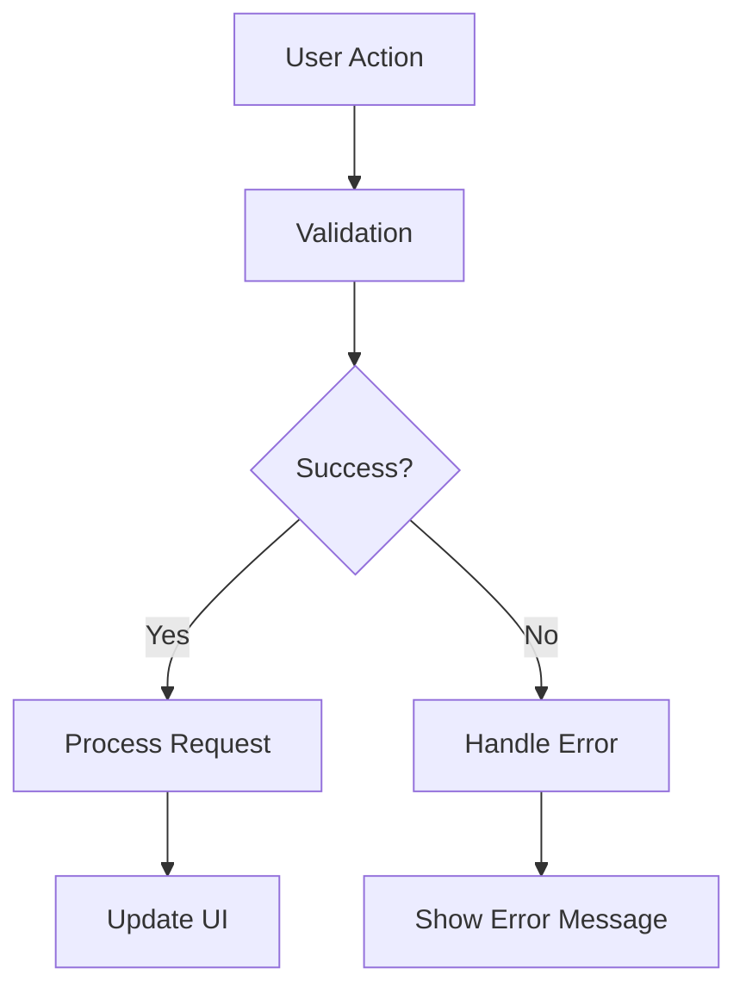

# Social Plus SDK Documentation Modernization Instructions

This document provides comprehensive instructions for modernizing and enhancing the Social Plus SDK documentation, with a focus on replacing legacy content with modern Mintlify MDX components and comprehensive developer-friendly documentation.

## 🎉 MAJOR RESTRUCTURING COMPLETED

### ✅ Social Module Complete Reorganization (DONE)

The Social module has been completely restructured into a logical, workflow-based organization that eliminates scattered functionality and creates intuitive navigation:

#### 🔄 **NEW STRUCTURE** (All files moved and organized):

1. **📁 Content Management** (`/social-plus-sdk/social/content-management/`)
   - **Posts** (`posts/`):
     - `creation/` - All post creation types (text, image, video, poll, etc.)
     - `management/` - Edit, delete, pin, review operations
     - `interactions/` - View, query, get, mention functionality  
     - `analytics/` - Post impressions and performance tracking
   - **Comments** (`comments/`):
     - `basic-operations/` - Create, edit, delete, view
     - `advanced-features/` - Mentions, reactions, real-time updates
     - `management/` - Query, search, organize comments
   - **Moderation** (`moderation/`):
     - `content-flagging/` - Centralized flagging for posts and comments
     - `review-process.mdx` - Structured moderation workflows

2. **📁 Communities & Spaces** (`/social-plus-sdk/social/communities-spaces/`)
   - `community-lifecycle/` - Create, update, delete, health monitoring
   - `membership/` - Join/leave, member queries, roles & permissions
   - `organization/` - Categories, structure, navigation systems
   - `discovery/` - Query, get, trending communities
   - `governance/` - Moderation, guidelines, conflict resolution

3. **📁 Discovery & Engagement** (`/social-plus-sdk/social/discovery-engagement/`)
   - `feed/` - Global feeds, custom ranking (moved from `/feed/`)
   - `search/` - Intelligent search (moved from `/intelligent-search/`)
   - `reactions/` - Add/remove, query reactions (moved from `/reactions/`)
   - `notifications/` - Notification tray (moved from `/notification-tray/`)
   - `stories/` - Create, delete, get stories (moved from `/stories/`)

4. **📁 User Interactions** (`/social-plus-sdk/social/user-interactions/`) - ALREADY COMPLETED
   - `follow-system/` - Follow/unfollow, requests, status, lists
   - `blocking-system/` - Block/unblock, manage blocked users

#### 🔧 **Key Improvements Made**:
- ✅ **Eliminated "README" naming** - All files now use descriptive `overview.mdx` names
- ✅ **Logical grouping** - Related functionality grouped by workflow, not technical boundaries  
- ✅ **Centralized moderation** - All flagging and moderation in one place
- ✅ **Better context** - Comments now contextually part of content management
- ✅ **Reduced duplication** - No more scattered flagging across multiple sections
- ✅ **Scalable structure** - Easy to add features without disrupting organization

#### 📋 **Navigation Updated**:
- ✅ **docs.json completely updated** with new structure
- ✅ **All file paths corrected** in navigation
- ✅ **Proper overview files created** for each section
- ✅ **Cross-references updated** between related sections

#### 🎯 **Token Limit Mitigation Strategies**:

To prevent future token limit issues when working on this documentation:

1. **Work in Focused Chunks**:
   - Focus on one major section at a time (e.g., just Content Management)
   - Work on subsections independently (e.g., just Posts → Creation)
   - Reference the completed structure below instead of re-analyzing

2. **Use Structure References**:
   - Reference this instruction file for current state
   - Use file searches to locate specific files instead of full workspace scans
   - Focus semantic searches on specific directories when needed

3. **Prioritize by Impact**:
   - **High Priority**: Content Management (most used features)
   - **Medium Priority**: Discovery & Engagement (user-facing features)  
   - **Low Priority**: Communities & Spaces (administrative features)

### 🎯 NEXT STEPS FOR CONTINUATION

When resuming work on this documentation:

1. **Content Enhancement** (Next Phase):
   - Modernize individual MDX files with better components
   - Add more code examples and implementation guides
   - Enhance existing overview files with architecture diagrams
   - Add troubleshooting and best practices sections

2. **Chat Module** (Future):
   - Apply same restructuring principles to Chat module
   - Organize by messaging workflows rather than technical boundaries

3. **Video Module** (Future):
   - Structure video features by use case (calling, streaming, recording)

### Current Status: ✅ RESTRUCTURING PHASE COMPLETE

**What's Done**:
- ✅ Complete Social module restructuring
- ✅ All files moved to logical locations  
- ✅ Navigation updated in docs.json
- ✅ Overview files created for all major sections
- ✅ Token-efficient workflow documented

**What's Next**:
- 🔄 Individual file modernization within new structure
- 🔄 Enhanced code examples and implementation guides
- 🔄 Chat module restructuring (future)

---

## Legacy Completed Work (Pre-Restructuring)

### Previously Completed Files (Now Moved/Integrated)
     - `/social-plus-sdk/social/user-interactions/follow-system/get-connection-status.mdx` ✅ (renamed)
     - `/social-plus-sdk/social/user-interactions/follow-system/get-follower-following-list.mdx` ✅
   - **Blocking System** (moved from standalone file):
     - `/social-plus-sdk/social/user-interactions/blocking-system/README.mdx` ✅
     - `/social-plus-sdk/social/user-interactions/blocking-system/block-unblock-user.mdx` ✅ (renamed)
     - `/social-plus-sdk/social/user-interactions/blocking-system/manage-blocked-users.mdx` ✅ (new)

2. **Enhanced Navigation** - ✅ **COMPLETED**:
   - Updated `docs.json` with logical grouping:
     - **User Interactions** → Follow System + Blocking System
     - **Content Discovery** → Feeds & Timelines + Search & Intelligence  
     - **Engagement** → Reactions + Notifications + Stories
   - Improved file naming consistency
   - Added comprehensive cross-references

3. **Content Enhancements** - ✅ **COMPLETED**:
   - Enhanced main Social README with architecture diagrams and workflows
   - Created comprehensive hub pages for each major section
   - Added integration examples and best practices
   - Improved developer onboarding experience

#### Remaining Work

#### Next Priority (Continue Social Module Enhancement)
With the core structure complete, focus on content modernization:

1. **Posts Module Enhancement** (Priority Next):
   - `/social-plus-sdk/social/posts/` - Modernize all post creation and management files
   - Update create-post subdirectory with modern examples
   - Add comprehensive multi-platform code examples

2. **Communities Module Enhancement**:
   - `/social-plus-sdk/social/communities/` - Modernize community management features
   - Add community moderation best practices
   - Enhance community discovery and management guides


1. **Chat Module**:
   - `/social-plus-sdk/chat/` (entire directory structure)

2. **Video Module**:
   - `/social-plus-sdk/video/` (entire directory structure)


## Modernization Standards

### Replace Legacy Elements
- **Remove**: `<CodeBlock url="https://gist.github.com/..." />` 
- **Remove**: `<Frame></Frame>`
- **Replace with**: Inline code examples using `<CodeGroup>` and platform-specific tabs

### Required MDX Components
Use these modern MDX components consistently:

```mdx
<Tabs>
  <Tab title="iOS">
    <CodeGroup>
      ```swift Basic Example
      // Code here
      ```
      ```swift Advanced Example  
      // Code here
      ```
    </CodeGroup>
  </Tab>
  <Tab title="Android">
    <CodeGroup>
      ```kotlin Basic Example
      // Code here
      ```
      ```kotlin Advanced Example
      // Code here  
      ```
    </CodeGroup>
  </Tab>
  <Tab title="TypeScript">
    <CodeGroup>
      ```typescript Basic Example
      // Code here
      ```
      ```typescript React Hook Example
      // Code here
      ```
    </CodeGroup>
  </Tab>
  <Tab title="Flutter">
    <CodeGroup>
      ```dart Basic Example
      // Code here
      ```
      ```dart Provider Example
      // Code here
      ```
    </CodeGroup>
  </Tab>
</Tabs>

<CardGroup cols={2}>
  <Card title="Feature Name" icon="icon-name">
    Description of the feature
  </Card>
</CardGroup>

<AccordionGroup>
  <Accordion title="Parameter Name">
    **Type:** `string`
    Description and validation rules
  </Accordion>
</AccordionGroup>

<Note>
Important information that users should be aware of
</Note>

<Info>
Additional helpful information or tips
</Info>
```

### Content Structure Template

Each modernized file should include:

1. **Title and Introduction**
   - Clear, descriptive title
   - Brief overview of functionality
   - Key benefits and use cases

2. **Architecture Overview**
   - Mermaid diagram showing data flow
   - System interactions
   - Key components

3. **Feature Summary**
   - `<CardGroup>` highlighting main features
   - Icons and brief descriptions

4. **Implementation Sections**
   - Parameters with `<AccordionGroup>`
   - Multi-platform code examples with `<Tabs>` and `<CodeGroup>`
   - Basic and advanced usage patterns

5. **Best Practices**
   - `<AccordionGroup>` with practical guidelines
   - Performance optimization tips
   - Error handling strategies
   - UI/UX considerations

6. **Use Cases**
   - `<CardGroup>` with real-world scenarios
   - Implementation approaches
   - Business context

7. **Advanced Features** (when applicable)
   - Code examples for complex scenarios
   - Integration patterns
   - Optimization techniques

8. **Error Handling**
   - Common error scenarios
   - Recommended responses
   - Troubleshooting guide

### Code Quality Standards

#### Multi-Platform Coverage
Provide comprehensive examples for:
- **iOS**: Swift with UIKit/SwiftUI patterns
- **Android**: Kotlin with modern Android architecture
- **TypeScript**: React hooks and modern JS patterns  
- **Flutter**: Dart with Provider/Bloc patterns

#### Code Example Patterns
```typescript
// Basic implementation
class BasicExample {
    // Simple, clear implementation
}

// Advanced implementation with error handling
class AdvancedExample {
    // Comprehensive implementation with:
    // - Error handling
    // - Loading states  
    // - Performance optimization
    // - Real-world patterns
}

// React Hook example
const useFeature = () => {
    // Modern React patterns
    // Custom hook implementation
    // Type safety
}
```

#### Mermaid Diagrams
Use consistent mermaid diagram patterns:


## Completion Instructions

### For Immediate Work (story-impressions.mdx)

**Modernize `/social-plus-sdk/social/stories/story-impressions.mdx`:**
1. Replace all Gist/iframe embeds with inline code examples
2. Add architecture overview with mermaid diagram
3. Include feature summary with CardGroup
4. Add comprehensive parameters documentation
5. Provide multi-platform code examples (iOS, Android, TypeScript, Flutter)
6. Include best practices for impression tracking
7. Add use cases for analytics and engagement tracking
8. Cover error handling and edge cases
9. Address performance considerations for impression data

**Key Features to Document:**
- `markAsSeen()` function - Track story views
- `markLinkAsClicked()` function - Track link engagement  
- `queryReachedUsers()` function - Get viewer analytics
- Real-time vs near-real-time data considerations
- Impression vs reach metrics explanation
- Analytics integration patterns

### For Future Work

**Priority Order:**
1. Complete remaining stories module
2. Social module core features (posts, reactions, communities)
3. Chat module comprehensive coverage
4. Core concepts and advanced features
5. Video and UIKit modules

**When Starting New Modules:**
1. Review existing structure and identify all files
2. Read current content to understand functionality
3. Create modernization plan for the entire module
4. Work systematically through each file
5. Maintain consistency with completed modules
6. Test MDX compilation after each file

### Quality Checklist

Before completing any file, verify:
- [ ] All Gist/iframe embeds removed
- [ ] Architecture diagram included
- [ ] Feature summary with CardGroup
- [ ] Multi-platform code examples (iOS, Android, TypeScript, Flutter)
- [ ] Parameters documented with AccordionGroup
- [ ] Best practices section included
- [ ] Use cases with CardGroup
- [ ] Error handling covered
- [ ] Performance considerations addressed
- [ ] MDX components used consistently
- [ ] Code examples are practical and complete
- [ ] Documentation is developer-friendly

## Additional Context

### Project Goals
- Replace legacy documentation with modern, developer-friendly content
- Provide comprehensive multi-platform coverage
- Include practical, real-world code examples
- Maintain consistency across all documentation
- Enable developers to quickly implement features
- Provide architectural context and best practices

### Documentation Philosophy
- **Practical**: Focus on real-world implementation
- **Comprehensive**: Cover all platforms and use cases
- **Consistent**: Use standardized patterns and components
- **Accessible**: Clear explanations and examples
- **Modern**: Use latest MDX capabilities and design patterns

### Success Metrics
- All legacy Gist/iframe embeds replaced
- Comprehensive multi-platform coverage
- Consistent MDX component usage
- Practical, implementable code examples
- Clear architectural documentation
- Developer-friendly explanations

This instructions file should be used as the primary reference for continuing the documentation modernization work. Each new conversation should reference these instructions to maintain consistency and quality standards.

# Social Plus SDK Documentation Structure

## Overview
This document describes the current organizational structure of the Social Plus SDK documentation, which has been modernized and restructured for better developer experience, logical grouping, and scalability.

## Recent Changes - Core Concepts Module ✅ COMPLETED

### New Core Concepts Structure
The core-concepts module has been completely restructured into four workflow-based categories:

#### 1. Foundation (`/social-plus-sdk/core-concepts/foundation/`)
- **Purpose**: SDK fundamentals and infrastructure
- **Contents**: 
  - `overview.mdx` - Foundation concepts overview
  - `core-concept.mdx` - Basic SDK architecture and principles
  - `session-state.mdx` - Session management and lifecycle
  - `error-handling.mdx` - Error handling patterns and best practices
  - `logging.mdx` - Debugging and monitoring tools

#### 2. User Management (`/social-plus-sdk/core-concepts/user-management/`)
- **Purpose**: Complete user lifecycle and safety management
- **Contents**:
  - `overview.mdx` - User management overview
  - `user-lifecycle.mdx` - User lifecycle stages and transitions
  - `user-creation.mdx` - Creating and registering users
  - `user-authentication.mdx` - Authenticating users and managing sessions
  - `user-roles-permissions.mdx` - Role-based access control and permissions
  - `user-data-management.mdx` - Managing user data and privacy
  - `user-notifications.mdx` - User notifications and messaging

#### 3. Content Management (`/social-plus-sdk/core-concepts/content-management/`)
- **Purpose**: Managing and moderating user-generated content
- **Contents**:
  - `overview.mdx` - Content management overview
  - `content-creation.mdx` - Creating and publishing content
  - `content-moderation.mdx` - Moderating and managing content
  - `content-analytics.mdx` - Analyzing content performance and engagement

#### 4. Social Graph (`/social-plus-sdk/core-concepts/social-graph/`)
- **Purpose**: Understanding and utilizing the social graph
- **Contents**:
  - `overview.mdx` - Social graph overview
  - `graph-structure.mdx` - Structure and components of the social graph
  - `graph-queries.mdx` - Querying the social graph
  - `graph-algorithms.mdx` - Algorithms for social graph analysis
  - `graph-security.mdx` - Securing the social graph and user data

### Key Improvements
- **Workflow-Based Organization**: Restructured around key workflows: Foundation, User Management, Content Management, and Social Graph
- **Comprehensive Coverage**: Complete coverage of all core concepts with detailed explanations and examples
- **Improved Navigation**: Logical progression through core concepts with clear dependencies and relationships
- **Enhanced Discoverability**: Better discoverability of related concepts and features

### Navigation Updates
- Updated `docs.json` with the new hierarchical structure
- Improved grouping and ordering of core concepts
- Added proper cross-references and links between related concepts

## Recent Changes - Getting Started Module ✅ COMPLETED

### Enhanced Getting Started Structure
The getting-started module has been enhanced with better organization and workflow-based navigation:

#### New Structure
```
/social-plus-sdk/getting-started/
├── overview.mdx (modernized quick start guide)
├── authentication.mdx (detailed auth concepts)
├── platform-setup/ (organized by development approach)
│   ├── overview.mdx (platform comparison and selection guide)
│   ├── mobile/ (native mobile development)
│   │   ├── overview.mdx (mobile-specific features and best practices)
│   │   ├── install-ios.mdx (iOS installation guide)
│   │   └── install-android.mdx (Android installation guide)
│   ├── web/ (web application development)
│   │   ├── overview.mdx (web development features and frameworks)
│   │   └── install-web.mdx (TypeScript/JavaScript installation)
│   └── cross-platform/ (shared codebase development)
│       ├── overview.mdx (cross-platform comparison and best practices)
│       ├── install-react-native.mdx (React Native installation)
│       └── install-flutter.mdx (Flutter installation)
└── verification/ (post-installation validation)
    ├── overview.mdx (comprehensive verification guide with examples)
    └── first-integration.mdx (step-by-step first feature implementation)
```

#### Key Improvements
1. **Platform-Based Organization**: Installation guides grouped by development approach (Mobile, Web, Cross-platform)
2. **Comprehensive Overviews**: Detailed overview pages for each platform category with:
   - Feature comparisons and capabilities
   - Development requirements and best practices
   - Architecture explanations and considerations
   - Performance and deployment guidance
3. **Verification & Testing**: New section to help developers confirm their installation works
4. **First Integration Guide**: Step-by-step examples for building first features
5. **Enhanced Navigation**: Logical progression from overview → platform selection → installation → verification → first implementation

#### Features Added
- **Platform Comparison Tables**: Help developers choose the right platform
- **Complete Code Examples**: Full working examples for user profiles and simple chat
- **Troubleshooting Guides**: Common issues and solutions for each platform
- **Best Practices**: Production-ready development practices and security considerations
- **Verification Scripts**: Platform-specific verification code to test SDK installation

### Navigation Updates
- Updated `docs.json` with the new hierarchical structure
- Maintained backward compatibility while improving logical flow
- Added proper groupings for better discoverability

---

## 🎉 CHAT MODULE COMPLETE RESTRUCTURING (DONE)

### ✅ Chat Module Workflow-Based Reorganization 

The Chat module has been completely restructured from a technical feature-based organization to a workflow-based, developer-friendly structure that mirrors the successful Social module pattern.

#### 🔄 **TRANSFORMATION OVERVIEW**

**Before**: Technical groupings (channels/, messaging/, moderation/)
**After**: Workflow-based organization (conversation-management/, messaging-features/, engagement-features/, moderation-safety/)

#### 🔧 **NEW STRUCTURE** (All files moved and organized):

1. **📁 Conversation Management** (`/social-plus-sdk/chat/conversation-management/`)
   - **Channel Management** (`channels/`):
     - Channel creation, retrieval, updates, archival, and querying
     - Files: `create-channel.mdx`, `get-channels.mdx`, `update-channel.mdx`, `archive-channels.mdx`, `query-channels.mdx`
   - **Member Management** (`members/`):
     - Member operations, joining/leaving, member queries and search
     - Files: `join-leave-channel.mdx`, `query-members.mdx`, `search-members.mdx`
   - **Subchannels** (`subchannels/`):
     - Hierarchical conversation organization
     - Files: `subchannel.mdx`

2. **📁 Messaging Features** (`/social-plus-sdk/chat/messaging-features/`)
   - **Message Management** (`messages/`):
     - Core message operations, reactions, mentions, flagging
     - Files: `get-and-view-a-message.mdx`, `edit-and-delete-messages.mdx`, `query-and-filter-messages.mdx`, `message-reaction.mdx`, `mention-in-messages.mdx`, `flag-unflag-a-message.mdx`
   - **Message Types** (`message-types/`):
     - All message format support (text, media, files, custom)
     - Files: `text-message.mdx`, `image-message.mdx`, `video-message.mdx`, `audio-message.mdx`, `file-message.mdx`, `custom-message.mdx`, `reply-to-a-message.mdx`

3. **📁 Engagement Features** (`/social-plus-sdk/chat/engagement-features/`)
   - **Message Previews**: Quick message glimpses for better UX
   - **Unread Status & Read Receipts** (`unread-status/`):
     - Comprehensive read status tracking at channel, user, and message levels
     - Files: `channel-unread-count.mdx`, `user-unread-count.mdx`, `mark-channel-as-read.mdx`, `mark-message-as-read.mdx`, `message-delivery-status.mdx`, `start-stop-message-read-receipt-sync.mdx`, `observe-reading-count.mdx`, `subchannel-unread-count.mdx`, `read-status-and-unread-count-legacy.mdx`

4. **📁 Moderation & Safety** (`/social-plus-sdk/chat/moderation-safety/`)
   - **Member Management** (`member-management/`):
     - Member moderation actions (ban, mute, roles)
     - Files: `ban-unban-a-list-of-channel-members.mdx`, `mute-unmute-a-list-of-channel-members.mdx`, `roles-and-permission.mdx`
   - **Content Moderation** (`content-moderation/`):
     - Content quality and safety controls
     - Files: `channel-rate-limiting.mdx`, `channel-moderation.mdx`

#### 🎯 **Key Improvements Made**:

1. **Workflow-Based Organization**: 
   - Structured around developer workflows (conversation setup → messaging → engagement → safety)
   - Eliminates technical silos in favor of logical feature groupings

2. **Comprehensive Overview System**:
   - Created `overview.mdx` files for all sections and subsections
   - Each overview includes CardGroups, use cases, best practices, and implementation guidance
   - Consistent modern MDX components throughout

3. **Modernized Main Overview**:
   - Replaced legacy README with modern `overview.mdx`
   - Added CardGroup navigation, key capabilities, getting started steps
   - Included common use cases and developer-friendly tips

4. **Enhanced Navigation Structure**:
   - Updated `docs.json` with hierarchical organization
   - Logical groupings that mirror the workflow-based approach
   - Clear progression from basic to advanced features

5. **File Organization**:
   - Moved all files to appropriate workflow-based directories
   - Maintained all existing content while improving structure
   - Cleaned up legacy directories and README files

#### 🏆 **Benefits Achieved**:

- **Developer Experience**: Clear workflow-based navigation that matches how developers actually build chat features
- **Logical Progression**: Natural flow from conversation setup to advanced features
- **Reduced Confusion**: Eliminated scattered features across technical boundaries
- **Consistent Patterns**: Mirrors successful Social module structure for familiarity
- **Scalable Structure**: Easily extensible for future chat features

#### 📋 **Files Successfully Moved**:

- **Channel files**: All moved to `conversation-management/channels/`
- **Member files**: All moved to `conversation-management/members/`
- **Subchannel files**: All moved to `conversation-management/subchannels/`
- **Message files**: Core operations moved to `messaging-features/messages/`
- **Message type files**: All moved to `messaging-features/message-types/`
- **Unread status files**: All moved to `engagement-features/unread-status/`
- **Moderation files**: Split between `moderation-safety/member-management/` and `moderation-safety/content-moderation/`

### Navigation Updates
- Updated `docs.json` with complete new Chat structure
- Added hierarchical groupings with proper overview files
- Maintained all existing content while improving organization

---
