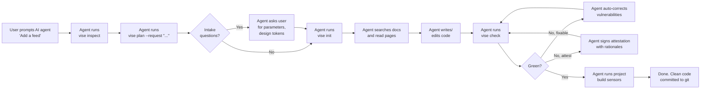

**social.plus Vise** is a developer tool and AI skill that wraps coding agents in deterministic compliance guardrails when they integrate social.plus SDKs. It inspects your project, grounds the agent in documentation, enforces 250+ platform-specific compliance rules, and runs your project's own build/lint/typecheck sensors.

**Your source code remains entirely on your machine.**

---

## Why "Vise"?

A bench vise holds the workpiece steady so the craftsman's hands are free to shape it. Without one, the workpiece drifts and cuts wander. Vise does the same for AI agents: it clamps the integration to a known-good position (the real docs, the real project structure, the real compliance rules) so the agent can focus on creative coding instead of guessing.

---

## Pilot Performance Benchmarks

In v0.8 pilot runs (Next.js/React - "add comments" task), Vise-driven AI agents achieved first-try success rates far exceeding unconstrained AI agents:

| Metric | Without Vise (Pure MCP) | With Vise (CLI + Skill) | Improvement |
| :--- | :---: | :---: | :---: |
| **CI Pass Rate** | ❌ 0% (Fails CI) | ✅ 100% (Passes CI) | **+100%** pass rate |
| **Vulnerabilities** | Hardcoded IDs, no auth | 0 findings | **100%** secure |
| **Average Issues** | 4 – 7 per run | 1 per run | **−86%** fewer bugs |
| **Token Cost** | $0.0108 | $0.0024 | **−78%** cheaper |
| **Token Count** | 36,219 tokens | 8,733 tokens | **−76%** fewer tokens |
| **Wall-clock Speed** | 619s | 447s | **−28%** faster |

---

## Supported Platforms

Vise enforces 50–55 rules across 10 compliance domains (feed, comments, moderation, chat, secrets, session & auth, notifications, live objects, logging hygiene, design tokens) for the following:

- **TypeScript / Next.js / React** (Sensors: `tsc`, `npm build`, `npm lint`, SDK import smoke)
- **React Native** (Sensors: `tsc`, `npm lint`, SDK import smoke)
- **Flutter / Dart** (Sensors: `flutter analyze`, `flutter test`)
- **Android (Kotlin)** (Sensors: Gradle compile/assemble, unit tests)
- **iOS (Swift)** (Sensors: static rules validation, runtime checks WIP)

---

## Quick Start

Follow these three steps to integrate Vise in your AI developer workflow:

<Steps>
  <Step title="Install the Vise CLI">
    Install the package globally using npm:
    ```bash
    npm install -g @amityco/social-plus-vise
    vise doctor
    ```
    *(Alternatively, install it in your project devDependencies with `npm install -D @amityco/social-plus-vise` and run with `npx vise`)*.
  </Step>
  <Step title="Install the AI Skill into your Editor">
    Run the command matching your coding workspace editor:
    ```bash
    vise install-skill --target claude        # Claude Code (personal)
    vise install-skill --target cursor .      # Cursor (project-local)
    vise install-skill --target vscode .      # GitHub Copilot / VS Code
    ```
    This writes the Vise instruction skill into your workspace configuration. The skill teaches your AI agent how and when to use Vise.
  </Step>
  <Step title="Prompt your AI Agent">
    Open your AI chat editor and prompt it to integrate features using the social.plus SDK.
    
    *Example Prompt:*
    > "Add a community social feed to the Dashboard page using the social.plus SDK."
    
    The AI agent will read the skill and automatically execute the Vise workflow: `inspect` → `plan` → `init` → write code → `check` → `run-sensors`.
  </Step>
</Steps>

---

## Integration Workflow Flowchart

Below is the automated workflow that the Vise skill teaches your AI coding agent:



## Next Guides

<CardGroup cols={1}>
  <Card title="CLI Reference" icon="rectangle-terminal" href="/ai-mcp/vise-cli">
    See syntax and details for all Vise CLI command operations.
  </Card>
</CardGroup>
