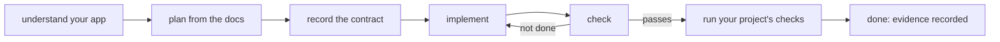

Vise turns your feature request into a grounded plan, records what "done" means for it, and keeps checking the generated code until the integration is finished — where finished means verified, explained with evidence, intentionally scoped out, or explicitly waiting on your decision. Never just "the agent stopped."

## The loop your agent follows

The [skill](/ai-mcp/vise/overview#get-started) drives your agent through the same loop on every integration:



- **Understand your app** — detect the platform, the app surfaces in a monorepo, design signals, and which of your project's own checks are available. In a very large repository, the agent confirms which concrete app it's working in before continuing.
- **Plan from the docs** — produce a plan with social.plus docs citations, plus the questions the agent must ask you rather than guess.
- **Record the contract** — once you've answered, the expectations for this feature are written down (see below).
- **Implement** — the agent edits your app, held to real SDK APIs.
- **Check** — the code is validated against the recorded contract; the agent iterates until it passes.
- **Run your project's checks** — your repository's own build, lint, typecheck, and SDK smoke checks.

## What Vise checks

Vise focuses on the mistakes that pass a demo and break in production:

- **SDK grounding** — the agent is held to real, source-anchored SDK facts (actual types and field names), so it won't invent a symbol the SDK doesn't expose.
- **Platform correctness** — 400+ platform-specific checks: SDK setup and region, session renewal and login lifecycle, secret handling and committed environment files, Live Object and Live Collection usage, and feed, comment, chat, notification, community, follow, story, and moderation patterns.
- **Feature completeness** — the whole outcome, including pagination, empty and error states, and the optional capabilities you asked for — not just the happy path.
- **Design and experience** — generated UI reviewed against your design system. This layer is **advisory**; brand fit still needs human judgment.
- **Project sensors** — your repository's own build, lint, typecheck, and SDK import smoke checks.

Deterministic SDK correctness and explicit completeness decisions are the checks that block. Design and experience guidance stays advisory.

## The `sp-vise/` folder

The recorded contract, its check results, and all supporting evidence live in a small `sp-vise/` folder in your repo. Commit it with your app: it's what lets a reviewer see *why* the integration is trustworthy — and what lets CI keep verifying the work after the chat transcript is long gone.

## What your agent will report

Every check ends in one of these states. Your agent will name them when it reports back, so here's what each one means for you:

| State | Meaning | What you do |
| --- | --- | --- |
| `green` | Every applicable check passes | Accept the integration |
| `needs-attestation` | A rule is satisfied through architecture the automatic check can't see | Let the agent record evidence and a rationale, then review it |
| `deterministic-failures` | A rule failed in the code | Nothing — the agent fixes and re-checks |
| `completeness-gap` | The feature you asked for isn't fully built yet | Nothing — the agent keeps going, or asks you to drop scope explicitly |
| `selected-capability-failures` | An optional capability you chose isn't satisfied | Decide: finish it, or intentionally drop it |
| `blocked` | A decision only your team can make is missing | Answer the question |
| `contract-drift` | The code no longer matches what was recorded | Decide with the agent: re-plan, or restore the code |
| `runtime-proof-waived` | On-device runtime proof was honestly waived | Accept the recorded waiver, or ask for a real run |
| `no-platform` | No supported platform was detected | Nothing to validate here |
| `engagement-drift` | Current work is fine, but a previously finished feature no longer holds | Re-open the drifted feature or accept the documented change |

## Evidence instead of "trust me"

Three kinds of proof accumulate in `sp-vise/` as the agent works:

- **Attestations.** Some correct code passes through indirection a static check can't follow — a helper module, a wrapper, a pattern unique to your codebase. Instead of failing silently or passing blindly, the agent records *why* the rule is satisfied, with evidence and a rationale you can audit.
- **Runtime proof.** For user-visible surfaces, Vise can assess a captured app-launch log into a pass/fail verdict — did the screen mount, authenticate, and load data? When no device or emulator is available, an explicit waiver is recorded instead of a silent pass.
- **Deterministic passes.** After a green check, the passing evidence itself is persisted, so review doesn't depend on re-running anything.

Reviewers can inspect all of it with a few read-only commands — see the [reference](/ai-mcp/vise/cli-reference).

## Adding features later

The second feature is governed as carefully as the first, whether the existing integration was built by hand or through Vise — and earlier finished features stay recorded and re-verifiable. See [Adding to an existing app](/ai-mcp/vise/brownfield-day2).

## Vise in CI

After the first successful integration, commit `sp-vise/` and add one read-only command to your pipeline:

```sh
vise check --ci
```

It verifies the active contract *and* re-verdicts every previously finished feature, failing the build unless all governed work still holds. Baseline behavior for pre-existing codebases and per-feature re-verification are covered in the [reference](/ai-mcp/vise/cli-reference).

## Related

<CardGroup cols={2}>
  <Card title="Vise overview" icon="shield-check" href="/ai-mcp/vise/overview">
    Install Vise and ask for your first feature.
  </Card>
  <Card title="For reviewers and CI" icon="terminal" href="/ai-mcp/vise/cli-reference">
    The commands for verifying recorded evidence and gating releases.
  </Card>
  <Card title="Live Objects and Collections" icon="radio" href="/social-plus-sdk/core-concepts/realtime-communication/live-objects-collections/overview">
    Build realtime SDK features with the correct lifecycle.
  </Card>
  <Card title="Authentication" icon="key" href="/social-plus-sdk/getting-started/authentication">
    User login, session renewal, and regional configuration.
  </Card>
</CardGroup>
