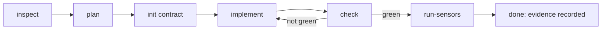

Vise turns an SDK request into a grounded plan, records a local contract, and keeps checking the generated code until the integration is finished — where "finished" means green, attested with evidence, intentionally scoped, or explicitly blocked on your input, not just "the agent stopped."

## The governed loop

The bundled [skill](/ai-mcp/vise/overview#install-the-ai-skill) drives your AI agent through the same loop on every integration:



- **inspect** — detect the platform, monorepo surfaces, design signals, and available sensors.
- **plan** — produce a grounded plan with docs citations and the project-specific questions the agent must not guess.
- **init** — write the local compliance contract under `sp-vise/` once blocking questions are answered.
- **implement** — the agent edits your app, grounded in real SDK APIs.
- **check** — re-validate the code against the recorded contract.
- **run-sensors** — run your project's own build, lint, typecheck, and SDK smoke checks.

## What Vise checks

Vise focuses on the mistakes that pass a demo and break in production:

- **SDK grounding** — the agent is held to real, source-anchored SDK facts (actual types and field names), so it won't invent a symbol the SDK doesn't expose.
- **Platform correctness** — 400+ platform-specific checks: SDK setup and region, session renewal and login lifecycle, secret handling and committed environment files, Live Object and Live Collection usage, and feed, comment, chat, notification, community, follow, story, and moderation patterns.
- **Feature completeness** — the whole outcome, including pagination, empty and error states, and the optional capabilities you asked for — not just the happy path.
- **Design and experience** — generated UI reviewed against your design system. This layer is **advisory**; brand fit still needs human judgment.
- **Project sensors** — your repository's own build, lint, typecheck, and SDK import smoke checks.

Deterministic SDK correctness and explicit completeness decisions are the checks that block. Design and experience guidance stays advisory.

## The `sp-vise/` contract

`vise init` writes a local contract directory, `sp-vise/`, that records what the integration is expected to satisfy for the detected platform and requested outcome. Subsequent `vise check` runs validate the current code against it. Commit `sp-vise/` with your app so the same expectations run in review and in CI.

## Reading a check result

`vise check` reports one of the following states:

| Result | Meaning | What to do |
| --- | --- | --- |
| `green` | Every applicable check passes | Accept the integration |
| `needs-attestation` | A rule passed through architecture the deterministic check can't see | Record an attestation with evidence (see below) |
| `deterministic-failures` | A rule failed deterministically in the code | Fix the code and re-check |
| `completeness-gap` | The requested outcome isn't fully covered yet | Implement the missing surface or capability |
| `selected-capability-failures` | An optional capability you chose to include isn't satisfied | Complete or intentionally drop that capability |
| `blocked` | A decision only your team can make is missing | Answer the intake or confirm the plan |
| `contract-drift` | The code no longer matches the recorded contract | Re-plan or re-initialize the contract |
| `runtime-proof-waived` | On-device runtime proof was honestly waived | Accept with `--allow-proof-waiver` if appropriate |
| `no-platform` | No supported platform was detected | Nothing to validate here |

Add `--ci` for a read-only run that exits non-zero unless the result is green.

## Attestation and evidence

Some correct integrations pass through indirection the static check can't follow — a helper module, a wrapper, or a pattern unique to your codebase. When that happens, the result is `needs-attestation`: you record that the rule is satisfied, with evidence and a rationale, instead of the check silently failing.

```sh
vise explain <ruleId>          # rule rationale, evidence needed, remediation
vise attest . --rule <ruleId> --signer host-agent --confidence high \
  --evidence-file evidence.json --rationale "why this is satisfied"
vise sync .                    # persist deterministic-pass evidence after a green check
```

Attestations and evidence live under `sp-vise/`, so a reviewer can see *why* something is green — not just that a prompt finished.

## Runtime proof and waivers

For surfaces that should be proven at runtime, Vise can assess a captured mount-smoke log into a pass/fail verdict. When a device or emulator isn't available, or you decline runtime proof, record an auditable waiver instead of a silent pass:

```sh
vise smoke . --log run.log                          # assess a captured smoke log
vise smoke waive . --reason "no emulator in CI" --mode deviceless
```

## Add Vise to CI

After the first successful integration, commit `sp-vise/` and run Vise in CI:

```sh
vise check --ci                # read-only; non-zero unless green
```

Use `vise baseline` to snapshot pre-existing findings, then `vise check --new-only` to gate only on findings introduced since — useful when adopting Vise on an existing codebase.

## Related

<CardGroup cols={2}>
  <Card title="Vise overview" icon="shield-check" href="/ai-mcp/vise/overview">
    Install Vise and run your first integration.
  </Card>
  <Card title="CLI reference" icon="terminal" href="/ai-mcp/vise/cli-reference">
    The commands behind each step of the loop.
  </Card>
  <Card title="Live Objects and Collections" icon="radio" href="/social-plus-sdk/core-concepts/realtime-communication/live-objects-collections/overview">
    Build realtime SDK features with the correct lifecycle.
  </Card>
  <Card title="Authentication" icon="key" href="/social-plus-sdk/getting-started/authentication">
    User login, session renewal, and regional configuration.
  </Card>
</CardGroup>
