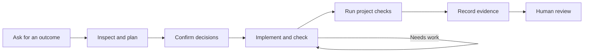

Vise gives an AI coding agent a repeatable social.plus integration loop. You describe the outcome, answer the product decisions only your team can make, and review the result.

## From request to evidence

On resumed work, `vise status` reads the current evidence first and routes the agent to the relevant build, Day-2, or release-review step. It does not run project sensors or change the existing compliance result.

1. **Inspect and plan.** The agent identifies the app surface, reads social.plus documentation and SDK facts, and asks instead of guessing.
2. **Confirm decisions.** Vise records the feature, placement, data target, selected capabilities, and definition of done.
3. **Implement and check.** The agent validates real SDK usage, platform lifecycle, and feature completeness while it works.
4. **Run project checks.** The app's build, lint, typecheck, tests, and SDK smoke checks run when available.
5. **Record evidence.** The result explains what passed, what still needs work, and whether the intended surface worked at runtime.

## Read the result

Ask your agent to separate the outcome into what passed, what it will fix, and what needs your decision.

| Result | What happens next |
| --- | --- |
| `green` | Review the feature through your normal product process |
| `deterministic-failures` or `completeness-gap` | The agent fixes the code or finishes the agreed scope |
| `selected-capability-failures` | Finish the selected capability or explicitly remove it from scope |
| `blocked` | Answer the named product or project question |
| `needs-attestation` | Review evidence for correct architecture the automatic check cannot see |
| `contract-drift` | Confirm the changed intent or restore the implementation |
| `runtime-proof-waived` | Accept the explicit waiver or request a real launch |
| `engagement-drift` | Reopen the earlier feature or explicitly accept the change |

`no-platform` means Vise did not find a supported app surface. Confirm that the agent is working in the correct package before concluding that there is nothing to validate.

## What the evidence means

The contract, check results, attestations, and runtime receipts live in `sp-vise/`. Commit that folder with the application so review and CI do not depend on an agent transcript.

Evidence can prove an automatic check passed, explain architecture a static rule cannot follow, or show that a specific surface mounted and loaded data at its recorded route and target.

It does not replace product QA, security review, or human release approval. User-visible work still needs a real launch or an honest recorded waiver.

| Claim | What Vise can establish | What remains separate |
| --- | --- | --- |
| Compliance | Recorded scope, deterministic SDK/platform checks, and earlier-feature drift | Product and security judgment |
| Project sensors | The detected build, lint, typecheck, test, or SDK-smoke command result | Tests that were unavailable or not selected |
| Runtime receipt | Retained source, build, runner, route, target, artifact, and Passport lineage still match | Visual quality and unobserved SDK semantics |
| SDK assurance | Exact extracted symbols, models, capability anchors, provenance, freshness, and fact-depth state | Compatibility beyond the reviewed evidence |
| Organization policy | Accepted source, lifecycle, trust-key state, update impact, and responsible owner | Policy acceptance and release approval |
| Passport and advisory review | Digest-bound handoff claims and disclosed movement | The human decision to ship |

## Related

<CardGroup cols={2}>
  <Card title="Maintain an existing integration" icon="screwdriver-wrench" href="/ai-mcp/vise/brownfield-day2">
    Add, diagnose, or upgrade without losing earlier evidence.
  </Card>
  <Card title="Keep integrations verified in CI" icon="code-branch" href="/ai-mcp/vise/ci-verification">
    Carry the same contract and evidence into the pipeline.
  </Card>
  <Card title="Command reference" icon="terminal" href="/ai-mcp/vise/cli-reference">
    Look up the full command surface when operating Vise directly.
  </Card>
  <Card title="Run Vise as an MCP server" icon="plug" href="/ai-mcp/vise/mcp-server">
    Expose Vise's local tools to an MCP-capable coding host.
  </Card>
</CardGroup>
