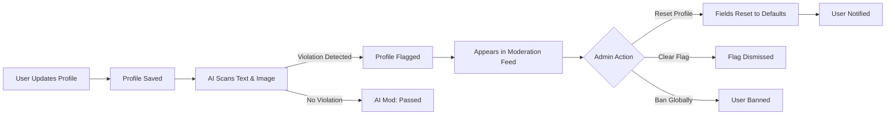

Extend your community safety beyond content with AI-powered user profile moderation. social.plus automatically scans user profiles — including display names, avatars, and descriptions — for policy violations, giving admins the tools to review, reset, and manage flagged profiles.

<CardGroup cols={2}>
  <Card title="Post-Moderation" icon="user-shield">
    AI reviews profile content after save — flag-only, no auto-delete
  </Card>
  <Card title="Admin Reset" icon="rotate-left">
    Reset flagged profile fields (display name, avatar, description) to safe defaults
  </Card>
  <Card title="Moderation Feed" icon="list-check">
    Unified Users tab to review AI-flagged and user-reported profiles
  </Card>
  <Card title="Profile Blocklist" icon="ban">
    Dedicated blocklist category for display names and descriptions
  </Card>
</CardGroup>

## Overview

AI User Profile Moderation is a **post-moderation** system — profiles are scanned after the user saves changes. Unlike content moderation (posts, comments, messages), user profile moderation is **flag-only**: the block confidence threshold that auto-deletes content does not apply to user profiles. Admins must explicitly decide to reset, clear the flag, or ban the user.

<Warning>
**Flag-Only for Profiles**: Unlike posts and messages, the block confidence threshold does **not** auto-delete user profile content. All flagged profiles require manual admin review. This ensures that user accounts are never silently wiped by automated systems.
</Warning>

## What Gets Scanned

AI moderation scans three profile fields after each update:

| Field | Scan Type | Pre-Moderation | Post-Moderation |
|-------|-----------|----------------|-----------------|
| **Display Name** | Text (Azure AI Content Safety) | ❌ | ✅ Flagged if violation detected |
| **Description** | Text (Azure AI Content Safety) | ❌ | ✅ Flagged if violation detected |
| **Avatar** (uploaded file) | Image (AWS Rekognition) | ✅ Blocked before upload | ✅ Flagged after save |

<Info>
**Avatar Pre-Moderation**: Uploaded avatar images are already scanned at upload time via AWS Rekognition. Post-moderation provides a second layer of review after the profile is saved.
</Info>

<Warning>
**`avatarCustomUrl` Gap**: Avatars set via external URL (`avatarCustomUrl`) bypass the upload pipeline entirely — no Rekognition pre-moderation runs on these images. Only post-moderation scanning applies.
</Warning>

## Detection Categories

User profile text is scanned against the same categories as posts, comments, and messages:

<AccordionGroup>
  <Accordion title="Text Detection Categories" icon="text">
    - **Harassment or Bullying**: Targeted abuse or intimidation in display names or descriptions
    - **Sexual Content or Nudity**: Explicit sexual references in profile text
    - **Violence or Threatening Content**: Violent threats or graphic descriptions
    - **Hate**: Hate speech targeting protected groups
    - **Fraudulent Intent and Scam Promotion**: Scam tactics, phishing links in descriptions
    - **Self Harm or Suicide**: Content related to self-harm or suicidal ideation
  </Accordion>

  <Accordion title="PII Detection" icon="fingerprint">
    - **URL** — Links and web addresses embedded in profile descriptions
    - **PersonType** — References to specific person types or identities
  </Accordion>

  <Accordion title="Image Detection (Avatar)" icon="image">
    Avatar images are scanned for the same visual categories as other media content:
    - Adult content, nudity, and suggestive imagery
    - Violence and harmful content
    - Hate symbols and extremist content
    - Substance-related content

    See [AI Content Moderation — Multimedia Content Detection](/analytics-and-moderation/console/ai-content-moderation#multimedia-content-detection) for the full list of image categories.
  </Accordion>
</AccordionGroup>

## Confidence Thresholds

User profile moderation reuses the same text and image confidence thresholds configured for content moderation. However, only the **flag confidence** threshold applies — there is no auto-block for user profiles.

| Threshold | Applies to Profiles? | Behavior |
|-----------|---------------------|----------|
| **Flag Confidence** (default: 40) | ✅ Yes | Profile flagged for admin review |
| **Block Confidence** (default: 80) | ❌ No | Does **not** auto-delete profile fields |

<Tip>
Confidence thresholds are shared across content and user profiles. If you need different sensitivity for profiles, this would require a future enhancement for separate threshold configuration.
</Tip>

## Moderation Feed — Users Tab

Flagged user profiles appear in a dedicated **Users** tab within the Moderation Feed (**Moderation > Moderation feed**), alongside the existing Posts/Comments and Messages tabs.

<Tabs>
  <Tab title="To Review">
    The **To Review** list displays all user profiles that require moderator attention.

    Each flagged profile shows:
    - AI moderation labels with category occurrence counts (e.g., "Hate (2)", "Violence (1)")
    - Whether the display name or description triggered the flag — indicated by a **(Profile description is flagged)** label
    - User report counts from other community members (e.g., "4 users")
    - Last flagged timestamp

    **Available actions:**
    - **Reset profile** — Reset flagged profile fields to safe defaults
    - **Ban globally** — Ban the user across all communities
    - **Clear flag** — Dismiss the flag and approve the profile
  </Tab>

  <Tab title="Reviewed">
    The **Reviewed** list shows profiles that have already been moderated.

    Each reviewed item displays the action taken and who performed it:
    - **Flag cleared by [moderator]**
    - **Globally banned by [moderator]**
    - **Profile reset by [moderator]**

    Use the **Select moderator** filter to view actions taken by a specific team member.
  </Tab>
</Tabs>

## Admin Reset

When an admin resets a flagged profile, the affected fields are restored to safe defaults:

| Field | Reset Behavior |
|-------|---------------|
| **Display Name** | Set to `{configuredPrefix}{UUID(12)}` (e.g., `User_a1b2c3d4e5f6`) |
| **Description** | Cleared (set to empty) |
| **Avatar** | Removed — reverts to default avatar. Original file is deleted from storage. |

<Steps>
  <Step title="Navigate to Moderation Feed">
    Go to **Moderation > Moderation feed** and select the **Users** tab.
  </Step>

  <Step title="Review Flagged Profile">
    Click on a flagged user to view their profile details, AI moderation labels, and flag history.
  </Step>

  <Step title="Choose Action">
    Select **Reset profile** from the moderation actions. A confirmation modal shows which fields will be reset.
  </Step>

  <Step title="Confirm Reset">
    Confirm the reset. The user is notified that their profile has been reset.
  </Step>
</Steps>

<Warning>
**Avatar Reset is Irreversible**: When an avatar is reset, the original file is deleted from storage. Only the fact that a reset occurred is logged — the original image cannot be recovered.
</Warning>

<Info>
The display name reset prefix is configurable via the network setting `moderation.displayNameResetPrefix` (API-only).
</Info>

## User Notifications

When a profile is reset, the affected user receives a notification through the notification tray:

- **Notification type**: `USER_PROFILE_RESET`
- **Content**: Informs the user which fields were reset and that they can update their profile again
- Delivered via the existing notification tray system

## Profile Blocklist

A dedicated blocklist category for user profiles allows admins to block specific words and phrases from appearing in display names and descriptions.

| Blocklist Category | Applies To | Description |
|-------------------|-----------|-------------|
| **Content** (existing) | Posts, comments, messages | Standard content blocklist |
| **User Profile** (new) | Display names, descriptions | Blocks words/phrases in profile text |

<Info>
The profile blocklist is independent from the content blocklist. You can maintain different blocked terms for user profiles versus post/comment content.
</Info>

## User History

Profile moderation events are recorded in the user's activity history, accessible from the User History page:

- **AI flag events**: When AI detects a violation in a profile field
- **Profile reset events**: Logged as `RESET_USER_PROFILE` activity with details on which fields were reset, the actor, and reason
- **Moderation actions**: Flag cleared, globally banned, etc.

## Best Practices

<AccordionGroup>
  <Accordion title="Review Strategy" icon="clipboard-check">
    - **Prioritize by severity**: Review profiles with multiple AI flag categories first
    - **Check context**: Some display names or descriptions may be flagged incorrectly — review before resetting
    - **Use reset judiciously**: Resetting a profile is disruptive to the user; prefer clearing the flag for borderline cases
    - **Monitor repeat offenders**: Users who are repeatedly flagged may warrant a global ban
  </Accordion>

  <Accordion title="Blocklist Management" icon="list">
    - **Separate concerns**: Maintain different blocklists for content vs. user profiles
    - **Common patterns**: Add known offensive display name patterns to the profile blocklist
    - **Regular updates**: Review and update the blocklist as new patterns emerge
    - **Test impact**: Check existing users before adding broad blocklist terms
  </Accordion>

  <Accordion title="Confidence Tuning" icon="sliders">
    - **Shared thresholds**: Remember that confidence thresholds are shared between content and profiles
    - **Monitor false positives**: Track how often legitimate profile content gets flagged
    - **Flag-only safety net**: Since profiles are flag-only, a lower flag threshold is safer than with content (no risk of auto-deletion)
  </Accordion>
</AccordionGroup>

## Limitations

<Warning>
- **Flag-only**: AI cannot auto-delete user profile content — all flagged profiles require admin review
- **`avatarCustomUrl` bypasses pre-moderation**: External avatar URLs are not scanned at upload time
- **Shared confidence thresholds**: Profile and content moderation share the same flag thresholds; separate configuration is not yet available
- **Original avatar not recoverable**: Once an avatar is reset, the original file is permanently deleted from storage
</Warning>

## Related Topics

<CardGroup cols={3}>
  <Card title="AI Content Moderation" href="/analytics-and-moderation/console/ai-content-moderation" icon="shield-check">
    AI moderation for posts, comments, messages, images, and video content
  </Card>
  <Card title="Moderation Overview" href="/analytics-and-moderation/console/moderation/overview" icon="eye">
    General moderation tools, roles, and workflows
  </Card>
  <Card title="User Insights" href="/analytics-and-moderation/console/user-and-content-management/user-insights" icon="user">
    View detailed user information, history, and activity
  </Card>
</CardGroup>
