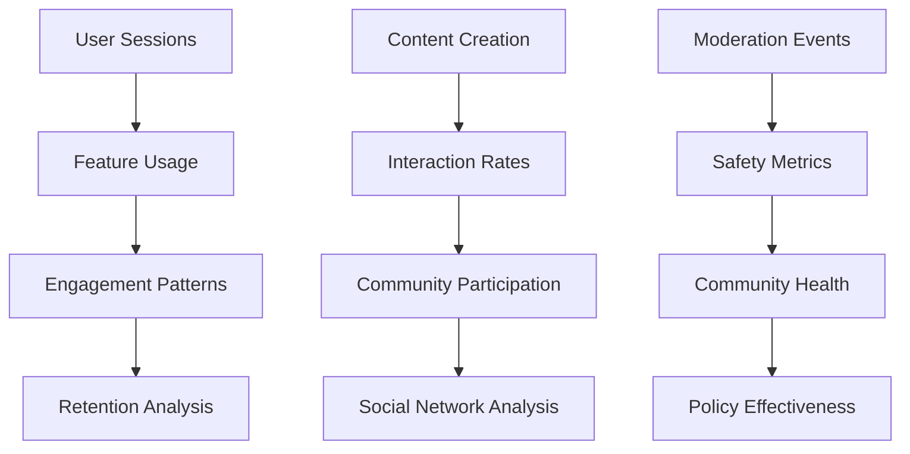

# Analytics Dashboard

Gain deep insights into your community's health and growth with social.plus Console's comprehensive analytics. Track user engagement, content performance, moderation effectiveness, and business metrics to make data-driven decisions.

<CardGroup cols={2}>
  <Card title="User Analytics" icon="users" href="user-analytics">
    Monitor user activity, engagement patterns, and growth metrics
  </Card>
  <Card title="Content Analytics" icon="file-text" href="content-analytics">
    Track content performance, interaction rates, and trending topics
  </Card>
  <Card title="Safety & Moderation Metrics" icon="shield-check" href="../moderation/overview#analytics--quality">
    Review moderation queue health, accuracy & policy impact
  </Card>
  <Card title="Business Metrics" icon="trending-up" href="business-metrics">
    Monitor MAU, retention, revenue impact, and subscription analytics
  </Card>
</CardGroup>

## Key Metrics Overview

### **Community Health Indicators**

<AccordionGroup>
  <Accordion title="Engagement Metrics">
    **Daily Active Users (DAU)**
    - Unique users engaging with your platform daily
    - Breakdown by feature usage (posts, comments, chat, etc.)
    - Comparison with historical trends and benchmarks
    
    **Monthly Active Users (MAU)**
    - Unique users active within the past 30 days
    - Critical for billing and subscription management
    - Growth rate and retention analysis
    
    **Session Analytics**
    - Average session duration and frequency
    - Feature usage patterns within sessions
    - User journey and navigation flows
  </Accordion>
  
  <Accordion title="Content Performance">
    **Content Creation Rates**
    - Posts, comments, messages created per day/week/month
    - Creator-to-consumer ratios indicating community balance
    - Content type distribution and preferences
    
    **Interaction Metrics**
    - Likes, reactions, shares, and comment rates
    - Time-to-engagement and viral coefficient
    - Content reach and impression analytics
    
    **Content Quality**
    - Flagging rates and moderation actions per content type
    - User-reported issues and resolution rates
    - Content lifecycle and engagement decay patterns
  </Accordion>
  
  <Accordion title="Community Growth">
    **User Acquisition**
    - New user registrations and onboarding completion rates
    - Acquisition channel effectiveness and attribution
    - Geographic distribution and demographics
    
    **Retention Analysis**
    - Day 1, Day 7, Day 30 user retention rates
    - Cohort analysis showing long-term engagement patterns
    - Churn analysis and at-risk user identification
    
    **Network Effects**
    - Friend connections and social graph density
    - Community formation and group dynamics
    - Viral growth coefficients and referral patterns
  </Accordion>
</AccordionGroup>

## Analytics Dashboard Features

### **Real-time Monitoring**

<Tip>
**Live Insights**: Use real-time dashboards to quickly identify and respond to trending content, unusual activity patterns, or community issues as they emerge.
</Tip>

- **Live Activity Feed**: Current user actions and content creation
- **Trending Content**: Posts and topics gaining rapid engagement
- **System Alerts**: Unusual patterns requiring immediate attention
- **Performance Monitoring**: API response times and system health

### **Historical Analysis**

- **Trend Analysis**: Long-term patterns in user behavior and engagement
- **Seasonal Patterns**: Identify recurring trends and optimize for peak times
- **Event Impact**: Measure the effect of feature releases or campaigns
- **Comparative Analysis**: Benchmark performance against previous periods

### **Custom Dashboards**

Create tailored views for different stakeholders:

- **Executive Dashboard**: High-level KPIs and business metrics
- **Community Manager**: Moderation alerts and engagement trends
- **Product Team**: Feature usage and user feedback analytics
- **Marketing Team**: Acquisition, retention, and campaign performance

## Key Analytics Areas

### **User Behavior Analytics**

### **Content Performance Metrics**

<Steps>
  <Step title="Content Creation">
    Track volume, type, and quality of user-generated content
  </Step>
  
  <Step title="Engagement Analysis">
    Measure likes, comments, shares, and time spent viewing content
  </Step>
  
  <Step title="Viral Potential">
    Identify content with high sharing rates and community impact
  </Step>
  
  <Step title="Quality Assessment">
    Monitor flagging rates and moderation actions per content piece
  </Step>
</Steps>

### **Moderation Effectiveness**

Track the health and safety of your community:

- **Flagging Patterns**: Types and frequency of content reports
- **Resolution Times**: How quickly moderation issues are addressed
- **Appeal Rates**: User satisfaction with moderation decisions  
- **False Positive Rates**: Accuracy of automated moderation systems

## Advanced Analytics Features

### **Cohort Analysis**

Understanding user retention and engagement over time:

- **Registration Cohorts**: Track users by signup date and analyze retention
- **Feature Adoption**: See how new features impact different user groups
- **Behavioral Segmentation**: Group users by activity patterns and preferences
- **Lifetime Value**: Calculate user value and contribution to community

### **Predictive Analytics**

<Warning>
**Data Privacy**: Ensure all analytics comply with privacy regulations and user consent requirements. Anonymize or aggregate data appropriately.
</Warning>

- **Churn Prediction**: Identify users at risk of leaving the platform
- **Growth Forecasting**: Project user growth and resource needs
- **Content Trend Prediction**: Anticipate emerging topics and interests
- **Moderation Risk Assessment**: Flag potentially problematic content early

### **A/B Testing Integration**

Measure the impact of changes and optimizations:

- **Feature Rollouts**: Compare engagement before and after new features
- **UI/UX Changes**: Measure user behavior changes from interface updates
- **Policy Changes**: Assess community response to new guidelines
- **Content Algorithms**: Test different content ranking and recommendation approaches

## Reporting & Export

### **Automated Reports**

Set up regular reports for different stakeholders:

- **Daily Summaries**: Key metrics and alerts for community managers
- **Weekly Reviews**: Engagement trends and community health indicators
- **Monthly Business Reports**: MAU, revenue impact, and growth metrics
- **Quarterly Analysis**: Strategic insights and long-term trend analysis

### **Custom Exports**

- **Data Export**: Download raw data for external analysis
- **API Access**: Programmatic access to analytics data
- **Integration Support**: Connect with business intelligence tools
- **Real-time Feeds**: Stream analytics data to external systems

## Using Analytics for Decision Making

### **Community Management**
- **Identify Engagement Opportunities**: Find underutilized features or content gaps
- **Optimize Moderation**: Adjust policies based on flagging patterns and community feedback
- **Plan Events**: Schedule community events during peak engagement times
- **Content Strategy**: Promote content types that drive the highest engagement

### **Product Development**
- **Feature Prioritization**: Focus development on highly-used or requested features
- **User Experience**: Identify friction points in user journeys
- **Performance Optimization**: Address features causing user drop-off
- **New Feature Impact**: Measure success of recent releases

### **Business Strategy**
- **Growth Planning**: Forecast resource needs based on user growth trends
- **Market Analysis**: Understand user demographics and geographic distribution
- **Revenue Optimization**: Identify opportunities for monetization and retention
- **Competitive Positioning**: Benchmark performance against industry standards

## Getting Started with Analytics

<CardGroup cols={2}>
  <Card title="Set Up Dashboards" icon="chart-bar" href="dashboard-setup">
    Configure custom dashboards for your team's needs
  </Card>
  <Card title="Define KPIs" icon="target" href="kpi-definition">
    Establish key performance indicators for your community
  </Card>
  <Card title="Automated Alerts" icon="bell" href="alert-setup">
    Create alerts for important metrics and thresholds
  </Card>
  <Card title="Export & Integration" icon="download" href="data-export">
    Set up data exports and third-party tool integrations
  </Card>
</CardGroup>

## Best Practices

- **Regular Review**: Schedule weekly analytics reviews to identify trends early
- **Metric Focus**: Choose 5-10 key metrics rather than tracking everything
- **Action-Oriented**: Ensure each metric has a clear action plan when thresholds are met
- **Context Awareness**: Consider external factors when interpreting data changes
- **Privacy First**: Always respect user privacy and comply with data protection regulations
