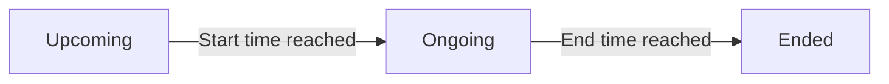

Use Events Management in the social.plus Console to create, organize, and monitor scheduled events across communities. Console events can represent livestreams, external-link virtual events, or in-person gatherings.

<Info>
Events are created inside communities. Use this page for Console administration workflows such as scheduling, attendee monitoring, and event-detail review.
</Info>

## Dashboard overview

The events dashboard lists events with their type, source community, creator, schedule, status, attendee count, and creation time.

| Column | Description |
|--------|-------------|
| **Event title** | The name of the event |
| **Type** | Event type — `Livestream`, `In-person`, or `Virtual` (external link) |
| **Created in** | The community or feed where the event was created |
| **Creator** | The user who created the event |
| **Starts / Ends** | Scheduled start and end date/time |
| **Status** | Current status — `Upcoming`, `Ongoing`, or `Ended` |
| **Attendees** | Number of users who joined or RSVP'd |
| **Created at** | Timestamp of event creation |

You can filter events by **creator** and **status** using the dropdown filters at the top of the page.

## Quick start

<Steps>
  <Step title="Navigate to Events">
    Go to **Console > Events** from the left sidebar navigation.
  </Step>

  <Step title="Create a new event">
    Click the **Create event** button in the top-right corner of the events dashboard.
  </Step>

  <Step title="Select feed and account">
    Choose the target community and the account that will create the event.
  </Step>

  <Step title="Fill in event details">
    Enter the event name, description, thumbnail, and set the schedule.
  </Step>

  <Step title="Configure event type">
    Select whether the event is virtual (livestream or external link) or in-person, and provide the relevant address or link.
  </Step>

  <Step title="Publish">
    Review all details and click **Create event** to publish.
  </Step>
</Steps>

## Create an event

To create a new event, click the **Create event** button from the events dashboard. The creation form is organized into four sections.

### Feed and account

| Field | Type | Required | Description |
| --- | --- | --- | --- |
| Create to | Dropdown | Yes | Choose where the event will be created. Currently supports **Community** feeds. After selecting Community, choose the specific community from the second dropdown. |
| Create as | Dropdown | Yes | Choose the identity used to create the event. Select **Myself** to use your own admin account, or select a specific user to create the event on their behalf. |

### Event details

| Field | Type | Required | Description |
| --- | --- | --- | --- |
| Event thumbnail | Upload | No | Upload a preview image for the event. Use a 16:9 image for consistent display across devices. |
| Event name | Text | Yes | Clear event title shown in event lists and detail pages. Maximum length: 60 characters. |
| Event details | Text | No | Description of what the event is about, what attendees can expect, and any relevant context. Maximum length: 1,000 characters. |

### Date and time

| Field | Type | Required | Description |
| --- | --- | --- | --- |
| Timezone | Dropdown | Yes | Timezone for the event schedule. Defaults to the browser locale. |
| Starts on | Date and time picker | Yes | Date and time when the event begins. |
| Ends on | Date and time picker | Yes | Date and time when the event ends. Must be after the start time. |

### Event type and address

| Field | Type | Required | Description |
| --- | --- | --- | --- |
| Event type | Dropdown | Yes | Select `Virtual` or `In-person`. This selection controls which additional fields are shown. |
| Livestream | Virtual subtype | Conditional | Users join a livestream directly in your app or website. |
| External link | Virtual subtype | Conditional | Users are directed to an external platform. Event URL maximum length: 200 characters. |
| Address | Text | Conditional | Physical location for an in-person event. Maximum length: 100 characters. |

## Event types

<CardGroup cols={3}>
  <Card title="Livestream" icon="video">
    **Virtual event** where users join a live broadcast directly within your app or website. Ideal for webinars, Q&A sessions, and live content.
  </Card>

  <Card title="External Link" icon="link">
    **Virtual event** that redirects attendees to an external platform (e.g., Zoom, Google Meet). Provide the event URL during creation.
  </Card>

  <Card title="In-Person" icon="location-dot">
    **Physical event** at a specified address. Attendees can see the location details and plan to attend in person.
  </Card>
</CardGroup>

## View event details

Click on any event row in the events list to open its detail page. The detail view provides a comprehensive overview with three tabs.

### Activities tab

The **Activities** tab shows all engagement associated with the event, including:

- **Posts** — Content created within the event context
- Engagement metrics and last update timestamps

### Attendees tab

The **Attendees** tab displays a list of users who have joined or RSVP'd to the event, allowing you to monitor participation.

### Details tab

The **Details** tab shows the full event configuration in a read-only format, including:

- Feed and account information (community, creator)
- Event name and description
- Thumbnail image
- Timezone, start date, and end date
- Event type and address/link

## Event status lifecycle

Events automatically transition through statuses based on the current time relative to the scheduled dates:

```mermaid
graph LR
    A[Upcoming] -->|Start time reached| B[Ongoing]
    B -->|End time reached| C[Ended]
```

| Status | Description |
|--------|-------------|
| **Upcoming** | The event has been created but the start time has not yet been reached |
| **Ongoing** | The event is currently active (between start and end times) |
| **Ended** | The event has passed its scheduled end time |

## Filtering and search

Use the filters at the top of the events dashboard to narrow down the event list:

- **Select creator** — Filter events by the user who created them
- **Filter by status** — Show only events with a specific status (`Upcoming`, `Ongoing`, or `Ended`)

The pagination controls at the bottom of the table allow you to navigate through large event lists, with configurable page sizes (default: 10 per page).

## Best practices

<AccordionGroup>
  <Accordion title="Event planning" icon="clipboard-list">
    - **Use descriptive titles** — Make event names clear and informative so users can quickly understand the event purpose
    - **Set accurate timezones** — Always verify the timezone matches the intended audience or event location
    - **Add thumbnails** — Events with images attract more attention; use 16:9 ratio for best display
    - **Write detailed descriptions** — Include what attendees can expect, any prerequisites, and relevant links
  </Accordion>

  <Accordion title="Community engagement" icon="comments">
    - **Create events in relevant communities** — Target the right audience by selecting the appropriate community
    - **Schedule in advance** — Give users enough lead time to plan for attendance
    - **Monitor activities** — Regularly check the Activities tab for engagement and respond to posts
    - **Track attendees** — Use the Attendees tab to understand participation rates
  </Accordion>

  <Accordion title="Event type selection" icon="route">
    - **Livestream** — Best for interactive sessions where you want attendees to stay within your platform
    - **External link** — Use when leveraging established conferencing tools (Zoom, Meet, Teams)
    - **In-person** — Provide complete address details so attendees can easily find the venue
  </Accordion>
</AccordionGroup>

## Troubleshooting

<AccordionGroup>
  <Accordion title="Cannot create event" icon="circle-exclamation">
    **Symptoms:** The **Create event** button is disabled or creation fails.

    **Solutions**:
    1. Ensure all required fields are filled in (event name, dates, community)
    2. Verify the end date is after the start date
    3. Check that you have the appropriate admin role and permissions
    4. Confirm the selected community exists and is active
  </Accordion>

  <Accordion title="Event not showing in list" icon="eye-slash">
    **Symptoms:** A recently created event does not appear in the dashboard.

    **Solutions**:
    1. Clear any active status or creator filters
    2. Refresh the page to fetch the latest data
    3. Check pagination — the event may be on a different page
    4. Verify the event was created successfully (no error messages during creation)
  </Accordion>

  <Accordion title="Livestream not starting" icon="video-slash">
    **Symptoms:** A livestream event shows as **Upcoming** even after the start time.

    **Solutions**:
    1. Verify the timezone is set correctly for the event
    2. Ensure the livestream infrastructure is properly configured
    3. Check with Live Stream Management for stream status
    4. Confirm the event creator has streaming permissions
  </Accordion>
</AccordionGroup>

## Related topics

<CardGroup cols={3}>
  <Card title="Live Stream Management" href="/analytics-and-moderation/console/management/live-stream-management" icon="video">
    Manage live streams with multi-stream support for device-optimized viewing experiences
  </Card>
  <Card title="Communities" href="/analytics-and-moderation/console/social-management/communities" icon="people-group">
    Manage communities where events are created and hosted
  </Card>
  <Card title="Admin Access Control" href="/analytics-and-moderation/console/management/admin-access-control" icon="shield-check">
    Configure admin roles and permissions for event management capabilities
  </Card>
</CardGroup>
