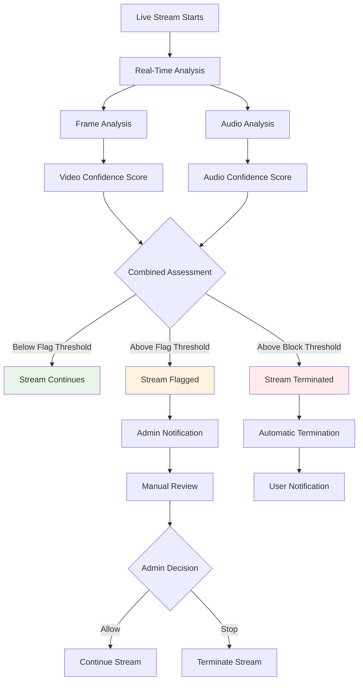

# Livestream Moderation

Protect your live streaming community with real-time AI moderation that monitors video and audio content as it happens. Automatically detect and respond to policy violations during live broadcasts with minimal latency.

<CardGroup cols={2}>
  <Card title="Real-Time Detection" icon="video" href="#how-it-works">
    Monitor live streams frame-by-frame for policy violations
  </Card>
  <Card title="Multi-Modal Analysis" icon="eye" href="#detection-categories">
    Analyze both video frames and audio content simultaneously
  </Card>
  <Card title="Automated Response" icon="robot" href="#moderation-actions">
    Configure automatic actions based on violation severity
  </Card>
  <Card title="Admin Controls" icon="shield-check" href="#admin-management">
    Manual oversight and control through the social.plus Console
  </Card>
</CardGroup>

## Overview

Livestream moderation provides comprehensive, real-time content analysis for live video broadcasts, ensuring community safety without disrupting legitimate content.

<AccordionGroup>
  <Accordion title="Key Features" icon="star">
    - **Frame-by-Frame Analysis**: AI scans every video frame in real-time
    - **Audio Detection**: Monitor spoken content and audio patterns
    - **Instant Response**: Take action within seconds of violation detection
    - **Graduated Actions**: Flag for review or automatically terminate streams
    - **Admin Dashboard**: Complete visibility and control over moderation decisions
  </Accordion>
  
  <Accordion title="Cost & Availability" icon="dollar-sign">
    - **Pricing**: $0.135 per minute of live video broadcast
    - **Real-time Processing**: Minimal latency impact on streaming experience
    - **Scalable**: Handles multiple concurrent streams
    - **Enterprise Feature**: Contact support to enable for your application
  </Accordion>
</AccordionGroup>

## Getting Started

<Steps>
  <Step title="Contact Support">
    Reach out to our [support team](mailto:support@social.plus) to enable livestream moderation for your application.
  </Step>
  
  <Step title="Configure Settings">
    Set up confidence levels and moderation categories through the social.plus Console.
  </Step>
  
  <Step title="Test Streams">
    Run test live streams to verify your moderation settings work as expected.
  </Step>
  
  <Step title="Monitor & Adjust">
    Monitor moderation effectiveness and adjust confidence levels as needed.
  </Step>
</Steps>

## How It Works

Livestream moderation operates in real-time, analyzing content as it's being broadcast:



## Detection Categories

Our AI analyzes livestream content across multiple categories for comprehensive protection:

<AccordionGroup>
  <Accordion title="Visual Content Detection" icon="eye">
    **Explicit Content**
    - Pornographic material and sexual content
    - Nudity and inappropriate exposure
    - Sexual activities and suggestive content
    
    **Violence & Harmful Content**
    - Graphic violence and gore
    - Weapons and dangerous activities
    - Self-harm and dangerous behavior
    
    **Prohibited Content**
    - Hate symbols and extremist content
    - Drug use and illegal activities
    - Disturbing or shocking imagery
  </Accordion>
  
  <Accordion title="Audio Content Detection" icon="volume-high">
    **Speech Analysis**
    - Profanity and offensive language
    - Hate speech and harassment
    - Threats and intimidation
    
    **Pattern Recognition**
    - Repeated violation indicators
    - Background audio violations
    - Music copyright concerns
  </Accordion>
</AccordionGroup>

## Moderation Actions

<Tabs>
  <Tab title="Action Levels">
    <AccordionGroup>
      <Accordion title="Pass" icon="check-circle">
        **Confidence Below Flag Threshold**
        - Stream continues normally
        - No moderation indicators shown
        - Content considered appropriate
        
        *Typical Range: 0-40% confidence*
      </Accordion>
      
      <Accordion title="Flagged" icon="flag">
        **Confidence Above Flag Threshold**
        - Stream continues but marked for review
        - Admin notification sent immediately
        - Visible in console flagged streams list
        - Manual action required
        
        *Default Range: 40-75% confidence*
      </Accordion>
      
      <Accordion title="Terminated" icon="stop-circle">
        **Confidence Above Termination Threshold**
        - Stream automatically stopped
        - Associated post soft-deleted
        - No playback available to users
        - Appears as normally ended stream to viewers
        
        *Default Range: 75%+ confidence*
      </Accordion>
    </AccordionGroup>
  </Tab>
  
  <Tab title="Configuration">
    <CodeGroup>
      ```json Default Thresholds
      {
        "flaggedThreshold": 40,
        "terminatedThreshold": 75,
        "categories": [
          "pornographic_content",
          "violent_content", 
          "prohibited_content",
          "inappropriate_content",
          "profanity_content"
        ]
      }
      ```
      
      ```json Custom Configuration
      {
        "flaggedThreshold": 30,
        "terminatedThreshold": 80,
        "categories": {
          "pornographic_content": {
            "flagThreshold": 25,
            "terminateThreshold": 70
          },
          "violent_content": {
            "flagThreshold": 35,
            "terminateThreshold": 85
          }
        }
      }
      ```
    </CodeGroup>
  </Tab>
</Tabs>

## Admin Management

### Flagged Stream Review


When streams are flagged, administrators can:

<AccordionGroup>
  <Accordion title="Review Options" icon="search">
    - **View Flagged Content**: See specific frames that triggered the flag
    - **Context Analysis**: Review surrounding content for context
    - **User History**: Check streamer's moderation history
    - **Community Impact**: Assess potential harm to community
  </Accordion>
  
  <Accordion title="Available Actions" icon="tools">
    - **Continue Stream**: Allow stream to proceed normally
    - **Stop Stream**: Immediately terminate the live broadcast
    - **Delete Stream**: Remove stream and associated content
    - **Issue Warning**: Send notification to streamer
    - **Temporary Ban**: Restrict user's streaming privileges
  </Accordion>
</AccordionGroup>

### Configuration Interface


Configure moderation settings through the social.plus Console:

<Steps>
  <Step title="Access Settings">
    Navigate to **Moderation > Livestream Settings** in your console.
  </Step>
  
  <Step title="Set Confidence Levels">
    Adjust flag and termination thresholds for each content category.
  </Step>
  
  <Step title="Configure Actions">
    Define automatic responses for different violation types.
  </Step>
  
  <Step title="Test Configuration">
    Run test streams to validate your settings work correctly.
  </Step>
</Steps>

## Configuration Best Practices

<AccordionGroup>
  <Accordion title="Threshold Tuning" icon="sliders">
    **Start Conservative**
    - Begin with default settings (Flag: 40%, Terminate: 75%)
    - Monitor false positive and false negative rates
    - Adjust gradually based on community standards
    
    **Category-Specific Tuning**
    - Set stricter thresholds for explicit content
    - Allow more tolerance for edge cases like art or education
    - Consider cultural context and community norms
  </Accordion>
  
  <Accordion title="Response Strategy" icon="strategy">
    **Balanced Approach**
    - Use flagging for borderline content requiring human judgment
    - Reserve automatic termination for clear violations
    - Implement graduated penalties for repeat offenders
    
    **User Communication**
    - Provide clear guidelines about acceptable streaming content
    - Send educational notifications rather than just penalties
    - Maintain appeal processes for disputed decisions
  </Accordion>
  
  <Accordion title="Monitoring & Optimization" icon="chart-line">
    **Regular Review**
    - Weekly analysis of flagged vs. terminated streams
    - Monthly review of threshold effectiveness
    - Quarterly policy updates based on community feedback
    
    **Performance Metrics**
    - Track moderation accuracy rates
    - Monitor streamer satisfaction and retention
    - Measure community safety improvements
  </Accordion>
</AccordionGroup>

## Technical Considerations

<Warning>
**Confidence Level Impact**: Setting confidence levels too low (near 0%) will result in excessive false positives, potentially disrupting legitimate streams and frustrating users.
</Warning>

### Performance Impact

- **Latency**: Minimal impact on stream quality (< 200ms processing delay)
- **Bandwidth**: No additional bandwidth required from streamers
- **Scalability**: Handles concurrent streams automatically
- **Reliability**: Redundant processing ensures consistent moderation

### Privacy & Compliance

- **Data Processing**: Content analyzed in real-time, not stored permanently
- **Regional Compliance**: Meets GDPR, CCPA, and other privacy regulations
- **Transparency**: Clear policies about automated moderation usage
- **User Rights**: Appeal processes and human review availability

## Troubleshooting

<AccordionGroup>
  <Accordion title="Common Issues" icon="bug">
    **High False Positive Rate**
    - Increase confidence thresholds gradually
    - Review specific content categories causing issues
    - Consider community-specific content norms
    
    **Missed Violations**
    - Decrease confidence thresholds carefully
    - Enable additional detection categories
    - Supplement with user reporting systems
    
    **Performance Issues**
    - Check stream resolution and bitrate settings
    - Verify network connectivity and latency
    - Contact support for optimization assistance
  </Accordion>
  
  <Accordion title="Monitoring Tools" icon="chart-bar">
    **Available Metrics**
    - Stream moderation decisions per hour/day
    - Category breakdown of violations detected
    - Average confidence scores by content type
    - Response time and processing latency
    
    **Alerts & Notifications**
    - Real-time alerts for terminated streams
    - Daily summaries of moderation activity
    - Threshold breach notifications
    - System health and performance alerts
  </Accordion>
</AccordionGroup>

<Info>
**Enterprise Support**: Our customer success team provides ongoing optimization support to help you achieve the perfect balance between community safety and user experience.
</Info>
