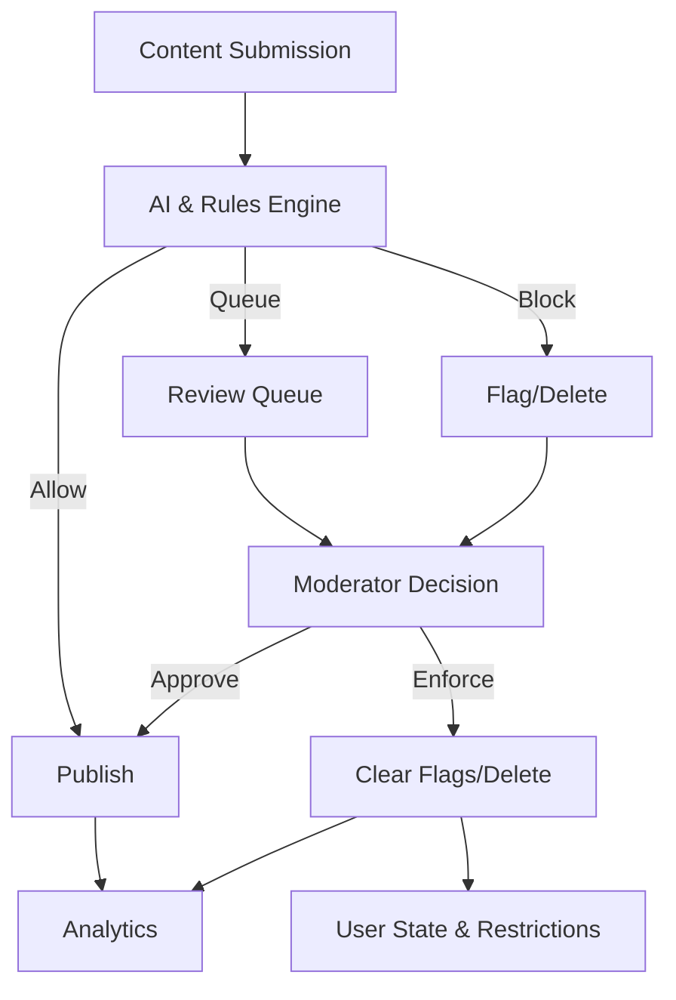

<Info>
**Key Benefit**: Unified AI + human moderation workflows to proactively detect, review, and resolve policy violations while preserving user trust and transparency.
</Info>

Maintain a safe and healthy community with social.plus Console's comprehensive moderation stack. Combine automated detection, structured review queues, user reporting, and analytics-driven enforcement.

<CardGroup cols={3}>
  <Card title="AI Detection" icon="robot" href="../ai-content-moderation">
    Automated text / image / video analysis with confidence tuning
  </Card>
  <Card title="Manual Review" icon="eye" href="../ai-content-moderation">
    Prioritized queues & human decisions (see AI + queue tuning)
  </Card>
  <Card title="User Actions" icon="user-shield" href="#enforcement--appeals">
    Warnings, suspensions, bans & restriction management
  </Card>
  <Card title="Roles & Privileges" icon="shield-check" href="roles-and-privileges">
    Granular moderator capability & workflow permissions
  </Card>
  {/* Removed broken Moderation Analytics page: folding into overall analytics dashboard */}
  <Card title="Analytics Export" icon="chart-bar" href="../../social+-portal/dashboard/raw-data-export">
    Raw metrics export for BI & policy tuning
  </Card>
  <Card title="Policy Configuration" icon="gear" href="../ai-content-moderation">
    Thresholds, keyword lists, exception & escalation rules
  </Card>
</CardGroup>

## Key Capabilities

<AccordionGroup>
  <Accordion title="Real-Time & Pre-Publish Filtering">
    - Low-latency AI screening for text, images, video frames
    - Configurable confidence thresholds (auto allow / queue / block)
    - Custom keyword & regex rule layers
    - Metadata & context-aware scoring (history, reputation)
  </Accordion>
  <Accordion title="Structured Review Queues">
    - Priority scoring (severity, virality, report density)
    - Workload distribution & claim / assign patterns
    - Batch operations for spam waves
    - Full audit log for every action
  </Accordion>
  <Accordion title="User Reporting Pipeline">
    - Category-based reports with optional free-form notes
    - Reporter credibility weighting & duplicate collapse
    - SLA timers & escalation triggers
    - Feedback loop to reporters (accepted / rejected)
  </Accordion>
  <Accordion title="Enforcement & Appeals">
    - Action ladder: warn → restrict → suspend → ban
    - Time-boxed penalties & automatic expiry
    - Appeal submission & secondary review layer
    - Consistent policy taxonomy & rationale capture
  </Accordion>
  <Accordion title="Analytics & Quality">
    - False positive / negative tracking & model tuning inputs
    - Moderator performance & queue aging metrics
    - Violation trend & emerging pattern surfacing
    - Policy effectiveness dashboards
  </Accordion>
</AccordionGroup>

## Moderation Approach

<AccordionGroup>
  <Accordion title="Layered Strategy">
    1. Preventive (AI & rules)  
    2. Reactive (user & system reports)  
    3. Review (human adjudication)  
    4. Appeal (fairness & transparency)
  </Accordion>
  <Accordion title="Fairness & Consistency">
    - Proportionate actions matched to severity
    - Standardized decision templates
    - Calibration sessions & spot audits
    - Transparent communication & appeals
  </Accordion>
</AccordionGroup>

## Primary Workflows

<Tabs>
  <Tab title="AI Screening">
    **Goal**: Minimize exposure to harmful content before broad distribution.
    
    1. Content submitted (post / comment / media / stream event)
    2. AI models + rule engine assign risk score
    3. Outcome branch: Allow | Queue | Block
    4. Metadata logged for analytics & tuning
  </Tab>
  <Tab title="Manual Review">
    **Goal**: Consistent human decisions on queued or escalated items.
    
    1. Moderator claims item from priority queue
    2. Context & history surfaced (user, prior actions, report density)
    3. Decision applied with required rationale
    4. Enforcement + user notification (if applicable)
  </Tab>
  <Tab title="User Reporting">
    **Goal**: Leverage community to surface edge cases & emerging abuse.
    
    1. User selects category & optional note
    2. Deduplication / credibility weighting
    3. Auto-triage (direct queue / auto action / hold)
    4. Resolution & optional reporter feedback
  </Tab>
  <Tab title="Appeals">
    **Goal**: Provide due process & policy legitimacy.
    
    1. User submits appeal referencing original action
    2. Secondary reviewer (segregated from original)
    3. Confirmation or reversal logged
    4. Insights looped into calibration
  </Tab>
</Tabs>

## System Architecture

## Getting Started

<Steps>
  <Step title="Define Policies">Document violation categories & action ladder.</Step>
  <Step title="Configure AI">Set confidence thresholds & custom rules.</Step>
  <Step title="Enable Reporting">Ensure user report categories & flows are active.</Step>
  <Step title="Set Roles">Assign moderator / supervisor permissions.</Step>
  <Step title="Tune Queues">Prioritize by severity & workload balance.</Step>
  <Step title="Monitor Metrics">Track false positives & SLA compliance.</Step>
</Steps>

## Best Practices

<AccordionGroup>
  <Accordion title="Operational Excellence">
    - Calibrate models monthly with sampled decisions
    - Enforce rationale fields on irreversible actions
    - Rotate reviewers for sensitive categories
    - Monitor queue aging; set escalation SLAs
  </Accordion>
  <Accordion title="Bias & Quality Control">
    - Run blind double-review audits
    - Track acceptance / reversal rates per moderator
    - Review appeal overturn patterns
    - Maintain balanced training datasets
  </Accordion>
  <Accordion title="Automation Hygiene">
    - Start conservative with auto-block thresholds
    - Whitelist benign edge cases iteratively
    - Version & test new rule sets before production
    - Log every automated action with explainability
  </Accordion>
</AccordionGroup>

## Integration Points

<CardGroup cols={3}>
  <Card title="Webhook" icon="code" href="../../social+-apis-and-services/webhook-event">
    Live events for content status, enforcement & appeals
  </Card>
  <Card title="API Endpoints" icon="cloud" href="../../social+-apis-and-services/README">
    Programmatic moderation & bulk operations
  </Card>
  <Card title="Analytics Export" icon="file-export" href="../../social+-portal/dashboard/raw-data-export">
    Raw data for external BI & policy tuning
  </Card>
</CardGroup>

<Warning>
**Compliance**: Align enforcement with regional legal requirements (e.g., GDPR, DSA) & retain audit logs for mandated retention periods.
</Warning>
