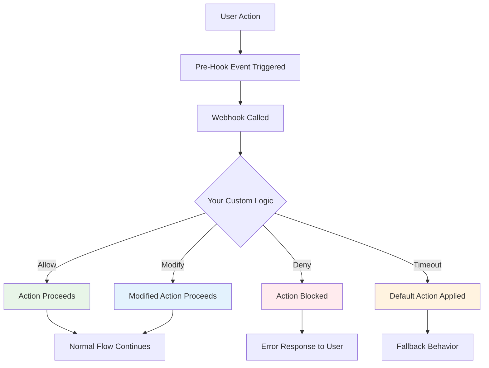

# Pre-Hook Events

Gain granular control over user actions with pre-hook events that allow you to intercept, validate, and modify user interactions before they're processed. Perfect for implementing custom moderation rules, content filtering, and access control policies.

<CardGroup cols={2}>
  <Card title="Real-time Interception" icon="bolt" href="#how-it-works">
    Intercept user actions in real-time before they're processed
  </Card>
  <Card title="Custom Rules" icon="code" href="#implementation-guide">
    Build custom validation and moderation logic tailored to your needs
  </Card>
  <Card title="Webhook Integration" icon="webhook" href="#webhook-configuration">
    Receive events via webhooks and respond with custom actions
  </Card>
  <Card title="Event Catalog" icon="list" href="#supported-events">
    Complete list of interceptable events and their data
  </Card>
</CardGroup>

## Overview

Pre-hook events enable you to create sophisticated moderation and control systems by intercepting user actions before they're executed. This allows for:

<AccordionGroup>
  <Accordion title="Custom Moderation" icon="shield">
    - **Content Filtering**: Analyze and modify content before publication
    - **User Behavior Control**: Restrict access based on custom criteria
    - **Real-time Validation**: Validate data against business rules
    - **Automated Responses**: Implement graduated response systems
  </Accordion>
  
  <Accordion title="Advanced Use Cases" icon="brain">
    - **Spam Prevention**: Block suspicious posting patterns
    - **Content Enhancement**: Auto-correct or enrich user content
    - **Access Control**: Implement channel-specific permission systems
    - **Analytics Injection**: Add tracking data to user actions
  </Accordion>
</AccordionGroup>

<Info>
**Enterprise Feature**: Pre-hook events are available for customers on the Max plan. Contact our sales team to upgrade your plan.
</Info>

## How It Works

Pre-hook events create a validation layer between user actions and their execution:



### Response Types

Your webhook endpoint must respond with one of these actions:

<AccordionGroup>
  <Accordion title="Allow" icon="check">
    ```json
    { "action": "allow" }
    ```
    Allow the action to proceed without modification.
  </Accordion>
  
  <Accordion title="Allow with Modification" icon="edit">
    ```json
    {
      "action": "allow",
      "data": {
        "modified_field": "new_value"
      }
    }
    ```
    Allow the action but modify the data before processing.
  </Accordion>
  
  <Accordion title="Deny" icon="ban">
    ```json
    {
      "action": "deny",
      "message": "Action denied: Custom reason"
    }
    ```
    Block the action and return an error message to the user.
  </Accordion>
</AccordionGroup>

## Getting Started

<Steps>
  <Step title="Enable Pre-Hook Events">
    Configure pre-hook events through the [Network Settings API](https://api-docs.amity.co/#/Network%20Setting/get_api_v3_network_settings_prehook).
  </Step>
  
  <Step title="Set Up Webhook Endpoint">
    Create an HTTPS endpoint to receive and process pre-hook events.
  </Step>
  
  <Step title="Configure Event Types">
    Specify which events you want to intercept and process.
  </Step>
  
  <Step title="Test & Monitor">
    Test your webhook with sample events and monitor response times.
  </Step>
</Steps>

### Configuration

<Tabs>
  <Tab title="API Configuration">
    <CodeGroup>
      ```json Enable Pre-Hook Events
      PUT /api/v3/network/settings/prehook
      
      {
        "enabled": true,
        "callbackUrl": "https://your-app.com/webhooks/prehook",
        "defaultAction": "allow",
        "events": [
          "message.shouldCreate",
          "message.shouldUpdate",
          "post.shouldCreate"
        ]
      }
      ```
      
      ```json Get Current Configuration
      GET /api/v3/network/settings/prehook
      
      Response:
      {
        "enabled": true,
        "callbackUrl": "https://your-app.com/webhooks/prehook",
        "defaultAction": "allow",
        "timeout": 3000,
        "events": ["message.shouldCreate"]
      }
      ```
    </CodeGroup>
  </Tab>
  
  <Tab title="Webhook Security">
    <CodeGroup>
      ```javascript Signature Verification
      const crypto = require('crypto');
      
      function verifySignature(payload, signature, secretKey) {
        const expectedSignature = crypto
          .createHmac('sha256', secretKey)
          .update(JSON.stringify(payload))
          .digest('hex');
        
        return signature === expectedSignature;
      }
      
      // Verify incoming webhook
      if (!verifySignature(payload, headers['x-signature'], secretKey)) {
        return { status: 401, body: 'Invalid signature' };
      }
      ```
      
      ```python Python Verification
      import hmac
      import hashlib
      import json
      
      def verify_signature(payload, signature, secret_key):
        expected_signature = hmac.new(
          secret_key.encode(),
          json.dumps(payload).encode(),
          hashlib.sha256
        ).hexdigest()
        
        return signature == expected_signature
      ```
    </CodeGroup>
  </Tab>
</Tabs>

## Implementation Guide

### Event Processing Workflow

<Tabs>
  <Tab title="Basic Event Handler">
    <CodeGroup>
      ```javascript Node.js Handler
      app.post('/webhooks/prehook', (req, res) => {
        const { eventName, data, actor } = req.body;
        
        try {
          switch (eventName) {
            case 'message.shouldCreate':
              return handleMessageCreate(data, actor, res);
            case 'post.shouldCreate':
              return handlePostCreate(data, actor, res);
            default:
              return res.json({ action: 'allow' });
          }
        } catch (error) {
          console.error('Pre-hook error:', error);
          return res.json({ action: 'allow' }); // Fail open
        }
      });
      
      function handleMessageCreate(data, actor, res) {
        // Custom validation logic
        if (containsSpam(data.text)) {
          return res.json({
            action: 'deny',
            message: 'Message contains spam content'
          });
        }
        
        // Allow with content modification
        return res.json({
          action: 'allow',
          data: {
            ...data,
            text: moderateContent(data.text)
          }
        });
      }
      ```
      
      ```python Flask Handler
      from flask import Flask, request, jsonify
      import json
      
      app = Flask(__name__)
      
      @app.route('/webhooks/prehook', methods=['POST'])
      def handle_prehook():
        payload = request.get_json()
        event_name = payload['eventName']
        data = payload['data']
        actor = payload['actor']
        
        try:
          if event_name == 'message.shouldCreate':
            return handle_message_create(data, actor)
          elif event_name == 'post.shouldCreate':
            return handle_post_create(data, actor)
          else:
            return jsonify({'action': 'allow'})
              
        except Exception as e:
          print(f'Pre-hook error: {e}')
          return jsonify({'action': 'allow'})  # Fail open
      
      def handle_message_create(data, actor):
        if is_spam_content(data.get('text', '')):
          return jsonify({
            'action': 'deny',
            'message': 'Content flagged as spam'
          })
        
        return jsonify({'action': 'allow'})
      ```
    </CodeGroup>
  </Tab>
  
  <Tab title="Advanced Use Cases">
    <CodeGroup>
      ```javascript Content Moderation
      function handleAdvancedModeration(data, actor, res) {
        const userHistory = getUserHistory(actor.userId);
        const content = data.text || data.description;
        
        // Check user reputation
        if (userHistory.flaggedCount > 5) {
          return res.json({
            action: 'deny',
            message: 'Account under review'
          });
        }
        
        // Content analysis
        const sentiment = analyzeSentiment(content);
        if (sentiment.toxicity > 0.8) {
          // Escalate to human review
          addToModerationQueue(data, actor);
          return res.json({
            action: 'allow',
            data: {
              ...data,
              requiresReview: true
            }
          });
        }
        
        // Auto-correct common issues
        const correctedContent = autoCorrect(content);
        return res.json({
          action: 'allow',
          data: {
            ...data,
            text: correctedContent
          }
        });
      }
      ```
      
      ```javascript Access Control
      function handleChannelAccess(data, actor, res) {
        const { channelId } = data;
        const userId = actor.userId;
        
        // Check time-based restrictions
        const currentHour = new Date().getHours();
        if (currentHour < 6 || currentHour > 22) {
          return res.json({
            action: 'deny',
            message: 'Channel access restricted during these hours'
          });
        }
        
        // Check user permissions
        if (!hasChannelPermission(userId, channelId)) {
          return res.json({
            action: 'deny',
            message: 'Insufficient permissions for this channel'
          });
        }
        
        // Rate limiting
        if (exceedsRateLimit(userId, 'channel_join')) {
          return res.json({
            action: 'deny',
            message: 'Rate limit exceeded. Please try again later.'
          });
        }
        
        return res.json({ action: 'allow' });
      }
      ```
    </CodeGroup>
  </Tab>
</Tabs>

## Supported Events

<AccordionGroup>
  <Accordion title="Message Events" icon="message">
    | Event | Triggered When | Available Data |
    |-------|----------------|----------------|
    | `message.shouldCreate` | User sends a message | Message content, channel ID, sender |
    | `message.shouldUpdate` | User edits a message | Updated content, original message |
    | `message.shouldFlag` | User flags a message | Message data, flag reason |
    | `message.shouldUnflag` | User removes flag | Message data, flag count |
    
    **Example Payload:**
    ```json
    {
      "eventName": "message.shouldCreate",
      "data": {
        "text": "Hello world!",
        "channelId": "ch_123",
        "attachments": [],
        "metadata": {}
      },
      "actor": {
        "_id": "user_456",
        "userId": "user_456"
      }
    }
    ```
  </Accordion>
  
  <Accordion title="Channel Events" icon="hash">
    | Event | Triggered When | Available Data |
    |-------|----------------|----------------|
    | `channel.shouldCreate` | User creates channel | Channel data, creator |
    | `channel.shouldJoin` | User joins channel | Channel ID, user data |
    | `channel.shouldLeave` | User leaves channel | Channel ID, user data |
    | `channel.shouldUpdate` | Channel is updated | Updated channel data |
    
    **Example Payload:**
    ```json
    {
      "eventName": "channel.shouldJoin",
      "data": {
        "channelId": "ch_123",
        "channelType": "live",
        "metadata": {}
      },
      "actor": {
        "_id": "user_456",
        "userId": "user_456"
      }
    }
    ```
  </Accordion>
  
  <Accordion title="Post Events" icon="file-text">
    | Event | Triggered When | Available Data |
    |-------|----------------|----------------|
    | `post.shouldCreate` | User creates post | Post content, community |
    | `post.shouldUpdate` | User edits post | Updated content |
    | `post.shouldDelete` | User deletes post | Post ID, deletion reason |
    | `post.shouldFlag` | User flags post | Post data, flag details |
    
    **Example Payload:**
    ```json
    {
      "eventName": "post.shouldCreate",
      "data": {
        "text": "Check out this amazing feature!",
        "communityId": "comm_789",
        "attachments": [
          {
            "type": "image",
            "url": "https://example.com/image.jpg"
          }
        ]
      },
      "actor": {
        "_id": "user_456",
        "userId": "user_456"
      }
    }
    ```
  </Accordion>
</AccordionGroup>

## Best Practices

<AccordionGroup>
  <Accordion title="Performance & Reliability" icon="gauge">
    - **Fast Response Times**: Keep webhook processing under 2 seconds
    - **Fail-Safe Design**: Default to "allow" on errors to prevent user disruption
    - **Async Processing**: For complex logic, respond quickly and process asynchronously
    - **Monitoring**: Track webhook response times and error rates
    - **Retry Logic**: Implement exponential backoff for external service calls
  </Accordion>
  
  <Accordion title="Security & Validation" icon="shield">
    - **Signature Verification**: Always verify webhook signatures
    - **HTTPS Only**: Use secure HTTPS endpoints for webhook URLs
    - **Input Validation**: Validate all incoming event data
    - **Rate Limiting**: Implement rate limiting on your webhook endpoint
    - **Logging**: Log all events for debugging and audit purposes
  </Accordion>
  
  <Accordion title="User Experience" icon="heart">
    - **Clear Error Messages**: Provide helpful feedback when denying actions
    - **Consistent Policies**: Apply rules consistently across all users
    - **Graceful Degradation**: Handle service outages gracefully
    - **Documentation**: Document your custom rules for transparency
    - **Appeal Process**: Provide ways for users to appeal automated decisions
  </Accordion>
</AccordionGroup>

## Troubleshooting

<AccordionGroup>
  <Accordion title="Common Issues" icon="bug">
    **Timeout Errors**
    - Ensure webhook responds within 3 seconds
    - Implement async processing for complex operations
    - Use caching for frequently accessed data
    
    **Invalid Signatures**
    - Verify webhook URL configuration
    - Check secret key configuration
    - Ensure payload is parsed correctly
    
    **Unexpected Behavior**
    - Check default action configuration
    - Verify event type filtering
    - Review webhook response format
  </Accordion>
  
  <Accordion title="Testing & Debugging" icon="bug-slash">
    **Local Testing**
    ```bash
    # Use ngrok for local webhook testing
    ngrok http 3000
    
    # Update webhook URL in console
    curl -X PUT "https://api.social.plus/api/v3/network/settings/prehook" \
      -H "Authorization: Bearer YOUR_TOKEN" \
      -d '{"callbackUrl": "https://your-ngrok-url.ngrok.io/webhook"}'
    ```
    
    **Monitoring Tools**
    - Set up alerts for webhook failures
    - Monitor response time metrics
    - Track action distribution (allow/deny/modify)
    - Use structured logging for better debugging
  </Accordion>
</AccordionGroup>

<Warning>
**Production Considerations**: Always test pre-hook events thoroughly in a staging environment before deploying to production. Failed or slow webhook responses can impact user experience.
</Warning>
