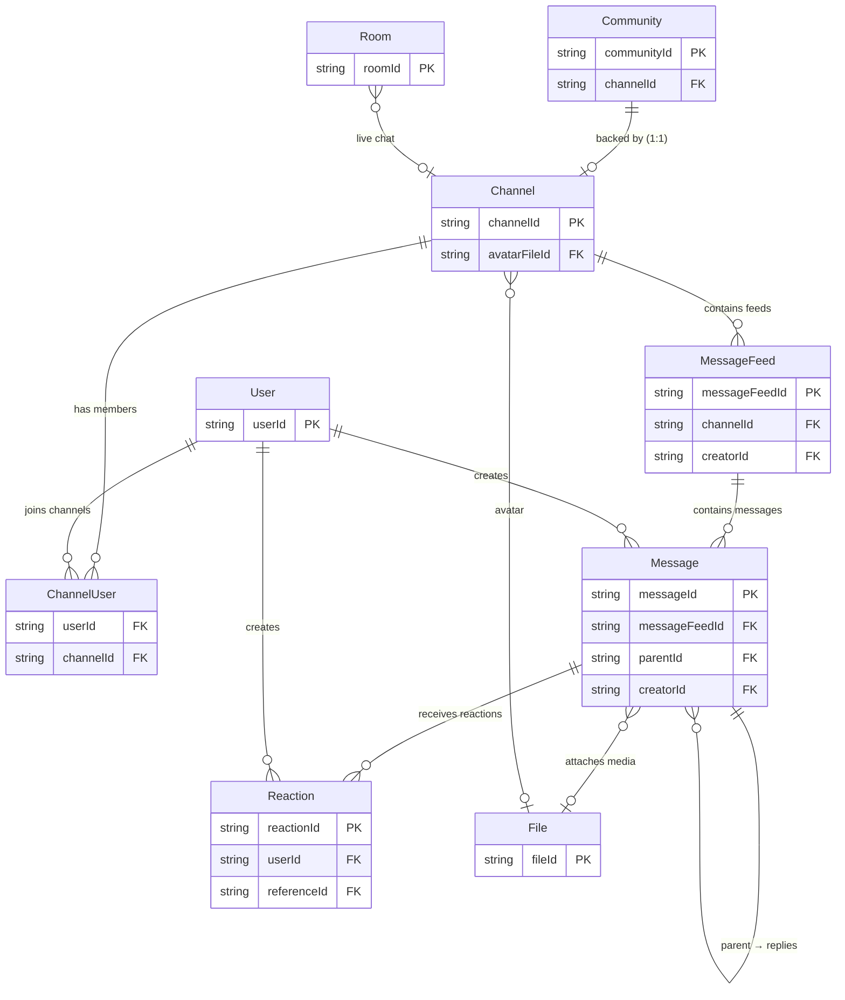
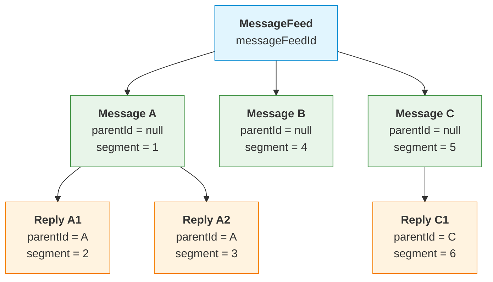
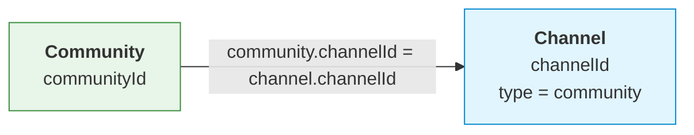

The chat module provides real-time messaging through **channels** (group chats, direct conversations, broadcasts). Users join channels as **channel users**, exchange **messages** within **message feeds** (threads), and can attach media, reactions, and mentions.

Channels are the top-level container. Each channel has one or more **message feeds** (threads), and each feed contains **messages** ordered by a monotonically increasing `segment`. Messages support threading via a self-referential `parentId`.

<Info>
**Who is this for?** This reference describes the core chat server data model. It's essential for data import, analytics integration, and understanding API response structures. For social entities (User, Community, Post, Comment, etc.), see the [Social Data Model Reference](/api-reference/social-data-model).
</Info>

<CardGroup cols={3}>
  <Card title="Entity Reference" icon="database" href="#entity-reference">
    6 core entities with full field definitions, types, and relationship mappings
  </Card>
  <Card title="Patterns & Relationships" icon="diagram-project" href="#message-threading-model">
    Message threading, channel–community linking, and feed structure
  </Card>
  <Card title="Enums & Import Tips" icon="list-check" href="#key-enums-reference">
    Enum values and 8 practical data import guidelines
  </Card>
</CardGroup>

## Conventions

| Convention            | Description                                                                                                                                                                                     |
| --------------------- | ----------------------------------------------------------------------------------------------------------------------------------------------------------------------------------------------- |
| **Triple-ID pattern** | Most entities expose three IDs: a primary `{entity}Id`, a `{entity}PublicId` (stable external identifier), and a `{entity}InternalId` (database-level reference). For joins, prefer public IDs. |
| **Soft delete**       | Nearly every entity has an `isDeleted` boolean. Deleted records remain in the database with `isDeleted: true`. Filter these out unless you specifically need deletion history.                  |
| **Timestamps**        | `createdAt` and `updatedAt` (ISO 8601 date-time) are present on all entities. Some also have `editedAt`.                                                                                        |
| **Metadata**          | A freeform `metadata` object is available on most entities for custom fields.                                                                                                                   |
| **Flagging**          | `flagCount` (number of reports) and `hashFlag` (bloom-filter structure) track moderation state on messages. Channels bubble up flags via `hasFlaggedMessage`.                                   |

## Entity-Relationship Diagram

The following diagram shows the core entities and their relationships in the chat module.



## Entity Reference

<AccordionGroup>
  <Accordion title="Channel" icon="hashtag">
    A chat room, conversation, or group. Channels are the top-level container for messaging. Every community has a 1:1 backing channel. Channels can be standard (open), private, direct conversations, broadcast, community-backed, or live (attached to a room).

    | Field                          | Type      | Description                                                                        |
    | ------------------------------ | --------- | ---------------------------------------------------------------------------------- |
    | `channelId`                    | string    | **Primary key.** Public channel identifier.                                        |
    | `channelInternalId`            | string    | Internal database identifier.                                                      |
    | `channelPublicId`              | string    | Public identifier (same as `channelId`).                                           |
    | `type`                         | enum      | `standard` \| `private` \| `conversation` \| `broadcast` \| `community` \| `live`. |
    | `displayName`                  | string    | Channel display name.                                                              |
    | `isDistinct`                   | boolean   | If true, reuses existing channel for the same user set (conversations).            |
    | `tags`                         | string[]  | Tags for filtering/categorization.                                                 |
    | `metadata`                     | object    | Arbitrary custom fields.                                                           |
    | `avatarFileId`                 | string    | FK → File. Channel avatar image.                                                   |
    | `lastActivity`                 | date-time | Timestamp of last activity (message, event, etc.).                                 |
    | `memberCount`                  | integer   | _(Computed)_ Number of members.                                                    |
    | `messageCount`                 | integer   | _(Computed)_ Number of messages.                                                   |
    | `moderatorMemberCount`         | integer   | Count of moderator members.                                                        |
    | `isPublic`                     | boolean   | Whether channel is publicly listed.                                                |
    | `notificationMode`             | enum      | `default` \| `silent` \| `subscribe`.                                              |
    | `isMuted`                      | boolean   | _(Computed)_ Whether the channel is currently muted (based on `muteTimeout`).      |
    | `muteTimeout`                  | date-time | When the channel-level mute expires.                                               |
    | `isRateLimited`                | boolean   | _(Computed)_ Whether rate limiting is active (based on `rateLimitTimeout`).        |
    | `rateLimit`                    | number    | Maximum messages per rate limit window.                                            |
    | `rateLimitWindow`              | number    | Rate limit window in milliseconds.                                                 |
    | `rateLimitTimeout`             | date-time | When the current rate limit expires.                                               |
    | `messageAutoDeleteEnabled`     | boolean   | Whether auto-delete by flag threshold is enabled.                                  |
    | `autoDeleteMessageByFlagLimit` | number    | Flag count threshold for auto-deletion.                                            |
    | `messagePreviewId`             | string    | _(Computed)_ ID of the latest message preview.                                     |
    | `attachedTo`                   | object    | Linked resources: `{postId, videoStreamId, roomId}`.                               |
    | `isDeleted`                    | boolean   | Soft-delete flag.                                                                  |
    | `createdAt`                    | date-time | Creation timestamp.                                                                |
    | `updatedAt`                    | date-time | Last update timestamp.                                                             |

    **Relationships:**
    - `1:1` → Community (community-type channels back a community; see [Channel ↔ Community Relationship](#channel--community-relationship))
    - `1:N` → ChannelUser (members)
    - `1:N` → MessageFeed (message threads within the channel)
    - `0:1` → Room (live-type channels are attached to a room via `attachedTo.roomId`)
    - `0:1` → File (avatar via `avatarFileId`)

    ```mermaid placement="top-left" actions={true}
    erDiagram
        Community ||--o| Channel : "backed by (1:1)"
        Channel ||--o{ ChannelUser : "has members"
        Channel ||--o{ MessageFeed : "contains feeds"
        Room }o--o| Channel : "live chat"
        Channel }o--o| File : "avatar"
    ```
  </Accordion>

  <Accordion title="ChannelUser (Member)" icon="user-group">
    The **join entity** between User and Channel. Represents a user's membership, roles, and read state within a channel.

    | Field                  | Type      | Description                                       |
    | ---------------------- | --------- | ------------------------------------------------- |
    | `userId`               | string    | FK → User. User's public ID.                      |
    | `userInternalId`       | string    | User's internal ID.                               |
    | `userPublicId`         | string    | User's public ID.                                 |
    | `channelId`            | string    | FK → Channel. Channel's public ID.                |
    | `channelInternalId`    | string    | Channel's internal ID.                            |
    | `channelPublicId`      | string    | Channel's public ID.                              |
    | `membership`           | enum      | `none` \| `member` \| `banned`.                   |
    | `roles`                | string[]  | Role public IDs assigned within this channel.     |
    | `permissions`          | string[]  | Resolved permissions from roles.                  |
    | `isBanned`             | boolean   | _(Computed)_ `true` when `membership = "banned"`. |
    | `isMuted`              | boolean   | _(Computed)_ `true` when `muteTimeout > now`.     |
    | `muteTimeout`          | date-time | When the user-level mute expires in this channel. |
    | `readToSegment`        | number    | Last-read message segment (read cursor).          |
    | `lastMentionedSegment` | number    | Segment of last @mention for this user.           |
    | `lastActivity`         | date-time | User's last activity in the channel.              |
    | `createdAt`            | date-time | Record creation timestamp.                        |
    | `updatedAt`            | date-time | Last update timestamp.                            |

    **Relationships:**
    - `N:1` → User
    - `N:1` → Channel
    - Composite key: (`userId`, `channelId`)

    ```mermaid placement="top-left" actions={true}
    erDiagram
        User ||--o{ ChannelUser : "joins channels"
        Channel ||--o{ ChannelUser : "has members"
    ```
  </Accordion>

  <Accordion title="Message" icon="message">
    A message within a channel. Messages belong to a MessageFeed and support threading (replies). Each message is stored as its own document.

    | Field             | Type      | Description                                                                            |
    | ----------------- | --------- | -------------------------------------------------------------------------------------- |
    | `messageId`       | string    | **Primary key.** Internal message ID.                                                  |
    | `publicId`        | string    | Public-facing message ID.                                                              |
    | `channelId`       | string    | FK → Channel. Channel this message belongs to.                                         |
    | `channelPublicId` | string    | Channel's public ID.                                                                   |
    | `messageFeedId`   | string    | FK → MessageFeed. The feed/thread containing this message.                             |
    | `parentId`        | string    | FK → Message (self). Parent message ID for replies. `null` for top-level messages.     |
    | `creatorId`       | string    | FK → User. Creator's internal ID.                                                      |
    | `creatorPublicId` | string    | Creator's public ID.                                                                   |
    | `dataType`        | enum      | `text` \| `image` \| `video` \| `file` \| `audio` \| `custom` \| `json` \| `imagemap`. |
    | `data`            | object    | Message payload. For media types, includes `fileId` and optionally `thumbnailFileId`.  |
    | `segment`         | number    | Ordering position within the feed.                                                     |
    | `tags`            | string[]  | Tags associated with this message.                                                     |
    | `metadata`        | object    | Arbitrary custom fields.                                                               |
    | `mentionedUsers`  | array     | Mentioned users: `[{type: "user"\|"channel", userIds: [...]}]`.                        |
    | `childCount`      | integer   | Number of direct replies.                                                              |
    | `reactions`       | object    | Map of `reactionName → count`.                                                         |
    | `reactionCount`   | integer   | Total reaction count.                                                                  |
    | `myReactions`     | string[]  | Current user's reaction names.                                                         |
    | `flagCount`       | integer   | Number of moderation reports.                                                          |
    | `hashFlag`        | object    | _(Computed)_ Bloom-filter flag structure.                                              |
    | `editedAt`        | date-time | Last content edit timestamp.                                                           |
    | `isDeleted`       | boolean   | Soft-delete flag.                                                                      |
    | `createdAt`       | date-time | Creation timestamp.                                                                    |
    | `updatedAt`       | date-time | Last update timestamp.                                                                 |

    <Note>
    **Threading model:** See [Message Threading Model](#message-threading-model) below for details on how replies work.
    </Note>

    **Relationships:**
    - `N:1` → User (creator via `creatorId`)
    - `N:1` → Channel (via `channelId`)
    - `N:1` → MessageFeed (via `messageFeedId`)
    - `1:N` → Message (replies via `parentId`, self-referential)
    - `1:N` → Reaction (via `reaction.referenceId` where `referenceType = "message"`)
    - `0:1` → File (attachment via `data.fileId`)

    ```mermaid placement="top-left" actions={true}
    erDiagram
        User ||--o{ Message : "creates"
        MessageFeed ||--o{ Message : "contains"
        Message ||--o{ Message : "parent has replies"
        Message ||--o{ Reaction : "receives"
        Message }o--o| File : "attaches media"
    ```
  </Accordion>

  <Accordion title="MessageFeed" icon="list-timeline">
    A message thread/feed within a channel. Each channel has one or more message feeds. The feed tracks the latest message and provides a message preview for UI display.

    | Field                  | Type      | Description                                                                                      |
    | ---------------------- | --------- | ------------------------------------------------------------------------------------------------ |
    | `messageFeedId`        | string    | **Primary key.**                                                                                 |
    | `channelId`            | string    | FK → Channel. The channel this feed belongs to.                                                  |
    | `channelPublicId`      | string    | Channel's public ID.                                                                             |
    | `channelType`          | enum      | Channel type: `standard` \| `private` \| `conversation` \| `broadcast` \| `community` \| `live`. |
    | `name`                 | string    | Feed display name.                                                                               |
    | `creatorId`            | string    | FK → User. Feed creator's internal ID.                                                           |
    | `creatorPublicId`      | string    | Creator's public ID.                                                                             |
    | `lastMessageId`        | string    | FK → Message. Most recent message.                                                               |
    | `lastMessageTimestamp` | date-time | Timestamp of the most recent message.                                                            |
    | `messagePreviewId`     | string    | _(Computed)_ ID of the preview message.                                                          |
    | `childCount`           | integer   | Number of messages in this feed.                                                                 |
    | `isDeleted`            | boolean   | Soft-delete flag.                                                                                |
    | `editedAt`             | date-time | Last metadata edit timestamp.                                                                    |
    | `createdAt`            | date-time | Creation timestamp.                                                                              |
    | `updatedAt`            | date-time | Last update timestamp.                                                                           |

    **Relationships:**
    - `N:1` → Channel (via `channelId`)
    - `N:1` → User (creator via `creatorId`)
    - `1:N` → Message (messages reference feed via `messageFeedId`)

    ```mermaid placement="top-left" actions={true}
    erDiagram
        Channel ||--o{ MessageFeed : "contains feeds"
        User ||--o{ MessageFeed : "creates"
        MessageFeed ||--o{ Message : "contains messages"
    ```
  </Accordion>

  <Accordion title="Reaction" icon="heart">
    Tracks reactions (likes, love, etc.) on messages. **Each reaction is stored as its own document** — one document per user-reaction-reference combination. Reactions use a **polymorphic reference** that supports multiple content types across both chat and social modules.

    | Field            | Type      | Description                                                                           |
    | ---------------- | --------- | ------------------------------------------------------------------------------------- |
    | `reactionId`     | string    | **Primary key.** Unique reaction instance ID.                                         |
    | `reactionName`   | string    | Freeform name, e.g., `"like"`, `"love"`, `"wow"`.                                     |
    | `userId`         | string    | FK → User. Who reacted.                                                      |
    | `userInternalId` | string    | Reactor's internal ID.                                                                |
    | `referenceId`    | string    | FK → Message (in chat context). The content being reacted to.                         |
    | `referenceType`  | enum      | `post` \| `comment` \| `story` \| `message`. For chat, this is always `message`.      |
    | `createdAt`      | date-time | When the reaction was added.                                                          |
    | `updatedAt`      | date-time | When the reaction was last updated.                                                   |

    <Note>
    Reaction names are **freeform strings**, not a fixed enum. The `reactions` field on Message aggregates these as `{reactionName: count}`. The same Reaction entity is shared across both social and chat modules — only the `referenceType` differs.
    </Note>

    **Relationships:**
    - `N:1` → Message (when `referenceType = "message"`)
    - `N:1` → User (via `userId`)

    ```mermaid placement="top-left" actions={true}
    erDiagram
        Message ||--o{ Reaction : "receives (referenceType=message)"
        User ||--o{ Reaction : "creates"
    ```
  </Accordion>

  <Accordion title="File" icon="file-image">
    An uploaded media file (image, video, audio, or generic file). Files are referenced by messages and channels via `fileId`. The File entity is shared across both social and chat modules.

    | Field                  | Type      | Description                                                                                                                                                           |
    | ---------------------- | --------- | --------------------------------------------------------------------------------------------------------------------------------------------------------------------- |
    | `fileId`               | string    | **Primary key.** Cloud storage key.                                                                                                                                   |
    | `fileUrl`              | string    | HTTP download URL.                                                                                                                                                    |
    | `type`                 | enum      | `image` \| `file` \| `video` \| `audio` \| `clip`.                                                                                                                    |
    | `accessType`           | enum      | `public` (open download) \| `network` (requires authentication).                                                                                                      |
    | `altText`              | string    | Alternative text (max 180 chars).                                                                                                                                     |
    | `feedType`             | string    | Feed type associated with this file.                                                                                                                                  |
    | `status`               | enum      | `uploaded` \| `transcoding` \| `transcoded` \| `transcodeFailed`. Processing status (mainly for video/audio).                                                         |
    | `isDeleted`            | boolean   | Soft-delete flag.                                                                                                                                                     |
    | `videoUrl`             | object    | Video URLs by resolution: `{1080p, 720p, 480p, 360p, original}`. Present for video files.                                                                             |
    | `attributes.name`      | string    | Original file name.                                                                                                                                                   |
    | `attributes.extension` | string    | File extension/format.                                                                                                                                                |
    | `attributes.size`      | number    | File size in bytes.                                                                                                                                                   |
    | `attributes.mimeType`  | string    | MIME type.                                                                                                                                                            |
    | `attributes.metadata`  | object    | _(Schemaless)_ Additional metadata. May contain `width`, `height`, `exif`, `gps` if set by the uploading client, but these sub-fields are not enforced by the schema. |
    | `createdAt`            | date-time | Upload timestamp.                                                                                                                                                     |
    | `updatedAt`            | date-time | Last update timestamp.                                                                                                                                                |

    **Relationships:**
    Referenced by: Message (`data.fileId`, `data.thumbnailFileId`), Channel (`avatarFileId`).

    ```mermaid placement="top-left" actions={true}
    erDiagram
        Message }o--o| File : "attaches media"
        Channel }o--o| File : "avatar"
    ```
  </Accordion>
</AccordionGroup>

## Message Threading Model

Messages support single-level threading within a message feed:



<Steps>
  <Step title="Top-level messages">
    **Top-level messages** have `parentId = null`. They belong directly to the feed.
  </Step>
  <Step title="Replies">
    **Replies** have `parentId` set to the parent message's ID.
  </Step>
  <Step title="Child tracking">
    `childCount` on each message tracks its direct reply count.
  </Step>
  <Step title="Segment ordering">
    Messages are ordered by `segment` within their feed (monotonically increasing). All messages (top-level and replies) live in the same feed and share the same segment counter.
  </Step>
</Steps>

### Reconstructing Threads

1. Query messages by `messageFeedId`.
2. Top-level messages: `parentId = null`.
3. Group replies by `parentId`.
4. Order all messages by `segment`.

## Channel ↔ Community Relationship

Every community in the social module has a 1:1 backing channel with `type = "community"`. This relationship connects the social and chat modules:



<Note>
**Cross-module linking:** The Community entity stores a `channelId` foreign key pointing to its backing channel. Community-type channels inherit the community's membership — a user who is a community member is also a channel member. When importing data that spans both modules, ensure the Community's `channelId` FK is correctly linked.
</Note>

## Key Enums Reference

<Accordion title="Full Enums Table" icon="list">
  | Enum                         | Values                                                                  | Used By                     |
  | ---------------------------- | ----------------------------------------------------------------------- | --------------------------- |
  | **Channel.type**             | `standard`, `private`, `conversation`, `broadcast`, `community`, `live` | Channel `.type`             |
  | **Channel.notificationMode** | `default`, `silent`, `subscribe`                                        | Channel `.notificationMode` |
  | **ChannelUser.membership**   | `none`, `member`, `banned`                                              | ChannelUser `.membership`   |
  | **Message.dataType**         | `text`, `image`, `video`, `file`, `audio`, `custom`, `json`, `imagemap` | Message `.dataType`         |
  | **Reaction.referenceType**   | `post`, `comment`, `story`, `message`                                   | Reaction `.referenceType`   |
</Accordion>

## Data Import Tips

<AccordionGroup>
  <Accordion title="1. ID Resolution" icon="fingerprint">
    Most entities expose three IDs (`channelId`, `channelPublicId`, `channelInternalId`). For joining data across entities, **use the public ID** — these are the values used in foreign key references. Internal IDs are database-level identifiers and may not appear in all API responses.
  </Accordion>

  <Accordion title="2. Channel ↔ Community Linking" icon="link">
    Every community has a 1:1 backing channel (with `type = "community"`). When importing both communities and channels, ensure corresponding records are linked. The community stores a `channelId` foreign key.
  </Accordion>

  <Accordion title="3. Message Ordering by Segment" icon="arrow-down-1-9">
    Messages within a feed are ordered by `segment` (a monotonically increasing integer). **Preserve segment ordering** during import to maintain correct message sequence. Each feed maintains its own independent segment counter.
  </Accordion>

  <Accordion title="4. ChannelUser Composite Key" icon="key">
    The ChannelUser entity uses a composite key of (`userId`, `channelId`). When importing, deduplicate on **both** fields to avoid creating duplicate membership records.
  </Accordion>

  <Accordion title="5. Computed Fields — Do Not Import" icon="ban">
    Several fields are derived at read time and should **not** be imported as stored values:

    - `Channel.isMuted` — derived from `muteTimeout > now`.
    - `Channel.isRateLimited` — derived from `rateLimitTimeout > now`.
    - `Channel.memberCount` / `messageCount` — aggregated from related records.
    - `ChannelUser.isBanned` — derived from `membership = "banned"`.
    - `ChannelUser.isMuted` — derived from `muteTimeout > now`.
    - `Message.myReactions` — derived per-request for the current user.
    - `MessageFeed.messagePreviewId` — derived from latest message.
  </Accordion>

  <Accordion title="6. Filtering Deleted Records" icon="trash-can">
    Soft-deleted records have `isDeleted: true`. **Exclude these by default** for analytics unless you need deletion history.
  </Accordion>

  <Accordion title="7. Reactions on Messages" icon="heart">
    Message reactions follow the same model as social reactions (see [Social Data Model Reference](/api-reference/social-data-model)). Each reaction is stored as a separate document with `referenceType = "message"` and `referenceId` pointing to the message. The `reactions` object on Message provides pre-aggregated `{name: count}` maps.
  </Accordion>

  <Accordion title="8. Message Threading" icon="comments">
    To get only top-level messages (not replies), filter by `parentId = null`. To reconstruct threads, group replies by `parentId` and order by `segment`. See [Message Threading Model](#message-threading-model) for the full pattern.
  </Accordion>
</AccordionGroup>

## Related Topics

<CardGroup cols={3}>
  <Card title="Social Data Model" icon="share-nodes" href="/api-reference/social-data-model">
    Core social entities — User, Community, Post, Comment, Reaction, and more
  </Card>
  <Card title="API Overview" icon="server" href="/analytics-and-moderation/social+-apis-and-services/README">
    Server-to-server API capabilities, authentication methods, and getting started guide
  </Card>
  <Card title="SDK Chat Overview" icon="message" href="/social-plus-sdk/chat/overview">
    Client-side SDK implementation for channels, messaging, and real-time chat features
  </Card>
</CardGroup>
