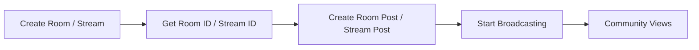

<Info>
**Room concept (recommended):** iOS, Android, and TypeScript SDKs have moved to the Room API for live stream posts. Create a Room first, then create a Room post referencing the room ID. The legacy Stream-based approach is still available but deprecated on iOS.
</Info>

## Overview

Live stream posts embed a real-time video stream inside a social post. The recommended flow for iOS, Android, and TypeScript is to use the **Room API** — create a Room, then post its room ID. Flutter still uses the legacy Stream approach.

### Architecture



## Room Post Parameters

| Parameter | Type | Required | Description |
|-----------|------|----------|-------------|
| `title` | String | No | Room / stream title |
| `description` | String | No | Room / stream description |
| `thumbnailFileId` | String | No | Thumbnail image file ID |
| `metadata` | Object | No | Custom room/stream properties |
| `text` | String | No | Post caption text |
| `roomId` / `streamId` | String | Yes | ID returned after creating the room or stream |
| `targetType` | Enum | Yes | Target destination (`community` or `user`) |
| `targetId` | String | Yes | Community or user ID |

## Implementation

<Tabs>
<Tab title="iOS">

iOS 2025+ uses `AmityRoomRepository` + `AmityRoomPostBuilder`. The stream-based approach (`AmityLiveStreamPostBuilder`) still works but is deprecated.

```swift iOS
// Step 1: Create a room
let roomRepository = AmityRoomRepository(client: client)
let options = AmityRoomCreateOptions(
    title: "Weekly Tech Talk",
    description: "Discussing latest tech trends",
    liveChatEnabled: true
)

do {
    let room = try await roomRepository.createRoom(with: options)

    // Step 2: Create a room post
    let postRepository = AmityPostRepository(client: client)
    let postBuilder = AmityRoomPostBuilder(
        roomId: room.roomId,
        text: "🔴 LIVE: Join our weekly tech discussion!"
    )

    let post = try await postRepository.createRoomPost(
        postBuilder,
        targetId: "tech_community",
        targetType: .community,
        metadata: nil,
        mentionees: nil
    )
    print("Room post created: \(post.postId)")
} catch {
    print("Error: \(error.localizedDescription)")
}
```

<Accordion title="Legacy: Stream-based approach (deprecated)">

```swift iOS
// Note: createLiveStreamPost is deprecated. Use createRoomPost above instead.
let streamRepository = AmityStreamRepository()

do {
    let stream = try await streamRepository.createStream(
        title: "Weekly Tech Talk",
        description: "Discussing latest tech trends",
        resolution: .HD
    )

    let postRepository = AmityPostRepository(client: client)
    let postBuilder = AmityLiveStreamPostBuilder(
        streamId: stream.streamId,
        text: "🔴 LIVE: Join our weekly tech discussion!"
    )

    let post = try await postRepository.createLiveStreamPost(
        postBuilder,
        targetId: "tech_community",
        targetType: .community,
        metadata: nil,
        mentionees: nil
    )
    print("Stream post created: \(post.postId)")
} catch {
    print("Error: \(error.localizedDescription)")
}
```
</Accordion>
</Tab>

<Tab title="Android">

Android supports both Room posts and Stream posts. Room posts are the newer approach.

```kotlin Android
// Step 1: Create a room
AmityVideoClient.newRoomRepository()
    .createRoom(
        title = "Weekly Tech Talk",
        description = "Discussing latest tech trends"
    )
    .flatMap { room ->
        // Step 2: Create a room post
        postRepository.createRoomPost(
            targetType = AmityPost.TargetType.COMMUNITY,
            targetId = "tech_community",
            roomId = room.getRoomId(),
            text = "🔴 LIVE: Join our weekly tech discussion!"
        )
    }
    .doOnSuccess { post: AmityPost ->
        // AmityPost
    }
    .doOnError {
        // Exception
    }
    .subscribe()
```

<Accordion title="Legacy: Stream-based approach">

```kotlin Android
// Still works; use Room approach above for new code.
AmityVideoClient.newStreamRepository()
    .createStream(
        title = "Weekly Tech Talk",
        description = "Discussing latest tech trends",
        resolution = AmityBroadcastResolution.HD_720P
    )
    .flatMap { stream ->
        postRepository.createLiveStreamPost(
            targetType = AmityPost.TargetType.COMMUNITY,
            targetId = "tech_community",
            streamId = stream.getStreamId(),
            text = "🔴 LIVE: Join our weekly tech discussion!"
        )
    }
    .doOnSuccess { post: AmityPost -> }
    .doOnError { }
    .subscribe()
```
</Accordion>
</Tab>

<Tab title="TypeScript">

TypeScript exposes `RoomRepository.createRoom` and `PostRepository.createRoomPost` as static methods.

```typescript TypeScript
import { RoomRepository, PostRepository } from '@amityco/ts-sdk';

// Step 1: Create a room
const { data: room } = await RoomRepository.createRoom({
    title: 'Weekly Tech Talk',
    description: 'Discussing latest tech trends',
    liveChatEnabled: true,
});

// Step 2: Create a room post
const { data: post } = await PostRepository.createRoomPost({
    targetType: 'community',
    targetId: 'tech_community',
    data: {
        roomId: room.roomId,
        text: '🔴 LIVE: Join our weekly tech discussion!',
    },
});

console.log('Room post created:', post.postId);
```

<Accordion title="Legacy: Stream-based approach">

```typescript TypeScript
import { StreamRepository, PostRepository } from '@amityco/ts-sdk';

// Still works; use Room approach above for new code.
const { data: stream } = await StreamRepository.createStream({
    title: 'Weekly Tech Talk',
    description: 'Discussing latest tech trends',
});

const { data: post } = await PostRepository.createPost({
    dataType: 'liveStream',
    targetType: 'community',
    targetId: 'tech_community',
    data: {
        streamId: stream.streamId,
        text: '🔴 LIVE: Join our weekly tech discussion!',
    },
});

console.log('Stream post created:', post.postId);
```
</Accordion>
</Tab>

<Tab title="Flutter">

Flutter uses the Stream-based approach via the post repository builder chain. Room posts are not yet available in Flutter.

```dart Flutter
// Obtain a stream ID from AmityVideoClient.newStreamRepository() or your broadcasting layer.
const existingStreamId = 'stream-id-from-video-sdk';

try {
    final post = await AmitySocialClient.newPostRepository()
        .createPost()
        .targetCommunity('tech_community')
        .liveStream(existingStreamId)
        .text('🔴 LIVE: Join our weekly tech discussion!')
        .post();

    print('Live stream post created: ${post.postId}');
} catch (error) {
    print('Error: $error');
}
```
</Tab>
</Tabs>

## Best Practices

<CardGroup cols={2}>
<Card title="Stream Quality" icon="video">
- Choose appropriate resolution for audience
- Test stream setup before going live
- Use high-quality thumbnails
- Ensure stable internet connection
</Card>

<Card title="Engagement" icon="users">
- Schedule streams in advance
- Use engaging titles and descriptions
- Interact with viewers during stream
- Provide clear call-to-actions
</Card>
</CardGroup>

## Real-World Use Cases

<AccordionGroup>
<Accordion title="Educational Webinars">
```swift
// iOS: Educational live stream
let streamBuilder = AmityStreamBuilder()
    .title("iOS Development Masterclass")
    .description("Learn advanced iOS development techniques")
    .resolution(.hd)
    .metadata(["category": "education", "level": "advanced"])

let postBuilder = AmityLiveStreamPostBuilder()
    .setText("🎓 LIVE: Join our iOS development masterclass! Learn advanced techniques from industry experts.")
    .setTags(["education", "ios", "development", "masterclass"])
```
</Accordion>

<Accordion title="Community Events">
```kotlin
// Android: Community event stream
val streamRepository = AmityVideoClient.newStreamRepository()

streamRepository.createStream(
    title = "Community Town Hall",
    description = "Monthly community updates and Q&A",
    resolution = AmityBroadcastResolution.HD_720P,
).subscribe { stream ->
    val postBuilder = AmityLiveStreamPostCreator.Builder()
        .streamId(stream.getStreamId())
        .text("🏛️ LIVE: Monthly Town Hall - Share your thoughts and get updates!")
        .tags(listOf("community", "town_hall", "updates", "qa"))
}
```
</Accordion>

<Accordion title="Product Launches">
```typescript
// TypeScript: Product launch stream
const stream = await streamRepository.createStream({
    title: 'New Feature Launch Event',
    description: 'Introducing our latest product features',
    resolution: Amity.StreamResolution.HD,
    metadata: { event_type: 'product_launch', version: '2.0' }
});

const post = await postRepository.createPost({
    dataType: 'liveStream',
    data: {
        text: '🚀 LIVE: Big product announcement! Join us for the launch of exciting new features.',
        streamId: stream.streamId
    },
    tags: ['product', 'launch', 'features', 'announcement']
});
```
</Accordion>
</AccordionGroup>

<Warning>
Live streams require appropriate permissions and may have community-specific limits on concurrent streams.
</Warning>