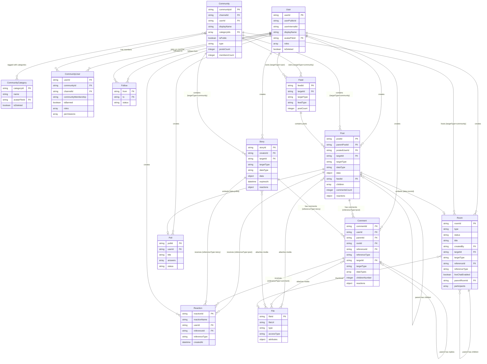

# Social Module — Data Model Reference

> **Audience**: Engineers performing data import and analytics integration.
> This document describes the core social entities, their fields, relationships, and conventions you need to understand when importing or querying social module data.

---

## Table of Contents

- [Social Module — Data Model Reference](#social-module--data-model-reference)
  - [Table of Contents](#table-of-contents)
  - [Overview](#overview)
    - [Conventions used across all entities](#conventions-used-across-all-entities)
  - [Entity-Relationship Diagram](#entity-relationship-diagram)
  - [Entity Reference](#entity-reference)
    - [User](#user)
    - [Community](#community)
    - [CommunityCategory](#communitycategory)
    - [CommunityUser (Member)](#communityuser-member)
    - [Post](#post)
    - [Comment](#comment)
    - [Reaction](#reaction)
    - [Follow](#follow)
    - [Feed](#feed)
    - [Poll](#poll)
    - [Room](#room)
    - [Story](#story)
    - [File](#file)
  - [Polymorphic Reference Patterns](#polymorphic-reference-patterns)
    - [Pattern 1: `targetId` + `targetType`](#pattern-1-targetid--targettype)
    - [Pattern 2: `referenceId` + `referenceType`](#pattern-2-referenceid--referencetype)
  - [Post Composition Model (Parent–Child Posts)](#post-composition-model-parentchild-posts)
  - [Comment Threading Model](#comment-threading-model)
  - [Feed System](#feed-system)
    - [Feed Endpoints](#feed-endpoints)
    - [Post → Feed Mapping](#post--feed-mapping)
  - [Key Enums Reference](#key-enums-reference)
  - [Data Import Tips](#data-import-tips)
    - [1. ID Resolution](#1-id-resolution)
    - [2. Routing Posts to Communities vs. User Profiles](#2-routing-posts-to-communities-vs-user-profiles)
    - [3. Reactions are Freeform](#3-reactions-are-freeform)
    - [4. Polls are Embedded in Posts](#4-polls-are-embedded-in-posts)
    - [5. Stories Expire](#5-stories-expire)
    - [6. Filtering Deleted Records](#6-filtering-deleted-records)
    - [7. Feed Type Awareness](#7-feed-type-awareness)
    - [8. Post Children vs. Top-Level Posts](#8-post-children-vs-top-level-posts)
    - [9. Comment Depth](#9-comment-depth)
    - [10. Community Membership](#10-community-membership)

---

## Overview

The social module is built around a set of interconnected entities that model a social network: **users** create and join **communities**, publish **posts** and **stories**, leave **comments**, add **reactions**, and **follow** each other. Content is organized through **feeds**, and media is managed via **files**.

### Conventions used across all entities

| Convention            | Description                                                                                                                                                                                                    |
| --------------------- | -------------------------------------------------------------------------------------------------------------------------------------------------------------------------------------------------------------- |
| **Triple-ID pattern** | Most entities expose three IDs: a primary `{entity}Id`, a `{entity}PublicId` (stable external identifier), and a `{entity}InternalId` (database-level reference). For joins, prefer `userId` / `userPublicId`. |
| **Soft delete**       | Nearly every entity has an `isDeleted` boolean. Deleted records remain in the database with `isDeleted: true`. Filter these out unless you specifically need deletion history.                                 |
| **Timestamps**        | `createdAt` and `updatedAt` (ISO 8601 date-time) are present on all entities. Some also have `editedAt`.                                                                                                       |
| **Metadata**          | A freeform `metadata` object is available on most entities for custom fields.                                                                                                                                  |
| **Flagging**          | `flagCount` (number of reports) and `hashFlag` (bloom-filter structure) track moderation state. Parent entities bubble up flags via `hasFlaggedComment`, `hasFlaggedPost`, `hasFlaggedChildren`.               |

---

## Entity-Relationship Diagram



---

## Entity Reference

### User

A registered user within the network. Users can create content, join communities, follow others, and react to content.

| Field             | Type      | Description                                                   |
| ----------------- | --------- | ------------------------------------------------------------- |
| `userId`          | string    | **Primary key.** Unique user identifier.                      |
| `userPublicId`    | string    | Stable public identifier (v3+).                               |
| `userInternalId`  | string    | Internal database identifier (v3+).                           |
| `displayName`     | string    | Display name.                                                 |
| `profileHandle`   | string    | Unique handle (v3+).                                          |
| `description`     | string    | User bio (v3+).                                               |
| `avatarFileId`    | string    | FK → [File](#file). Avatar image.                             |
| `avatarCustomUrl` | string    | External avatar URL (v3+).                                    |
| `roles`           | string[]  | Role IDs assigned to this user.                               |
| `permissions`     | string[]  | Resolved permissions (v3+).                                   |
| `flagCount`       | integer   | Number of moderation reports.                                 |
| `hashFlag`        | object    | Bloom-filter flag structure.                                  |
| `metadata`        | object    | Custom fields.                                                |
| `isGlobalBan`     | boolean   | Whether user is globally banned (v3+).                        |
| `isBrand`         | boolean   | Whether user is a brand account (v3+).                        |
| `tags`            | array     | Tag assignments: `[{tagId: "...", assignedAt: "..."}]` (v3+). |
| `isDeleted`       | boolean   | Soft-delete flag.                                             |
| `createdAt`       | date-time | Creation timestamp.                                           |
| `updatedAt`       | date-time | Last update timestamp.                                        |

**Relationships:**

- `1:N` → Post (as `postedUserId`)
- `1:N` → Comment (as `userId`)
- `1:N` → Story (as `creatorId`)
- `1:N` → Poll (as `userId`)
- `M:N` → Community (via [CommunityUser](#communityuser-member) join)
- `1:N` → Follow (as `from` or `to`)

---

### Community

A group or space where users gather, share posts, and interact. Every community has a backing channel (1:1) and can be associated with categories.

> **Note for direct DB queries:** Several community fields (`displayName`, `tags`, `metadata`, `avatarFileId`, `categoryIds`, `hasFlaggedComment`, `hasFlaggedPost`, `notificationMode`) are actually stored on the backing **Channel** document, not on the Community document itself. The API serializer merges both into a single response.

| Field                        | Type      | Description                                                 |
| ---------------------------- | --------- | ----------------------------------------------------------- |
| `communityId`                | string    | **Primary key.**                                            |
| `channelId`                  | string    | FK → Channel. 1:1 backing channel.                          |
| `userId`                     | string    | FK → [User](#user). Creator.                                |
| `userPublicId`               | string    | Creator's public ID.                                        |
| `userInternalId`             | string    | Creator's internal ID.                                      |
| `displayName`                | string    | Community display name.                                     |
| `description`                | string    | Community description.                                      |
| `avatarFileId`               | string    | FK → [File](#file). Avatar image.                           |
| `isOfficial`                 | boolean   | Official community flag.                                    |
| `isPublic`                   | boolean   | Public visibility.                                          |
| `isDiscoverable`             | boolean   | Whether private community appears in search.                |
| `onlyAdminCanPost`           | boolean   | Restrict posting to admins.                                 |
| `needApprovalOnPostCreation` | boolean   | Posts require review before publishing.                     |
| `requiresJoinApproval`       | boolean   | Members need admin approval to join.                        |
| `allowCommentInStory`        | boolean   | Allow comments on stories.                                  |
| `categoryIds`                | string[]  | FK → [CommunityCategory](#communitycategory). Many-to-many. |
| `tags`                       | string[]  | Searchable tags.                                            |
| `metadata`                   | object    | Custom fields.                                              |
| `postsCount`                 | integer   | Total post count.                                           |
| `membersCount`               | integer   | Total member count.                                         |
| `moderatorMemberCount`       | integer   | Moderator count.                                            |
| `hasFlaggedComment`          | boolean   | Contains reported comments.                                 |
| `hasFlaggedPost`             | boolean   | Contains reported posts.                                    |
| `notificationMode`           | enum      | `default` \| `silent` \| `subscribe`.                       |
| `type`                       | enum      | `default` \| `event`.                                       |
| `eventId`                    | string    | FK → Event. Present when `type = "event"`.                  |
| `isJoined`                   | boolean   | _(Computed)_ Whether the requesting user is a member.       |
| `isDeleted`                  | boolean   | Soft-delete flag.                                           |
| `createdAt`                  | date-time | Creation timestamp.                                         |
| `updatedAt`                  | date-time | Last update timestamp.                                      |

**Relationships:**

- `1:1` → Channel (every community has a backing channel)
- `M:N` → CommunityCategory (via `categoryIds[]`)
- `1:N` → CommunityUser (members)
- `1:N` → Post (via polymorphic `targetId` where `targetType = "community"`)
- `1:N` → Story (via polymorphic `targetId` where `targetType = "community"`)
- `1:N` → Feed (via polymorphic `targetId` where `targetType = "community"`)

---

### CommunityCategory

A label/tag that can be associated with communities. Communities reference categories via `categoryIds[]` (many-to-many).

| Field          | Type      | Description                          |
| -------------- | --------- | ------------------------------------ |
| `categoryId`   | string    | **Primary key.**                     |
| `name`         | string    | Display name.                        |
| `metadata`     | object    | Custom fields.                       |
| `avatarFileId` | string    | FK → [File](#file). Category avatar. |
| `isDeleted`    | boolean   | Soft-delete flag.                    |
| `createdAt`    | date-time | Creation timestamp.                  |
| `updatedAt`    | date-time | Last update timestamp.               |

**Relationships:**

- `M:N` → Community (referenced by `community.categoryIds[]`)

---

### CommunityUser (Member)

The **join entity** between User and Community. Represents a user's membership, roles, and status within a community.

| Field                 | Type      | Description                                    |
| --------------------- | --------- | ---------------------------------------------- |
| `userId`              | string    | FK → [User](#user).                            |
| `userPublicId`        | string    | User's public ID.                              |
| `userInternalId`      | string    | User's internal ID.                            |
| `communityId`         | string    | FK → [Community](#community).                  |
| `channelId`           | string    | FK → Channel. The community's backing channel. |
| `communityMembership` | enum      | `none` \| `member` \| `banned`.                |
| `notMemberReason`     | string    | Reason user is not a member.                   |
| `isBanned`            | boolean   | Ban status.                                    |
| `roles`               | string[]  | Community-specific role IDs.                   |
| `permissions`         | string[]  | Resolved permissions within this community.    |
| `lastActivity`        | date-time | Last activity in community.                    |
| `createdAt`           | date-time | Record creation timestamp.                     |
| `updatedAt`           | date-time | Last update timestamp.                         |

**Relationships:**

- `N:1` → User
- `N:1` → Community
- Composite key: (`userId`, `communityId`)

---

### Post

The primary content unit. Posts can target a community or a user's profile feed. Posts support a **parent–child composition** model where a single logical post (e.g., a gallery) is a parent with child posts for each attachment. See [Post Composition Model](#post-composition-model-parentchild-posts).

| Field                   | Type      | Description                                                                                                    |
| ----------------------- | --------- | -------------------------------------------------------------------------------------------------------------- |
| `postId`                | string    | **Primary key.**                                                                                               |
| `parentPostId`          | string    | FK → Post (self). Parent post ID for child posts. `null` for top-level posts.                                  |
| `postedUserId`          | string    | FK → [User](#user). Creator.                                                                                   |
| `postedUserPublicId`    | string    | Creator's public ID.                                                                                           |
| `postedUserInternalId`  | string    | Creator's internal ID.                                                                                         |
| `sharedPostId`          | string    | FK → Post. Reference to the shared/reposted post.                                                              |
| `sharedCount`           | integer   | Number of times shared.                                                                                        |
| `targetId`              | string    | FK → Community or User. **Polymorphic target.**                                                                |
| `targetPublicId`        | string    | Target's public ID.                                                                                            |
| `targetInternalId`      | string    | Target's internal ID.                                                                                          |
| `targetType`            | enum      | `user` \| `community` \| `content`. Determines what `targetId` points to.                                      |
| `dataType`              | enum      | `text` \| `image` \| `file` \| `video` \| `liveStream` \| `audio` \| `poll` \| `clip` \| `room`. Content type. |
| `data`                  | object    | Content payload. Fields vary by `dataType` — see below.                                                        |
| `data.title`            | string    | Post title (max 150 chars).                                                                                    |
| `data.text`             | string    | Post body text.                                                                                                |
| `data.fileId`           | string    | FK → [File](#file). Image/file attachment.                                                                     |
| `data.thumbnailFileId`  | string    | FK → File. Video thumbnail.                                                                                    |
| `data.videoFileId`      | object    | Video file IDs by quality: `{original, low, medium, high}`.                                                    |
| `data.streamId`         | string    | FK → VideoStream. For live stream posts.                                                                       |
| `data.imageDisplayMode` | enum      | `fit` \| `fill`. How image is displayed.                                                                       |
| `data.roomId`           | string    | FK → Room. For room posts.                                                                                     |
| `metadata`              | object    | Custom fields.                                                                                                 |
| `children`              | string[]  | IDs of child posts.                                                                                            |
| `childrenNumber`        | integer   | Count of child posts.                                                                                          |
| `comments`              | string[]  | IDs of comments.                                                                                               |
| `commentsCount`         | integer   | Total comment count.                                                                                           |
| `reactions`             | object    | Map of `reactionName → count` (e.g., `{"like": 5}`).                                                           |
| `reactionsCount`        | integer   | Total reaction count.                                                                                          |
| `myReactions`           | string[]  | Current user's reaction names.                                                                                 |
| `feedId`                | string    | FK → [Feed](#feed). Which feed this post belongs to.                                                           |
| `tags`                  | string[]  | Up to 5 tags (max 24 chars each).                                                                              |
| `hashtags`              | string[]  | Up to 30 hashtags (max 100 chars each).                                                                        |
| `mentionees`            | array     | Mentioned users: `[{type: "user", userIds: [...]}]`.                                                           |
| `impression`            | integer   | Non-unique view count.                                                                                         |
| `reach`                 | integer   | Unique view count.                                                                                             |
| `structureType`         | enum      | Derived type — see [StructureType enum](#key-enums-reference).                                                 |
| `flagCount`             | integer   | Report count.                                                                                                  |
| `hashFlag`              | object    | Bloom-filter flag.                                                                                             |
| `hasFlaggedComment`     | boolean   | Contains reported comments.                                                                                    |
| `hasFlaggedChildren`    | boolean   | Contains reported child posts.                                                                                 |
| `approved`              | boolean   | Whether the post is approved for global feed.                                                                  |
| `isDiscoverable`        | boolean   | Whether the post is discoverable.                                                                              |
| `sequenceNumber`        | integer   | Ordering sequence within feed.                                                                                 |
| `publisherId`           | string    | FK → User. Publisher (may differ from poster in moderated flows).                                              |
| `publisherPublicId`     | string    | Publisher's public ID.                                                                                         |
| `eventId`               | string    | FK → Event. Room/event reference (optional).                                                                   |
| `links`                 | array     | Link preview data extracted from post content.                                                                 |
| `editedAt`              | date-time | Last content edit timestamp.                                                                                   |
| `isDeleted`             | boolean   | Soft-delete flag.                                                                                              |
| `createdAt`             | date-time | Creation timestamp.                                                                                            |
| `updatedAt`             | date-time | Last update timestamp.                                                                                         |

**Relationships:**

- `N:1` → User (creator via `postedUserId`)
- `N:1` → Community or User (via `targetId` + `targetType`)
- `1:N` → Post (children via `parentPostId`, self-referential)
- `1:N` → Comment (via `comment.referenceId` where `referenceType = "post"`)
- `1:N` → Reaction (via `reaction.referenceId` where `referenceType = "post"`)
- `N:1` → Feed (via `feedId`)
- `0:1` → Poll (via `data.pollId` when created as poll post)
- `0:N` → File (attachments via child posts or `data.fileId`)

---

### Comment

A comment attached to a Post or Story. Comments support **two-level threading** — see [Comment Threading Model](#comment-threading-model).

| Field               | Type      | Description                                                                                 |
| ------------------- | --------- | ------------------------------------------------------------------------------------------- |
| `commentId`         | string    | **Primary key.**                                                                            |
| `userId`            | string    | FK → [User](#user). Creator.                                                                |
| `userPublicId`      | string    | Creator's public ID.                                                                        |
| `userInternalId`    | string    | Creator's internal ID.                                                                      |
| `parentId`          | string    | FK → Comment (self). Direct parent for replies. `null` for top-level.                       |
| `rootId`            | string    | FK → Comment (self). Thread root comment. `null` for top-level.                             |
| `referenceId`       | string    | FK → Post or Story. **Polymorphic**. The content this comment is on.                        |
| `referenceType`     | enum      | `post` \| `content` \| `story`. What `referenceId` points to.                               |
| `targetId`          | string    | _(Computed)_ FK → Community or User. Derived from `path` at serialization time.             |
| `targetType`        | enum      | _(Computed)_ `community` \| `user` \| `content`. Derived from `path` at serialization time. |
| `dataType`          | string    | _(Deprecated)_ Type of comment — fixed as `"text"` in newer SDKs.                           |
| `dataTypes`         | string[]  | Content types: `text` \| `image` \| `video`. A comment can contain multiple types.          |
| `data`              | object    | Comment body content.                                                                       |
| `metadata`          | object    | Custom fields.                                                                              |
| `attachments`       | array     | Media attachments — `[{type: "image"\|"video", fileId: "..."}]`.                            |
| `children`          | string[]  | IDs of reply comments.                                                                      |
| `childrenNumber`    | integer   | Reply count.                                                                                |
| `reactions`         | object    | Map of `reactionName → count`.                                                              |
| `reactionsCount`    | integer   | Total reaction count.                                                                       |
| `myReactions`       | string[]  | Current user's reaction names.                                                              |
| `mentionees`        | array     | Mentioned users: `[{type: "user", userIds: [...]}]`.                                        |
| `segmentNumber`     | integer   | Ordering segment.                                                                           |
| `flagCount`         | integer   | Report count.                                                                               |
| `hashFlag`          | object    | Bloom-filter flag.                                                                          |
| `publisherPublicId` | string    | Publisher's public ID (may differ from commenter).                                          |
| `links`             | array     | Link preview data extracted from comment content.                                           |
| `editedAt`          | date-time | Last edit timestamp.                                                                        |
| `isDeleted`         | boolean   | Soft-delete flag.                                                                           |
| `createdAt`         | date-time | Creation timestamp.                                                                         |
| `updatedAt`         | date-time | Last update timestamp.                                                                      |

**Relationships:**

- `N:1` → User (creator via `userId`)
- `N:1` → Post or Story (via `referenceId` + `referenceType`)
- `1:N` → Comment (replies via `parentId`, self-referential)
- `N:1` → Comment (root thread via `rootId`)
- `1:N` → Reaction (via `reaction.referenceId` where `referenceType = "comment"`)
- `0:N` → File (via `attachments[].fileId`)

---

### Reaction

Tracks reactions (likes, love, etc.) on content. **Each reaction is stored as its own document** — one document per user-reaction-reference combination. Reactions use a **polymorphic reference** to support multiple content types.

| Field            | Type      | Description                                                                           |
| ---------------- | --------- | ------------------------------------------------------------------------------------- |
| `reactionId`     | string    | **Primary key.** Unique reaction instance ID.                                         |
| `reactionName`   | string    | Freeform name, e.g., `"like"`, `"love"`, `"wow"`.                                     |
| `userId`         | string    | FK → [User](#user). Who reacted.                                                      |
| `userInternalId` | string    | Reactor's internal ID.                                                                |
| `referenceId`    | string    | FK → Post, Comment, Story, or Message. The content being reacted to.                  |
| `referenceType`  | enum      | `post` \| `comment` \| `story` \| `message`. Determines what `referenceId` points to. |
| `createdAt`      | date-time | When the reaction was added.                                                          |
| `updatedAt`      | date-time | When the reaction was last updated.                                                   |

> **Note**: Reaction names are **freeform strings**, not a fixed enum. The `reactions` field on Post/Comment/Story aggregates these as `{reactionName: count}`.
>
> **Aggregated view:** When querying reactions for a reference, the API returns an aggregated `reactors[]` array grouped by reference. Each entry contains `reactionId`, `reactionName`, `userId`, and `createdAt`.

**Relationships:**

- `N:1` → Post (when `referenceType = "post"`)
- `N:1` → Comment (when `referenceType = "comment"`)
- `N:1` → Story (when `referenceType = "story"`)
- `N:1` → Message (when `referenceType = "message"`)
- `N:1` → User (via `userId`)

---

### Follow

A user-to-user follow relationship. Supports request-based following with status tracking.

| Field                | Type      | Description                                                  |
| -------------------- | --------- | ------------------------------------------------------------ |
| `from`               | string    | FK → [User](#user). The follower's user ID.                  |
| `fromUserPublicId`   | string    | Follower's public ID.                                        |
| `fromUserInternalId` | string    | Follower's internal ID.                                      |
| `to`                 | string    | FK → [User](#user). The followed user's ID.                  |
| `toUserPublicId`     | string    | Followed user's public ID.                                   |
| `toUserInternalId`   | string    | Followed user's internal ID.                                 |
| `status`             | enum      | `pending` \| `accepted` \| `none` \| `deleted` \| `blocked`. |
| `createdAt`          | date-time | When the follow was initiated.                               |
| `updatedAt`          | date-time | Last status change.                                          |

**FollowCount** (separate aggregation entity):

| Field            | Type    | Description                     |
| ---------------- | ------- | ------------------------------- |
| `userId`         | string  | FK → User.                      |
| `followerCount`  | integer | Number of followers.            |
| `followingCount` | integer | Number of users being followed. |
| `pendingCount`   | integer | Pending follow requests.        |

**Relationships:**

- `N:1` → User (from — the follower)
- `N:1` → User (to — the followed)

---

### Feed

A container that groups posts for a specific target (community or user). Each target can have up to three feed types that represent different stages of the post approval workflow.

| Field        | Type      | Description                                                                         |
| ------------ | --------- | ----------------------------------------------------------------------------------- |
| `feedId`     | string    | **Primary key.**                                                                    |
| `targetId`   | string    | FK → Community or User. **Polymorphic owner.**                                      |
| `targetType` | enum      | `community` \| `user`.                                                              |
| `feedType`   | enum      | `published` (main feed) \| `reviewing` (pending approval) \| `declined` (rejected). |
| `postCount`  | integer   | Number of posts in this feed.                                                       |
| `createdAt`  | date-time | Creation timestamp.                                                                 |
| `updatedAt`  | date-time | Last update timestamp.                                                              |

**Relationships:**

- `N:1` → Community (when `targetType = "community"`)
- `N:1` → User (when `targetType = "user"`)
- `1:N` → Post (posts reference feed via `post.feedId`)

---

### Poll

A poll embedded within a post. Polls have a question with up to 10 answers and can be open or closed.

| Field            | Type      | Description                                                        |
| ---------------- | --------- | ------------------------------------------------------------------ |
| `pollId`         | string    | **Primary key.**                                                   |
| `userId`         | string    | FK → [User](#user). Creator.                                       |
| `userPublicId`   | string    | Creator's public ID.                                               |
| `userInternalId` | string    | Creator's internal ID.                                             |
| `title`          | string    | Poll title (max 150 chars).                                        |
| `question`       | string    | Poll question text.                                                |
| `answerType`     | enum      | `single` \| `multiple`. Whether user can pick one or many answers. |
| `answers`        | array     | Up to 10 answers — see Answer below.                               |
| `status`         | enum      | `open` (default) \| `closed`.                                      |
| `closedAt`       | string    | When the poll was/should be closed.                                |
| `closedIn`       | number    | Auto-close duration.                                               |
| `isVoted`        | boolean   | _(Computed)_ Whether current user has voted.                       |
| `isDeleted`      | boolean   | Soft-delete flag.                                                  |
| `createdAt`      | date-time | Creation timestamp.                                                |
| `updatedAt`      | date-time | Last update timestamp.                                             |

**Answer** (nested object):

| Field           | Type    | Description                                             |
| --------------- | ------- | ------------------------------------------------------- |
| `id`            | string  | Option ID.                                              |
| `dataType`      | enum    | `text` \| `image`.                                      |
| `data`          | string  | Answer text.                                            |
| `fileId`        | string  | FK → [File](#file). Required when `dataType = "image"`. |
| `voteCount`     | number  | Number of votes.                                        |
| `isVotedByUser` | boolean | Whether current user voted for this option.             |

**UsersAnswered** (vote tracking):

| Field       | Type     | Description                      |
| ----------- | -------- | -------------------------------- |
| `userId`    | string   | FK → User.                       |
| `pollId`    | string   | FK → Poll.                       |
| `answerIds` | string[] | Which answers the user selected. |

**Relationships:**

- `N:1` → User (creator)
- `1:1` → Post (poll is embedded via `post.data.pollId`)

---

### Room

A live video streaming session. Rooms support **direct streaming** (single host via RTMP/SRT) or **co-host** mode (multi-participant via WebRTC). Rooms are surfaced in the social feed via Posts with `dataType = "room"` and `data.roomId`. They have a lifecycle (idle → live → ended/recorded) and can optionally attach a live chat channel.

| Field                   | Type      | Description                                                                                         |
| ----------------------- | --------- | --------------------------------------------------------------------------------------------------- |
| `roomId`                | string    | **Primary key.**                                                                                    |
| `type`                  | enum      | `directStreaming` \| `coHosts`.                                                                     |
| `status`                | enum      | `idle` \| `live` \| `waitingReconnect` \| `ended` \| `recorded` \| `terminated` \| `error`.         |
| `title`                 | string    | Room title (max 1000 chars).                                                                        |
| `description`           | string    | Room description (max 5000 chars).                                                                  |
| `createdBy`             | string    | FK → [User](#user). Creator's public ID.                                                            |
| `creatorInternalId`     | string    | Creator's internal ID.                                                                              |
| `targetType`            | enum      | `community`. Where the room is hosted.                                                              |
| `targetId`              | string    | FK → [Community](#community). Target community ID.                                                  |
| `referenceType`         | enum      | `post`. The entity this room is linked to.                                                          |
| `referenceId`           | string    | FK → [Post](#post). The post embedding this room.                                                   |
| `thumbnailFileId`       | string    | FK → [File](#file). Thumbnail image.                                                                |
| `participants`          | array     | Participants: `[{userId, userInternalId, type: "host"\|"coHost", canManageProductTags?}]`.          |
| `liveChatEnabled`       | boolean   | Whether live chat is enabled.                                                                       |
| `liveChannelId`         | string    | FK → Channel. Attached live chat channel's public ID.                                               |
| `parentRoomId`          | string    | FK → Room (self). Parent room for multi-stream layouts.                                             |
| `childRoomIds`          | string[]  | Child room IDs for multi-stream layouts.                                                            |
| `metadata`              | object    | Custom fields.                                                                                      |
| `durationSeconds`       | number    | Stream duration in seconds.                                                                         |
| `liveAt`                | date-time | When the room went live.                                                                            |
| `endedAt`               | date-time | When the room ended.                                                                                |
| `recordedAt`            | date-time | When the recording became available.                                                                |
| `livePlaybackUrl`       | string    | _(Computed)_ HLS playback URL. Only present for non-banned users while room is live.                |
| `liveThumbnailUrl`      | string    | _(Computed)_ Live thumbnail URL. Same access conditions as `livePlaybackUrl`.                       |
| `recordedPlaybackInfos` | array     | _(Computed)_ Recorded playback: `[{url, thumbnailUrl}]`. Only for non-banned users after recording. |
| `isDeleted`             | boolean   | Soft-delete flag.                                                                                   |
| `deletedAt`             | date-time | Deletion timestamp.                                                                                 |
| `deletedBy`             | string    | FK → User. Who deleted the room.                                                                    |
| `createdAt`             | date-time | Creation timestamp.                                                                                 |
| `updatedAt`             | date-time | Last update timestamp.                                                                              |

**Relationships:**

- `N:1` → User (creator via `createdBy`)
- `N:1` → Community (via `targetId` where `targetType = "community"`)
- `1:1` → Post (room is embedded via `post.data.roomId`; room references back via `referenceId`)
- `1:N` → Room (children via `parentRoomId`, self-referential)
- `0:1` → File (thumbnail via `thumbnailFileId`)
- `0:1` → Channel (live chat via `liveChannelId`)

---

### Story

Ephemeral content with an expiration time. Stories can target a user's profile or a community.

| Field                   | Type      | Description                                                   |
| ----------------------- | --------- | ------------------------------------------------------------- |
| `storyId`               | string    | **Primary key.**                                              |
| `creatorId`             | string    | FK → [User](#user) (internal ID). Creator.                    |
| `creatorPublicId`       | string    | Creator's public ID.                                          |
| `targetId`              | string    | FK → Community or User (internal ID). **Polymorphic target.** |
| `targetPublicId`        | string    | Target's public ID.                                           |
| `targetType`            | enum      | `user` \| `community`.                                        |
| `dataType`              | enum      | `text` \| `image` \| `video`.                                 |
| `data`                  | object    | Story content — see below.                                    |
| `data.text`             | string    | Text content.                                                 |
| `data.fileId`           | string    | FK → [File](#file). Image file.                               |
| `data.imageDisplayMode` | enum      | `fit` \| `fill`. How image is displayed.                      |
| `data.thumbnailFileId`  | string    | FK → File. Video thumbnail.                                   |
| `data.videoFileId`      | object    | Video files by quality: `{original, low, medium, high}`.      |
| `items`                 | array     | Story overlays. Currently supports hyperlink items (max 10).  |
| `metadata`              | object    | Custom fields.                                                |
| `expiresAt`             | date-time | When the story expires (configurable, 1–1440 minutes).        |
| `reactions`             | object    | Map of `reactionName → count`.                                |
| `reactionsCount`        | integer   | Total reaction count.                                         |
| `myReactions`           | string[]  | Current user's reaction names.                                |
| `commentsCount`         | integer   | Comment count.                                                |
| `hasFlaggedComment`     | boolean   | Contains reported comments.                                   |
| `mentionedUsers`        | array     | Mentioned users/channels.                                     |
| `impression`            | integer   | Non-unique view count.                                        |
| `reach`                 | integer   | Unique view count.                                            |
| `flagCount`             | integer   | Report count.                                                 |
| `hashFlag`              | object    | Bloom-filter flag structure.                                  |
| `comments`              | array     | Comment data for this story.                                  |
| `referenceId`           | string    | Optional reference ID.                                        |
| `isDeleted`             | boolean   | Soft-delete flag.                                             |
| `createdAt`             | date-time | Creation timestamp.                                           |
| `updatedAt`             | date-time | Last update timestamp.                                        |

**StoryTarget** (aggregated ring state):

| Field                    | Type      | Description                                   |
| ------------------------ | --------- | --------------------------------------------- |
| `targetId`               | string    | FK → Community or User.                       |
| `targetPublicId`         | string    | Target's public ID.                           |
| `targetType`             | enum      | `community` \| `user`.                        |
| `lastStoryExpiresAt`     | date-time | Expiry of the latest active story.            |
| `lastStorySeenExpiresAt` | date-time | Expiry of the latest story the user has seen. |
| `targetUpdatedAt`        | date-time | When the target was last updated.             |

**Relationships:**

- `N:1` → User (creator via `creatorId`)
- `N:1` → Community (when `targetType = "community"`)
- `N:1` → User (when `targetType = "user"`)
- `1:N` → Comment (via `comment.referenceId` where `referenceType = "story"`)
- `1:N` → Reaction (via `reaction.referenceId` where `referenceType = "story"`)
- `0:N` → File (via `data.fileId`, `data.thumbnailFileId`)

---

### File

An uploaded media file (image, video, audio, or generic file). Files are referenced by other entities via `fileId`.

| Field                  | Type      | Description                                                                                                                                                           |
| ---------------------- | --------- | --------------------------------------------------------------------------------------------------------------------------------------------------------------------- |
| `fileId`               | string    | **Primary key.** Cloud storage key.                                                                                                                                   |
| `fileUrl`              | string    | HTTP download URL.                                                                                                                                                    |
| `type`                 | enum      | `image` \| `file` \| `video` \| `audio` \| `clip`.                                                                                                                    |
| `accessType`           | enum      | `public` (open download) \| `network` (requires authentication).                                                                                                      |
| `altText`              | string    | Alternative text (max 180 chars).                                                                                                                                     |
| `feedType`             | string    | Feed type associated with this file.                                                                                                                                  |
| `status`               | enum      | `uploaded` \| `transcoding` \| `transcoded` \| `transcodeFailed`. Processing status (mainly for video/audio).                                                         |
| `isDeleted`            | boolean   | Soft-delete flag.                                                                                                                                                     |
| `videoUrl`             | object    | Video URLs by resolution: `{1080p, 720p, 480p, 360p, original}`. Present for video files.                                                                             |
| `attributes.name`      | string    | Original file name.                                                                                                                                                   |
| `attributes.extension` | string    | File extension/format.                                                                                                                                                |
| `attributes.size`      | number    | File size in bytes.                                                                                                                                                   |
| `attributes.mimeType`  | string    | MIME type.                                                                                                                                                            |
| `attributes.metadata`  | object    | _(Schemaless)_ Additional metadata. May contain `width`, `height`, `exif`, `gps` if set by the uploading client, but these sub-fields are not enforced by the schema. |
| `createdAt`            | date-time | Upload timestamp.                                                                                                                                                     |
| `updatedAt`            | date-time | Last update timestamp.                                                                                                                                                |

**Relationships:**

- Referenced by: Post (`data.fileId`, child post attachments), Comment (`attachments[].fileId`), Story (`data.fileId`), User (`avatarFileId`), Community (`avatarFileId`), CommunityCategory (`avatarFileId`), Poll answers (`answers[].fileId`).

---

## Polymorphic Reference Patterns

Two polymorphic foreign key patterns are used throughout the data model. Understanding these is critical for correct data joins.

### Pattern 1: `targetId` + `targetType`

Used to associate content with its **owner/container**.

| Entity      | Possible `targetType` values   | Interpretation                                                  |
| ----------- | ------------------------------ | --------------------------------------------------------------- |
| **Post**    | `user`, `community`, `content` | Where the post was published — a user's profile or a community. |
| **Comment** | `community`, `user`, `content` | The context of the referenced content.                          |
| **Story**   | `user`, `community`            | Where the story was published.                                  |
| **Feed**    | `community`, `user`            | The owner of the feed.                                          |

**How to join:**

```
IF targetType = "community" THEN targetId → community.communityId
IF targetType = "user"      THEN targetId → user.userId
```

### Pattern 2: `referenceId` + `referenceType`

Used to associate an entity with the **specific content** it relates to.

| Entity       | Possible `referenceType` values       | Interpretation                          |
| ------------ | ------------------------------------- | --------------------------------------- |
| **Comment**  | `post`, `content`, `story`            | The content the comment is attached to. |
| **Reaction** | `post`, `comment`, `story`, `message` | The content the reaction is on.         |

**How to join:**

```
IF referenceType = "post"    THEN referenceId → post.postId
IF referenceType = "comment" THEN referenceId → comment.commentId
IF referenceType = "story"   THEN referenceId → story.storyId
IF referenceType = "message" THEN referenceId → message.messageId
```

---

## Post Composition Model (Parent–Child Posts)

Posts use a **parent–child composition** pattern to represent multi-attachment content (e.g., image galleries, mixed-media posts).

```
┌──────────────────────────────────────────────────┐
│  Parent Post  (postId: "post_abc")               │
│  dataType: "image"                               │
│  data: { text: "My gallery" }                    │
│  children: ["post_child1", "post_child2", ...]   │
│  childrenNumber: 3                               │
│  structureType: "mixed" (if types differ)        │
└───────────┬──────────────┬───────────────────────┘
            │              │
    ┌───────▼──────┐  ┌───▼────────────┐
    │ Child Post 1 │  │ Child Post 2   │  ...
    │ parentPostId │  │ parentPostId   │
    │ = "post_abc" │  │ = "post_abc"   │
    │ dataType:    │  │ dataType:      │
    │   "image"    │  │   "video"      │
    │ data.fileId  │  │ data.videoFile │
    └──────────────┘  └────────────────┘
```

**Key rules:**

1. A **top-level post** has `parentPostId = null`.
2. A **child post** has `parentPostId` pointing to the parent's `postId`.
3. The parent post holds `children[]` (array of child post IDs) and `childrenNumber`.
4. Each child post holds a single attachment (one `fileId` or `videoFileId` per child).
5. The `structureType` field on the parent indicates the derived type:
   - `image`, `video`, `file`, `text`, etc. — all children are the same type.
   - `mixed` — children have different data types.
6. When querying posts, **filter by `parentPostId = null`** to get only top-level posts. Then load `children[]` to get attachments.

---

## Comment Threading Model

Comments support **two-level threading** using `parentId` and `rootId`.

```
Post (or Story)
 └── Comment A  (top-level: parentId=null, rootId=null, referenceId=postId)
      ├── Comment B  (reply: parentId=A, rootId=A)
      │    └── Comment D  (nested reply: parentId=B, rootId=A)
      └── Comment C  (reply: parentId=A, rootId=A)
```

**Key rules:**

1. **Top-level comments** have `referenceId` → Post/Story, `parentId = null`, `rootId = null`.
2. **Replies** set `parentId` to the direct parent comment and `rootId` to the thread root.
3. All replies in a thread share the same `rootId`, regardless of nesting depth.
4. Parent comments track replies via `children[]` (array of child comment IDs) and `childrenNumber`.
5. Comments reference their parent content (Post or Story) via `referenceId` + `referenceType`.

---

## Feed System

Feeds organize posts for a specific target. Each community or user can have up to **three feed types** representing the post approval workflow:

| Feed Type   | Description                                                                         |
| ----------- | ----------------------------------------------------------------------------------- |
| `published` | The main, publicly visible feed. Posts are live.                                    |
| `reviewing` | Posts pending review/approval (when `community.needApprovalOnPostCreation = true`). |
| `declined`  | Posts rejected during the review process.                                           |

### Feed Endpoints

| Feed               | Description                                                                      |
| ------------------ | -------------------------------------------------------------------------------- |
| **Community Feed** | Posts published in a specific community. Filtered by `targetType = "community"`. |
| **User Feed**      | Posts published on a specific user's profile. Filtered by `targetType = "user"`. |
| **Global Feed**    | Aggregated feed across communities and users. Configurable per network.          |
| **Following Feed** | Posts from users the current user follows.                                       |

### Post → Feed Mapping

- Every post has a `feedId` pointing to the Feed it belongs to.
- The Feed's `targetId` + `targetType` tells you which community or user owns it.
- To find all published posts in a community: find the Feed where `targetId = communityId`, `targetType = "community"`, `feedType = "published"`, then query posts by that `feedId`.

---

## Key Enums Reference

| Enum                           | Values                                                                                   | Used By                                   |
| ------------------------------ | ---------------------------------------------------------------------------------------- | ----------------------------------------- |
| **CommunityMembership**        | `none`, `member`, `banned`                                                               | CommunityUser `.communityMembership`      |
| **Community.type**             | `default`, `event`                                                                       | Community `.type`                         |
| **Community.notificationMode** | `default`, `silent`, `subscribe`                                                         | Community `.notificationMode`             |
| **Post.targetType**            | `user`, `community`, `content`                                                           | Post `.targetType`, Comment `.targetType` |
| **Post.dataType**              | `text`, `image`, `file`, `video`, `liveStream`, `audio`, `poll`, `clip`, `room`          | Post `.dataType`                          |
| **StructureType**              | `file`, `image`, `video`, `audio`, `text`, `liveStream`, `poll`, `clip`, `room`, `mixed` | Post `.structureType`                     |
| **Comment.referenceType**      | `post`, `content`, `story`                                                               | Comment `.referenceType`                  |
| **Comment.dataTypes**          | `text`, `image`, `video`                                                                 | Comment `.dataTypes[]`                    |
| **Reaction.referenceType**     | `post`, `comment`, `story`, `message`                                                    | Reaction `.referenceType`                 |
| **Follow.status**              | `pending`, `accepted`, `none`, `deleted`, `blocked`                                      | Follow `.status`                          |
| **Feed.feedType**              | `published`, `reviewing`, `declined`                                                     | Feed `.feedType`                          |
| **Feed.targetType**            | `community`, `user`                                                                      | Feed `.targetType`                        |
| **Story.dataType**             | `text`, `image`, `video`                                                                 | Story `.dataType`                         |
| **Story.targetType**           | `user`, `community`                                                                      | Story `.targetType`                       |
| **File.type**                  | `image`, `file`, `video`, `audio`, `clip`                                                | File `.type`                              |
| **File.accessType**            | `public`, `network`                                                                      | File `.accessType`                        |
| **File.status**                | `uploaded`, `transcoding`, `transcoded`, `transcodeFailed`                               | File `.status`                            |
| **Poll.answerType**            | `single`, `multiple`                                                                     | Poll `.answerType`                        |
| **Room.type**                  | `directStreaming`, `coHosts`                                                             | Room `.type`                              |
| **Room.status**                | `idle`, `live`, `waitingReconnect`, `ended`, `recorded`, `terminated`, `error`           | Room `.status`                            |
| **Room.participantType**       | `host`, `coHost`                                                                         | Room `.participants[].type`               |
| **Room.targetType**            | `community`                                                                              | Room `.targetType`                        |
| **Room.referenceType**         | `post`                                                                                   | Room `.referenceType`                     |

---

## Data Import Tips

### 1. ID Resolution

Most entities expose three IDs (`userId`, `userPublicId`, `userInternalId`). For joining data across entities, **use `userId` or the corresponding public ID** — these are the values used in foreign key references. Internal IDs are database-level identifiers and may not appear in all API responses.

### 2. Routing Posts to Communities vs. User Profiles

Always check `targetType` + `targetId` on posts:

- `targetType = "community"` → the post belongs to a community; join on `targetId = community.communityId`.
- `targetType = "user"` → the post is on a user's profile feed; join on `targetId = user.userId`.

### 3. Reactions are Freeform

Reaction names (e.g., `"like"`, `"love"`, `"wow"`) are **freeform strings**, not a fixed enum. When aggregating, group by `reactionName`. The `reactions` object on Post/Comment/Story already provides `{name: count}` aggregations.

### 4. Polls are Embedded in Posts

A poll is created as part of a post. The post's `data` object will contain a `pollId` during creation. To join: `Post.data.pollId → Poll.pollId`. Not all posts have polls — only those with `structureType = "poll"` or where `data.pollId` exists.

### 5. Stories Expire

Stories have an `expiresAt` timestamp. To query only **active stories**, filter where `expiresAt > NOW()`. Expiry duration is configurable per network (1–1440 minutes). Expired stories remain in the database but are no longer shown in story rings.

### 6. Filtering Deleted Records

Soft-deleted records have `isDeleted: true`. **Exclude these by default** for analytics unless you need deletion history. Posts also support permanent (hard) deletes — these records are removed entirely.

### 7. Feed Type Awareness

When querying posts via feeds, pay attention to `feedType`:

- `published` → live, visible posts (this is what you want for most analytics).
- `reviewing` → posts awaiting approval.
- `declined` → rejected posts.

### 8. Post Children vs. Top-Level Posts

To avoid double-counting in analytics, **filter by `parentPostId = null`** when counting top-level posts. Child posts are attachments/media within a parent post, not standalone content.

### 9. Comment Depth

To get only top-level comments (not replies), filter by `parentId = null`. To reconstruct full threads, group by `rootId`.

### 10. Community Membership

A user's relationship with a community is captured in the CommunityUser join entity. Check `communityMembership`:

- `member` → active member.
- `banned` → banned from the community.
- `none` → not a member.
