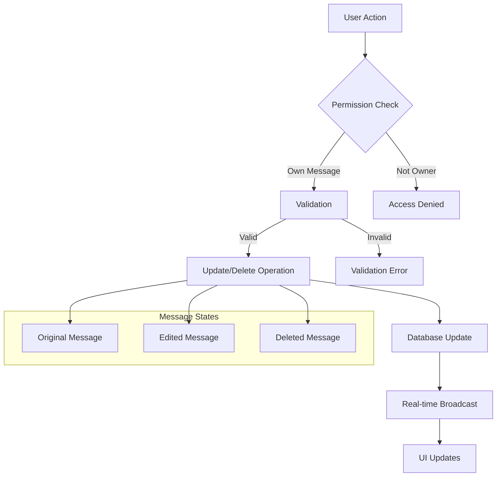

# Edit and Delete Messages

Empower users to manage their message content with robust editing and deletion capabilities. Maintain conversation flow while providing essential content management features with proper permissions, validation, and real-time updates.

<CardGroup cols={3}>
  <Card title="Message Editing" icon="edit">
    Update text and custom message content with timestamp tracking
  </Card>
  <Card title="Secure Deletion" icon="trash">
    Remove messages with proper authorization and cleanup
  </Card>
  <Card title="Real-time Sync" icon="refresh">
    Instant updates across all connected clients and devices
  </Card>
</CardGroup>

## Message Management Architecture

Understanding the flow of message modifications and their impact:



## Core Operations Overview

<AccordionGroup>
  <Accordion title="Edit Messages">
    **Supported Types:** Text and Custom messages only
    **Permissions:** Only message owner can edit
    **Timestamp:** `editedAt` field automatically updated
    **Validation:** Content length and format validation applied
  </Accordion>
  <Accordion title="Delete Messages">
    **Permissions:** Only message owner can delete
    **Behavior:** Message marked as deleted, may remain visible based on query settings
    **Cleanup:** Associated files and media handled automatically
    **Reversibility:** Deletion is permanent and cannot be undone
  </Accordion>
  <Accordion title="Real-time Updates">
    **Synchronization:** Changes broadcast to all connected clients immediately
    **Offline Support:** Operations queued when offline, executed when reconnected
    **Conflict Resolution:** Last-write-wins with timestamp validation
  </Accordion>
</AccordionGroup>

## Edit Messages

Modify message content while preserving conversation context and maintaining proper validation.

### Supported Message Types

<AccordionGroup>
  <Accordion title="Text Messages">
    **Character Limit:** 20,000 characters maximum
    **Rich Content:** Supports mentions, formatting, and emoji
    **Validation:** Automatic content sanitization and length checking
    **Metadata:** Preserves original creation time, adds edit timestamp
  </Accordion>
  <Accordion title="Custom Messages">
    **JSON Structure:** Flexible schema validation
    **Size Limit:** Maximum 64KB per custom message
    **Type Safety:** Schema validation on client and server
    **Versioning:** Support for message format evolution
  </Accordion>
</AccordionGroup>

<Warning>
Media messages (image, video, file, audio) cannot be edited. Users must delete and resend to change media content.
</Warning>

### Implementation Examples

<Tabs>
  <Tab title="iOS">
    <CodeGroup>
      ```swift Basic Text Editing
      import AmitySDK
      
      class MessageEditManager {
          private let messageRepository: AmityMessageRepository
          
          init(client: AmityClient) {
              self.messageRepository = AmityMessageRepository(client: client)
          }
          
          func editTextMessage(
              messageId: String,
              newText: String,
              completion: @escaping (Result<AmityMessage, Error>) -> Void
          ) {
              // Validate input
              guard !newText.trimmingCharacters(in: .whitespacesAndNewlines).isEmpty else {
                  completion(.failure(MessageError.emptyContent))
                  return
              }
              
              guard newText.count <= 20000 else {
                  completion(.failure(MessageError.contentTooLong))
                  return
              }
              
              // Create edit request
              let builder = AmityTextMessageBuilder()
              builder.setText(newText)
              
              messageRepository.editMessage(
                  withId: messageId,
                  builder: builder
              ) { [weak self] message, error in
                  if let error = error {
                      completion(.failure(error))
                  } else if let message = message {
                      completion(.success(message))
                  }
              }
          }
          
          func editCustomMessage<T: Codable>(
              messageId: String,
              customData: T,
              completion: @escaping (Result<AmityMessage, Error>) -> Void
          ) {
              do {
                  let jsonData = try JSONEncoder().encode(customData)
                  let jsonObject = try JSONSerialization.jsonObject(with: jsonData)
                  
                  let builder = AmityCustomMessageBuilder()
                  builder.setCustomData(jsonObject)
                  
                  messageRepository.editMessage(
                      withId: messageId,
                      builder: builder
                  ) { message, error in
                      if let error = error {
                          completion(.failure(error))
                      } else if let message = message {
                          completion(.success(message))
                      }
                  }
              } catch {
                  completion(.failure(error))
              }
          }
      }
      
      enum MessageError: Error {
          case emptyContent
          case contentTooLong
          case invalidFormat
          case notAuthorized
      }
      ```
      
      ```swift SwiftUI Edit Interface
      import SwiftUI
      import AmitySDK
      
      struct MessageEditView: View {
          let message: AmityMessage
          @StateObject private var editManager = MessageEditManager()
          @State private var editText: String = ""
          @State private var isEditing = false
          @State private var isSaving = false
          @State private var error: String?
          
          var body: some View {
              VStack(alignment: .leading, spacing: 12) {
                  if isEditing {
                      editingView
                  } else {
                      displayView
                  }
                  
                  if let error = error {
                      Text(error)
                          .foregroundColor(.red)
                          .font(.caption)
                  }
              }
              .onAppear {
                  setupInitialText()
              }
          }
          
          private var displayView: some View {
              HStack {
                  MessageContentView(message: message)
                  
                  Spacer()
                  
                  if canEditMessage {
                      Button("Edit") {
                          startEditing()
                      }
                      .disabled(isSaving)
                  }
              }
          }
          
          private var editingView: some View {
              VStack(spacing: 8) {
                  TextEditor(text: $editText)
                      .frame(minHeight: 60)
                      .padding(8)
                      .background(Color(.systemGray6))
                      .cornerRadius(8)
                  
                  HStack {
                      Text("\(editText.count)/20000")
                          .font(.caption)
                          .foregroundColor(editText.count > 20000 ? .red : .secondary)
                      
                      Spacer()
                      
                      Button("Cancel") {
                          cancelEditing()
                      }
                      .disabled(isSaving)
                      
                      Button("Save") {
                          saveEdit()
                      }
                      .disabled(isSaving || editText.trimmingCharacters(in: .whitespacesAndNewlines).isEmpty)
                  }
              }
          }
          
          private var canEditMessage: Bool {
              // Check if user can edit this message
              return message.userId == AmityManager.shared.currentUser?.userId &&
                     (message.messageType == .text || message.messageType == .custom)
          }
          
          private func setupInitialText() {
              if let textMessage = message as? AmityTextMessage {
                  editText = textMessage.text ?? ""
              }
          }
          
          private func startEditing() {
              isEditing = true
              error = nil
          }
          
          private func cancelEditing() {
              isEditing = false
              setupInitialText()
              error = nil
          }
          
          private func saveEdit() {
              guard !editText.trimmingCharacters(in: .whitespacesAndNewlines).isEmpty else {
                  error = "Message cannot be empty"
                  return
              }
              
              isSaving = true
              error = nil
              
              editManager.editTextMessage(
                  messageId: message.messageId,
                  newText: editText
              ) { result in
                  DispatchQueue.main.async {
                      isSaving = false
                      
                      switch result {
                      case .success(_):
                          isEditing = false
                      case .failure(let editError):
                          error = editError.localizedDescription
                      }
                  }
              }
          }
      }
      ```
    </CodeGroup>
  </Tab>
  
  <Tab title="Android">
    <CodeGroup>
      ```kotlin Message Edit Manager
      import com.amity.socialcloud.sdk.chat.message.AmityMessageRepository
      import io.reactivex.Completable
      import io.reactivex.Single
      import io.reactivex.android.schedulers.AndroidSchedulers
      import io.reactivex.schedulers.Schedulers
      
      class MessageEditManager(private val messageRepository: AmityMessageRepository) {
          
          fun editTextMessage(
              messageId: String,
              newText: String
          ): Completable {
              return validateTextContent(newText)
                  .andThen(
                      messageRepository.editMessage(messageId)
                          .text(newText)
                          .build()
                          .send()
                  )
                  .subscribeOn(Schedulers.io())
                  .observeOn(AndroidSchedulers.mainThread())
          }
          
          fun editCustomMessage(
              messageId: String,
              customData: Map<String, Any>
          ): Completable {
              return validateCustomData(customData)
                  .andThen(
                      messageRepository.editMessage(messageId)
                          .custom(customData)
                          .build()
                          .send()
                  )
                  .subscribeOn(Schedulers.io())
                  .observeOn(AndroidSchedulers.mainThread())
          }
          
          private fun validateTextContent(text: String): Completable {
              return Completable.fromAction {
                  when {
                      text.trim().isEmpty() -> 
                          throw ValidationException("Message cannot be empty")
                      text.length > 20000 -> 
                          throw ValidationException("Message too long (max 20,000 characters)")
                  }
              }
          }
          
          private fun validateCustomData(data: Map<String, Any>): Completable {
              return Completable.fromAction {
                  val jsonString = Gson().toJson(data)
                  if (jsonString.toByteArray().size > 64 * 1024) {
                      throw ValidationException("Custom data too large (max 64KB)")
                  }
              }
          }
          
          fun canEditMessage(message: AmityMessage, currentUserId: String): Boolean {
              return message.creator?.userId == currentUserId &&
                     (message.type == AmityMessage.Type.TEXT || 
                      message.type == AmityMessage.Type.CUSTOM)
          }
      }
      
      class ValidationException(message: String) : Exception(message)
      ```
      
      ```kotlin Compose Edit Interface
      import androidx.compose.foundation.layout.*
      import androidx.compose.material3.*
      import androidx.compose.runtime.*
      import androidx.compose.ui.Alignment
      import androidx.compose.ui.Modifier
      import androidx.compose.ui.unit.dp
      import androidx.lifecycle.ViewModel
      import androidx.lifecycle.viewModelScope
      import kotlinx.coroutines.launch
      
      @Composable
      fun EditableMessageItem(
          message: AmityMessage,
          currentUserId: String,
          editManager: MessageEditManager,
          modifier: Modifier = Modifier
      ) {
          var isEditing by remember { mutableStateOf(false) }
          var editText by remember { mutableStateOf("") }
          var isLoading by remember { mutableStateOf(false) }
          var error by remember { mutableStateOf<String?>(null) }
          
          val canEdit = remember(message, currentUserId) {
              editManager.canEditMessage(message, currentUserId)
          }
          
          LaunchedEffect(message) {
              if (message.type == AmityMessage.Type.TEXT) {
                  val textData = message.data as? AmityMessage.TextData
                  editText = textData?.text ?: ""
              }
          }
          
          Card(
              modifier = modifier.fillMaxWidth(),
              elevation = CardDefaults.cardElevation(defaultElevation = 2.dp)
          ) {
              Column(
                  modifier = Modifier.padding(16.dp)
              ) {
                  if (isEditing) {
                      EditingContent(
                          text = editText,
                          onTextChange = { editText = it },
                          isLoading = isLoading,
                          error = error,
                          onSave = {
                              isLoading = true
                              error = null
                              
                              editManager.editTextMessage(message.messageId, editText)
                                  .subscribe(
                                      {
                                          isLoading = false
                                          isEditing = false
                                      },
                                      { throwable ->
                                          isLoading = false
                                          error = throwable.message
                                      }
                                  )
                          },
                          onCancel = {
                              isEditing = false
                              // Reset text to original
                              val originalText = (message.data as? AmityMessage.TextData)?.text ?: ""
                              editText = originalText
                              error = null
                          }
                      )
                  } else {
                      DisplayContent(
                          message = message,
                          canEdit = canEdit,
    

                      )
                  }
              }
          }
      }
      
      @Composable
      private fun EditingContent(
          text: String,
          onTextChange: (String) -> Unit,
          isLoading: Boolean,
          error: String?,
          onSave: () -> Unit,
          onCancel: () -> Unit
      ) {
          Column {
              OutlinedTextField(
                  value = text,
                  onValueChange = onTextChange,
                  modifier = Modifier.fillMaxWidth(),
                  placeholder = { Text("Enter your message...") },
                  supportingText = {
                      Row(
                          modifier = Modifier.fillMaxWidth(),
                          horizontalArrangement = Arrangement.SpaceBetween
                      ) {
                          if (error != null) {
                              Text(
                                  text = error,
                                  color = MaterialTheme.colorScheme.error
                              )
                          } else {
                              Spacer(modifier = Modifier.weight(1f))
                          }
                          
                          Text(
                              text = "${text.length}/20000",
                              color = if (text.length > 20000) {
                                  MaterialTheme.colorScheme.error
                              } else {
                                  MaterialTheme.colorScheme.onSurfaceVariant
                              }
                          )
                      }
                  },
                  isError = error != null || text.length > 20000
              )
              
              Spacer(modifier = Modifier.height(8.dp))
              
              Row(
                  modifier = Modifier.fillMaxWidth(),
                  horizontalArrangement = Arrangement.End
              ) {
                  TextButton(
                      onClick = onCancel,
                      enabled = !isLoading
                  ) {
                      Text("Cancel")
                  }
                  
                  Spacer(modifier = Modifier.width(8.dp))
                  
                  Button(
                      onClick = onSave,
                      enabled = !isLoading && text.trim().isNotEmpty() && text.length <= 20000
                  ) {
                      if (isLoading) {
                          CircularProgressIndicator(
                              modifier = Modifier.size(16.dp),
                              strokeWidth = 2.dp
                          )
                      } else {
                          Text("Save")
                      }
                  }
              }
          }
      }
      ```
    </CodeGroup>
  </Tab>
  
  <Tab title="JavaScript">
    <CodeGroup>
      ```javascript Message Edit Service
      import { MessageRepository } from '@amityco/js-sdk';
      
      class MessageEditService {
          constructor() {
              this.maxTextLength = 20000;
              this.maxCustomDataSize = 64 * 1024; // 64KB
          }
          
          async editTextMessage(messageId, newText) {
              // Validation
              this.validateTextContent(newText);
              
              try {
                  const result = await MessageRepository.updateMessage({
                      messageId,
                      data: { text: newText }
                  });
                  
                  return {
                      success: true,
                      message: result
                  };
              } catch (error) {
                  return {
                      success: false,
                      error: this.handleError(error)
                  };
              }
          }
          
          async editCustomMessage(messageId, customData) {
              // Validation
              this.validateCustomData(customData);
              
              try {
                  const result = await MessageRepository.updateMessage({
                      messageId,
                      data: customData
                  });
                  
                  return {
                      success: true,
                      message: result
                  };
              } catch (error) {
                  return {
                      success: false,
                      error: this.handleError(error)
                  };
              }
          }
          
          validateTextContent(text) {
              if (typeof text !== 'string') {
                  throw new Error('Message content must be a string');
              }
              
              const trimmedText = text.trim();
              if (trimmedText.length === 0) {
                  throw new Error('Message cannot be empty');
              }
              
              if (text.length > this.maxTextLength) {
                  throw new Error(`Message too long (max ${this.maxTextLength} characters)`);
              }
          }
          
          validateCustomData(data) {
              if (!data || typeof data !== 'object') {
                  throw new Error('Custom data must be an object');
              }
              
              const jsonString = JSON.stringify(data);
              const dataSize = new Blob([jsonString]).size;
              
              if (dataSize > this.maxCustomDataSize) {
                  throw new Error(`Custom data too large (max ${this.maxCustomDataSize / 1024}KB)`);
              }
          }
          
          canEditMessage(message, currentUserId) {
              if (!message || !currentUserId) return false;
              
              const isOwner = message.userId === currentUserId;
              const isEditableType = ['text', 'custom'].includes(message.type);
              
              return isOwner && isEditableType;
          }
          
          handleError(error) {
              if (error.code === 400301) {
                  return 'You can only edit your own messages';
              } else if (error.code === 400302) {
                  return 'This message type cannot be edited';
              } else if (error.code === 400400) {
                  return 'Message not found';
              } else {
                  return error.message || 'Failed to edit message';
              }
          }
      }
      
      export default MessageEditService;
      ```
      
      ```javascript React Edit Component
      import React, { useState, useCallback } from 'react';
      import MessageEditService from './MessageEditService';
      
      const EditableMessage = ({ message, currentUserId, onEditComplete }) => {
          const [isEditing, setIsEditing] = useState(false);
          const [editText, setEditText] = useState(message.data?.text || '');
          const [isLoading, setIsLoading] = useState(false);
          const [error, setError] = useState(null);
          
          const editService = new MessageEditService();
          
          const canEdit = editService.canEditMessage(message, currentUserId);
          
          const handleStartEdit = useCallback(() => {
              setIsEditing(true);
              setEditText(message.data?.text || '');
              setError(null);
          }, [message.data?.text]);
          
          const handleCancelEdit = useCallback(() => {
              setIsEditing(false);
              setEditText(message.data?.text || '');
              setError(null);
          }, [message.data?.text]);
          
          const handleSaveEdit = useCallback(async () => {
              if (!editText.trim()) {
                  setError('Message cannot be empty');
                  return;
              }
              
              setIsLoading(true);
              setError(null);
              
              const result = await editService.editTextMessage(message.messageId, editText);
              
              if (result.success) {
                  setIsEditing(false);
                  onEditComplete?.(result.message);
              } else {
                  setError(result.error);
              }
              
              setIsLoading(false);
          }, [editText, message.messageId, onEditComplete]);
          
          const handleTextChange = useCallback((e) => {
              setEditText(e.target.value);
              if (error) setError(null);
          }, [error]);
          
          if (isEditing) {
              return (
                  <div className="message-edit-container">
                      <div className="edit-form">
                          <textarea
                              value={editText}
                              onChange={handleTextChange}
                              className={`edit-textarea ${error ? 'error' : ''}`}
                              placeholder="Enter your message..."
                              disabled={isLoading}
                              rows={3}
                          />
                          
                          <div className="edit-footer">
                              <div className="character-count">
                                  <span className={editText.length > 20000 ? 'over-limit' : ''}>
                                      {editText.length}/20,000
                                  </span>
                              </div>
                              
                              <div className="edit-actions">
                                  <button
                                      type="button"
                                      onClick={handleCancelEdit}
                                      disabled={isLoading}
                                      className="cancel-button"
                                  >
                                      Cancel
                                  </button>
                                  
                                  <button
                                      type="button"
                                      onClick={handleSaveEdit}
                                      disabled={
                                          isLoading || 
                                          !editText.trim() || 
                                          editText.length > 20000
                                      }
                                      className="save-button"
                                  >
                                      {isLoading ? 'Saving...' : 'Save'}
                                  </button>
                              </div>
                          </div>
                          
                          {error && (
                              <div className="error-message">
                                  {error}
                              </div>
                          )}
                      </div>
                  </div>
              );
          }
          
          return (
              <div className="message-display">
                  <div className="message-content">
                      {message.data?.text}
                      {message.editedAt && (
                          <span className="edited-indicator">(edited)</span>
                      )}
                  </div>
                  
                  {canEdit && (
                      <div className="message-actions">
                          <button
                              type="button"
                              onClick={handleStartEdit}
                              className="edit-button"
                          >
                              Edit
                          </button>
                      </div>
                  )}
              </div>
          );
      };
      
      export default EditableMessage;
      ```
    </CodeGroup>
  </Tab>
  
  <Tab title="TypeScript">
    <CodeGroup>
      ```typescript Type-Safe Edit Service
      import { MessageRepository, Message, MessageType } from '@amityco/ts-sdk';
      
      interface EditResult<T = Message> {
          success: boolean;
          data?: T;
          error?: string;
      }
      
      interface TextMessageData {
          text: string;
      }
      
      interface CustomMessageData {
          [key: string]: any;
      }
      
      class TypeSafeMessageEditService {
          private readonly MAX_TEXT_LENGTH = 20000;
          private readonly MAX_CUSTOM_DATA_SIZE = 64 * 1024; // 64KB
          
          async editTextMessage(
              messageId: string,
              newText: string
          ): Promise<EditResult<Message>> {
              try {
                  this.validateTextContent(newText);
                  
                  const updatedMessage = await MessageRepository.updateMessage({
                      messageId,
                      data: { text: newText } as TextMessageData
                  });
                  
                  return {
                      success: true,
                      data: updatedMessage
                  };
              } catch (error) {
                  return {
                      success: false,
                      error: this.handleError(error)
                  };
              }
          }
          
          async editCustomMessage<T extends CustomMessageData>(
              messageId: string,
              customData: T
          ): Promise<EditResult<Message>> {
              try {
                  this.validateCustomData(customData);
                  
                  const updatedMessage = await MessageRepository.updateMessage({
                      messageId,
                      data: customData
                  });
                  
                  return {
                      success: true,
                      data: updatedMessage
                  };
              } catch (error) {
                  return {
                      success: false,
                      error: this.handleError(error)
                  };
              }
          }
          
          private validateTextContent(text: string): void {
              if (typeof text !== 'string') {
                  throw new ValidationError('Message content must be a string');
              }
              
              const trimmedText = text.trim();
              if (trimmedText.length === 0) {
                  throw new ValidationError('Message cannot be empty');
              }
              
              if (text.length > this.MAX_TEXT_LENGTH) {
                  throw new ValidationError(
                      `Message too long (max ${this.MAX_TEXT_LENGTH} characters)`
                  );
              }
          }
          
          private validateCustomData(data: CustomMessageData): void {
              if (!data || typeof data !== 'object') {
                  throw new ValidationError('Custom data must be an object');
              }
              
              const jsonString = JSON.stringify(data);
              const encoder = new TextEncoder();
              const dataSize = encoder.encode(jsonString).length;
              
              if (dataSize > this.MAX_CUSTOM_DATA_SIZE) {
                  throw new ValidationError(
                      `Custom data too large (max ${this.MAX_CUSTOM_DATA_SIZE / 1024}KB)`
                  );
              }
          }
          
          canEditMessage(message: Message, currentUserId: string): boolean {
              if (!message || !currentUserId) return false;
              
              const isOwner = message.userId === currentUserId;
              const isEditableType = [MessageType.TEXT, MessageType.CUSTOM].includes(message.type);
              
              return isOwner && isEditableType;
          }
          
          private handleError(error: unknown): string {
              if (error instanceof ValidationError) {
                  return error.message;
              }
              
              if (error instanceof Error) {
                  // Handle specific API error codes
                  if ('code' in error) {
                      const apiError = error as any;
                      switch (apiError.code) {
                          case 400301:
                              return 'You can only edit your own messages';
                          case 400302:
                              return 'This message type cannot be edited';
                          case 400400:
                              return 'Message not found';
                          default:
                              return error.message;
                      }
                  }
                  return error.message;
              }
              
              return 'An unexpected error occurred';
          }
      }
      
      class ValidationError extends Error {
          constructor(message: string) {
              super(message);
              this.name = 'ValidationError';
          }
      }
      
      export { TypeSafeMessageEditService, ValidationError };
      export type { EditResult, TextMessageData, CustomMessageData };
      ```
      
      ```typescript React Hook for Editing
      import { useState, useCallback, useEffect } from 'react';
      import { Message } from '@amityco/ts-sdk';
      import { TypeSafeMessageEditService, EditResult } from './TypeSafeMessageEditService';
      
      interface UseMessageEditOptions {
          onEditSuccess?: (message: Message) -> void;
          onEditError?: (error: string) -> void;
      }
      
      interface UseMessageEditReturn {
          isEditing: boolean;
          editText: string;
          isLoading: boolean;
          error: string | null;
          canEdit: boolean;
          startEdit: () -> void;
          cancelEdit: () -> void;
          saveEdit: () -> Promise<void>;
          setEditText: (text: string) -> void;
      }
      
      export const useMessageEdit = (
          message: Message,
          currentUserId: string,
          options: UseMessageEditOptions = {}
      ): UseMessageEditReturn => {
          const [isEditing, setIsEditing] = useState(false);
          const [editText, setEditText] = useState('');
          const [isLoading, setIsLoading] = useState(false);
          const [error, setError] = useState<string | null>(null);
          
          const editService = new TypeSafeMessageEditService();
          
          const canEdit = editService.canEditMessage(message, currentUserId);
          
          // Initialize edit text when message changes
          useEffect(() => {
              if (message.type === 'text') {
                  const textData = message.data as { text?: string };
                  setEditText(textData.text || '');
              }
          }, [message]);
          
          const startEdit = useCallback(() => {
              if (!canEdit) return;
              
              setIsEditing(true);
              setError(null);
              
              if (message.type === 'text') {
                  const textData = message.data as { text?: string };
                  setEditText(textData.text || '');
              }
          }, [canEdit, message]);
          
          const cancelEdit = useCallback(() => {
              setIsEditing(false);
              setError(null);
              
              // Reset to original text
              if (message.type === 'text') {
                  const textData = message.data as { text?: string };
                  setEditText(textData.text || '');
              }
          }, [message]);
          
          const saveEdit = useCallback(async () => {
              if (!editText.trim()) {
                  setError('Message cannot be empty');
                  return;
              }
              
              setIsLoading(true);
              setError(null);
              
              const result: EditResult<Message> = await editService.editTextMessage(
                  message.messageId,
                  editText
              );
              
              setIsLoading(false);
              
              if (result.success && result.data) {
                  setIsEditing(false);
                  options.onEditSuccess?.(result.data);
              } else {
                  setError(result.error || 'Failed to save edit');
                  options.onEditError?.(result.error || 'Failed to save edit');
              }
          }, [editText, message.messageId, editService, options]);
          
          const handleSetEditText = useCallback((text: string) => {
              setEditText(text);
              if (error) setError(null);
          }, [error]);
          
          return {
              isEditing,
              editText,
              isLoading,
              error,
              canEdit,
              startEdit,
              cancelEdit,
              saveEdit,
              setEditText: handleSetEditText
          };
      };
      ```
    </CodeGroup>
  </Tab>
  
  <Tab title="Flutter">
    <CodeGroup>
      ```dart Message Edit Service
      import 'package:amity_sdk/amity_sdk.dart';
      
      class MessageEditService {
        static const int maxTextLength = 20000;
        static const int maxCustomDataSize = 64 * 1024; // 64KB
        
        late AmityClient _client;
        late AmityMessageRepository _messageRepository;
        
        MessageEditService(AmityClient client) {
          _client = client;
          _messageRepository = client.newMessageRepository();
        }
        
        Future<EditResult> editTextMessage(String messageId, String newText) async {
          try {
            _validateTextContent(newText);
            
            final result = await _messageRepository
                .editMessage(messageId)
                .text(newText)
                .send();
            
            return EditResult.success(result);
          } catch (e) {
            return EditResult.error(_handleError(e));
          }
        }
        
        Future<EditResult> editCustomMessage(
          String messageId, 
          Map<String, dynamic> customData
        ) async {
          try {
            _validateCustomData(customData);
            
            final result = await _messageRepository
                .editMessage(messageId)
                .custom(customData)
                .send();
            
            return EditResult.success(result);
          } catch (e) {
            return EditResult.error(_handleError(e));
          }
        }
        
        void _validateTextContent(String text) {
          if (text.trim().isEmpty) {
            throw ValidationException('Message cannot be empty');
          }
          
          if (text.length > maxTextLength) {
            throw ValidationException('Message too long (max $maxTextLength characters)');
          }
        }
        
        void _validateCustomData(Map<String, dynamic> data) {
          final jsonString = jsonEncode(data);
          final dataSize = utf8.encode(jsonString).length;
          
          if (dataSize > maxCustomDataSize) {
            throw ValidationException('Custom data too large (max ${maxCustomDataSize ~/ 1024}KB)');
          }
        }
        
        bool canEditMessage(AmityMessage message, String currentUserId) {
          final isOwner = message.userId == currentUserId;
          final isEditableType = message.type == AmityMessageType.TEXT || 
                                 message.type == AmityMessageType.CUSTOM;
          
          return isOwner && isEditableType;
        }
        
        String _handleError(dynamic error) {
          if (error is ValidationException) {
            return error.message;
          }
          
          if (error is AmityException) {
            switch (error.code) {
              case 400301:
                return 'You can only edit your own messages';
              case 400302:
                return 'This message type cannot be edited';
              case 400400:
                return 'Message not found';
              default:
                return error.message ?? 'Failed to edit message';
            }
          }
          
          return error.toString();
        }
      }
      
      class EditResult {
        final bool success;
        final AmityMessage? data;
        final String? error;
        
        EditResult.success(this.data) : success = true, error = null;
        EditResult.error(this.error) : success = false, data = null;
      }
      
      class ValidationException implements Exception {
        final String message;
        ValidationException(this.message);
      }
      ```
      
      ```dart Flutter Edit Widget
      import 'package:flutter/material.dart';
      import 'package:amity_sdk/amity_sdk.dart';
      
      class EditableMessageWidget extends StatefulWidget {
        final AmityMessage message;
        final String currentUserId;
        final Function(AmityMessage)? onEditComplete;
        
        const EditableMessageWidget({
          Key? key,
          required this.message,
          required this.currentUserId,
          this.onEditComplete,
        }) : super(key: key);
        
        @override
        _EditableMessageWidgetState createState() => _EditableMessageWidgetState();
      }
      
      class _EditableMessageWidgetState extends State<EditableMessageWidget> {
        late MessageEditService _editService;
        late TextEditingController _textController;
        
        bool _isEditing = false;
        bool _isLoading = false;
        String? _error;
        
        @override
        void initState() {
          super.initState();
          _editService = MessageEditService(AmityUIKit.client);
          _textController = TextEditingController();
          
          _initializeText();
        }
        
        void _initializeText() {
          if (widget.message.type == AmityMessageType.TEXT) {
            final textData = widget.message.data as AmityTextMessageData;
            _textController.text = textData.text ?? '';
          }
        }
        
        @override
        void dispose() {
          _textController.dispose();
          super.dispose();
        }
        
        bool get _canEdit => _editService.canEditMessage(widget.message, widget.currentUserId);
        
        void _startEditing() {
          setState(() {
            _isEditing = true;
            _error = null;
          });
          _initializeText();
        }
        
        void _cancelEditing() {
          setState(() {
            _isEditing = false;
            _error = null;
          });
          _initializeText();
        }
        
        Future<void> _saveEdit() async {
          final text = _textController.text;
          
          if (text.trim().isEmpty) {
            setState(() {
              _error = 'Message cannot be empty';
            });
            return;
          }
          
          setState(() {
            _isLoading = true;
            _error = null;
          });
          
          final result = await _editService.editTextMessage(
            widget.message.messageId,
            text,
          );
          
          setState(() {
            _isLoading = false;
          });
          
          if (result.success) {
            setState(() {
              _isEditing = false;
            });
            
            if (result.data != null) {
              widget.onEditComplete?.call(result.data!);
            }
          } else {
            setState(() {
              _error = result.error;
            });
          }
        }
        
        @override
        Widget build(BuildContext context) {
          return Card(
            margin: const EdgeInsets.symmetric(horizontal: 16, vertical: 4),
            child: Padding(
              padding: const EdgeInsets.all(12),
              child: Column(
                crossAxisAlignment: CrossAxisAlignment.start,
                children: [
                  if (_isEditing) _buildEditingView() else _buildDisplayView(),
                  
                  if (_error != null) ...[
                    const SizedBox(height: 8),
                    Text(
                      _error!,
                      style: Theme.of(context).textTheme.caption?.copyWith(
                        color: Colors.red,
                      ),
                    ),
                  ],
                ],
              ),
            ),
          );
        }
        
        Widget _buildDisplayView() {
          final textData = widget.message.data as AmityTextMessageData;
          
          return Row(
            crossAxisAlignment: CrossAxisAlignment.start,
            children: [
              Expanded(
                child: Column(
                  crossAxisAlignment: CrossAxisAlignment.start,
                  children: [
                    Text(
                      textData.text ?? '',
                      style: Theme.of(context).textTheme.bodyMedium,
                    ),
                    
                    if (widget.message.editedAt != null) ...[
                      const SizedBox(height: 4),
                      Text(
                        'edited',
                        style: Theme.of(context).textTheme.caption?.copyWith(
                          fontStyle: FontStyle.italic,
                          color: Colors.grey[600],
                        ),
                      ),
                    ],
                  ],
                ),
              ),
              
              if (_canEdit) ...[
                const SizedBox(width: 8),
                IconButton(
                  icon: const Icon(Icons.edit, size: 20),
                  onPressed: _startEditing,
                  tooltip: 'Edit message',
                ),
              ],
            ],
          );
        }
        
        Widget _buildEditingView() {
          return Column(
            children: [
              TextField(
                controller: _textController,
                maxLines: null,
                decoration: InputDecoration(
                  hintText: 'Enter your message...',
                  border: const OutlineInputBorder(),
                  helperText: '${_textController.text.length}/20000',
                  helperStyle: TextStyle(
                    color: _textController.text.length > 20000 ? Colors.red : null,
                  ),
                ),
                enabled: !_isLoading,
                onChanged: (text) {
                  setState(() {
                    if (_error != null) _error = null;
                  });
                },
              ),
              
              const SizedBox(height: 12),
              
              Row(
                mainAxisAlignment: MainAxisAlignment.end,
                children: [
                  TextButton(
                    onPressed: _isLoading ? null : _cancelEditing,
                    child: const Text('Cancel'),
                  ),
                  
                  const SizedBox(width: 8),
                  
                  ElevatedButton(
                    onPressed: _isLoading || 
                        _textController.text.trim().isEmpty ||
                        _textController.text.length > 20000
                        ? null
                        : _saveEdit,
                    child: _isLoading
                        ? const SizedBox(
                            width: 16,
                            height: 16,
                            child: CircularProgressIndicator(strokeWidth: 2),
                          )
                        : const Text('Save'),
                  ),
                ],
              ),
            ],
          );
        }
      }
      ```
    </CodeGroup>
  </Tab>
</Tabs>

## Delete Messages

Remove messages permanently while maintaining conversation integrity and proper cleanup of associated resources.

### Deletion Behavior

<AccordionGroup>
  <Accordion title="Soft Deletion">
    **Default Behavior:** Messages are marked as deleted but may remain in query results
    **Query Control:** Use `includeDeleted: false` in queries to exclude deleted messages
    **Timestamp:** `deletedAt` field set to current time for tracking
  </Accordion>
  <Accordion title="Resource Cleanup">
    **File Cleanup:** Associated files, images, and media automatically removed
    **Cache Invalidation:** Deleted messages removed from local caches
    **Reference Updates:** Message references in threads and reactions updated
  </Accordion>
  <Accordion title="Permissions">
    **Owner Only:** Users can only delete their own messages
    **Time Limits:** Optional time-based restrictions (configured server-side)
    **Admin Override:** Channel moderators may have broader deletion permissions
  </Accordion>
</AccordionGroup>

<Warning>
Message deletion is permanent and cannot be undone. Ensure proper confirmation flows in your UI.
</Warning>

### Implementation Examples

<Tabs>
  <Tab title="iOS">
    <CodeGroup>
      ```swift Message Deletion Manager
      import AmitySDK
      
      class MessageDeletionManager {
          private let messageRepository: AmityMessageRepository
          
          init(client: AmityClient) {
              self.messageRepository = AmityMessageRepository(client: client)
          }
          
          func deleteMessage(
              messageId: String,
              completion: @escaping (Result<Void, Error>) -> Void
          ) {
              messageRepository.deleteMessage(
                  withId: messageId
              ) { success, error in
                  if let error = error {
                      completion(.failure(error))
                  } else if success {
                      completion(.success(()))
                  } else {
                      completion(.failure(MessageError.deletionFailed))
                  }
              }
          }
          
          func deleteMessageWithConfirmation(
              messageId: String,
              from viewController: UIViewController,
              completion: @escaping (Result<Void, Error>) -> Void
          ) {
              let alert = UIAlertController(
                  title: "Delete Message",
                  message: "Are you sure you want to delete this message? This action cannot be undone.",
                  preferredStyle: .alert
              )
              
              alert.addAction(UIAlertAction(title: "Cancel", style: .cancel))
              
              alert.addAction(UIAlertAction(title: "Delete", style: .destructive) { _ in
                  self.deleteMessage(messageId: messageId, completion: completion)
              })
              
              viewController.present(alert, animated: true)
          }
          
          func canDeleteMessage(_ message: AmityMessage, currentUserId: String) -> Bool {
              return message.userId == currentUserId
          }
      }
      
      enum MessageError: Error {
          case deletionFailed
          case notAuthorized
          case messageNotFound
      }
      ```
      
      ```swift SwiftUI Delete Interface
      import SwiftUI
      import AmitySDK
      
      struct DeletableMessageView: View {
          let message: AmityMessage
          let currentUserId: String
          @StateObject private var deletionManager = MessageDeletionManager()
          @State private var showDeleteConfirmation = false
          @State private var isDeleting = false
          @State private var deleteError: String?
          
          var body: some View {
              VStack(alignment: .leading) {
                  HStack {
                      MessageContentView(message: message)
                      
                      Spacer()
                      
                      if canDelete {
                          Menu {
                              Button("Delete Message", role: .destructive) {
                                  showDeleteConfirmation = true
                              }
                          } label: {
                              Image(systemName: "ellipsis")
                                  .foregroundColor(.secondary)
                          }
                          .disabled(isDeleting)
                      }
                  }
                  
                  if let error = deleteError {
                      Text(error)
                          .foregroundColor(.red)
                          .font(.caption)
                  }
              }
              .opacity(isDeleting ? 0.5 : 1.0)
              .confirmationDialog(
                  "Delete Message",
                  isPresented: $showDeleteConfirmation,
                  titleVisibility: .visible
              ) {
                  Button("Delete Message", role: .destructive) {
                      deleteMessage()
                  }
                  
                  Button("Cancel", role: .cancel) {}
              } message: {
                  Text("Are you sure you want to delete this message? This action cannot be undone.")
              }
          }
          
          private var canDelete: Bool {
              deletionManager.canDeleteMessage(message, currentUserId: currentUserId)
          }
          
          private func deleteMessage() {
              isDeleting = true
              deleteError = nil
              
              deletionManager.deleteMessage(messageId: message.messageId) { result in
                  DispatchQueue.main.async {
                      isDeleting = false
                      
                      switch result {
                      case .success:
                          // Message deleted successfully
                          break
                      case .failure(let error):
                          deleteError = error.localizedDescription
                      }
                  }
              }
          }
      }
      ```
    </CodeGroup>
  </Tab>
  
  <Tab title="Android">
    <CodeGroup>
      ```kotlin Message Deletion Manager
      import com.amity.socialcloud.sdk.chat.message.AmityMessageRepository
      import io.reactivex.Completable
      import io.reactivex.android.schedulers.AndroidSchedulers
      import io.reactivex.schedulers.Schedulers
      
      class MessageDeletionManager(
          private val messageRepository: AmityMessageRepository
      ) {
          
          fun deleteMessage(messageId: String): Completable {
              return messageRepository.deleteMessage(messageId)
                  .subscribeOn(Schedulers.io())
                  .observeOn(AndroidSchedulers.mainThread())
          }
          
          fun deleteMessageWithConfirmation(
              messageId: String,
              context: Context,
              onResult: (Result<Unit>) -> Unit
          ) {
              AlertDialog.Builder(context)
                  .setTitle("Delete Message")
                  .setMessage("Are you sure you want to delete this message? This action cannot be undone.")
                  .setPositiveButton("Delete") { _, _ ->
                      deleteMessage(messageId)
                          .subscribe(
                              { onResult(Result.success(Unit)) },
                              { error -> onResult(Result.failure(error)) }
                          )
                  }
                  .setNegativeButton("Cancel", null)
                  .show()
          }
          
          fun canDeleteMessage(message: AmityMessage, currentUserId: String): Boolean {
              return message.creator?.userId == currentUserId
          }
          
          fun deleteMultipleMessages(messageIds: List<String>): Completable {
              return Completable.merge(
                  messageIds.map { messageId ->
                      deleteMessage(messageId)
                  }
              )
          }
      }
      ```
      
      ```kotlin Compose Delete Interface
      import androidx.compose.foundation.layout.*
      import androidx.compose.material3.*
      import androidx.compose.runtime.*
      import androidx.compose.ui.Alignment
      import androidx.compose.ui.Modifier
      import androidx.compose.ui.platform.LocalContext
      import androidx.compose.ui.unit.dp
      
      @Composable
      fun DeletableMessageItem(
          message: AmityMessage,
          currentUserId: String,
          deletionManager: MessageDeletionManager,
          onMessageDeleted: (String) -> Unit = {},
          modifier: Modifier = Modifier
      ) {
          var showDeleteDialog by remember { mutableStateOf(false) }
          var isDeleting by remember { mutableStateOf(false) }
          var deleteError by remember { mutableStateOf<String?>(null) }
          
          val context = LocalContext.current
          val canDelete = remember(message, currentUserId) {
              deletionManager.canDeleteMessage(message, currentUserId)
          }
          
          Card(
              modifier = modifier.fillMaxWidth(),
              elevation = CardDefaults.cardElevation(defaultElevation = 2.dp)
          ) {
              Column(
                  modifier = Modifier.padding(16.dp)
              ) {
                  Row(
                      modifier = Modifier.fillMaxWidth(),
                      horizontalArrangement = Arrangement.SpaceBetween,
                      verticalAlignment = Alignment.Top
                  ) {
                      // Message content
                      Column(modifier = Modifier.weight(1f)) {
                          MessageContent(message = message)
                          
                          deleteError?.let { error ->
                              Spacer(modifier = Modifier.height(4.dp))
                              Text(
                                  text = error,
                                  color = MaterialTheme.colorScheme.error,
                                  style = MaterialTheme.typography.bodySmall
                              )
                          }
                      }
                      
                      // Delete action
                      if (canDelete) {
                          IconButton(
                              onClick = { showDeleteDialog = true },
                              enabled = !isDeleting
                          ) {
                              if (isDeleting) {
                                  CircularProgressIndicator(
                                      modifier = Modifier.size(16.dp),
                                      strokeWidth = 2.dp
                                  )
                              } else {
                                  Icon(
                                      imageVector = Icons.Default.Delete,
                                      contentDescription = "Delete message"
                                  )
                              }
                          }
                      }
                  }
              }
          }
          
          // Delete confirmation dialog
          if (showDeleteDialog) {
              AlertDialog(
                  onDismissRequest = { showDeleteDialog = false },
                  title = { Text("Delete Message") },
                  text = { 
                      Text("Are you sure you want to delete this message? This action cannot be undone.") 
                  },
                  confirmButton = {
                      TextButton(
                          onClick = {
                              showDeleteDialog = false
                              isDeleting = true
                              deleteError = null
                              
                              deletionManager.deleteMessage(message.messageId)
                                  .subscribe(
                                      {
                                          isDeleting = false
                                          onMessageDeleted(message.messageId)
                                      },
                                      { error ->
                                          isDeleting = false
                                          deleteError = error.message ?: "Failed to delete message"
                                      }
                                  )
                          }
                      ) {
                          Text("Delete", color = MaterialTheme.colorScheme.error)
                      }
                  },
                  dismissButton = {
                      TextButton(onClick = { showDeleteDialog = false }) {
                          Text("Cancel")
                      }
                  }
              )
          }
      }
      ```
    </CodeGroup>
  </Tab>
  
  <Tab title="JavaScript">
    <CodeGroup>
      ```javascript Message Deletion Service
      import { MessageRepository } from '@amityco/js-sdk';
      
      class MessageDeletionService {
          async deleteMessage(messageId) {
              try {
                  await MessageRepository.deleteMessage(messageId);
                  return { success: true };
              } catch (error) {
                  return {
                      success: false,
                      error: this.handleError(error)
                  };
              }
          }
          
          async deleteMessageWithConfirmation(messageId, confirmationMessage = null) {
              const message = confirmationMessage || 
                  'Are you sure you want to delete this message? This action cannot be undone.';
              
              if (!window.confirm(message)) {
                  return { success: false, cancelled: true };
              }
              
              return this.deleteMessage(messageId);
          }
          
          async deleteMultipleMessages(messageIds, onProgress = null) {
              const results = [];
              
              for (let i = 0; i < messageIds.length; i++) {
                  const messageId = messageIds[i];
                  const result = await this.deleteMessage(messageId);
                  results.push({ messageId, ...result });
                  
                  if (onProgress) {
                      onProgress({
                          completed: i + 1,
                          total: messageIds.length,
                          currentMessageId: messageId,
                          result
                      });
                  }
              }
              
              return results;
          }
          
          canDeleteMessage(message, currentUserId) {
              return message && message.userId === currentUserId;
          }
          
          handleError(error) {
              if (error.code === 400301) {
                  return 'You can only delete your own messages';
              } else if (error.code === 400400) {
                  return 'Message not found';
              } else if (error.code === 400403) {
                  return 'You do not have permission to delete this message';
              } else {
                  return error.message || 'Failed to delete message';
              }
          }
      }
      
      export default MessageDeletionService;
      ```
      
      ```javascript React Delete Component
      import React, { useState, useCallback } from 'react';
      import MessageDeletionService from './MessageDeletionService';
      
      const DeletableMessage = ({ message, currentUserId, onMessageDeleted }) => {
          const [isDeleting, setIsDeleting] = useState(false);
          const [deleteError, setDeleteError] = useState(null);
          const [showConfirmation, setShowConfirmation] = useState(false);
          
          const deletionService = new MessageDeletionService();
          const canDelete = deletionService.canDeleteMessage(message, currentUserId);
          
          const handleDeleteClick = useCallback(() => {
              setShowConfirmation(true);
          }, []);
          
          const handleConfirmDelete = useCallback(async () => {
              setIsDeleting(true);
              setDeleteError(null);
              setShowConfirmation(false);
              
              const result = await deletionService.deleteMessage(message.messageId);
              
              if (result.success) {
                  onMessageDeleted?.(message.messageId);
              } else {
                  setDeleteError(result.error);
              }
              
              setIsDeleting(false);
          }, [message.messageId, onMessageDeleted]);
          
          const handleCancelDelete = useCallback(() => {
              setShowConfirmation(false);
          }, []);
          
          return (
              <div className={`message-container ${isDeleting ? 'deleting' : ''}`}>
                  <div className="message-header">
                      <div className="message-content">
                          <MessageContent message={message} />
                      </div>
                      
                      {canDelete && (
                          <div className="message-actions">
                              <button
                                  type="button"
                                  className="delete-button"
                                  onClick={handleDeleteClick}
                                  disabled={isDeleting}
                                  title="Delete message"
                              >
                                  {isDeleting ? (
                                      <span className="loading-spinner" />
                                  ) : (
                                      '🗑️'
                                  )}
                              </button>
                          </div>
                      )}
                  </div>
                  
                  {deleteError && (
                      <div className="error-message">
                          {deleteError}
                      </div>
                  )}
                  
                  {showConfirmation && (
                      <ConfirmationModal
                          title="Delete Message"
                          message="Are you sure you want to delete this message? This action cannot be undone."
                          onConfirm={handleConfirmDelete}
                          onCancel={handleCancelDelete}
                          confirmText="Delete"
                          confirmVariant="danger"
                      />
                  )}
              </div>
          );
      };
      
      const ConfirmationModal = ({ 
          title, 
          message, 
          onConfirm, 
          onCancel, 
          confirmText = 'Confirm',
          confirmVariant = 'primary'
      }) => {
          return (
              <div className="modal-overlay">
                  <div className="modal-content">
                      <div className="modal-header">
                          <h3>{title}</h3>
                      </div>
                      
                      <div className="modal-body">
                          <p>{message}</p>
                      </div>
                      
                      <div className="modal-footer">
                          <button
                              type="button"
                              className="cancel-button"
                              onClick={onCancel}
                          >
                              Cancel
                          </button>
                          
                          <button
                              type="button"
                              className={`confirm-button ${confirmVariant}`}
                              onClick={onConfirm}
                          >
                              {confirmText}
                          </button>
                      </div>
                  </div>
              </div>
          );
      };
      
      export default DeletableMessage;
      ```
    </CodeGroup>
  </Tab>
  
  <Tab title="TypeScript">
    <CodeGroup>
      ```typescript Type-Safe Deletion Service
      import { MessageRepository, Message } from '@amityco/ts-sdk';
      
      interface DeletionResult {
          success: boolean;
          error?: string;
          cancelled?: boolean;
      }
      
      interface BatchDeletionProgress {
          completed: number;
          total: number;
          currentMessageId: string;
          result: DeletionResult;
      }
      
      class TypeSafeMessageDeletionService {
          async deleteMessage(messageId: string): Promise<DeletionResult> {
              try {
                  await MessageRepository.deleteMessage(messageId);
                  return { success: true };
              } catch (error) {
                  return {
                      success: false,
                      error: this.handleError(error)
                  };
              }
          }
          
          async deleteMessageWithConfirmation(
              messageId: string,
              confirmationOptions: {
                  title?: string;
                  message?: string;
                  confirmText?: string;
              } = {}
          ): Promise<DeletionResult> {
              const {
                  title = 'Delete Message',
                  message = 'Are you sure you want to delete this message? This action cannot be undone.',
                  confirmText = 'Delete'
              } = confirmationOptions;
              
              // In a real implementation, you'd use a proper modal/dialog system
              const confirmed = window.confirm(`${title}\n\n${message}`);
              
              if (!confirmed) {
                  return { success: false, cancelled: true };
              }
              
              return this.deleteMessage(messageId);
          }
          
          async deleteMultipleMessages(
              messageIds: string[],
              onProgress?: (progress: BatchDeletionProgress) => void
          ): Promise<Array<{ messageId: string } & DeletionResult>> {
              const results: Array<{ messageId: string } & DeletionResult> = [];
              
              for (let i = 0; i < messageIds.length; i++) {
                  const messageId = messageIds[i];
                  const result = await this.deleteMessage(messageId);
                  
                  const resultWithId = { messageId, ...result };
                  results.push(resultWithId);
                  
                  if (onProgress) {
                      onProgress({
                          completed: i + 1,
                          total: messageIds.length,
                          currentMessageId: messageId,
                          result
                      });
                  }
              }
              
              return results;
          }
          
          canDeleteMessage(message: Message, currentUserId: string): boolean {
              return Boolean(message && message.userId === currentUserId);
          }
          
          private handleError(error: unknown): string {
              if (error instanceof Error) {
                  // Handle specific API error codes
                  if ('code' in error) {
                      const apiError = error as any;
                      switch (apiError.code) {
                          case 400301:
                              return 'You can only delete your own messages';
                          case 400400:
                              return 'Message not found';
                          case 400403:
                              return 'You do not have permission to delete this message';
                          case 400500:
                              return 'Server error occurred while deleting message';
                          default:
                              return error.message;
                      }
                  }
                  return error.message;
              }
              
              return 'An unexpected error occurred while deleting the message';
          }
      }
      
      export { TypeSafeMessageDeletionService };
      export type { DeletionResult, BatchDeletionProgress };
      ```
      
      ```typescript React Hook for Deletion
      import { useState, useCallback } from 'react';
      import { Message } from '@amityco/ts-sdk';
      import { TypeSafeMessageDeletionService, DeletionResult } from './TypeSafeMessageDeletionService';
      
      interface UseMessageDeletionOptions {
          onDeleteSuccess?: (messageId: string) => void;
          onDeleteError?: (messageId: string, error: string) => void;
          requireConfirmation?: boolean;
          confirmationOptions?: {
              title?: string;
              message?: string;
              confirmText?: string;
          };
      }
      
      interface UseMessageDeletionReturn {
          isDeleting: boolean;
          deleteError: string | null;
          canDelete: boolean;
          deleteMessage: () => Promise<void>;
          clearError: () => void;
      }
      
      export const useMessageDeletion = (
          message: Message,
          currentUserId: string,
          options: UseMessageDeletionOptions = {}
      ): UseMessageDeletionReturn => {
          const [isDeleting, setIsDeleting] = useState(false);
          const [deleteError, setDeleteError] = useState<string | null>(null);
          
          const deletionService = new TypeSafeMessageDeletionService();
          
          const canDelete = deletionService.canDeleteMessage(message, currentUserId);
          
          const deleteMessage = useCallback(async () => {
              if (!canDelete || isDeleting) return;
              
              setIsDeleting(true);
              setDeleteError(null);
              
              let result: DeletionResult;
              
              if (options.requireConfirmation) {
                  result = await deletionService.deleteMessageWithConfirmation(
                      message.messageId,
                      options.confirmationOptions
                  );
              } else {
                  result = await deletionService.deleteMessage(message.messageId);
              }
              
              setIsDeleting(false);
              
              if (result.success) {
                  options.onDeleteSuccess?.(message.messageId);
              } else if (!result.cancelled) {
                  setDeleteError(result.error || 'Failed to delete message');
                  options.onDeleteError?.(message.messageId, result.error || 'Failed to delete message');
              }
          }, [
              canDelete,
              isDeleting,
              message.messageId,
              options,
              deletionService
          ]);
          
          const clearError = useCallback(() => {
              setDeleteError(null);
          }, []);
          
          return {
              isDeleting,
              deleteError,
              canDelete,
              deleteMessage,
              clearError
          };
      };
      ```
    </CodeGroup>
  </Tab>
  
  <Tab title="Flutter">
    <CodeGroup>
      ```dart Message Deletion Service
      import 'package:amity_sdk/amity_sdk.dart';
      
      class MessageDeletionService {
        late AmityClient _client;
        late AmityMessageRepository _messageRepository;
        
        MessageDeletionService(AmityClient client) {
          _client = client;
          _messageRepository = client.newMessageRepository();
        }
        
        Future<DeletionResult> deleteMessage(String messageId) async {
          try {
            await _messageRepository.deleteMessage(messageId);
            return DeletionResult.success();
          } catch (e) {
            return DeletionResult.error(_handleError(e));
          }
        }
        
        Future<DeletionResult> deleteMessageWithConfirmation(
          BuildContext context,
          String messageId, {
          String title = 'Delete Message',
          String message = 'Are you sure you want to delete this message? This action cannot be undone.',
          String confirmText = 'Delete',
          String cancelText = 'Cancel',
        }) async {
          final confirmed = await showDialog<bool>(
            context: context,
            builder: (context) => AlertDialog(
              title: Text(title),
              content: Text(message),
              actions: [
                TextButton(
                  onPressed: () => Navigator.of(context).pop(false),
                  child: Text(cancelText),
                ),
                TextButton(
                  onPressed: () => Navigator.of(context).pop(true),
                  style: TextButton.styleFrom(foregroundColor: Colors.red),
                  child: Text(confirmText),
                ),
              ],
            ),
          );
          
          if (confirmed != true) {
            return DeletionResult.cancelled();
          }
          
          return deleteMessage(messageId);
        }
        
        Future<List<BatchDeletionResult>> deleteMultipleMessages(
          List<String> messageIds, {
          Function(BatchDeletionProgress)? onProgress,
        }) async {
          final results = <BatchDeletionResult>[];
          
          for (int i = 0; i < messageIds.length; i++) {
            final messageId = messageIds[i];
            final result = await deleteMessage(messageId);
            
            final batchResult = BatchDeletionResult(
              messageId: messageId,
              success: result.success,
              error: result.error,
            );
            
            results.add(batchResult);
            
            if (onProgress != null) {
              onProgress(BatchDeletionProgress(
                completed: i + 1,
                total: messageIds.length,
                currentMessageId: messageId,
                result: result,
              ));
            }
          }
          
          return results;
        }
        
        bool canDeleteMessage(AmityMessage message, String currentUserId) {
          return message.userId == currentUserId;
        }
        
        String _handleError(dynamic error) {
          if (error is AmityException) {
            switch (error.code) {
              case 400301:
                return 'You can only delete your own messages';
              case 400400:
                return 'Message not found';
              case 400403:
                return 'You do not have permission to delete this message';
              case 400500:
                return 'Server error occurred while deleting message';
              default:
                return error.message ?? 'Failed to delete message';
            }
          }
          
          return error.toString();
        }
      }
      
      class DeletionResult {
        final bool success;
        final String? error;
        final bool cancelled;
        
        DeletionResult.success() : success = true, error = null, cancelled = false;
        DeletionResult.error(this.error) : success = false, cancelled = false;
        DeletionResult.cancelled() : success = false, error = null, cancelled = true;
      }
      
      class BatchDeletionResult {
        final String messageId;
        final bool success;
        final String? error;
        
        BatchDeletionResult({
          required this.messageId,
          required this.success,
          this.error,
        });
      }
      
      class BatchDeletionProgress {
        final int completed;
        final int total;
        final String currentMessageId;
        final DeletionResult result;
        
        BatchDeletionProgress({
          required this.completed,
          required this.total,
          required this.currentMessageId,
          required this.result,
        });
        
        double get progress => completed / total;
      }
      ```
      
      ```dart Flutter Delete Widget
      import 'package:flutter/material.dart';
      import 'package:amity_sdk/amity_sdk.dart';
      
      class DeletableMessageWidget extends StatefulWidget {
        final AmityMessage message;
        final String currentUserId;
        final Function(String)? onMessageDeleted;
        
        const DeletableMessageWidget({
          Key? key,
          required this.message,
          required this.currentUserId,
          this.onMessageDeleted,
        }) : super(key: key);
        
        @override
        _DeletableMessageWidgetState createState() => _DeletableMessageWidgetState();
      }
      
      class _DeletableMessageWidgetState extends State<DeletableMessageWidget> {
        late MessageDeletionService _deletionService;
        bool _isDeleting = false;
        String? _deleteError;
        
        @override
        void initState() {
          super.initState();
          _deletionService = MessageDeletionService(AmityUIKit.client);
        }
        
        bool get _canDelete => _deletionService.canDeleteMessage(
          widget.message, 
          widget.currentUserId
        );
        
        Future<void> _handleDelete() async {
          setState(() {
            _isDeleting = true;
            _deleteError = null;
          });
          
          final result = await _deletionService.deleteMessageWithConfirmation(
            context,
            widget.message.messageId,
          );
          
          setState(() {
            _isDeleting = false;
          });
          
          if (result.success) {
            widget.onMessageDeleted?.call(widget.message.messageId);
          } else if (!result.cancelled) {
            setState(() {
              _deleteError = result.error;
            });
          }
        }
        
        @override
        Widget build(BuildContext context) {
          return Card(
            margin: const EdgeInsets.symmetric(horizontal: 16, vertical: 4),
            child: Padding(
              padding: const EdgeInsets.all(12),
              child: Column(
                crossAxisAlignment: CrossAxisAlignment.start,
                children: [
                  Row(
                    crossAxisAlignment: CrossAxisAlignment.start,
                    children: [
                      // Message content
                      Expanded(
                        child: MessageContentWidget(message: widget.message),
                      ),
                      
                      // Delete action
                      if (_canDelete) ...[
                        const SizedBox(width: 8),
                        IconButton(
                          icon: _isDeleting
                              ? const SizedBox(
                                  width: 20,
                                  height: 20,
                                  child: CircularProgressIndicator(strokeWidth: 2),
                                )
                              : const Icon(Icons.delete_outline),
                          onPressed: _isDeleting ? null : _handleDelete,
                          tooltip: 'Delete message',
                          color: Colors.red[600],
                        ),
                      ],
                    ],
                  ),
                  
                  // Error message
                  if (_deleteError != null) ...[
                    const SizedBox(height: 8),
                    Container(
                      padding: const EdgeInsets.symmetric(horizontal: 12, vertical: 8),
                      decoration: BoxDecoration(
                        color: Colors.red[50],
                        borderRadius: BorderRadius.circular(4),
                        border: Border.all(color: Colors.red[200]!),
                      ),
                      child: Row(
                        children: [
                          Icon(Icons.error_outline, color: Colors.red[600], size: 16),
                          const SizedBox(width: 8),
                          Expanded(
                            child: Text(
                              _deleteError!,
                              style: TextStyle(
                                color: Colors.red[800],
                                fontSize: 12,
                              ),
                            ),
                          ),
                          IconButton(
                            icon: const Icon(Icons.close, size: 16),
                            onPressed: () {
                              setState(() {
                                _deleteError = null;
                              });
                            },
                            color: Colors.red[600],
                            padding: EdgeInsets.zero,
                            constraints: const BoxConstraints(),
                          ),
                        ],
                      ),
                    ),
                  ],
                ],
              ),
            ),
          );
        }
      }
      ```
    </CodeGroup>
  </Tab>
</Tabs>

## Best Practices

<AccordionGroup>
  <Accordion title="User Experience">
    - **Confirmation Dialogs**: Always confirm destructive actions
    - **Loading States**: Show progress during edit/delete operations
    - **Error Handling**: Provide clear, actionable error messages
    - **Undo Options**: Consider implementing undo functionality for edits
    - **Keyboard Shortcuts**: Support common shortcuts (Ctrl+Enter to save, Esc to cancel)
  </Accordion>
  <Accordion title="Validation and Security">
    - **Permission Checks**: Verify user permissions before showing edit/delete options
    - **Content Validation**: Implement client-side validation for immediate feedback
    - **Rate Limiting**: Prevent spam editing with reasonable rate limits
    - **Audit Trail**: Log edit/delete actions for moderation purposes
  </Accordion>
  <Accordion title="Performance Optimization">
    - **Optimistic Updates**: Update UI immediately, rollback on failure
    - **Debounced Validation**: Validate content with debouncing during typing
    - **Efficient Queries**: Use real-time updates instead of polling
    - **Memory Management**: Clean up event listeners and subscriptions
  </Accordion>
  <Accordion title="Accessibility">
    - **Screen Reader Support**: Provide proper ARIA labels and descriptions
    - **Keyboard Navigation**: Ensure all actions are keyboard accessible
    - **Focus Management**: Handle focus appropriately during edit mode
    - **Status Announcements**: Announce success/failure states to screen readers
  </Accordion>
</AccordionGroup>

## Advanced Use Cases

<CardGroup cols={2}>
  <Card title="Batch Operations" icon="layers">
    Delete multiple messages efficiently with progress tracking
  </Card>
  <Card title="Edit History" icon="history">
    Implement edit versioning and change tracking
  </Card>
  <Card title="Content Moderation" icon="shield">
    Automated content validation and moderation workflows
  </Card>
  <Card title="Offline Support" icon="wifi-off">
    Queue operations when offline, sync when reconnected
  </Card>
</CardGroup>

## Error Handling Guide

Common error scenarios and recommended handling:

<AccordionGroup>
  <Accordion title="Permission Errors (400301)">
    **Cause**: User attempting to edit/delete message they don't own
    **Solution**: Hide edit/delete options for non-owned messages
    **UI**: Show clear message about ownership requirements
  </Accordion>
  <Accordion title="Message Not Found (400400)">
    **Cause**: Message was already deleted or doesn't exist
    **Solution**: Refresh message list and show appropriate state
    **UI**: Remove message from UI and show notification
  </Accordion>
  <Accordion title="Network Errors">
    **Cause**: Connection issues during operation
    **Solution**: Implement retry mechanism with exponential backoff
    **UI**: Show retry button and offline indicator
  </Accordion>
  <Accordion title="Validation Errors">
    **Cause**: Content doesn't meet requirements (length, format)
    **Solution**: Provide real-time validation with clear feedback
    **UI**: Highlight problematic content with specific guidance
  </Accordion>
</AccordionGroup>

## Related Documentation

- [Get and View Messages](/social-plus-sdk/chat/messaging-features/messages/get-and-view-a-message) - Message retrieval and display
- [Query and Filter Messages](/social-plus-sdk/chat/messaging-features/messages/query-and-filter-messages) - Advanced message queries
- [Message Reactions](/social-plus-sdk/chat/engagement-features/reactions/overview) - Add reactions to messages
- [Channel Moderation](/social-plus-sdk/chat/moderation-safety/content-moderation/overview) - Content moderation tools