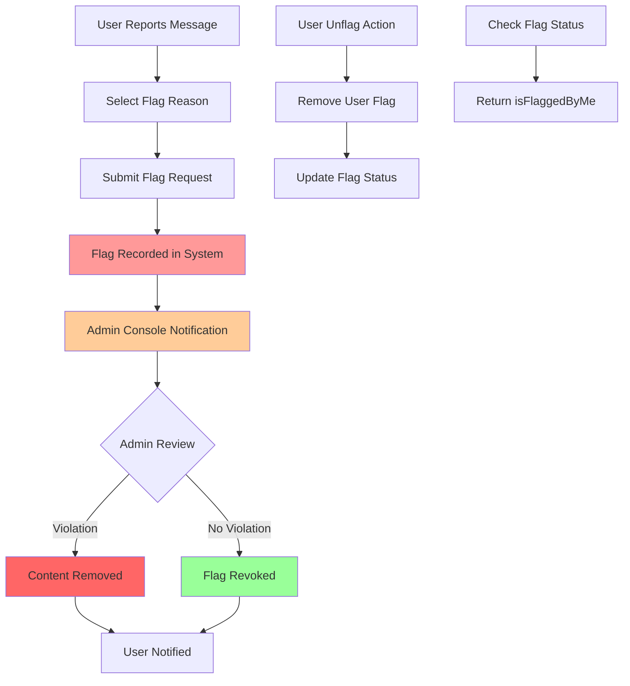

import { Card, Cards, CardGroup } from "/snippets/card-group.mdx";
import { Callout } from "/snippets/callout.mdx";
import { CodeGroup } from "/snippets/code-group.mdx";
import { Tabs, Tab } from "/snippets/tabs.mdx";
import { AccordionGroup, Accordion } from "/snippets/accordion-group.mdx";

# Flag and Unflag Messages

Empower your community with robust content moderation through message flagging capabilities, enabling users to report inappropriate content and administrators to maintain platform safety.

<CardGroup cols={2}>
  <Card
    title="Flag Messages"
    icon="flag"
    href="#flag-messages"
  >
    Report inappropriate content with specific reasons
  </Card>
  <Card
    title="Unflag Messages"
    icon="flag-checkered"
    href="#unflag-messages"
  >
    Remove flags from previously reported messages
  </Card>
  <Card
    title="Flag Status Check"
    icon="circle-question"
    href="#check-flag-status"
  >
    Verify if a message has been flagged by the user
  </Card>
  <Card
    title="Admin Console"
    icon="shield-halved"
    href="#admin-integration"
  >
    Review and manage flagged content
  </Card>
</CardGroup>

## Architecture Overview



## Flag Reasons

social.plus SDK provides comprehensive flagging options to categorize different types of inappropriate content.

<AccordionGroup>
  <Accordion title="Available Flag Reasons" icon="list">
    | Flag Reason | Description | Use Case |
    |-------------|-------------|----------|
    | **CommunityGuidelines** | Against community guidelines | General policy violations |
    | **HarassmentOrBullying** | Harassment or bullying | Targeted abuse, threats |
    | **SelfHarmOrSuicide** | Self-harm or suicide | Dangerous content, crisis situations |
    | **ViolenceOrThreateningContent** | Violence or threatening content | Physical threats, violent imagery |
    | **SellingRestrictedItems** | Selling restricted items | Illegal goods, prohibited sales |
    | **SexualContentOrNudity** | Sexual content or nudity | Inappropriate adult content |
    | **SpamOrScams** | Spam or scams | Unwanted promotional content |
    | **FalseInformation** | False information | Misinformation, fake news |
    | **Others** | Custom reason (Max 300 chars) | Any other violation type |
  </Accordion>
  
  <Accordion title="Platform Availability" icon="devices">
    <Callout type="info">
      Flag reasons are available on **iOS**, **Android**, and **TypeScript** platforms. JavaScript and Flutter use basic flagging without specific reasons.
    </Callout>
  </Accordion>
</AccordionGroup>

## Flag Messages

Report inappropriate messages to help maintain community safety and compliance with platform guidelines.

### Implementation Examples

<Tabs>
  <Tab title="iOS Swift">
    ```swift
    import AmitySDK
    
    class MessageFlagManager {
        private let messageRepository: AmityMessageRepository
        
        init() {
            self.messageRepository = AmityMessageRepository(client: AmityUIKitManagerInternal.shared.client)
        }
        
        func flagMessage(
            messageId: String,
            reason: AmityContentFlagReason,
            customReason: String? = nil
        ) {
            // Create flag request
            var flagBuilder = messageRepository.flag(messageId: messageId)
                .reason(reason)
            
            // Add custom reason for "Others" category
            if reason == .others, let customText = customReason {
                flagBuilder = flagBuilder.customReason(customText)
            }
            
            // Submit flag
            flagBuilder.flag { [weak self] result in
                switch result {
                case .success:
                    self?.handleFlagSuccess(messageId: messageId, reason: reason)
                case .failure(let error):
                    self?.handleFlagError(error: error, messageId: messageId)
                }
            }
        }
        
        private func handleFlagSuccess(messageId: String, reason: AmityContentFlagReason) {
            print("Message \(messageId) flagged successfully with reason: \(reason)")
            
            DispatchQueue.main.async {
                // Update UI to show flagged state
                self.showFlagSuccessMessage()
                self.updateMessageUI(messageId: messageId, isFlagged: true)
            }
        }
        
        private func handleFlagError(error: AmityError, messageId: String) {
            print("Failed to flag message \(messageId): \(error.localizedDescription)")
            
            DispatchQueue.main.async {
                // Show error message to user
                self.showErrorAlert(
                    title: "Flag Failed",
                    message: "Unable to flag this message. Please try again."
                )
            }
        }
        
        // Convenience method for common flag reasons
        func flagForHarassment(messageId: String) {
            flagMessage(messageId: messageId, reason: .harassmentOrBullying)
        }
        
        func flagForSpam(messageId: String) {
            flagMessage(messageId: messageId, reason: .spamOrScams)
        }
        
        func flagWithCustomReason(messageId: String, reason: String) {
            let trimmedReason = String(reason.prefix(300)) // Limit to 300 chars
            flagMessage(messageId: messageId, reason: .others, customReason: trimmedReason)
        }
    }
    ```
  </Tab>
  
  <Tab title="Android Kotlin">
    ```kotlin
    import com.amity.socialcloud.sdk.api.chat.AmityMessageRepository
    import com.amity.socialcloud.sdk.model.core.flag.AmityContentFlagReason
    import io.reactivex.rxjava3.android.schedulers.AndroidSchedulers
    import io.reactivex.rxjava3.disposables.CompositeDisposable
    
    class MessageFlagManager {
        private val messageRepository = AmityMessageRepository()
        private val disposables = CompositeDisposable()
        
        fun flagMessage(
            messageId: String,
            reason: AmityContentFlagReason,
            customReason: String? = null
        ) {
            val flagBuilder = messageRepository.flag(messageId)
                .reason(reason)
            
            // Add custom reason for "Others" category
            if (reason == AmityContentFlagReason.OTHERS && customReason != null) {
                flagBuilder.customReason(customReason.take(300)) // Limit to 300 chars
            }
            
            val disposable = flagBuilder.build()
                .observeOn(AndroidSchedulers.mainThread())
                .subscribe(
                    {
                        handleFlagSuccess(messageId, reason)
                    },
                    { error ->
                        handleFlagError(error, messageId)
                    }
                )
            
            disposables.add(disposable)
        }
        
        private fun handleFlagSuccess(messageId: String, reason: AmityContentFlagReason) {
            Log.d("MessageFlag", "Message $messageId flagged with reason: $reason")
            
            // Update UI to show flagged state
            showFlagSuccessMessage()
            updateMessageUI(messageId, isFlagged = true)
        }
        
        private fun handleFlagError(error: Throwable, messageId: String) {
            Log.e("MessageFlag", "Failed to flag message $messageId", error)
            
            // Show error message to user
            showErrorMessage("Unable to flag this message. Please try again.")
        }
        
        // Convenience methods for common flag reasons
        fun flagForHarassment(messageId: String) {
            flagMessage(messageId, AmityContentFlagReason.HARASSMENT_OR_BULLYING)
        }
        
        fun flagForSpam(messageId: String) {
            flagMessage(messageId, AmityContentFlagReason.SPAM_OR_SCAMS)
        }
        
        fun flagForSexualContent(messageId: String) {
            flagMessage(messageId, AmityContentFlagReason.SEXUAL_CONTENT_OR_NUDITY)
        }
        
        fun flagWithCustomReason(messageId: String, reason: String) {
            flagMessage(messageId, AmityContentFlagReason.OTHERS, reason)
        }
        
        fun dispose() {
            disposables.clear()
        }
    }
    ```
  </Tab>
  
  <Tab title="JavaScript">
    ```javascript
    import { MessageFlagRepository } from '@amityco/js-sdk';
    
    class MessageFlagManager {
        async flagMessage(messageId) {
            try {
                const flagRepo = new MessageFlagRepository(messageId);
                const result = await flagRepo.flag();
                
                this.handleFlagSuccess(messageId);
                return result;
                
            } catch (error) {
                this.handleFlagError(error, messageId);
                throw error;
            }
        }
        
        handleFlagSuccess(messageId) {
            console.log(`Message ${messageId} flagged successfully`);
            
            // Update UI to show flagged state
            this.showFlagSuccessNotification();
            this.updateMessageFlagStatus(messageId, true);
        }
        
        handleFlagError(error, messageId) {
            console.error(`Failed to flag message ${messageId}:`, error);
            
            // Show error notification to user
            this.showErrorNotification('Unable to flag this message. Please try again.');
        }
        
        // Helper method to flag multiple messages
        async flagMultipleMessages(messageIds) {
            const results = await Promise.allSettled(
                messageIds.map(id => this.flagMessage(id))
            );
            
            const successful = results.filter(r => r.status === 'fulfilled').length;
            const failed = results.filter(r => r.status === 'rejected').length;
            
            console.log(`Flagged ${successful} messages, ${failed} failed`);
            return { successful, failed };
        }
        
        showFlagSuccessNotification() {
            // Implementation depends on your notification system
            // Example: toast notification, modal, etc.
        }
        
        showErrorNotification(message) {
            // Implementation depends on your notification system
        }
        
        updateMessageFlagStatus(messageId, isFlagged) {
            // Update UI state to reflect flag status
            const messageElement = document.querySelector(`[data-message-id="${messageId}"]`);
            if (messageElement) {
                messageElement.classList.toggle('flagged', isFlagged);
            }
        }
    }
    ```
  </Tab>
  
  <Tab title="TypeScript">
    ```typescript
    import { MessageFlagRepository, AmityContentFlagReason } from '@amityco/ts-sdk';
    
    interface FlagRequest {
        messageId: string;
        reason: AmityContentFlagReason;
        customReason?: string;
    }
    
    interface FlagResult {
        success: boolean;
        messageId: string;
        error?: Error;
    }
    
    class MessageFlagManager {
        async flagMessage(request: FlagRequest): Promise<FlagResult> {
            try {
                const { messageId, reason, customReason } = request;
                
                // Validate custom reason length
                if (reason === AmityContentFlagReason.OTHERS && customReason) {
                    if (customReason.length > 300) {
                        throw new Error('Custom reason must be 300 characters or less');
                    }
                }
                
                const flagRepo = new MessageFlagRepository(messageId);
                
                // Flag with reason (TypeScript version supports reasons)
                const result = await flagRepo.flag({
                    reason,
                    customReason: reason === AmityContentFlagReason.OTHERS ? customReason : undefined
                });
                
                this.handleFlagSuccess(messageId, reason);
                
                return {
                    success: true,
                    messageId
                };
                
            } catch (error) {
                this.handleFlagError(error as Error, request.messageId);
                
                return {
                    success: false,
                    messageId: request.messageId,
                    error: error as Error
                };
            }
        }
        
        private handleFlagSuccess(messageId: string, reason: AmityContentFlagReason): void {
            console.log(`Message ${messageId} flagged with reason: ${reason}`);
            
            // Update UI state
            this.updateMessageFlagStatus(messageId, true);
            this.showSuccessNotification('Message flagged successfully');
        }
        
        private handleFlagError(error: Error, messageId: string): void {
            console.error(`Flag operation failed for message ${messageId}:`, error.message);
            
            // Show appropriate error message
            this.showErrorNotification(this.getFriendlyErrorMessage(error));
        }
        
        private getFriendlyErrorMessage(error: Error): string {
            // Map technical errors to user-friendly messages
            if (error.message.includes('already flagged')) {
                return 'You have already flagged this message';
            } else if (error.message.includes('permission')) {
                return 'You do not have permission to flag this message';
            } else if (error.message.includes('network')) {
                return 'Network error. Please check your connection and try again';
            } else {
                return 'Unable to flag this message. Please try again';
            }
        }
        
        // Convenience methods with type safety
        async flagForHarassment(messageId: string): Promise<FlagResult> {
            return this.flagMessage({
                messageId,
                reason: AmityContentFlagReason.HARASSMENT_OR_BULLYING
            });
        }
        
        async flagForSpam(messageId: string): Promise<FlagResult> {
            return this.flagMessage({
                messageId,
                reason: AmityContentFlagReason.SPAM_OR_SCAMS
            });
        }
        
        async flagWithCustomReason(messageId: string, customReason: string): Promise<FlagResult> {
            return this.flagMessage({
                messageId,
                reason: AmityContentFlagReason.OTHERS,
                customReason
            });
        }
        
        private updateMessageFlagStatus(messageId: string, isFlagged: boolean): void {
            // Type-safe UI updates
            const messageElement = document.querySelector<HTMLElement>(
                `[data-message-id="${messageId}"]`
            );
            
            if (messageElement) {
                messageElement.classList.toggle('message-flagged', isFlagged);
                messageElement.setAttribute('data-flagged', isFlagged.toString());
            }
        }
        
        private showSuccessNotification(message: string): void {
            // Implement your notification system
        }
        
        private showErrorNotification(message: string): void {
            // Implement your notification system
        }
    }
    ```
  </Tab>
  
  <Tab title="Flutter Dart">
    ```dart
    import 'package:amity_sdk/amity_sdk.dart';
    
    enum FlagReason {
        harassment,
        spam,
        sexualContent,
        violence,
        selfHarm,
        communityGuidelines,
        sellingRestricted,
        falseInformation,
        other
    }
    
    class MessageFlagManager {
        Future<bool> flagMessage({
            required String messageId,
            FlagReason? reason,
            String? customReason,
        }) async {
            try {
                await AmitySocialClient.newMessageRepository()
                    .flagMessage(messageId);
                
                _handleFlagSuccess(messageId, reason);
                return true;
                
            } catch (error) {
                _handleFlagError(error, messageId);
                return false;
            }
        }
        
        void _handleFlagSuccess(String messageId, FlagReason? reason) {
            print('Message $messageId flagged successfully');
            if (reason != null) {
                print('Reason: ${reason.toString()}');
            }
            
            // Update UI to show flagged state
            _showFlagSuccessMessage();
            _updateMessageFlagStatus(messageId, true);
        }
        
        void _handleFlagError(dynamic error, String messageId) {
            print('Failed to flag message $messageId: $error');
            
            // Show error message to user
            _showErrorMessage('Unable to flag this message. Please try again.');
        }
        
        // Convenience methods for common flag reasons
        Future<bool> flagForHarassment(String messageId) async {
            return flagMessage(
                messageId: messageId,
                reason: FlagReason.harassment,
            );
        }
        
        Future<bool> flagForSpam(String messageId) async {
            return flagMessage(
                messageId: messageId,
                reason: FlagReason.spam,
            );
        }
        
        Future<bool> flagForSexualContent(String messageId) async {
            return flagMessage(
                messageId: messageId,
                reason: FlagReason.sexualContent,
            );
        }
        
        Future<bool> flagWithCustomReason(String messageId, String customReason) async {
            // Limit custom reason to 300 characters
            final trimmedReason = customReason.length > 300 
                ? customReason.substring(0, 300) 
                : customReason;
            
            return flagMessage(
                messageId: messageId,
                reason: FlagReason.other,
                customReason: trimmedReason,
            );
        }
        
        void _showFlagSuccessMessage() {
            // Implementation depends on your UI framework
            // Example: SnackBar, Dialog, Toast, etc.
        }
        
        void _showErrorMessage(String message) {
            // Implementation depends on your UI framework
        }
        
        void _updateMessageFlagStatus(String messageId, bool isFlagged) {
            // Update UI state to reflect flag status
            // This would typically involve notifying listeners or updating state management
        }
    }
    ```
  </Tab>
</Tabs>

## Unflag Messages

Remove flags from previously reported messages when they are no longer considered inappropriate or were flagged by mistake.

<Callout type="tip">
Users can unflag messages they previously flagged. This provides flexibility for accidental flags or changed perspectives on content.
</Callout>

### Unflag Implementation Examples

<Tabs>
  <Tab title="iOS Swift">
    ```swift
    extension MessageFlagManager {
        func unflagMessage(messageId: String) {
            messageRepository.unflag(messageId: messageId) { [weak self] result in
                switch result {
                case .success:
                    self?.handleUnflagSuccess(messageId: messageId)
                case .failure(let error):
                    self?.handleUnflagError(error: error, messageId: messageId)
                }
            }
        }
        
        private func handleUnflagSuccess(messageId: String) {
            print("Message \(messageId) unflagged successfully")
            
            DispatchQueue.main.async {
                // Update UI to show unflagged state
                self.showUnflagSuccessMessage()
                self.updateMessageUI(messageId: messageId, isFlagged: false)
            }
        }
        
        private func handleUnflagError(error: AmityError, messageId: String) {
            print("Failed to unflag message \(messageId): \(error.localizedDescription)")
            
            DispatchQueue.main.async {
                // Show error message to user
                self.showErrorAlert(
                    title: "Unflag Failed",
                    message: "Unable to unflag this message. Please try again."
                )
            }
        }
        
        // Check and toggle flag status
        func toggleMessageFlag(messageId: String) {
            checkIfMessageIsFlagged(messageId: messageId) { [weak self] isFlagged in
                if isFlagged {
                    self?.unflagMessage(messageId: messageId)
                } else {
                    // Show flag options to user
                    self?.showFlagOptionsDialog(messageId: messageId)
                }
            }
        }
    }
    ```
  </Tab>
  
  <Tab title="Android Kotlin">
    ```kotlin
    fun unflagMessage(messageId: String) {
        val disposable = messageRepository.unflag(messageId)
            .observeOn(AndroidSchedulers.mainThread())
            .subscribe(
                {
                    handleUnflagSuccess(messageId)
                },
                { error ->
                    handleUnflagError(error, messageId)
                }
            )
        
        disposables.add(disposable)
    }
    
    private fun handleUnflagSuccess(messageId: String) {
        Log.d("MessageFlag", "Message $messageId unflagged successfully")
        
        // Update UI to show unflagged state
        showUnflagSuccessMessage()
        updateMessageUI(messageId, isFlagged = false)
    }
    
    private fun handleUnflagError(error: Throwable, messageId: String) {
        Log.e("MessageFlag", "Failed to unflag message $messageId", error)
        
        // Show error message to user
        showErrorMessage("Unable to unflag this message. Please try again.")
    }
    
    // Toggle flag status
    fun toggleMessageFlag(messageId: String) {
        val disposable = messageRepository.isFlaggedByMe(messageId)
            .observeOn(AndroidSchedulers.mainThread())
            .subscribe(
                { isFlagged ->
                    if (isFlagged) {
                        unflagMessage(messageId)
                    } else {
                        // Show flag options to user
                        showFlagOptionsDialog(messageId)
                    }
                },
                { error ->
                    Log.e("MessageFlag", "Failed to check flag status", error)
                }
            )
        
        disposables.add(disposable)
    }
    ```
  </Tab>
  
  <Tab title="JavaScript">
    ```javascript
    async unflagMessage(messageId) {
        try {
            const flagRepo = new MessageFlagRepository(messageId);
            const result = await flagRepo.unflag();
            
            this.handleUnflagSuccess(messageId);
            return result;
            
        } catch (error) {
            this.handleUnflagError(error, messageId);
            throw error;
        }
    }
    
    handleUnflagSuccess(messageId) {
        console.log(`Message ${messageId} unflagged successfully`);
        
        // Update UI to show unflagged state
        this.showUnflagSuccessNotification();
        this.updateMessageFlagStatus(messageId, false);
    }
    
    handleUnflagError(error, messageId) {
        console.error(`Failed to unflag message ${messageId}:`, error);
        
        // Show error notification to user
        this.showErrorNotification('Unable to unflag this message. Please try again.');
    }
    
    // Toggle flag status
    async toggleMessageFlag(messageId) {
        try {
            const flagRepo = new MessageFlagRepository(messageId);
            const isFlagged = await flagRepo.isFlaggedByMe();
            
            if (isFlagged) {
                await this.unflagMessage(messageId);
            } else {
                // Show flag options to user
                this.showFlagOptionsModal(messageId);
            }
        } catch (error) {
            this.handleUnflagError(error, messageId);
        }
    }
    
    showUnflagSuccessNotification() {
        // Implementation depends on your notification system
    }
    
    showFlagOptionsModal(messageId) {
        // Show modal with flag reason options
    }
    ```
  </Tab>
  
  <Tab title="TypeScript">
    ```typescript
    async unflagMessage(messageId: string): Promise<FlagResult> {
        try {
            const flagRepo = new MessageFlagRepository(messageId);
            const result = await flagRepo.unflag();
            
            this.handleUnflagSuccess(messageId);
            
            return {
                success: true,
                messageId
            };
            
        } catch (error) {
            this.handleUnflagError(error as Error, messageId);
            
            return {
                success: false,
                messageId,
                error: error as Error
            };
        }
    }
    
    private handleUnflagSuccess(messageId: string): void {
        console.log(`Message ${messageId} unflagged successfully`);
        
        // Update UI state
        this.updateMessageFlagStatus(messageId, false);
        this.showSuccessNotification('Flag removed successfully');
    }
    
    private handleUnflagError(error: Error, messageId: string): void {
        console.error(`Unflag operation failed for message ${messageId}:`, error.message);
        
        // Show appropriate error message
        this.showErrorNotification(this.getFriendlyErrorMessage(error));
    }
    
    // Toggle flag status with type safety
    async toggleMessageFlag(messageId: string): Promise<void> {
        try {
            const isFlagged = await this.checkIfMessageIsFlagged(messageId);
            
            if (isFlagged) {
                await this.unflagMessage(messageId);
            } else {
                // Show flag options to user
                this.showFlagOptionsDialog(messageId);
            }
        } catch (error) {
            this.handleUnflagError(error as Error, messageId);
        }
    }
    
    // Batch unflag operations
    async unflagMultipleMessages(messageIds: string[]): Promise<{
        successful: number;
        failed: number;
        results: FlagResult[];
    }> {
        const results = await Promise.allSettled(
            messageIds.map(id => this.unflagMessage(id))
        );
        
        const flagResults: FlagResult[] = results.map((result, index) => {
            if (result.status === 'fulfilled') {
                return result.value;
            } else {
                return {
                    success: false,
                    messageId: messageIds[index],
                    error: result.reason
                };
            }
        });
        
        const successful = flagResults.filter(r => r.success).length;
        const failed = flagResults.filter(r => !r.success).length;
        
        return { successful, failed, results: flagResults };
    }
    
    private showFlagOptionsDialog(messageId: string): void {
        // Implementation for showing flag options dialog
    }
    ```
  </Tab>
  
  <Tab title="Flutter Dart">
    ```dart
    Future<bool> unflagMessage(String messageId) async {
        try {
            await AmitySocialClient.newMessageRepository()
                .unflagMessage(messageId);
            
            _handleUnflagSuccess(messageId);
            return true;
            
        } catch (error) {
            _handleUnflagError(error, messageId);
            return false;
        }
    }
    
    void _handleUnflagSuccess(String messageId) {
        print('Message $messageId unflagged successfully');
        
        // Update UI to show unflagged state
        _showUnflagSuccessMessage();
        _updateMessageFlagStatus(messageId, false);
    }
    
    void _handleUnflagError(dynamic error, String messageId) {
        print('Failed to unflag message $messageId: $error');
        
        // Show error message to user
        _showErrorMessage('Unable to unflag this message. Please try again.');
    }
    
    // Toggle flag status
    Future<void> toggleMessageFlag(String messageId) async {
        try {
            final isFlagged = await checkIfMessageIsFlagged(messageId);
            
            if (isFlagged) {
                await unflagMessage(messageId);
            } else {
                // Show flag options to user
                _showFlagOptionsDialog(messageId);
            }
        } catch (error) {
            _handleUnflagError(error, messageId);
        }
    }
    
    // Batch unflag operation
    Future<Map<String, dynamic>> unflagMultipleMessages(List<String> messageIds) async {
        int successful = 0;
        int failed = 0;
        List<String> errors = [];
        
        for (String messageId in messageIds) {
            try {
                final result = await unflagMessage(messageId);
                if (result) {
                    successful++;
                } else {
                    failed++;
                }
            } catch (error) {
                failed++;
                errors.add('$messageId: $error');
            }
        }
        
        return {
            'successful': successful,
            'failed': failed,
            'errors': errors,
        };
    }
    
    void _showUnflagSuccessMessage() {
        // Implementation depends on your UI framework
    }
    
    void _showFlagOptionsDialog(String messageId) {
        // Show dialog with flag reason options
    }
    ```
  </Tab>
</Tabs>

## Check Flag Status

Verify whether a message has been flagged by the current user to provide appropriate UI states and prevent duplicate flags.

<Callout type="info">
The `isFlaggedByMe` method only returns the flag status for the current user, not the overall flag status from all users.
</Callout>

### Flag Status Implementation Examples

<Tabs>
  <Tab title="iOS Swift">
    ```swift
    extension MessageFlagManager {
        func checkIfMessageIsFlagged(
            messageId: String,
            completion: @escaping (Bool) -> Void
        ) {
            messageRepository.isFlaggedByMe(messageId: messageId) { result in
                switch result {
                case .success(let isFlagged):
                    completion(isFlagged)
                case .failure(let error):
                    print("Failed to check flag status for message \(messageId): \(error)")
                    completion(false) // Default to false on error
                }
            }
        }
        
        // Async/await version for iOS 13+
        @available(iOS 13.0, *)
        func checkIfMessageIsFlagged(messageId: String) async -> Bool {
            return await withCheckedContinuation { continuation in
                checkIfMessageIsFlagged(messageId: messageId) { isFlagged in
                    continuation.resume(returning: isFlagged)
                }
            }
        }
        
        // Update UI based on flag status
        func updateMessageFlagUI(messageId: String) {
            checkIfMessageIsFlagged(messageId: messageId) { [weak self] isFlagged in
                DispatchQueue.main.async {
                    self?.updateMessageUI(messageId: messageId, isFlagged: isFlagged)
                }
            }
        }
        
        // Batch check multiple messages
        func checkMultipleMessagesFlagStatus(
            messageIds: [String],
            completion: @escaping ([String: Bool]) -> Void
        ) {
            let dispatchGroup = DispatchGroup()
            var flagStatuses: [String: Bool] = [:]
            
            for messageId in messageIds {
                dispatchGroup.enter()
                checkIfMessageIsFlagged(messageId: messageId) { isFlagged in
                    flagStatuses[messageId] = isFlagged
                    dispatchGroup.leave()
                }
            }
            
            dispatchGroup.notify(queue: .main) {
                completion(flagStatuses)
            }
        }
    }
    ```
  </Tab>
  
  <Tab title="Android Kotlin">
    ```kotlin
    fun checkIfMessageIsFlagged(
        messageId: String,
        callback: (Boolean) -> Unit
    ) {
        val disposable = messageRepository.isFlaggedByMe(messageId)
            .observeOn(AndroidSchedulers.mainThread())
            .subscribe(
                { isFlagged ->
                    callback(isFlagged)
                },
                { error ->
                    Log.e("MessageFlag", "Failed to check flag status for $messageId", error)
                    callback(false) // Default to false on error
                }
            )
        
        disposables.add(disposable)
    }
    
    // Coroutine version for modern Android development
    suspend fun checkIfMessageIsFlaggedAsync(messageId: String): Boolean {
        return try {
            messageRepository.isFlaggedByMe(messageId)
                .observeOn(AndroidSchedulers.mainThread())
                .blockingSingle()
        } catch (error: Exception) {
            Log.e("MessageFlag", "Failed to check flag status for $messageId", error)
            false
        }
    }
    
    // Update UI based on flag status
    fun updateMessageFlagUI(messageId: String) {
        checkIfMessageIsFlagged(messageId) { isFlagged ->
            updateMessageUI(messageId, isFlagged)
        }
    }
    
    // Batch check multiple messages
    fun checkMultipleMessagesFlagStatus(
        messageIds: List<String>,
        callback: (Map<String, Boolean>) -> Unit
    ) {
        val flagStatuses = mutableMapOf<String, Boolean>()
        var completedCount = 0
        
        messageIds.forEach { messageId ->
            checkIfMessageIsFlagged(messageId) { isFlagged ->
                flagStatuses[messageId] = isFlagged
                completedCount++
                
                if (completedCount == messageIds.size) {
                    callback(flagStatuses.toMap())
                }
            }
        }
    }
    
    // LiveData version for reactive UI updates
    fun getFlagStatusLiveData(messageId: String): LiveData<Boolean> {
        val liveData = MutableLiveData<Boolean>()
        
        checkIfMessageIsFlagged(messageId) { isFlagged ->
            liveData.value = isFlagged
        }
        
        return liveData
    }
    ```
  </Tab>
  
  <Tab title="JavaScript">
    ```javascript
    async checkIfMessageIsFlagged(messageId) {
        try {
            const flagRepo = new MessageFlagRepository(messageId);
            const isFlagged = await flagRepo.isFlaggedByMe();
            
            return isFlagged;
            
        } catch (error) {
            console.error(`Failed to check flag status for message ${messageId}:`, error);
            return false; // Default to false on error
        }
    }
    
    // Update UI based on flag status
    async updateMessageFlagUI(messageId) {
        const isFlagged = await this.checkIfMessageIsFlagged(messageId);
        this.updateMessageFlagStatus(messageId, isFlagged);
    }
    
    // Batch check multiple messages
    async checkMultipleMessagesFlagStatus(messageIds) {
        const results = await Promise.allSettled(
            messageIds.map(id => this.checkIfMessageIsFlagged(id))
        );
        
        const flagStatuses = {};
        results.forEach((result, index) => {
            const messageId = messageIds[index];
            flagStatuses[messageId] = result.status === 'fulfilled' ? result.value : false;
        });
        
        return flagStatuses;
    }
    
    // Set up flag status monitoring for multiple messages
    async monitorMessagesFlagStatus(messageIds, callback) {
        const flagStatuses = await this.checkMultipleMessagesFlagStatus(messageIds);
        callback(flagStatuses);
        
        // Set up periodic checking if needed
        const intervalId = setInterval(async () => {
            const updatedStatuses = await this.checkMultipleMessagesFlagStatus(messageIds);
            
            // Check if any status changed
            const hasChanges = messageIds.some(
                id => updatedStatuses[id] !== flagStatuses[id]
            );
            
            if (hasChanges) {
                Object.assign(flagStatuses, updatedStatuses);
                callback(flagStatuses);
            }
        }, 30000); // Check every 30 seconds
        
        return () => clearInterval(intervalId); // Return cleanup function
    }
    ```
  </Tab>
  
  <Tab title="TypeScript">
    ```typescript
    async checkIfMessageIsFlagged(messageId: string): Promise<boolean> {
        try {
            const flagRepo = new MessageFlagRepository(messageId);
            const isFlagged = await flagRepo.isFlaggedByMe();
            
            return isFlagged;
            
        } catch (error) {
            console.error(`Failed to check flag status for message ${messageId}:`, error);
            return false; // Default to false on error
        }
    }
    
    // Update UI with type safety
    async updateMessageFlagUI(messageId: string): Promise<void> {
        const isFlagged = await this.checkIfMessageIsFlagged(messageId);
        this.updateMessageFlagStatus(messageId, isFlagged);
    }
    
    // Batch check with proper typing
    async checkMultipleMessagesFlagStatus(
        messageIds: string[]
    ): Promise<Record<string, boolean>> {
        const results = await Promise.allSettled(
            messageIds.map(id => this.checkIfMessageIsFlagged(id))
        );
        
        const flagStatuses: Record<string, boolean> = {};
        results.forEach((result, index) => {
            const messageId = messageIds[index];
            flagStatuses[messageId] = result.status === 'fulfilled' ? result.value : false;
        });
        
        return flagStatuses;
    }
    
    // Generic flag status monitoring with proper types
    async monitorMessagesFlagStatus(
        messageIds: string[],
        callback: (statuses: Record<string, boolean>) => void,
        interval: number = 30000
    ): Promise<() => void> {
        const flagStatuses = await this.checkMultipleMessagesFlagStatus(messageIds);
        callback(flagStatuses);
        
        const intervalId = setInterval(async () => {
            try {
                const updatedStatuses = await this.checkMultipleMessagesFlagStatus(messageIds);
                
                // Check if any status changed
                const hasChanges = messageIds.some(
                    id => updatedStatuses[id] !== flagStatuses[id]
                );
                
                if (hasChanges) {
                    Object.assign(flagStatuses, updatedStatuses);
                    callback(flagStatuses);
                }
            } catch (error) {
                console.error('Error monitoring flag statuses:', error);
            }
        }, interval);
        
        return () => clearInterval(intervalId);
    }
    
    // Cache flag statuses for better performance
    private flagStatusCache = new Map<string, { status: boolean; timestamp: number }>();
    private readonly CACHE_DURATION = 5 * 60 * 1000; // 5 minutes
    
    async checkIfMessageIsFlaggedCached(messageId: string): Promise<boolean> {
        const cached = this.flagStatusCache.get(messageId);
        const now = Date.now();
        
        if (cached && (now - cached.timestamp) < this.CACHE_DURATION) {
            return cached.status;
        }
        
        const status = await this.checkIfMessageIsFlagged(messageId);
        this.flagStatusCache.set(messageId, { status, timestamp: now });
        
        return status;
    }
    
    // Clear cache when flag status changes
    private updateFlagStatusCache(messageId: string, isFlagged: boolean): void {
        this.flagStatusCache.set(messageId, { 
            status: isFlagged, 
            timestamp: Date.now() 
        });
    }
    ```
  </Tab>
  
  <Tab title="Flutter Dart">
    ```dart
    Future<bool> checkIfMessageIsFlagged(String messageId) async {
        try {
            final isFlagged = await AmitySocialClient.newMessageRepository()
                .isFlaggedByMe(messageId);
            
            return isFlagged;
            
        } catch (error) {
            print('Failed to check flag status for message $messageId: $error');
            return false; // Default to false on error
        }
    }
    
    // Update UI based on flag status
    Future<void> updateMessageFlagUI(String messageId) async {
        final isFlagged = await checkIfMessageIsFlagged(messageId);
        _updateMessageFlagStatus(messageId, isFlagged);
    }
    
    // Batch check multiple messages
    Future<Map<String, bool>> checkMultipleMessagesFlagStatus(
        List<String> messageIds
    ) async {
        final Map<String, bool> flagStatuses = {};
        
        final futures = messageIds.map((messageId) async {
            final isFlagged = await checkIfMessageIsFlagged(messageId);
            return MapEntry(messageId, isFlagged);
        });
        
        final results = await Future.wait(futures);
        
        for (final entry in results) {
            flagStatuses[entry.key] = entry.value;
        }
        
        return flagStatuses;
    }
    
    // Stream-based flag status monitoring
    Stream<Map<String, bool>> monitorMessagesFlagStatus(
        List<String> messageIds,
        Duration interval = const Duration(seconds: 30),
    ) async* {
        while (true) {
            try {
                final flagStatuses = await checkMultipleMessagesFlagStatus(messageIds);
                yield flagStatuses;
                await Future.delayed(interval);
            } catch (error) {
                print('Error monitoring flag statuses: $error');
                yield <String, bool>{}; // Yield empty map on error
                await Future.delayed(interval);
            }
        }
    }
    
    // Cache implementation for better performance
    final Map<String, _FlagStatusCache> _flagStatusCache = {};
    static const Duration _cacheDuration = Duration(minutes: 5);
    
    Future<bool> checkIfMessageIsFlaggedCached(String messageId) async {
        final cached = _flagStatusCache[messageId];
        final now = DateTime.now();
        
        if (cached != null && 
            now.difference(cached.timestamp) < _cacheDuration) {
            return cached.status;
        }
        
        final status = await checkIfMessageIsFlagged(messageId);
        _flagStatusCache[messageId] = _FlagStatusCache(
            status: status,
            timestamp: now,
        );
        
        return status;
    }
    
    // Clear cache when flag status changes
    void _updateFlagStatusCache(String messageId, bool isFlagged) {
        _flagStatusCache[messageId] = _FlagStatusCache(
            status: isFlagged,
            timestamp: DateTime.now(),
        );
    }
    
    // Clean up expired cache entries
    void _cleanupFlagStatusCache() {
        final now = DateTime.now();
        _flagStatusCache.removeWhere((key, value) =>
            now.difference(value.timestamp) > _cacheDuration);
    }
    }
    
    class _FlagStatusCache {
        final bool status;
        final DateTime timestamp;
        
        _FlagStatusCache({
            required this.status,
            required this.timestamp,
        });
    }
    ```
  </Tab>
</Tabs>

## Admin Integration

Flagged messages appear in the admin console for review and moderation actions by administrators.

<AccordionGroup>
  <Accordion title="Admin Console Features" icon="shield-halved">
    - **Flag Review**: View all flagged messages with flag reasons
    - **Content Moderation**: Delete or approve flagged content
    - **Flag Management**: Revoke flags that don't violate policies
    - **User Actions**: Take action against users who violate guidelines
    - **Analytics**: Track flagging patterns and moderation metrics
  </Accordion>
  
  <Accordion title="Moderation Workflow" icon="list-ol">
    1. **User flags message** with specific reason
    2. **Admin receives notification** of flagged content
    3. **Admin reviews message** and context
    4. **Admin makes decision**: Delete content or revoke flag
    5. **User receives feedback** (optional) about moderation decision
    6. **System logs action** for audit trail
  </Accordion>
</AccordionGroup>

## Best Practices

<AccordionGroup>
  <Accordion title="User Experience Guidelines" icon="star">
    - **Clear Flag Options**: Provide intuitive flag reason categories
    - **Confirmation Dialogs**: Confirm flag actions to prevent accidents
    - **Visual Feedback**: Show clear indication of flagged status
    - **Educational Content**: Help users understand flag policies
    
    ```javascript
    // Example flag confirmation dialog
    function showFlagConfirmation(messageId, reason) {
        return new Promise((resolve) => {
            const modal = document.createElement('div');
            modal.innerHTML = `
                <div class="flag-confirmation-modal">
                    <h3>Flag this message?</h3>
                    <p>Reason: ${reason}</p>
                    <p>This will report the message to moderators for review.</p>
                    <button onclick="resolve(true)">Confirm</button>
                    <button onclick="resolve(false)">Cancel</button>
                </div>
            `;
            document.body.appendChild(modal);
        });
    }
    ```
  </Accordion>
  
  <Accordion title="Performance Optimization" icon="gauge-high">
    - **Batch Operations**: Process multiple flag status checks together
    - **Caching**: Cache flag statuses to reduce API calls
    - **Lazy Loading**: Load flag status only when needed
    - **Debounced Updates**: Prevent rapid flag/unflag operations
    
    ```typescript
    class FlagStatusCache {
        private cache = new Map<string, CacheEntry>();
        private readonly TTL = 5 * 60 * 1000; // 5 minutes
        
        async getFlagStatus(messageId: string): Promise<boolean> {
            const cached = this.cache.get(messageId);
            
            if (cached && Date.now() - cached.timestamp < this.TTL) {
                return cached.value;
            }
            
            const status = await this.fetchFlagStatus(messageId);
            this.cache.set(messageId, {
                value: status,
                timestamp: Date.now()
            });
            
            return status;
        }
    }
    ```
  </Accordion>
  
  <Accordion title="Error Handling" icon="shield-exclamation">
    - **Network Failures**: Implement retry logic with backoff
    - **Permission Errors**: Handle unauthorized flag attempts gracefully
    - **Rate Limiting**: Respect API rate limits and queue requests
    - **User Feedback**: Provide clear error messages and recovery options
    
    ```swift
    func handleFlagError(_ error: AmityError) {
        switch error.code {
        case .networkError:
            showRetryOption("Network error. Please check your connection.")
        case .permissionDenied:
            showError("You don't have permission to flag this message.")
        case .rateLimitExceeded:
            showError("Too many requests. Please try again later.")
        case .alreadyFlagged:
            showInfo("You have already flagged this message.")
        default:
            showError("Unable to flag message. Please try again.")
        }
    }
    ```
  </Accordion>
  
  <Accordion title="Security Considerations" icon="lock">
    - **Abuse Prevention**: Implement rate limiting for flag operations
    - **Spam Detection**: Monitor for users who flag excessively
    - **Content Validation**: Validate flag reasons on client and server
    - **Audit Logging**: Maintain logs of all flag operations
    
    ```typescript
    class FlagSecurityManager {
        private userFlagCount = new Map<string, number>();
        private readonly MAX_FLAGS_PER_HOUR = 10;
        private readonly FLAG_WINDOW = 60 * 60 * 1000; // 1 hour
        
        canUserFlag(userId: string): boolean {
            const count = this.userFlagCount.get(userId) || 0;
            return count < this.MAX_FLAGS_PER_HOUR;
        }
        
        recordFlag(userId: string): void {
            const count = this.userFlagCount.get(userId) || 0;
            this.userFlagCount.set(userId, count + 1);
            
            // Reset counter after window
            setTimeout(() => {
                this.userFlagCount.delete(userId);
            }, this.FLAG_WINDOW);
        }
    }
    ```
  </Accordion>
</AccordionGroup>

## Advanced Features

<CardGroup cols={2}>
  <Card
    title="Bulk Flag Operations"
    icon="list-check"
    href="#bulk-operations"
  >
    Handle multiple messages simultaneously
  </Card>
  <Card
    title="Flag Analytics"
    icon="chart-bar"
    href="#flag-analytics"
  >
    Track flagging patterns and metrics
  </Card>
  <Card
    title="Custom Flag Reasons"
    icon="wrench"
    href="#custom-reasons"
  >
    Implement domain-specific flag categories
  </Card>
  <Card
    title="Automated Moderation"
    icon="robot"
    href="#auto-moderation"
  >
    Integrate with AI-powered content filtering
  </Card>
</CardGroup>

### Bulk Flag Operations

```typescript
class BulkFlagManager {
    async flagMultipleMessages(
        requests: Array<{ messageId: string; reason: AmityContentFlagReason; customReason?: string }>
    ): Promise<BulkFlagResult> {
        const results = await Promise.allSettled(
            requests.map(request => this.flagMessage(request))
        );
        
        const successful = results.filter(r => r.status === 'fulfilled').length;
        const failed = results.filter(r => r.status === 'rejected').length;
        
        return {
            total: requests.length,
            successful,
            failed,
            results: results.map((result, index) => ({
                messageId: requests[index].messageId,
                success: result.status === 'fulfilled',
                error: result.status === 'rejected' ? result.reason : undefined
            }))
        };
    }
}
```

## Related Documentation

<CardGroup cols={2}>
  <Card
    title="Content Moderation"
    icon="shield"
    href="../moderation-safety/content-moderation/overview"
  >
    Comprehensive content moderation strategies
  </Card>
  <Card
    title="Admin Console"
    icon="gear"
    href="../../getting-started/platform-setup/admin-console"
  >
    Admin panel setup and configuration
  </Card>
  <Card
    title="User Safety"
    icon="user-shield"
    href="../../core-concepts/user-management/user-safety"
  >
    User safety and community guidelines
  </Card>
  <Card
    title="Real-time Events"
    icon="bolt"
    href="../../core-concepts/realtime-communication/realtime-events"
  >
    Event-driven moderation notifications
  </Card>
</CardGroup>