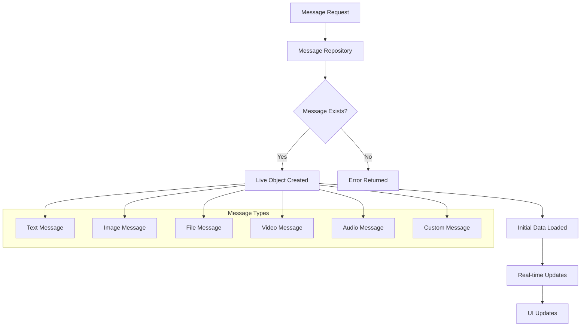

# Get and View Messages

Efficiently retrieve and display chat messages with comprehensive support for all message types including text, images, files, videos, audio, and custom content. Build rich chat interfaces that handle real-time updates and provide optimal user experiences across platforms.

<CardGroup cols={3}>
  <Card title="Message Retrieval" icon="message-circle">
    Get individual messages or collections with live updates
  </Card>
  <Card title="Multi-Type Support" icon="file-text">
    Handle text, media, files, and custom message formats
  </Card>
  <Card title="Real-Time Updates" icon="zap">
    Live synchronization with automatic UI updates
  </Card>
</CardGroup>

## Message Architecture

Understanding how messages flow through the system:



## Core Message Operations

### Get Single Message

Retrieve a specific message by its unique identifier with automatic real-time synchronization.

<AccordionGroup>
  <Accordion title="messageId - Required">
    **Type:** `string`
    
    Unique identifier for the message. Must be a valid message ID that exists in the system.
  </Accordion>
  <Accordion title="includeDeleted - Optional">
    **Type:** `boolean` **Default:** `false`
    
    Whether to include deleted messages in the response. Useful for moderation interfaces.
  </Accordion>
</AccordionGroup>

<Tabs>
  <Tab title="iOS">
    <CodeGroup>
      ```swift Basic Implementation
      import AmitySDK
      
      class MessageViewController: UIViewController {
          private var messageToken: AmityNotificationToken?
          
          func getMessage(messageId: String) {
              // Get message with live updates
              let repository = AmityMessageRepository(client: client)
              let liveObject = repository.getMessage(messageId)
              
              // Observe real-time changes
              messageToken = liveObject.observe { [weak self] message, error in
                  if let error = error {
                      self?.handleError(error)
                      return
                  }
                  
                  guard let message = message.object else { return }
                  self?.displayMessage(message)
              }
          }
          
          private func displayMessage(_ message: AmityMessage) {
              // Update UI with message data
              DispatchQueue.main.async {
                  self.updateMessageView(with: message)
              }
          }
          
          deinit {
              messageToken?.invalidate()
          }
      }
      ```
      
      ```swift SwiftUI Implementation
      import SwiftUI
      import AmitySDK
      
      struct MessageView: View {
          @StateObject private var viewModel = MessageViewModel()
          let messageId: String
          
          var body: some View {
              Group {
                  if viewModel.isLoading {
                      ProgressView("Loading message...")
                  } else if let message = viewModel.message {
                      MessageContentView(message: message)
                  } else if let error = viewModel.error {
                      ErrorView(error: error)
                  }
              }
              .onAppear {
                  viewModel.loadMessage(messageId: messageId)
              }
          }
      }
      
      class MessageViewModel: ObservableObject {
          @Published var message: AmityMessage?
          @Published var isLoading = false
          @Published var error: Error?
          
          private var messageToken: AmityNotificationToken?
          
          func loadMessage(messageId: String) {
              isLoading = true
              
              let repository = AmityMessageRepository(client: AmityUIKitManager.client)
              let liveObject = repository.getMessage(messageId)
              
              messageToken = liveObject.observe { [weak self] message, error in
                  DispatchQueue.main.async {
                      self?.isLoading = false
                      
                      if let error = error {
                          self?.error = error
                          return
                      }
                      
                      self?.message = message.object
                  }
              }
          }
          
          deinit {
              messageToken?.invalidate()
          }
      }
      ```
    </CodeGroup>
  </Tab>
  
  <Tab title="Android">
    <CodeGroup>
      ```kotlin Basic Implementation
      import com.amity.socialcloud.sdk.chat.message.AmityMessageRepository
      import io.reactivex.android.schedulers.AndroidSchedulers
      import io.reactivex.disposables.CompositeDisposable
      import io.reactivex.schedulers.Schedulers
      
      class MessageActivity : AppCompatActivity() {
          private val disposables = CompositeDisposable()
          private lateinit var messageRepository: AmityMessageRepository
          
          override fun onCreate(savedInstanceState: Bundle?) {
              super.onCreate(savedInstanceState)
              setContentView(R.layout.activity_message)
              
              messageRepository = AmityMessageRepository(AmityCoreClient.newClient())
              
              val messageId = intent.getStringExtra("messageId") ?: return
              loadMessage(messageId)
          }
          
          private fun loadMessage(messageId: String) {
              val disposable = messageRepository.getMessage(messageId)
                  .subscribeOn(Schedulers.io())
                  .observeOn(AndroidSchedulers.mainThread())
                  .doOnSubscribe { showLoading(true) }
                  .subscribe(
                      { message ->
                          showLoading(false)
                          displayMessage(message)
                      },
                      { error ->
                          showLoading(false)
                          handleError(error)
                      }
                  )
              
              disposables.add(disposable)
          }
          
          private fun displayMessage(message: AmityMessage) {
              // Update UI based on message type
              when (message.type) {
                  AmityMessage.Type.TEXT -> displayTextMessage(message)
                  AmityMessage.Type.IMAGE -> displayImageMessage(message)
                  AmityMessage.Type.FILE -> displayFileMessage(message)
                  AmityMessage.Type.VIDEO -> displayVideoMessage(message)
                  AmityMessage.Type.AUDIO -> displayAudioMessage(message)
                  AmityMessage.Type.CUSTOM -> displayCustomMessage(message)
              }
          }
          
          override fun onDestroy() {
              super.onDestroy()
              disposables.clear()
          }
      }
      ```
      
      ```kotlin Compose Implementation
      import androidx.compose.runtime.*
      import androidx.compose.ui.platform.LocalContext
      import androidx.lifecycle.ViewModel
      import androidx.lifecycle.viewModelScope
      import kotlinx.coroutines.flow.MutableStateFlow
      import kotlinx.coroutines.flow.StateFlow
      import kotlinx.coroutines.launch
      
      @Composable
      fun MessageScreen(
          messageId: String,
          viewModel: MessageViewModel = hiltViewModel()
      ) {
          val uiState by viewModel.uiState.collectAsState()
          
          LaunchedEffect(messageId) {
              viewModel.loadMessage(messageId)
          }
          
          when (uiState) {
              is MessageUiState.Loading -> {
                  LoadingIndicator()
              }
              is MessageUiState.Success -> {
                  MessageContent(message = uiState.message)
              }
              is MessageUiState.Error -> {
                  ErrorMessage(error = uiState.error)
              }
          }
      }
      
      class MessageViewModel @Inject constructor(
          private val messageRepository: AmityMessageRepository
      ) : ViewModel() {
          
          private val _uiState = MutableStateFlow<MessageUiState>(MessageUiState.Loading)
          val uiState: StateFlow<MessageUiState> = _uiState
          
          fun loadMessage(messageId: String) {
              viewModelScope.launch {
                  _uiState.value = MessageUiState.Loading
                  
                  try {
                      messageRepository.getMessage(messageId)
                          .collect { message ->
                              _uiState.value = MessageUiState.Success(message)
                          }
                  } catch (e: Exception) {
                      _uiState.value = MessageUiState.Error(e)
                  }
              }
          }
      }
      
      sealed class MessageUiState {
          object Loading : MessageUiState()
          data class Success(val message: AmityMessage) : MessageUiState()
          data class Error(val error: Throwable) : MessageUiState()
      }
      ```
    </CodeGroup>
  </Tab>
  
  <Tab title="JavaScript">
    <CodeGroup>
      ```javascript Basic Implementation
      import { MessageRepository } from '@amityco/js-sdk';
      
      class MessageManager {
          constructor() {
              this.liveObject = null;
              this.message = null;
              this.listeners = new Set();
          }
          
          async getMessage(messageId) {
              try {
                  // Clean up previous live object
                  if (this.liveObject) {
                      this.liveObject.dispose();
                  }
                  
                  // Create new live object
                  this.liveObject = MessageRepository.getMessage(messageId);
                  
                  // Set up data listeners
                  this.liveObject.on('dataUpdated', (message) => {
                      this.message = message;
                      this.notifyListeners('messageUpdated', message);
                  });
                  
                  this.liveObject.on('dataError', (error) => {
                      this.notifyListeners('error', error);
                  });
                  
                  // Get initial data if available
                  if (this.liveObject.model) {
                      this.message = this.liveObject.model;
                      this.notifyListeners('messageLoaded', this.message);
                  }
                  
                  return this.message;
              } catch (error) {
                  console.error('Failed to get message:', error);
                  throw error;
              }
          }
          
          addListener(callback) {
              this.listeners.add(callback);
          }
          
          removeListener(callback) {
              this.listeners.delete(callback);
          }
          
          notifyListeners(event, data) {
              this.listeners.forEach(callback => {
                  try {
                      callback(event, data);
                  } catch (error) {
                      console.error('Listener error:', error);
                  }
              });
          }
          
          dispose() {
              if (this.liveObject) {
                  this.liveObject.dispose();
                  this.liveObject = null;
              }
              this.listeners.clear();
          }
      }
      
      // Usage example
      const messageManager = new MessageManager();
      
      messageManager.addListener((event, data) => {
          switch (event) {
              case 'messageLoaded':
              case 'messageUpdated':
                  displayMessage(data);
                  break;
              case 'error':
                  handleError(data);
                  break;
          }
      });
      
      messageManager.getMessage('message-id-123');
      ```
      
      ```javascript React Hook Implementation
      import React, { useState, useEffect, useCallback } from 'react';
      import { MessageRepository } from '@amityco/js-sdk';
      
      function useMessage(messageId) {
          const [message, setMessage] = useState(null);
          const [loading, setLoading] = useState(false);
          const [error, setError] = useState(null);
          
          useEffect(() => {
              if (!messageId) return;
              
              setLoading(true);
              setError(null);
              
              const liveObject = MessageRepository.getMessage(messageId);
              
              const handleDataUpdated = (updatedMessage) => {
                  setMessage(updatedMessage);
                  setLoading(false);
              };
              
              const handleDataError = (err) => {
                  setError(err);
                  setLoading(false);
              };
              
              liveObject.on('dataUpdated', handleDataUpdated);
              liveObject.on('dataError', handleDataError);
              
              // Handle initial data
              if (liveObject.model) {
                  handleDataUpdated(liveObject.model);
              }
              
              return () => {
                  liveObject.dispose();
              };
          }, [messageId]);
          
          const refetch = useCallback(() => {
              if (messageId) {
                  setLoading(true);
                  setError(null);
                  // Re-trigger the effect
                  setMessage(null);
              }
          }, [messageId]);
          
          return { message, loading, error, refetch };
      }
      
      // React Component Usage
      function MessageComponent({ messageId }) {
          const { message, loading, error, refetch } = useMessage(messageId);
          
          if (loading) return <div>Loading message...</div>;
          if (error) return <div>Error: {error.message}</div>;
          if (!message) return <div>Message not found</div>;
          
          return (
              <div className="message-container">
                  <MessageRenderer message={message} />
                  <button onClick={refetch}>Refresh</button>
              </div>
          );
      }
      ```
    </CodeGroup>
  </Tab>
  
  <Tab title="TypeScript">
    <CodeGroup>
      ```typescript Modern Implementation
      import { Client, MessageRepository, Message, MessageType } from '@amityco/ts-sdk';
      
      interface MessageState {
          message: Message | null;
          loading: boolean;
          error: Error | null;
      }
      
      class MessageService {
          private client: Client;
          private messageRepository: MessageRepository;
          private observers: Map<string, Function[]> = new Map();
          
          constructor(client: Client) {
              this.client = client;
              this.messageRepository = new MessageRepository(client);
          }
          
          async getMessage(messageId: string): Promise<Message> {
              try {
                  const message = await this.messageRepository.getMessageById(messageId);
                  
                  if (!message) {
                      throw new Error(`Message with ID ${messageId} not found`);
                  }
                  
                  return message;
              } catch (error) {
                  console.error('Failed to get message:', error);
                  throw error;
              }
          }
          
          async observeMessage(
              messageId: string,
              callback: (state: MessageState) => void
          ): Promise<() => void> {
              const initialState: MessageState = {
                  message: null,
                  loading: true,
                  error: null
              };
              
              callback(initialState);
              
              try {
                  const message = await this.getMessage(messageId);
                  
                  callback({
                      message,
                      loading: false,
                      error: null
                  });
                  
                  // Set up real-time observation
                  const unsubscribe = this.messageRepository.observeMessage(
                      messageId,
                      (updatedMessage) => {
                          callback({
                              message: updatedMessage,
                              loading: false,
                              error: null
                          });
                      }
                  );
                  
                  return unsubscribe;
              } catch (error) {
                  callback({
                      message: null,
                      loading: false,
                      error: error as Error
                  });
                  
                  return () => {}; // No cleanup needed for failed observation
              }
          }
          
          renderMessage(message: Message): string {
              switch (message.type) {
                  case MessageType.TEXT:
                      return `Text: ${message.data.text}`;
                  case MessageType.IMAGE:
                      return `Image: ${message.data.caption || 'No caption'}`;
                  case MessageType.FILE:
                      return `File: ${message.data.fileName}`;
                  case MessageType.VIDEO:
                      return `Video: ${message.data.caption || 'No caption'}`;
                  case MessageType.AUDIO:
                      return `Audio: ${message.data.fileName}`;
                  case MessageType.CUSTOM:
                      return `Custom: ${JSON.stringify(message.data)}`;
                  default:
                      return 'Unknown message type';
              }
          }
      }
      
      // Usage example
      const messageService = new MessageService(client);
      
      const unsubscribe = await messageService.observeMessage(
          'message-123',
          (state) => {
              if (state.loading) {
                  console.log('Loading message...');
              } else if (state.error) {
                  console.error('Error:', state.error);
              } else if (state.message) {
                  console.log('Message:', messageService.renderMessage(state.message));
              }
          }
      );
      
      // Clean up when done
      // unsubscribe();
      ```
      
      ```typescript React Hook with TypeScript  
      import { useState, useEffect, useCallback } from 'react';
      import { Message, MessageRepository } from '@amityco/ts-sdk';
      
      interface UseMessageResult {
          message: Message | null;
          loading: boolean;
          error: Error | null;
          refetch: () => void;
      }
      
      export function useMessage(messageId: string | null): UseMessageResult {
          const [message, setMessage] = useState<Message | null>(null);
          const [loading, setLoading] = useState<boolean>(false);
          const [error, setError] = useState<Error | null>(null);
          
          const fetchMessage = useCallback(async () => {
              if (!messageId) return;
              
              setLoading(true);
              setError(null);
              
              try {
                  const messageRepository = new MessageRepository();
                  const fetchedMessage = await messageRepository.getMessageById(messageId);
                  
                  setMessage(fetchedMessage);
              } catch (err) {
                  setError(err as Error);
              } finally {
                  setLoading(false);
              }
          }, [messageId]);
          
          useEffect(() => {
              fetchMessage();
          }, [fetchMessage]);
          
          const refetch = useCallback(() => {
              fetchMessage();
          }, [fetchMessage]);
          
          return { message, loading, error, refetch };
      }
      
      // Component usage
      interface MessageViewProps {
          messageId: string;
      }
      
      export const MessageView: React.FC<MessageViewProps> = ({ messageId }) => {
          const { message, loading, error, refetch } = useMessage(messageId);
          
          if (loading) {
              return <div className="loading">Loading message...</div>;
          }
          
          if (error) {
              return (
                  <div className="error">
                      <p>Error loading message: {error.message}</p>
                      <button onClick={refetch}>Retry</button>
                  </div>
              );
          }
          
          if (!message) {
              return <div className="empty">Message not found</div>;
          }
          
          return (
              <div className="message-view">
                  <MessageContent message={message} />
                  <button onClick={refetch}>Refresh</button>
              </div>
          );
      };
      ```
    </CodeGroup>
  </Tab>
  
  <Tab title="Flutter">
    <CodeGroup>
      ```dart Basic Implementation
      import 'package:amity_sdk/amity_sdk.dart';
      import 'package:flutter/material.dart';
      
      class MessageService {
        late AmityClient _client;
        late AmityMessageRepository _messageRepository;
        
        MessageService(AmityClient client) {
          _client = client;
          _messageRepository = client.newMessageRepository();
        }
        
        Stream<AmityMessage> getMessage(String messageId) {
          return _messageRepository
              .getMessage(messageId)
              .asStream()
              .map((liveObject) => liveObject.value);
        }
        
        Future<AmityMessage?> getMessageOnce(String messageId) async {
          try {
            final liveObject = _messageRepository.getMessage(messageId);
            return liveObject.value;
          } catch (e) {
            print('Error getting message: $e');
            return null;
          }
        }
      }
      
      class MessageWidget extends StatefulWidget {
        final String messageId;
        
        const MessageWidget({Key? key, required this.messageId}) : super(key: key);
        
        @override
        _MessageWidgetState createState() => _MessageWidgetState();
      }
      
      class _MessageWidgetState extends State<MessageWidget> {
        late MessageService _messageService;
        AmityMessage? _message;
        bool _isLoading = true;
        String? _error;
        
        @override
        void initState() {
          super.initState();
          _messageService = MessageService(AmityUIKit.client);
          _loadMessage();
        }
        
        void _loadMessage() {
          setState(() {
            _isLoading = true;
            _error = null;
          });
          
          _messageService.getMessage(widget.messageId).listen(
            (message) {
              if (mounted) {
                setState(() {
                  _message = message;
                  _isLoading = false;
                });
              }
            },
            onError: (error) {
              if (mounted) {
                setState(() {
                  _error = error.toString();
                  _isLoading = false;
                });
              }
            },
          );
        }
        
        @override
        Widget build(BuildContext context) {
          if (_isLoading) {
            return const Center(child: CircularProgressIndicator());
          }
          
          if (_error != null) {
            return Column(
              mainAxisAlignment: MainAxisAlignment.center,
              children: [
                Text('Error: $_error'),
                ElevatedButton(
                  onPressed: _loadMessage,
                  child: const Text('Retry'),
                ),
              ],
            );
          }
          
          if (_message == null) {
            return const Center(child: Text('Message not found'));
          }
          
          return MessageContentWidget(message: _message!);
        }
      }
      ```
      
      ```dart Provider Pattern Implementation
      import 'package:flutter/material.dart';
      import 'package:provider/provider.dart';
      import 'package:amity_sdk/amity_sdk.dart';
      
      class MessageProvider with ChangeNotifier {
        AmityMessage? _message;
        bool _isLoading = false;
        String? _error;
        late MessageService _messageService;
        
        AmityMessage? get message => _message;
        bool get isLoading => _isLoading;
        String? get error => _error;
        
        MessageProvider(AmityClient client) {
          _messageService = MessageService(client);
        }
        
        Future<void> loadMessage(String messageId) async {
          _setLoading(true);
          _setError(null);
          
          try {
            _messageService.getMessage(messageId).listen(
              (message) {
                _message = message;
                _setLoading(false);
                notifyListeners();
              },
              onError: (error) {
                _setError(error.toString());
                _setLoading(false);
              },
            );
          } catch (e) {
            _setError(e.toString());
            _setLoading(false);
          }
        }
        
        void _setLoading(bool loading) {
          _isLoading = loading;
          notifyListeners();
        }
        
        void _setError(String? error) {
          _error = error;
          notifyListeners();
        }
        
        void refresh(String messageId) {
          loadMessage(messageId);
        }
      }
      
      class MessageScreen extends StatelessWidget {
        final String messageId;
        
        const MessageScreen({Key? key, required this.messageId}) : super(key: key);
        
        @override
        Widget build(BuildContext context) {
          return ChangeNotifierProvider(
            create: (context) => MessageProvider(AmityUIKit.client)..loadMessage(messageId),
            child: Scaffold(
              appBar: AppBar(
                title: const Text('Message'),
                actions: [
                  Consumer<MessageProvider>(
                    builder: (context, provider, child) {
                      return IconButton(
                        icon: const Icon(Icons.refresh),
                        onPressed: () => provider.refresh(messageId),
                      );
                    },
                  ),
                ],
              ),
              body: Consumer<MessageProvider>(
                builder: (context, provider, child) {
                  if (provider.isLoading) {
                    return const Center(child: CircularProgressIndicator());
                  }
                  
                  if (provider.error != null) {
                    return Center(
                      child: Column(
                        mainAxisAlignment: MainAxisAlignment.center,
                        children: [
                          Text('Error: ${provider.error}'),
                          const SizedBox(height: 16),
                          ElevatedButton(
                            onPressed: () => provider.refresh(messageId),
                            child: const Text('Retry'),
                          ),
                        ],
                      ),
                    );
                  }
                  
                  if (provider.message == null) {
                    return const Center(child: Text('Message not found'));
                  }
                  
                  return MessageContentView(message: provider.message!);
                },
              ),
            ),
          );
        }
      }
      ```
    </CodeGroup>
  </Tab>
</Tabs>

### Query Multiple Messages

For retrieving multiple messages with filtering and pagination, refer to the comprehensive [Query and Filter Messages](/social-plus-sdk/chat/messaging-features/messages/query-and-filter-messages) guide.

## Message Types and Rendering

The SDK supports six distinct message types, each with specific rendering requirements and data structures.

<CardGroup cols={2}>
  <Card title="Text Messages" icon="message-square">
    Simple text content with emoji support and 20,000 character limit
  </Card>
  <Card title="Image Messages" icon="image">
    Visual content with automatic resizing and multiple format support
  </Card>
  <Card title="File Messages" icon="file">
    Document attachments with download capabilities
  </Card>
  <Card title="Video Messages" icon="video">
    Rich video content with automatic transcoding
  </Card>
  <Card title="Audio Messages" icon="mic">
    Voice messages and audio content
  </Card>
  <Card title="Custom Messages" icon="code">
    Flexible JSON structure for specialized use cases
  </Card>
</CardGroup>

### Text Messages

Handle simple text communication with support for rich formatting and emoji.

<AccordionGroup>
  <Accordion title="Character Limit">
    Maximum of 20,000 characters per text message
  </Accordion>
  <Accordion title="Rich Text Support">
    Supports emoji, mentions, and basic formatting
  </Accordion>
  <Accordion title="Real-time Updates">
    Live synchronization for message edits and reactions
  </Accordion>
</AccordionGroup>

<Tabs>
  <Tab title="iOS">
    <CodeGroup>
      ```swift Basic Text Rendering
      import AmitySDK
      
      func displayTextMessage(_ message: AmityMessage) {
          guard let textMessage = message as? AmityTextMessage else { return }
          
          // Basic text display
          let messageText = textMessage.text ?? ""
          messageLabel.text = messageText
          
          // Handle mentions and formatting
          if let metadata = textMessage.metadata {
              processMessageMetadata(metadata, for: messageLabel)
          }
      }
      
      func processMessageMetadata(_ metadata: [String: Any], for label: UILabel) {
          // Handle mentions, hashtags, or other rich formatting
          guard let mentions = metadata["mentions"] as? [[String: Any]] else { return }
          
          let attributedText = NSMutableAttributedString(string: label.text ?? "")
          
          for mention in mentions {
              if let range = mention["range"] as? [Int], 
                 let userId = mention["userId"] as? String {
                  let nsRange = NSRange(location: range[0], length: range[1])
                  attributedText.addAttribute(.foregroundColor, 
                                            value: UIColor.blue, 
                                            range: nsRange)
              }
          }
          
          label.attributedText = attributedText
      }
      ```
      
      ```swift SwiftUI Text Rendering
      import SwiftUI
      import AmitySDK
      
      struct TextMessageView: View {
          let message: AmityTextMessage
          
          var body: some View {
              VStack(alignment: .leading, spacing: 8) {
                  // Message text with formatting
                  Text(formattedText)
                      .font(.body)
                      .foregroundColor(.primary)
                      .textSelection(.enabled)
                  
                  // Message metadata
                  HStack {
                      Text(formatTimestamp(message.createdAt))
                          .font(.caption)
                          .foregroundColor(.secondary)
                      
                      Spacer()
                      
                      if message.isEdited {
                          Text("edited")
                              .font(.caption)
                              .foregroundColor(.secondary)
                              .italic()
                      }
                  }
              }
              .padding()
              .background(Color(.systemGray6))
              .cornerRadius(12)
          }
          
          private var formattedText: AttributedString {
              var attributedString = AttributedString(message.text ?? "")
              
              // Apply formatting based on metadata
              if let metadata = message.metadata,
                 let mentions = metadata["mentions"] as? [[String: Any]] {
                  // Apply mention formatting
                  for mention in mentions {
                      // Apply mention styling
                  }
              }
              
              return attributedString
          }
          
          private func formatTimestamp(_ date: Date) -> String {
              let formatter = DateFormatter()
              formatter.timeStyle = .short
              return formatter.string(from: date)
          }
      }
      ```
    </CodeGroup>
  </Tab>
  
  <Tab title="Android">
    <CodeGroup>
      ```kotlin Basic Text Rendering
      import com.amity.socialcloud.sdk.chat.message.AmityMessage
      import android.text.SpannableString
      import android.text.style.ForegroundColorSpan
      import android.graphics.Color
      
      class TextMessageViewHolder(itemView: View) : RecyclerView.ViewHolder(itemView) {
          private val messageText: TextView = itemView.findViewById(R.id.messageText)
          private val timestamp: TextView = itemView.findViewById(R.id.timestamp)
          private val editedIndicator: TextView = itemView.findViewById(R.id.editedIndicator)
          
          fun bind(message: AmityMessage) {
              if (message.type == AmityMessage.Type.TEXT) {
                  val textData = message.data as AmityMessage.TextData
                  
                  // Set basic text
                  val text = textData.text ?: ""
                  messageText.text = text
                  
                  // Handle rich formatting
                  applyRichFormatting(text, message.metadata)
                  
                  // Set timestamp
                  timestamp.text = formatTimestamp(message.createdAt)
                  
                  // Show edited indicator
                  editedIndicator.visibility = if (message.editedAt != null) {
                      View.VISIBLE
                  } else {
                      View.GONE
                  }
              }
          }
          
          private fun applyRichFormatting(text: String, metadata: Map<String, Any>?) {
              if (metadata == null) return
              
              val spannableString = SpannableString(text)
              
              // Handle mentions
              val mentions = metadata["mentions"] as? List<Map<String, Any>>
              mentions?.forEach { mention ->
                  val start = (mention["offset"] as? Number)?.toInt() ?: 0
                  val length = (mention["length"] as? Number)?.toInt() ?: 0
                  
                  spannableString.setSpan(
                      ForegroundColorSpan(Color.BLUE),
                      start,
                      start + length,
                      Spannable.SPAN_EXCLUSIVE_EXCLUSIVE
                  )
              }
              
              messageText.text = spannableString
          }
          
          private fun formatTimestamp(date: Date): String {
              val formatter = SimpleDateFormat("HH:mm", Locale.getDefault())
              return formatter.format(date)
          }
      }
      ```
      
      ```kotlin Compose Text Rendering
      import androidx.compose.foundation.layout.*
      import androidx.compose.material3.*
      import androidx.compose.runtime.*
      import androidx.compose.ui.text.AnnotatedString
      import androidx.compose.ui.text.SpanStyle
      import androidx.compose.ui.text.buildAnnotatedString
      import androidx.compose.ui.text.withStyle
      import androidx.compose.ui.unit.dp
      
      @Composable
      fun TextMessageComponent(message: AmityMessage) {
          val textData = message.data as AmityMessage.TextData
          
          Card(
              modifier = Modifier
                  .fillMaxWidth()
                  .padding(horizontal = 16.dp, vertical = 4.dp),
              elevation = CardDefaults.cardElevation(defaultElevation = 2.dp)
          ) {
              Column(
                  modifier = Modifier.padding(12.dp)
              ) {
                  // Message text with formatting
                  Text(
                      text = buildFormattedText(textData.text ?: "", message.metadata),
                      style = MaterialTheme.typography.bodyMedium
                  )
                  
                  Spacer(modifier = Modifier.height(8.dp))
                  
                  // Message metadata
                  Row(
                      modifier = Modifier.fillMaxWidth(),
                      horizontalArrangement = Arrangement.SpaceBetween
                  ) {
                      Text(
                          text = formatTimestamp(message.createdAt),
                          style = MaterialTheme.typography.labelSmall,
                          color = MaterialTheme.colorScheme.onSurfaceVariant
                      )
                      
                      if (message.editedAt != null) {
                          Text(
                              text = "edited",
                              style = MaterialTheme.typography.labelSmall,
                              color = MaterialTheme.colorScheme.onSurfaceVariant
                          )
                      }
                  }
              }
          }
      }
      
      @Composable
      private fun buildFormattedText(text: String, metadata: Map<String, Any>?): AnnotatedString {
          return buildAnnotatedString {
              append(text)
              
              // Apply mention formatting
              metadata?.get("mentions")?.let { mentions ->
                  (mentions as? List<Map<String, Any>>)?.forEach { mention ->
                      val start = (mention["offset"] as? Number)?.toInt() ?: 0
                      val length = (mention["length"] as? Number)?.toInt() ?: 0
                      
                      addStyle(
                          style = SpanStyle(color = MaterialTheme.colorScheme.primary),
                          start = start,
                          end = start + length
                      )
                  }
              }
          }
      }
      ```
    </CodeGroup>
  </Tab>
  
  <Tab title="JavaScript">
    <CodeGroup>
      ```javascript Basic Text Rendering
      import React from 'react';
      import { MessageType } from '@amityco/js-sdk';
      
      const TextMessageComponent = ({ message }) => {
          if (message.type !== MessageType.TEXT) return null;
          
          const { text } = message.data;
          const { metadata } = message;
          
          const renderFormattedText = () => {
              if (!metadata?.mentions?.length) {
                  return <span className="message-text">{text}</span>;
              }
              
              // Process mentions and create formatted text
              const mentions = metadata.mentions || [];
              const parts = [];
              let lastIndex = 0;
              
              mentions.forEach((mention, index) => {
                  const { offset, length, userId, displayName } = mention;
                  
                  // Add text before mention
                  if (offset > lastIndex) {
                      parts.push(
                          <span key={`text-${index}`}>
                              {text.substring(lastIndex, offset)}
                          </span>
                      );
                  }
                  
                  // Add mention
                  parts.push(
                      <span 
                          key={`mention-${index}`}
                          className="mention"
                          data-user-id={userId}
                          onClick={() => handleMentionClick(userId)}
                      >
                          {displayName || text.substring(offset, offset + length)}
                      </span>
                  );
                  
                  lastIndex = offset + length;
              });
              
              // Add remaining text
              if (lastIndex < text.length) {
                  parts.push(
                      <span key="text-end">{text.substring(lastIndex)}</span>
                  );
              }
              
              return parts;
          };
          
          const handleMentionClick = (userId) => {
              // Handle mention click logic
              console.log('Mentioned user clicked:', userId);
          };
          
          const formatTimestamp = (date) => {
              return new Date(date).toLocaleTimeString([], { 
                  hour: '2-digit', 
                  minute: '2-digit' 
              });
          };
          
          return (
              <div className="text-message">
                  <div className="message-content">
                      {renderFormattedText()}
                  </div>
                  <div className="message-meta">
                      <span className="timestamp">
                          {formatTimestamp(message.createdAt)}
                      </span>
                      {message.editedAt && (
                          <span className="edited-indicator">edited</span>
                      )}
                  </div>
              </div>
          );
      };
      
      export default TextMessageComponent;
      ```
      
      ```javascript Advanced Text Processing
      import React, { useMemo } from 'react';
      import { MessageType } from '@amityco/js-sdk';
      
      const AdvancedTextMessage = ({ message, onMentionClick, onLinkClick }) => {
          const processedContent = useMemo(() => {
              if (message.type !== MessageType.TEXT) return null;
              
              const { text } = message.data;
              const { metadata } = message;
              
              return processMessageText(text, metadata, {
                  onMentionClick,
                  onLinkClick
              });
          }, [message, onMentionClick, onLinkClick]);
          
          return (
              <div className="advanced-text-message">
                  <div className="message-body">
                      {processedContent}
                  </div>
                  <MessageFooter message={message} />
              </div>
          );
      };
      
      const processMessageText = (text, metadata, handlers) => {
          const elements = [];
          let currentIndex = 0;
          
          // Combine all text modifications (mentions, links, etc.)
          const modifications = [];
          
          // Add mentions
          if (metadata?.mentions) {
              metadata.mentions.forEach(mention => {
                  modifications.push({
                      ...mention,
                      type: 'mention'
                  });
              });
          }
          
          // Add URLs (simple regex for demo)
          const urlRegex = /https?:\/\/[^\s]+/g;
          let urlMatch;
          while ((urlMatch = urlRegex.exec(text)) !== null) {
              modifications.push({
                  type: 'url',
                  offset: urlMatch.index,
                  length: urlMatch[0].length,
                  url: urlMatch[0]
              });
          }
          
          // Sort modifications by position
          modifications.sort((a, b) => a.offset - b.offset);
          
          // Process modifications
          modifications.forEach((mod, index) => {
              // Add text before modification
              if (mod.offset > currentIndex) {
                  elements.push(
                      <span key={`text-${index}`}>
                          {text.substring(currentIndex, mod.offset)}
                      </span>
                  );
              }
              
              // Add modification element
              if (mod.type === 'mention') {
                  elements.push(
                      <button
                          key={`mention-${index}`}
                          className="mention-button"
                          onClick={() => handlers.onMentionClick?.(mod.userId)}
                      >
                          @{mod.displayName}
                      </button>
                  );
              } else if (mod.type === 'url') {
                  elements.push(
                      <a
                          key={`url-${index}`}
                          href={mod.url}
                          className="message-link"
                          target="_blank"
                          rel="noopener noreferrer"
                          onClick={(e) => {
                              e.preventDefault();
                              handlers.onLinkClick?.(mod.url);
                          }}
                      >
                          {mod.url}
                      </a>
                  );
              }
              
              currentIndex = mod.offset + mod.length;
          });
          
          // Add remaining text
          if (currentIndex < text.length) {
              elements.push(
                  <span key="text-end">
                      {text.substring(currentIndex)}
                  </span>
              );
          }
          
          return elements.length > 0 ? elements : text;
      };
      
      const MessageFooter = ({ message }) => (
          <div className="message-footer">
              <span className="timestamp">
                  {new Date(message.createdAt).toLocaleTimeString()}
              </span>
              {message.editedAt && (
                  <span className="edited">edited</span>
              )}
              {message.reactions?.length > 0 && (
                  <div className="reactions">
                      {message.reactions.map(reaction => (
                          <span key={reaction.type} className="reaction">
                              {reaction.emoji} {reaction.count}
                          </span>
                      ))}
                  </div>
              )}
          </div>
      );
      
      export default AdvancedTextMessage;
      ```
    </CodeGroup>
  </Tab>
  
  <Tab title="TypeScript">
    <CodeGroup>
      ```typescript Type-Safe Text Rendering
      import React from 'react';
      import { Message, MessageType } from '@amityco/ts-sdk';
      
      interface TextMessageProps {
          message: Message;
          onMentionClick?: (userId: string) => void;
          onLinkClick?: (url: string) => void;
          className?: string;
      }
      
      interface MentionData {
          userId: string;
          displayName: string;
          offset: number;
          length: number;
      }
      
      interface MessageMetadata {
          mentions?: MentionData[];
          [key: string]: any;
      }
      
      const TypeSafeTextMessage: React.FC<TextMessageProps> = ({
          message,
          onMentionClick,
          onLinkClick,
          className = ''
      }) => {
          if (message.type !== MessageType.TEXT) {
              return null;
          }
          
          const textData = message.data as { text: string };
          const metadata = message.metadata as MessageMetadata | undefined;
          
          const renderProcessedText = (): React.ReactNode[] => {
              const text = textData.text || '';
              const mentions = metadata?.mentions || [];
              
              if (mentions.length === 0) {
                  return [<span key="text">{text}</span>];
              }
              
              const elements: React.ReactNode[] = [];
              let lastIndex = 0;
              
              mentions
                  .sort((a, b) => a.offset - b.offset)
                  .forEach((mention, index) => {
                      // Add text before mention
                      if (mention.offset > lastIndex) {
                          elements.push(
                              <span key={`text-${index}`}>
                                  {text.substring(lastIndex, mention.offset)}
                              </span>
                          );
                      }
                      
                      // Add mention element
                      elements.push(
                          <button
                              key={`mention-${index}`}
                              type="button"
                              className="mention-link"
                              onClick={() => onMentionClick?.(mention.userId)}
                              aria-label={`Mention ${mention.displayName}`}
                          >
                              @{mention.displayName}
                          </button>
                      );
                      
                      lastIndex = mention.offset + mention.length;
                  });
              
              // Add remaining text
              if (lastIndex < text.length) {
                  elements.push(
                      <span key="text-end">
                          {text.substring(lastIndex)}
                      </span>
                  );
              }
              
              return elements;
          };
          
          const formatDate = (date: Date): string => {
              return new Intl.DateTimeFormat('en-US', {
                  hour: '2-digit',
                  minute: '2-digit',
                  hour12: false
              }).format(new Date(date));
          };
          
          const isEdited = message.editedAt && message.editedAt !== message.createdAt;
          
          return (
              <div className={`text-message ${className}`}>
                  <div className="message-content">
                      {renderProcessedText()}
                  </div>
                  <div className="message-metadata">
                      <time dateTime={message.createdAt.toISOString()}>
                          {formatDate(message.createdAt)}
                      </time>
                      {isEdited && (
                          <span className="edited-indicator" title="Message was edited">
                              edited
                          </span>
                      )}
                  </div>
              </div>
          );
      };
      
      export default TypeSafeTextMessage;
      ```
      
      ```typescript Text Message Hook
      import { useState, useEffect, useCallback } from 'react';
      import { Message, MessageType } from '@amityco/ts-sdk';
      
      interface UseTextMessageOptions {
          enableMentionDetection?: boolean;
          enableLinkDetection?: boolean;
          maxLength?: number;
      }
      
      interface ProcessedTextData {
          text: string;
          mentions: MentionData[];
          links: LinkData[];
          isValid: boolean;
          errors: string[];
      }
      
      interface LinkData {
          url: string;
          offset: number;
          length: number;
          displayText: string;
      }
      
      export const useTextMessage = (
          message: Message,
          options: UseTextMessageOptions = {}
      ) => {
          const {
              enableMentionDetection = true,
              enableLinkDetection = true,
              maxLength = 20000
          } = options;
          
          const [processedData, setProcessedData] = useState<ProcessedTextData | null>(null);
          const [isProcessing, setIsProcessing] = useState(false);
          
          const processMessage = useCallback(async () => {
              if (message.type !== MessageType.TEXT) {
                  return null;
              }
              
              setIsProcessing(true);
              
              try {
                  const textData = message.data as { text: string };
                  const text = textData.text || '';
                  const errors: string[] = [];
                  
                  // Validate message length
                  if (text.length > maxLength) {
                      errors.push(`Message exceeds maximum length of ${maxLength} characters`);
                  }
                  
                  // Extract mentions from metadata
                  const mentions: MentionData[] = enableMentionDetection
                      ? (message.metadata?.mentions as MentionData[] || [])
                      : [];
                  
                  // Extract links
                  const links: LinkData[] = [];
                  if (enableLinkDetection) {
                      const urlRegex = /https?:\/\/[^\s]+/g;
                      let match;
                      while ((match = urlRegex.exec(text)) !== null) {
                          links.push({
                              url: match[0],
                              offset: match.index,
                              length: match[0].length,
                              displayText: match[0]
                          });
                      }
                  }
                  
                  const result: ProcessedTextData = {
                      text,
                      mentions,
                      links,
                      isValid: errors.length === 0,
                      errors
                  };
                  
                  setProcessedData(result);
                  return result;
              } catch (error) {
                  console.error('Error processing text message:', error);
                  return null;
              } finally {
                  setIsProcessing(false);
              }
          }, [message, enableMentionDetection, enableLinkDetection, maxLength]);
          
          useEffect(() => {
              processMessage();
          }, [processMessage]);
          
          const refreshProcessing = useCallback(() => {
              processMessage();
          }, [processMessage]);
          
          return {
              processedData,
              isProcessing,
              refreshProcessing,
              isTextMessage: message.type === MessageType.TEXT
          };
      };
      ```
    </CodeGroup>
  </Tab>
  
  <Tab title="Flutter">
    <CodeGroup>
      ```dart Basic Text Widget
      import 'package:flutter/material.dart';
      import 'package:amity_sdk/amity_sdk.dart';
      
      class TextMessageWidget extends StatelessWidget {
        final AmityMessage message;
        final Function(String)? onMentionTap;
        final Function(String)? onLinkTap;
        
        const TextMessageWidget({
          Key? key,
          required this.message,
          this.onMentionTap,
          this.onLinkTap,
        }) : super(key: key);
        
        @override
        Widget build(BuildContext context) {
          if (message.type != AmityMessageType.TEXT) {
            return const SizedBox.shrink();
          }
          
          final textData = message.data as AmityTextMessageData;
          final text = textData.text ?? '';
          
          return Container(
            width: double.infinity,
            padding: const EdgeInsets.all(12),
            margin: const EdgeInsets.symmetric(horizontal: 16, vertical: 4),
            decoration: BoxDecoration(
              color: Colors.grey[100],
              borderRadius: BorderRadius.circular(12),
            ),
            child: Column(
              crossAxisAlignment: CrossAxisAlignment.start,
              children: [
                _buildFormattedText(context, text),
                const SizedBox(height: 8),
                _buildMessageFooter(context),
              ],
            ),
          );
        }
        
        Widget _buildFormattedText(BuildContext context, String text) {
          final mentions = _extractMentions();
          
          if (mentions.isEmpty) {
            return Text(
              text,
              style: Theme.of(context).textTheme.bodyMedium,
            );
          }
          
          return RichText(
            text: _buildTextSpan(context, text, mentions),
          );
        }
        
        List<MentionData> _extractMentions() {
          final metadata = message.metadata;
          if (metadata == null || metadata['mentions'] == null) {
            return [];
          }
          
          final mentionsJson = metadata['mentions'] as List<dynamic>;
          return mentionsJson
              .map((json) => MentionData.fromJson(json))
              .toList();
        }
        
        TextSpan _buildTextSpan(
          BuildContext context, 
          String text, 
          List<MentionData> mentions
        ) {
          final spans = <TextSpan>[];
          int lastIndex = 0;
          
          // Sort mentions by offset
          mentions.sort((a, b) => a.offset.compareTo(b.offset));
          
          for (final mention in mentions) {
            // Add text before mention
            if (mention.offset > lastIndex) {
              spans.add(TextSpan(
                text: text.substring(lastIndex, mention.offset),
                style: Theme.of(context).textTheme.bodyMedium,
              ));
            }
            
            // Add mention span
            spans.add(TextSpan(
              text: '@${mention.displayName}',
              style: Theme.of(context).textTheme.bodyMedium?.copyWith(
                color: Theme.of(context).primaryColor,
                fontWeight: FontWeight.w600,
              ),
              recognizer: TapGestureRecognizer()
                ..onTap = () => onMentionTap?.call(mention.userId),
            ));
            
            lastIndex = mention.offset + mention.length;
          }
          
          // Add remaining text
          if (lastIndex < text.length) {
            spans.add(TextSpan(
              text: text.substring(lastIndex),
              style: Theme.of(context).textTheme.bodyMedium,
            ));
          }
          
          return TextSpan(children: spans);
        }
        
        Widget _buildMessageFooter(BuildContext context) {
          return Row(
            mainAxisAlignment: MainAxisAlignment.spaceBetween,
            children: [
              Text(
                _formatTimestamp(message.createdAt),
                style: Theme.of(context).textTheme.caption?.copyWith(
                  color: Colors.grey[600],
                ),
              ),
              if (message.editedAt != null)
                Text(
                  'edited',
                  style: Theme.of(context).textTheme.caption?.copyWith(
                    color: Colors.grey[600],
                    fontStyle: FontStyle.italic,
                  ),
                ),
            ],
          );
        }
        
        String _formatTimestamp(DateTime dateTime) {
          final now = DateTime.now();
          final today = DateTime(now.year, now.month, now.day);
          final messageDate = DateTime(dateTime.year, dateTime.month, dateTime.day);
          
          if (messageDate == today) {
            return DateFormat('HH:mm').format(dateTime);
          } else {
            return DateFormat('MMM dd, HH:mm').format(dateTime);
          }
        }
      }
      
      class MentionData {
        final String userId;
        final String displayName;
        final int offset;
        final int length;
        
        MentionData({
          required this.userId,
          required this.displayName,
          required this.offset,
          required this.length,
        });
        
        factory MentionData.fromJson(Map<String, dynamic> json) {
          return MentionData(
            userId: json['userId'] as String,
            displayName: json['displayName'] as String,
            offset: json['offset'] as int,
            length: json['length'] as int,
          );
        }
      }
      ```
      
      ```dart Advanced Text Processing
      import 'package:flutter/gestures.dart';
      import 'package:flutter/material.dart';
      import 'package:amity_sdk/amity_sdk.dart';
      import 'package:url_launcher/url_launcher.dart';
      
      class AdvancedTextMessageWidget extends StatefulWidget {
        final AmityMessage message;
        final Function(String userId)? onMentionTap;
        final Function(String url)? onLinkTap;
        final bool enableUrlDetection;
        final bool enableEmojiSupport;
        
        const AdvancedTextMessageWidget({
          Key? key,
          required this.message,
          this.onMentionTap,
          this.onLinkTap,
          this.enableUrlDetection = true,
          this.enableEmojiSupport = true,
        }) : super(key: key);
        
        @override
        _AdvancedTextMessageWidgetState createState() => _AdvancedTextMessageWidgetState();
      }
      
      class _AdvancedTextMessageWidgetState extends State<AdvancedTextMessageWidget> {
        late List<TextElement> _processedElements;
        
        @override
        void initState() {
          super.initState();
          _processElements();
        }
        
        @override
        void didUpdateWidget(AdvancedTextMessageWidget oldWidget) {
          super.didUpdateWidget(oldWidget);
          if (oldWidget.message != widget.message) {
            _processElements();
          }
        }
        
        void _processElements() {
          final textData = widget.message.data as AmityTextMessageData;
          final text = textData.text ?? '';
          
          _processedElements = TextProcessor.processText(
            text,
            widget.message.metadata,
            TextProcessingOptions(
              enableUrlDetection: widget.enableUrlDetection,
              enableEmojiSupport: widget.enableEmojiSupport,
            ),
          );
        }
        
        @override
        Widget build(BuildContext context) {
          if (widget.message.type != AmityMessageType.TEXT) {
            return const SizedBox.shrink();
          }
          
          return Card(
            margin: const EdgeInsets.symmetric(horizontal: 16, vertical: 4),
            child: Padding(
              padding: const EdgeInsets.all(12),
              child: Column(
                crossAxisAlignment: CrossAxisAlignment.start,
                children: [
                  RichText(
                    text: TextSpan(
                      children: _processedElements
                          .map((element) => _buildTextSpan(context, element))
                          .toList(),
                    ),
                  ),
                  const SizedBox(height: 8),
                  _buildMessageMetadata(context),
                ],
              ),
            ),
          );
        }
        
        TextSpan _buildTextSpan(BuildContext context, TextElement element) {
          final baseStyle = Theme.of(context).textTheme.bodyMedium;
          
          switch (element.type) {
            case TextElementType.text:
              return TextSpan(
                text: element.content,
                style: baseStyle,
              );
              
            case TextElementType.mention:
              return TextSpan(
                text: element.content,
                style: baseStyle?.copyWith(
                  color: Theme.of(context).primaryColor,
                  fontWeight: FontWeight.w600,
                ),
                recognizer: TapGestureRecognizer()
                  ..onTap = () => widget.onMentionTap?.call(element.userId!),
              );
              
            case TextElementType.url:
              return TextSpan(
                text: element.content,
                style: baseStyle?.copyWith(
                  color: Colors.blue,
                  decoration: TextDecoration.underline,
                ),
                recognizer: TapGestureRecognizer()
                  ..onTap = () => _handleUrlTap(element.content),
              );
              
            case TextElementType.emoji:
              return TextSpan(
                text: element.content,
                style: baseStyle?.copyWith(fontSize: 18),
              );
          }
        }
        
        Future<void> _handleUrlTap(String url) async {
          if (widget.onLinkTap != null) {
            widget.onLinkTap!(url);
          } else {
            if (await canLaunch(url)) {
              await launch(url);
            }
          }
        }
        
        Widget _buildMessageMetadata(BuildContext context) {
          return Row(
            mainAxisAlignment: MainAxisAlignment.spaceBetween,
            children: [
              Text(
                DateFormat('HH:mm').format(widget.message.createdAt),
                style: Theme.of(context).textTheme.caption,
              ),
              if (widget.message.editedAt != null)
                Text(
                  'edited',
                  style: Theme.of(context).textTheme.caption?.copyWith(
                    fontStyle: FontStyle.italic,
                  ),
                ),
            ],
          );
        }
      }
      
      // Supporting classes for text processing
      enum TextElementType { text, mention, url, emoji }
      
      class TextElement {
        final TextElementType type;
        final String content;
        final String? userId;
        final String? url;
        
        TextElement({
          required this.type,
          required this.content,
          this.userId,
          this.url,
        });
      }
      
      class TextProcessingOptions {
        final bool enableUrlDetection;
        final bool enableEmojiSupport;
        
        TextProcessingOptions({
          this.enableUrlDetection = true,
          this.enableEmojiSupport = true,
        });
      }
      
      class TextProcessor {
        static List<TextElement> processText(
          String text,
          Map<String, dynamic>? metadata,
          TextProcessingOptions options,
        ) {
          final elements = <TextElement>[];
          
          // This is a simplified implementation
          // In a real app, you'd have more sophisticated text processing
          
          // For now, just handle basic mentions
          final mentions = _extractMentions(metadata);
          
          if (mentions.isEmpty) {
            elements.add(TextElement(
              type: TextElementType.text,
              content: text,
            ));
            return elements;
          }
          
          // Process mentions (simplified)
          int lastIndex = 0;
          for (final mention in mentions) {
            if (mention['offset'] > lastIndex) {
              elements.add(TextElement(
                type: TextElementType.text,
                content: text.substring(lastIndex, mention['offset']),
              ));
            }
            
            elements.add(TextElement(
              type: TextElementType.mention,
              content: '@${mention['displayName']}',
              userId: mention['userId'],
            ));
            
            lastIndex = mention['offset'] + mention['length'];
          }
          
          if (lastIndex < text.length) {
            elements.add(TextElement(
              type: TextElementType.text,
              content: text.substring(lastIndex),
            ));
          }
          
          return elements;
        }
        
        static List<Map<String, dynamic>> _extractMentions(Map<String, dynamic>? metadata) {
          if (metadata == null || metadata['mentions'] == null) {
            return [];
          }
          
          return List<Map<String, dynamic>>.from(metadata['mentions']);
        }
      }
      ```
    </CodeGroup>
  </Tab>
</Tabs>

### Image Messages

Display rich visual content with automatic resizing, progressive loading, and optimal format delivery.

<AccordionGroup>
  <Accordion title="File Size Limit">
    Maximum file size of 1 GB per image message
  </Accordion>
  <Accordion title="Automatic Resizing">
    Images are automatically processed into multiple sizes: Small, Medium, Large, and Full resolution
  </Accordion>
  <Accordion title="Format Support">
    Supports JPEG, PNG, GIF, and WebP formats with automatic optimization
  </Accordion>
  <Accordion title="Progressive Loading">
    Load lower resolution first, then enhance with higher quality versions
  </Accordion>
</AccordionGroup>

<Tabs>
  <Tab title="iOS">
    <CodeGroup>
      ```swift Basic Image Display
      import AmitySDK
      import SDWebImage
      
      func displayImageMessage(_ message: AmityMessage) {
          guard let imageMessage = message as? AmityImageMessage else { return }
          
          // Get available image sizes
          let imageInfo = imageMessage.image
          let fullSize = imageInfo?.getUrl(for: .full)
          let mediumSize = imageInfo?.getUrl(for: .medium)
          let smallSize = imageInfo?.getUrl(for: .small)
          
          // Progressive loading: start with small, enhance to full
          if let smallUrl = smallSize {
              imageView.sd_setImage(with: smallUrl) { [weak self] _, _, _, _ in
                  // Load full resolution after small loads
                  if let fullUrl = fullSize {
                      self?.imageView.sd_setImage(with: fullUrl)
                  }
              }
          }
          
          // Set caption if available
          if let caption = imageMessage.caption {
              captionLabel.text = caption
          }
      }
      ```
      
      ```swift SwiftUI Image Message
      import SwiftUI
      import AmitySDK
      
      struct ImageMessageView: View {
          let message: AmityImageMessage
          @State private var showFullscreen = false
          
          var body: some View {
              VStack(alignment: .leading, spacing: 8) {
                  // Image with progressive loading
                  AsyncImageView(
                      imageInfo: message.image,
                      showFullscreen: $showFullscreen
                  )
                  
                  // Caption
                  if let caption = message.caption, !caption.isEmpty {
                      Text(caption)
                          .font(.body)
                          .foregroundColor(.primary)
                  }
                  
                  // Message metadata
                  MessageMetadataView(message: message)
              }
              .sheet(isPresented: $showFullscreen) {
                  FullscreenImageView(imageInfo: message.image)
              }
          }
      }
      
      struct AsyncImageView: View {
          let imageInfo: AmityImageInfo?
          @Binding var showFullscreen: Bool
          @State private var imageData: Data?
          @State private var isLoading = true
          
          var body: some View {
              Group {
                  if let data = imageData,
                     let uiImage = UIImage(data: data) {
                      Image(uiImage: uiImage)
                          .resizable()
                          .aspectRatio(contentMode: .fit)
                          .frame(maxHeight: 300)
                          .cornerRadius(12)
                          .onTapGesture {
                              showFullscreen = true
                          }
                  } else if isLoading {
                      Rectangle()
                          .fill(Color.gray.opacity(0.3))
                          .frame(height: 200)
                          .cornerRadius(12)
                          .overlay(
                              ProgressView()
                          )
                  } else {
                      Rectangle()
                          .fill(Color.gray.opacity(0.3))
                          .frame(height: 200)
                          .cornerRadius(12)
                          .overlay(
                              Text("Failed to load image")
                                  .foregroundColor(.secondary)
                          )
                  }
              }
              .onAppear {
                  loadImage()
              }
          }
          
          private func loadImage() {
              guard let imageInfo = imageInfo else {
                  isLoading = false
                  return
              }
              
              // Start with medium size for good balance
              guard let mediumUrl = imageInfo.getUrl(for: .medium) else {
                  isLoading = false
                  return
              }
              
              URLSession.shared.dataTask(with: mediumUrl) { data, _, error in
                  DispatchQueue.main.async {
                      isLoading = false
                      if let data = data, error == nil {
                          imageData = data
                      }
                  }
              }.resume()
          }
      }
      ```
    </CodeGroup>
  </Tab>
  
  <Tab title="Android">
    <CodeGroup>
      ```kotlin Basic Image Rendering
      import com.bumptech.glide.Glide
      import com.bumptech.glide.load.engine.DiskCacheStrategy
      import com.bumptech.glide.request.RequestOptions
      
      class ImageMessageViewHolder(itemView: View) : RecyclerView.ViewHolder(itemView) {
          private val imageView: ImageView = itemView.findViewById(R.id.messageImage)
          private val captionText: TextView = itemView.findViewById(R.id.captionText)
          private val progressBar: ProgressBar = itemView.findViewById(R.id.progressBar)
          
          fun bind(message: AmityMessage) {
              if (message.type == AmityMessage.Type.IMAGE) {
                  val imageData = message.data as AmityMessage.ImageData
                  
                  // Display caption
                  val caption = imageData.caption
                  if (!caption.isNullOrEmpty()) {
                      captionText.text = caption
                      captionText.visibility = View.VISIBLE
                  } else {
                      captionText.visibility = View.GONE
                  }
                  
                  // Load image with progressive enhancement
                  loadImageProgressively(imageData)
                  
                  // Handle click for fullscreen
                  imageView.setOnClickListener {
                      showFullscreenImage(imageData)
                  }
              }
          }
          
          private fun loadImageProgressively(imageData: AmityMessage.ImageData) {
              val imageInfo = imageData.image
              
              // Show loading
              progressBar.visibility = View.VISIBLE
              
              val requestOptions = RequestOptions()
                  .diskCacheStrategy(DiskCacheStrategy.ALL)
                  .placeholder(R.drawable.image_placeholder)
                  .error(R.drawable.image_error)
              
              // Load medium size first for quick display
              val mediumUrl = imageInfo?.getUrl(AmityImage.Size.MEDIUM)
              val fullUrl = imageInfo?.getUrl(AmityImage.Size.FULL)
              
              if (mediumUrl != null) {
                  Glide.with(itemView.context)
                      .load(mediumUrl)
                      .apply(requestOptions)
                      .listener(object : RequestListener<Drawable> {
                          override fun onLoadFailed(e: GlideException?, model: Any?, target: Target<Drawable>, isFirstResource: Boolean): Boolean {
                              progressBar.visibility = View.GONE
                              return false
                          }
                          
                          override fun onResourceReady(resource: Drawable, model: Any, target: Target<Drawable>, dataSource: DataSource, isFirstResource: Boolean): Boolean {
                              progressBar.visibility = View.GONE
                              
                              // Now load full resolution if different
                              if (fullUrl != null && fullUrl != mediumUrl) {
                                  Glide.with(itemView.context)
                                      .load(fullUrl)
                                      .apply(requestOptions)
                                      .into(imageView)
                              }
                              return false
                          }
                      })
                      .into(imageView)
              }
          }
          
          private fun showFullscreenImage(imageData: AmityMessage.ImageData) {
              val intent = Intent(itemView.context, FullscreenImageActivity::class.java).apply {
                  putExtra("image_url", imageData.image?.getUrl(AmityImage.Size.FULL)?.toString())
                  putExtra("caption", imageData.caption)
              }
              itemView.context.startActivity(intent)
          }
      }
      ```
      
      ```kotlin Compose Image Message
      import androidx.compose.foundation.clickable
      import androidx.compose.foundation.layout.*
      import androidx.compose.material3.*
      import androidx.compose.runtime.*
      import androidx.compose.ui.layout.ContentScale
      import coil.compose.AsyncImage
      import coil.compose.SubcomposeAsyncImage
      
      @Composable
      fun ImageMessageComponent(
          message: AmityMessage,
          onImageClick: (String) -> Unit = {}
      ) {
          val imageData = message.data as AmityMessage.ImageData
          val imageInfo = imageData.image
          
          Card(
              modifier = Modifier
                  .fillMaxWidth()
                  .padding(horizontal = 16.dp, vertical = 4.dp),
              elevation = CardDefaults.cardElevation(defaultElevation = 2.dp)
          ) {
              Column(
                  modifier = Modifier.padding(12.dp)
              ) {
                  // Image with progressive loading
                  SubcomposeAsyncImage(
                      model = imageInfo?.getUrl(AmityImage.Size.MEDIUM),
                      contentDescription = imageData.caption ?: "Image message",
                      modifier = Modifier
                          .fillMaxWidth()
                          .heightIn(max = 300.dp)
                          .clickable {
                              imageInfo?.getUrl(AmityImage.Size.FULL)?.let { url ->
                                  onImageClick(url.toString())
                              }
                          },
                      contentScale = ContentScale.Crop,
                      loading = {
                          Box(
                              modifier = Modifier
                                  .fillMaxWidth()
                                  .height(200.dp),
                              contentAlignment = Alignment.Center
                          ) {
                              CircularProgressIndicator()
                          }
                      },
                      error = {
                          Box(
                              modifier = Modifier
                                  .fillMaxWidth()
                                  .height(200.dp),
                              contentAlignment = Alignment.Center
                          ) {
                              Text(
                                  text = "Failed to load image",
                                  color = MaterialTheme.colorScheme.error
                              )
                          }
                      }
                  )
                  
                  // Caption
                  imageData.caption?.let { caption ->
                      if (caption.isNotEmpty()) {
                          Spacer(modifier = Modifier.height(8.dp))
                          Text(
                              text = caption,
                              style = MaterialTheme.typography.bodyMedium
                          )
                      }
                  }
                  
                  Spacer(modifier = Modifier.height(8.dp))
                  
                  // Message metadata
                  MessageMetadata(message = message)
              }
          }
      }
      
      @Composable
      private fun MessageMetadata(message: AmityMessage) {
          Row(
              modifier = Modifier.fillMaxWidth(),
              horizontalArrangement = Arrangement.SpaceBetween
          ) {
              Text(
                  text = formatTimestamp(message.createdAt),
                  style = MaterialTheme.typography.labelSmall,
                  color = MaterialTheme.colorScheme.onSurfaceVariant
              )
              
              if (message.editedAt != null) {
                  Text(
                      text = "edited",
                      style = MaterialTheme.typography.labelSmall,
                      color = MaterialTheme.colorScheme.onSurfaceVariant
                  )
              }
          }
      }
      ```
    </CodeGroup>
  </Tab>
  
  <Tab title="JavaScript">
    <CodeGroup>
      ```javascript Image Message Component
      import React, { useState, useEffect } from 'react';
      import { FileRepository, MessageType } from '@amityco/js-sdk';
      
      const ImageMessageComponent = ({ message, onImageClick }) => {
          const [imageFile, setImageFile] = useState(null);
          const [imageUrl, setImageUrl] = useState(null);
          const [loading, setLoading] = useState(true);
          const [error, setError] = useState(null);
          
          useEffect(() => {
              if (message.type !== MessageType.IMAGE) return;
              
              const fileId = message.fileId;
              if (!fileId) {
                  setError('No file ID found');
                  setLoading(false);
                  return;
              }
              
              const liveObject = FileRepository.getFile(fileId);
              
              liveObject.on('dataUpdated', (file) => {
                  setImageFile(file);
                  setImageUrl(file.fileUrl);
                  setLoading(false);
              });
              
              liveObject.on('dataError', (err) => {
                  setError(err);
                  setLoading(false);
              });
              
              // Get initial data
              if (liveObject.model) {
                  setImageFile(liveObject.model);
                  setImageUrl(liveObject.model.fileUrl);
                  setLoading(false);
              }
              
              return () => liveObject.dispose();
          }, [message]);
          
          const handleImageClick = () => {
              if (imageUrl && onImageClick) {
                  onImageClick(imageUrl, message.data?.caption);
              }
          };
          
          if (message.type !== MessageType.IMAGE) return null;
          
          return (
              <div className="image-message">
                  <div className="image-container">
                      {loading && (
                          <div className="image-placeholder loading">
                              <div className="spinner"></div>
                              <span>Loading image...</span>
                          </div>
                      )}
                      
                      {error && (
                          <div className="image-placeholder error">
                              <span>Failed to load image</span>
                          </div>
                      )}
                      
                      {imageUrl && !loading && (
                           setError('Failed to load image')}
                          />
                      )}
                  </div>
                  
                  {message.data?.caption && (
                      <div className="image-caption">
                          {message.data.caption}
                      </div>
                  )}
                  
                  <div className="message-metadata">
                      <span className="timestamp">
                          {formatTimestamp(message.createdAt)}
                      </span>
                      {message.editedAt && (
                          <span className="edited-indicator">edited</span>
                      )}
                  </div>
              </div>
          );
      };
      
      export default ImageMessageComponent;
      ```
      
      ```javascript Progressive Image Loading
      import React, { useState, useCallback, useRef } from 'react';
      import { FileRepository } from '@amityco/js-sdk';
      
      const ProgressiveImageMessage = ({ message }) => {
          const [imageStates, setImageStates] = useState({
              small: { loaded: false, url: null, error: null },
              medium: { loaded: false, url: null, error: null },
              large: { loaded: false, url: null, error: null }
          });
          const [currentImageUrl, setCurrentImageUrl] = useState(null);
          const imageRef = useRef(null);
          
          const loadImageSize = useCallback(async (fileId, size) => {
              try {
                  const liveObject = FileRepository.getFile(fileId);
                  const file = liveObject.model || await new Promise((resolve, reject) => {
                      liveObject.on('dataUpdated', resolve);
                      liveObject.on('dataError', reject);
                  });
                  
                  // Get the appropriate size URL
                  const sizeUrl = getImageUrlBySize(file, size);
                  
                  setImageStates(prev => ({
                      ...prev,
                      [size]: { loaded: true, url: sizeUrl, error: null }
                  }));
                  
                  // Update display with higher quality image
                  if (sizeUrl && (!currentImageUrl || isHigherQuality(size, getCurrentDisplaySize()))) {
                      setCurrentImageUrl(sizeUrl);
                  }
                  
                  liveObject.dispose();
              } catch (error) {
                  setImageStates(prev => ({
                      ...prev,
                      [size]: { loaded: false, url: null, error: error.message }
                  }));
              }
          }, [currentImageUrl]);
          
          const getImageUrlBySize = (file, size) => {
              // This would need to be adapted based on your actual file structure
              const urls = file.attributes?.imageUrls || {};
              return urls[size] || file.fileUrl;
          };
          
          const getCurrentDisplaySize = () => {
              if (imageStates.large.loaded) return 'large';
              if (imageStates.medium.loaded) return 'medium';
              if (imageStates.small.loaded) return 'small';
              return null;
          };
          
          const isHigherQuality = (newSize, currentSize) => {
              const qualityOrder = ['small', 'medium', 'large'];
              return qualityOrder.indexOf(newSize) > qualityOrder.indexOf(currentSize);
          };
          
          useEffect(() => {
              if (message.type !== MessageType.IMAGE || !message.fileId) return;
              
              // Load images progressively: small -> medium -> large
              loadImageSize(message.fileId, 'small');
              
              setTimeout(() => loadImageSize(message.fileId, 'medium'), 100);
              setTimeout(() => loadImageSize(message.fileId, 'large'), 500);
          }, [message, loadImageSize]);
          
          const hasAnyImage = Object.values(imageStates).some(state => state.loaded);
          const hasError = Object.values(imageStates).every(state => state.error);
          
          return (
              <div className="progressive-image-message">
                  {!hasAnyImage && !hasError && (
                      <div className="image-loading">
                          <div className="loading-skeleton"></div>
                      </div>
                  )}
                  
                  {hasError && (
                      <div className="image-error">
                          Failed to load image
                      </div>
                  )}
                  
                  {currentImageUrl && (
                      <div className="image-wrapper">
                           handleImageClick(imageStates.large.url || currentImageUrl)}
                          />
                          
                          {/* Quality indicator */}
                          <div className="quality-indicator">
                              {getCurrentDisplaySize()}
                          </div>
                      </div>
                  )}
                  
                  {message.data?.caption && (
                      <div className="caption">
                          {message.data.caption}
                      </div>
                  )}
              </div>
          );
      };
      
      export default ProgressiveImageMessage;
      ```
    </CodeGroup>
  </Tab>
  
  <Tab title="TypeScript">
    <CodeGroup>
      ```typescript Type-Safe Image Message
      import React, { useState, useEffect, useCallback } from 'react';
      import { Message, MessageType, FileRepository, File } from '@amityco/ts-sdk';
      
      interface ImageMessageProps {
          message: Message;
          onImageClick?: (imageUrl: string, caption?: string) => void;
          maxHeight?: number;
          enableProgressiveLoading?: boolean;
      }
      
      interface ImageData {
          caption?: string;
          fileId: string;
      }
      
      interface ImageSize {
          small?: string;
          medium?: string;
          large?: string;
          full?: string;
      }
      
      const TypeSafeImageMessage: React.FC<ImageMessageProps> = ({
          message,
          onImageClick,
          maxHeight = 300,
          enableProgressiveLoading = true
      }) => {
          const [imageFile, setImageFile] = useState<File | null>(null);
          const [imageUrls, setImageUrls] = useState<ImageSize>({});
          const [currentImageUrl, setCurrentImageUrl] = useState<string | null>(null);
          const [loading, setLoading] = useState(true);
          const [error, setError] = useState<string | null>(null);
          
          const loadImageFile = useCallback(async () => {
              if (message.type !== MessageType.IMAGE) return;
              
              try {
                  const imageData = message.data as ImageData;
                  const fileId = imageData.fileId;
                  
                  if (!fileId) {
                      throw new Error('No file ID found in image message');
                  }
                  
                  const file = await FileRepository.getFile(fileId);
                  setImageFile(file);
                  
                  // Extract image URLs
                  const urls: ImageSize = {
                      small: file.thumbnails?.small?.url,
                      medium: file.thumbnails?.medium?.url,
                      large: file.thumbnails?.large?.url,
                      full: file.url
                  };
                  
                  setImageUrls(urls);
                  
                  // Set initial image URL
                  if (enableProgressiveLoading) {
                      setCurrentImageUrl(urls.small || urls.medium || urls.full || null);
                      
                      // Progressive enhancement
                      setTimeout(() => {
                          setCurrentImageUrl(urls.medium || urls.full || null);
                      }, 100);
                      
                      setTimeout(() => {
                          setCurrentImageUrl(urls.large || urls.full || null);
                      }, 500);
                  } else {
                      setCurrentImageUrl(urls.medium || urls.full || null);
                  }
                  
              } catch (err) {
                  setError(err instanceof Error ? err.message : 'Failed to load image');
              } finally {
                  setLoading(false);
              }
          }, [message, enableProgressiveLoading]);
          
          useEffect(() => {
              loadImageFile();
          }, [loadImageFile]);
          
          const handleImageClick = useCallback(() => {
              const bestQualityUrl = imageUrls.full || imageUrls.large || currentImageUrl;
              if (bestQualityUrl && onImageClick) {
                  const imageData = message.data as ImageData;
                  onImageClick(bestQualityUrl, imageData.caption);
              }
          }, [imageUrls, currentImageUrl, onImageClick, message.data]);
          
          if (message.type !== MessageType.IMAGE) {
              return null;
          }
          
          const imageData = message.data as ImageData;
          
          return (
              <div className="image-message-container">
                  <div 
                      className="image-wrapper"
                      style={{ maxHeight: `${maxHeight}px` }}
                  >
                      {loading && (
                          <div className="image-loading">
                              <div className="spinner" />
                              <span>Loading image...</span>
                          </div>
                      )}
                      
                      {error && (
                          <div className="image-error">
                              <span>Error: {error}</span>
                              <button onClick={loadImageFile}>Retry</button>
                          </div>
                      )}
                      
                      {currentImageUrl && !loading && (
                           setError('Failed to load image')}
                          />
                      )}
                  </div>
                  
                  {imageData.caption && (
                      <div className="image-caption">
                          {imageData.caption}
                      </div>
                  )}
                  
                  <div className="message-metadata">
                      <time dateTime={message.createdAt.toISOString()}>
                          {formatTimestamp(message.createdAt)}
                      </time>
                      {message.editedAt && (
                          <span className="edited-indicator">edited</span>
                      )}
                  </div>
              </div>
          );
      };
      
      const formatTimestamp = (date: Date): string => {
          return new Intl.DateTimeFormat('en-US', {
              hour: '2-digit',
              minute: '2-digit'
          }).format(date);
      };
      
      export default TypeSafeImageMessage;
      ```
      
      ```typescript Image Hook with Caching
      import { useState, useEffect, useCallback } from 'react';
      import { Message, MessageType, FileRepository } from '@amityco/ts-sdk';
      
      interface UseImageMessageResult {
          imageUrls: ImageSize;
          currentImageUrl: string | null;
          loading: boolean;
          error: string | null;
          retry: () => void;
          caption: string | null;
      }
      
      // Simple in-memory cache for image URLs
      const imageCache = new Map<string, ImageSize>();
      
      export const useImageMessage = (message: Message): UseImageMessageResult => {
          const [imageUrls, setImageUrls] = useState<ImageSize>({});
          const [currentImageUrl, setCurrentImageUrl] = useState<string | null>(null);
          const [loading, setLoading] = useState(true);
          const [error, setError] = useState<string | null>(null);
          
          const loadImage = useCallback(async () => {
              if (message.type !== MessageType.IMAGE) {
                  setLoading(false);
                  return;
              }
              
              try {
                  setLoading(true);
                  setError(null);
                  
                  const imageData = message.data as { fileId: string; caption?: string };
                  const fileId = imageData.fileId;
                  
                  // Check cache first
                  if (imageCache.has(fileId)) {
                      const cachedUrls = imageCache.get(fileId)!;
                      setImageUrls(cachedUrls);
                      setCurrentImageUrl(cachedUrls.medium || cachedUrls.full || null);
                      setLoading(false);
                      return;
                  }
                  
                  const file = await FileRepository.getFile(fileId);
                  
                  const urls: ImageSize = {
                      small: file.thumbnails?.small?.url,
                      medium: file.thumbnails?.medium?.url,
                      large: file.thumbnails?.large?.url,
                      full: file.url
                  };
                  
                  // Cache the URLs
                  imageCache.set(fileId, urls);
                  
                  setImageUrls(urls);
                  setCurrentImageUrl(urls.medium || urls.full || null);
                  
              } catch (err) {
                  setError(err instanceof Error ? err.message : 'Failed to load image');
              } finally {
                  setLoading(false);
              }
          }, [message]);
          
          useEffect(() => {
              loadImage();
          }, [loadImage]);
          
          const retry = useCallback(() => {
              loadImage();
          }, [loadImage]);
          
          const caption = message.type === MessageType.IMAGE 
              ? (message.data as { caption?: string }).caption || null
              : null;
          
          return {
              imageUrls,
              currentImageUrl,
              loading,
              error,
              retry,
              caption
          };
      };
      ```
    </CodeGroup>
  </Tab>
  
  <Tab title="Flutter">
    <CodeGroup>
      ```dart Basic Image Widget
      import 'package:flutter/material.dart';
      import 'package:cached_network_image/cached_network_image.dart';
      import 'package:amity_sdk/amity_sdk.dart';
      
      class ImageMessageWidget extends StatelessWidget {
        final AmityMessage message;
        final Function(String imageUrl, String? caption)? onImageTap;
        final double maxHeight;
        
        const ImageMessageWidget({
          Key? key,
          required this.message,
          this.onImageTap,
          this.maxHeight = 300,
        }) : super(key: key);
        
        @override
        Widget build(BuildContext context) {
          if (message.type != AmityMessageType.IMAGE) {
            return const SizedBox.shrink();
          }
          
          final imageData = message.data as AmityImageMessageData;
          final imageUrl = imageData.fileUrl;
          final caption = imageData.caption;
          
          return Card(
            margin: const EdgeInsets.symmetric(horizontal: 16, vertical: 4),
            child: Padding(
              padding: const EdgeInsets.all(12),
              child: Column(
                crossAxisAlignment: CrossAxisAlignment.start,
                children: [
                  // Image with progressive loading
                  ClipRRect(
                    borderRadius: BorderRadius.circular(8),
                    child: ConstrainedBox(
                      constraints: BoxConstraints(
                        maxHeight: maxHeight,
                        maxWidth: double.infinity,
                      ),
                      child: CachedNetworkImage(
                        imageUrl: imageUrl ?? '',
                        fit: BoxFit.cover,
                        width: double.infinity,
                        placeholder: (context, url) => _buildImagePlaceholder(),
                        errorWidget: (context, url, error) => _buildImageError(),
                        imageBuilder: (context, imageProvider) => GestureDetector(
                          onTap: () => onImageTap?.call(imageUrl ?? '', caption),
                          child: Image(
                            image: imageProvider,
                            fit: BoxFit.cover,
                            width: double.infinity,
                          ),
                        ),
                      ),
                    ),
                  ),
                  
                  // Caption
                  if (caption != null && caption.isNotEmpty) ...[
                    const SizedBox(height: 8),
                    Text(
                      caption,
                      style: Theme.of(context).textTheme.bodyMedium,
                    ),
                  ],
                  
                  const SizedBox(height: 8),
                  
                  // Message metadata
                  _buildMessageMetadata(context),
                ],
              ),
            ),
          );
        }
        
        Widget _buildImagePlaceholder() {
          return Container(
            height: 200,
            width: double.infinity,
            color: Colors.grey[300],
            child: const Column(
              mainAxisAlignment: MainAxisAlignment.center,
              children: [
                CircularProgressIndicator(),
                SizedBox(height: 8),
                Text('Loading image...'),
              ],
            ),
          );
        }
        
        Widget _buildImageError() {
          return Container(
            height: 200,
            width: double.infinity,
            color: Colors.grey[300],
            child: const Column(
              mainAxisAlignment: MainAxisAlignment.center,
              children: [
                Icon(Icons.error_outline, size: 48, color: Colors.red),
                SizedBox(height: 8),
                Text('Failed to load image'),
              ],
            ),
          );
        }
        
        Widget _buildMessageMetadata(BuildContext context) {
          return Row(
            mainAxisAlignment: MainAxisAlignment.spaceBetween,
            children: [
              Text(
                DateFormat('HH:mm').format(message.createdAt),
                style: Theme.of(context).textTheme.caption?.copyWith(
                  color: Colors.grey[600],
                ),
              ),
              if (message.editedAt != null)
                Text(
                  'edited',
                  style: Theme.of(context).textTheme.caption?.copyWith(
                    color: Colors.grey[600],
                    fontStyle: FontStyle.italic,
                  ),
                ),
            ],
          );
        }
      }
      ```
      
      ```dart Advanced Image with Progressive Loading
      import 'package:flutter/material.dart';
      import 'package:cached_network_image/cached_network_image.dart';
      import 'package:amity_sdk/amity_sdk.dart';
      
      class AdvancedImageMessageWidget extends StatefulWidget {
        final AmityMessage message;
        final Function(String imageUrl)? onImageTap;
        
        const AdvancedImageMessageWidget({
          Key? key,
          required this.message,
          this.onImageTap,
        }) : super(key: key);
        
        @override
        _AdvancedImageMessageWidgetState createState() => _AdvancedImageMessageWidgetState();
      }
      
      class _AdvancedImageMessageWidgetState extends State<AdvancedImageMessageWidget> {
        late ImageService _imageService;
        List<String> _availableUrls = [];
        String? _currentImageUrl;
        bool _isLoading = true;
        String? _error;
        
        @override
        void initState() {
          super.initState();
          _imageService = ImageService();
          _loadImageUrls();
        }
        
        Future<void> _loadImageUrls() async {
          if (widget.message.type != AmityMessageType.IMAGE) return;
          
          setState(() {
            _isLoading = true;
            _error = null;
          });
          
          try {
            final imageData = widget.message.data as AmityImageMessageData;
            final fileId = imageData.fileId;
            
            // Get all available image sizes
            final urls = await _imageService.getImageUrls(fileId);
            
            setState(() {
              _availableUrls = urls;
              _currentImageUrl = _selectBestInitialUrl(urls);
              _isLoading = false;
            });
            
            // Progressive enhancement
            _enhanceImageQuality();
            
          } catch (e) {
            setState(() {
              _error = e.toString();
              _isLoading = false;
            });
          }
        }
        
        String? _selectBestInitialUrl(List<String> urls) {
          // Priority: medium -> small -> large -> full
          const priorities = ['medium', 'small', 'large', 'full'];
          
          for (final priority in priorities) {
            final url = urls.firstWhere(
              (url) => url.contains(priority),
              orElse: () => '',
            );
            if (url.isNotEmpty) return url;
          }
          
          return urls.isNotEmpty ? urls.first : null;
        }
        
        void _enhanceImageQuality() {
          // Gradually load higher quality images
          Timer(const Duration(milliseconds: 500), () {
            if (mounted) {
              final largeUrl = _availableUrls.firstWhere(
                (url) => url.contains('large'),
                orElse: () => '',
              );
              if (largeUrl.isNotEmpty && largeUrl != _currentImageUrl) {
                setState(() {
                  _currentImageUrl = largeUrl;
                });
              }
            }
          });
          
          Timer(const Duration(milliseconds: 1000), () {
            if (mounted) {
              final fullUrl = _availableUrls.firstWhere(
                (url) => url.contains('full') || !url.contains('medium') && !url.contains('small') && !url.contains('large'),
                orElse: () => '',
              );
              if (fullUrl.isNotEmpty && fullUrl != _currentImageUrl) {
                setState(() {
                  _currentImageUrl = fullUrl;
                });
              }
            }
          });
        }
        
        @override
        Widget build(BuildContext context) {
          if (widget.message.type != AmityMessageType.IMAGE) {
            return const SizedBox.shrink();
          }
          
          final imageData = widget.message.data as AmityImageMessageData;
          
          return Card(
            margin: const EdgeInsets.symmetric(horizontal: 16, vertical: 4),
            child: Padding(
              padding: const EdgeInsets.all(12),
              child: Column(
                crossAxisAlignment: CrossAxisAlignment.start,
                children: [
                  // Image container
                  Container(
                    constraints: const BoxConstraints(
                      minHeight: 150,
                      maxHeight: 400,
                    ),
                    child: _buildImageContent(),
                  ),
                  
                  // Caption
                  if (imageData.caption?.isNotEmpty == true) ...[
                    const SizedBox(height: 8),
                    Text(
                      imageData.caption!,
                      style: Theme.of(context).textTheme.bodyMedium,
                    ),
                  ],
                  
                  const SizedBox(height: 8),
                  
                  // Metadata
                  _buildMetadata(context),
                ],
              ),
            ),
          );
        }
        
        Widget _buildImageContent() {
          if (_isLoading) {
            return _buildLoadingPlaceholder();
          }
          
          if (_error != null) {
            return _buildErrorWidget();
          }
          
          if (_currentImageUrl == null) {
            return _buildNoImageWidget();
          }
          
          return GestureDetector(
            onTap: () => widget.onImageTap?.call(_getBestQualityUrl()),
            child: ClipRRect(
              borderRadius: BorderRadius.circular(8),
              child: CachedNetworkImage(
                imageUrl: _currentImageUrl!,
                fit: BoxFit.cover,
                width: double.infinity,
                placeholder: (context, url) => _buildImageLoadingIndicator(),
                errorWidget: (context, url, error) => _buildImageErrorWidget(),
              ),
            ),
          );
        }
        
        String _getBestQualityUrl() {
          return _availableUrls.lastWhere(
            (url) => url.contains('full') || (!url.contains('small') && !url.contains('medium')),
            orElse: () => _currentImageUrl ?? '',
          );
        }
        
        Widget _buildLoadingPlaceholder() {
          return Container(
            height: 200,
            width: double.infinity,
            decoration: BoxDecoration(
              color: Colors.grey[300],
              borderRadius: BorderRadius.circular(8),
            ),
            child: const Column(
              mainAxisAlignment: MainAxisAlignment.center,
              children: [
                CircularProgressIndicator(),
                SizedBox(height: 8),
                Text('Loading image...'),
              ],
            ),
          );
        }
        
        Widget _buildErrorWidget() {
          return Container(
            height: 200,
            width: double.infinity,
            decoration: BoxDecoration(
              color: Colors.red[100],
              borderRadius: BorderRadius.circular(8),
            ),
            child: Column(
              mainAxisAlignment: MainAxisAlignment.center,
              children: [
                const Icon(Icons.error_outline, color: Colors.red, size: 48),
                const SizedBox(height: 8),
                Text('Error: $_error'),
                const SizedBox(height: 8),
                ElevatedButton(
                  onPressed: _loadImageUrls,
                  child: const Text('Retry'),
                ),
              ],
            ),
          );
        }
        
        Widget _buildMetadata(BuildContext context) {
          return Row(
            mainAxisAlignment: MainAxisAlignment.spaceBetween,
            children: [
              Text(
                DateFormat('HH:mm').format(widget.message.createdAt),
                style: Theme.of(context).textTheme.caption,
              ),
              if (widget.message.editedAt != null)
                Text(
                  'edited',
                  style: Theme.of(context).textTheme.caption?.copyWith(
                    fontStyle: FontStyle.italic,
                  ),
                ),
            ],
          );
        }
      }
      
      // Supporting service class
      class ImageService {
        Future<List<String>> getImageUrls(String fileId) async {
          // This would integrate with your actual Amity SDK
          // to get different sized URLs for an image
          final file = await AmityFileRepository.getFile(fileId);
          
          final urls = <String>[];
          
          // Add different sized URLs based on file metadata
          if (file.thumbnails != null) {
            urls.addAll(file.thumbnails!.values.map((thumb) => thumb.url));
          }
          
          // Add original URL
          urls.add(file.url);
          
          return urls;
        }
      }
      ```
    </CodeGroup>
  </Tab>
</Tabs>

## File Messages

Handle document attachments and file sharing with download capabilities and format detection.

<AccordionGroup>
  <Accordion title="Supported Formats">
    All file types supported: PDF, DOC, DOCX, XLS, XLSX, PPT, PPTX, TXT, ZIP, and more
  </Accordion>
  <Accordion title="File Size Limit">
    Maximum file size of 1 GB per file message
  </Accordion>
  <Accordion title="Download Management">
    Built-in download progress tracking and resume capabilities
  </Accordion>
  <Accordion title="Preview Support">
    Automatic thumbnail generation for supported document types
  </Accordion>
</AccordionGroup>

<Info>
For comprehensive file handling documentation, see [File Handling Guide](/social-plus-sdk/chat/core-concepts/content-handling/files-images-and-videos/file).
</Info>

<Tabs>
  <Tab title="iOS">
    <CodeGroup>
      ```swift File Message Display
      import AmitySDK
      
      func displayFileMessage(_ message: AmityMessage) {
          guard let fileMessage = message as? AmityFileMessage else { return }
          
          // Display file information
          let fileName = fileMessage.fileName ?? "Unknown File"
          let fileSize = formatFileSize(fileMessage.fileSize)
          let fileURL = fileMessage.fileURL
          
          fileNameLabel.text = fileName
          fileSizeLabel.text = fileSize
          
          // Set file icon based on extension
          let fileExtension = (fileName as NSString).pathExtension.lowercased()
          fileIconImageView.image = getFileIcon(for: fileExtension)
          
          // Handle download action
          downloadButton.addTarget(self, action: #selector(downloadFile), for: .touchUpInside)
          
          // Check if file is already downloaded
          if let localURL = getLocalFileURL(for: fileMessage.messageId) {
              downloadButton.setTitle("Open", for: .normal)
              downloadButton.isEnabled = true
          } else {
              downloadButton.setTitle("Download", for: .normal)
              downloadButton.isEnabled = fileURL != nil
          }
      }
      
      @objc private func downloadFile() {
          guard let fileMessage = getCurrentFileMessage() else { return }
          
          // Show download progress
          showDownloadProgress(true)
          
          AmityFileRepository.shared.downloadFile(
              fileMessage.fileURL,
              progressHandler: { [weak self] progress in
                  DispatchQueue.main.async {
                      self?.updateDownloadProgress(progress)
                  }
              },
              completion: { [weak self] result in
                  DispatchQueue.main.async {
                      self?.handleDownloadResult(result)
                  }
              }
          )
      }
      
      private func formatFileSize(_ size: Int64) -> String {
          let formatter = ByteCountFormatter()
          formatter.allowedUnits = [.useKB, .useMB, .useGB]
          formatter.countStyle = .file
          return formatter.string(fromByteCount: size)
      }
      
      private func getFileIcon(for extension: String) -> UIImage? {
          switch extension {
          case "pdf":
              return UIImage(named: "pdf_icon")
          case "doc", "docx":
              return UIImage(named: "word_icon")
          case "xls", "xlsx":
              return UIImage(named: "excel_icon")
          case "ppt", "pptx":
              return UIImage(named: "powerpoint_icon")
          case "zip", "rar":
              return UIImage(named: "archive_icon")
          default:
              return UIImage(named: "file_icon")
          }
      }
      ```
      
      ```swift SwiftUI File Message
      import SwiftUI
      import AmitySDK
      
      struct FileMessageView: View {
          let message: AmityFileMessage
          @State private var downloadProgress: Double = 0
          @State private var isDownloading = false
          @State private var isDownloaded = false
          
          var body: some View {
              VStack(alignment: .leading, spacing: 12) {
                  HStack {
                      // File icon
                      Image(systemName: fileIcon)
                          .font(.system(size: 32))
                          .foregroundColor(.blue)
                      
                      VStack(alignment: .leading, spacing: 4) {
                          Text(message.fileName ?? "Unknown File")
                              .font(.headline)
                              .lineLimit(2)
                          
                          Text(formatFileSize(message.fileSize))
                              .font(.caption)
                              .foregroundColor(.secondary)
                      }
                      
                      Spacer()
                      
                      // Download/Open button
                      Button(action: handleFileAction) {
                          if isDownloading {
                              ProgressView()
                                  .scaleEffect(0.8)
                          } else {
                              Image(systemName: isDownloaded ? "doc.text" : "arrow.down.circle")
                                  .font(.title2)
                          }
                      }
                      .disabled(isDownloading)
                  }
                  
                  // Download progress
                  if isDownloading {
                      ProgressView(value: downloadProgress)
                          .progressViewStyle(LinearProgressViewStyle())
                  }
                  
                  // Message metadata
                  MessageMetadataView(message: message)
              }
              .padding()
              .background(Color(.systemGray6))
              .cornerRadius(12)
              .onAppear {
                  checkDownloadStatus()
              }
          }
          
          private var fileIcon: String {
              guard let fileName = message.fileName else { return "doc" }
              let ext = (fileName as NSString).pathExtension.lowercased()
              
              switch ext {
              case "pdf": return "doc.richtext"
              case "doc", "docx": return "doc.text"
              case "xls", "xlsx": return "tablecells"
              case "ppt", "pptx": return "rectangle.on.rectangle"
              case "zip", "rar": return "archivebox"
              case "txt": return "doc.plaintext"
              default: return "doc"
              }
          }
          
          private func handleFileAction() {
              if isDownloaded {
                  openFile()
              } else {
                  downloadFile()
              }
          }
          
          private func downloadFile() {
              guard let fileURL = message.fileURL else { return }
              
              isDownloading = true
              downloadProgress = 0
              
              // Implementation would use your download service
              FileDownloadService.shared.downloadFile(
                  from: fileURL,
                  progress: { progress in
                      DispatchQueue.main.async {
                          downloadProgress = progress
                      }
                  },
                  completion: { result in
                      DispatchQueue.main.async {
                          isDownloading = false
                          
                          switch result {
                          case .success(_):
                              isDownloaded = true
                          case .failure(let error):
                              // Handle error
                              print("Download failed: \(error)")
                          }
                      }
                  }
              )
          }
      }
      ```
    </CodeGroup>
  </Tab>
  
  <Tab title="Android">
    <CodeGroup>
      ```kotlin File Message ViewHolder
      import android.content.Intent
      import android.net.Uri
      import androidx.core.content.FileProvider
      import java.io.File
      
      class FileMessageViewHolder(itemView: View) : RecyclerView.ViewHolder(itemView) {
          private val fileIcon: ImageView = itemView.findViewById(R.id.fileIcon)
          private val fileName: TextView = itemView.findViewById(R.id.fileName)
          private val fileSize: TextView = itemView.findViewById(R.id.fileSize)
          private val downloadButton: Button = itemView.findViewById(R.id.downloadButton)
          private val progressBar: ProgressBar = itemView.findViewById(R.id.progressBar)
          
          fun bind(message: AmityMessage) {
              if (message.type == AmityMessage.Type.FILE) {
                  val fileData = message.data as AmityMessage.FileData
                  
                  // Display file info
                  fileName.text = fileData.fileName ?: "Unknown File"
                  fileSize.text = formatFileSize(fileData.fileSize)
                  
                  // Set file icon
                  val extension = getFileExtension(fileData.fileName)
                  fileIcon.setImageResource(getFileIconResource(extension))
                  
                  // Check download status
                  val localFile = getLocalFile(message.messageId)
                  if (localFile?.exists() == true) {
                      setupOpenButton(localFile)
                  } else {
                      setupDownloadButton(fileData)
                  }
              }
          }
          
          private fun setupDownloadButton(fileData: AmityMessage.FileData) {
              downloadButton.text = "Download"
              downloadButton.setOnClickListener {
                  downloadFile(fileData)
              }
          }
          
          private fun setupOpenButton(file: File) {
              downloadButton.text = "Open"
              downloadButton.setOnClickListener {
                  openFile(file)
              }
          }
          
          private fun downloadFile(fileData: AmityMessage.FileData) {
              val fileUrl = fileData.fileUrl ?: return
              
              // Show progress
              progressBar.visibility = View.VISIBLE
              downloadButton.isEnabled = false
              
              FileDownloadManager.downloadFile(
                  url = fileUrl,
                  fileName = fileData.fileName ?: "download",
                  onProgress = { progress ->
                      progressBar.progress = progress
                  },
                  onSuccess = { localFile ->
                      progressBar.visibility = View.GONE
                      downloadButton.isEnabled = true
                      setupOpenButton(localFile)
                  },
                  onError = { error ->
                      progressBar.visibility = View.GONE
                      downloadButton.isEnabled = true
                      Toast.makeText(itemView.context, "Download failed: $error", Toast.LENGTH_SHORT).show()
                  }
              )
          }
          
          private fun openFile(file: File) {
              try {
                  val uri = FileProvider.getUriForFile(
                      itemView.context,
                      "${itemView.context.packageName}.fileprovider",
                      file
                  )
                  
                  val intent = Intent(Intent.ACTION_VIEW).apply {
                      setDataAndType(uri, getMimeType(file.extension))
                      flags = Intent.FLAG_GRANT_READ_URI_PERMISSION
                  }
                  
                  itemView.context.startActivity(Intent.createChooser(intent, "Open with"))
              } catch (e: Exception) {
                  Toast.makeText(itemView.context, "Cannot open file", Toast.LENGTH_SHORT).show()
              }
          }
          
          private fun formatFileSize(size: Long): String {
              return android.text.format.Formatter.formatFileSize(itemView.context, size)
          }
          
          private fun getFileIconResource(extension: String): Int {
              return when (extension.lowercase()) {
                  "pdf" -> R.drawable.ic_pdf
                  "doc", "docx" -> R.drawable.ic_word
                  "xls", "xlsx" -> R.drawable.ic_excel
                  "ppt", "pptx" -> R.drawable.ic_powerpoint
                  "zip", "rar" -> R.drawable.ic_archive
                  "txt" -> R.drawable.ic_text
                  else -> R.drawable.ic_file
              }
          }
          
          private fun getMimeType(extension: String): String {
              return when (extension.lowercase()) {
                  "pdf" -> "application/pdf"
                  "doc" -> "application/msword"
                  "docx" -> "application/vnd.openxmlformats-officedocument.wordprocessingml.document"
                  "xls" -> "application/vnd.ms-excel"
                  "xlsx" -> "application/vnd.openxmlformats-officedocument.spreadsheetml.sheet"
                  "ppt" -> "application/vnd.ms-powerpoint"
                  "pptx" -> "application/vnd.openxmlformats-officedocument.presentationml.presentation"
                  "txt" -> "text/plain"
                  "zip" -> "application/zip"
                  else -> "*/*"
              }
          }
      }
      ```
    </CodeGroup>
  </Tab>
  
  <Tab title="JavaScript">
    <CodeGroup>
      ```javascript File Message Component
      import React, { useState, useEffect } from 'react';
      import { FileRepository, MessageType } from '@amityco/js-sdk';
      
      const FileMessageComponent = ({ message }) => {
          const [file, setFile] = useState(null);
          const [downloading, setDownloading] = useState(false);
          const [downloadProgress, setDownloadProgress] = useState(0);
          const [error, setError] = useState(null);
          
          useEffect(() => {
              if (message.type !== MessageType.FILE) return;
              
              const fileId = message.fileId;
              if (!fileId) return;
              
              const liveObject = FileRepository.getFile(fileId);
              
              liveObject.on('dataUpdated', setFile);
              liveObject.on('dataError', setError);
              
              if (liveObject.model) {
                  setFile(liveObject.model);
              }
              
              return () => liveObject.dispose();
          }, [message]);
          
          const downloadFile = async () => {
              if (!file?.fileUrl) return;
              
              setDownloading(true);
              setDownloadProgress(0);
              
              try {
                  // Create download with progress tracking
                  const response = await fetch(file.fileUrl);
                  const reader = response.body.getReader();
                  const contentLength = +response.headers.get('Content-Length');
                  
                  let receivedLength = 0;
                  const chunks = [];
                  
                  while (true) {
                      const { done, value } = await reader.read();
                      
                      if (done) break;
                      
                      chunks.push(value);
                      receivedLength += value.length;
                      
                      const progress = (receivedLength / contentLength) * 100;
                      setDownloadProgress(progress);
                  }
                  
                  // Create blob and download
                  const blob = new Blob(chunks);
                  const url = URL.createObjectURL(blob);
                  
                  const a = document.createElement('a');
                  a.href = url;
                  a.download = file.attributes?.name || 'download';
                  document.body.appendChild(a);
                  a.click();
                  document.body.removeChild(a);
                  
                  URL.revokeObjectURL(url);
                  
              } catch (error) {
                  setError(error.message);
              } finally {
                  setDownloading(false);
                  setDownloadProgress(0);
              }
          };
          
          const getFileIcon = (fileName) => {
              if (!fileName) return '📄';
              
              const ext = fileName.split('.').pop()?.toLowerCase();
              const iconMap = {
                  pdf: '📕',
                  doc: '📘', docx: '📘',
                  xls: '📗', xlsx: '📗',
                  ppt: '📙', pptx: '📙',
                  zip: '🗜️', rar: '🗜️',
                  txt: '📄',
                  jpg: '🖼️', jpeg: '🖼️', png: '🖼️', gif: '🖼️',
                  mp4: '🎬', avi: '🎬', mov: '🎬',
                  mp3: '🎵', wav: '🎵', flac: '🎵'
              };
              
              return iconMap[ext] || '📄';
          };
          
          const formatFileSize = (bytes) => {
              if (!bytes) return '0 B';
              
              const k = 1024;
              const sizes = ['B', 'KB', 'MB', 'GB'];
              const i = Math.floor(Math.log(bytes) / Math.log(k));
              
              return parseFloat((bytes / Math.pow(k, i)).toFixed(2)) + ' ' + sizes[i];
          };
          
          if (message.type !== MessageType.FILE || !file) {
              return null;
          }
          
          return (
              <div className="file-message">
                  <div className="file-content">
                      <div className="file-icon">
                          {getFileIcon(file.attributes?.name)}
                      </div>
                      
                      <div className="file-info">
                          <div className="file-name">
                              {file.attributes?.name || 'Unknown File'}
                          </div>
                          <div className="file-size">
                              {formatFileSize(file.attributes?.size)}
                          </div>
                      </div>
                      
                      <div className="file-actions">
                          {downloading ? (
                              <div className="download-progress">
                                  <div className="progress-bar">
                                      <div 
                                          className="progress-fill"
                                          style={{ width: `${downloadProgress}%` }}
                                      />
                                  </div>
                                  <span>{Math.round(downloadProgress)}%</span>
                              </div>
                          ) : (
                              <button 
                                  className="download-button"
                                  onClick={downloadFile}
                                  disabled={!file.fileUrl}
                              >
                                  Download
                              </button>
                          )}
                      </div>
                  </div>
                  
                  {message.data?.caption && (
                      <div className="file-caption">
                          {message.data.caption}
                      </div>
                  )}
                  
                  {error && (
                      <div className="error-message">
                          Error: {error}
                      </div>
                  )}
              </div>
          );
      };
      
      export default FileMessageComponent;
      ```
    </CodeGroup>
  </Tab>
  
  <Tab title="TypeScript">
    <CodeGroup>
      ```typescript Type-Safe File Message
      import React, { useState, useEffect, useCallback } from 'react';
      import { Message, MessageType, File, FileRepository } from '@amityco/ts-sdk';
      
      interface FileMessageProps {
          message: Message;
          onDownloadStart?: (fileName: string) => void;
          onDownloadComplete?: (fileName: string, localPath: string) => void;
          onDownloadError?: (fileName: string, error: string) => void;
      }
      
      interface FileData {
          fileId: string;
          fileName?: string;
          fileSize?: number;
          caption?: string;
      }
      
      interface DownloadState {
          isDownloading: boolean;
          progress: number;
          error: string | null;
      }
      
      const TypeSafeFileMessage: React.FC<FileMessageProps> = ({
          message,
          onDownloadStart,
          onDownloadComplete,
          onDownloadError
      }) => {
          const [file, setFile] = useState<File | null>(null);
          const [downloadState, setDownloadState] = useState<DownloadState>({
              isDownloading: false,
              progress: 0,
              error: null
          });
          
          const loadFile = useCallback(async () => {
              if (message.type !== MessageType.FILE) return;
              
              try {
                  const fileData = message.data as FileData;
                  const loadedFile = await FileRepository.getFile(fileData.fileId);
                  setFile(loadedFile);
              } catch (error) {
                  console.error('Failed to load file:', error);
              }
          }, [message]);
          
          useEffect(() => {
              loadFile();
          }, [loadFile]);
          
          const downloadFile = useCallback(async () => {
              if (!file?.url) return;
              
              const fileName = file.name || 'download';
              
              setDownloadState({
                  isDownloading: true,
                  progress: 0,
                  error: null
              });
              
              onDownloadStart?.(fileName);
              
              try {
                  const response = await fetch(file.url);
                  
                  if (!response.ok) {
                      throw new Error(`HTTP error! status: ${response.status}`);
                  }
                  
                  const contentLength = response.headers.get('content-length');
                  const total = contentLength ? parseInt(contentLength, 10) : 0;
                  
                  const reader = response.body?.getReader();
                  if (!reader) {
                      throw new Error('Failed to get response reader');
                  }
                  
                  const chunks: Uint8Array[] = [];
                  let received = 0;
                  
                  while (true) {
                      const { done, value } = await reader.read();
                      
                      if (done) break;
                      
                      chunks.push(value);
                      received += value.length;
                      
                      if (total > 0) {
                          const progress = (received / total) * 100;
                          setDownloadState(prev => ({
                              ...prev,
                              progress
                          }));
                      }
                  }
                  
                  // Create and download blob
                  const blob = new Blob(chunks);
                  const url = URL.createObjectURL(blob);
                  
                  const link = document.createElement('a');
                  link.href = url;
                  link.download = fileName;
                  document.body.appendChild(link);
                  link.click();
                  document.body.removeChild(link);
                  
                  URL.revokeObjectURL(url);
                  
                  setDownloadState({
                      isDownloading: false,
                      progress: 100,
                      error: null
                  });
                  
                  onDownloadComplete?.(fileName, url);
                  
              } catch (error) {
                  const errorMessage = error instanceof Error ? error.message : 'Download failed';
                  
                  setDownloadState({
                      isDownloading: false,
                      progress: 0,
                      error: errorMessage
                  });
                  
                  onDownloadError?.(fileName, errorMessage);
              }
          }, [file, onDownloadStart, onDownloadComplete, onDownloadError]);
          
          const getFileIcon = (fileName?: string): string => {
              if (!fileName) return '📄';
              
              const extension = fileName.split('.').pop()?.toLowerCase() || '';
              const iconMap: Record<string, string> = {
                  // Documents
                  pdf: '📕',
                  doc: '📘',
                  docx: '📘',
                  xls: '📗',
                  xlsx: '📗',
                  ppt: '📙',
                  pptx: '📙',
                  txt: '📄',
                  rtf: '📄',
                  
                  // Archives
                  zip: '🗜️',
                  rar: '🗜️',
                  '7z': '🗜️',
                  tar: '🗜️',
                  gz: '🗜️',
                  
                  // Images
                  jpg: '🖼️',
                  jpeg: '🖼️',
                  png: '🖼️',
                  gif: '🖼️',
                  svg: '🖼️',
                  bmp: '🖼️',
                  
                  // Audio
                  mp3: '🎵',
                  wav: '🎵',
                  flac: '🎵',
                  aac: '🎵',
                  ogg: '🎵',
                  
                  // Video
                  mp4: '🎬',
                  avi: '🎬',
                  mov: '🎬',
                  wmv: '🎬',
                  flv: '🎬',
                  mkv: '🎬'
              };
              
              return iconMap[extension] || '📄';
          };
          
          const formatFileSize = (bytes: number): string {
              if (bytes === 0) return '0 B';
              
              const k = 1024;
              const sizes = ['B', 'KB', 'MB', 'GB', 'TB'];
              const i = Math.floor(Math.log(bytes) / Math.log(k));
              
              return parseFloat((bytes / Math.pow(k, i)).toFixed(2)) + ' ' + sizes[i];
          };
          
          if (message.type !== MessageType.FILE) {
              return null;
          }
          
          const fileData = message.data as FileData;
          
          return (
              <div className="file-message-container">
                  <div className="file-header">
                      <div className="file-icon">
                          {getFileIcon(file?.name || fileData.fileName)}
                      </div>
                      
                      <div className="file-details">
                          <div className="file-name">
                              {file?.name || fileData.fileName || 'Unknown File'}
                          </div>
                          <div className="file-size">
                              {formatFileSize(file?.size || fileData.fileSize || 0)}
                          </div>
                      </div>
                      
                      <div className="file-actions">
                          {downloadState.isDownloading ? (
                              <div className="download-progress">
                                  <progress 
                                      value={downloadState.progress} 
                                      max={100}
                                  />
                                  <span>{Math.round(downloadState.progress)}%</span>
                              </div>
                          ) : (
                              <button
                                  type="button"
                                  className="download-button"
                                  onClick={downloadFile}
                                  disabled={!file?.url}
                              >
                                  Download
                              </button>
                          )}
                      </div>
                  </div>
                  
                  {fileData.caption && (
                      <div className="file-caption">
                          {fileData.caption}
                      </div>
                  )}
                  
                  {downloadState.error && (
                      <div className="error-message">
                          Error: {downloadState.error}
                      </div>
                  )}
                  
                  <div className="message-metadata">
                      <time dateTime={message.createdAt.toISOString()}>
                          {new Intl.DateTimeFormat('en-US', {
                              hour: '2-digit',
                              minute: '2-digit'
                          }).format(message.createdAt)}
                      </time>
                      {message.editedAt && (
                          <span className="edited-indicator">edited</span>
                      )}
                  </div>
              </div>
          );
      };
      
      export default TypeSafeFileMessage;
      ```
    </CodeGroup>
  </Tab>
  
  <Tab title="Flutter">
    <CodeGroup>
      ```dart File Message Widget  
      import 'package:flutter/material.dart';
      import 'package:amity_sdk/amity_sdk.dart';
      import 'package:path_provider/path_provider.dart';
      import 'package:open_file/open_file.dart';
      import 'package:dio/dio.dart';
      
      class FileMessageWidget extends StatefulWidget {
        final AmityMessage message;
        
        const FileMessageWidget({Key? key, required this.message}) : super(key: key);
        
        @override
        _FileMessageWidgetState createState() => _FileMessageWidgetState();
      }
      
      class _FileMessageWidgetState extends State<FileMessageWidget> {
        bool _isDownloading = false;
        double _downloadProgress = 0.0;
        String? _localFilePath;
        String? _error;
        
        @override
        void initState() {
          super.initState();
          _checkLocalFile();
        }
        
        Future<void> _checkLocalFile() async {
          if (widget.message.type != AmityMessageType.FILE) return;
          
          final fileData = widget.message.data as AmityFileMessageData;
          final fileName = fileData.fileName ?? 'download';
          
          try {
            final directory = await getApplicationDocumentsDirectory();
            final filePath = '${directory.path}/$fileName';
            final file = File(filePath);
            
            if (await file.exists()) {
              setState(() {
                _localFilePath = filePath;
              });
            }
          } catch (e) {
            print('Error checking local file: $e');
          }
        }
        
        Future<void> _downloadFile() async {
          final fileData = widget.message.data as AmityFileMessageData;
          final fileUrl = fileData.fileUrl;
          final fileName = fileData.fileName ?? 'download';
          
          if (fileUrl == null) return;
          
          setState(() {
            _isDownloading = true;
            _downloadProgress = 0.0;
            _error = null;
          });
          
          try {
            final directory = await getApplicationDocumentsDirectory();
            final filePath = '${directory.path}/$fileName';
            
            final dio = Dio();
            await dio.download(
              fileUrl,
              filePath,
              onReceiveProgress: (received, total) {
                if (total != -1) {
                  setState(() {
                    _downloadProgress = received / total;
                  });
                }
              },
            );
            
            setState(() {
              _isDownloading = false;
              _localFilePath = filePath;
            });
            
          } catch (e) {
            setState(() {
              _isDownloading = false;
              _error = e.toString();
            });
          }
        }
        
        Future<void> _openFile() async {
          if (_localFilePath == null) return;
          
          try {
            await OpenFile.open(_localFilePath!);
          } catch (e) {
            ScaffoldMessenger.of(context).showSnackBar(
              SnackBar(content: Text('Cannot open file: $e')),
            );
          }
        }
        
        IconData _getFileIcon(String? fileName) {
          if (fileName == null) return Icons.insert_drive_file;
          
          final extension = fileName.split('.').last.toLowerCase();
          
          switch (extension) {
            case 'pdf':
              return Icons.picture_as_pdf;
            case 'doc':
            case 'docx':
              return Icons.description;
            case 'xls':
            case 'xlsx':
              return Icons.table_chart;
            case 'ppt':
            case 'pptx':
              return Icons.slideshow;
            case 'zip':
            case 'rar':
              return Icons.archive;
            case 'txt':
              return Icons.article;
            case 'jpg':
            case 'jpeg':
            case 'png':
            case 'gif':
              return Icons.image;
            case 'mp4':
            case 'avi':
            case 'mov':
              return Icons.video_file;
            case 'mp3':
            case 'wav':
            case 'flac':
              return Icons.audio_file;
            default:
              return Icons.insert_drive_file;
          }
        }
        
        String _formatFileSize(int? bytes) {
          if (bytes == null || bytes == 0) return '0 B';
          
          const suffixes = ['B', 'KB', 'MB', 'GB', 'TB'];
          var i = 0;
          double size = bytes.toDouble();
          
          while (size >= 1024 && i < suffixes.length - 1) {
            size /= 1024;
            i++;
          }
          
          return '${size.toStringAsFixed(1)} ${suffixes[i]}';
        }
        
        @override
        Widget build(BuildContext context) {
          if (widget.message.type != AmityMessageType.FILE) {
            return const SizedBox.shrink();
          }
          
          final fileData = widget.message.data as AmityFileMessageData;
          
          return Card(
            margin: const EdgeInsets.symmetric(horizontal: 16, vertical: 4),
            child: Padding(
              padding: const EdgeInsets.all(12),
              child: Column(
                crossAxisAlignment: CrossAxisAlignment.start,
                children: [
                  Row(
                    children: [
                      // File icon
                      Container(
                        padding: const EdgeInsets.all(8),
                        decoration: BoxDecoration(
                          color: Theme.of(context).primaryColor.withOpacity(0.1),
                          borderRadius: BorderRadius.circular(8),
                        ),
                        child: Icon(
                          _getFileIcon(fileData.fileName),
                          size: 32,
                          color: Theme.of(context).primaryColor,
                        ),
                      ),
                      
                      const SizedBox(width: 12),
                      
                      // File info
                      Expanded(
                        child: Column(
                          crossAxisAlignment: CrossAxisAlignment.start,
                          children: [
                            Text(
                              fileData.fileName ?? 'Unknown File',
                              style: Theme.of(context).textTheme.subtitle1,
                              maxLines: 2,
                              overflow: TextOverflow.ellipsis,
                            ),
                            const SizedBox(height: 4),
                            Text(
                              _formatFileSize(fileData.fileSize),
                              style: Theme.of(context).textTheme.caption,
                            ),
                          ],
                        ),
                      ),
                      
                      // Action button
                      if (_isDownloading)
                        SizedBox(
                          width: 24,
                          height: 24,
                          child: CircularProgressIndicator(
                            value: _downloadProgress,
                            strokeWidth: 2,
                          ),
                        )
                      else
                        IconButton(
                          onPressed: _localFilePath != null ? _openFile : _downloadFile,
                          icon: Icon(_localFilePath != null ? Icons.open_in_new : Icons.download),
                        ),
                    ],
                  ),
                  
                  // Download progress
                  if (_isDownloading) ...[
                    const SizedBox(height: 8),
                    LinearProgressIndicator(value: _downloadProgress),
                    const SizedBox(height: 4),
                    Text(
                      '${(_downloadProgress * 100).toInt()}%',
                      style: Theme.of(context).textTheme.caption,
                    ),
                  ],
                  
                  // Error message
                  if (_error != null) ...[
                    const SizedBox(height: 8),
                    Text(
                      'Error: $_error',
                      style: Theme.of(context).textTheme.caption?.copyWith(
                        color: Colors.red,
                      ),
                    ),
                  ],
                  
                  // Caption
                  if (fileData.caption?.isNotEmpty == true) ...[
                    const SizedBox(height: 8),
                    Text(fileData.caption!),
                  ],
                  
                  const SizedBox(height: 8),
                  
                  // Message metadata
                  Row(
                    mainAxisAlignment: MainAxisAlignment.spaceBetween,
                    children: [
                      Text(
                        DateFormat('HH:mm').format(widget.message.createdAt),
                        style: Theme.of(context).textTheme.caption,
                      ),
                      if (widget.message.editedAt != null)
                        Text(
                          'edited',
                          style: Theme.of(context).textTheme.caption?.copyWith(
                            fontStyle: FontStyle.italic,
                          ),
                        ),
                    ],
                  ),
                ],
              ),
            ),
          );
        }
      }
      ```
    </CodeGroup>
  </Tab>
</Tabs>

## Additional Message Types

For comprehensive coverage of all message types including video, audio, and custom messages, along with advanced features like real-time updates, caching strategies, and offline handling, continue reading below.

### Video Messages

<AccordionGroup>
  <Accordion title="Auto-Transcoding">
    Videos are automatically transcoded into multiple resolutions: 1080p, 720p, 480p, 360p, and original
  </Accordion>
  <Accordion title="Progressive Playback">
    Original quality available immediately, transcoded versions ready progressively
  </Accordion>
</AccordionGroup>

### Audio Messages

<AccordionGroup>
  <Accordion title="Format Support">
    Supports MP3, WAV, AAC, and other common audio formats
  </Accordion>
  <Accordion title="Waveform Generation">
    Automatic waveform visualization for voice messages
  </Accordion>
</AccordionGroup>

### Custom Messages

<AccordionGroup>
  <Accordion title="Flexible Structure">
    Define your own JSON schema for specialized message types
  </Accordion>
  <Accordion title="Use Cases">
    Perfect for polls, location sharing, product cards, and interactive content
  </Accordion>
</AccordionGroup>

## Best Practices

<AccordionGroup>
  <Accordion title="Performance Optimization">
    - Use progressive loading for media content
    - Implement image caching and compression
    - Lazy load messages outside viewport
    - Optimize rendering with virtualization for large message lists
  </Accordion>
  <Accordion title="User Experience">
    - Show loading states during message retrieval
    - Implement retry mechanisms for failed loads
    - Provide clear error messages and recovery options
    - Support accessibility features like screen readers
  </Accordion>
  <Accordion title="Memory Management">
    - Dispose of live objects when components unmount
    - Implement proper cleanup in useEffect hooks
    - Use weak references where appropriate
    - Monitor memory usage in development
  </Accordion>
  <Accordion title="Error Handling">
    - Gracefully handle network failures
    - Implement exponential backoff for retries
    - Show appropriate fallback content
    - Log errors for debugging and monitoring
  </Accordion>
</AccordionGroup>

## Advanced Implementation Patterns

<CardGroup cols={2}>
  <Card title="Message Virtualization" icon="list">
    Optimize performance for large message lists with windowing
  </Card>
  <Card title="Offline Support" icon="wifi-off">
    Cache messages locally and sync when connection restored
  </Card>
  <Card title="Real-time Updates" icon="zap">
    Implement live message updates with optimistic UI
  </Card>
  <Card title="Message Threading" icon="message-square">
    Support reply chains and message relationships
  </Card>
</CardGroup>

## Related Documentation

- [Query and Filter Messages](/social-plus-sdk/chat/messaging-features/messages/query-and-filter-messages) - Advanced message retrieval
- [Edit and Delete Messages](/social-plus-sdk/chat/messaging-features/messages/edit-and-delete-messages) - Message modification
- [Message Mentions](/social-plus-sdk/chat/messaging-features/messages/mention-in-messages) - User mentions in messages
- [File Handling](/social-plus-sdk/chat/core-concepts/content-handling/files-images-and-videos/overview) - Comprehensive file management