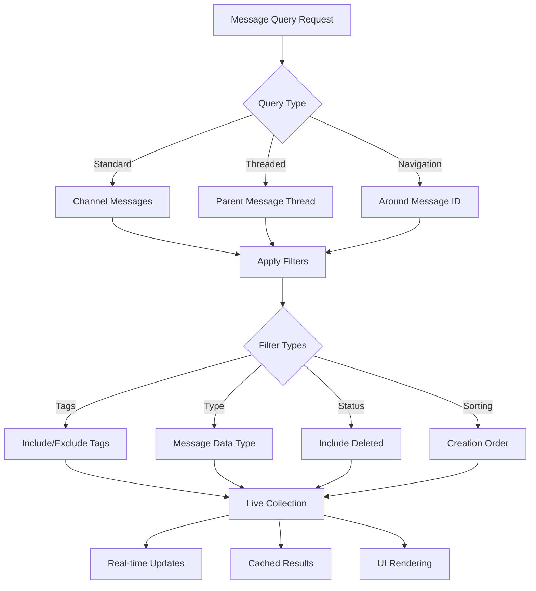

import { Card, Cards, CardGroup } from "/snippets/card-group.mdx";
import { Callout } from "/snippets/callout.mdx";
import { CodeGroup } from "/snippets/code-group.mdx";
import { Tabs, Tab } from "/snippets/tabs.mdx";
import { AccordionGroup, Accordion } from "/snippets/accordion-group.mdx";

# Query and Filter Messages

Master message querying and filtering with Social Plus SDK's powerful search capabilities, thread navigation, and advanced filtering options.

<CardGroup cols={2}>
  <Card
    title="Message Querying"
    icon="magnifying-glass"
    href="#message-querying"
  >
    Retrieve messages with flexible filtering and sorting options
  </Card>
  <Card
    title="Thread Navigation"
    icon="arrow-turn-down-right"
    href="#threaded-messages"
  >
    Query and navigate threaded conversations efficiently
  </Card>
  <Card
    title="Message Navigation"
    icon="location-crosshairs"
    href="#jump-to-message"
  >
    Jump to specific messages within chat history
  </Card>
  <Card
    title="Best Practices"
    icon="shield-check"
    href="#best-practices"
  >
    Optimization techniques and performance guidelines
  </Card>
</CardGroup>

## Architecture Overview



## Message Querying

The message querying system provides powerful search and filtering capabilities through the `getMessages` function, returning a [live collection](../../core-concepts/realtime-communication/live-objects-collections) that automatically updates with new data.

<AccordionGroup>
  <Accordion title="Query Parameters" icon="sliders">
    <CardGroup cols={2}>
      <Card title="subChannelId" icon="hashtag">
        **Required** - Subchannel ID to query messages from
      </Card>
      <Card title="includingTags" icon="tags">
        **Optional** - Filter messages containing specific tags
      </Card>
      <Card title="excludingTags" icon="tag-slash">
        **Optional** - Exclude messages with certain tags
      </Card>
      <Card title="includeDeleted" icon="trash-can">
        **Optional** - Include or exclude deleted messages
      </Card>
      <Card title="type" icon="file-lines">
        **Optional** - Filter by message data type
      </Card>
      <Card title="sorting" icon="arrow-up-down">
        **Optional** - Sort by creation time (first/last)
      </Card>
    </CardGroup>
  </Accordion>
  
  <Accordion title="Message Types" icon="list">
    | Type | Description | Use Case |
    |------|-------------|----------|
    | `TEXT` | Text-based messages | Standard chat messages |
    | `IMAGE` | Image attachments | Photo sharing |
    | `FILE` | Document attachments | File sharing |
    | `AUDIO` | Audio recordings | Voice messages |
    | `VIDEO` | Video attachments | Video sharing |
    | `CUSTOM` | Custom message types | Rich content, polls, etc. |
  </Accordion>
  
  <Accordion title="Sorting Options" icon="sort">
    - **`firstCreated`**: Ascending order (oldest first)
    - **`lastCreated`**: Descending order (newest first)
    
    <Callout type="tip">
      Use `lastCreated` for typical chat interfaces where new messages appear at the bottom.
    </Callout>
  </Accordion>
</AccordionGroup>

### Implementation Examples

<Tabs>
  <Tab title="iOS Swift">
    ```swift
    import AmitySDK
    
    class MessageQueryManager {
        private var messageCollection: AmityCollection<AmityMessage>?
        private var token: AmityNotificationToken?
        
        func queryMessages(
            subChannelId: String,
            includingTags: [String]? = nil,
            excludingTags: [String]? = nil,
            includeDeleted: Bool = false,
            messageType: AmityMessageDataType? = nil,
            sortBy: AmityMessageQuerySortOption = .lastCreated
        ) {
            let repository = AmityMessageRepository(client: AmityUIKitManagerInternal.shared.client)
            
            // Create query builder
            let queryBuilder = AmityMessageQueryBuilder()
                .subChannelId(subChannelId)
                .includeDeleted(includeDeleted)
                .sortBy(sortBy)
            
            // Apply optional filters
            if let tags = includingTags {
                queryBuilder.includingTags(tags)
            }
            
            if let excludeTags = excludingTags {
                queryBuilder.excludingTags(excludeTags)
            }
            
            if let type = messageType {
                queryBuilder.messageTypes([type])
            }
            
            // Execute query
            messageCollection = repository.getMessages(queryBuilder.build())
            
            // Observe changes
            token = messageCollection?.observe { [weak self] collection, change, error in
                guard let self = self else { return }
                
                if let error = error {
                    self.handleError(error)
                    return
                }
                
                switch change {
                case .initial:
                    self.handleInitialLoad(collection.snapshots)
                case .update(let deletions, let insertions, let modifications):
                    self.handleUpdates(
                        deletions: deletions,
                        insertions: insertions,
                        modifications: modifications,
                        messages: collection.snapshots
                    )
                case .error(let error):
                    self.handleError(error)
                }
            }
        }
        
        private func handleInitialLoad(_ messages: [AmityMessage]) {
            // Process initial message load
            DispatchQueue.main.async {
                // Update UI with messages
                self.updateMessageList(messages)
            }
        }
        
        private func handleUpdates(
            deletions: [Int],
            insertions: [Int],
            modifications: [Int],
            messages: [AmityMessage]
        ) {
            DispatchQueue.main.async {
                // Apply incremental updates to UI
                self.applyBatchUpdates(
                    deletions: deletions,
                    insertions: insertions,
                    modifications: modifications,
                    messages: messages
                )
            }
        }
        
        private func handleError(_ error: Error) {
            // Handle query errors
            print("Message query error: \(error.localizedDescription)")
        }
        
        deinit {
            token?.invalidate()
        }
    }
    ```
  </Tab>
  
  <Tab title="Android Kotlin">
    ```kotlin
    import com.amity.socialcloud.sdk.api.chat.AmityMessageRepository
    import com.amity.socialcloud.sdk.model.chat.message.AmityMessage
    import io.reactivex.rxjava3.disposables.CompositeDisposable
    
    class MessageQueryManager {
        private val messageRepository = AmityMessageRepository()
        private val disposables = CompositeDisposable()
        
        fun queryMessages(
            subChannelId: String,
            includingTags: List<String>? = null,
            excludingTags: List<String>? = null,
            includeDeleted: Boolean = false,
            messageTypes: List<String>? = null,
            sortBy: AmityMessageSortOption = AmityMessageSortOption.LAST_CREATED
        ) {
            val queryBuilder = messageRepository.getMessages(subChannelId)
                .includeDeleted(includeDeleted)
                .sortBy(sortBy)
            
            // Apply optional filters
            includingTags?.let { queryBuilder.withTags(it) }
            excludingTags?.let { queryBuilder.excludeTags(it) }
            messageTypes?.let { queryBuilder.types(it) }
            
            val disposable = queryBuilder.build()
                .getPagingData()
                .observeOn(AndroidSchedulers.mainThread())
                .subscribe(
                    { pagingData ->
                        handleMessageUpdate(pagingData)
                    },
                    { error ->
                        handleError(error)
                    }
                )
            
            disposables.add(disposable)
        }
        
        private fun handleMessageUpdate(messages: PagingData<AmityMessage>) {
            // Process message updates
            // Update RecyclerView adapter with new data
        }
        
        private fun handleError(error: Throwable) {
            // Handle query errors
            Log.e("MessageQuery", "Error querying messages", error)
        }
        
        fun dispose() {
            disposables.clear()
        }
    }
    ```
  </Tab>
  
  <Tab title="JavaScript">
    ```javascript
    import { MessageRepository, MessageQueryBuilder } from '@amityco/js-sdk';
    
    class MessageQueryManager {
        constructor() {
            this.liveCollection = null;
            this.unsubscribe = null;
        }
        
        async queryMessages({
            subChannelId,
            includingTags = null,
            excludingTags = null,
            includeDeleted = false,
            messageTypes = null,
            sortBy = 'lastCreated'
        }) {
            try {
                // Build query parameters
                const queryParams = {
                    subChannelId,
                    includeDeleted,
                    sortBy
                };
                
                // Apply optional filters
                if (includingTags) {
                    queryParams.tags = includingTags;
                }
                
                if (excludingTags) {
                    queryParams.excludeTags = excludingTags;
                }
                
                if (messageTypes) {
                    queryParams.dataTypes = messageTypes;
                }
                
                // Create live collection
                this.liveCollection = MessageRepository.queryMessages(queryParams);
                
                // Subscribe to updates
                this.unsubscribe = this.liveCollection.on('dataUpdated', (messages) => {
                    this.handleMessageUpdate(messages);
                });
                
                this.unsubscribe = this.liveCollection.on('dataError', (error) => {
                    this.handleError(error);
                });
                
                // Load initial data
                await this.liveCollection.loadMore();
                
            } catch (error) {
                this.handleError(error);
            }
        }
        
        handleMessageUpdate(messages) {
            // Process message updates
            console.log('Messages updated:', messages.length);
            // Update UI with new messages
        }
        
        handleError(error) {
            console.error('Message query error:', error);
            // Handle error appropriately
        }
        
        async loadMore() {
            if (this.liveCollection && this.liveCollection.hasNextPage()) {
                await this.liveCollection.loadMore();
            }
        }
        
        dispose() {
            if (this.unsubscribe) {
                this.unsubscribe();
            }
        }
    }
    ```
  </Tab>
  
  <Tab title="TypeScript">
    ```typescript
    import { 
        MessageRepository, 
        AmityMessage, 
        LiveCollection,
        MessageQueryBuilder,
        MessageDataType,
        MessageSortOption
    } from '@amityco/ts-sdk';
    
    interface MessageQueryOptions {
        subChannelId: string;
        includingTags?: string[];
        excludingTags?: string[];
        includeDeleted?: boolean;
        messageTypes?: MessageDataType[];
        sortBy?: MessageSortOption;
    }
    
    class MessageQueryManager {
        private liveCollection: LiveCollection<AmityMessage> | null = null;
        private unsubscribe: (() => void) | null = null;
        
        async queryMessages(options: MessageQueryOptions): Promise<void> {
            try {
                const {
                    subChannelId,
                    includingTags,
                    excludingTags,
                    includeDeleted = false,
                    messageTypes,
                    sortBy = MessageSortOption.LAST_CREATED
                } = options;
                
                // Build query
                const queryBuilder = new MessageQueryBuilder()
                    .subChannelId(subChannelId)
                    .includeDeleted(includeDeleted)
                    .sortBy(sortBy);
                
                if (includingTags) {
                    queryBuilder.includingTags(includingTags);
                }
                
                if (excludingTags) {
                    queryBuilder.excludingTags(excludingTags);
                }
                
                if (messageTypes) {
                    queryBuilder.messageTypes(messageTypes);
                }
                
                // Execute query
                this.liveCollection = MessageRepository.queryMessages(queryBuilder.build());
                
                // Subscribe to updates
                this.unsubscribe = this.liveCollection.on('dataUpdated', 
                    (messages: AmityMessage[]) => {
                        this.handleMessageUpdate(messages);
                    }
                );
                
                this.liveCollection.on('dataError', (error: Error) => {
                    this.handleError(error);
                });
                
                // Load initial data
                await this.liveCollection.loadMore();
                
            } catch (error) {
                this.handleError(error as Error);
            }
        }
        
        private handleMessageUpdate(messages: AmityMessage[]): void {
            // Type-safe message processing
            messages.forEach(message => {
                console.log(`Message ${message.messageId}: ${message.data?.text || 'Non-text message'}`);
            });
        }
        
        private handleError(error: Error): void {
            console.error('Message query failed:', error.message);
            // Implement proper error handling
        }
        
        async loadMore(): Promise<void> {
            if (this.liveCollection?.hasNextPage()) {
                await this.liveCollection.loadMore();
            }
        }
        
        dispose(): void {
            this.unsubscribe?.();
            this.liveCollection = null;
        }
    }
    ```
  </Tab>
  
  <Tab title="Flutter Dart">
    ```dart
    import 'package:amity_sdk/amity_sdk.dart';
    
    class MessageQueryManager {
        PagingController<AmityMessage>? _controller;
        StreamSubscription? _subscription;
        
        void queryMessages({
            required String subChannelId,
            List<String>? includingTags,
            List<String>? excludingTags,
            bool includeDeleted = false,
            List<AmityMessageDataType>? messageTypes,
            AmityMessageQuerySortOption sortBy = AmityMessageQuerySortOption.LAST_CREATED,
        }) {
            try {
                // Build query
                final query = AmitySocialClient.newMessageRepository()
                    .getMessages(subChannelId: subChannelId)
                    .includeDeleted(includeDeleted)
                    .sortBy(sortBy);
                
                // Apply optional filters
                if (includingTags != null) {
                    query.withTags(includingTags);
                }
                
                if (excludingTags != null) {
                    query.excludeTags(excludingTags);
                }
                
                if (messageTypes != null) {
                    query.withDataTypes(messageTypes);
                }
                
                // Create paging controller
                _controller = PagingController<AmityMessage>(
                    pageFuture: (token) => query.getPagingData(token: token),
                    pageSize: 20,
                );
                
                // Listen to updates
                _subscription = _controller!.stream.listen(
                    (messages) {
                        _handleMessageUpdate(messages);
                    },
                    onError: (error) {
                        _handleError(error);
                    },
                );
                
                // Load initial data
                _controller!.fetchNextPage();
                
            } catch (error) {
                _handleError(error);
            }
        }
        
        void _handleMessageUpdate(List<AmityMessage> messages) {
            // Process message updates
            print('Received ${messages.length} messages');
            // Update UI state
        }
        
        void _handleError(dynamic error) {
            print('Message query error: $error');
            // Handle error appropriately
        }
        
        void loadMore() {
            _controller?.fetchNextPage();
        }
        
        void dispose() {
            _subscription?.cancel();
            _controller?.dispose();
        }
    }
    ```
  </Tab>
</Tabs>

## Threaded Messages

Navigate and query threaded conversations with parent-child message relationships for organized discussions.

<Callout type="info">
Threaded messages allow users to reply to specific messages, creating organized conversation threads within channels.
</Callout>

<AccordionGroup>
  <Accordion title="Thread Query Parameters" icon="arrow-turn-down-right">
    <CardGroup cols={2}>
      <Card title="parentId" icon="message">
        **Required** - ID of the parent message to fetch replies for
      </Card>
      <Card title="filterByParentId" icon="filter">
        **Required** - Enable parent ID filtering (set to `true`)
      </Card>
      <Card title="subChannelId" icon="hashtag">
        **Required** - Subchannel containing the thread
      </Card>
      <Card title="Additional Filters" icon="sliders">
        **Optional** - Tags, type, deleted status filters
      </Card>
    </CardGroup>
  </Accordion>
</AccordionGroup>

### Thread Implementation Examples

<Tabs>
  <Tab title="iOS Swift">
    ```swift
    import AmitySDK
    
    class ThreadedMessageManager {
        private var threadCollection: AmityCollection<AmityMessage>?
        private var token: AmityNotificationToken?
        
        func queryThreadedMessages(
            parentMessageId: String,
            subChannelId: String,
            includingTags: [String]? = nil
        ) {
            let repository = AmityMessageRepository(client: AmityUIKitManagerInternal.shared.client)
            
            // Create query for threaded messages
            let queryBuilder = AmityMessageQueryBuilder()
                .subChannelId(subChannelId)
                .parentId(parentMessageId)
                .filterByParentId(true)
                .sortBy(.firstCreated) // Show oldest replies first
            
            // Apply optional tag filters
            if let tags = includingTags {
                queryBuilder.includingTags(tags)
            }
            
            threadCollection = repository.getMessages(queryBuilder.build())
            
            // Observe thread updates
            token = threadCollection?.observe { [weak self] collection, change, error in
                self?.handleThreadUpdate(collection.snapshots, change: change, error: error)
            }
        }
        
        private func handleThreadUpdate(
            _ messages: [AmityMessage],
            change: AmityCollectionChange,
            error: Error?
        ) {
            if let error = error {
                print("Thread query error: \(error)")
                return
            }
            
            DispatchQueue.main.async {
                switch change {
                case .initial:
                    self.displayThreadMessages(messages)
                case .update(let deletions, let insertions, let modifications):
                    self.updateThreadUI(
                        deletions: deletions,
                        insertions: insertions,
                        modifications: modifications,
                        messages: messages
                    )
                case .error(let error):
                    self.handleError(error)
                }
            }
        }
    }
    ```
  </Tab>
  
  <Tab title="Android Kotlin">
    ```kotlin
    class ThreadedMessageManager {
        private val messageRepository = AmityMessageRepository()
        private val disposables = CompositeDisposable()
        
        fun queryThreadedMessages(
            parentMessageId: String,
            subChannelId: String,
            includingTags: List<String>? = null
        ) {
            val queryBuilder = messageRepository.getMessages(subChannelId)
                .parentId(parentMessageId)
                .filterByParentId(true)
                .sortBy(AmityMessageSortOption.FIRST_CREATED)
            
            // Apply tag filters if provided
            includingTags?.let { queryBuilder.withTags(it) }
            
            val disposable = queryBuilder.build()
                .getPagingData()
                .observeOn(AndroidSchedulers.mainThread())
                .subscribe(
                    { pagingData ->
                        handleThreadUpdate(pagingData)
                    },
                    { error ->
                        handleThreadError(error)
                    }
                )
            
            disposables.add(disposable)
        }
        
        private fun handleThreadUpdate(messages: PagingData<AmityMessage>) {
            // Update thread UI with replies
            // Typically display in chronological order
        }
        
        private fun handleThreadError(error: Throwable) {
            Log.e("ThreadQuery", "Error loading thread messages", error)
        }
    }
    ```
  </Tab>
  
  <Tab title="JavaScript">
    ```javascript
    class ThreadedMessageManager {
        constructor() {
            this.threadCollection = null;
            this.unsubscribe = null;
        }
        
        async queryThreadedMessages({
            parentMessageId,
            subChannelId,
            includingTags = null
        }) {
            try {
                const queryParams = {
                    subChannelId,
                    parentId: parentMessageId,
                    filterByParentId: true,
                    sortBy: 'firstCreated' // Show oldest replies first
                };
                
                if (includingTags) {
                    queryParams.tags = includingTags;
                }
                
                this.threadCollection = MessageRepository.queryMessages(queryParams);
                
                this.unsubscribe = this.threadCollection.on('dataUpdated', (messages) => {
                    this.handleThreadUpdate(messages);
                });
                
                // Load thread messages
                await this.threadCollection.loadMore();
                
            } catch (error) {
                console.error('Thread query error:', error);
            }
        }
        
        handleThreadUpdate(messages) {
            // Display thread messages in chronological order
            console.log(`Thread has ${messages.length} replies`);
            this.displayThreadMessages(messages);
        }
        
        async loadMoreReplies() {
            if (this.threadCollection?.hasNextPage()) {
                await this.threadCollection.loadMore();
            }
        }
        
        dispose() {
            this.unsubscribe?.();
        }
    }
    ```
  </Tab>
  
  <Tab title="TypeScript">
    ```typescript
    interface ThreadQueryOptions {
        parentMessageId: string;
        subChannelId: string;
        includingTags?: string[];
    }
    
    class ThreadedMessageManager {
        private threadCollection: LiveCollection<AmityMessage> | null = null;
        private unsubscribe: (() => void) | null = null;
        
        async queryThreadedMessages(options: ThreadQueryOptions): Promise<void> {
            const { parentMessageId, subChannelId, includingTags } = options;
            
            try {
                const queryBuilder = new MessageQueryBuilder()
                    .subChannelId(subChannelId)
                    .parentId(parentMessageId)
                    .filterByParentId(true)
                    .sortBy(MessageSortOption.FIRST_CREATED);
                
                if (includingTags) {
                    queryBuilder.includingTags(includingTags);
                }
                
                this.threadCollection = MessageRepository.queryMessages(queryBuilder.build());
                
                this.unsubscribe = this.threadCollection.on('dataUpdated',
                    (messages: AmityMessage[]) => {
                        this.handleThreadUpdate(messages);
                    }
                );
                
                await this.threadCollection.loadMore();
                
            } catch (error) {
                console.error('Thread query failed:', error);
            }
        }
        
        private handleThreadUpdate(messages: AmityMessage[]): void {
            // Process thread messages with type safety
            const threadMessages = messages.filter(msg => msg.parentId === this.parentMessageId);
            this.displayThreadMessages(threadMessages);
        }
    }
    ```
  </Tab>
  
  <Tab title="Flutter Dart">
    ```dart
    class ThreadedMessageManager {
        PagingController<AmityMessage>? _threadController;
        StreamSubscription? _subscription;
        
        void queryThreadedMessages({
            required String parentMessageId,
            required String subChannelId,
            List<String>? includingTags,
        }) {
            try {
                final query = AmitySocialClient.newMessageRepository()
                    .getMessages(subChannelId: subChannelId)
                    .parentId(parentMessageId)
                    .filterByParentId(true)
                    .sortBy(AmityMessageQuerySortOption.FIRST_CREATED);
                
                if (includingTags != null) {
                    query.withTags(includingTags);
                }
                
                _threadController = PagingController<AmityMessage>(
                    pageFuture: (token) => query.getPagingData(token: token),
                    pageSize: 20,
                );
                
                _subscription = _threadController!.stream.listen(
                    (messages) => _handleThreadUpdate(messages),
                    onError: (error) => _handleThreadError(error),
                );
                
                _threadController!.fetchNextPage();
                
            } catch (error) {
                _handleThreadError(error);
            }
        }
        
        void _handleThreadUpdate(List<AmityMessage> messages) {
            print('Thread loaded with ${messages.length} replies');
            // Display thread messages in UI
        }
        
        void _handleThreadError(dynamic error) {
            print('Thread query error: $error');
        }
        
        void loadMoreReplies() {
            _threadController?.fetchNextPage();
        }
    }
    ```
  </Tab>
</Tabs>

## Jump to Message

Navigate directly to specific messages within chat history using the `aroundMessageId` parameter for contextual message viewing.

<Callout type="warning">
This feature is available from **version 6.18.0** onwards and requires proper error handling for invalid or deleted message IDs.
</Callout>

<AccordionGroup>
  <Accordion title="Message Navigation Strategy" icon="route">
    1. **Query with aroundMessageId** - Retrieve target message with context
    2. **Validate Response** - Check for business errors (invalid/deleted messages)
    3. **Data Source Swap** - Replace current collection if successful
    4. **Locate and Scroll** - Find target message index and navigate
    5. **Fallback Handling** - Query latest messages if navigation fails
  </Accordion>
  
  <Accordion title="Use Cases" icon="compass">
    <CardGroup cols={2}>
      <Card title="Reply Navigation" icon="reply">
        Jump to original message from notification
      </Card>
      <Card title="Search Results" icon="magnifying-glass">
        Navigate to search result messages
      </Card>
      <Card title="Deep Links" icon="link">
        Direct links to specific messages
      </Card>
      <Card title="History Navigation" icon="clock-rotate-left">
        Return to previously viewed messages
      </Card>
    </CardGroup>
  </Accordion>
</AccordionGroup>

### Message Navigation Implementation

<Tabs>
  <Tab title="iOS Swift">
    ```swift
    class MessageNavigationManager {
        private var currentCollection: AmityCollection<AmityMessage>?
        private var cachedMessageId: String?
        
        func jumpToMessage(
            messageId: String,
            subChannelId: String,
            contextRange: Int = 20
        ) {
            // Cache current position for potential return navigation
            self.cachedMessageId = getCurrentVisibleMessageId()
            
            let repository = AmityMessageRepository(client: AmityUIKitManagerInternal.shared.client)
            
            let queryBuilder = AmityMessageQueryBuilder()
                .subChannelId(subChannelId)
                .aroundMessageId(messageId)
                .sortBy(.lastCreated)
            
            let navigationCollection = repository.getMessages(queryBuilder.build())
            
            navigationCollection.observe { [weak self] collection, change, error in
                guard let self = self else { return }
                
                if let error = error {
                    self.handleNavigationError(error, fallbackSubChannelId: subChannelId)
                    return
                }
                
                switch change {
                case .initial:
                    self.handleSuccessfulNavigation(
                        messages: collection.snapshots,
                        targetMessageId: messageId,
                        newCollection: navigationCollection
                    )
                case .error(let error):
                    self.handleNavigationError(error, fallbackSubChannelId: subChannelId)
                default:
                    break
                }
            }
        }
        
        private func handleSuccessfulNavigation(
            messages: [AmityMessage],
            targetMessageId: String,
            newCollection: AmityCollection<AmityMessage>
        ) {
            // Find target message index
            guard let targetIndex = messages.firstIndex(where: { $0.messageId == targetMessageId }) else {
                print("Target message not found in collection")
                return
            }
            
            DispatchQueue.main.async {
                // Swap data source
                self.currentCollection = newCollection
                
                // Update UI and scroll to target
                self.updateMessageList(messages)
                self.scrollToMessage(at: targetIndex, animated: true)
                
                // Show return navigation if cached position exists
                if self.cachedMessageId != nil {
                    self.showReturnNavigationButton()
                }
            }
        }
        
        private func handleNavigationError(_ error: Error, fallbackSubChannelId: String) {
            print("Navigation failed: \(error)")
            
            // Fallback to latest messages if no current source
            if currentCollection == nil {
                queryLatestMessages(subChannelId: fallbackSubChannelId)
            }
        }
        
        func returnToPreviousPosition() {
            guard let cachedId = cachedMessageId else { return }
            
            jumpToMessage(
                messageId: cachedId,
                subChannelId: getCurrentSubChannelId()
            )
            
            cachedMessageId = nil
            hideReturnNavigationButton()
        }
    }
    ```
  </Tab>
  
  <Tab title="Android Kotlin">
    ```kotlin
    class MessageNavigationManager {
        private var currentCollection: LiveData<PagingData<AmityMessage>>? = null
        private var cachedMessageId: String? = null
        private val messageRepository = AmityMessageRepository()
        
        fun jumpToMessage(
            messageId: String,
            subChannelId: String,
            contextRange: Int = 20
        ) {
            // Cache current position
            cachedMessageId = getCurrentVisibleMessageId()
            
            val navigationQuery = messageRepository.getMessages(subChannelId)
                .aroundMessageId(messageId)
                .sortBy(AmityMessageSortOption.LAST_CREATED)
                .build()
            
            navigationQuery.getPagingData()
                .observeOn(AndroidSchedulers.mainThread())
                .subscribe(
                    { pagingData ->
                        handleSuccessfulNavigation(pagingData, messageId)
                    },
                    { error ->
                        handleNavigationError(error, subChannelId)
                    }
                )
        }
        
        private fun handleSuccessfulNavigation(
            pagingData: PagingData<AmityMessage>,
            targetMessageId: String
        ) {
            // Update data source
            currentCollection = MutableLiveData(pagingData)
            
            // Find and scroll to target message
            findAndScrollToMessage(targetMessageId)
            
            // Show return navigation if available
            if (cachedMessageId != null) {
                showReturnNavigationButton()
            }
        }
        
        private fun handleNavigationError(error: Throwable, subChannelId: String) {
            Log.e("MessageNavigation", "Failed to navigate to message", error)
            
            // Fallback to latest messages
            if (currentCollection == null) {
                queryLatestMessages(subChannelId)
            }
        }
        
        fun returnToPreviousPosition() {
            cachedMessageId?.let { messageId ->
                jumpToMessage(messageId, getCurrentSubChannelId())
                cachedMessageId = null
                hideReturnNavigationButton()
            }
        }
    }
    ```
  </Tab>
  
  <Tab title="JavaScript">
    ```javascript
    class MessageNavigationManager {
        constructor() {
            this.currentCollection = null;
            this.cachedMessageId = null;
            this.unsubscribe = null;
        }
        
        async jumpToMessage(messageId, subChannelId, contextRange = 20) {
            try {
                // Cache current position for return navigation
                this.cachedMessageId = this.getCurrentVisibleMessageId();
                
                const queryParams = {
                    subChannelId,
                    aroundMessageId: messageId,
                    sortBy: 'lastCreated'
                };
                
                const navigationCollection = MessageRepository.queryMessages(queryParams);
                
                this.unsubscribe = navigationCollection.on('dataUpdated', (messages) => {
                    this.handleSuccessfulNavigation(messages, messageId, navigationCollection);
                });
                
                navigationCollection.on('dataError', (error) => {
                    this.handleNavigationError(error, subChannelId);
                });
                
                await navigationCollection.loadMore();
                
            } catch (error) {
                this.handleNavigationError(error, subChannelId);
            }
        }
        
        handleSuccessfulNavigation(messages, targetMessageId, newCollection) {
            // Find target message
            const targetIndex = messages.findIndex(msg => msg.messageId === targetMessageId);
            
            if (targetIndex === -1) {
                console.warn('Target message not found in collection');
                return;
            }
            
            // Swap data source
            this.currentCollection = newCollection;
            
            // Update UI and scroll to target
            this.updateMessageList(messages);
            this.scrollToMessage(targetIndex);
            
            // Show return navigation button
            if (this.cachedMessageId) {
                this.showReturnNavigationButton();
            }
        }
        
        handleNavigationError(error, subChannelId) {
            console.error('Message navigation failed:', error);
            
            // Fallback to latest messages if no current source
            if (!this.currentCollection) {
                this.queryLatestMessages(subChannelId);
            }
        }
        
        async returnToPreviousPosition() {
            if (!this.cachedMessageId) return;
            
            const cachedId = this.cachedMessageId;
            this.cachedMessageId = null;
            
            await this.jumpToMessage(cachedId, this.getCurrentSubChannelId());
            this.hideReturnNavigationButton();
        }
    }
    ```
  </Tab>
  
  <Tab title="TypeScript">
    ```typescript
    interface NavigationOptions {
        messageId: string;
        subChannelId: string;
        contextRange?: number;
    }
    
    class MessageNavigationManager {
        private currentCollection: LiveCollection<AmityMessage> | null = null;
        private cachedMessageId: string | null = null;
        private unsubscribe: (() => void) | null = null;
        
        async jumpToMessage(options: NavigationOptions): Promise<void> {
            const { messageId, subChannelId, contextRange = 20 } = options;
            
            try {
                // Cache current visible message for return navigation
                this.cachedMessageId = this.getCurrentVisibleMessageId();
                
                const queryBuilder = new MessageQueryBuilder()
                    .subChannelId(subChannelId)
                    .aroundMessageId(messageId)
                    .sortBy(MessageSortOption.LAST_CREATED);
                
                const navigationCollection = MessageRepository.queryMessages(queryBuilder.build());
                
                this.unsubscribe = navigationCollection.on('dataUpdated',
                    (messages: AmityMessage[]) => {
                        this.handleSuccessfulNavigation(messages, messageId, navigationCollection);
                    }
                );
                
                navigationCollection.on('dataError', (error: Error) => {
                    this.handleNavigationError(error, subChannelId);
                });
                
                await navigationCollection.loadMore();
                
            } catch (error) {
                this.handleNavigationError(error as Error, subChannelId);
            }
        }
        
        private handleSuccessfulNavigation(
            messages: AmityMessage[],
            targetMessageId: string,
            newCollection: LiveCollection<AmityMessage>
        ): void {
            const targetIndex = messages.findIndex(msg => msg.messageId === targetMessageId);
            
            if (targetIndex === -1) {
                console.warn(`Target message ${targetMessageId} not found`);
                return;
            }
            
            // Update collection reference
            this.currentCollection = newCollection;
            
            // Update UI with new message context
            this.updateMessageList(messages);
            this.scrollToMessage(targetIndex, true);
            
            // Show return navigation if we have a cached position
            if (this.cachedMessageId) {
                this.showReturnNavigationButton();
            }
        }
        
        private handleNavigationError(error: Error, subChannelId: string): void {
            console.error('Navigation error:', error.message);
            
            // Fallback strategy for failed navigation
            if (!this.currentCollection) {
                this.queryLatestMessages(subChannelId);
            }
        }
        
        async returnToPreviousPosition(): Promise<void> {
            if (!this.cachedMessageId) return;
            
            const previousMessageId = this.cachedMessageId;
            this.cachedMessageId = null;
            
            await this.jumpToMessage({
                messageId: previousMessageId,
                subChannelId: this.getCurrentSubChannelId()
            });
            
            this.hideReturnNavigationButton();
        }
    }
    ```
  </Tab>
  
  <Tab title="Flutter Dart">
    ```dart
    class MessageNavigationManager {
        PagingController<AmityMessage>? _currentController;
        String? _cachedMessageId;
        StreamSubscription? _subscription;
        
        void jumpToMessage({
            required String messageId,
            required String subChannelId,
            int contextRange = 20,
        }) {
            try {
                // Cache current position for return navigation
                _cachedMessageId = _getCurrentVisibleMessageId();
                
                final query = AmitySocialClient.newMessageRepository()
                    .getMessages(subChannelId: subChannelId)
                    .aroundMessageId(messageId)
                    .sortBy(AmityMessageQuerySortOption.LAST_CREATED);
                
                final navigationController = PagingController<AmityMessage>(
                    pageFuture: (token) => query.getPagingData(token: token),
                    pageSize: 20,
                );
                
                _subscription = navigationController.stream.listen(
                    (messages) => _handleSuccessfulNavigation(messages, messageId, navigationController),
                    onError: (error) => _handleNavigationError(error, subChannelId),
                );
                
                navigationController.fetchNextPage();
                
            } catch (error) {
                _handleNavigationError(error, subChannelId);
            }
        }
        
        void _handleSuccessfulNavigation(
            List<AmityMessage> messages,
            String targetMessageId,
            PagingController<AmityMessage> navigationController,
        ) {
            // Find target message index
            final targetIndex = messages.indexWhere((msg) => msg.messageId == targetMessageId);
            
            if (targetIndex == -1) {
                print('Target message not found in collection');
                return;
            }
            
            // Update data source
            _currentController = navigationController;
            
            // Update UI and scroll to target
            _updateMessageList(messages);
            _scrollToMessage(targetIndex);
            
            // Show return navigation if available
            if (_cachedMessageId != null) {
                _showReturnNavigationButton();
            }
        }
        
        void _handleNavigationError(dynamic error, String subChannelId) {
            print('Message navigation error: $error');
            
            // Fallback to latest messages
            if (_currentController == null) {
                _queryLatestMessages(subChannelId);
            }
        }
        
        void returnToPreviousPosition() {
            if (_cachedMessageId == null) return;
            
            final cachedId = _cachedMessageId!;
            _cachedMessageId = null;
            
            jumpToMessage(
                messageId: cachedId,
                subChannelId: _getCurrentSubChannelId(),
            );
            
            _hideReturnNavigationButton();
        }
    }
    ```
  </Tab>
</Tabs>

## Best Practices

<AccordionGroup>
  <Accordion title="Performance Optimization" icon="gauge-high">
    - **Limit Page Size**: Use reasonable page sizes (20-50 messages) to balance performance and user experience
    - **Efficient Filtering**: Apply filters at query level rather than post-processing
    - **Cache Management**: Implement proper caching strategies for frequently accessed threads
    - **Memory Management**: Dispose of live collections when no longer needed
    
    ```javascript
    // Good: Efficient querying with filters
    const messages = MessageRepository.queryMessages({
        subChannelId: 'channel1',
        messageTypes: ['TEXT', 'IMAGE'],
        sortBy: 'lastCreated',
        pageSize: 25
    });
    
    // Avoid: Post-processing large datasets
    // const allMessages = MessageRepository.queryMessages({...});
    // const filteredMessages = allMessages.filter(msg => msg.type === 'TEXT');
    ```
  </Accordion>
  
  <Accordion title="Error Handling" icon="triangle-exclamation">
    - **Graceful Degradation**: Provide fallback UI when queries fail
    - **Retry Logic**: Implement exponential backoff for network failures
    - **User Feedback**: Show appropriate loading states and error messages
    - **Validation**: Validate message IDs before navigation attempts
    
    ```typescript
    async function handleMessageQuery(options: QueryOptions) {
        try {
            await queryMessages(options);
        } catch (error) {
            if (error.code === 'NETWORK_ERROR') {
                // Retry with exponential backoff
                await retryWithBackoff(() => queryMessages(options));
            } else {
                // Show user-friendly error message
                showErrorMessage('Failed to load messages');
            }
        }
    }
    ```
  </Accordion>
  
  <Accordion title="UI/UX Considerations" icon="desktop">
    - **Loading States**: Show skeleton screens while loading messages
    - **Infinite Scrolling**: Implement smooth pagination for large conversations
    - **Thread Indicators**: Clearly mark threaded messages in the UI
    - **Navigation Feedback**: Provide visual feedback during message jumps
    
    ```javascript
    // Example loading state management
    const [isLoading, setIsLoading] = useState(false);
    const [messages, setMessages] = useState([]);
    
    const loadMessages = async () => {
        setIsLoading(true);
        try {
            const result = await messageCollection.loadMore();
            setMessages(prev => [...prev, ...result]);
        } finally {
            setIsLoading(false);
        }
    };
    ```
  </Accordion>
  
  <Accordion title="Thread Management" icon="comments">
    - **Context Preservation**: Maintain parent message context in thread views
    - **Deep Linking**: Support direct links to threaded conversations
    - **Breadcrumb Navigation**: Show thread hierarchy for complex discussions
    - **Reply Indicators**: Display reply counts on parent messages
    
    ```swift
    // Example thread context management
    struct ThreadView {
        let parentMessage: AmityMessage
        let threadMessages: [AmityMessage]
        
        var body: some View {
            VStack {
                ParentMessageView(message: parentMessage)
                    .background(Color.gray.opacity(0.1))
                
                LazyVStack {
                    ForEach(threadMessages) { message in
                        ThreadMessageView(message: message)
                    }
                }
            }
        }
    }
    ```
  </Accordion>
</AccordionGroup>

## Advanced Features

<CardGroup cols={2}>
  <Card
    title="Real-time Filtering"
    icon="filter"
    href="#real-time-filtering"
  >
    Dynamic filter updates with live collections
  </Card>
  <Card
    title="Message Search"
    icon="magnifying-glass"
    href="#message-search"
  >
    Full-text search within message content
  </Card>
  <Card
    title="Bulk Operations"
    icon="list-check"
    href="#bulk-operations"
  >
    Efficient operations on message collections
  </Card>
  <Card
    title="Analytics Integration"
    icon="chart-line"
    href="#analytics-integration"
  >
    Track query performance and usage patterns
  </Card>
</CardGroup>

### Real-time Filtering

```typescript
class DynamicMessageFilter {
    private liveCollection: LiveCollection<AmityMessage> | null = null;
    private currentFilters: MessageFilters = {};
    
    updateFilters(newFilters: Partial<MessageFilters>) {
        this.currentFilters = { ...this.currentFilters, ...newFilters };
        this.applyFilters();
    }
    
    private applyFilters() {
        // Re-query with updated filters
        const queryBuilder = new MessageQueryBuilder()
            .subChannelId(this.currentFilters.subChannelId)
            .includingTags(this.currentFilters.includingTags)
            .excludingTags(this.currentFilters.excludingTags)
            .messageTypes(this.currentFilters.messageTypes);
        
        this.liveCollection = MessageRepository.queryMessages(queryBuilder.build());
    }
}
```

## Error Handling Guide

<AccordionGroup>
  <Accordion title="Common Error Scenarios" icon="bug">
    | Error Type | Cause | Solution |
    |------------|-------|----------|
    | `INVALID_SUBCHANNEL` | Non-existent subchannel ID | Validate subchannel exists |
    | `PERMISSION_DENIED` | Insufficient access rights | Check user permissions |
    | `MESSAGE_NOT_FOUND` | Invalid message ID for navigation | Fallback to latest messages |
    | `NETWORK_ERROR` | Connection issues | Implement retry logic |
    | `RATE_LIMIT_EXCEEDED` | Too many requests | Implement request throttling |
  </Accordion>
  
  <Accordion title="Recovery Strategies" icon="arrow-rotate-right">
    ```typescript
    class MessageQueryErrorHandler {
        async handleQueryError(error: Error, context: QueryContext) {
            switch (error.code) {
                case 'INVALID_SUBCHANNEL':
                    return this.fallbackToDefaultChannel();
                    
                case 'MESSAGE_NOT_FOUND':
                    return this.queryLatestMessages(context.subChannelId);
                    
                case 'NETWORK_ERROR':
                    return this.retryWithExponentialBackoff(context);
                    
                case 'PERMISSION_DENIED':
                    return this.showPermissionError();
                    
                default:
                    return this.showGenericError();
            }
        }
    }
    ```
  </Accordion>
</AccordionGroup>

## Related Documentation

<CardGroup cols={2}>
  <Card
    title="Live Collections"
    icon="database"
    href="../../core-concepts/realtime-communication/live-objects-collections"
  >
    Understanding real-time data synchronization
  </Card>
  <Card
    title="Message Types"
    icon="message"
    href="../message-types/overview"
  >
    Comprehensive guide to message formats
  </Card>
  <Card
    title="Real-time Events"
    icon="bolt"
    href="../../core-concepts/realtime-communication/realtime-events"
  >
    Event-driven message updates
  </Card>
  <Card
    title="Error Handling"
    icon="shield-exclamation"
    href="../../core-concepts/foundation/error-handling"
  >
    Comprehensive error handling strategies
  </Card>
</CardGroup>