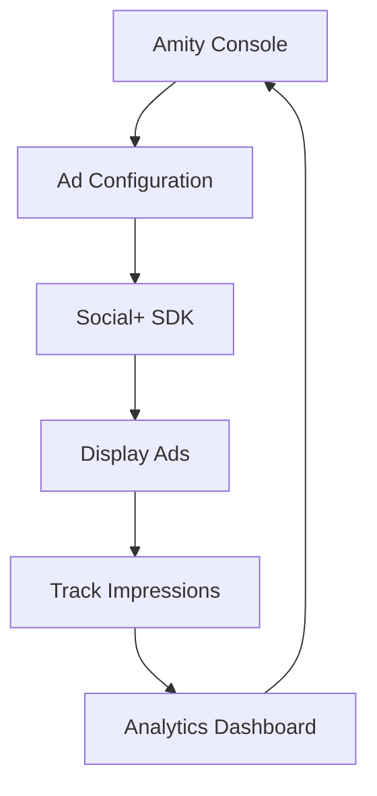

# Advertising & Monetization

Monetize your Social+ application with intelligent ad integration that maximizes revenue while preserving user experience. Configure, track, and optimize ads through the console without requiring app updates.

<Info>
**Console-Driven**: All ad configuration happens in the Amity Social Cloud Console. Update placement, frequency, and targeting in real-time without app releases.
</Info>

## Quick Start

Get ads running in your app in 3 simple steps:

```typescript
// 1. Fetch ad configuration
const ads = await adRepository.getNetworkAds();

// 2. Display active ads
const activeAds = ads.filter(ad => ad.isActive);

// 3. Track impressions
await adRepository.markAsSeen(adId);
```

## Core Capabilities

The Social+ SDK provides comprehensive advertising features:

### Dynamic Ad Management

- **Real-time Configuration** - Update ad settings instantly through the console
- **Smart Placement** - Strategic positioning for maximum engagement
- **Frequency Control** - Optimize ad delivery without overwhelming users
- **Cross-platform Sync** - Consistent experience across all platforms

### Performance Analytics

- **Impression Tracking** - Monitor ad views and unique reach
- **Click Analytics** - Measure engagement and conversion rates  
- **Revenue Insights** - Track monetization performance
- **Real-time Reporting** - Access live performance data

### Developer Experience

- **Console-First** - No code changes needed for ad updates
- **Lightweight SDK** - Minimal impact on app performance
- **Simple Integration** - Clean API with comprehensive examples
- **Platform Support** - iOS, Android, React Native, TypeScript, and more

## Architecture



## Implementation Workflow

1. **Configure** ads in your Amity Console with placement and frequency settings
2. **Fetch** ad configuration using `getNetworkAds()` 
3. **Display** ads based on console settings and placement rules
4. **Track** impressions and clicks for analytics and optimization
5. **Optimize** performance using console analytics and reporting

## Platform Support

| Platform | Status | Documentation |
|----------|--------|---------------|
| TypeScript | ✅ Full Support | [View Examples](./get-ads-and-settings#typescript) |
| iOS | ✅ Full Support | [View Examples](./get-ads-and-settings#ios) |
| Android | ✅ Full Support | [View Examples](./get-ads-and-settings#android) |
| React Native | ✅ Full Support | [View Examples](./get-ads-and-settings#react-native) |

## Next Steps

<CardGroup cols={2}>
  <Card title="Get Ads & Settings" icon="gear" href="./get-ads-and-settings">
    Retrieve and configure ad settings from your console
  </Card>
  <Card title="Track Impressions" icon="chart-line" href="./ad-impressions">
    Implement analytics for performance monitoring
  </Card>
</CardGroup>

## Best Practices

<Tip>
**Start Conservative**: Begin with lower ad frequency and gradually increase based on user engagement metrics and retention data.
</Tip>

- **User Experience First** - Balance monetization with user satisfaction
- **Test Placements** - A/B test different ad positions for optimal performance
- **Monitor Metrics** - Track both revenue and user engagement closely
- **Respect Limits** - Don't overwhelm users with excessive ad frequency
