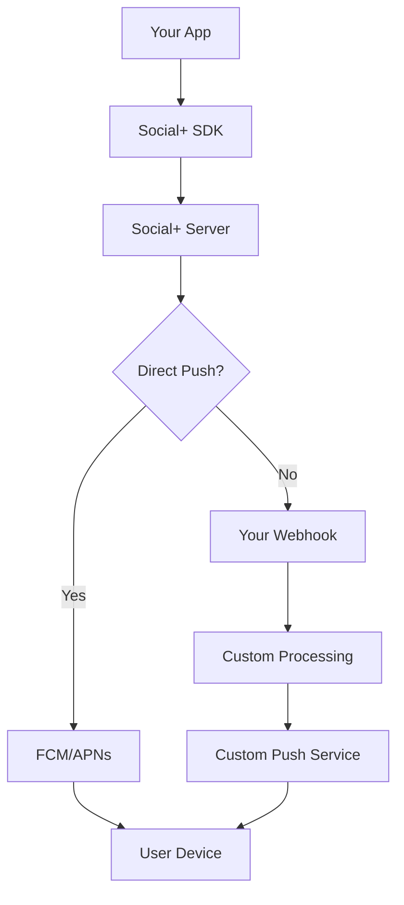

# Push Notifications

Keep users engaged with intelligent push notifications that deliver timely updates about messages, mentions, channel activities, and community events. Support both direct delivery and webhook customization for maximum flexibility.

## Overview

Social+ provides comprehensive push notification capabilities that work across iOS, Android, React Native, Flutter, and web platforms. Choose between direct delivery for immediate implementation or webhook integration for custom notification processing.

### Core Capabilities

- **Real-time Messaging** - Instant notifications for new messages and mentions
- **Community Updates** - Channel joins, member additions, and activity alerts
- **Cross-platform Support** - Consistent experience across all platforms
- **Flexible Delivery** - Direct push or webhook customization
- **Smart Targeting** - User preferences and channel-specific settings
- **Rich Content** - Images, reactions, and contextual information

## Delivery Methods

<Tabs>
  <Tab title="Direct Push">
    **Instant Delivery** - Notifications sent directly from Social+ servers to user devices.
    
    - ✅ Zero configuration required
    - ✅ Automatic message formatting
    - ✅ Platform-optimized delivery
    - ✅ Built-in rate limiting
    
    ```typescript
    // Enable direct push notifications
    await client.enablePushNotifications(deviceToken);
    ```
  </Tab>
  <Tab title="Webhook Integration">
    **Custom Processing** - Events sent to your server for customization before delivery.
    
    - ✅ Full message customization
    - ✅ Translation and localization
    - ✅ Advanced filtering and targeting
    - ✅ Analytics and tracking
    - ✅ Web app support
    
    ```typescript
    // Configure webhook endpoint
    webhook: {
      url: "https://your-server.com/notifications",
      events: ["message.created", "channel.joined"]
    }
    ```
  </Tab>
</Tabs>

## Quick Start by Platform

<CardGroup cols={2}>
  <Card title="iOS Setup" icon="apple" href="./setup/ios-setup">
    Configure APNs certificates and integrate with your iOS app
  </Card>
  <Card title="Android Setup" icon="android" href="./setup/android-setup">
    Set up FCM or Baidu push services for Android devices
  </Card>
  <Card title="React Native" icon="react" href="./setup/react-native-setup">
    Cross-platform notifications for React Native apps
  </Card>
  <Card title="Device Registration" icon="mobile" href="./device-registration">
    Register and manage push notification tokens
  </Card>
</CardGroup>

## Notification Types & Examples

### Message Notifications

| Event | Title Format | Body Format |
|-------|-------------|-------------|
| New Message | `{sender} ({channel})` | Message content or "Image Message" |
| Direct Message | `{sender}` | Message content or media type |
| Mention | `{sender} mentioned you` | Message content with highlight |

### Channel Notifications

| Event | Title Format | Body Format |
|-------|-------------|-------------|
| Channel Created | `{channel_name}` | "You're now a member of {channel}!" |
| User Joined | `{user_name}` | "{user} has joined {channel}" |
| Channel Updated | `{channel_name}` | "Channel information updated" |

### Community Notifications

| Event | Title Format | Body Format |
|-------|-------------|-------------|
| Community Joined | `{community_name}` | "Welcome to {community}!" |
| New Post | `{author} in {community}` | Post content preview |
| Comment Added | `{commenter}` | "Commented on your post" |

## Notification Settings

Users can control their notification preferences at multiple levels:

```typescript
// User-level settings
await notificationSettings.updateUserSettings({
  messages: true,
  mentions: true,
  channelActivities: false
});

// Channel-specific settings  
await notificationSettings.updateChannelSettings(channelId, {
  messages: true,
  memberJoined: false
});
```

<CardGroup cols={3}>
  <Card title="User Settings" href="./settings/user-settings">
    Global notification preferences
  </Card>
  <Card title="Channel Settings" href="./settings/channel-settings">
    Per-channel notification control
  </Card>
  <Card title="Community Settings" href="./settings/community-settings">
    Community-wide notification rules
  </Card>
</CardGroup>

## Architecture Overview



## Best Practices

<Tip>
**User Experience**: Always provide users with granular notification controls and respect their preferences to maintain engagement without being intrusive.
</Tip>

- **Permission Timing** - Request notification permissions at the right moment in user flow
- **Relevance First** - Only send notifications that provide clear value to users
- **Respect Preferences** - Honor user settings and provide easy opt-out options
- **Platform Guidelines** - Follow iOS and Android notification best practices
- **Testing Strategy** - Test across different devices and notification states

## Platform Support

| Platform | Direct Push | Webhook | Rich Media | Deep Links |
|----------|-------------|---------|------------|------------|
| iOS | ✅ APNs | ✅ | ✅ | ✅ |
| Android | ✅ FCM/Baidu | ✅ | ✅ | ✅ |
| React Native | ✅ | ✅ | ✅ | ✅ |
| Flutter | ✅ | ✅ | ✅ | ✅ |
| Web | ❌ | ✅ | ✅ | ✅ |

## Next Steps

1. **Choose Your Method** - Direct push for quick setup, webhook for customization
2. **Platform Setup** - Configure certificates and dependencies for your platforms
3. **Test Integration** - Verify notifications work across different scenarios
4. **User Settings** - Implement notification preference controls
5. **Monitor & Optimize** - Track delivery rates and user engagement

<Warning>
**Production Setup**: Ensure you have proper certificates, tokens, and webhook endpoints configured before deploying to production environments.
</Warning>