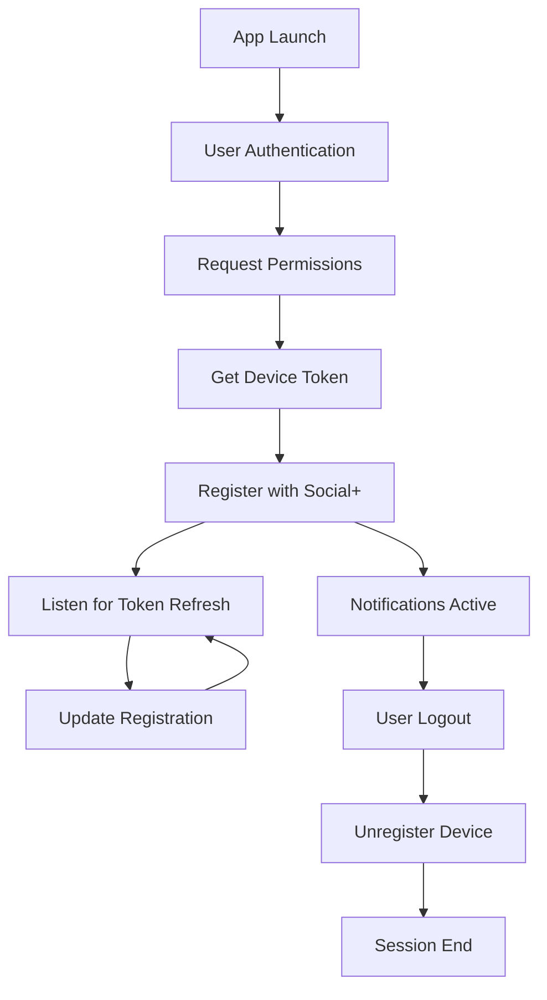

# Device Registration

Register devices for push notifications to enable real-time message delivery. This guide covers token registration, management, and best practices for maintaining notification connectivity.

<Info>
**Prerequisites**: Device registration requires an authenticated `AmityClient` instance and a valid push notification token from your platform's notification service.
</Info>

## Overview

Device registration connects user accounts with specific devices to enable targeted push notification delivery. The Social+ SDK handles token management and routing but relies on your app to:

- Request notification permissions from users
- Obtain platform-specific tokens (FCM, APNs, etc.)
- Handle token refresh events
- Manage registration lifecycle

## Token Registration

### Basic Registration

<Tabs>
  <Tab title="TypeScript">
    ```typescript
    import { AmityClient } from '@amityco/ts-sdk';
    
    const registerDevice = async (deviceToken: string) => {
      try {
        await client.registerDeviceForPushNotification(deviceToken);
        console.log('Device registered successfully');
      } catch (error) {
        console.error('Registration failed:', error);
      }
    };
    ```
  </Tab>
  <Tab title="iOS">
    ```swift
    // Register device with APNs token
    client.registerDeviceForPushNotification(withDeviceToken: deviceToken) { [weak self] success, error in
        if success {
            print("Device registered successfully")
        } else if let error = error {
            print("Registration failed: \\(error.localizedDescription)")
        }
    }
    ```
  </Tab>
  <Tab title="Android">
    ```kotlin
    // Register device with FCM token
    client.registerDeviceForPushNotification(deviceToken, object: AmityCallback<Unit> {
        override fun onSuccess(result: Unit) {
            Log.d(TAG, "Device registered successfully")
        }
        
        override fun onError(error: AmityException) {
            Log.e(TAG, "Registration failed: ${error.message}")
        }
    })
    ```
  </Tab>
  <Tab title="React Native">
    ```typescript
    import { AmityClient } from '@amityco/react-native-sdk';
    
    const registerDevice = async (token: string) => {
      try {
        await AmityClient.registerDeviceForPushNotification(token);
        console.log('Device registered successfully');
      } catch (error) {
        console.error('Registration failed:', error);
      }
    };
    ```
  </Tab>
</Tabs>

### Registration with Error Handling

<Tabs>
  <Tab title="TypeScript">
    ```typescript
    class DeviceRegistrationManager {
      private maxRetries = 3;
      private retryDelay = 1000;
      
      async registerWithRetry(deviceToken: string): Promise<boolean> {
        for (let attempt = 1; attempt <= this.maxRetries; attempt++) {
          try {
            await client.registerDeviceForPushNotification(deviceToken);
            console.log(`Device registered on attempt ${attempt}`);
            return true;
          } catch (error) {
            console.warn(`Registration attempt ${attempt} failed:`, error);
            
            if (attempt < this.maxRetries) {
              await this.delay(this.retryDelay * attempt);
            }
          }
        }
        
        console.error('Device registration failed after all attempts');
        return false;
      }
      
      private delay(ms: number): Promise<void> {
        return new Promise(resolve => setTimeout(resolve, ms));
      }
    }
    ```
  </Tab>
  <Tab title="iOS">
    ```swift
    class DeviceRegistrationManager {
        private let maxRetries = 3
        private let retryDelay: TimeInterval = 1.0
        
        func registerWithRetry(deviceToken: String, completion: @escaping (Bool) -> Void) {
            performRegistration(deviceToken: deviceToken, attempt: 1, completion: completion)
        }
        
        private func performRegistration(deviceToken: String, attempt: Int, completion: @escaping (Bool) -> Void) {
            client.registerDeviceForPushNotification(withDeviceToken: deviceToken) { [weak self] success, error in
                if success {
                    print("Device registered on attempt \\(attempt)")
                    completion(true)
                } else if attempt < self?.maxRetries ?? 0 {
                    DispatchQueue.main.asyncAfter(deadline: .now() + self?.retryDelay ?? 1.0) {
                        self?.performRegistration(deviceToken: deviceToken, attempt: attempt + 1, completion: completion)
                    }
                } else {
                    print("Device registration failed after all attempts")
                    completion(false)
                }
            }
        }
    }
    ```
  </Tab>
</Tabs>

## Token Refresh Handling

Push notification tokens can change during the app lifecycle. Handle token updates to maintain notification delivery:

<Tabs>
  <Tab title="TypeScript">
    ```typescript
    class TokenManager {
      private currentToken: string | null = null;
      
      async handleTokenRefresh(newToken: string) {
        if (this.currentToken !== newToken) {
          console.log('Token refreshed, updating registration');
          
          try {
            await client.registerDeviceForPushNotification(newToken);
            this.currentToken = newToken;
            
            // Store token locally for persistence
            localStorage.setItem('pushToken', newToken);
          } catch (error) {
            console.error('Failed to update token registration:', error);
          }
        }
      }
      
      async initializeFromStorage() {
        const storedToken = localStorage.getItem('pushToken');
        if (storedToken) {
          await this.handleTokenRefresh(storedToken);
        }
      }
    }
    ```
  </Tab>
  <Tab title="iOS">
    ```swift
    class TokenManager {
        private var currentToken: String?
        
        func handleTokenRefresh(_ newToken: String) {
            guard currentToken != newToken else { return }
            
            print("Token refreshed, updating registration")
            
            client.registerDeviceForPushNotification(withDeviceToken: newToken) { [weak self] success, error in
                if success {
                    self?.currentToken = newToken
                    UserDefaults.standard.set(newToken, forKey: "pushToken")
                } else {
                    print("Failed to update token registration: \\(error?.localizedDescription ?? "Unknown error")")
                }
            }
        }
        
        func initializeFromStorage() {
            if let storedToken = UserDefaults.standard.string(forKey: "pushToken") {
                handleTokenRefresh(storedToken)
            }
        }
    }
    ```
  </Tab>
  <Tab title="Android">
    ```kotlin
    class TokenManager(private val context: Context) {
        private var currentToken: String? = null
        private val prefs = context.getSharedPreferences("push_prefs", Context.MODE_PRIVATE)
        
        fun handleTokenRefresh(newToken: String) {
            if (currentToken != newToken) {
                Log.d(TAG, "Token refreshed, updating registration")
                
                client.registerDeviceForPushNotification(newToken, object: AmityCallback<Unit> {
                    override fun onSuccess(result: Unit) {
                        currentToken = newToken
                        prefs.edit().putString("pushToken", newToken).apply()
                    }
                    
                    override fun onError(error: AmityException) {
                        Log.e(TAG, "Failed to update token registration: ${error.message}")
                    }
                })
            }
        }
        
        fun initializeFromStorage() {
            val storedToken = prefs.getString("pushToken", null)
            if (storedToken != null) {
                handleTokenRefresh(storedToken)
            }
        }
    }
    ```
  </Tab>
</Tabs>

## Device Unregistration

Remove device registration when users log out or disable notifications:

<Tabs>
  <Tab title="TypeScript">
    ```typescript
    const unregisterDevice = async () => {
      try {
        await client.unregisterDeviceForPushNotification();
        console.log('Device unregistered successfully');
        
        // Clear stored token
        localStorage.removeItem('pushToken');
      } catch (error) {
        console.error('Unregistration failed:', error);
      }
    };
    ```
  </Tab>
  <Tab title="iOS">
    ```swift
    func unregisterDevice() {
        client.unregisterDeviceForPushNotification { [weak self] success, error in
            if success {
                print("Device unregistered successfully")
                UserDefaults.standard.removeObject(forKey: "pushToken")
            } else {
                print("Unregistration failed: \\(error?.localizedDescription ?? "Unknown error")")
            }
        }
    }
    ```
  </Tab>
  <Tab title="Android">
    ```kotlin
    fun unregisterDevice() {
        client.unregisterDeviceForPushNotification(object: AmityCallback<Unit> {
            override fun onSuccess(result: Unit) {
                Log.d(TAG, "Device unregistered successfully")
                prefs.edit().remove("pushToken").apply()
            }
            
            override fun onError(error: AmityException) {
                Log.e(TAG, "Unregistration failed: ${error.message}")
            }
        })
    }
    ```
  </Tab>
</Tabs>

## Complete Registration Flow

### Comprehensive Device Manager

```typescript
class ComprehensiveDeviceManager {
  private isRegistered = false;
  private currentToken: string | null = null;
  
  async initialize() {
    try {
      // Request notification permissions
      const hasPermission = await this.requestNotificationPermissions();
      if (!hasPermission) {
        console.warn('Notification permission denied');
        return false;
      }
      
      // Get device token
      const token = await this.getDeviceToken();
      if (!token) {
        console.error('Failed to get device token');
        return false;
      }
      
      // Register with Social+ SDK
      const success = await this.registerDevice(token);
      if (success) {
        this.isRegistered = true;
        this.currentToken = token;
        
        // Set up token refresh listener
        this.setupTokenRefreshListener();
      }
      
      return success;
    } catch (error) {
      console.error('Device manager initialization failed:', error);
      return false;
    }
  }
  
  private async requestNotificationPermissions(): Promise<boolean> {
    // Platform-specific permission request implementation
    return true; // Simplified for example
  }
  
  private async getDeviceToken(): Promise<string | null> {
    // Platform-specific token retrieval implementation
    return "example_token"; // Simplified for example
  }
  
  private async registerDevice(token: string): Promise<boolean> {
    try {
      await client.registerDeviceForPushNotification(token);
      return true;
    } catch (error) {
      console.error('Device registration failed:', error);
      return false;
    }
  }
  
  private setupTokenRefreshListener() {
    // Platform-specific token refresh listener setup
  }
  
  async cleanup() {
    if (this.isRegistered) {
      await client.unregisterDeviceForPushNotification();
      this.isRegistered = false;
      this.currentToken = null;
    }
  }
}
```

## Best Practices

<Tip>
**Registration Timing**: Register devices immediately after successful user authentication and token retrieval for optimal notification delivery.
</Tip>

### Key Recommendations

- **Early Registration** - Register as soon as possible after user login
- **Token Persistence** - Store tokens locally to handle app restarts
- **Refresh Handling** - Always update registration when tokens change
- **Error Recovery** - Implement retry logic for network failures
- **Clean Unregistration** - Unregister devices on logout or app uninstall

### Registration Lifecycle



## Troubleshooting

### Common Issues

| Issue | Cause | Solution |
|-------|--------|----------|
| Registration fails | Invalid or expired token | Refresh token and retry registration |
| No notifications received | Device not registered | Verify registration status and token validity |
| Duplicate notifications | Multiple registrations | Ensure proper unregistration on logout |
| Token refresh failures | Network connectivity | Implement retry logic with exponential backoff |

### Debug Registration Status

```typescript
class RegistrationDebugger {
  async checkRegistrationStatus() {
    try {
      // Check if device is currently registered
      const isRegistered = await client.isDeviceRegisteredForPushNotification();
      console.log('Device registration status:', isRegistered);
      
      // Get current token
      const currentToken = await this.getCurrentToken();
      console.log('Current device token:', currentToken);
      
      return { isRegistered, currentToken };
    } catch (error) {
      console.error('Failed to check registration status:', error);
      return { isRegistered: false, currentToken: null };
    }
  }
  
  private async getCurrentToken(): Promise<string | null> {
    // Platform-specific token retrieval
    return null;
  }
}
```

## Security Considerations

<Warning>
**Token Security**: Never log or expose device tokens in production builds. Tokens should be treated as sensitive information.
</Warning>

- **Token Privacy** - Avoid logging tokens in production
- **Secure Storage** - Use platform keychain/keystore for token storage
- **Rotation Handling** - Always handle token rotation gracefully
- **Network Security** - Use HTTPS for all registration requests

## Next Steps

<CardGroup cols={2}>
  <Card title="iOS Setup" href="./setup/ios-setup">
    Configure APNs certificates for iOS notifications
  </Card>
  <Card title="User Settings" href="./settings/user-settings">
    Implement notification preference controls
  </Card>
</CardGroup>
