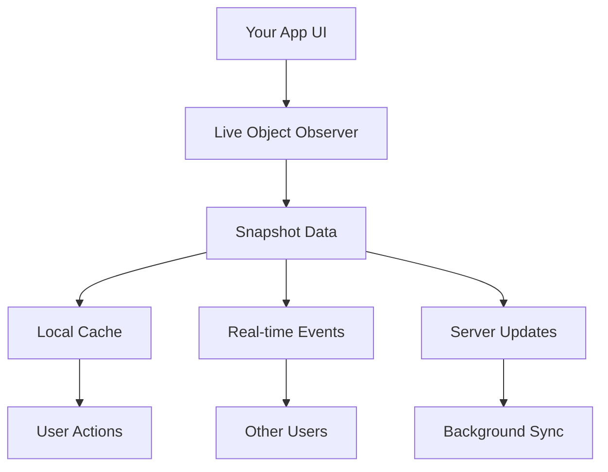
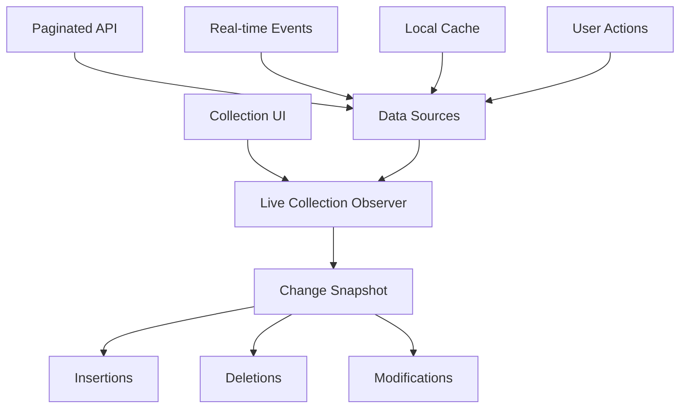

Live Objects and Live Collections are observable data holders. The observer gets updated when there is a change of data in the local cache.

There are two main sources that can make changes to the object and collection:

1. **When data get updated by an action from the current device**
2. **Real-time events of the subscribed data from the server**

<Info>
Refer to the platform-specific subpages in this section for an in-depth explanation of how your SDK handles live objects and live collections.
</Info>

By subscribing to a specific topic in the Real-time event system, users can ensure that they are receiving the most up-to-date information and notifications related to the observed object across devices.

## Data Sources

<CardGroup cols={2}>
  <Card title="Local Actions" icon="mobile">
    Updates from user interactions within your current device
  </Card>
  <Card title="Real-time Events" icon="bolt">
    Live changes from subscribed objects on the server
  </Card>
</CardGroup>

## Live Object

Live Object allows users to observe the states of a single object within the app, such as a post, message, or channel. With Live Object, users can automatically receive notifications of any data updates related to the observed object, whether from the network or locally.

### Key Features

<AccordionGroup>
  <Accordion title="Observer Design Pattern">
    Live Object API is designed around the observer design pattern, allowing users to subscribe to an object, receive notifications of any data updates, and unsubscribe when necessary.
  </Accordion>
  
  <Accordion title="Additional States">
    Live Object also provides additional states, such as `isLoading` and `error`, which can help understand the status of the observed object and any potential issues that may arise.
  </Accordion>
  
  <Accordion title="Snapshot Delivery">
    These updates are delivered via Snapshot, a captured state that is frozen and cannot be changed. Users can own and access these snapshots to stay up-to-date with the latest data within the app.
  </Accordion>
  
  <Accordion title="Immutable Snapshots">
    It's worth noting that while data updates may occur internally within the SDK, these updates will not affect previous snapshots. The only way for users to see the latest data is by getting new snapshots delivered via Live Object updates.
  </Accordion>
</AccordionGroup>

### Use Cases

Live Object is ideal for monitoring individual entities such as:

- **Posts**: Track likes, comments, and content updates
- **Messages**: Monitor delivery status, read receipts, and reactions  
- **Channels**: Observe member count changes and channel metadata
- **User Profiles**: Watch status updates, avatar changes, and online presence

### Live Object Architecture

## Live Collection

Live Collection allows users to observe changes to an entire collection of data within their app in real-time. Live Collection works similarly to Live Object, with the main difference being that Live Collection notifies changes related to the entire collection rather than just a single object.

### How It Works

To use Live Collection, users can observe changes in a specific collection within the SDK. The collection handler then receives a snapshot of changes since the last result, which includes three possible events:

<CardGroup cols={3}>
  <Card title="Deletions" icon="trash">
    The indices of the objects that were deleted
  </Card>
  <Card title="Insertions" icon="plus">
    The indices of the objects that were inserted
  </Card>
  <Card title="Modifications" icon="pencil">
    The indices of the objects that were modified
  </Card>
</CardGroup>

### Change Detection

Live Collections provide granular change notifications instead of replacing entire datasets:

| Change Type | Description | Benefit |
|-------------|-------------|---------|
| **Insertions** | New items added to collection | Efficient UI updates for new content |
| **Deletions** | Items removed from collection | Smooth removal animations |
| **Modifications** | Existing items updated | Targeted updates without full refresh |

### Use Cases

By subscribing to changes on a specific collection using Live Collection, users can stay up-to-date with the latest changes and updates to important collections within the app. This can be particularly helpful for:

- **Managing large amounts of data**: Efficiently handle extensive datasets without performance impact
- **Monitoring frequently updated collections**: Track changes to dynamic content like messages or posts
- **Real-time social feeds**: Display new posts, comments, and reactions as they happen
- **Chat message lists**: Show new messages instantly with typing indicators
- **Member lists**: Track community or channel membership changes

### Live Collection Architecture

\
## Best Practices

<AccordionGroup>
  <Accordion title="Memory Management">
    **Proper Cleanup**: Always unsubscribe from observers to prevent memory leaks when components unmount or views disappear.
  </Accordion>
  
  <Accordion title="Performance Optimization">
    **Efficient Updates**: Use collection change indices for targeted UI updates instead of full re-renders. Only update the specific items that changed.
  </Accordion>
  
  <Accordion title="Error Handling">
    **Graceful Degradation**: Handle network errors and loading states appropriately using the built-in `isLoading` and `error` states.
  </Accordion>
  
  <Accordion title="Real-time Subscriptions">
    **Topic Management**: Subscribe to relevant real-time topics for automatic updates. Ensure proper cleanup when no longer needed.
  </Accordion>
</AccordionGroup>

## Platform Implementation

Each platform has its own specific implementation patterns for Live Objects and Collections:

<CardGroup cols={2}>
  <Card title="iOS Implementation" href="./ios" icon="apple">
    Learn iOS-specific patterns for observers and delegates
  </Card>
  <Card title="Android Implementation" href="./android" icon="android">
    Discover Android LiveData and RxJava integration
  </Card>
  <Card title="Flutter Implementation" href="./flutter" icon="mobile">
    Understand Dart streams and reactive widgets
  </Card>
</CardGroup>

## Related Concepts

<CardGroup cols={2}>
  <Card title="Real-time Events" href="/social-plus-sdk/core-concepts/realtime-communication/realtime-events/overview" icon="bolt">
    Learn how Live Objects connect to real-time updates
  </Card>
  <Card title="Realtime Events Overview" href="/social-plus-sdk/core-concepts/realtime-communication/realtime-events/overview" icon="broadcast-tower">
    Explore event channels powering live updates
  </Card>
</CardGroup>

<Tip>
**Development Tip**: Use platform-specific debugging tools to monitor subscription status and data flow in your Live Objects and Collections during development.
</Tip>