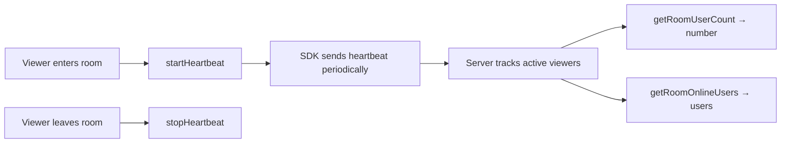

# Room Presence

Room presence lets you show **who is watching** a live room and **how many viewers** are present right now — the building blocks for a "Who's Watching" list and a live viewer count on a livestream or co-hosted room.

Each viewer periodically sends a lightweight **heartbeat** while they are in the room. The server keeps the set of currently-active viewers, and your app reads that set as a **count** and as a **list of users**.

<Note>
**Network setting required.** Room presence is a network-level feature configured in the social.plus Console. It is **enabled by default**. If it has been turned off for your network, starting a heartbeat will return an error (see [Error Handling](#error-handling)).
</Note>

<Info>
**Platform availability.** Room presence is available on **iOS**, **Android**, and the **TypeScript SDK** (Web and React Native). It is not yet available on Flutter.
</Info>

## Overview

<CardGroup cols={3}>
  <Card title="Send Heartbeat" icon="heart-pulse">
    Mark the current user as present in the room while they are watching.
  </Card>
  <Card title="Viewer Count" icon="users">
    Read how many users are currently watching, with optional live updates.
  </Card>
  <Card title="Who's Watching" icon="eye">
    Fetch the list of users currently present in the room.
  </Card>
</CardGroup>



## Quick Start

<Steps>
  <Step title="Create a room presence reference">
    Identify the room you want to track by its `roomId`.
  </Step>
  <Step title="Start the heartbeat when the viewer enters">
    Call `startHeartbeat` when the user opens the room screen. The first heartbeat is sent immediately and then repeats automatically.
  </Step>
  <Step title="Read the count and the who's-watching list">
    Display the live viewer count and, optionally, the list of present users.
  </Step>
  <Step title="Stop the heartbeat when the viewer leaves">
    Call `stopHeartbeat` when the user closes the room or the screen goes to the background.
  </Step>
</Steps>

## Send a Heartbeat

Start a heartbeat when the viewer enters the room, and stop it when they leave. The SDK sends the first heartbeat immediately and then repeats it automatically at a server-controlled interval — **you do not configure the interval**.

<CodeGroup>
```swift iOS
let roomPresence = AmityRoomPresenceRepository(roomId: "<room-id>")

// Start when the viewer enters the room
Task { @MainActor in
    do {
        try await roomPresence.startHeartbeat()
    } catch {
        // Room presence may be disabled for this network
        print("Failed to start room presence: \(error)")
    }
}

// Stop when the viewer leaves
roomPresence.stopHeartbeat()
```

```kotlin Android
val roomPresence = AmityCoreClient.newRoomPresenceRepository().roomId("<room-id>")

// Start when the viewer enters the room
roomPresence.startHeartbeat()
    .subscribeOn(Schedulers.io())
    .observeOn(AndroidSchedulers.mainThread())
    .doOnComplete { /* heartbeat started */ }
    .doOnError { /* room presence may be disabled */ }
    .subscribe()

// Stop when the viewer leaves
roomPresence.stopHeartbeat()
```

```typescript TypeScript
import { RoomPresenceRepository } from '@amityco/ts-sdk';

const roomId = '<room-id>';

// Start when the viewer enters the room
RoomPresenceRepository.startHeartbeat(roomId);

// Stop when the viewer leaves
RoomPresenceRepository.stopHeartbeat(roomId);
```
</CodeGroup>

<Tip>
**Tie heartbeats to the player screen lifecycle.** A user is counted as present only while heartbeats are being sent. The recommended pattern (the one the social.plus UIKit uses) is:

- **Start** when the room/player screen appears (`onAppear` / `LaunchedEffect` / `useEffect`).
- **Stop** when it disappears, is backgrounded, or the view model is torn down (`onDisappear` / `onDispose` / `useEffect` cleanup / `deinit`).
- **Only while actively watching a live room.** Don't send heartbeats on **recorded** or **ended** streams — the viewer isn't "present" in a live sense.
- **Restart if the room changes.** If the same screen can switch rooms, stop the previous room's heartbeat and start the new one (re-key on `roomId`).
</Tip>

<Note>
**Calling `startHeartbeat` again is safe.** A common pattern is to call `stopHeartbeat` immediately before `startHeartbeat` to guarantee a clean restart when the room or the viewer's role changes.
</Note>

## Get the Viewer Count

`getRoomUserCount` returns the number of users currently present. This is the authoritative "how many are watching" value.

<CodeGroup>
```swift iOS
let count = try await roomPresence.getRoomUserCount()
```

```kotlin Android
roomPresence.getOnlineUsersCount()
    .subscribe({ count -> /* update UI */ }, { error -> })
```

```typescript TypeScript
const { count } = await RoomPresenceRepository.getRoomUserCount(roomId);
```
</CodeGroup>

### Keep the count live

The count is a point-in-time read. To keep a viewer badge up to date, refresh it periodically.

On **Android** the SDK provides a built-in polling stream (default every 15 seconds). On **iOS** and **TypeScript**, call `getRoomUserCount` on your own interval.

<Tip>
**Tune the interval to the role.** A live count matters most to the person broadcasting, so the social.plus UIKit polls **faster for the broadcaster/host (~5s)** and **slower for plain viewers (~15–20s)**. Pick an interval that fits the screen; don't poll faster than you need to.
</Tip>

<CodeGroup>
```swift iOS
// Poll on your own timer (e.g. every 15s)
let timer = Timer.scheduledTimer(withTimeInterval: 15, repeats: true) { _ in
    Task { @MainActor in
        if let count = try? await roomPresence.getRoomUserCount() {
            // update UI
        }
    }
}
```

```kotlin Android
// Built-in polling stream — emits immediately, then every `interval` seconds
roomPresence.observeOnlineUsersCount(interval = 15)
    .subscribe({ count -> /* update UI */ }, { error -> })
```

```typescript TypeScript
// Poll on your own interval (e.g. every 15s)
const handle = setInterval(async () => {
  const { count } = await RoomPresenceRepository.getRoomUserCount(roomId);
  // update UI
}, 15_000);

// clearInterval(handle) when leaving the room
```
</CodeGroup>

## Get the "Who's Watching" List

`getRoomOnlineUsers` returns the users currently present in the room as full user objects — ideal for rendering avatars or a "Who's Watching" panel.

<CodeGroup>
```swift iOS
let users = try await roomPresence.getRoomOnlineUsers()
// users: [AmityUser]
```

```kotlin Android
// Android returns a snapshot that loads users 20 at a time
roomPresence.getOnlineUsersSnapshot()
    .subscribe({ snapshot ->
        val users = snapshot.getUsers()   // first page (up to 20)
        if (snapshot.canLoadMore()) {
            snapshot.loadMore().subscribe() // appends the next 20
        }
    }, { error -> })
```

```typescript TypeScript
const { data: users } = await RoomPresenceRepository.getRoomOnlineUsers(roomId);
// users: Amity.User[]
```
</CodeGroup>

<Info>
**The list is capped; the count is not.** The who's-watching list returns the **most recently joined** active viewers, up to a maximum (currently **200**). For rooms with large audiences the [viewer count](#get-the-viewer-count) can be **higher** than the number of users in the list. Use the **count** for the total number of viewers, and the **list** for showing faces.
</Info>

<Tip>
**Fetch the list on demand, and don't cache it.** The list is most useful when a host opens a "Who's Watching" or **invite co-host** panel. Fetch it when that panel opens and refetch to refresh — treat it as a fresh snapshot rather than cached data, since presence changes constantly. (The social.plus UIKit fetches it with caching disabled and, for the invite flow, filters out users who have already been invited.)
</Tip>

## Behavior to Know

<AccordionGroup>
  <Accordion title="When is a user considered present?" icon="signal">
    A user is present while their heartbeat is recent — they are considered **online if active within the last ~60 seconds**. When a viewer leaves the room or disconnects, the server clears their presence automatically; you don't need to remove them manually beyond calling `stopHeartbeat`.
  </Accordion>
  <Accordion title="Heartbeat timing is automatic" icon="clock">
    The SDK sends the first heartbeat immediately when you call `startHeartbeat`, then repeats at a cadence provided by the server. There is no client-side interval to configure.
  </Accordion>
  <Accordion title="Count vs. list consistency" icon="scale-balanced">
    The count and the list come from separate reads taken at slightly different moments, and the list is capped (see above). Treat the count as the source of truth for totals and the list as a best-effort snapshot of recent viewers.
  </Accordion>
  <Accordion title="Reading does not require a heartbeat" icon="eye">
    You can call `getRoomUserCount` and `getRoomOnlineUsers` to observe a room even if the current user is not sending a heartbeat themselves (for example, a moderator dashboard). Send a heartbeat only when you want the current user to be counted as present.
  </Accordion>
</AccordionGroup>

## Error Handling

<CodeGroup>
```swift iOS
do {
    try await roomPresence.startHeartbeat()
} catch {
    // e.g. room presence disabled for this network
    print("Room presence error: \(error)")
}
```

```kotlin Android
roomPresence.startHeartbeat()
    .subscribe(
        { /* started */ },
        { error -> /* e.g. room presence disabled for this network */ }
    )
```

```typescript TypeScript
// startHeartbeat / stopHeartbeat do not throw to the caller.
// Wrap read calls to handle network errors:
try {
  const { count } = await RoomPresenceRepository.getRoomUserCount(roomId);
} catch (error) {
  // handle network / availability error
}
```
</CodeGroup>

<Warning>
If room presence is **disabled** for your network, `startHeartbeat` reports an error on iOS and Android. Make sure the feature is enabled in the Console before relying on it.
</Warning>

## Best Practices

<AccordionGroup>
  <Accordion title="Lifecycle management" icon="arrows-rotate">
    Start the heartbeat when the player screen becomes visible and stop it when it is dismissed, backgrounded, or the view model is torn down. Only run it for **live** rooms — skip recorded/ended playback. If the screen can switch rooms or the viewer's role changes, stop the old heartbeat and start a fresh one. This keeps the viewer count accurate and avoids counting users who have left.
  </Accordion>
  <Accordion title="Display count and list together" icon="layer-group">
    Show the live **count** as the headline number and the **who's-watching list** as a (capped) preview of viewers. Don't derive the total from the length of the list — for large audiences the count is higher than the list.
  </Accordion>
  <Accordion title="Choose a sensible refresh interval" icon="gauge">
    Polling the count too frequently adds load for little benefit. A good rule of thumb: **~5s for the broadcaster/host** (who cares most about the live audience) and **~15–20s for viewers**. Slow it down further on screens where the count is secondary.
  </Accordion>
  <Accordion title="Fetch the who's-watching list when needed" icon="list">
    Load the list when a host opens a viewers or invite-co-host panel, and refetch to refresh. Don't keep it cached — presence changes constantly, so a stale list is misleading.
  </Accordion>
</AccordionGroup>

## Use Cases

<CardGroup cols={2}>
  <Card title="Livestream viewer count" icon="users">
    Show a live "1,240 watching" badge on a livestream or co-hosted room.
  </Card>
  <Card title="Who's Watching panel" icon="eye">
    Render avatars of the most recent viewers present in the room.
  </Card>
  <Card title="Co-host invitations" icon="user-plus">
    Surface currently-watching viewers so a host can invite one as a co-host.
  </Card>
  <Card title="Moderation dashboard" icon="shield">
    Monitor room attendance without joining as a viewer.
  </Card>
</CardGroup>

## Related Topics

<CardGroup cols={2}>
  <Card title="Real-time Events" icon="bolt" href="/social-plus-sdk/core-concepts/realtime-communication/realtime-events/overview">
    Subscribe to live updates for rooms and other content.
  </Card>
  <Card title="Live Objects & Collections" icon="layer-group" href="/social-plus-sdk/core-concepts/realtime-communication/live-objects-collections/overview">
    Observe data that updates in real time across your app.
  </Card>
</CardGroup>
