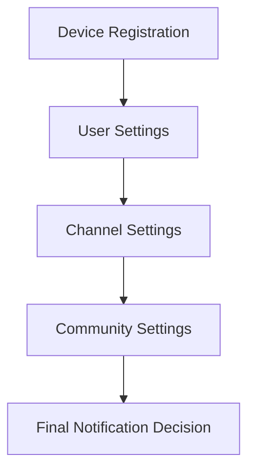

# User Notification Settings

Manage user-level push notification preferences that apply across all devices logged in with the same user account. Users can control notifications for different feature modules like chat, social features, and live streams.

<Info>
**Global Settings**: User notification settings are synchronized across all devices where the user is logged in, ensuring consistent notification preferences.
</Info>

## Overview

User notification settings provide granular control over which types of notifications users receive. Settings are organized by feature modules and persist across user sessions and devices.

### Supported Modules

- **`CHAT`** - Direct messages, channel messages, and mentions
- **`SOCIAL`** - Posts, comments, reactions, and community activities  
- **`LIVE_STREAM`** - Stream notifications, chat messages, and live events

## Get Current Settings

Retrieve the user's current notification preferences:

<Tabs>
  <Tab title="TypeScript">
    ```typescript
    import { UserNotificationSettings } from '@amityco/ts-sdk';
    
    const getUserSettings = async () => {
      try {
        const settings = await userNotification.getSettings();
        
        console.log('Chat notifications:', settings.chat.enabled);
        console.log('Social notifications:', settings.social.enabled);
        console.log('Live stream notifications:', settings.liveStream.enabled);
        
        return settings;
      } catch (error) {
        console.error('Failed to get user settings:', error);
      }
    };
    ```
  </Tab>
  <Tab title="iOS">
    ```swift
    userNotification.getSettings { result in
        switch result {
        case .success(let settings):
            print("Chat enabled: \\(settings.chat.isEnabled)")
            print("Social enabled: \\(settings.social.isEnabled)")
            print("Live stream enabled: \\(settings.liveStream.isEnabled)")
            
        case .failure(let error):
            print("Failed to get settings: \\(error.localizedDescription)")
        }
    }
    ```
  </Tab>
  <Tab title="Android">
    ```kotlin
    userNotification.getSettings(object : UserNotificationSettingsCallback {
        override fun onSuccess(settings: UserNotificationSettings) {
            Log.d(TAG, "Chat enabled: ${settings.chat.isEnabled}")
            Log.d(TAG, "Social enabled: ${settings.social.isEnabled}")
            Log.d(TAG, "Live stream enabled: ${settings.liveStream.isEnabled}")
        }
        
        override fun onError(error: SdkError) {
            Log.e(TAG, "Failed to get settings: ${error.message}")
        }
    })
    ```
  </Tab>
  <Tab title="React Native">
    ```typescript
    import { UserNotificationRepository } from '@amityco/react-native-sdk';
    
    const userNotification = new UserNotificationRepository();
    
    const loadUserSettings = async () => {
      try {
        const settings = await userNotification.getSettings();
        
        return {
          chat: settings.modules.CHAT,
          social: settings.modules.SOCIAL,
          liveStream: settings.modules.LIVE_STREAM
        };
      } catch (error) {
        console.error('Settings load failed:', error);
      }
    };
    ```
  </Tab>
</Tabs>

## Update Settings

Modify notification preferences for specific modules:

<Tabs>
  <Tab title="TypeScript">
    ```typescript
    const updateUserSettings = async (moduleSettings: {
      chat?: boolean;
      social?: boolean;
      liveStream?: boolean;
    }) => {
      try {
        const updates: any = {};
        
        if (moduleSettings.chat !== undefined) {
          updates.CHAT = moduleSettings.chat;
        }
        if (moduleSettings.social !== undefined) {
          updates.SOCIAL = moduleSettings.social;
        }
        if (moduleSettings.liveStream !== undefined) {
          updates.LIVE_STREAM = moduleSettings.liveStream;
        }
        
        await userNotification.updateSettings(updates);
        console.log('User settings updated successfully');
        
      } catch (error) {
        console.error('Failed to update settings:', error);
      }
    };
    
    // Usage examples
    await updateUserSettings({ chat: true, social: false });
    await updateUserSettings({ liveStream: true });
    ```
  </Tab>
  <Tab title="iOS">
    ```swift
    func updateChatNotifications(enabled: Bool) {
        userNotification.updateSettings([.chat: enabled]) { result in
            switch result {
            case .success:
                print("Chat notification setting updated")
            case .failure(let error):
                print("Update failed: \\(error.localizedDescription)")
            }
        }
    }
    
    func updateMultipleSettings() {
        let settings: [NotificationModule: Bool] = [
            .chat: true,
            .social: false,
            .liveStream: true
        ]
        
        userNotification.updateSettings(settings) { result in
            // Handle result
        }
    }
    ```
  </Tab>
  <Tab title="Android">
    ```kotlin
    fun updateChatNotifications(enabled: Boolean) {
        val settings = mapOf(NotificationModule.CHAT to enabled)
        
        userNotification.updateSettings(settings, object : AmityCallback<Unit> {
            override fun onSuccess(result: Unit) {
                Log.d(TAG, "Chat notification setting updated")
            }
            
            override fun onError(error: AmityException) {
                Log.e(TAG, "Update failed: ${error.message}")
            }
        })
    }
    
    fun updateMultipleSettings() {
        val settings = mapOf(
            NotificationModule.CHAT to true,
            NotificationModule.SOCIAL to false,
            NotificationModule.LIVE_STREAM to true
        )
        
        userNotification.updateSettings(settings, callback)
    }
    ```
  </Tab>
</Tabs>

## Settings Management Component

Create a reusable settings component for your app:

<Tabs>
  <Tab title="React">
    ```typescript
    import React, { useState, useEffect } from 'react';
    
    interface NotificationSettingsProps {
      onSettingsChange?: (settings: any) => void;
    }
    
    const NotificationSettings: React.FC<NotificationSettingsProps> = ({ onSettingsChange }) => {
      const [settings, setSettings] = useState({
        chat: true,
        social: true,
        liveStream: true
      });
      const [loading, setLoading] = useState(true);
      const [saving, setSaving] = useState(false);
      
      useEffect(() => {
        loadCurrentSettings();
      }, []);
      
      const loadCurrentSettings = async () => {
        try {
          const currentSettings = await userNotification.getSettings();
          setSettings({
            chat: currentSettings.modules.CHAT,
            social: currentSettings.modules.SOCIAL,
            liveStream: currentSettings.modules.LIVE_STREAM
          });
        } catch (error) {
          console.error('Failed to load settings:', error);
        } finally {
          setLoading(false);
        }
      };
      
      const updateSetting = async (module: string, enabled: boolean) => {
        setSaving(true);
        try {
          const updates = { [module]: enabled };
          await userNotification.updateSettings(updates);
          
          setSettings(prev => ({ ...prev, [module]: enabled }));
          onSettingsChange?.(settings);
          
        } catch (error) {
          console.error(`Failed to update ${module} setting:`, error);
        } finally {
          setSaving(false);
        }
      };
      
      if (loading) return <div>Loading settings...</div>;
      
      return (
        <div className="notification-settings">
          <h3>Notification Preferences</h3>
          
          <div className="setting-item">
            <label>
              <input
                type="checkbox"
                checked={settings.chat}
                onChange={(e) => updateSetting('CHAT', e.target.checked)}
                disabled={saving}
              />
              Chat Messages
            </label>
            <p>Direct messages, channel messages, and mentions</p>
          </div>
          
          <div className="setting-item">
            <label>
              <input
                type="checkbox"
                checked={settings.social}
                onChange={(e) => updateSetting('SOCIAL', e.target.checked)}
                disabled={saving}
              />
              Social Activities
            </label>
            <p>Posts, comments, reactions, and community updates</p>
          </div>
          
          <div className="setting-item">
            <label>
              <input
                type="checkbox"
                checked={settings.liveStream}
                onChange={(e) => updateSetting('LIVE_STREAM', e.target.checked)}
                disabled={saving}
              />
              Live Streams
            </label>
            <p>Stream notifications and live chat messages</p>
          </div>
        </div>
      );
    };
    ```
  </Tab>
  <Tab title="React Native">
    ```typescript
    import React, { useState, useEffect } from 'react';
    import { View, Text, Switch, StyleSheet } from 'react-native';
    
    const NotificationSettingsScreen = () => {
      const [settings, setSettings] = useState({
        chat: true,
        social: true,
        liveStream: true
      });
      const [loading, setLoading] = useState(true);
      
      useEffect(() => {
        loadSettings();
      }, []);
      
      const loadSettings = async () => {
        try {
          const userSettings = await userNotification.getSettings();
          setSettings({
            chat: userSettings.modules.CHAT,
            social: userSettings.modules.SOCIAL,
            liveStream: userSettings.modules.LIVE_STREAM
          });
        } finally {
          setLoading(false);
        }
      };
      
      const toggleSetting = async (module: string, value: boolean) => {
        try {
          await userNotification.updateSettings({ [module]: value });
          setSettings(prev => ({ ...prev, [module.toLowerCase()]: value }));
        } catch (error) {
          console.error('Failed to update setting:', error);
        }
      };
      
      if (loading) {
        return <Text>Loading...</Text>;
      }
      
      return (
        <View style={styles.container}>
          <Text style={styles.title}>Notification Settings</Text>
          
          <View style={styles.settingRow}>
            <View style={styles.settingInfo}>
              <Text style={styles.settingTitle}>Chat Messages</Text>
              <Text style={styles.settingDescription}>Direct messages and mentions</Text>
            </View>
            <Switch
              value={settings.chat}
              onValueChange={(value) => toggleSetting('CHAT', value)}
            />
          </View>
          
          <View style={styles.settingRow}>
            <View style={styles.settingInfo}>
              <Text style={styles.settingTitle}>Social Activities</Text>
              <Text style={styles.settingDescription}>Posts and community updates</Text>
            </View>
            <Switch
              value={settings.social}
              onValueChange={(value) => toggleSetting('SOCIAL', value)}
            />
          </View>
          
          <View style={styles.settingRow}>
            <View style={styles.settingInfo}>
              <Text style={styles.settingTitle}>Live Streams</Text>
              <Text style={styles.settingDescription}>Stream notifications</Text>
            </View>
            <Switch
              value={settings.liveStream}
              onValueChange={(value) => toggleSetting('LIVE_STREAM', value)}
            />
          </View>
        </View>
      );
    };
    
    const styles = StyleSheet.create({
      container: { padding: 16 },
      title: { fontSize: 20, fontWeight: 'bold', marginBottom: 20 },
      settingRow: { 
        flexDirection: 'row', 
        justifyContent: 'space-between',
        alignItems: 'center',
        paddingVertical: 12
      },
      settingInfo: { flex: 1 },
      settingTitle: { fontSize: 16, fontWeight: '500' },
      settingDescription: { fontSize: 14, color: '#666', marginTop: 2 }
    });
    ```
  </Tab>
</Tabs>

## Advanced Settings Management

### Bulk Settings Update

```typescript
class UserNotificationManager {
  async updateAllSettings(enabled: boolean) {
    const settings = {
      CHAT: enabled,
      SOCIAL: enabled,
      LIVE_STREAM: enabled
    };
    
    try {
      await userNotification.updateSettings(settings);
      console.log(`All notifications ${enabled ? 'enabled' : 'disabled'}`);
    } catch (error) {
      console.error('Bulk update failed:', error);
    }
  }
  
  async resetToDefaults() {
    const defaultSettings = {
      CHAT: true,
      SOCIAL: true,
      LIVE_STREAM: false
    };
    
    try {
      await userNotification.updateSettings(defaultSettings);
      console.log('Settings reset to defaults');
    } catch (error) {
      console.error('Reset failed:', error);
    }
  }
  
  async getSettingsSummary() {
    try {
      const settings = await userNotification.getSettings();
      const enabled = Object.values(settings.modules).filter(Boolean).length;
      const total = Object.keys(settings.modules).length;
      
      return {
        enabled,
        total,
        percentage: Math.round((enabled / total) * 100)
      };
    } catch (error) {
      console.error('Failed to get summary:', error);
      return null;
    }
  }
}
```

### Settings Validation

```typescript
const validateSettings = (settings: any): boolean => {
  const validModules = ['CHAT', 'SOCIAL', 'LIVE_STREAM'];
  
  for (const [module, enabled] of Object.entries(settings)) {
    if (!validModules.includes(module)) {
      console.error(`Invalid module: ${module}`);
      return false;
    }
    
    if (typeof enabled !== 'boolean') {
      console.error(`Invalid value for ${module}: must be boolean`);
      return false;
    }
  }
  
  return true;
};
```

## Best Practices

<Tip>
**User Control**: Always provide users with clear, granular control over their notification preferences to improve engagement and reduce opt-outs.
</Tip>

- **Default Settings** - Set sensible defaults that balance engagement with user experience
- **Clear Labels** - Use descriptive labels that explain what each setting controls
- **Immediate Feedback** - Show loading states and confirmation when settings change
- **Sync Across Devices** - Leverage the automatic synchronization across user devices
- **Regular Review** - Periodically prompt users to review their notification preferences

## Settings Hierarchy

User settings work in conjunction with other notification controls:



## Next Steps

<CardGroup cols={2}>
  <Card title="Channel Settings" href="./channel-settings">
    Configure notifications for specific channels
  </Card>
  <Card title="Community Settings" href="./community-settings">
    Manage community-wide notification rules
  </Card>
</CardGroup>
