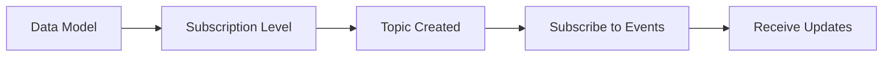
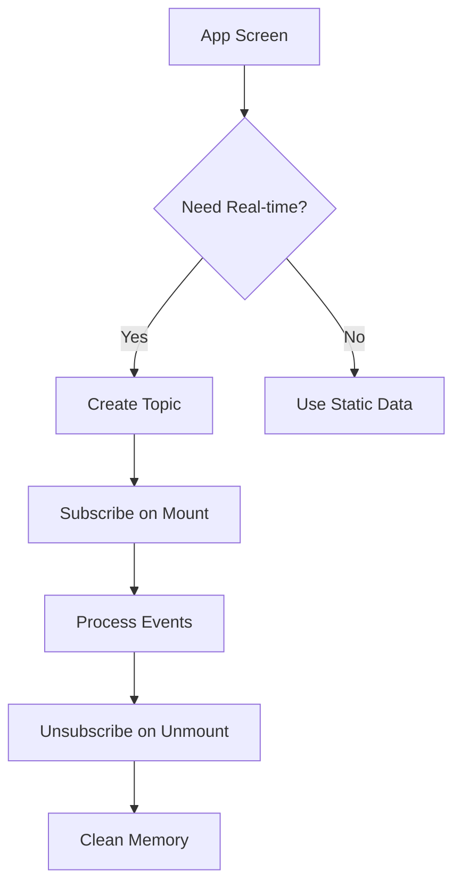

## Overview

Social+ SDK provides a powerful real-time event system that keeps your application synchronized with live data changes. When users modify profiles, create posts, send messages, or perform other actions, these changes are instantly reflected across all connected devices.

<Info>
Real-time events work seamlessly with [Live Objects & Collections](../live-objects-collections) to provide automatic UI updates without manual data fetching.
</Info>

## Supported Data Models

<CardGroup cols={2}>
  <Card title="Social Features" icon="users">
    Communities, Posts, Comments, User profiles, Follow relationships
  </Card>
  <Card title="Chat Features" icon="messages">
    Channels, Subchannels, Messages, Member activities
  </Card>
</CardGroup>

### Event Types by Model

| Model | Available Events |
|-------|------------------|
| **Community** | Created, Updated, Deleted, Joined, Left, Member management |
| **Post** | Created, Updated, Deleted, Approved, Flagged, Reactions |
| **Comment** | Created, Updated, Deleted, Flagged, Reactions |
| **User** | Profile updates, Follow/Unfollow activities |
| **Channel** | Messages, Member activities, Status changes |
| **Subchannel** | Thread-specific updates |

## How It Works

### 1. Subscription Topics

Create subscription topics to define which events you want to receive:



### 2. Event Delivery

Events are delivered through Live Objects and Collections that you're already observing:

- **Automatic Updates**: No manual refresh needed
- **Real-time Synchronization**: Changes appear instantly
- **Efficient**: Only subscribed events are processed

## Basic Implementation

<Tabs>
  <Tab title="iOS">
    ```swift
    import AmitySDK
    
    // 1. Create a subscription topic for community posts
    let community = // ... your community object
    let subscription = AmityTopicSubscription()
    let topic = AmityTopicBuilder.build(community, level: .post)
    
    // 2. Subscribe to the topic
    subscription.subscribeTopic(topic) { result in
        switch result {
        case .success:
            print("Successfully subscribed to community posts")
        case .failure(let error):
            print("Subscription failed: \(error.localizedDescription)")
        }
    }
    
    // 3. Observe changes through Live Collection
    let postsCollection = AmityPostRepository(client: client)
        .getPosts(communityId: community.communityId)
        .query()
    
    postsCollection.delegate = self
    
    // AmityCollectionDelegate method
    func amityCollection(_ collection: AmityCollection<AmityPost>, 
                        didReceive data: [AmityPost], 
                        at indexPaths: [IndexPath]) {
        // Real-time updates will be delivered here
        print("Received \(data.count) posts updates")
        updateUI(with: data)
    }
    
    // 4. Remember to unsubscribe when done
    subscription.unsubscribeTopic(topic)
    ```
  </Tab>
  
  <Tab title="Android">
    ```kotlin
    import com.amity.socialcloud.sdk.core.realtime.*
    
    // 1. Create a subscription topic for community posts
    val community = // ... your community object
    val subscription = AmityTopicSubscription()
    val topic = AmityTopicBuilder.build(community, AmitySubscriptionLevel.POST)
    
    // 2. Subscribe to the topic
    subscription.subscribeTopic(topic)
        .observeOn(AndroidSchedulers.mainThread())
        .subscribe({
            Log.d("Subscription", "Successfully subscribed to community posts")
        }, { error ->
            Log.e("Subscription", "Failed to subscribe: ${error.message}")
        })
    
    // 3. Observe changes through Live Collection
    val postsRepository = AmityPostRepository(client)
    val postsCollection = postsRepository.getPosts(community.communityId)
        .build()
        .query()
    
    postsCollection.observe(this) { result ->
        result.onSuccess { posts ->
            // Real-time updates will be delivered here
            Log.d("Posts", "Received ${posts.size} posts updates")
            updateUI(posts)
        }.onError { error ->
            Log.e("Posts", "Error observing posts: ${error.message}")
        }
    }
    
    // 4. Remember to unsubscribe when done
    subscription.unsubscribeTopic(topic)
    ```
  </Tab>
  
  <Tab title="TypeScript">
    ```typescript
    import { 
      getCommunityTopic, 
      EventSubscriberRepository, 
      SubscriptionLevels,
      CommunityRepository 
    } from '@amityco/ts-sdk';
    
    // 1. Create a subscription topic for community posts
    const community = // ... your community object
    const topic = getCommunityTopic(community, SubscriptionLevels.POST);
    
    // 2. Subscribe to the topic
    try {
      await EventSubscriberRepository.subscribe(topic);
      console.log('Successfully subscribed to community posts');
    } catch (error) {
      console.error('Subscription failed:', error);
    }
    
    // 3. Observe changes through Live Collection
    const liveCollection = CommunityRepository.getPosts({
      communityId: community.communityId
    });
    
    liveCollection.on('dataUpdated', (posts) => {
      // Real-time updates will be delivered here
      console.log(`Received ${posts.length} posts updates`);
      updateUI(posts);
    });
    
    // 4. Remember to unsubscribe when done
    EventSubscriberRepository.unsubscribe(topic);
    
    // Clean up observer
    liveCollection.dispose();
    ```
  </Tab>
  
  <Tab title="Flutter">
    ```dart
    import 'package:amity_sdk/amity_sdk.dart';
    
    // 1. Create a subscription topic for community posts
    final community = // ... your community object
    final subscription = AmityTopicSubscription();
    final topic = AmityTopicBuilder.build(community, AmitySubscriptionLevel.post);
    
    // 2. Subscribe to the topic
    try {
      await subscription.subscribeTopic(topic);
      print('Successfully subscribed to community posts');
    } catch (error) {
      print('Subscription failed: $error');
    }
    
    // 3. Observe changes through Live Collection
    final postRepository = AmityPostRepository();
    final postsController = postRepository
        .getPosts(communityId: community.communityId)
        .getPagingController();
    
    postsController.addListener(() {
      final posts = postsController.itemList ?? [];
      // Real-time updates will be delivered here
      print('Received ${posts.length} posts updates');
      updateUI(posts);
    });
    
    // 4. Remember to unsubscribe when done
    await subscription.unsubscribeTopic(topic);
    
    // Clean up controller
    postsController.dispose();
    ```
  </Tab>
</Tabs>

## Managing Subscriptions

### Subscription Limits

<Warning>
The SDK has a maximum limit of **20 active subscriptions** per session. Manage your subscriptions carefully to stay within this limit.
</Warning>

### Best Practices for Subscription Management

<AccordionGroup>
  <Accordion title="Use Higher-Level Topics">
    Instead of subscribing to individual posts or comments, subscribe to community-level topics with `POST_AND_COMMENT` level to cover all content in that community.
    
    ```typescript
    // ✅ Better: One subscription covers all posts and comments
    const topic = getCommunityTopic(community, SubscriptionLevels.POST_AND_COMMENT);
    
    // ❌ Avoid: Multiple subscriptions for the same data
    const postTopic = getPostTopic(post1, SubscriptionLevels.POST);
    const commentTopic = getPostTopic(post1, SubscriptionLevels.COMMENT);
    ```
  </Accordion>
  
  <Accordion title="Subscribe on Render, Unsubscribe on Leave">
    Manage subscriptions based on UI state to optimize performance and stay within limits.
    
    ```typescript
    // React example
    useEffect(() => {
      const topic = getCommunityTopic(community, SubscriptionLevels.POST);
      
      // Subscribe when component mounts
      EventSubscriberRepository.subscribe(topic);
      
      return () => {
        // Unsubscribe when component unmounts
        EventSubscriberRepository.unsubscribe(topic);
      };
    }, [community.communityId]);
    ```
  </Accordion>
  
  <Accordion title="Automatic Cleanup on Logout">
    All subscriptions are automatically removed when `logout()` is called, helping prevent memory leaks and unwanted data consumption.
  </Accordion>
</AccordionGroup>

## Unsubscribing from Events

<Tabs>
  <Tab title="iOS">
    ```swift
    // Unsubscribe from a specific topic
    let subscription = AmityTopicSubscription()
    subscription.unsubscribeTopic(topic) { result in
        switch result {
        case .success:
            print("Successfully unsubscribed")
        case .failure(let error):
            print("Unsubscribe failed: \(error.localizedDescription)")
        }
    }
    
    // Alternative: Unsubscribe using the model itself
    community.unsubscribeEvent(.post) { result in
        // Handle result
    }
    ```
  </Tab>
  
  <Tab title="Android">
    ```kotlin
    // Unsubscribe from a specific topic
    val subscription = AmityTopicSubscription()
    subscription.unsubscribeTopic(topic)
        .observeOn(AndroidSchedulers.mainThread())
        .subscribe({
            Log.d("Unsubscribe", "Successfully unsubscribed")
        }, { error ->
            Log.e("Unsubscribe", "Failed to unsubscribe: ${error.message}")
        })
    ```
  </Tab>
  
  <Tab title="TypeScript">
    ```typescript
    // Unsubscribe from a specific topic
    try {
      await EventSubscriberRepository.unsubscribe(topic);
      console.log('Successfully unsubscribed');
    } catch (error) {
      console.error('Unsubscribe failed:', error);
    }
    
    // Example with error handling
    EventSubscriberRepository.unsubscribe(topic, (error) => {
      if (error) {
        console.error('Unsubscribe error:', error);
      } else {
        console.log('Unsubscribed successfully');
      }
    });
    ```
  </Tab>
  
  <Tab title="Flutter">
    ```dart
    // Unsubscribe from a specific topic
    try {
      await subscription.unsubscribeTopic(topic);
      print('Successfully unsubscribed');
    } catch (error) {
      print('Unsubscribe failed: $error');
    }
    ```
  </Tab>
</Tabs>

## Advanced Event Handling

### Available Event Types

<Tabs>
  <Tab title="TypeScript">
    ```typescript
    // Community Events
    liveObject.on('communityCreated', (community) => {
      console.log('New community created:', community.displayName);
    });
    
    liveObject.on('communityUpdated', (community) => {
      console.log('Community updated:', community.displayName);
    });
    
    liveObject.on('communityJoined', (community) => {
      console.log('Joined community:', community.displayName);
    });
    
    // Post Events
    liveObject.on('postCreated', (post) => {
      console.log('New post created:', post.data.text);
    });
    
    liveObject.on('postReactionAdded', (post, reaction) => {
      console.log('Reaction added to post:', reaction.reactionName);
    });
    
    // User Events
    liveObject.on('userFollowed', (user) => {
      console.log('User followed:', user.displayName);
    });
    
    liveObject.on('followRequestAccepted', (user) => {
      console.log('Follow request accepted by:', user.displayName);
    });
    ```
  </Tab>
</Tabs>

### Event Categories

<CardGroup cols={3}>
  <Card title="Community Events" icon="users">
    Created, Updated, Deleted, Joined, Left, Member management
  </Card>
  <Card title="Content Events" icon="file-text">
    Posts and Comments: Created, Updated, Deleted, Flagged, Reactions
  </Card>
  <Card title="Social Events" icon="heart">
    Follow/Unfollow, Follow requests, User updates
  </Card>
</CardGroup>

## Performance Optimization

### Subscription Strategy



### Best Practices

<AccordionGroup>
  <Accordion title="Efficient Topic Design">
    - Use broader subscription levels when possible
    - Combine related events into single subscriptions
    - Avoid duplicate subscriptions for the same data
    - Monitor your subscription count regularly
  </Accordion>
  
  <Accordion title="Memory Management">
    - Always unsubscribe when leaving screens
    - Dispose of live objects and collections
    - Use lifecycle-aware subscription management
    - Clean up observers in component unmount
  </Accordion>
  
  <Accordion title="Error Handling">
    - Implement retry logic for failed subscriptions
    - Handle network disconnections gracefully
    - Log subscription events for debugging
    - Provide fallback for when real-time fails
  </Accordion>
</AccordionGroup>

## Common Use Cases

### Real-time Chat

```typescript
// Subscribe to new messages in a channel
const channelTopic = getChannelTopic(channel, SubscriptionLevels.MESSAGE);
await EventSubscriberRepository.subscribe(channelTopic);

// Messages will appear automatically in your live collection
const messagesCollection = ChannelRepository.getMessages(channelId);
messagesCollection.on('dataUpdated', (messages) => {
  displayMessages(messages);
});
```

### Live Community Feed

```typescript
// Subscribe to all community activity
const communityTopic = getCommunityTopic(community, SubscriptionLevels.POST_AND_COMMENT);
await EventSubscriberRepository.subscribe(communityTopic);

// Posts and comments will update automatically
const postsCollection = CommunityRepository.getPosts(communityId);
postsCollection.on('dataUpdated', (posts) => {
  updateFeed(posts);
});
```

### User Activity Monitoring

```typescript
// Subscribe to user follow activities
const followTopic = getFollowTopic(FollowLevel.MY_FOLLOWERS);
await EventSubscriberRepository.subscribe(followTopic);

// Handle follow events
followTopic.on('userFollowed', (user) => {
  showNotification(`${user.displayName} started following you`);
});
```

## Next Steps

<CardGroup cols={2}>
  <Card title="Social Real-time Events" href="./social-realtime-events" icon="users">
    Explore social platform event subscriptions
  </Card>
  <Card title="Chat Real-time Events" href="./chat-realtime-events" icon="messages">
    Learn about chat and messaging events
  </Card>
</CardGroup>