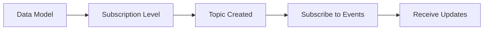

## Overview

Social+ SDK provides a powerful real-time event system that keeps your application synchronized with live data changes. When users modify profiles, create posts, send messages, or perform other actions, these changes are instantly reflected across all connected devices.

<Info>
Real-time events work seamlessly with [Live Objects & Collections](../live-objects-collections) to provide automatic UI updates without manual data fetching.
</Info>

## Supported Data Models

<CardGroup cols={2}>
  <Card title="Social Features" icon="users">
    Communities, Posts, Comments, User profiles, Follow relationships
  </Card>
  <Card title="Chat Features" icon="messages">
    Channels, Subchannels, Messages, Member activities
  </Card>
</CardGroup>

### Event Types by Model

| Model | Available Events |
|-------|------------------|
| **Community** | Created, Updated, Deleted, Joined, Left, Member management |
| **Post** | Created, Updated, Deleted, Approved, Flagged, Reactions |
| **Comment** | Created, Updated, Deleted, Flagged, Reactions |
| **User** | Profile updates, Follow/Unfollow activities |
| **Channel** | Messages, Member activities, Status changes |
| **Subchannel** | Thread-specific updates |

## How It Works

### 1. Subscription Topics

Create subscription topics to define which events you want to receive:



### 2. Event Delivery

Events are delivered through Live Objects and Collections that you're already observing:

- **Automatic Updates**: No manual refresh needed
- **Real-time Synchronization**: Changes appear instantly
- **Efficient**: Only subscribed events are processed


## Managing Subscriptions

### Subscription Limits

<Warning>
The SDK has a maximum limit of **20 active subscriptions** per session. Manage your subscriptions carefully to stay within this limit.
</Warning>

### Best Practices for Subscription Management

<AccordionGroup>
  <Accordion title="Use Higher-Level Topics">
    Instead of subscribing to individual posts or comments, subscribe to community-level topics with `POST_AND_COMMENT` level to cover all content in that community.
    
    ```typescript
    // ✅ Better: One subscription covers all posts and comments
    const topic = getCommunityTopic(community, SubscriptionLevels.POST_AND_COMMENT);
    
    // ❌ Avoid: Multiple subscriptions for the same data
    const postTopic = getPostTopic(post1, SubscriptionLevels.POST);
    const commentTopic = getPostTopic(post1, SubscriptionLevels.COMMENT);
    ```
  </Accordion>
  
  <Accordion title="Subscribe on Render, Unsubscribe on Leave">
    Manage subscriptions based on UI state to optimize performance and stay within limits.
    
    ```typescript
    // React example
    useEffect(() => {
      const topic = getCommunityTopic(community, SubscriptionLevels.POST);
      
      // Subscribe when component mounts
      EventSubscriberRepository.subscribe(topic);
      
      return () => {
        // Unsubscribe when component unmounts
        EventSubscriberRepository.unsubscribe(topic);
      };
    }, [community.communityId]);
    ```
  </Accordion>
  
  <Accordion title="Automatic Cleanup on Logout">
    All subscriptions are automatically removed when `logout()` is called, helping prevent memory leaks and unwanted data consumption.
  </Accordion>
</AccordionGroup>


## Next Steps

<CardGroup cols={2}>
  <Card title="Social Real-time Events" href="./social-realtime-events" icon="users">
    Explore social platform event subscriptions
  </Card>
  <Card title="Chat Real-time Events" href="./chat-realtime-events" icon="messages">
    Learn about chat and messaging events
  </Card>
</CardGroup>