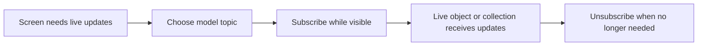

Real-time events are MQTT topic subscriptions managed by the SDK. Subscribe to the smallest topic that matches the screen, and the SDK delivers matching changes into the live objects, live collections, and local caches you already observe.

<Info>
Topic subscriptions do not replace Live Objects & Collections. Use subscriptions to tell the SDK which event streams matter now, then render from the live data APIs.
</Info>

## Platform Surface

| Area | TypeScript | iOS | Android | Flutter |
| --- | --- | --- | --- | --- |
| Social topics | Topic helper functions such as `getCommunityTopic`, `getPostTopic`, and `subscribeTopic` | `AmityTopic` classes with `AmityTopicSubscription` | Model `.subscription(...)` extensions plus `AmityCoreClient.subscription(...)` for follow topics | Model `.subscription(...)` extensions |
| Chat topics | `getSubChannelTopic(subChannel)` with `subscribeTopic(topic)` | `AmitySubChannelTopic` with `AmityTopicSubscription` | `subChannel.subscription()` | `subChannel.subscription()` |
| Unsubscribe | Call the `Amity.Unsubscriber` returned by `subscribeTopic` | `unsubscribeTopic(...)` | `unsubscribeTopic()` | `unsubscribeTopic()` |

## Topic Lifecycle

```mermaid
flowchart LR
    A["Screen needs live updates"] --> B["Choose model topic"]
    B --> C["Subscribe while visible"]
    C --> D["Live object or collection receives updates"]
    D --> E["Unsubscribe when no longer needed"]
```

## When To Subscribe

| UI need | Recommended topic |
| --- | --- |
| Community profile or settings changes | Community topic with community-level events |
| Community feed creation, deletion, or updates | Community topic with post events, or post-and-comment events for a full feed |
| A single post detail screen | Post topic for the post, and comment events if comments are visible |
| A comment detail or moderation surface | Comment topic |
| A user profile screen | User topic with user-level events |
| A chat thread | Subchannel topic |
| Follow/follower list changes | Follow topic on platforms that expose follow topic helpers |
| Story updates | Story topic or community-story topic where available |

## Subscription Discipline

<AccordionGroup>
  <Accordion title="Subscribe from the visible model" icon="eye">
    Topic APIs usually require an SDK model object such as `AmityCommunity`, `AmityPost`, `AmityComment`, `AmityUser`, or `AmitySubChannel`. Fetch or observe the model first, then subscribe while that model is visible.
  </Accordion>

  <Accordion title="Prefer broader feed topics for feed screens" icon="layers">
    A community feed usually needs one community post-and-comment topic, not a separate topic for every post row. Use post or comment topics for focused detail screens.
  </Accordion>

  <Accordion title="Pair every subscribe with cleanup" icon="trash-2">
    Unsubscribe when the screen is dismissed, the component unmounts, or the observed model changes. Logout also tears down the SDK session, but UI-level cleanup keeps each screen's ownership clear.
  </Accordion>

  <Accordion title="Render from live data" icon="refresh-cw">
    A topic subscription activates event delivery. Your UI should still read from the SDK live object or live collection so cache updates, loading state, and error handling stay consistent.
  </Accordion>
</AccordionGroup>

## Related Topics

<CardGroup cols={2}>
  <Card title="Social Real-time Events" href="/social-plus-sdk/core-concepts/realtime-communication/realtime-events/social-realtime-events" icon="users">
    Subscribe to community, post, comment, user, follow, and story topics.
  </Card>

  <Card title="Chat Real-time Events" href="/social-plus-sdk/core-concepts/realtime-communication/realtime-events/chat-realtime-events" icon="messages-square">
    Subscribe to subchannel topics for chat thread updates.
  </Card>

  <Card title="Live Objects & Collections" href="/social-plus-sdk/core-concepts/realtime-communication/live-objects-collections/overview" icon="refresh-cw">
    Observe SDK-managed live data after subscribing to the event streams your UI needs.
  </Card>
</CardGroup>
