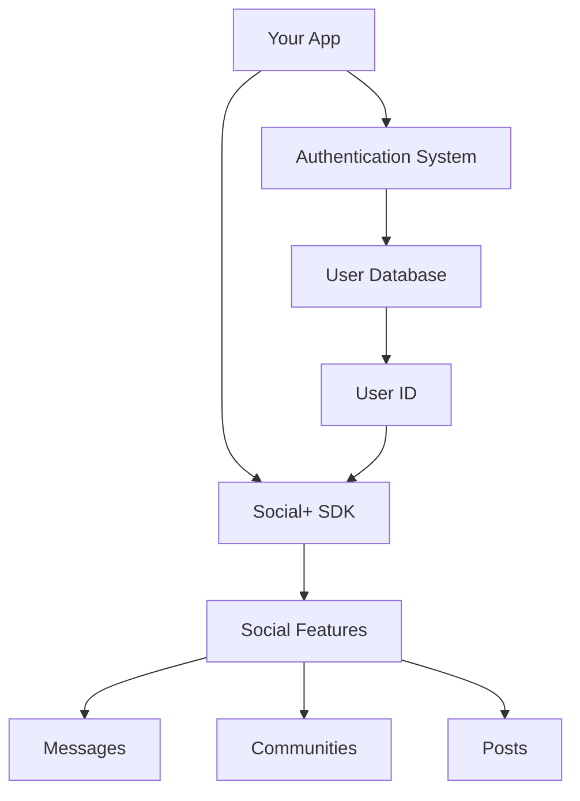
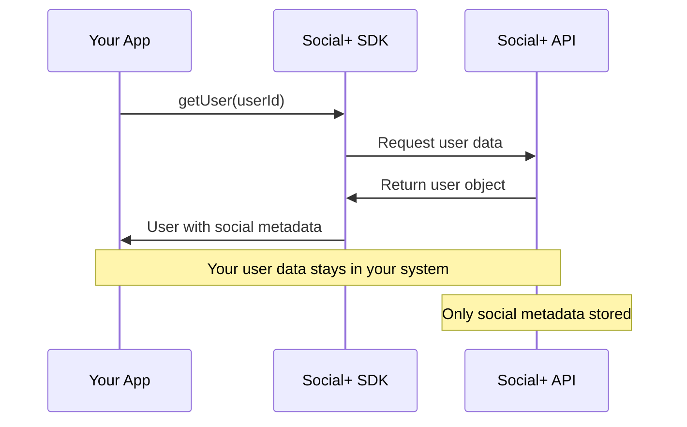
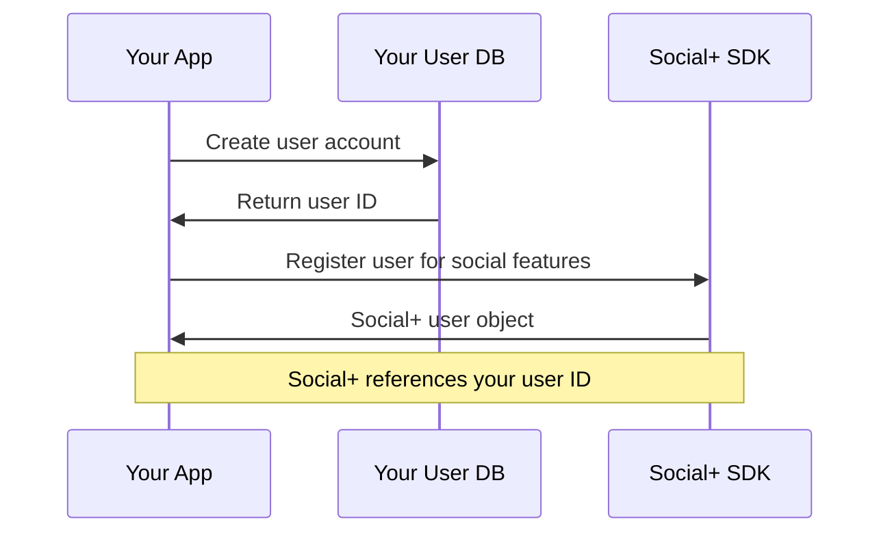

# User Management

Social+ provides flexible user management that integrates seamlessly with your existing user system through federated identity. Manage user profiles, search capabilities, permissions, and social interactions without duplicating user data.

<Info>
**Federated Identity**: Social+ doesn't store user profile data. Instead, it uses your existing user IDs to reference users across all social features.
</Info>

## Quick Start

Get started with user management in minutes:

<Tabs>
  <Tab title="TypeScript">
    ```typescript
    import { UserRepository } from '@amityco/ts-sdk';
    
    const userRepo = new UserRepository(client);
    
    // Get user information
    const user = await userRepo.getUser('user_123');
    
    // Search users
    const users = await userRepo.searchUsers('John');
    ```
  </Tab>
  <Tab title="iOS">
    ```swift
    import AmitySDK
    
    let userRepository = AmityUserRepository(client: client)
    
    // Get user information
    userRepository.getUser(userId: "user_123") { result in
        // Handle result
    }
    ```
  </Tab>
  <Tab title="Android">
    ```kotlin
    val userRepository = AmityUserRepository(client)
    
    // Get user information
    userRepository.getUser("user_123").observeOn(AndroidSchedulers.mainThread())
        .subscribe({ user -> 
            // Handle user
        }, { error ->
            // Handle error
        })
    ```
  </Tab>
  <Tab title="Flutter">
    ```dart
    final userRepo = AmityUserRepository(client);
    
    // Get user information
    final user = await userRepo.getUser('user_123');
    
    // Search users
    final users = await userRepo.searchUsers('John');
    ```
  </Tab>
</Tabs>

## Core Concepts

### Federated Identity Model

Social+ uses a federated approach where user identity is managed across systems:

- **Your Application** - Manages authentication, profiles, and personal data
- **Social+ SDK** - Handles social features using your user IDs as references
- **Immutable IDs** - User identifiers remain constant throughout the user lifecycle

### Architecture Overview



## User ID Best Practices

Choose stable, immutable identifiers for optimal performance:

### ✅ Recommended IDs

- **Database Primary Keys**: `user_12345`, `8a7b9c2d`
- **UUIDs**: `550e8400-e29b-41d4-a716-446655440000`
- **System Generated**: Internal stable identifiers

### ❌ Avoid These IDs

- **Email Addresses**: Can change when users update email
- **Usernames**: Users may want to change usernames
- **Phone Numbers**: Can change or be transferred
- **Social IDs**: External platform dependencies

<Tabs>
  <Tab title="TypeScript">
    ```typescript
    // Good examples
    const userId = "user_8a7b9c2d";     // Database ID
    const userId = "550e8400-e29b-41d4-a716-446655440000"; // UUID
    
    // Avoid these
    const userId = "john.doe@email.com"; // Email can change
    const userId = "johndoe123";         // Username can change
    ```
  </Tab>
  <Tab title="iOS">
    ```swift
    // Good examples
    let userId = "user_8a7b9c2d"     // Database ID
    let userId = UUID().uuidString   // Generated UUID
    
    // Avoid these
    let userId = user.email          // Email can change
    let userId = user.username       // Username can change
    ```
  </Tab>
  <Tab title="Android">
    ```kotlin
    // Good examples
    val userId = "user_8a7b9c2d"     // Database ID
    val userId = UUID.randomUUID().toString() // Generated UUID
    
    // Avoid these
    val userId = user.email          // Email can change
    val userId = user.username       // Username can change
    ```
  </Tab>
  <Tab title="Flutter">
    ```dart
    // Good examples
    final userId = 'user_8a7b9c2d';     // Database ID
    final userId = Uuid().v4();         // Generated UUID
    
    // Avoid these
    final userId = user.email;          // Email can change
    final userId = user.username;       // Username can change
    ```
  </Tab>
</Tabs>

## User Operations

The UserRepository provides comprehensive user management capabilities:

| Operation | Description | Use Case |
|-----------|-------------|----------|
| **Get User** | Retrieve user information by ID | Profile display, user cards |
| **Search Users** | Find users by display name | User discovery, mentions |
| **Query Users** | Get multiple users with filters | Member lists, bulk operations |
| **Update User** | Modify user information | Profile editing |
| **User Permissions** | Check roles and capabilities | Feature access control |
| **Flag/Unflag** | Report or moderate users | Content moderation |

<CardGroup cols={3}>
  <Card title="Get User Info" icon="user" href="./get-user-information">
    Retrieve user profiles and display information
  </Card>
  <Card title="Search Users" icon="magnifying-glass" href="./search-and-query-users">
    Find users by name and discover connections
  </Card>
  <Card title="Update User" icon="pen-to-square" href="./update-user-information">
    Modify user information and preferences
  </Card>
  <Card title="User Permissions" icon="shield-check" href="./user-permission">
    Manage roles and access control
  </Card>
  <Card title="User Tokens" icon="key" href="./user-token-management">
    Handle authentication and session management
  </Card>
  <Card title="Moderation" icon="flag" href="./flag-unflag-user">
    Report and moderate user behavior
  </Card>
</CardGroup>

## User Data Flow

### Reading User Information



### User Creation Flow



## Platform Support

| Feature | TypeScript | iOS | Android | Flutter |
|---------|------------|-----|---------|---------|
| User Repository | ✅ | ✅ | ✅ | ✅ |
| Search & Query | ✅ | ✅ | ✅ | ✅ |
| User Updates | ✅ | ✅ | ✅ | ✅ |
| Permissions | ✅ | ✅ | ✅ | ✅ |
| Token Management | ✅ | ✅ | ✅ | ✅ |
| Moderation | ✅ | ✅ | ✅ | ✅ |

## Best Practices

<Tip>
**Data Ownership**: Social+ enhances your existing user system rather than replacing it. You maintain full control over user data and privacy compliance.
</Tip>

### Identity Management

- **Stable IDs** - Use immutable identifiers that won't change
- **Privacy First** - Keep sensitive data in your own systems
- **Performance** - Cache user information for better UI responsiveness
- **Consistency** - Maintain consistent user identity across features

### Integration Patterns

- **Lazy Loading** - Fetch user data only when needed
- **Batch Operations** - Use bulk queries for better performance
- **Error Handling** - Gracefully handle missing or invalid users
- **Caching Strategy** - Implement client-side caching for user data

## Security Considerations

<Warning>
**User Validation**: Always validate user IDs and permissions before performing operations to prevent unauthorized access.
</Warning>

- **Input Validation** - Validate user IDs format and length
- **Permission Checks** - Verify user permissions before operations
- **Rate Limiting** - Implement appropriate rate limits for user operations
- **Audit Logging** - Log user operations for security monitoring

## Migration Strategies

### From Other Platforms

If migrating from other social platforms:

1. **Map User IDs** - Create mapping between old and new IDs
2. **Preserve Relationships** - Migrate follows, friends, and connections
3. **Gradual Migration** - Migrate users in batches to minimize disruption
4. **Data Validation** - Verify data integrity throughout migration

### Scaling Considerations

- **Distributed IDs** - Consider distributed ID generation for scale
- **Caching Strategy** - Implement multi-tier caching for user data
- **Database Sharding** - Plan for horizontal scaling of user data
- **Regional Deployment** - Consider geographic distribution

## Next Steps

1. **Choose Your IDs** - Select stable user identifiers
2. **Implement Repository** - Set up UserRepository in your app
3. **Add Search** - Implement user discovery features
4. **Configure Permissions** - Set up role-based access control
5. **Test Integration** - Validate user operations work correctly

<CardGroup cols={2}>
  <Card title="Get Started" href="./get-user-information">
    Begin with basic user information retrieval
  </Card>
  <Card title="Advanced Features" href="./user-permission">
    Explore permissions and access control
  </Card>
</CardGroup>
