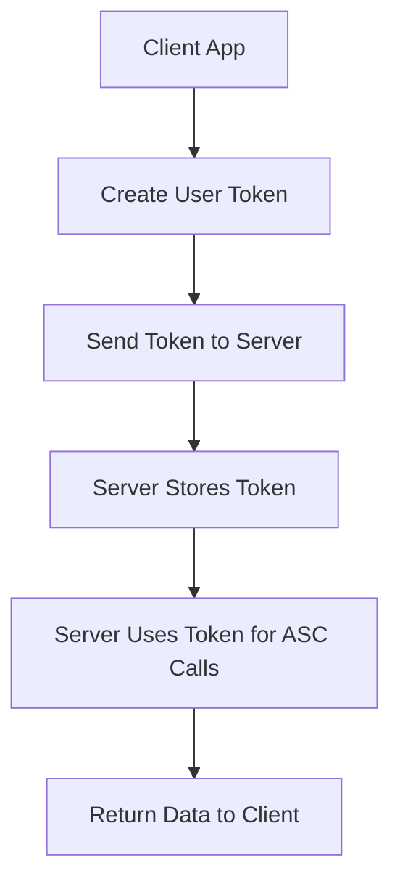

## Overview

User token management provides secure authentication mechanisms for Social+ applications. The `AmityUserTokenManager` handles user credentials including access tokens for Beta features and secure authentication flows.

<Info>
User tokens are primarily used for server-side integrations and Beta features. Most client applications use the standard login flow.
</Info>

<Warning>
Social+ SDK does not provide client-side APIs for user token usage. To utilize user tokens, you must interact with ASC services through your own server-side implementation.
</Warning>

## Token Types

<CardGroup cols={2}>
  <Card title="Access Tokens" icon="key">
    For accessing Beta features and advanced APIs
  </Card>
  <Card title="Auth Tokens" icon="shield">
    For secure mode authentication
  </Card>
</CardGroup>

## Creating User Tokens

Generate user tokens with customizable parameters for different authentication scenarios.

### Parameters

| Parameter | Type | Required | Description |
|-----------|------|----------|-------------|
| `userId` | String | ✅ | Unique identifier for the user |
| `displayName` | String | ❌ | User's display name |
| `authToken` | String | ❌ | Authentication token for secure mode |

### Implementation

<Tabs>
  <Tab title="iOS">
    ```swift
    // Basic token creation
    let tokenManager = AmityUserTokenManager()
    
    // Create token with userId only
    tokenManager.createToken(
        userId: "user123"
    ) { result in
        switch result {
        case .success(let token):
            print("Token created: \(token)")
            // Store token securely for server-side usage
        case .failure(let error):
            print("Token creation failed: \(error.localizedDescription)")
        }
    }
    
    // Create token with display name
    tokenManager.createToken(
        userId: "user123",
        displayName: "John Doe"
    ) { result in
        // Handle result
    }
    
    // Create token with auth token (secure mode)
    tokenManager.createToken(
        userId: "user123",
        displayName: "John Doe",
        authToken: "secure-auth-token"
    ) { result in
        // Handle result
    }
    ```
  </Tab>
  
  <Tab title="Android">
    ```kotlin
    // Basic token creation
    val tokenManager = AmityUserTokenManager(client)
    
    // Create token with userId only
    tokenManager.createToken("user123")
        .observeOn(AndroidSchedulers.mainThread())
        .subscribe({ token ->
            Log.d("Token", "Token created: $token")
            // Store token securely for server-side usage
        }, { error ->
            Log.e("Token", "Token creation failed: ${error.message}")
        })
    
    // Create token with display name
    tokenManager.createToken(
        userId = "user123",
        displayName = "John Doe"
    ).observeOn(AndroidSchedulers.mainThread())
     .subscribe({ token ->
         // Handle success
     }, { error ->
         // Handle error
     })
    
    // Create token with auth token (secure mode)
    tokenManager.createToken(
        userId = "user123",
        displayName = "John Doe",
        authToken = "secure-auth-token"
    ).observeOn(AndroidSchedulers.mainThread())
     .subscribe({ token ->
         // Handle success
     }, { error ->
         // Handle error
     })
    ```
  </Tab>
  
  <Tab title="TypeScript">
    ```typescript
    // Basic token creation
    try {
      const token = await AmityUserTokenManager.createToken({
        userId: 'user123'
      });
      
      console.log('Token created:', token);
      // Store token securely for server-side usage
    } catch (error) {
      console.error('Token creation failed:', error);
    }
    
    // Create token with display name
    try {
      const token = await AmityUserTokenManager.createToken({
        userId: 'user123',
        displayName: 'John Doe'
      });
      
      // Handle success
    } catch (error) {
      // Handle error
    }
    
    // Create token with auth token (secure mode)
    try {
      const token = await AmityUserTokenManager.createToken({
        userId: 'user123',
        displayName: 'John Doe',
        authToken: 'secure-auth-token'
      });
      
      // Send token to your server for ASC service calls
      await sendTokenToServer(token);
    } catch (error) {
      console.error('Token creation failed:', error);
    }
    ```
  </Tab>
  
  <Tab title="Flutter">
    ```dart
    // Basic token creation
    try {
      final token = await AmityUserTokenManager.createToken(
        userId: 'user123'
      );
      
      print('Token created: $token');
      // Store token securely for server-side usage
    } catch (error) {
      print('Token creation failed: $error');
    }
    
    // Create token with display name
    try {
      final token = await AmityUserTokenManager.createToken(
        userId: 'user123',
        displayName: 'John Doe'
      );
      
      // Handle success
    } catch (error) {
      // Handle error
    }
    
    // Create token with auth token (secure mode)
    try {
      final token = await AmityUserTokenManager.createToken(
        userId: 'user123',
        displayName: 'John Doe',
        authToken: 'secure-auth-token'
      );
      
      // Send token to your server for ASC service calls
      await sendTokenToServer(token);
    } catch (error) {
      print('Token creation failed: $error');
    }
    ```
  </Tab>
</Tabs>

## Server-Side Token Usage

Since client SDKs don't support direct token usage, here's how to implement server-side token handling:

<Tabs>
  <Tab title="Node.js">
    ```javascript
    // Server-side token usage example
    const express = require('express');
    const axios = require('axios');
    
    const app = express();
    
    // Endpoint to create and use tokens
    app.post('/api/user-token-action', async (req, res) => {
      try {
        const { userId, action, data } = req.body;
        
        // Create user token (this would typically be cached)
        const token = await createUserToken(userId);
        
        // Use token to call ASC services
        const response = await axios.post(`${ASC_BASE_URL}/api/${action}`, data, {
          headers: {
            'Authorization': `Bearer ${token}`,
            'Content-Type': 'application/json'
          }
        });
        
        res.json(response.data);
      } catch (error) {
        console.error('ASC service call failed:', error);
        res.status(500).json({ error: 'Service call failed' });
      }
    });
    
    async function createUserToken(userId) {
      // Implementation depends on your setup
      // This could call Social+ APIs or use cached tokens
      return await AmityUserTokenManager.createToken({ userId });
    }
    ```
  </Tab>
</Tabs>

## Token Security

<AccordionGroup>
  <Accordion title="Secure Storage">
    - Store tokens securely on the server side
    - Use encryption for token storage
    - Implement token rotation policies
    - Never expose tokens in client-side code
  </Accordion>
  
  <Accordion title="Token Lifecycle">
    - Set appropriate token expiration times
    - Implement token refresh mechanisms
    - Revoke tokens when users are deactivated
    - Monitor token usage for anomalies
  </Accordion>
  
  <Accordion title="Network Security">
    - Always use HTTPS for token transmission
    - Implement proper authentication headers
    - Use secure communication channels
    - Log token usage for audit purposes
  </Accordion>
</AccordionGroup>

## Integration Patterns

### Authentication Flow



### Secure Mode Integration

When using Secure Mode, user tokens work with authentication tokens:

<Tabs>
  <Tab title="TypeScript">
    ```typescript
    // Secure mode token creation
    const createSecureToken = async (userId: string, authToken: string) => {
      try {
        // Create user token with auth token
        const userToken = await AmityUserTokenManager.createToken({
          userId,
          authToken
        });
        
        // Send to server for secure operations
        const response = await fetch('/api/secure-action', {
          method: 'POST',
          headers: {
            'Content-Type': 'application/json',
          },
          body: JSON.stringify({
            userToken,
            action: 'protected-operation'
          })
        });
        
        return await response.json();
      } catch (error) {
        console.error('Secure token creation failed:', error);
        throw error;
      }
    };
    ```
  </Tab>
</Tabs>

## Best Practices

<AccordionGroup>
  <Accordion title="Token Management">
    - Cache tokens to avoid unnecessary creation
    - Implement token validation before usage
    - Use connection pooling for better performance
    - Handle token expiration gracefully
  </Accordion>
  
  <Accordion title="Error Handling">
    - Implement comprehensive error handling
    - Log all token operations for debugging
    - Provide meaningful error messages
    - Implement retry logic for transient failures
  </Accordion>
  
  <Accordion title="Performance">
    - Batch token operations when possible
    - Use background processing for token creation
    - Implement caching strategies
    - Monitor token usage patterns
  </Accordion>
</AccordionGroup>

## Related Security Features

<CardGroup cols={2}>
  <Card title="Secure Mode" href="../../../analytics-and-moderation/console/settings/security" icon="shield">
    Learn about Social+ security settings and configurations
  </Card>
  <Card title="User Authentication" href="./create-user" icon="key">
    Understand standard user login and authentication
  </Card>
</CardGroup>

## Next Steps

<CardGroup cols={2}>
  <Card title="User Permissions" href="./user-permission" icon="shield-check">
    Learn about user roles and permissions
  </Card>
  <Card title="API Integration" href="../../../api-reference/introduction" icon="code">
    Explore Social+ API documentation
  </Card>
</CardGroup>