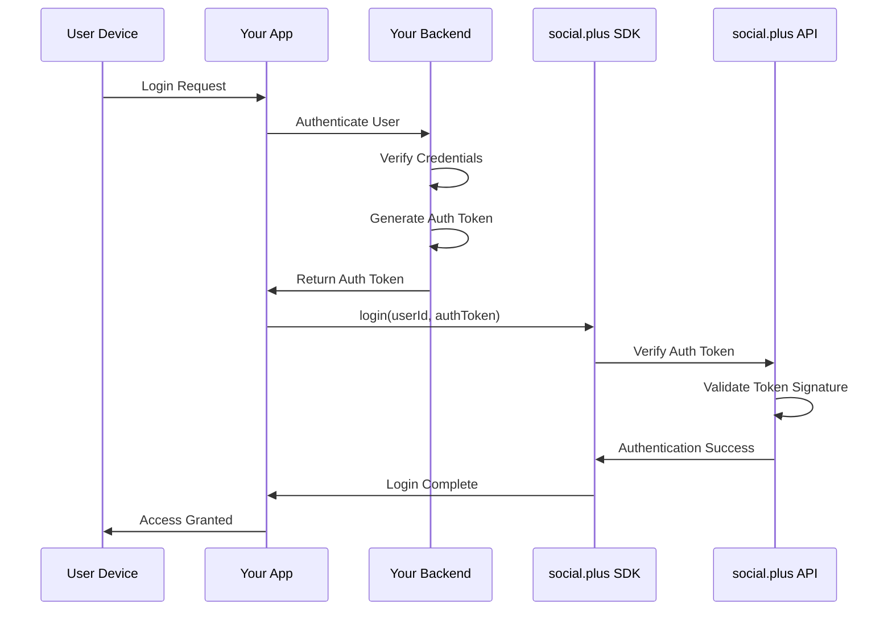
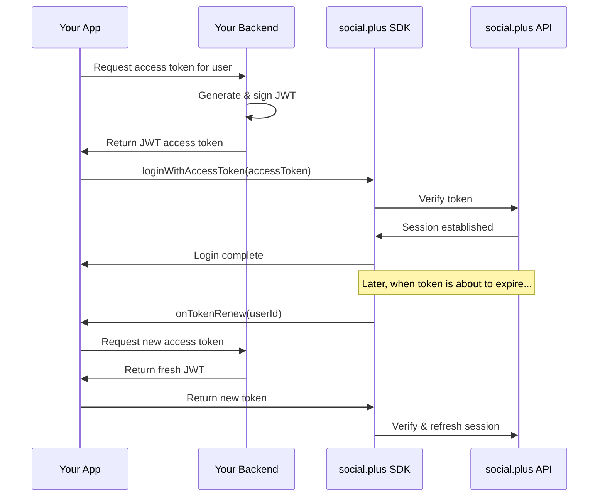

## Overview & Concepts

### Authentication in social.plus

social.plus uses a **dual authentication approach** to ensure both application security and user verification:

<CardGroup cols={2}>
  <Card title="API Key" icon="key">
    **Purpose**: Identifies your application to social.plus servers\
    **Scope**: Application-level authentication\
    **Usage**: Required for SDK initialization\
    **Security**: Keep secure, never expose in client code
  </Card>
  <Card title="Auth Token" icon="shield-check">
    **Purpose**: Server-to-server verification that the user is validated by your backend\
    **Scope**: User-level authentication with your system\
    **Usage**: Optional for development, required for production\
    **Security**: Generated by your backend, proves user is legitimate
  </Card>
</CardGroup>

### How Auth Tokens Work

Auth tokens enable **server-to-server communication** between social.plus and your backend:

<Steps>
  <Step title="User Authentication">
    Your app authenticates the user with your own authentication system (login, OAuth, etc.)
  </Step>
  <Step title="Backend Token Generation">
    Your backend server generates an auth token for the verified user and sends it to your app. [Learn how to implement this →](/social-plus-sdk/getting-started/authentication#backend-token-generation)
  </Step>
  <Step title="social.plus Verification">
    When your app logs into social.plus, the auth token proves to social.plus that your backend has verified this user
  </Step>
  <Step title="Secure Communication">
    social.plus can now trust that this user session is legitimate and validated by your system
  </Step>
</Steps>



<Info>
  **Why Auth Tokens?** This approach ensures that only users who have been properly authenticated by your backend can access social.plus features, maintaining security and preventing unauthorized access.
</Info>

### When Do You Need Each?

<Tabs>
  <Tab title="Production">
    ```typescript
    // Production mode - API key + auth tokens
    const client = Client.createClient({
      apiKey: 'your-prod-api-key',
      region: 'sg'
    });
    
    // Secure login with auth token from your backend
    await client.login({
      userId: 'user-123',
      displayName: 'John Doe',
      authToken: 'token-generated-by-your-backend' // Proves user is verified by your system
    });
    ```

    <Warning>
      Auth tokens must be generated by your secure backend after verifying the user. This ensures server-to-server trust between social.plus and your authentication system.
    </Warning>
  </Tab>
  <Tab title="Development">
    ```typescript
    // Development mode - API key only (for testing)
    const client = Client.createClient({
      apiKey: 'your-dev-api-key',
      region: 'sg'
    });
    
    // Simple login without auth token (development/testing only)
    await client.login({
      userId: 'dev-user-123',
      displayName: 'Developer'
    });
    ```

    <Note>
      Development mode bypasses auth token requirements for easier testing. Never use this in production as it skips your backend verification.
    </Note>
  </Tab>
</Tabs>

## Quick Start (Basic Authentication)

### Step 1: Initialize the SDK

Start by setting up the social.plus client with your API key:

<CodeGroup>

```swift iOS
let client = try! AmityClient(apiKey: "your-api-key", region: .SG)
```


```kotlin Android
AmityCoreClient.setup(
    apiKey = "your-api-key",
    endpoint = AmityEndpoint.SG
)
```


```typescript TypeScript
import { Client } from '@amityco/ts-sdk';

const client = Client.createClient({
  apiKey: 'your-api-key',
  region: 'sg'
});
```


```dart Flutter
await AmityCoreClient.setup(
  option: AmityCoreClientOption.create(
    apiKey: 'your-api-key',
    endpoint: AmityEndpoint.SG
  )
);
```

</CodeGroup>

### Step 2: Login User

Authenticate users to access social.plus features:

<CodeGroup>

```swift iOS
Task { @MainActor in
    do {
        try await client.login(
            userId: "user-123",
            displayName: "John Doe",
            authToken: "your-auth-token", // Optional for development
            sessionHandler: sessionHandler
        )
        print("Login successful")
    } catch {
        print("Login failed: \(error)")
    }
}
```


```kotlin Android
AmityCoreClient.login(userId = "user-123")
    .displayName(displayName = "John Doe")
    .authToken(authToken) // Optional for development
    .sessionHandler(sessionHandler)
    .build()
    .submit()
    .doOnComplete {
        // Login successful
    }
    .doOnError { error ->
        // Login failed
    }
    .subscribe()
```


```typescript TypeScript
try {
    await client.login({
        userId: 'user-123',
        displayName: 'John Doe'
        authToken: 'your-auth-token', // Optional for development
    }, sessionHandler);
    console.log('Login successful');
} catch (error) {
    console.error('Login failed:', error);
}
```


```dart Flutter
try {
    await AmityCoreClient.login('user-123')
        .displayName('John Doe')
        .authToken('your-auth-token') // Optional for development
        .submit();
    print('Login successful');
} catch (error) {
    print('Login failed: $error');
}
```

</CodeGroup>

### Step 3: Check Authentication Status

Verify if a user is currently logged in:

<CodeGroup>

```swift iOS
if (client.sessionState == .established) {
    let currentUserId = client.getCurrentUserId()
    print("Current user: \(currentUserId)")
} else {
    // Proceed to social.plus Authentication
    authenticateToSocialPlus()
}
```


```kotlin Android
if (AmityCoreClient.getCurrentSessionState() == SessionState.Established) {
    val currentUserId = AmityCoreClient.getCurrentUserId()
    Log.d("Auth", "Current user: $currentUserId")
} else {
    // Proceed to social.plus Authentication
    authenticateToSocialPlus()
}
```


```typescript TypeScript
const client = Client.getActiveClient();

if (client.sessionState === Amity.SessionStates.ESTABLISHED) {
    const currentUserId = client.userId;
    console.log('Current user:', currentUserId);
} else {
    // Proceed to social.plus Authentication
    authenticateToSocialPlus();
}
```


```dart Flutter
if (AmityCoreClient.observeSessionState().first == SessionState.Established) {
    final currentUserId = AmityCoreClient.getCurrentUserId();
    print('Current user: $currentUserId');
} else {
    // Proceed to social.plus Authentication
    authenticateToSocialPlus();
}
```

</CodeGroup>

### Step 4: Logout

End the user session: For an extra layer of security, which ensures accessToken revocation prior to performing logout(). Should the SDK fail to revoke the accessToken, the SDK will not proceed to logout and will throw an exception to notify the failure.

<CodeGroup>

```swift iOS
do {
    try await client.secureLogout()
} catch {
    /// Handle error from revoking accessToken here
}
```


```kotlin Android
    AmityCoreClient.secureLogout()
        .doOnComplete {
            // Void
        }
        .doOnError {
            // Exception
        }
        .subscribe()
```


```typescript TypeScript
const handleSecureLogout = async () => {
  await Client.secureLogout();
};
handleSecureLogout();
```


```dart Flutter
try {
     await AmityCoreClient.secureLogout();
} catch {
    /// Handle error from revoking accessToken here
}
```

</CodeGroup>

## Understanding Session States

Session states indicate what's happening with user authentication. social.plus SDK automatically manages these states according to the flow shown in the diagram below:

<CardGroup cols={2}>
  <Card title="notLoggedIn" icon="user-slash">
    **Ready for login** - user needs to authenticate\
    _Entry points_: App start (no session), logout, login failure
  </Card>
  <Card title="establishing" icon="spinner">
    **Login in progress** - authentication being processed\
    _Entry point_: When login() is called from notLoggedIn state
  </Card>
  <Card title="established" icon="check">
    **Fully authenticated** - SDK ready, all features available\
    _Entry points_: Successful login, successful token renewal
  </Card>
  <Card title="tokenExpired" icon="clock">
    **Token renewal needed** - automatic renewal attempted\
    _Entry point_: When auth token expires during established state
  </Card>
  <Card title="terminated" icon="ban">
    **Session forcibly ended** - user banned or deleted\
    _Entry points_: User banned/deleted from established or tokenExpired states
  </Card>
</CardGroup>

### Session Flow

Understanding the complete session state flow helps you build responsive apps:

<Steps>
  <Step title="SDK Initialization">
    **App starts**: Always begins in the `start` state, then immediately moves to:

    - **No saved session**: Moves to `notLoggedIn` state
    - **Has saved session**: Moves to `established` state (if session valid)
  </Step>
  <Step title="Login Process">
    **User attempts login**:

    - `notLoggedIn` → `establishing` (login in progress)
    - **Login succeeds**: `establishing` → `established`
    - **Login fails**: `establishing` → `notLoggedIn`
  </Step>
  <Step title="Active Session Management">
    **`During active use in established state`**:

    - **Token expires**: `established` → `tokenExpired`
    - **Token renewed successfully**: `tokenExpired` → `established`
    - **User banned/deleted**: `established` → `terminated`
    - **Manual logout**: `established` → `notLoggedIn`
  </Step>
  <Step title="Token Expiration Handling">
    **`When in tokenExpired state`**:

    - **Auto-renewal succeeds**: Returns to `established` state
    - **Auto-renewal fails**: User may need to re-authenticate
    - **User banned during renewal**: Moves to `terminated` state
    - **Manual logout**: Moves to `notLoggedIn` state
  </Step>
  <Step title="Session Termination">
    **`From terminated state`**:

    - Only way out is through logout → `notLoggedIn`
    - User must re-authenticate to access features again
  </Step>
</Steps>

<Info>
  Session state diagram image temporarily removed while the asset is unavailable. The textual flow description above preserves the full logic.
</Info>

### Observing Session State

Monitor session state changes to handle authentication in your app:

<Tabs>
  <Tab title="iOS">
    ```swift
    var cancellable: AnyCancellable?
    // Observe session state changes
    cancellable = client.$sessionState.sink { sessionState in
        switch sessionState {
        case .notLoggedIn:
            // Show login screen
            self?.showLogin()
        case .establishing:
            // Show loading indicator
            self?.showLoading()
        case .established:
            // Hide loading indicator, proceed to app
            self?.hideLoading()
            self?.proceedToApp()
        case .tokenExpired:
            // Attempt to refresh token (Optional)
            self?.showTokenRefreshIndicator()
        case .terminated:
            // Handle session termination
            self?.handleTermination()
        }
    }
    ```
  </Tab>
  <Tab title="Android">
    ```kotlin
    // Observe session state
    AmityCoreClient.observeSessionState()
                .subscribeOn(Schedulers.io())
                .observeOn(AndroidSchedulers.mainThread())
                .doOnNext { sessionState: SessionState ->
                    when (state) {
                        AmitySessionState.NOT_LOGGED_IN -> {
                            // Show login screen
                            showLogin()
                        }
                        AmitySessionState.ESTABLISHING -> {
                            // Show loading indicator
                            showLoading()
                        }
                        AmitySessionState.ESTABLISHED -> {
                            // Hide loading indicator, proceed to app
                            hideLoading()
                            proceedToApp()
                        }
                        AmitySessionState.TOKEN_EXPIRED -> {
                            // Attempt to refresh token (Optional)
                            showTokenRefreshIndicator()
                        }
                        AmitySessionState.TERMINATED -> {
                            // Handle session termination
                            handleTermination()
                        }
                    }
                }
                .doOnError {
                    // Exception
                }
                .subscribe()
    ```
  </Tab>
  <Tab title="TypesScript">
    ```typescript
    // Listen to session state changes
    import { Client } from '@amityco/ts-sdk';
    import React, { FC, useEffect, useState } from 'react';
    
    const SessionState: FC = () => {
        const [sessionState, setSessionState] = useState('');
        useEffect(() => {
            return Client.onSessionStateChange((state: Amity.SessionStates) => {
                switch (state) {
                    case 'notLoggedIn':
                        // Show login form
                        showLoginForm();
                        break;
                    case 'establishing':
                        // Show loading spinner
                        showLoadingSpinner();
                        break;
                    case 'established':
                        // Hide spinner, navigate to app
                        hideLoadingSpinner();
                        navigateToApp();
                        break;
                    case 'tokenExpired':
                        // Attempt to refresh token (Optional)
                         showTokenRefreshIndicator()
                        break;
                    case 'terminated':
                        // Handle termination
                        handleSessionTermination();
                        break;
                }
            }
            );
        }, []);
    
      return null;
    };
    ```
  </Tab>
  <Tab title="Flutter">
    ```dart
    // Listen to session state changes
    AmityCoreClient.observeSessionState().listen((state) {
      switch (state) {
        case AmitySessionState.notLoggedIn:
          // Show login screen
          showLoginScreen();
          break;
        case AmitySessionState.establishing:
          // Show loading indicator
          showLoadingIndicator();
          break;
        case AmitySessionState.established:
          // Hide loading indicator, proceed to app
          hideLoadingIndicator();
          proceedToApp();
          break;
        case AmitySessionState.tokenExpired:
          // Attempt to refresh token (Optional)
          showTokenRefreshIndicator()
          break;
        case AmitySessionState.terminated:
          // Handle session termination
          handleSessionTermination();
          break;
      }
    });
    ```
  </Tab>
</Tabs>

## Advanced Session Management

For production apps, you'll need sophisticated session handling with automatic token refresh:

### Session Handlers for Token Refresh

Session handlers automatically manage token lifecycle:

<Tabs>
  <Tab title="iOS">
    ```swift
    class ProductionSessionHandler: AmitySessionHandler {
        func sessionWillRenewAccessToken(renewal: AccessTokenRenewal) {
            // Call your backend to get a fresh token
            AuthService.shared.refreshToken { result in
                switch result {
                case .success(let newToken):
                    renewal.renewWithAuthToken(withAuthToken: newToken)
                case .failure(let error):
                    print("Token refresh failed: \(error)")
                    renewal.unableToRetrieveAuthToken()
                }
            }
        }
    }
    
    // Use during login
    let sessionHandler = ProductionSessionHandler()
    try await client.login(
        userId: userId,
        displayName: displayName,
        authToken: authToken,
        sessionHandler: sessionHandler
    )
    ```
  </Tab>
  <Tab title="Android">
    ```kotlin
    class ProductionSessionHandler : SessionHandler {
        override fun sessionWillRenewAccessToken(renewal: AccessTokenRenewal) {
            // Call your backend to refresh token
            authRepository.refreshToken { newToken ->
                if (newToken != null) {
                    renewal.renewWithAuthToken(newToken)
                } else {
                    renewal.unableToRetrieveAuthToken()
                }
            }
        }
    }
    
    // Use during login
    val sessionHandler = ProductionSessionHandler()
    AmityCoreClient.login(userId)
        .displayName(displayName)
        .authToken(authToken)
        .sessionHandler(sessionHandler)
        .build()
        .submit()
    ```
  </Tab>
  <Tab title="TypesScript">
    ```typescript
    interface SessionHandler {
        sessionWillRenewAccessToken: (renewal: TokenRenewal) => void;
    }
    
    const createProductionSessionHandler = (): Amity.SessionHandler => ({
        sessionWillRenewAccessToken: async (renewal: Amity.AccessTokenRenewal) => {
            try {
                // Request fresh token from your backend (server-to-server)
                // Your backend re-verifies the user and generates new token
                const newToken = await AuthService.refreshToken();
                renewal.renewWithAuthToken(newToken);
            } catch (error) {
                console.error('Token refresh failed:', error);
                renewal.unableToRetrieveAuthToken();
            }
        }
    });
    
    // Use when logging in with backend-verified token
    await client.login({
            userId: 'user-123',
            displayName: 'John Doe'
            authToken: 'your-auth-token',
        }, sessionHandler);
    ```
  </Tab>
  <Tab title="Flutter">
    ```Dart
    Function(AccessTokenRenewal) getProductionSessionHandler() {
      return (AccessTokenRenewal renewal) async {
        try {
          final myAuthToken = await getAuthTokenFromMyServer();
          renewal.renewWithAuthToken(myAuthToken);
        } catch (error) {
          renewal.unableToRetrieveAuthToken();
        }
      };
    }
    
    void authenticateUser() async {
    // Use during login
      try {
        await AmityCoreClient.login(
          'userId',
          sessionHandler: getProductionSessionHandler(),
        ).displayName('displayName').authToken('authToken').submit();
      } catch (error) {
        // Handle authentication error
      }
    }
    ```
  </Tab>
</Tabs>

## Alternative: Login with Access Token

By default, social.plus SDK handles access token management for you — you provide a `userId` and an optional `authToken`, and the SDK takes care of obtaining and refreshing access tokens behind the scenes.

**Login with Access Token** is an alternative authentication method for customers who want to manage the entire token lifecycle themselves. Instead of letting the SDK obtain tokens, your backend issues a JWT access token directly, and your app passes it to the SDK.

<Note>
**Most developers should use the default login flow** described in the [Quick Start](#quick-start-basic-authentication) section above. Only use this approach if you have a specific need listed below.
</Note>

### When to Use This

<CardGroup cols={2}>
  <Card title="SSO Integration" icon="right-to-bracket">
    Your app already has a centralized authentication system and you want social.plus sessions to be issued as part of that flow — no extra network hop from the client.
  </Card>
  <Card title="Reduce Client-Side Dependencies" icon="server">
    You want to eliminate the client-to-social.plus token exchange during login so that social.plus API availability does not block your app's core login experience.
  </Card>
</CardGroup>

### Default Login vs. Access Token Login

| | **Default Login** | **Login with Access Token** |
|---|---|---|
| **SDK method** | `login(userId, authToken)` | `loginWithAccessToken(accessToken)` |
| **Who obtains the access token?** | The SDK handles it automatically | Your backend issues a JWT and your app passes it to the SDK |
| **Token renewal** | Session handler (`sessionWillRenewAccessToken`) | Access token handler (`onTokenRenew`) |
| **Best for** | Most integrations | SSO, custom auth backends, decoupled architectures |
| **Client-to-social.plus call during login?** | Yes — SDK exchanges credentials for a token | No — token is pre-issued by your backend |

### How It Works



### Implementation

Integration requires three steps: implement a token handler, register it, then login.

<Steps>
  <Step title="Implement an Access Token Handler">
    Create a handler that the SDK will call whenever the token needs renewal. Your handler should request a fresh JWT from your backend.
  </Step>
  <Step title="Register the Handler">
    Call `setAccessTokenHandler()` **before** logging in. This tells the SDK how to obtain a new token when the current one expires.
  </Step>
  <Step title="Login with Your Access Token">
    Call `loginWithAccessToken()` with the JWT your backend issued. The SDK verifies it with social.plus and establishes the session.
  </Step>
</Steps>

<Tabs>
  <Tab title="iOS">
    ```swift
    // 1. Implement the AccessTokenHandler protocol.
    //    The SDK calls `onTokenRenew` when the access token is expired
    //    or about to expire. You must return a fresh JWT obtained from
    //    your own authentication backend.
    class MyTokenHandler: AccessTokenHandler {
        func onTokenRenew(userId: String) async throws -> String {
            // Use the provided userId to request a new JWT
            // from your authentication backend.
            let newToken = try! await fetchNewTokenFromBackend(userId: userId)
            return newToken
        }
    }

    // 2. Register the handler BEFORE calling loginWithAccessToken.
    //    The handler must be set first so the SDK can invoke it
    //    whenever a token renewal is needed.
    let client = try! AmityClient(apiKey: "<api-key>")
    let tokenHandler = MyTokenHandler()
    client.setAccessTokenHandler(tokenHandler)

    // 3. Now login with the initial access token.
    //    On subsequent token renewals, the SDK will automatically
    //    call onTokenRenew and re-authenticate using the returned JWT.
    try! await client.loginWithAccessToken(accessToken: initialAccessToken)
    ```
  </Tab>
  <Tab title="Android">
    ```kotlin
    // 1. Implement the AccessTokenHandler interface.
    //    The SDK calls `onTokenRenew` when the access token is expired
    //    or about to expire. You must return a fresh JWT obtained from
    //    your own authentication backend.
    val handler = object : AccessTokenHandler {
      override suspend fun onTokenRenew(userId: String): String {
        // get new token from your api
        val response = myApiService.refreshToken(userId)
        return response.accessToken
      }
    }

    // 2. Register the handler BEFORE calling loginWithAccessToken.
    //    The handler must be set first so the SDK can invoke it
    //    whenever a token renewal is needed.
    AmityCoreClient.setAccessTokenHandler(handler)

    // 3. Now login with the initial access token.
    //    On subsequent token renewals, the SDK will automatically
    //    call onTokenRenew and re-authenticate using the returned JWT.
    AmityCoreClient.loginWithAccessToken(accessToken)
      .build()
      .submit()
      .subscribe()
    ```
  </Tab>
  <Tab title="TypeScript">
    ```typescript
    import { Client } from "@amityco/ts-sdk";

    // 1. Define custom token handler.
    //    The SDK calls `onTokenRenew` when the access token is expired
    //    or about to expire. You must return a fresh JWT obtained from
    //    your own authentication backend.
    const tokenHandler = {
      async onTokenRenew(userId: string): Promise<string> {
        // Request new JWT from your authentication backend
        const response = await fetch("https://your-backend.com/api/refresh-token", {
          method: "POST",
          credentials: "include",
          userId,
        });

        const data = await response.json();
        return data.accessToken;
      },
    };

    // 2. Register the handler BEFORE calling loginWithAccessToken.
    //    The handler must be set first so the SDK can invoke it
    //    whenever a token renewal is needed.
    Client.setAccessTokenHandler(tokenHandler);

    // 3. Now login with the initial access token.
    //    On subsequent token renewals, the SDK will automatically
    //    call onTokenRenew and re-authenticate using the returned JWT.
    await Client.loginWithAccessToken(initialAccessToken);
    ```
  </Tab>
</Tabs>

<Warning>
**Handler must be registered first.** Always call `setAccessTokenHandler()` before `loginWithAccessToken()`. If no handler is registered, the SDK cannot renew expired tokens and will throw an error.
</Warning>

## Security Best Practices

### Production Token Management

<AccordionGroup>
  <Accordion title="Backend Token Generation" icon="server">
    Auth tokens must be generated by your secure backend to establish server-to-server trust with social.plus.

    Refer to the general API Reference introduction until the dedicated authentication endpoint page is published.

    ```javascript
    // Example Node.js backend - generates tokens for verified users
    app.post('/api/auth/social-plus-token', async (req, res) => {
      const { userId } = req.body;
      
      // STEP 1: Verify user is authenticated in YOUR system
      const user = await verifyUserInYourSystem(userId);
      if (!user) {
        return res.status(401).json({ error: 'User not authenticated in your system' });
      }
      
      // STEP 2: Generate social.plus auth token for this verified user
      const authToken = generateSocialPlusToken(userId);
      
      // STEP 3: Return token to your app for social.plus login
      res.json({ 
        authToken,
        message: 'Token generated for verified user'
      });
    });
    ```

    **Why this approach?**

    - Your backend vouches for the user's authenticity to social.plus
    - social.plus trusts users who have valid tokens from your verified backend
    - Prevents unauthorized access to social.plus features
    - Maintains security boundary between your auth system and social.plus
  </Accordion>
</AccordionGroup>

### Authentication Best Practices

<AccordionGroup>
  <Accordion title="Do's ✅" icon="check">
    - **Monitor session state changes** in your app's main navigation logic
    - **Handle token expiration gracefully** with automatic refresh
    - **Provide clear feedback** to users during state transitions
    - **Clean up subscriptions** when components unmount
    - **Use secure logout** when security is critical
    - **Store tokens securely** using platform-specific secure storage
  </Accordion>
  <Accordion title="Don'ts ❌" icon="x">
    - **Don't ignore session state changes** - they indicate important authentication events
    - **Don't store sensitive data** when user is not authenticated
    - **Don't make API calls** before reaching `established` state
    - **`Don't forget to handle the terminated state`** - users may be banned
    - **Don't expose API keys** in client-side code
    - **Don't use plain text storage** for auth tokens
  </Accordion>
</AccordionGroup>

## Troubleshooting

<AccordionGroup>
  <Accordion title="Session state stuck in 'establishing'">
    **Symptoms**: Login never completes, app shows loading indefinitely

    **Solutions**:

    1. Check your API key and network connection
    2. Verify authentication token is valid
    3. Ensure you're using the correct region
    4. Check for console errors or network timeouts
  </Accordion>
  <Accordion title="Frequent token expiration">
    **Symptoms**: Users get logged out too often

    **Solutions**:

    1. Check your backend token expiration settings
    2. Verify session handler implementation
    3. Ensure token refresh logic works correctly
    4. Consider longer token expiration for better UX
  </Accordion>
  <Accordion title="Session handler not called">
    **Symptoms**: Tokens don't refresh automatically

    **Solutions**:

    1. Verify you're passing the session handler during login
    2. Check that your backend token has appropriate expiration
    3. Ensure session handler implementation handles errors
    4. Test with shorter token expiration for debugging
  </Accordion>
  <Accordion title="App crashes on session state change">
    **Symptoms**: App crashes when authentication state changes

    **Solutions**:

    1. Ensure UI updates happen on the main thread
    2. Handle all possible session states in switch statements
    3. Add proper null checks and error handling
    4. Clean up observers when components unmount
  </Accordion>
  <Accordion title="loginWithAccessToken fails immediately">
    **Symptoms**: Calling `loginWithAccessToken()` throws an error before reaching the server

    **Solutions**:

    1. Ensure you called `setAccessTokenHandler()` **before** `loginWithAccessToken()` — the handler must be registered first
    2. Verify your JWT is well-formed (valid JSON Web Token structure)
    3. Check that the JWT contains the required `userId` claim
    4. Confirm your backend is signing the token with the key configured in the social.plus console
  </Accordion>
  <Accordion title="Access token handler (onTokenRenew) not called">
    **Symptoms**: Token expires but the SDK does not invoke your `onTokenRenew` handler

    **Solutions**:

    1. Verify you logged in via `loginWithAccessToken()` — the handler is only invoked for access-token sessions, not default `login()` sessions
    2. Check that the handler was registered with `setAccessTokenHandler()` before login
    3. Ensure the user is not globally banned — the SDK skips handler invocation for banned users
  </Accordion>
</AccordionGroup>

## Next Steps

<CardGroup cols={2}>
  <Card title="User Management" icon="user" href="/social-plus-sdk/core-concepts/user-management/overview">
    Learn about user profiles and management
  </Card>
  <Card title="Social Module Overview" icon="users" href="/social-plus-sdk/social/README">
    Explore social capabilities structure
  </Card>
  <Card title="Chat Module Overview" icon="comments" href="/social-plus-sdk/chat/overview">
    Add real-time messaging
  </Card>
  <Card title="Console Overview" icon="gauge" href="/analytics-and-moderation/console/overview">
    Configure security and settings in the Console
  </Card>
</CardGroup>