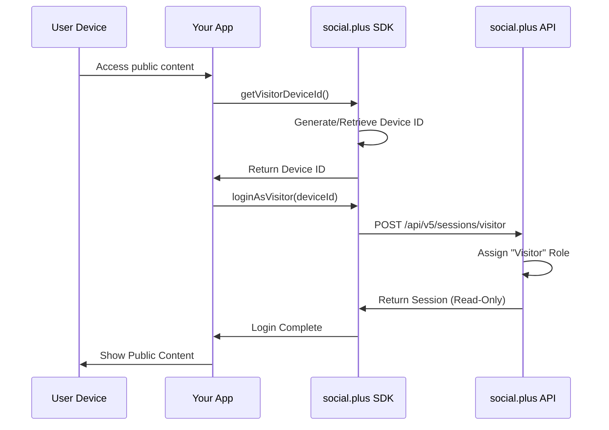

<Warning>
**Visitor mode is not enabled by default.** To enable visitor mode for your network, please contact [support@social.plus](mailto:support@social.plus) with your network details.
</Warning>

## Overview & Concepts

### What is Visitor Mode?

Visitor mode enables **anonymous public access** to your community, allowing users to browse and discover content without requiring authentication. This feature is ideal for growth funnels, SEO optimization, and public content discovery while maintaining platform security and stability.

<CardGroup cols={2}>
<Card title="Visitor Users" icon="eye">
**Purpose**: Anonymous users who browse public content  
**Access**: Read-only permissions enforced server-side  
**Tracking**: Identified by device fingerprinting  
**Use Case**: Public content discovery, growth funnel
</Card>

<Card title="Bot Users" icon="robot">
**Purpose**: Search engine crawlers and automated indexers  
**Access**: Read-only permissions for content indexing  
**Tracking**: Identified by User-Agent analysis  
**Use Case**: SEO optimization, content discoverability
</Card>
</CardGroup>

### How Visitor Mode Works

Visitor mode uses **device fingerprinting** to identify anonymous users while maintaining privacy:

<Steps>
<Step title="Device Identification">
Your app generates or retrieves a unique device fingerprint for the anonymous user
</Step>

<Step title="Visitor Login">
The SDK logs in the user as a visitor using the device fingerprint, with optional secure mode via authSignature
</Step>

<Step title="Server-Side Role Assignment">
social.plus server assigns the "Visitor" or "Bot" role based on the request (User-Agent for bots)
</Step>

<Step title="Read-Only Access">
Server-side permissions enforce read-only access, allowing content discovery without modification capabilities
</Step>
</Steps>



<Info>
**Why Device Fingerprinting?** This approach allows tracking unique anonymous visitors for analytics while maintaining privacy. Visitors are restricted to read-only access, protecting community integrity.
</Info>

### User Type Comparison

Understanding the different user types helps you design the right access patterns:

<Tabs>
<Tab title="Signed-In Users">
```typescript
// Full authenticated user with read/write access
import { Client } from '@amityco/ts-sdk';

const client = Client.createClient('apiKey', 'apiRegion');

// ... your app setup code

await Client.login({
  userId: 'user-123',
  displayName: 'John Doe',
}, sessionHandler);
```

**Capabilities:**
- ✅ Full read/write access to all features
- ✅ Real-time event connections (MQTT)
- ✅ Push notifications
- ✅ Create posts, comments, reactions
- ✅ Join communities and follow users
</Tab>

<Tab title="Visitor Users">
```typescript
// Anonymous visitor with read-only access
import { Client } from '@amityco/ts-sdk';

const client = Client.createClient('your-api-key', 'sg');

await Client.loginAsVisitor({
    sessionHandler,
});
```

**Capabilities:**
- ✅ View public posts and content
- ✅ Browse public communities
- ✅ View user profiles
- ❌ No real-time connections (no MQTT)
- ❌ No push notifications
- ❌ Cannot create content or interact
- ❌ Cannot join communities or follow users
</Tab>

<Tab title="Bot Users">
```typescript
// Search engine crawler with read-only access
import { Client } from '@amityco/ts-sdk';

const client = Client.createClient('your-api-key', 'sg');

await Client.loginAsBot();
```

**Capabilities:**
- ✅ Index public content for SEO
- ✅ View public posts and communities
- ✅ Separated analytics tracking
- ❌ No real-time connections
- ❌ No push notifications
- ❌ No write operations
</Tab>

</Tabs>

## Quick Start (Visitor Mode)

### Step 1: Initialize the SDK

Start by setting up the social.plus client with your API key:

<CodeGroup>
```swift iOS
let client = try! AmityClient(apiKey: "your-api-key", region: .SG)
```

```kotlin Android
AmityCoreClient.setup(
    apiKey = "your-api-key",
    endpoint = AmityEndpoint.SG
)
```

```typescript TypeScript
import { Client } from '@amityco/ts-sdk';

const client = Client.createClient('your-api-key', 'sg');
```
</CodeGroup>

### Step 2: Get Visitor Device ID

Generate or retrieve a unique device identifier for the visitor:

<CodeGroup>
```swift iOS
let deviceId = client.getVisitorDeviceId()
print("Device ID: \(deviceId)")
```

```kotlin Android
val deviceId = AmityCoreClient.getVisitorDeviceId()
Log.d("Visitor", "Device ID: $deviceId")
```

```typescript TypeScript

const client = Client.createClient('your-api-key', 'sg');
const deviceId = client.getVisitorDeviceId();

console.log('Device ID:', deviceId);
```
</CodeGroup>

<Note>
The device ID is automatically generated and cached on first access. This unique identifier is used to track the visitor session.
</Note>

### Step 3: Login as Visitor

Authenticate as an anonymous visitor to access public content:

<CodeGroup>
```swift iOS
Task { @MainActor in
    do {
        // Simple visitor login (development)
        try await client.loginAsVisitor(
            authSignature: nil,
            authSignatureExpiresAt: nil,
            sessionHandler: visitorSessionHandler
        )
        print("Visitor login successful")
    } catch {
        print("Visitor login failed: \(error)")
    }
}
```

```kotlin Android
// Simple visitor login (development)
AmityCoreClient.loginAsVisitor(object : SessionHandler {
        override fun sessionWillRenewAccessToken(renewal: AccessTokenRenewal) {
            renewal.renew()
        }
    })
    .build()
    .submit()
    .doOnComplete {
        // Visitor login successful
    }
    .doOnError { error ->
        // Visitor login failed
    }
    .subscribe()
```

```typescript TypeScript
try {
    // Simple visitor login (development)
    await Client.loginAsVisitor({ sessionHandler });
    console.log('Visitor login successful');
} catch (error) {
    console.error('Visitor login failed:', error);
}
```
</CodeGroup>

### Step 4: Login as Bot (TypeScript Only)

For search engine crawlers and automated indexers:

```typescript TypeScript
try {
    await Client.loginAsBot({ sessionHandler });
    console.log('Bot login successful');
} catch (error) {
    console.error('Bot login failed:', error);
}
```

<Info>
Bot login is automatically determined by User-Agent analysis on the server. Use this method when you need explicit bot role assignment.
</Info>

### Step 5: Check User Type

Verify the current user type to adapt your UI accordingly:

<CodeGroup>
```swift iOS
let userType = client.currentUserType
switch userType {
case .signedIn:
    print("User is authenticated")
case .visitor:
    print("User is a visitor")
case .bot:
    print("User is a bot")
}
```

```kotlin Android
val userType = AmityCoreClient.getCurrentUserType()
when (userType) {
    AmityUserType.SIGNED_IN -> Log.d("Auth", "User is authenticated")
    AmityUserType.VISITOR -> Log.d("Auth", "User is a visitor")
    AmityUserType.BOT -> Log.d("Auth", "User is a bot")
}
```

```typescript TypeScript
import { Client, UserTypeEnum } from '@amityco/ts-sdk';

const userType = Client.getCurrentUserType();
switch (userType) {
    case UserTypeEnum.SIGNED_IN:
        console.log('User is authenticated');
        break;
    case UserTypeEnum.VISITOR:
        console.log('User is a visitor');
        break;
    case UserTypeEnum.BOT:
        console.log('User is a bot');
        break;
}
```
</CodeGroup>

### Step 6: Logout

End the visitor session:

<CodeGroup>
```swift iOS
do {
    try await client.secureLogout()
} catch {
    /// Handle error from revoking accessToken here
}
```

```kotlin Android
AmityCoreClient.secureLogout()
    .doOnComplete {
        // Void
    }
    .doOnError {
        // Exception
    }
    .subscribe()
```

```typescript TypeScript
const handleSecureLogout = async () => {
  await Client.secureLogout();
};

handleSecureLogout();
```
</CodeGroup>

## Secure Visitor Mode (Production)

For production environments, secure visitor mode adds an extra layer of authentication by requiring cryptographic signatures for visitor sessions. Once secure mode is enabled, all visitor login requests must include a valid auth signature generated by your backend server.

<Warning>
**Secure visitor mode is not enabled by default.** Even if visitor mode is enabled, secure mode must be enabled separately. Contact [support@social.plus](mailto:support@social.plus) to enable secure visitor mode for your network.
</Warning>

### Getting Your Visitor Secret

After visitor secure mode is enabled for your network, retrieve your visitor application secret from the Console:

<Steps>
<Step title="Navigate to Settings">
Open your social.plus Console and go to **Settings** → **Integrations**
</Step>

<Step title="Locate Visitor Secret">
Scroll to the **Visitor Secure Mode Setup** section (visible only after visitor secure mode is enabled)
</Step>

<Step title="Copy Secret">
Create new secret and store it securely in your backend environment variables
</Step>
</Steps>

<Warning>
**Security Best Practice:** Never expose your **secret** in client-side code, mobile apps, or version control. This secret must remain on your backend server only.
</Warning>

### Backend Auth Signature Generation

Your backend server must generate time-limited auth signatures using HMAC-SHA256 encryption:

```javascript
// Complete Express.js backend example
const express = require('express');
const crypto = require('crypto');
require('dotenv').config();

const app = express();
const PORT = process.env.PORT || 3000;

// Middleware to parse JSON request bodies
app.use(express.json());

// Visitor auth signature endpoint
app.post('/api/visitor/auth-signature', async (req, res) => {
  try {
    const { deviceId } = req.body;
    
    // Set expiration (e.g., 1 hour from now)
    const authSignatureExpiresAt = new Date(Date.now() + 3600000).toISOString();
    
    // Create signature using HMAC-SHA256 with your visitor secret
    const message = `deviceId=${deviceId}&authSignatureExpiresAt=${authSignatureExpiresAt}`;
    const authSignature = crypto
      .createHmac('sha256', process.env.SOCIAL_PLUS_VISITOR_APP_SECRET)
      .update(message)
      .digest('hex');
    
    res.json({
      authSignature,
      authSignatureExpiresAt
    });
  } catch (error) {
    console.error('Error generating auth signature:', error);
    res.status(500).json({ error: 'Failed to generate auth signature' });
  }
});

// Start server
app.listen(PORT, () => {
  console.log(`Server running on port ${PORT}`);
});
```

**Setup Instructions:**

1. Install dependencies:
```bash
npm install express dotenv
```

2. Create a `.env` file in your project root:
```env
SOCIAL_PLUS_VISITOR_APP_SECRET=your_visitor_secret_from_console
PORT=3000
```

3. Run the server:
```bash
node server.js
```

<Note>
**How It Works:** The signature is created by hashing the device ID and expiration timestamp with your secret key. social.plus servers verify the signature using the same secret, ensuring the request originated from your trusted backend.
</Note>

### Secure Visitor Login

Use auth signatures for production visitor sessions:
Obtain authSignature via the API implemented in the previous step, and provide the corresponding values to loginAsVisitory() function.

<CodeGroup>
```swift iOS
Task { @MainActor in
    do {
        // Get device ID
        let deviceId = client.getVisitorDeviceId()
        
        // Request auth signature from your backend
        let (signature, expiresAt) = try await fetchAuthSignature(deviceId: deviceId)
        
        // Login with secure mode
        try await client.loginAsVisitor(
            authSignature: signature,
            authSignatureExpiresAt: expiresAt,
            sessionHandler: visitorSessionHandler
        )
        print("Secure visitor login successful")
    } catch {
        print("Secure visitor login failed: \(error)")
    }
}
```

```kotlin Android
val deviceId = AmityCoreClient.getVisitorDeviceId()

// Request auth signature from your backend
fetchAuthSignature(deviceId) { signature, expiresAt ->
    AmityCoreClient.loginAsVisitor(object : SessionHandler {
                override fun sessionWillRenewAccessToken(renewal: AccessTokenRenewal) {
                    renewal.renew()
                }
            })
        .authSignature(signature)
        .authSignatureExpiresAt(expiresAt)
        .sessionHandler(visitorSessionHandler)
        .build()
        .submit()
        .doOnComplete {
            // Secure visitor login successful
        }
        .doOnError { error ->
            // Secure visitor login failed
        }
        .subscribe()
}
```

```typescript TypeScript
try {
    const deviceId = client.getVisitorDeviceId();
    
    // Request auth signature from your backend
    const { authSignature, authSignatureExpiresAt } = 
        await fetchAuthSignature(deviceId);
    
    // Login with secure mode
    await Client.loginAsVisitor(
        authSignature,
        authSignatureExpiresAt,
        visitorSessionHandler
    );
    console.log('Secure visitor login successful');
} catch (error) {
    console.error('Secure visitor login failed:', error);
}
```
</CodeGroup>

### Session Handler for Token Renewal

Implement session handlers to automatically refresh auth signatures:

<Tabs>
<Tab title="iOS">
```swift
class VisitorSessionHandler: AmitySessionHandler {
    func sessionWillRenewAccessToken(renewal: AccessTokenRenewal) {
        let deviceId = client.getVisitorDeviceId()
        
        // Fetch new auth signature from your backend
        AuthService.shared.fetchVisitorAuthSignature(deviceId: deviceId) { result in
            switch result {
            case .success(let authData):
                renewal.renewWithAuthSignature(
                    authSignature: authData.signature,
                    authSignatureExpiresAt: authData.expiresAt
                )
            case .failure(let error):
                print("Failed to refresh visitor token: \(error)")
                renewal.unableToRetrieveAuthSignature()
            }
        }
    }
}

// Use during visitor login
let sessionHandler = VisitorSessionHandler()
try await client.loginAsVisitor(
    authSignature: signature,
    authSignatureExpiresAt: expiresAt,
    sessionHandler: sessionHandler
)
```
</Tab>

<Tab title="Android">
```kotlin
class VisitorSessionHandler : SessionHandler {
    override fun sessionWillRenewAccessToken(renewal: AccessTokenRenewal) {
        val deviceId = AmityCoreClient.getVisitorDeviceId()
        
        // Fetch new auth signature from your backend
        authRepository.fetchVisitorAuthSignature(deviceId) { authData ->
            if (authData != null) {
                renewal.renewWithAuthSignature(
                    authData.signature,
                    authData.expiresAt
                )
            } else {
                renewal.unableToRetrieveAuthSignature()
            }
        }
    }
}

// Use during visitor login
val sessionHandler = VisitorSessionHandler()
AmityCoreClient.loginAsVisitor(object : SessionHandler {
        override fun sessionWillRenewAccessToken(renewal: AccessTokenRenewal) {
            renewal.renew()
        }
    })
    .authSignature(signature)
    .authSignatureExpiresAt(expiresAt)
    .build()
    .submit()
```
</Tab>

<Tab title="TypeScript">
```typescript
const createVisitorSessionHandler = (): Amity.SessionHandler => ({
    sessionWillRenewAccessToken: async (renewal: Amity.AccessTokenRenewal) => {
        try {
            const deviceId = client.getVisitorDeviceId();
            
            // Fetch new auth signature from your backend
            const { authSignature, authSignatureExpiresAt } = 
                await AuthService.fetchVisitorAuthSignature(deviceId);
            
            renewal.renewWithAuthSignature({ authSignature, authSignatureExpiresAt });
        } catch (error) {
            console.error('Failed to refresh visitor token:', error);
            renewal.unableToRetrieveAuthSignature();
        }
    }
});

// Use during visitor login
await Client.loginAsVisitor({
    authSignature,
    authSignatureExpiresAt,
    sessionHandler: createVisitorSessionHandler(),
});
```
</Tab>
</Tabs>

## Understanding Visitor Permissions

Visitor and bot users have **server-side enforced read-only permissions** to protect community integrity:

<CardGroup cols={2}>
<Card title="Allowed Actions ✅" icon="check">
- View public posts and content
- Browse public communities
- View user profiles
- View comments and replies
- View post reactions
- Access public media (images, videos)
</Card>

<Card title="Restricted Actions ❌" icon="ban">
- Create posts or stories
- Comment or reply
- React to posts/comments
- Join communities
- Follow/unfollow users
- Report content or users
- Send messages
- Receive push notifications
- Real-time event connections (MQTT)
</Card>
</CardGroup>

### Permission Enforcement

All visitor restrictions are enforced **server-side** - attempting restricted actions will result in permission errors:

<CodeGroup>
```typescript Error Codes
// Error codes for visitor/bot permission denial
ServerError.VISITOR_PERMISSION_DENIED: 488999
ServerError.BOT_PERMISSION_DENIED: 488998
```

```typescript Example Error Handling
try {
    await createPost({ text: 'Hello world' });
} catch (error) {
    if (error.message.includes('488999')) {
        // Show visitor upgrade prompt
        showVisitorWarning('Create an account or sign in to post');
    }
}
```
</CodeGroup>

### Resource Conservation

Visitors and bots are excluded from resource-intensive features:

<Tabs>
<Tab title="Real-Time Events">
**MQTT Connection**: Disabled for visitors/bots

- No real-time event subscriptions
- No live updates or notifications
- Reduces server load and connection costs
- Does not count towards CCU (Concurrent Connection Users) limits

```typescript
// SDK automatically skips MQTT connection for visitors
const userType = Client.getCurrentUserType();
if (userType === UserTypeEnum.VISITOR || userType === UserTypeEnum.BOT) {
    // mqtt.connect() is NOT called
}
```
</Tab>

<Tab title="Push Notifications">
**Push Notifications**: Blocked for visitors/bots

- Cannot register device tokens
- Filtered out from notification recipient lists
- Applies to all notification types
- Prevents unpredictable costs from anonymous audience

```typescript
// Push notification registration is blocked
if (userType === AmityUserType.VISITOR || userType === AmityUserType.BOT) {
    // registerPushNotification() throws error or no-ops
}
```
</Tab>

<Tab title="User Discovery">
**User Listing/Search**: Hidden from results

- Excluded from user search APIs
- Not visible in followers/following lists
- Hidden from user discovery features
- Maintains authentic member directories

```typescript
// Visitors are automatically filtered from user queries
// Your queries return only signed-in users
const users = await UserRepository.searchUserByDisplayName({ displayName: 'John' });
// Returns: only SIGNED_IN users, no VISITOR or BOT users
```
</Tab>
</Tabs>

## UIKit Visitor Experience

UIKit automatically adapts to visitor mode with optimized navigation and content discovery:

### Page Visibility

UIKit shows/hides pages based on user type:

<Tabs>
<Tab title="Visitor Mode">
**Visible Pages:**
- ✅ Explore (default homepage)
- ✅ Clips Feed (configurable, hidden by default)

**Hidden Pages:**
- ❌ Newsfeed
- ❌ Notifications
- ❌ My Communities

```json
// config.json - Clips Feed visibility control
{
  "feature_flags": {
    "post": {
      "clip": {
        "can_create": "signed_in_user_only",  // or "all", "none"
        "can_view_tab": "signed_in_user_only" // or "all", "none"
      }
    }
  }
}
```
</Tab>

<Tab title="Signed-In User">
**All Pages Visible:**
- ✅ Newsfeed
- ✅ Explore
- ✅ Clips Feed
- ✅ Notifications
- ✅ My Communities
- ✅ Full navigation access
</Tab>
</Tabs>

### Adaptive Navigation

UIKit navigation automatically adjusts based on available pages:

<CardGroup cols={2}>
<Card title="Mobile Navigation" icon="mobile">
**Single Tab Scenario**: When only one page is visible (e.g., Explore only)
- Top tab navigation bar is **hidden**
- Cleaner, focused single-page experience

**Multiple Tabs**: When 2+ pages are visible
- Top tab navigation bar **remains visible**
- Users can switch between available pages
</Card>

<Card title="Desktop Navigation" icon="desktop">
**Sidebar Always Visible**: Regardless of page count
- Main sidebar navigation **always shown**
- Ensures persistent access to global elements
- Includes search bar and other navigation tools
- Maintains consistent desktop experience
</Card>
</CardGroup>

### Visitor Interaction Handling

UIKit provides default behaviors for visitor interaction attempts:

<Tabs>
<Tab title="iOS">
```swift
// Set behavior
AmityUIKit4Manager.behavior.globalBehavior = MyGlobalBehavior()

// Override behavior
class MyGlobalBehavior: AmityGlobalBehavior { 

    override func handleGuestUserAction(context: Context?) {
        // Custom Behavior
    }
    
    override func handleNonMemberAction(context: Context?) {
        // Custom Behavior
    }
    
    override func handleNonFollowerAction(context: Context?) {
        // Custom Behavior
    }
}

```
</Tab>

<Tab title="Android">
```kotlin
AmityUIKit4Manager.behavior.globalBehavior = object: AmityGlobalBehavior() {
    override fun handleVisitorUserAction() {
        // Custom behavior for visitor user action
    }

    override fun handleNonMemberAction() {
        // Custom behavior for non-member action
    }

    override fun handleNonFollowerAction() {
        // Custom behavior for non-follower action
    }
}

```
</Tab>

<Tab title="TypeScript">
```typescript
// AmityGlobalBehavior - Default visitor interaction handling

const { AmityGlobalBehavior } = usePageBehavior();

// Visitor user
AmityGlobalBehavior.handleGuestUserAction();
// Non-Member user in a community
AmityGlobalBehavior.handleNonMemberAction();
// Non-Follower user of a user
AmityGlobalBehavior.handleNonFollowerAction();

```
</Tab>
</Tabs>

### Action Button States

UIKit manages action button visibility based on user type and permissions:

<AccordionGroup>
<Accordion title="Public Community Actions" icon="users">
| Action | Visitor | Non-Member | Member |
|--------|---------|------------|--------|
| **React to Post** | Button visible, action blocked | Button visible, action allowed | Button visible, action allowed |
| **Comment on Post** | Button visible, action blocked | Button visible, action allowed | Button visible, action allowed |
| **Reply to Comment** | Button visible, action blocked | Button visible, action allowed | Button visible, action allowed |
| **Report Content** | Button visible, action blocked | Button visible, action blocked | Button visible, action allowed |
| **Vote in Poll** | Button visible, action blocked | Button hidden, join required | Button visible, action allowed |
</Accordion>

<Accordion title="User Profile Actions" icon="user">
| Action | Visitor | Signed-In User |
|--------|---------|----------------|
| **React to Post** | Button hidden | Button visible, action allowed |
| **Comment on Post** | Button visible, action blocked | Button visible, action allowed |
| **Reply to Comment** | Button visible, action blocked | Button visible, action allowed |
| **Report Post** | Button visible, action blocked | Button visible, action allowed |
| **Follow User** | Button visible, action blocked | Button visible, action allowed |
| **Block User** | Button visible, action blocked | Button visible, action allowed |
</Accordion>

<Accordion title="Story & Clip Actions" icon="photo-film">
| Action | Visitor | Signed-In User |
|--------|---------|----------------|
| **React to Story** | Button visible, action blocked | Button visible, action allowed |
| **React to Clip** | Button visible, action blocked | Button visible, action allowed |
| **Comment on Clip** | Button visible, action blocked | Button visible, action allowed |
</Accordion>

<Accordion title="Livestream Actions" icon="video">
| Action | Visitor | Signed-In User |
|--------|---------|----------------|
| **Send Message** | Input visible, action blocked | Input visible, action allowed |
| **React to Message** | Button visible, action blocked | Button visible, action allowed |
| **Report Message** | Button visible, action blocked | Button visible, action allowed |
</Accordion>
</AccordionGroup>

### Customizing Visitor Behavior

Override default behaviors to match your app's UX:

```typescript
// Example: Custom visitor action handling

 <AmityUIKitProvider
  apiKey="API_KEY"
  apiRegion="API_REGION"
  userId="userId"
  displayName="displayName"
  configs={config}
  pageBehavior={{
    AmityGlobalBehavior: {
        handleGuestUserAction: () => {
            // Overridable for custom behavior
        },
        handleNonMemberAction: () => {
            // Overridable for custom behavior
        },
        handleNonFollowerAction: () => {
            // Overridable for custom behavior
        },
    }
  }}
>
 <UikitComponent>
</AmityUIKitProvider>
```

## Data Management & Lifecycle

### Guest User Data Cleanup

To prevent accumulation of transient visitor data, social.plus automatically cleans up inactive guest users:

<AccordionGroup>
<Accordion title="Automatic Cleanup Policy" icon="trash">
**Schedule**: Periodic cleanup (configurable, typically 30-60 days)

**Criteria**: Guest users inactive for the defined period

**Process**:
- Scheduled job runs automatically
- Identifies inactive guest user records
- Permanently deletes inactive guest data
- No manual intervention required

**What's Deleted**:
- Guest user profile records
- Device fingerprint associations
- Session history
- Any cached visitor data
</Accordion>

<Accordion title="Data Retention Considerations" icon="clock">
**Active Visitors**: Continuously using visitors retain their data

**Privacy Compliance**: Automatic cleanup supports GDPR/privacy regulations

**Analytics Impact**: Historical analytics remain unaffected

**Conversion Tracking**: Converted visitors (who signed up) preserve their history
</Accordion>
</AccordionGroup>

<Note>
**Event Availability**: Guest user events are available through existing webhook/event observation mechanisms configured in your social.plus console.
</Note>

## Implementation Best Practices

### Visitor Mode Strategy

<AccordionGroup>
<Accordion title="When to Use Visitor Mode ✅" icon="check">
**Recommended Scenarios:**

1. **Public Content Discovery**
   - Community showcases and landing pages
   - SEO-optimized public content
   - Growth funnel entry points
   - Social media linked content

2. **Conversion Optimization**
   - Allow browsing before signup
   - Demonstrate community value
   - Reduce friction in user journey
   - Track engagement before conversion

3. **SEO & Indexing**
   - Enable search engine crawling
   - Improve content discoverability
   - Separate bot traffic from analytics
   - Optimize for organic search

**Implementation Tips:**
- Set clear upgrade prompts for interactive features
- Track visitor-to-member conversion rates
- Monitor guest traffic patterns
- Use analytics to optimize conversion flow
</Accordion>

<Accordion title="When to Require Authentication ❌" icon="ban">
**Require Sign-In For:**

1. **Private/Sensitive Content**
   - Member-only communities
   - Personal conversations
   - Restricted content
   - Premium features

2. **High-Value Interactions**
   - Content creation
   - Community moderation
   - Direct messaging
   - Transaction-based features

3. **Compliance Requirements**
   - Age-restricted content
   - Regulated industries
   - Terms of service acceptance
   - User accountability needs
</Accordion>
</AccordionGroup>

### Security Considerations

<AccordionGroup>
<Accordion title="Production Security" icon="shield-check">
**Always Use Secure Mode in Production:**

```typescript
// ✅ Production: Secure visitor mode with auth signatures
await client.loginAsVisitor(
  authSignature,        // Generated by your backend
  authSignatureExpiresAt, // With proper expiration
  sessionHandler        // With token renewal logic
);

// ❌ Development only: Simple visitor mode
await client.loginAsVisitor(); // No auth signature
```

**Why Secure Mode?**
- Prevents unauthorized visitor creation
- Enables server verification of device identity
- Supports automatic token renewal
- Maintains audit trail of visitor sessions
</Accordion>

<Accordion title="Device Fingerprinting Privacy" icon="user-secret">
**Privacy-First Approach:**

- Device IDs are anonymized
- No personal information collected
- Automatic cleanup of inactive visitors
- Compliant with GDPR/CCPA requirements

**Best Practices:**
- Disclose visitor tracking in privacy policy
- Provide opt-out mechanisms where required
- Use device IDs only for platform functionality
- Don't link device IDs to external identifiers
</Accordion>
</AccordionGroup>

### Performance Optimization

<AccordionGroup>
<Accordion title="Resource Management" icon="gauge">
**Visitor Mode Reduces Resource Usage:**

1. **No Real-Time Connections**
   - Visitors don't connect to MQTT
   - Reduces concurrent connection load
   - Lower bandwidth consumption
   - Better scalability for public access

2. **No Push Notifications**
   - Prevents notification system overhead
   - Reduces APNs/FCM API calls
   - Avoids costs from anonymous audience
   - Focuses notifications on engaged users

3. **Optimized Query Performance**
   - Visitors excluded from user searches
   - Cleaner user discovery results
   - Faster query execution
   - Better database performance
</Accordion>

<Accordion title="Conversion Optimization" icon="arrow-trend-up">
**Encourage Visitor-to-Member Conversion:**

```typescript
// Example: Strategic upgrade prompts
const handleVisitorAction = (action: string) => {
  const userType = client.getCurrentUserType();
  
  if (userType === UserTypeEnum.VISITOR) {
    showUpgradePrompt({
      action,
      message: getContextualMessage(action),
      benefits: [
        'Join the conversation',
        'Create and share content',
        'Connect with community members',
        'Get personalized notifications'
      ]
    });
  }
};

const getContextualMessage = (action: string) => {
  const messages = {
    'react': 'Sign up to react and engage with posts',
    'comment': 'Create an account to join the discussion',
    'follow': 'Sign in to follow users and communities',
    'post': 'Become a member to share your thoughts'
  };
  return messages[action] || 'Sign up to unlock all features';
};
```
</Accordion>
</AccordionGroup>

## Troubleshooting

<AccordionGroup>
<Accordion title="Visitor login fails with permission error">
**Symptoms**: Cannot login as visitor, permission denied errors

**Solutions**:
1. **Verify visitor mode is enabled** - Contact [support@social.plus](mailto:support@social.plus) if visitor mode has not been enabled for your network
2. Check API key has visitor access permissions
3. Ensure you're using correct region endpoint
4. For secure mode, verify visitor secure mode is enabled for your network
5. For secure mode, verify auth signature is correctly generated
6. Check auth signature hasn't expired
</Accordion>

<Accordion title="Device ID not persisting across sessions">
**Symptoms**: New device ID generated each session, losing visitor identity

**Solutions**:
1. Ensure device storage permissions are granted
2. Check that SDK has access to persistent storage
3. Verify cache/storage is not being cleared on app restart
4. For web: check localStorage is enabled and accessible
5. For mobile: verify keychain/SharedPreferences access
</Accordion>

<Accordion title="Visitor actions not blocked properly">
**Symptoms**: Visitors can perform restricted actions, permission errors not shown

**Solutions**:
1. Verify user type detection: `client.getCurrentUserType()`
2. Check UIKit version supports visitor mode restrictions
3. Ensure server-side permissions are properly configured
4. Update to latest SDK version with visitor mode support
5. Verify custom behavior overrides aren't bypassing restrictions
</Accordion>

<Accordion title="Auth signature verification fails">
**Symptoms**: Secure visitor login fails with invalid signature error

**Solutions**:
1. Verify HMAC-SHA256 algorithm is used correctly
2. Check message format: `deviceId=${deviceId}&authSignatureExpiresAt=${authSignatureExpiresAt}`
3. Ensure application secret matches your backend configuration
4. Verify timestamp format is ISO 8601
5. Check signature is hex-encoded, not base64
6. Ensure no extra whitespace in signature or timestamp
</Accordion>

<Accordion title="UIKit pages not hiding for visitors">
**Symptoms**: Newsfeed, notifications, or other pages visible to visitors

**Solutions**:
1. Verify UIKit version supports visitor mode UI adaptations
2. Check user type is correctly detected in UIKit
3. Ensure config.json is properly loaded
4. For clips feed: verify `can_view_tab` configuration
5. Clear app cache and restart
6. Check for custom navigation overrides
</Accordion>
</AccordionGroup>

## Next Steps

<CardGroup cols={2}>
<Card title="Authentication Guide" icon="key" href="/social-plus-sdk/getting-started/authentication">
Learn about authenticated user login and session management
</Card>

<Card title="User Management" icon="user" href="/social-plus-sdk/core-concepts/user-management/overview">
Understand user profiles and member management
</Card>

<Card title="Community Access Control" icon="shield" href="/social-plus-sdk/social/community/permissions">
Configure community permissions and access levels
</Card>

<Card title="Analytics & Reporting" icon="chart-line" href="/analytics-and-moderation/console/analytics">
Track visitor metrics and conversion analytics in the Console
</Card>
</CardGroup>
