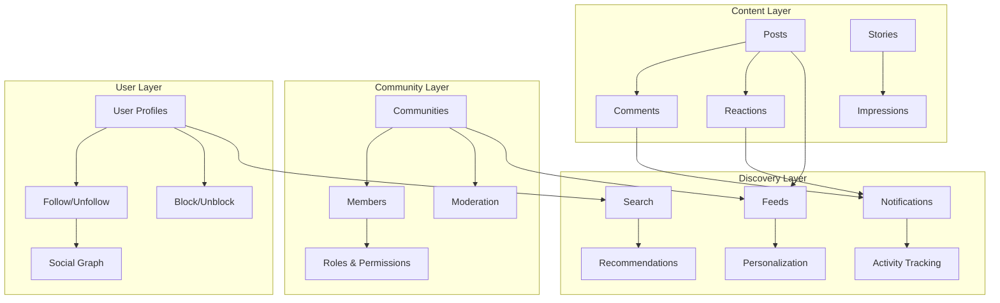

Build comprehensive social experiences with the Social Plus SDK. Enable users to create content, form communities, interact with each other, and discover engaging content without managing server infrastructure.

<CardGroup cols={3}>
  <Card title="Content Creation" icon="pen-to-square">
    Posts, comments, stories, and rich media content
  </Card>
  <Card title="Community Building" icon="users">
    Create and manage communities with moderation tools
  </Card>
  <Card title="User Engagement" icon="heart">
    Reactions, notifications, and social interactions
  </Card>
</CardGroup>

## Key Capabilities

<AccordionGroup>
  <Accordion title="Content & Communication">
    - **Multi-format Posts**: Text, images, videos, polls, and custom content types
    - **Real-time Comments**: Threaded discussions with mentions and reactions
    - **Stories**: Ephemeral content with impressions and engagement tracking
    - **Rich Media Support**: File uploads, image processing, and video streaming
  </Accordion>
  
  <Accordion title="Community Management">
    - **Community Creation**: Public and private communities with categories
    - **Member Management**: Join/leave, roles, and permissions
    - **Moderation Tools**: Content filtering, user management, and reporting
    - **Community Discovery**: Search, recommendations, and trending communities
  </Accordion>
  
  <Accordion title="User Interactions">
    - **Social Connections**: Follow/unfollow with connection status tracking
    - **Privacy Controls**: Block/unblock users and content filtering
    - **User Profiles**: Customizable profiles with activity tracking
    - **Relationship Management**: Connection requests and social graphs
  </Accordion>
  
  <Accordion title="Content Discovery">
    - **Personalized Feeds**: Algorithm-driven content recommendations
    - **Intelligent Search**: Advanced search with filters and suggestions
    - **Trending Content**: Popular posts and trending topics
    - **Custom Algorithms**: Configurable ranking and personalization
  </Accordion>
</AccordionGroup>

## Architecture Overview



## Core Features

<Tabs>
  <Tab title="Content Creation">
    <CardGroup cols={2}>
      <Card title="Posts" icon="file-text" href="posts/">
        Create rich content with text, images, videos, polls, and custom formats
        - Multi-media post creation
        - Post editing and management
        - Content flagging and moderation
        - Post impressions and analytics
      </Card>
      <Card title="Comments" icon="message-circle" href="comments/">
        Enable rich discussions with threaded comments and interactions
        - Create and manage comments
        - Mentions and notifications
        - Comment reactions and flagging
        - Real-time comment updates
      </Card>
      <Card title="Stories" icon="clock" href="stories/">
        Share ephemeral content with time-limited visibility
        - Create image and video stories
        - Story impressions tracking
        - Global and targeted story feeds
        - Story management and deletion
      </Card>
      <Card title="Reactions" icon="heart" href="reactions/">
        Express emotions and engagement through reactions
        - Add/remove reactions to content
        - Query reaction data and statistics
        - Custom reaction types
        - Real-time reaction updates
      </Card>
    </CardGroup>
  </Tab>
  
  <Tab title="Community & Social">
    <CardGroup cols={2}>
      <Card title="Communities" icon="users" href="communities/">
        Build and manage social communities with comprehensive tools
        - Create public/private communities
        - Member management and roles
        - Community moderation tools
        - Trending and recommendations
      </Card>
      <Card title="User Interactions" icon="user-friends">
        Manage social connections and user relationships
        - [Follow/Unfollow System](follow-unfollow/) - Social connections and relationship management
        - [Block/Unblock Users](block-and-unblock-user) - Privacy controls and user blocking
        - User profiles and social graphs
        - Connection status tracking
      </Card>
    </CardGroup>
  </Tab>
  
  <Tab title="Discovery & Engagement">
    <CardGroup cols={2}>
      <Card title="Feeds & Discovery" icon="rss" href="feed/">
        Personalized content discovery and feed management
        - Global and personalized feeds
        - Custom post ranking algorithms
        - Feed personalization and filtering
        - Content recommendation engine
      </Card>
      <Card title="Search & Intelligence" icon="search" href="intelligent-search/">
        Advanced search capabilities with intelligent filtering
        - Search posts and communities
        - Intelligent search suggestions
        - Advanced filtering options
        - Search result ranking
      </Card>
      <Card title="Notifications" icon="bell" href="notification-tray/">
        Real-time notifications and activity tracking
        - Notification tray management
        - Mark notifications as seen
        - Query notification history
        - Notification preferences
      </Card>
    </CardGroup>
  </Tab>
</Tabs>

## Getting Started Workflows

<AccordionGroup>
  <Accordion title="Build a Social Feed App">
    **Essential Features**: Posts + Comments + Reactions + Feed
    
    1. **Setup Content Creation**: Implement post creation with [Posts](posts/)
    2. **Enable Discussions**: Add comment functionality with [Comments](comments/)
    3. **Add Engagement**: Implement reactions with [Reactions](reactions/)
    4. **Create Feeds**: Build personalized feeds with [Feed](feed/)
    
    **Optional Enhancements**: Stories, User following, Search
  </Accordion>
  
  <Accordion title="Create a Community Platform">
    **Essential Features**: Communities + Posts + Moderation + Search
    
    1. **Setup Communities**: Create community structure with [Communities](communities/)
    2. **Enable Content Creation**: Add posts and discussions
    3. **Implement Moderation**: Setup community management tools
    4. **Add Discovery**: Enable search with [Intelligent Search](intelligent-search/)
    
    **Optional Enhancements**: Stories, Advanced moderation, Analytics
  </Accordion>
  
  <Accordion title="Build User Networking Features">
    **Essential Features**: User profiles + Follow system + Notifications
    
    1. **Setup User Interactions**: Implement [Follow/Unfollow](follow-unfollow/)
    2. **Add Privacy Controls**: Enable [Block/Unblock](block-and-unblock-user) functionality
    3. **Create Activity Feeds**: Build user-specific feeds
    4. **Enable Notifications**: Setup [Notification System](notification-tray/)
    
    **Optional Enhancements**: User recommendations, Social analytics
  </Accordion>
</AccordionGroup>

## Integration Examples

<Tabs>
  <Tab title="Complete Social App">
    ```typescript
    // Example: Building a complete social experience
    import { AmitySDK } from '@amityco/js-sdk';
    
    class SocialApp {
      async setupSocialFeatures() {
        // 1. Create user profile and setup following
        await this.setupUserProfile();
        
        // 2. Create or join communities
        await this.setupCommunities();
        
        // 3. Enable content creation
        await this.setupContentCreation();
        
        // 4. Setup personalized feeds
        await this.setupFeeds();
        
        // 5. Enable notifications
        await this.setupNotifications();
      }
      
      async setupUserProfile() {
        // Implement user profile creation
        // Enable follow/unfollow functionality
        // Setup privacy controls
      }
      
      async setupCommunities() {
        // Create communities
        // Setup member management
        // Enable community discovery
      }
      
      // ... additional setup methods
    }
    ```
  </Tab>
  
  <Tab title="Content-Focused App">
    ```swift
    // Example: Content creation and discovery app
    import AmitySDK
    
    class ContentApp {
        func setupContentFeatures() {
            // 1. Setup post creation
            setupPostCreation()
            
            // 2. Enable comments and reactions
            setupEngagement()
            
            // 3. Create discovery feeds
            setupContentDiscovery()
            
            // 4. Add search capabilities
            setupSearch()
        }
        
        func setupPostCreation() {
            // Implement multi-media post creation
            // Enable post editing and management
            // Setup content moderation
        }
        
        func setupEngagement() {
            // Enable comments with mentions
            // Add reaction functionality
            // Setup real-time updates
        }
        
        // ... additional methods
    }
    ```
  </Tab>
</Tabs>

## Best Practices

<AccordionGroup>
  <Accordion title="Performance Optimization">
    - **Pagination**: Always implement pagination for lists (posts, comments, users)
    - **Caching**: Cache frequently accessed data locally
    - **Lazy Loading**: Load content progressively as users scroll
    - **Image Optimization**: Compress and resize images before upload
  </Accordion>
  
  <Accordion title="User Experience">
    - **Real-time Updates**: Use webhooks and real-time events for live updates
    - **Offline Support**: Cache content for offline viewing
    - **Progressive Enhancement**: Build features that work without full functionality
    - **Accessibility**: Ensure all features are accessible to all users
  </Accordion>
  
  <Accordion title="Content Moderation">
    - **Auto-moderation**: Enable built-in profanity and content filters
    - **User Reporting**: Implement easy content flagging mechanisms
    - **Community Guidelines**: Provide clear community standards
    - **Moderation Tools**: Give community managers appropriate tools
  </Accordion>
  
  <Accordion title="Security & Privacy">
    - **User Consent**: Always obtain consent for data collection
    - **Privacy Controls**: Give users control over their data and visibility
    - **Content Ownership**: Respect user content ownership and deletion rights
    - **Data Protection**: Implement proper data encryption and protection
  </Accordion>
</AccordionGroup>

---

## Quick Reference

### Most Common Operations
- **Create Post**: [Posts](posts/) → [Create Post](posts/create-post/)
- **Add Comments**: [Comments](comments/) → [Create Comment](comments/create-comment)
- **Follow Users**: [Follow/Unfollow](follow-unfollow/) → [Follow User](follow-unfollow/follow-unfollow-user)
- **Join Community**: [Communities](communities/) → [Join Community](communities/join-leave-community)
- **Setup Feed**: [Feed](feed/) → [Query Global Feed](feed/query-global-feed)

### Related Documentation
- **[Chat Module](../chat/)** - Real-time messaging and channels
- **[Core Concepts](../core-concepts/)** - Authentication, sessions, and SDK fundamentals  
- **[Video Module](../video/)** - Live streaming and video calls
- **[UIKit](../../uikit/)** - Pre-built UI components