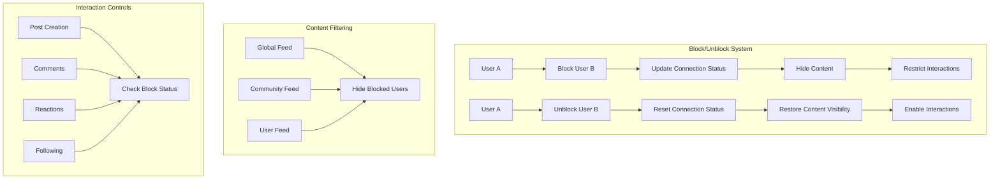
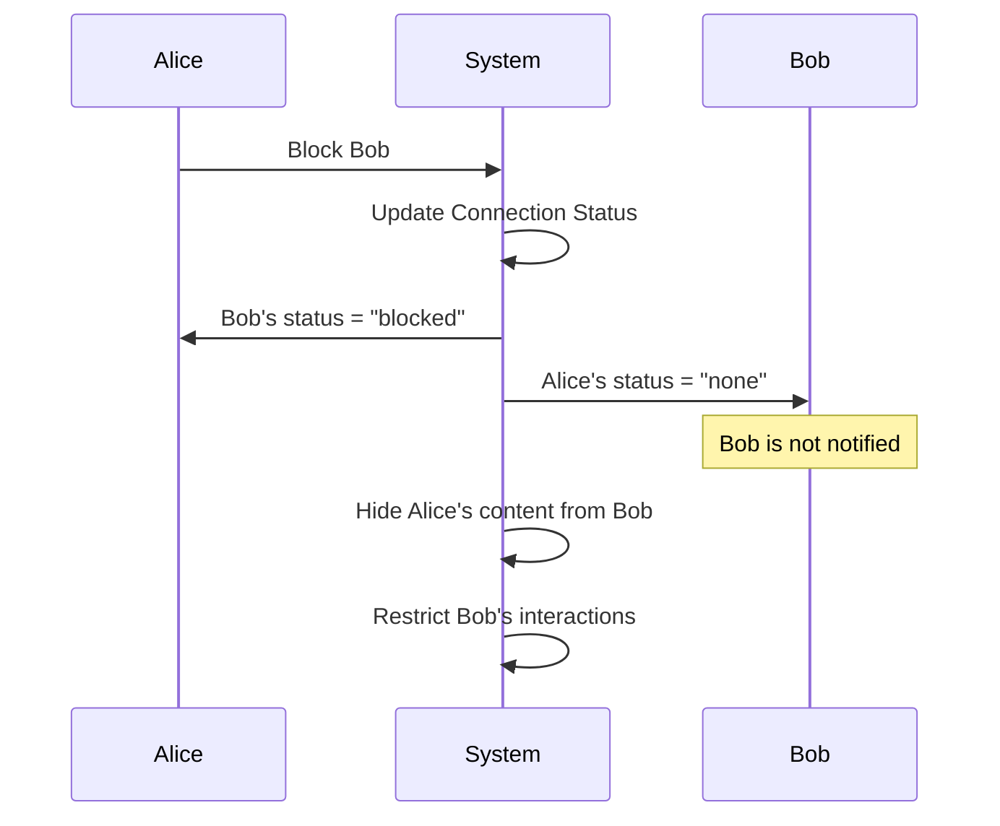
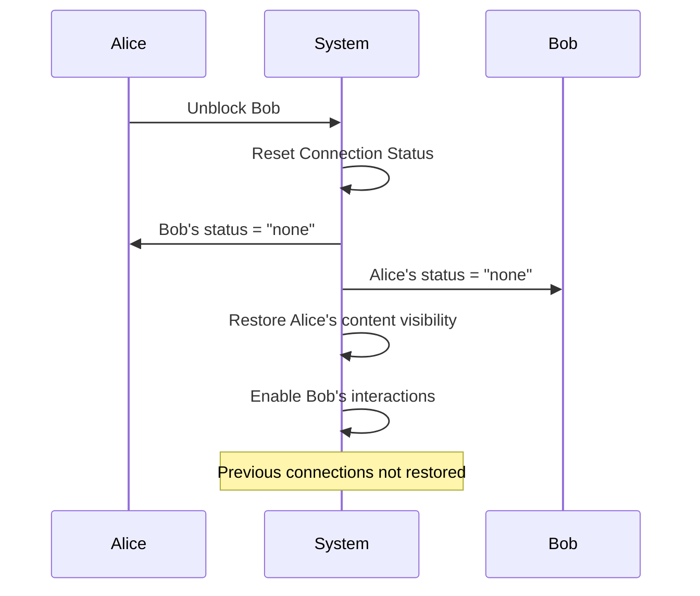

# Block and Unblock User

Enable users to create safer social experiences by blocking and unblocking other users. This comprehensive system provides granular control over user interactions while maintaining platform integrity.

<CardGroup cols={3}>
  <Card title="User Safety" icon="shield-check">
    Protect users from harassment and unwanted interactions
  </Card>
  <Card title="Content Control" icon="sliders">
    Give users control over their social environment
  </Card>
  <Card title="Spam Prevention" icon="ban">
    Filter out spam and inappropriate content effectively
  </Card>
</CardGroup>

## Architecture Overview



## Key Benefits

<AccordionGroup>
  <Accordion title="Enhanced User Safety">
    - **Harassment Protection**: Prevent unwanted interactions and cyberbullying
    - **Privacy Control**: Block users from accessing personal content
    - **Secure Environment**: Maintain positive community standards
  </Accordion>
  
  <Accordion title="Content Curation">
    - **Personalized Experience**: Control which content appears in feeds
    - **Preference Matching**: Align content with user comfort levels
    - **Quality Maintenance**: Filter out unwanted content types
  </Accordion>
  
  <Accordion title="Spam & Abuse Prevention">
    - **Automated Filtering**: Remove spam content from user experience
    - **Quality Control**: Maintain high-quality user interactions
    - **Platform Integrity**: Preserve overall community standards
  </Accordion>
</AccordionGroup>

## Product Behavior

<Tabs>
  <Tab title="When User is Blocked">
    <CardGroup cols={2}>
      <Card title="Content Visibility" icon="eye-slash">
        - Global feed content hidden
        - Community feed content hidden  
        - User feed content hidden
        - Search functionality remains active
      </Card>
      <Card title="Interaction Restrictions" icon="ban">
        - Cannot create posts on blocker's feed
        - Cannot comment on blocker's posts*
        - Cannot add/remove reactions
        - Connection status becomes `none`
        - Cannot follow the blocker
      </Card>
    </CardGroup>
    
    <Note>
      *Some limitations apply - see the Limitations section for details
    </Note>
  </Tab>
  
  <Tab title="When User is Unblocked">
    <CardGroup cols={2}>
      <Card title="Content Restoration" icon="eye">
        - All feed content becomes visible
        - Global, community, and user feeds restored
        - Full content access resumed
      </Card>
      <Card title="Interaction Recovery" icon="unlock">
        - All interactions re-enabled
        - Connection status remains `none`
        - Following capability restored
        - Previous connections not auto-restored
      </Card>
    </CardGroup>
    
    <Warning>
      Connection status does not return to previous state after unblocking. Users must reconnect manually.
    </Warning>
  </Tab>
</Tabs>

## Block User

Implement user blocking functionality with comprehensive constraints and behavior controls.

<Info>
  **Blocking Constraints**
  - Only users can be blocked (not Console Admins or communities)
  - Community moderators and custom roles can be blocked
  - Blocking works regardless of current connection status
</Info>

### Blocking Behavior Flow



### Implementation

<Tabs>
  <Tab title="TypeScript/JavaScript">
    ```typescript
    import { AmitySDK } from '@amityco/js-sdk';
    
    // Block a user
    async function blockUser(userId: string): Promise<void> {
      try {
        await AmitySDK.blockUser(userId);
        console.log(`Successfully blocked user: ${userId}`);
        
        // Optional: Update UI to reflect blocked state
        updateUserInterface('blocked', userId);
        
        // Optional: Show success message
        showNotification('User blocked successfully', 'success');
        
      } catch (error) {
        console.error('Failed to block user:', error);
        
        // Handle specific error cases
        if (error.code === 'PERMISSION_DENIED') {
          showNotification('You cannot block this user', 'error');
        } else if (error.code === 'USER_NOT_FOUND') {
          showNotification('User not found', 'error');
        } else {
          showNotification('Failed to block user', 'error');
        }
        
        throw error;
      }
    }
    
    // Usage example
    await blockUser('user123');
    ```
  </Tab>
  
  <Tab title="iOS (Swift)">
    ```swift
    import AmitySDK
    
    // Block a user with comprehensive error handling
    func blockUser(userId: String, completion: @escaping (Result<Void, Error>) -> Void) {
        AmityManager.shared.client.blockUser(userId: userId) { [weak self] success, error in
            DispatchQueue.main.async {
                if success {
                    print("Successfully blocked user: \(userId)")
                    
                    // Update UI
                    self?.updateUserInterface(status: .blocked, userId: userId)
                    
                    // Show success message
                    self?.showAlert(title: "Success", message: "User blocked successfully")
                    
                    completion(.success(()))
                } else if let error = error {
                    print("Failed to block user: \(error.localizedDescription)")
                    
                    // Handle specific errors
                    self?.handleBlockError(error)
                    
                    completion(.failure(error))
                }
            }
        }
    }
    
    // Error handling helper
    private func handleBlockError(_ error: Error) {
        if let amityError = error as? AmityError {
            switch amityError {
            case .permissionDenied:
                showAlert(title: "Error", message: "You cannot block this user")
            case .userNotFound:
                showAlert(title: "Error", message: "User not found")
            default:
                showAlert(title: "Error", message: "Failed to block user")
            }
        }
    }
    
    // Usage
    blockUser(userId: "user123") { result in
        switch result {
        case .success:
            // Handle success
            break
        case .failure(let error):
            // Handle error
            break
        }
    }
    ```
  </Tab>
  
  <Tab title="Android (Kotlin)">
    ```kotlin
    import com.amityco.socialplus.sdk.AmitySocialClient
    import io.reactivex.rxjava3.android.schedulers.AndroidSchedulers
    import io.reactivex.rxjava3.disposables.CompositeDisposable
    import io.reactivex.rxjava3.schedulers.Schedulers
    
    class UserBlockingManager {
        private val disposables = CompositeDisposable()
        
        fun blockUser(userId: String, callback: (Boolean, Throwable?) -> Unit) {
            val disposable = AmitySocialClient.newUserRepository()
                .blockUser(userId)
                .subscribeOn(Schedulers.io())
                .observeOn(AndroidSchedulers.mainThread())
                .subscribe(
                    { user ->
                        Log.d("BlockUser", "Successfully blocked user: $userId")
                        
                        // Update UI
                        updateUserInterface(UserStatus.BLOCKED, userId)
                        
                        // Show success message
                        showToast("User blocked successfully")
                        
                        callback(true, null)
                    },
                    { error ->
                        Log.e("BlockUser", "Failed to block user", error)
                        
                        // Handle specific errors
                        handleBlockError(error)
                        
                        callback(false, error)
                    }
                )
            
            disposables.add(disposable)
        }
        
        private fun handleBlockError(error: Throwable) {
            when (error) {
                is AmityPermissionException -> {
                    showToast("You cannot block this user")
                }
                is AmityUserNotFoundException -> {
                    showToast("User not found")
                }
                else -> {
                    showToast("Failed to block user")
                }
            }
        }
        
        fun cleanup() {
            disposables.clear()
        }
    }
    
    // Usage
    val blockingManager = UserBlockingManager()
    blockingManager.blockUser("user123") { success, error ->
        if (success) {
            // Handle success
        } else {
            // Handle error
        }
    }
    ```
  </Tab>
  
  <Tab title="Flutter (Dart)">
    ```dart
    import 'package:amity_sdk/amity_sdk.dart';
    
    class UserBlockingService {
      
      /// Block a user with comprehensive error handling
      Future<bool> blockUser(String userId) async {
        try {
          await AmitySocialClient.newUserRepository().blockUser(userId);
          
          print('Successfully blocked user: $userId');
          
          // Update UI
          _updateUserInterface(UserStatus.blocked, userId);
          
          // Show success message
          _showSnackBar('User blocked successfully', isError: false);
          
          return true;
          
        } on AmityException catch (error) {
          print('Amity error blocking user: ${error.message}');
          
          // Handle specific Amity errors
          _handleAmityError(error);
          
          return false;
          
        } catch (error) {
          print('Unknown error blocking user: $error');
          
          _showSnackBar('Failed to block user', isError: true);
          
          return false;
        }
      }
      
      void _handleAmityError(AmityException error) {
        switch (error.code) {
          case AmityErrorCode.permissionDenied:
            _showSnackBar('You cannot block this user', isError: true);
            break;
          case AmityErrorCode.userNotFound:
            _showSnackBar('User not found', isError: true);
            break;
          default:
            _showSnackBar('Failed to block user', isError: true);
        }
      }
      
      void _updateUserInterface(UserStatus status, String userId) {
        // Update your UI to reflect the new status
        // This could involve updating a user list, profile page, etc.
      }
      
      void _showSnackBar(String message, {required bool isError}) {
        // Show snackbar with appropriate styling
        // Implementation depends on your UI framework
      }
    }
    
    // Usage
    final blockingService = UserBlockingService();
    final success = await blockingService.blockUser('user123');
    
    if (success) {
      // Handle success case
    } else {
      // Handle failure case
    }
    ```
  </Tab>
</Tabs>

### Parameters

<ParamField path="userId" type="string" required>
  The unique identifier of the user to block
</ParamField>

## Unblock User

Restore user interactions by unblocking previously blocked users with specific behavioral considerations.

<Warning>
  **Connection Status Reset**
  - Connection status becomes `none` after unblocking
  - Previous connections are not automatically restored
  - Users must manually reconnect if desired
</Warning>

### Unblocking Behavior Flow



### Implementation

<Tabs>
  <Tab title="TypeScript/JavaScript">
    ```typescript
    import { AmitySDK } from '@amityco/js-sdk';
    
    // Unblock a user with comprehensive handling
    async function unblockUser(userId: string): Promise<void> {
      try {
        await AmitySDK.unblockUser(userId);
        console.log(`Successfully unblocked user: ${userId}`);
        
        // Update UI to reflect unblocked state
        updateUserInterface('none', userId);
        
        // Show success message with connection reset info
        showNotification(
          'User unblocked successfully. Connection status reset to none.',
          'success'
        );
        
        // Optional: Suggest reconnection
        suggestReconnection(userId);
        
      } catch (error) {
        console.error('Failed to unblock user:', error);
        
        // Handle specific error cases
        if (error.code === 'USER_NOT_FOUND') {
          showNotification('User not found', 'error');
        } else if (error.code === 'USER_NOT_BLOCKED') {
          showNotification('User is not currently blocked', 'warning');
        } else {
          showNotification('Failed to unblock user', 'error');
        }
        
        throw error;
      }
    }
    
    // Helper to suggest reconnection
    function suggestReconnection(userId: string): void {
      showConfirmDialog({
        title: 'Reconnect with User?',
        message: 'Would you like to follow this user again?',
        onConfirm: () => followUser(userId),
        onCancel: () => console.log('User chose not to reconnect')
      });
    }
    
    // Usage
    await unblockUser('user123');
    ```
  </Tab>
  
  <Tab title="iOS (Swift)">
    ```swift
    import AmitySDK
    
    // Unblock user with comprehensive error handling
    func unblockUser(userId: String, completion: @escaping (Result<Void, Error>) -> Void) {
        AmityManager.shared.client.unblockUser(userId: userId) { [weak self] success, error in
            DispatchQueue.main.async {
                if success {
                    print("Successfully unblocked user: \(userId)")
                    
                    // Update UI - connection status is now "none"
                    self?.updateUserInterface(status: .none, userId: userId)
                    
                    // Show success with connection reset info
                    self?.showAlert(
                        title: "Success",
                        message: "User unblocked successfully. Connection status reset to none."
                    )
                    
                    // Optional: Suggest reconnection
                    self?.suggestReconnection(userId: userId)
                    
                    completion(.success(()))
                } else if let error = error {
                    print("Failed to unblock user: \(error.localizedDescription)")
                    
                    // Handle specific errors
                    self?.handleUnblockError(error)
                    
                    completion(.failure(error))
                }
            }
        }
    }
    
    // Error handling for unblock operations
    private func handleUnblockError(_ error: Error) {
        if let amityError = error as? AmityError {
            switch amityError {
            case .userNotFound:
                showAlert(title: "Error", message: "User not found")
            case .userNotBlocked:
                showAlert(title: "Info", message: "User is not currently blocked")
            default:
                showAlert(title: "Error", message: "Failed to unblock user")
            }
        }
    }
    
    // Suggest reconnection after unblocking
    private func suggestReconnection(userId: String) {
        let alert = UIAlertController(
            title: "Reconnect with User?",
            message: "Would you like to follow this user again?",
            preferredStyle: .alert
        )
        
        alert.addAction(UIAlertAction(title: "Follow", style: .default) { _ in
            self.followUser(userId: userId)
        })
        
        alert.addAction(UIAlertAction(title: "Not Now", style: .cancel))
        
        present(alert, animated: true)
    }
    
    // Usage
    unblockUser(userId: "user123") { result in
        switch result {
        case .success:
            // Handle success
            break
        case .failure(let error):
            // Handle error
            break
        }
    }
    ```
  </Tab>
  
  <Tab title="Android (Kotlin)">
    ```kotlin
    import com.amityco.socialplus.sdk.AmitySocialClient
    import io.reactivex.rxjava3.android.schedulers.AndroidSchedulers
    import io.reactivex.rxjava3.schedulers.Schedulers
    
    class UserBlockingManager {
        private val disposables = CompositeDisposable()
        
        fun unblockUser(userId: String, callback: (Boolean, Throwable?) -> Unit) {
            val disposable = AmitySocialClient.newUserRepository()
                .unblockUser(userId)
                .subscribeOn(Schedulers.io())
                .observeOn(AndroidSchedulers.mainThread())
                .subscribe(
                    { user ->
                        Log.d("UnblockUser", "Successfully unblocked user: $userId")
                        
                        // Update UI - connection status is now "none"
                        updateUserInterface(UserStatus.NONE, userId)
                        
                        // Show success with connection reset info
                        showToast("User unblocked successfully. Connection status reset to none.")
                        
                        // Optional: Suggest reconnection
                        suggestReconnection(userId)
                        
                        callback(true, null)
                    },
                    { error ->
                        Log.e("UnblockUser", "Failed to unblock user", error)
                        
                        // Handle specific errors
                        handleUnblockError(error)
                        
                        callback(false, error)
                    }
                )
            
            disposables.add(disposable)
        }
        
        private fun handleUnblockError(error: Throwable) {
            when (error) {
                is AmityUserNotFoundException -> {
                    showToast("User not found")
                }
                is AmityUserNotBlockedException -> {
                    showToast("User is not currently blocked")
                }
                else -> {
                    showToast("Failed to unblock user")
                }
            }
        }
        
        private fun suggestReconnection(userId: String) {
            AlertDialog.Builder(context)
                .setTitle("Reconnect with User?")
                .setMessage("Would you like to follow this user again?")
                .setPositiveButton("Follow") { _, _ ->
                    followUser(userId)
                }
                .setNegativeButton("Not Now", null)
                .show()
        }
    }
    ```
  </Tab>
  
  <Tab title="Flutter (Dart)">
    ```dart
    import 'package:amity_sdk/amity_sdk.dart';
    
    class UserBlockingService {
      
      /// Unblock a user with comprehensive error handling
      Future<bool> unblockUser(String userId) async {
        try {
          await AmitySocialClient.newUserRepository().unblockUser(userId);
          
          print('Successfully unblocked user: $userId');
          
          // Update UI - connection status is now "none"
          _updateUserInterface(UserStatus.none, userId);
          
          // Show success with connection reset info
          _showSnackBar(
            'User unblocked successfully. Connection status reset to none.',
            isError: false
          );
          
          // Optional: Suggest reconnection
          _suggestReconnection(userId);
          
          return true;
          
        } on AmityException catch (error) {
          print('Amity error unblocking user: ${error.message}');
          
          // Handle specific Amity errors
          _handleUnblockAmityError(error);
          
          return false;
          
        } catch (error) {
          print('Unknown error unblocking user: $error');
          
          _showSnackBar('Failed to unblock user', isError: true);
          
          return false;
        }
      }
      
      void _handleUnblockAmityError(AmityException error) {
        switch (error.code) {
          case AmityErrorCode.userNotFound:
            _showSnackBar('User not found', isError: true);
            break;
          case AmityErrorCode.userNotBlocked:
            _showSnackBar('User is not currently blocked', isError: false);
            break;
          default:
            _showSnackBar('Failed to unblock user', isError: true);
        }
      }
      
      void _suggestReconnection(String userId) {
        showDialog(
          context: context,
          builder: (context) => AlertDialog(
            title: Text('Reconnect with User?'),
            content: Text('Would you like to follow this user again?'),
            actions: [
              TextButton(
                onPressed: () {
                  Navigator.of(context).pop();
                  _followUser(userId);
                },
                child: Text('Follow'),
              ),
              TextButton(
                onPressed: () => Navigator.of(context).pop(),
                child: Text('Not Now'),
              ),
            ],
          ),
        );
      }
    }
    ```
  </Tab>
</Tabs>

### Parameters

<ParamField path="userId" type="string" required>
  The unique identifier of the user to unblock
</ParamField>

## Blocked Users Management

Efficiently manage and display the list of blocked users with comprehensive filtering and user information.

<Info>
  **List Behavior**
  - Only shows users you have blocked (not users who blocked you)
  - Inactive or deleted users are automatically filtered out
  - Includes user ID, display name, avatar, and profile information
</Info>

### Implementation

<Tabs>
  <Tab title="TypeScript/JavaScript">
    ```typescript
    import { AmitySDK, AmityUser } from '@amityco/js-sdk';
    
    interface BlockedUser {
      userId: string;
      displayName: string;
      avatar?: string;
      isActive: boolean;
    }
    
    // Get blocked users list with pagination
    async function getBlockedUsers(
      page: number = 1, 
      limit: number = 20
    ): Promise<{ users: BlockedUser[], hasMore: boolean }> {
      try {
        const result = await AmitySDK.getBlockedUsers({
          page,
          limit,
          sortBy: 'displayName', // Sort alphabetically
          includeDeleted: false   // Exclude deleted users
        });
        
        console.log(`Retrieved ${result.data.length} blocked users`);
        
        // Transform data for UI
        const users: BlockedUser[] = result.data.map(user => ({
          userId: user.userId,
          displayName: user.displayName || 'Unknown User',
          avatar: user.avatar?.fileUrl,
          isActive: user.isActive
        }));
        
        // Update UI with blocked users
        updateBlockedUsersList(users);
        
        return {
          users,
          hasMore: result.hasNextPage
        };
        
      } catch (error) {
        console.error('Failed to get blocked users:', error);
        
        // Handle specific errors
        if (error.code === 'PERMISSION_DENIED') {
          showNotification('Unable to access blocked users list', 'error');
        } else {
          showNotification('Failed to load blocked users', 'error');
        }
        
        throw error;
      }
    }
    
    // Search within blocked users
    async function searchBlockedUsers(query: string): Promise<BlockedUser[]> {
      try {
        const allUsers = await getBlockedUsers(1, 100); // Get first 100 for search
        
        const filteredUsers = allUsers.users.filter(user =>
          user.displayName.toLowerCase().includes(query.toLowerCase()) ||
          user.userId.toLowerCase().includes(query.toLowerCase())
        );
        
        return filteredUsers;
        
      } catch (error) {
        console.error('Search failed:', error);
        return [];
      }
    }
    
    // Unblock user from list
    async function unblockFromList(userId: string): Promise<void> {
      try {
        await AmitySDK.unblockUser(userId);
        
        // Remove from UI immediately
        removeUserFromBlockedList(userId);
        
        showNotification('User unblocked successfully', 'success');
        
      } catch (error) {
        console.error('Failed to unblock user:', error);
        showNotification('Failed to unblock user', 'error');
      }
    }
    
    // Usage examples
    const blockedUsers = await getBlockedUsers();
    const searchResults = await searchBlockedUsers('john');
    await unblockFromList('user123');
    ```
  </Tab>
  
  <Tab title="iOS (Swift)">
    ```swift
    import AmitySDK
    
    class BlockedUsersManager: ObservableObject {
        @Published var blockedUsers: [AmityUser] = []
        @Published var isLoading = false
        @Published var hasMore = true
        
        private var repository: AmityUserRepository?
        private var collection: AmityCollection<AmityUser>?
        private var token: AmityNotificationToken?
        
        init() {
            repository = AmityManager.shared.client.userRepository
            setupBlockedUsersObserver()
        }
        
        // Setup real-time observer for blocked users
        private func setupBlockedUsersObserver() {
            guard let repository = repository else { return }
            
            collection = repository.getBlockedUsers()
            
            token = collection?.observe { [weak self] collection, _, error in
                DispatchQueue.main.async {
                    if let error = error {
                        print("Error observing blocked users: \(error)")
                        self?.handleError(error)
                        return
                    }
                    
                    // Update UI with filtered active users
                    self?.blockedUsers = collection.allObjects().filter { $0.isActive }
                    self?.isLoading = false
                    
                    print("Updated blocked users list: \(self?.blockedUsers.count ?? 0) users")
                }
            }
        }
        
        // Load more blocked users (pagination)
        func loadMore() {
            guard hasMore && !isLoading else { return }
            
            isLoading = true
            collection?.nextPage()
        }
        
        // Search blocked users
        func searchUsers(query: String) -> [AmityUser] {
            guard !query.isEmpty else { return blockedUsers }
            
            return blockedUsers.filter { user in
                let displayName = user.displayName?.lowercased() ?? ""
                let userId = user.userId.lowercased()
                let searchQuery = query.lowercased()
                
                return displayName.contains(searchQuery) || userId.contains(searchQuery)
            }
        }
        
        // Unblock user with confirmation
        func unblockUser(_ user: AmityUser) {
            let alert = UIAlertController(
                title: "Unblock User",
                message: "Are you sure you want to unblock \(user.displayName ?? user.userId)?",
                preferredStyle: .alert
            )
            
            alert.addAction(UIAlertAction(title: "Unblock", style: .destructive) { _ in
                self.performUnblock(user)
            })
            
            alert.addAction(UIAlertAction(title: "Cancel", style: .cancel))
            
            // Present alert (requires view controller context)
            // presentAlert(alert)
        }
        
        private func performUnblock(_ user: AmityUser) {
            repository?.unblockUser(userId: user.userId) { [weak self] success, error in
                DispatchQueue.main.async {
                    if success {
                        print("Successfully unblocked user: \(user.userId)")
                        // User will be automatically removed from observer
                        self?.showSuccess("User unblocked successfully")
                    } else if let error = error {
                        print("Failed to unblock user: \(error)")
                        self?.handleError(error)
                    }
                }
            }
        }
        
        private func handleError(_ error: Error) {
            // Handle different error types
            if let amityError = error as? AmityError {
                switch amityError {
                case .permissionDenied:
                    showError("Unable to access blocked users list")
                default:
                    showError("Failed to load blocked users")
                }
            }
        }
        
        deinit {
            token?.invalidate()
        }
    }
    
    // Usage in SwiftUI View
    struct BlockedUsersView: View {
        @StateObject private var manager = BlockedUsersManager()
        @State private var searchText = ""
        
        var filteredUsers: [AmityUser] {
            manager.searchUsers(query: searchText)
        }
        
        var body: some View {
            NavigationView {
                List {
                    ForEach(filteredUsers, id: \.userId) { user in
                        BlockedUserRow(user: user) {
                            manager.unblockUser(user)
                        }
                    }
                }
                .searchable(text: $searchText)
                .navigationTitle("Blocked Users")
                .refreshable { manager.loadMore() }
            }
        }
    }
    ```
  </Tab>
  
  <Tab title="Android (Kotlin)">
    ```kotlin
    import com.amityco.socialplus.sdk.AmitySocialClient
    import com.amityco.socialplus.sdk.model.AmityUser
    import androidx.paging.PagingData
    import androidx.paging.PagingDataAdapter
    import kotlinx.coroutines.flow.Flow
    
    class BlockedUsersRepository {
        private val userRepository = AmitySocialClient.newUserRepository()
        
        // Get paginated blocked users
        fun getBlockedUsers(): Flow<PagingData<AmityUser>> {
            return userRepository.getBlockedUsers()
                .build()
                .query()
                .filter { it.isActive } // Only show active users
        }
        
        // Search blocked users
        fun searchBlockedUsers(query: String): Flow<PagingData<AmityUser>> {
            return userRepository.getBlockedUsers()
                .displayName(query) // Search by display name
                .build()
                .query()
                .filter { it.isActive }
        }
        
        // Unblock user
        fun unblockUser(userId: String): Single<AmityUser> {
            return userRepository.unblockUser(userId)
        }
    }
    
    // RecyclerView Adapter for blocked users
    class BlockedUsersAdapter(
        private val onUnblockClick: (AmityUser) -> Unit
    ) : PagingDataAdapter<AmityUser, BlockedUsersAdapter.ViewHolder>(UserDiffCallback()) {
        
        override fun onCreateViewHolder(parent: ViewGroup, viewType: Int): ViewHolder {
            val binding = ItemBlockedUserBinding.inflate(
                LayoutInflater.from(parent.context), parent, false
            )
            return ViewHolder(binding)
        }
        
        override fun onBindViewHolder(holder: ViewHolder, position: Int) {
            val user = getItem(position)
            user?.let { holder.bind(it, onUnblockClick) }
        }
        
        class ViewHolder(private val binding: ItemBlockedUserBinding) : 
            RecyclerView.ViewHolder(binding.root) {
            
            fun bind(user: AmityUser, onUnblockClick: (AmityUser) -> Unit) {
                binding.apply {
                    textDisplayName.text = user.displayName ?: "Unknown User"
                    textUserId.text = user.userId
                    
                    // Load avatar
                    user.avatar?.let { avatar ->
                        Glide.with(imageAvatar.context)
                            .load(avatar.fileUrl)
                            .placeholder(R.drawable.ic_user_placeholder)
                            .into(imageAvatar)
                    }
                    
                    // Unblock button
                    buttonUnblock.setOnClickListener {
                        showUnblockConfirmation(user, onUnblockClick)
                    }
                }
            }
            
            private fun showUnblockConfirmation(
                user: AmityUser, 
                onUnblockClick: (AmityUser) -> Unit
            ) {
                AlertDialog.Builder(binding.root.context)
                    .setTitle("Unblock User")
                    .setMessage("Are you sure you want to unblock ${user.displayName ?: user.userId}?")
                    .setPositiveButton("Unblock") { _, _ ->
                        onUnblockClick(user)
                    }
                    .setNegativeButton("Cancel", null)
                    .show()
            }
        }
    }
    
    // Activity/Fragment implementation
    class BlockedUsersFragment : Fragment() {
        private val repository = BlockedUsersRepository()
        private val adapter = BlockedUsersAdapter { user -> unblockUser(user) }
        
        override fun onViewCreated(view: View, savedInstanceState: Bundle?) {
            super.onViewCreated(view, savedInstanceState)
            
            setupRecyclerView()
            observeBlockedUsers()
            setupSearch()
        }
        
        private fun setupRecyclerView() {
            binding.recyclerViewBlockedUsers.adapter = adapter
        }
        
        private fun observeBlockedUsers() {
            viewLifecycleOwner.lifecycleScope.launch {
                repository.getBlockedUsers().collectLatest { pagingData ->
                    adapter.submitData(pagingData)
                }
            }
        }
        
        private fun unblockUser(user: AmityUser) {
            repository.unblockUser(user.userId)
                .subscribeOn(Schedulers.io())
                .observeOn(AndroidSchedulers.mainThread())
                .subscribe(
                    { 
                        Toast.makeText(context, "User unblocked successfully", Toast.LENGTH_SHORT).show()
                        // Refresh list
                        adapter.refresh()
                    },
                    { error ->
                        Toast.makeText(context, "Failed to unblock user", Toast.LENGTH_SHORT).show()
                        Log.e("BlockedUsers", "Unblock failed", error)
                    }
                )
        }
    }
    ```
  </Tab>
  
  <Tab title="Flutter (Dart)">
    ```dart
    import 'package:amity_sdk/amity_sdk.dart';
    import 'package:flutter/material.dart';
    
    class BlockedUsersManager {
      final AmityUserRepository _userRepository = AmitySocialClient.newUserRepository();
      
      /// Get blocked users with pagination
      Stream<List<AmityUser>> getBlockedUsers() {
        return _userRepository.getBlockedUsers()
            .getPagingData()
            .map((pagingData) => pagingData.data.where((user) => user.isActive).toList());
      }
      
      /// Search blocked users by display name
      Stream<List<AmityUser>> searchBlockedUsers(String query) {
        return _userRepository.getBlockedUsers()
            .displayName(query)
            .getPagingData()
            .map((pagingData) => pagingData.data.where((user) => user.isActive).toList());
      }
      
      /// Unblock a user
      Future<bool> unblockUser(String userId) async {
        try {
          await _userRepository.unblockUser(userId);
          return true;
        } catch (error) {
          print('Failed to unblock user: $error');
          return false;
        }
      }
    }
    
    // Blocked Users Screen Widget
    class BlockedUsersScreen extends StatefulWidget {
      @override
      _BlockedUsersScreenState createState() => _BlockedUsersScreenState();
    }
    
    class _BlockedUsersScreenState extends State<BlockedUsersScreen> {
      final BlockedUsersManager _manager = BlockedUsersManager();
      final TextEditingController _searchController = TextEditingController();
      late Stream<List<AmityUser>> _blockedUsersStream;
      
      @override
      void initState() {
        super.initState();
        _blockedUsersStream = _manager.getBlockedUsers();
      }
      
      void _onSearchChanged(String query) {
        setState(() {
          if (query.isEmpty) {
            _blockedUsersStream = _manager.getBlockedUsers();
          } else {
            _blockedUsersStream = _manager.searchBlockedUsers(query);
          }
        });
      }
      
      Future<void> _showUnblockConfirmation(AmityUser user) async {
        final confirmed = await showDialog<bool>(
          context: context,
          builder: (context) => AlertDialog(
            title: Text('Unblock User'),
            content: Text('Are you sure you want to unblock ${user.displayName ?? user.userId}?'),
            actions: [
              TextButton(
                onPressed: () => Navigator.of(context).pop(false),
                child: Text('Cancel'),
              ),
              TextButton(
                onPressed: () => Navigator.of(context).pop(true),
                child: Text('Unblock'),
                style: TextButton.styleFrom(foregroundColor: Colors.red),
              ),
            ],
          ),
        );
        
        if (confirmed == true) {
          _unblockUser(user);
        }
      }
      
      Future<void> _unblockUser(AmityUser user) async {
        final success = await _manager.unblockUser(user.userId);
        
        if (success) {
          ScaffoldMessenger.of(context).showSnackBar(
            SnackBar(
              content: Text('User unblocked successfully'),
              backgroundColor: Colors.green,
            ),
          );
          // Stream will automatically update
        } else {
          ScaffoldMessenger.of(context).showSnackBar(
            SnackBar(
              content: Text('Failed to unblock user'),
              backgroundColor: Colors.red,
            ),
          );
        }
      }
      
      @override
      Widget build(BuildContext context) {
        return Scaffold(
          appBar: AppBar(
            title: Text('Blocked Users'),
            bottom: PreferredSize(
              preferredSize: Size.fromHeight(60),
              child: Padding(
                padding: EdgeInsets.all(16),
                child: TextField(
                  controller: _searchController,
                  onChanged: _onSearchChanged,
                  decoration: InputDecoration(
                    hintText: 'Search blocked users...',
                    prefixIcon: Icon(Icons.search),
                    border: OutlineInputBorder(),
                    contentPadding: EdgeInsets.symmetric(horizontal: 16),
                  ),
                ),
              ),
            ),
          ),
          body: StreamBuilder<List<AmityUser>>(
            stream: _blockedUsersStream,
            builder: (context, snapshot) {
              if (snapshot.connectionState == ConnectionState.waiting) {
                return Center(child: CircularProgressIndicator());
              }
              
              if (snapshot.hasError) {
                return Center(
                  child: Column(
                    mainAxisAlignment: MainAxisAlignment.center,
                    children: [
                      Icon(Icons.error, size: 64, color: Colors.red),
                      SizedBox(height: 16),
                      Text('Failed to load blocked users'),
                      TextButton(
                        onPressed: () => setState(() {}),
                        child: Text('Retry'),
                      ),
                    ],
                  ),
                );
              }
              
              final blockedUsers = snapshot.data ?? [];
              
              if (blockedUsers.isEmpty) {
                return Center(
                  child: Column(
                    mainAxisAlignment: MainAxisAlignment.center,
                    children: [
                      Icon(Icons.block, size: 64, color: Colors.grey),
                      SizedBox(height: 16),
                      Text('No blocked users found'),
                    ],
                  ),
                );
              }
              
              return ListView.builder(
                itemCount: blockedUsers.length,
                itemBuilder: (context, index) {
                  final user = blockedUsers[index];
                  return BlockedUserTile(
                    user: user,
                    onUnblock: () => _showUnblockConfirmation(user),
                  );
                },
              );
            },
          ),
        );
      }
    }
    
    // Individual blocked user tile widget
    class BlockedUserTile extends StatelessWidget {
      final AmityUser user;
      final VoidCallback onUnblock;
      
      const BlockedUserTile({
        Key? key,
        required this.user,
        required this.onUnblock,
      }) : super(key: key);
      
      @override
      Widget build(BuildContext context) {
        return ListTile(
          leading: CircleAvatar(
            backgroundImage: user.avatar?.fileUrl != null 
                ? NetworkImage(user.avatar!.fileUrl!)
                : null,
            child: user.avatar?.fileUrl == null 
                ? Icon(Icons.person)
                : null,
          ),
          title: Text(user.displayName ?? 'Unknown User'),
          subtitle: Text(user.userId),
          trailing: TextButton(
            onPressed: onUnblock,
            child: Text('Unblock'),
            style: TextButton.styleFrom(
              foregroundColor: Colors.red,
            ),
          ),
        );
      }
    }
    ```
  </Tab>
</Tabs>

## Best Practices

<AccordionGroup>
  <Accordion title="User Experience Guidelines">
    - **Clear Feedback**: Always provide immediate visual feedback when blocking/unblocking
    - **Confirmation Dialogs**: Use confirmation dialogs for irreversible actions
    - **Status Indicators**: Show clear blocked/unblocked status in user interfaces
    - **Graceful Degradation**: Handle edge cases like already blocked/unblocked users appropriately
  </Accordion>
  
  <Accordion title="Error Handling">
    - **Specific Error Messages**: Provide meaningful error messages for different failure scenarios
    - **Retry Mechanisms**: Implement retry logic for network-related failures
    - **Fallback UI States**: Design appropriate fallback states for error conditions
    - **Logging**: Log blocking/unblocking activities for debugging and analytics
  </Accordion>
  
  <Accordion title="Performance Optimization">
    - **Pagination**: Implement pagination for blocked users lists
    - **Caching**: Cache blocked user lists locally for better performance
    - **Lazy Loading**: Load additional user details on demand
    - **Background Updates**: Update UI optimistically while API calls execute
  </Accordion>
  
  <Accordion title="Security Considerations">
    - **Rate Limiting**: Implement client-side rate limiting to prevent abuse
    - **Validation**: Validate user IDs before making API calls
    - **Permission Checks**: Verify user permissions before enabling block/unblock actions
    - **Privacy Protection**: Ensure blocked status information is properly protected
  </Accordion>
</AccordionGroup>

## Error Handling

<CardGroup cols={2}>
  <Card title="Common Errors" icon="exclamation-triangle">
    - `USER_NOT_FOUND`: Target user doesn't exist
    - `PERMISSION_DENIED`: Insufficient permissions
    - `USER_NOT_BLOCKED`: Trying to unblock non-blocked user
    - `NETWORK_ERROR`: Connection issues
  </Card>
  <Card title="Error Recovery" icon="refresh">
    - Implement exponential backoff for retries
    - Provide clear user feedback for each error type
    - Cache operations for offline scenarios
    - Log errors for debugging and monitoring
  </Card>
</CardGroup>

## Use Cases

<Tabs>
  <Tab title="Social Media Apps">
    - **Harassment Prevention**: Block users sending inappropriate messages
    - **Content Curation**: Hide unwanted content from feeds
    - **Privacy Control**: Prevent specific users from viewing posts
    - **Community Moderation**: Tools for managing user interactions
  </Tab>
  
  <Tab title="Dating Apps">
    - **Safety Features**: Block inappropriate or harmful users
    - **Match Management**: Remove unwanted connections
    - **Harassment Protection**: Prevent continued unwanted contact
    - **Profile Privacy**: Control who can view profile information
  </Tab>
  
  <Tab title="Gaming Platforms">
    - **Toxicity Management**: Block players exhibiting toxic behavior
    - **Spam Prevention**: Filter out spam messages and friend requests
    - **Competitive Integrity**: Prevent cheaters from affecting gameplay
    - **Community Standards**: Maintain positive gaming environments
  </Tab>
  
  <Tab title="Professional Networks">
    - **Workplace Safety**: Block users violating professional standards
    - **Spam Control**: Filter recruitment spam and inappropriate messages
    - **Network Management**: Curate professional connections
    - **Content Quality**: Maintain high-quality professional discussions
  </Tab>
</Tabs>

## Limitations & Considerations

<Warning>
  **Important Limitations**
  
  While the block/unblock system provides robust user control, be aware of these limitations:
</Warning>

<AccordionGroup>
  <Accordion title="Content Interaction Limitations">
    - **Direct Post Access**: If users know specific post IDs, they can still interact with blocked users' content
    - **Community Content**: Blocked users' posts in shared communities may still be visible
    - **Third-party References**: Content referencing blocked users may still appear in feeds
  </Accordion>
  
  <Accordion title="Notification Behavior">
    - **Community Notifications**: Users still receive notifications for blocked users' activity in shared communities
    - **No Block Notifications**: Blocked users are not notified of the block action
    - **Real-time Events**: Block/unblock events are not automatically filtered in real-time streams
  </Accordion>
  
  <Accordion title="Technical Considerations">
    - **Connection Status**: Previous connections are permanently reset after unblocking
    - **Content Filtering**: Manual filtering may be required for certain content types
    - **Cache Invalidation**: Blocked user content may remain in local caches temporarily
  </Accordion>
</AccordionGroup>

<Note>
  For enhanced blocking functionality, consider implementing additional client-side filtering and content moderation based on your specific use case requirements.
</Note>