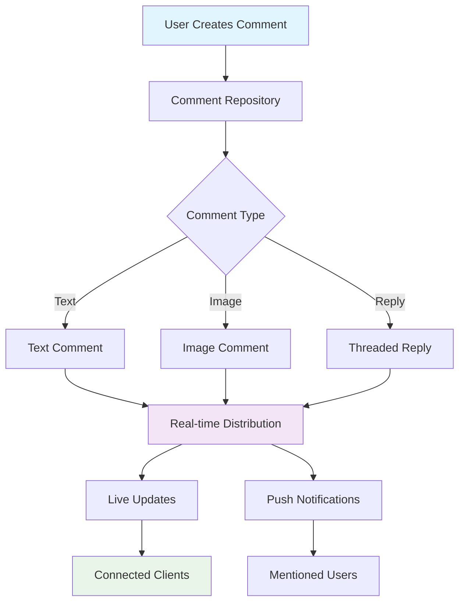

# Comments

Comments enable rich, interactive discussions on posts, stories, and content throughout your social.plus application. With support for threading, real-time updates, mentions, reactions, and comprehensive moderation tools, comments foster meaningful community engagement and user interaction.

<Info>
Comments support **real-time events** and **Live Object features** for instant updates across all connected clients. This ensures users see new comments, reactions, and edits immediately without manual refresh.
</Info>

## Architecture Overview



## Core Features

<CardGroup cols={3}>
  <Card title="Threaded Discussions" icon="comments">
    Multi-level comment threading with parent-child relationships for organized conversations
  </Card>
  <Card title="Real-time Updates" icon="bolt">
    Instant comment delivery with live reactions, edits, and notifications across all clients
  </Card>
  <Card title="Rich Content" icon="image">
    Support for text, images, mentions, and custom metadata in comment content
  </Card>
  <Card title="Moderation Tools" icon="shield">
    Comprehensive flagging, deletion, and content moderation capabilities
  </Card>
  <Card title="User Mentions" icon="at">
    Tag users in comments with automatic notifications and customizable mention rendering
  </Card>
  <Card title="Reaction System" icon="heart">
    Emoji reactions with real-time counters and personalized reaction tracking
  </Card>
</CardGroup>

## Comment Reference Types

Comments can be attached to different types of content, enabling contextual discussions across your application:

| Reference Type | Description | Use Cases | Features |
|---------------|-------------|-----------|----------|
| **`post`** | Comments on regular posts | Text posts, image posts, video posts | Threading, reactions, mentions |
| **`story`** | Comments on story content | Story posts, temporary content | Time-limited discussions |
| **`content`** | Comments on specialized content | Articles, media, custom content types | Custom metadata support |

<Tabs>
<Tab title="Post Comments">
```typescript
// Comment on a regular post
const postComment = await commentRepository.createComment({
    referenceId: 'post_123',
    referenceType: 'post',
    text: 'Great post! Thanks for sharing.',
    mentionUsers: ['user_456']
});
```
</Tab>

<Tab title="Story Comments">
```typescript
// Comment on a story
const storyComment = await commentRepository.createComment({
    referenceId: 'story_789',
    referenceType: 'story',
    text: 'Amazing story!',
    parentId: null // Top-level comment
});
```
</Tab>

<Tab title="Content Comments">
```typescript
// Comment on custom content
const contentComment = await commentRepository.createComment({
    referenceId: 'article_321',
    referenceType: 'content',
    text: 'Very informative article.',
    metadata: {
        articleSection: 'introduction',
        highlightedText: 'key concepts'
    }
});
```
</Tab>
</Tabs>

## Comment Repository

The `CommentRepository` provides comprehensive methods for managing comment lifecycle, querying, and real-time updates:

### Core Operations

| Method | Description | Returns |
|--------|-------------|---------|
| `createComment()` | Create new text or image comments | `LiveObject<AmityComment>` |
| `updateComment()` | Edit existing comment content | `AmityComment` |
| `deleteComment()` | Remove comments (soft delete) | `void` |
| `getComment()` | Retrieve single comment by ID | `LiveObject<AmityComment>` |
| `getComments()` | Query comments with filtering | `LiveCollection<AmityComment>` |

### Advanced Features

| Method | Description | Use Case |
|--------|-------------|----------|
| `flagComment()` | Report inappropriate content | Content moderation |
| `unflagComment()` | Remove content flags | Moderation management |
| `reactToComment()` | Add emoji reactions | User engagement |
| `removeReaction()` | Remove emoji reactions | Reaction management |

## Comment Data Structure

```typescript
interface AmityComment {
    commentId: string;           // Unique comment identifier
    userId: string;              // Comment author ID
    parentId?: string;           // Parent comment ID (for replies)
    referenceId: string;         // ID of referenced content
    referenceType: string;       // Type of referenced content
    dataType: string;           // Comment content type
    data: CommentData;          // Comment content and attachments
    metadata?: object;          // Custom properties and fields
    childrenNumber: number;     // Number of reply comments
    flagCount: number;          // Number of content flags
    reactions: ReactionMap;     // Reaction counts by type
    reactionsCount: number;     // Total reaction count
    myReactions: string[];      // Current user's reactions
    isDeleted: boolean;         // Soft deletion status
    editedAt?: Date;           // Last edit timestamp
    createdAt: Date;           // Creation timestamp
    updatedAt: Date;           // Last update timestamp
    childrenComments: AmityComment[]; // Reply comments
    mentionees: string[];      // Mentioned user IDs
}
```

### Comment Data Types

<AccordionGroup>
<Accordion title="Text Comments">
```typescript
interface TextCommentData {
    text: string;              // Comment text content
    mentionees?: Mentionee[]; // Mentioned users with metadata
    metadata?: object;        // Custom fields
}
```
</Accordion>

<Accordion title="Image Comments">
```typescript
interface ImageCommentData {
    fileId: string;           // Uploaded image file ID
    fileName?: string;        // Original file name
    fileSize?: number;        // File size in bytes
    mimeType?: string;        // Image MIME type
    text?: string;           // Optional caption text
    mentionees?: Mentionee[]; // Mentioned users
}
```
</Accordion>

<Accordion title="Reply Comments">
```typescript
interface ReplyComment extends AmityComment {
    parentId: string;         // Parent comment ID (required)
    depth: number;           // Nesting level (0-based)
    rootCommentId: string;   // Top-level parent ID
}
```
</Accordion>
</AccordionGroup>

## Real-time Features

Comments leverage social.plus Live Objects and real-time events for instant updates:

### Live Objects Integration

```typescript
// Subscribe to comment updates
const commentLiveObject = commentRepository.getComment(commentId);
commentLiveObject.subscribe((comment) => {
    // Handle real-time comment updates
    updateCommentUI(comment);
});

// Subscribe to comment collection changes
const commentsCollection = commentRepository.getComments({
    referenceId: postId,
    referenceType: 'post'
});

commentsCollection.subscribe((comments) => {
    // Handle new comments, edits, deletions
    renderCommentsList(comments);
});
```

### Real-time Events

| Event Type | Description | Payload |
|------------|-------------|---------|
| `comment.created` | New comment added | Comment object |
| `comment.updated` | Comment edited | Updated comment |
| `comment.deleted` | Comment removed | Comment ID |
| `comment.reacted` | Reaction added/removed | Reaction data |
| `comment.flagged` | Comment reported | Flag information |

## Best Practices

<AccordionGroup>
<Accordion title="Performance Optimization">
- **Pagination**: Use proper pagination for comment lists to avoid memory issues
- **Virtual Scrolling**: Implement virtual scrolling for large comment threads
- **Image Optimization**: Compress images before uploading to comments
- **Debounced Updates**: Throttle real-time updates to prevent UI flickering
- **Selective Subscriptions**: Only subscribe to necessary comment collections
</Accordion>

<Accordion title="User Experience">
- **Optimistic Updates**: Show comments immediately with loading states
- **Threaded Display**: Use visual indicators for comment hierarchy
- **Mention Highlighting**: Style mentioned users distinctly
- **Reaction Animations**: Add smooth animations for reaction changes
- **Loading States**: Show appropriate loading indicators during operations
</Accordion>

<Accordion title="Content Moderation">
- **Automated Filtering**: Pre-filter inappropriate content before creation
- **Report Mechanisms**: Provide easy ways for users to flag content
- **Moderation Queue**: Implement admin tools for reviewing flagged comments
- **Soft Deletion**: Use soft deletes to maintain thread integrity
- **Rate Limiting**: Prevent comment spam with appropriate rate limits
</Accordion>
</AccordionGroup>

## Quick Start Guide

### 1. Initialize Comment Repository

```typescript
import { AmityClient, CommentRepository } from '@amityco/ts-sdk';

const client = new AmityClient({ apiKey: 'your-api-key' });
const commentRepository = new CommentRepository(client);
```

### 2. Create Your First Comment

```typescript
// Simple text comment
const comment = await commentRepository.createComment({
    referenceId: 'post_123',
    referenceType: 'post',
    text: 'This is my first comment!'
});

console.log('Comment created:', comment.commentId);
```

### 3. Set Up Real-time Updates

```typescript
// Subscribe to new comments
const commentsLiveCollection = commentRepository.getComments({
    referenceId: 'post_123',
    referenceType: 'post'
});

commentsLiveCollection.subscribe((comments) => {
    renderCommentsList(comments);
});
```

### 4. Handle User Interactions

```typescript
// Reply to a comment
const reply = await commentRepository.createComment({
    referenceId: 'post_123',
    referenceType: 'post',
    parentId: 'comment_456',
    text: 'Great point!'
});

// React to a comment
await commentRepository.reactToComment(commentId, 'like');
```

For detailed implementation guides, refer to the individual comment operation documentation in this section.

<Note>
Comments are essential for community engagement. Ensure proper moderation tools and user guidelines are in place to maintain healthy discussions across your application.
</Note>