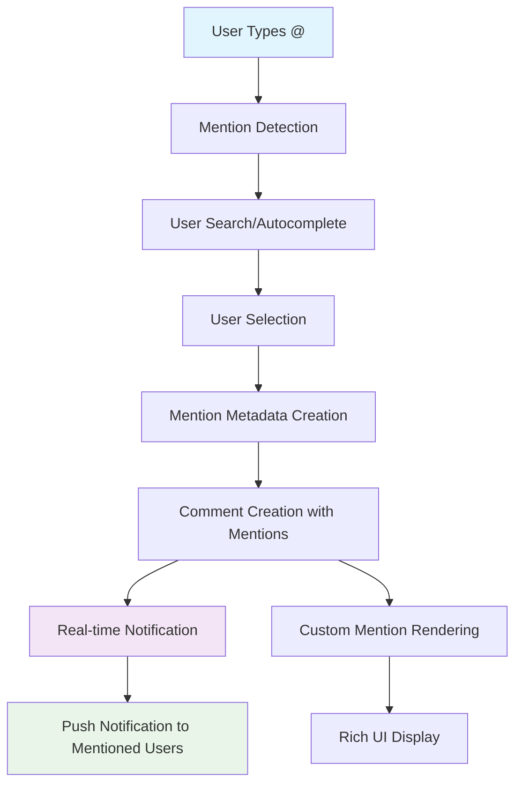

# Mentions in Comments

Enable powerful user tagging in comments with mentions that automatically notify users, support custom rendering, and provide rich autocomplete experiences. Mentions enhance engagement by connecting users and facilitating targeted conversations.

<Info>
Mentions automatically trigger **push notifications** to tagged users and support **custom metadata** for rich mention rendering with avatars, names, and custom styling.
</Info>

## Architecture Overview



## Mention Components

| Component | Description | Purpose |
|-----------|-------------|---------|
| **Detection** | Identify @ symbols and potential mentions | Trigger autocomplete |
| **Search** | Find users matching typed text | Provide selection options |
| **Metadata** | Store mention position and user info | Enable custom rendering |
| **Rendering** | Display mentions with custom styling | Visual differentiation |
| **Notifications** | Alert mentioned users | Drive engagement |

## Create Comments with Mentions

Integrate user mentions into comment creation with proper metadata for notifications and rendering.

<Tabs>
<Tab title="iOS">
```swift
import AmitySDK

struct MentionData {
    let userId: String
    let displayName: String
    let index: Int
    let length: Int
}

class CommentMentionManager {
    private let commentRepository: AmityCommentRepository
    private let userRepository: AmityUserRepository
    
    init(client: AmityClient) {
        self.commentRepository = AmityCommentRepository(client: client)
        self.userRepository = AmityUserRepository(client: client)
    }
    
    // Create comment with mentions
    func createCommentWithMentions(
        referenceId: String,
        referenceType: AmityCommentReferenceType,
        text: String,
        mentions: [MentionData],
        parentId: String? = nil,
        completion: @escaping (Result<AmityComment, Error>) -> Void
    ) {
        // Extract user IDs from mentions
        let mentionUserIds = mentions.map { $0.userId }
        
        // Create mention metadata for proper rendering
        let mentionMetadata = createMentionMetadata(from: mentions, in: text)
        
        let builder = AmityCommentCreationDataBuilder()
        builder.setText(text)
        builder.setMentionUsers(mentionUserIds)
        builder.setMetadata(mentionMetadata)
        builder.setParentId(parentId)
        
        commentRepository.createComment(
            for: referenceId,
            referenceType: referenceType,
            with: builder.build()
        ).observeOnce { result in
            completion(result)
        }
    }
    
    // Create mention metadata for custom rendering
    private func createMentionMetadata(from mentions: [MentionData], in text: String) -> [String: Any] {
        let mentionArray = mentions.map { mention in
            return [
                "userId": mention.userId,
                "displayName": mention.displayName,
                "type": "user",
                "index": mention.index,
                "length": mention.length
            ]
        }
        
        return [
            "mentions": mentionArray,
            "originalText": text
        ]
    }
    
    // Search users for autocomplete
    func searchUsers(
        query: String,
        completion: @escaping (Result<[AmityUser], Error>) -> Void
    ) {
        let userQuery = AmityUserQuery.Builder()
            .setDisplayName(query)
            .setLimit(10)
            .build()
        
        userRepository.getUsers(with: userQuery).observeOnce { result in
            switch result {
            case .success(let userCollection):
                let users = Array(userCollection.allObjects())
                completion(.success(users))
            case .failure(let error):
                completion(.failure(error))
            }
        }
    }
    
    // Update comment with mentions
    func updateCommentWithMentions(
        commentId: String,
        newText: String,
        mentions: [MentionData],
        completion: @escaping (Result<AmityComment, Error>) -> Void
    ) {
        let mentionUserIds = mentions.map { $0.userId }
        let mentionMetadata = createMentionMetadata(from: mentions, in: newText)
        
        let editor = AmityCommentEditor(client: commentRepository.client)
        editor.edit(commentId: commentId)
            .setText(newText)
            .setMentionUsers(mentionUserIds)
            .setMetadata(mentionMetadata)
            .update { result in
                completion(result)
            }
    }
    
    // Remove mentions from comment
    func removeMentionsFromComment(
        commentId: String,
        newText: String,
        completion: @escaping (Result<AmityComment, Error>) -> Void
    ) {
        let editor = AmityCommentEditor(client: commentRepository.client)
        editor.edit(commentId: commentId)
            .setText(newText)
            .setMentionUsers([]) // Empty array removes all mentions
            .setMetadata([:])    // Empty metadata
            .update { result in
                completion(result)
            }
    }
}

// Custom text view with mention support
class MentionTextView: UITextView {
    var onMentionTriggered: ((String) -> Void)?
    var onUserSelected: ((AmityUser) -> Void)?
    
    private var currentMentionRange: NSRange?
    private var mentionData: [MentionData] = []
    
    override func awakeFromNib() {
        super.awakeFromNib()
        delegate = self
    }
    
    // Parse text for mentions and apply styling
    func applyMentionStyling() {
        let attributedText = NSMutableAttributedString(string: text)
        
        // Reset styling
        attributedText.addAttribute(.foregroundColor, value: UIColor.label, range: NSRange(location: 0, length: text.count))
        
        // Apply mention styling
        for mention in mentionData {
            let range = NSRange(location: mention.index, length: mention.length)
            attributedText.addAttributes([
                .foregroundColor: UIColor.systemBlue,
                .font: UIFont.boldSystemFont(ofSize: font?.pointSize ?? 16)
            ], range: range)
        }
        
        self.attributedText = attributedText
    }
    
    // Insert mention at current position
    func insertMention(_ user: AmityUser) {
        guard let mentionRange = currentMentionRange else { return }
        
        let mentionText = "@\(user.displayName ?? user.userId)"
        let newText = (text as NSString).replacingCharacters(in: mentionRange, with: mentionText)
        
        // Update mention data
        let mention = MentionData(
            userId: user.userId,
            displayName: user.displayName ?? user.userId,
            index: mentionRange.location,
            length: mentionText.count
        )
        
        mentionData.append(mention)
        text = newText
        
        applyMentionStyling()
        currentMentionRange = nil
    }
    
    // Get current mentions for comment creation
    func getCurrentMentions() -> [MentionData] {
        return mentionData
    }
}

extension MentionTextView: UITextViewDelegate {
    func textView(_ textView: UITextView, shouldChangeTextIn range: NSRange, replacementText text: String) -> Bool {
        // Detect @ symbol for mention triggering
        if text == "@" {
            currentMentionRange = NSRange(location: range.location, length: 1)
            onMentionTriggered?("")
            return true
        }
        
        // Handle mention typing
        if let mentionRange = currentMentionRange, text != " " && text != "\n" {
            let currentQuery = (textView.text as NSString).substring(with: NSRange(
                location: mentionRange.location + 1,
                length: range.location - mentionRange.location - 1
            )) + text
            
            onMentionTriggered?(currentQuery)
        }
        
        return true
    }
}

// Usage in view controller
class CommentComposeViewController: UIViewController {
    @IBOutlet weak var mentionTextView: MentionTextView!
    @IBOutlet weak var userSuggestionsTableView: UITableView!
    
    private let mentionManager: CommentMentionManager
    private var suggestedUsers: [AmityUser] = []
    private let postId: String
    
    init(postId: String, client: AmityClient) {
        self.postId = postId
        self.mentionManager = CommentMentionManager(client: client)
        super.init(nibName: nil, bundle: nil)
    }
    
    override func viewDidLoad() {
        super.viewDidLoad()
        setupMentionHandling()
    }
    
    private func setupMentionHandling() {
        mentionTextView.onMentionTriggered = { [weak self] query in
            self?.searchUsersForMention(query: query)
        }
        
        mentionTextView.onUserSelected = { [weak self] user in
            self?.mentionTextView.insertMention(user)
            self?.hideSuggestions()
        }
    }
    
    private func searchUsersForMention(query: String) {
        guard !query.isEmpty else {
            hideSuggestions()
            return
        }
        
        mentionManager.searchUsers(query: query) { [weak self] result in
            DispatchQueue.main.async {
                switch result {
                case .success(let users):
                    self?.showUserSuggestions(users)
                case .failure(let error):
                    print("Failed to search users: \(error)")
                    self?.hideSuggestions()
                }
            }
        }
    }
    
    private func showUserSuggestions(_ users: [AmityUser]) {
        suggestedUsers = users
        userSuggestionsTableView.reloadData()
        userSuggestionsTableView.isHidden = false
    }
    
    private func hideSuggestions() {
        userSuggestionsTableView.isHidden = true
        suggestedUsers.removeAll()
    }
    
    @IBAction func postComment() {
        let text = mentionTextView.text ?? ""
        let mentions = mentionTextView.getCurrentMentions()
        
        mentionManager.createCommentWithMentions(
            referenceId: postId,
            referenceType: .post,
            text: text,
            mentions: mentions
        ) { [weak self] result in
            DispatchQueue.main.async {
                switch result {
                case .success:
                    self?.navigationController?.popViewController(animated: true)
                case .failure(let error):
                    self?.showError("Failed to post comment: \(error.localizedDescription)")
                }
            }
        }
    }
}
```
</Tab>

<Tab title="Android">
```kotlin
import com.amity.socialcloud.sdk.social.comment.*
import com.amity.socialcloud.sdk.social.user.*

data class MentionData(
    val userId: String,
    val displayName: String,
    val index: Int,
    val length: Int
)

class CommentMentionManager(private val client: AmityClient) {
    private val commentRepository = AmityCommentRepository(client)
    private val userRepository = AmityUserRepository(client)
    
    // Create comment with mentions
    fun createCommentWithMentions(
        referenceId: String,
        referenceType: AmityCommentReferenceType,
        text: String,
        mentions: List<MentionData>,
        parentId: String? = null,
        callback: (Result<AmityComment>) -> Unit
    ) {
        val mentionUserIds = mentions.map { it.userId }
        val mentionMetadata = createMentionMetadata(mentions, text)
        
        val builder = AmityCommentCreationDataBuilder().apply {
            setText(text)
            setMentionUsers(mentionUserIds)
            setMetadata(mentionMetadata)
            parentId?.let { setParentId(it) }
        }
        
        commentRepository.createComment(referenceId, referenceType, builder.build())
            .observeOn(AndroidSchedulers.mainThread())
            .subscribe(
                { comment ->
                    callback(Result.success(comment))
                },
                { error ->
                    callback(Result.failure(RuntimeException(error)))
                }
            )
    }
    
    // Create mention metadata for proper rendering
    private fun createMentionMetadata(mentions: List<MentionData>, text: String): Map<String, Any> {
        val mentionArray = mentions.map { mention ->
            mapOf(
                "userId" to mention.userId,
                "displayName" to mention.displayName,
                "type" to "user",
                "index" to mention.index,
                "length" to mention.length
            )
        }
        
        return mapOf(
            "mentions" to mentionArray,
            "originalText" to text
        )
    }
    
    // Search users for autocomplete
    fun searchUsers(
        query: String,
        callback: (Result<List<AmityUser>>) -> Unit
    ): Disposable {
        val userQuery = AmityUserQuery.Builder()
            .setDisplayName(query)
            .setLimit(10)
            .build()
        
        return userRepository.getUsers(userQuery)
            .observeOn(AndroidSchedulers.mainThread())
            .subscribe(
                { userCollection ->
                    val users = userCollection.toList()
                    callback(Result.success(users))
                },
                { error ->
                    callback(Result.failure(RuntimeException(error)))
                }
            )
    }
    
    // Update comment with mentions
    fun updateCommentWithMentions(
        commentId: String,
        newText: String,
        mentions: List<MentionData>,
        callback: (Result<AmityComment>) -> Unit
    ) {
        val mentionUserIds = mentions.map { it.userId }
        val mentionMetadata = createMentionMetadata(mentions, newText)
        
        commentRepository.updateComment(commentId)
            .setText(newText)
            .setMentionUsers(mentionUserIds)
            .setMetadata(mentionMetadata)
            .build()
            .observeOn(AndroidSchedulers.mainThread())
            .subscribe(
                { comment ->
                    callback(Result.success(comment))
                },
                { error ->
                    callback(Result.failure(RuntimeException(error)))
                }
            )
    }
    
    // Remove mentions from comment
    fun removeMentionsFromComment(
        commentId: String,
        newText: String,
        callback: (Result<AmityComment>) -> Unit
    ) {
        commentRepository.updateComment(commentId)
            .setText(newText)
            .setMentionUsers(emptyList())
            .setMetadata(emptyMap())
            .build()
            .observeOn(AndroidSchedulers.mainThread())
            .subscribe(
                { comment ->
                    callback(Result.success(comment))
                },
                { error ->
                    callback(Result.failure(RuntimeException(error)))
                }
            )
    }
}

// Custom EditText with mention support
class MentionEditText @JvmOverloads constructor(
    context: Context,
    attrs: AttributeSet? = null,
    defStyleAttr: Int = 0
) : AppCompatEditText(context, attrs, defStyleAttr) {
    
    var onMentionTriggered: ((String) -> Unit)? = null
    var onUserSelected: ((AmityUser) -> Unit)? = null
    
    private var currentMentionStart: Int = -1
    private val mentionData = mutableListOf<MentionData>()
    
    init {
        addTextChangedListener(object : TextWatcher {
            override fun beforeTextChanged(s: CharSequence?, start: Int, count: Int, after: Int) {}
            
            override fun onTextChanged(s: CharSequence?, start: Int, before: Int, count: Int) {
                handleMentionDetection(s.toString(), start, count)
            }
            
            override fun afterTextChanged(s: Editable?) {
                applyMentionStyling()
            }
        })
    }
    
    private fun handleMentionDetection(text: String, start: Int, count: Int) {
        if (count == 1 && start < text.length && text[start] == '@') {
            currentMentionStart = start
            onMentionTriggered?.invoke("")
        } else if (currentMentionStart != -1) {
            val mentionEnd = start + count
            if (mentionEnd <= text.length) {
                val mentionQuery = text.substring(currentMentionStart + 1, mentionEnd)
                if (mentionQuery.contains(' ') || mentionQuery.contains('\n')) {
                    currentMentionStart = -1
                    onMentionTriggered?.invoke("")
                } else {
                    onMentionTriggered?.invoke(mentionQuery)
                }
            }
        }
    }
    
    fun insertMention(user: AmityUser) {
        if (currentMentionStart == -1) return
        
        val mentionText = "@${user.getDisplayName() ?: user.getUserId()}"
        val currentText = text.toString()
        val beforeMention = currentText.substring(0, currentMentionStart)
        val afterMention = currentText.substring(selectionEnd)
        val newText = beforeMention + mentionText + afterMention
        
        // Add mention data
        val mention = MentionData(
            userId = user.getUserId(),
            displayName = user.getDisplayName() ?: user.getUserId(),
            index = currentMentionStart,
            length = mentionText.length
        )
        
        mentionData.add(mention)
        setText(newText)
        setSelection(currentMentionStart + mentionText.length)
        
        currentMentionStart = -1
    }
    
    private fun applyMentionStyling() {
        val spannableText = SpannableString(text)
        
        // Clear existing spans
        val existingSpans = spannableText.getSpans(0, spannableText.length, ForegroundColorSpan::class.java)
        existingSpans.forEach { spannableText.removeSpan(it) }
        
        // Apply mention styling
        mentionData.forEach { mention ->
            if (mention.index + mention.length <= spannableText.length) {
                spannableText.setSpan(
                    ForegroundColorSpan(ContextCompat.getColor(context, R.color.mention_color)),
                    mention.index,
                    mention.index + mention.length,
                    Spannable.SPAN_EXCLUSIVE_EXCLUSIVE
                )
                
                spannableText.setSpan(
                    StyleSpan(Typeface.BOLD),
                    mention.index,
                    mention.index + mention.length,
                    Spannable.SPAN_EXCLUSIVE_EXCLUSIVE
                )
            }
        }
        
        setText(spannableText)
    }
    
    fun getCurrentMentions(): List<MentionData> = mentionData.toList()
    
    fun clearMentions() {
        mentionData.clear()
        applyMentionStyling()
    }
}

// Usage in Activity/Fragment
class CommentComposeActivity : AppCompatActivity() {
    private lateinit var mentionEditText: MentionEditText
    private lateinit var userSuggestionsRecyclerView: RecyclerView
    private lateinit var mentionManager: CommentMentionManager
    
    private var suggestionsAdapter: UserSuggestionsAdapter? = null
    private lateinit var postId: String
    
    override fun onCreate(savedInstanceState: Bundle?) {
        super.onCreate(savedInstanceState)
        setContentView(R.layout.activity_comment_compose)
        
        postId = intent.getStringExtra("POST_ID") ?: ""
        mentionManager = CommentMentionManager(AmityClient.getInstance())
        
        setupViews()
        setupMentionHandling()
    }
    
    private fun setupViews() {
        mentionEditText = findViewById(R.id.mentionEditText)
        userSuggestionsRecyclerView = findViewById(R.id.userSuggestionsRecyclerView)
        
        suggestionsAdapter = UserSuggestionsAdapter { user ->
            mentionEditText.insertMention(user)
            hideSuggestions()
        }
        
        userSuggestionsRecyclerView.adapter = suggestionsAdapter
        userSuggestionsRecyclerView.layoutManager = LinearLayoutManager(this)
    }
    
    private fun setupMentionHandling() {
        mentionEditText.onMentionTriggered = { query ->
            if (query.isEmpty()) {
                hideSuggestions()
            } else {
                searchUsersForMention(query)
            }
        }
    }
    
    private fun searchUsersForMention(query: String) {
        mentionManager.searchUsers(query) { result ->
            when {
                result.isSuccess -> {
                    val users = result.getOrNull() ?: emptyList()
                    showUserSuggestions(users)
                }
                result.isFailure -> {
                    Log.e("Mentions", "Failed to search users", result.exceptionOrNull())
                    hideSuggestions()
                }
            }
        }
    }
    
    private fun showUserSuggestions(users: List<AmityUser>) {
        suggestionsAdapter?.updateUsers(users)
        userSuggestionsRecyclerView.visibility = View.VISIBLE
    }
    
    private fun hideSuggestions() {
        userSuggestionsRecyclerView.visibility = View.GONE
        suggestionsAdapter?.updateUsers(emptyList())
    }
    
    fun postComment(view: View) {
        val text = mentionEditText.text.toString().trim()
        val mentions = mentionEditText.getCurrentMentions()
        
        if (text.isEmpty()) return
        
        mentionManager.createCommentWithMentions(
            referenceId = postId,
            referenceType = AmityCommentReferenceType.POST,
            text = text,
            mentions = mentions
        ) { result ->
            when {
                result.isSuccess -> {
                    finish()
                }
                result.isFailure -> {
                    Toast.makeText(
                        this,
                        "Failed to post comment: ${result.exceptionOrNull()?.message}",
                        Toast.LENGTH_SHORT
                    ).show()
                }
            }
        }
    }
}

// Adapter for user suggestions
class UserSuggestionsAdapter(
    private val onUserSelected: (AmityUser) -> Unit
) : RecyclerView.Adapter<UserSuggestionsAdapter.ViewHolder>() {
    
    private var users = listOf<AmityUser>()
    
    fun updateUsers(newUsers: List<AmityUser>) {
        users = newUsers
        notifyDataSetChanged()
    }
    
    override fun onCreateViewHolder(parent: ViewGroup, viewType: Int): ViewHolder {
        val view = LayoutInflater.from(parent.context)
            .inflate(R.layout.item_user_suggestion, parent, false)
        return ViewHolder(view)
    }
    
    override fun onBindViewHolder(holder: ViewHolder, position: Int) {
        holder.bind(users[position], onUserSelected)
    }
    
    override fun getItemCount(): Int = users.size
    
    class ViewHolder(itemView: View) : RecyclerView.ViewHolder(itemView) {
        private val avatarImageView: ImageView = itemView.findViewById(R.id.avatarImageView)
        private val displayNameTextView: TextView = itemView.findViewById(R.id.displayNameTextView)
        private val userIdTextView: TextView = itemView.findViewById(R.id.userIdTextView)
        
        fun bind(user: AmityUser, onUserSelected: (AmityUser) -> Unit) {
            displayNameTextView.text = user.getDisplayName() ?: user.getUserId()
            userIdTextView.text = "@${user.getUserId()}"
            
            // Load avatar image
            user.getAvatar()?.let { avatar ->
                Glide.with(itemView.context)
                    .load(avatar.getUrl())
                    .placeholder(R.drawable.default_avatar)
                    .circleCrop()
                    .into(avatarImageView)
            }
            
            itemView.setOnClickListener {
                onUserSelected(user)
            }
        }
    }
}
```
</Tab>

<Tab title="TypeScript">
```typescript
import { 
    AmityClient, 
    CommentRepository, 
    UserRepository,
    AmityComment,
    AmityUser,
    AmityCommentReferenceType 
} from '@amityco/ts-sdk';

interface MentionData {
    userId: string;
    displayName: string;
    index: number;
    length: number;
}

interface MentionMetadata {
    mentions: MentionData[];
    originalText: string;
}

class CommentMentionManager {
    private commentRepository: CommentRepository;
    private userRepository: UserRepository;
    
    constructor(client: AmityClient) {
        this.commentRepository = new CommentRepository(client);
        this.userRepository = new UserRepository(client);
    }
    
    // Create comment with mentions
    async createCommentWithMentions(options: {
        referenceId: string;
        referenceType: AmityCommentReferenceType;
        text: string;
        mentions: MentionData[];
        parentId?: string;
    }): Promise<AmityComment> {
        const { referenceId, referenceType, text, mentions, parentId } = options;
        
        const mentionUserIds = mentions.map(mention => mention.userId);
        const mentionMetadata = this.createMentionMetadata(mentions, text);
        
        const commentData = {
            text,
            mentionUsers: mentionUserIds,
            metadata: mentionMetadata,
            parentId
        };
        
        return await this.commentRepository.createComment(
            referenceId,
            referenceType,
            commentData
        );
    }
    
    // Create mention metadata for proper rendering
    private createMentionMetadata(mentions: MentionData[], text: string): MentionMetadata {
        return {
            mentions: mentions.map(mention => ({
                userId: mention.userId,
                displayName: mention.displayName,
                type: 'user',
                index: mention.index,
                length: mention.length
            })),
            originalText: text
        };
    }
    
    // Search users for autocomplete
    async searchUsers(query: string, limit: number = 10): Promise<AmityUser[]> {
        const userQuery = {
            displayName: query,
            limit
        };
        
        const userCollection = await this.userRepository.getUsers(userQuery);
        return userCollection.data;
    }
    
    // Update comment with mentions
    async updateCommentWithMentions(
        commentId: string,
        newText: string,
        mentions: MentionData[]
    ): Promise<AmityComment> {
        const mentionUserIds = mentions.map(mention => mention.userId);
        const mentionMetadata = this.createMentionMetadata(mentions, newText);
        
        return await this.commentRepository.updateComment(commentId, {
            text: newText,
            mentionUsers: mentionUserIds,
            metadata: mentionMetadata
        });
    }
    
    // Remove mentions from comment
    async removeMentionsFromComment(
        commentId: string,
        newText: string
    ): Promise<AmityComment> {
        return await this.commentRepository.updateComment(commentId, {
            text: newText,
            mentionUsers: [],
            metadata: {}
        });
    }
    
    // Parse text and extract mention positions
    parseMentions(text: string, users: AmityUser[]): MentionData[] {
        const mentions: MentionData[] = [];
        const mentionRegex = /@(\w+)/g;
        let match;
        
        while ((match = mentionRegex.exec(text)) !== null) {
            const mentionText = match[0];
            const username = match[1];
            const user = users.find(u => 
                u.userId === username || u.displayName === username
            );
            
            if (user) {
                mentions.push({
                    userId: user.userId,
                    displayName: user.displayName || user.userId,
                    index: match.index,
                    length: mentionText.length
                });
            }
        }
        
        return mentions;
    }
}

// React component for mention input
interface MentionInputProps {
    placeholder?: string;
    onSubmit: (text: string, mentions: MentionData[]) => void;
    className?: string;
}

const MentionInput: React.FC<MentionInputProps> = ({
    placeholder = "Write a comment...",
    onSubmit,
    className
}) => {
    const [text, setText] = React.useState('');
    const [mentions, setMentions] = React.useState<MentionData[]>([]);
    const [showSuggestions, setShowSuggestions] = React.useState(false);
    const [suggestions, setSuggestions] = React.useState<AmityUser[]>([]);
    const [mentionQuery, setMentionQuery] = React.useState('');
    const [mentionStart, setMentionStart] = React.useState(-1);
    
    const mentionManager = new CommentMentionManager(AmityClient.getInstance());
    const textareaRef = React.useRef<HTMLTextAreaElement>(null);
    
    // Handle text change and mention detection
    const handleTextChange = (e: React.ChangeEvent<HTMLTextAreaElement>) => {
        const newText = e.target.value;
        const cursorPosition = e.target.selectionStart;
        
        setText(newText);
        
        // Detect mention trigger
        const beforeCursor = newText.substring(0, cursorPosition);
        const mentionMatch = beforeCursor.match(/@(\w*)$/);
        
        if (mentionMatch) {
            const query = mentionMatch[1];
            setMentionQuery(query);
            setMentionStart(mentionMatch.index!);
            
            if (query.length > 0) {
                searchUsers(query);
            } else {
                setShowSuggestions(true);
                setSuggestions([]);
            }
        } else {
            setShowSuggestions(false);
            setMentionStart(-1);
        }
    };
    
    // Search users for mention suggestions
    const searchUsers = async (query: string) => {
        try {
            const users = await mentionManager.searchUsers(query);
            setSuggestions(users);
            setShowSuggestions(users.length > 0);
        } catch (error) {
            console.error('Failed to search users:', error);
            setShowSuggestions(false);
        }
    };
    
    // Insert mention into text
    const insertMention = (user: AmityUser) => {
        if (mentionStart === -1) return;
        
        const mentionText = `@${user.displayName || user.userId}`;
        const beforeMention = text.substring(0, mentionStart);
        const afterMention = text.substring(mentionStart + mentionQuery.length + 1);
        const newText = beforeMention + mentionText + ' ' + afterMention;
        
        // Add mention data
        const newMention: MentionData = {
            userId: user.userId,
            displayName: user.displayName || user.userId,
            index: mentionStart,
            length: mentionText.length
        };
        
        setMentions(prev => [...prev, newMention]);
        setText(newText);
        setShowSuggestions(false);
        setMentionStart(-1);
        
        // Focus back to textarea
        if (textareaRef.current) {
            const newCursorPos = mentionStart + mentionText.length + 1;
            setTimeout(() => {
                textareaRef.current!.focus();
                textareaRef.current!.setSelectionRange(newCursorPos, newCursorPos);
            }, 0);
        }
    };
    
    // Handle form submission
    const handleSubmit = (e: React.FormEvent) => {
        e.preventDefault();
        if (text.trim()) {
            onSubmit(text.trim(), mentions);
            setText('');
            setMentions([]);
        }
    };
    
    // Render text with mention highlighting
    const renderTextWithMentions = () => {
        if (mentions.length === 0) return text;
        
        const parts: React.ReactNode[] = [];
        let lastIndex = 0;
        
        mentions
            .sort((a, b) => a.index - b.index)
            .forEach((mention, i) => {
                // Add text before mention
                if (mention.index > lastIndex) {
                    parts.push(text.substring(lastIndex, mention.index));
                }
                
                // Add mention with styling
                parts.push(
                    <span key={i} className="mention-highlight">
                        {text.substring(mention.index, mention.index + mention.length)}
                    </span>
                );
                
                lastIndex = mention.index + mention.length;
            });
        
        // Add remaining text
        if (lastIndex < text.length) {
            parts.push(text.substring(lastIndex));
        }
        
        return parts;
    };
    
    return (
        <div className={`mention-input ${className || ''}`}>
            <form onSubmit={handleSubmit}>
                <div className="input-container">
                    <textarea
                        ref={textareaRef}
                        value={text}
                        onChange={handleTextChange}
                        placeholder={placeholder}
                        className="mention-textarea"
                        rows={3}
                    />
                    
                    {/* Suggestion dropdown */}
                    {showSuggestions && (
                        <div className="suggestions-dropdown">
                            {suggestions.length > 0 ? (
                                suggestions.map(user => (
                                    <div
                                        key={user.userId}
                                        className="suggestion-item"
                                        onClick={() => insertMention(user)}
                                    >
                                        
                                        <div className="suggestion-details">
                                            <div className="suggestion-name">
                                                {user.displayName || user.userId}
                                            </div>
                                            <div className="suggestion-username">
                                                @{user.userId}
                                            </div>
                                        </div>
                                    </div>
                                ))
                            ) : (
                                <div className="no-suggestions">
                                    Type to search users...
                                </div>
                            )}
                        </div>
                    )}
                </div>
                
                <button type="submit" className="submit-button">
                    Post Comment
                </button>
            </form>
        </div>
    );
};

// Usage in parent component
const CommentsSection: React.FC<{ postId: string }> = ({ postId }) => {
    const mentionManager = new CommentMentionManager(AmityClient.getInstance());
    
    const handleCommentSubmit = async (text: string, mentions: MentionData[]) => {
        try {
            await mentionManager.createCommentWithMentions({
                referenceId: postId,
                referenceType: AmityCommentReferenceType.POST,
                text,
                mentions
            });
            
            console.log('Comment with mentions posted successfully');
        } catch (error) {
            console.error('Failed to post comment with mentions:', error);
        }
    };
    
    return (
        <div className="comments-section">
            <MentionInput
                placeholder="Write a comment with @mentions..."
                onSubmit={handleCommentSubmit}
            />
        </div>
    );
};
```
</Tab>

<Tab title="Flutter">
```dart
import 'package:amity_sdk/amity_sdk.dart';
import 'package:flutter/material.dart';

class MentionData {
  final String userId;
  final String displayName;
  final int index;
  final int length;
  
  MentionData({
    required this.userId,
    required this.displayName,
    required this.index,
    required this.length,
  });
  
  Map<String, dynamic> toMap() {
    return {
      'userId': userId,
      'displayName': displayName,
      'type': 'user',
      'index': index,
      'length': length,
    };
  }
}

class CommentMentionManager {
  final AmitySDK _amitySDK;
  
  CommentMentionManager(this._amitySDK);
  
  // Create comment with mentions
  Future<AmityComment> createCommentWithMentions({
    required String referenceId,
    required AmityCommentReferenceType referenceType,
    required String text,
    required List<MentionData> mentions,
    String? parentId,
  }) async {
    final mentionUserIds = mentions.map((m) => m.userId).toList();
    final mentionMetadata = _createMentionMetadata(mentions, text);
    
    final commentData = AmityCommentCreationData(
      text: text,
      mentionUsers: mentionUserIds,
      metadata: mentionMetadata,
      parentId: parentId,
    );
    
    return await _amitySDK.commentRepository.createComment(
      referenceId,
      referenceType,
      commentData,
    );
  }
  
  // Create mention metadata for proper rendering
  Map<String, dynamic> _createMentionMetadata(List<MentionData> mentions, String text) {
    return {
      'mentions': mentions.map((m) => m.toMap()).toList(),
      'originalText': text,
    };
  }
  
  // Search users for autocomplete
  Future<List<AmityUser>> searchUsers(String query, {int limit = 10}) async {
    final userQuery = AmityUserQuery(
      displayName: query,
      limit: limit,
    );
    
    return await _amitySDK.userRepository.getUsers(userQuery);
  }
  
  // Update comment with mentions
  Future<AmityComment> updateCommentWithMentions(
    String commentId,
    String newText,
    List<MentionData> mentions,
  ) async {
    final mentionUserIds = mentions.map((m) => m.userId).toList();
    final mentionMetadata = _createMentionMetadata(mentions, newText);
    
    return await _amitySDK.commentRepository.updateComment(
      commentId,
      AmityCommentUpdateData(
        text: newText,
        mentionUsers: mentionUserIds,
        metadata: mentionMetadata,
      ),
    );
  }
  
  // Remove mentions from comment
  Future<AmityComment> removeMentionsFromComment(
    String commentId,
    String newText,
  ) async {
    return await _amitySDK.commentRepository.updateComment(
      commentId,
      AmityCommentUpdateData(
        text: newText,
        mentionUsers: [],
        metadata: {},
      ),
    );
  }
  
  // Parse text and extract mention positions
  List<MentionData> parseMentions(String text, List<AmityUser> users) {
    final mentions = <MentionData>[];
    final mentionRegex = RegExp(r'@(\w+)');
    final matches = mentionRegex.allMatches(text);
    
    for (final match in matches) {
      final mentionText = match.group(0)!;
      final username = match.group(1)!;
      
      final user = users.firstWhere(
        (u) => u.userId == username || u.displayName == username,
        orElse: () => null,
      );
      
      if (user != null) {
        mentions.add(MentionData(
          userId: user.userId,
          displayName: user.displayName ?? user.userId,
          index: match.start,
          length: mentionText.length,
        ));
      }
    }
    
    return mentions;
  }
}

// Custom text field with mention support
class MentionTextField extends StatefulWidget {
  final String? hintText;
  final Function(String, List<MentionData>) onSubmit;
  final int maxLines;
  
  const MentionTextField({
    Key? key,
    this.hintText,
    required this.onSubmit,
    this.maxLines = 3,
  }) : super(key: key);
  
  @override
  State<MentionTextField> createState() => _MentionTextFieldState();
}

class _MentionTextFieldState extends State<MentionTextField> {
  final TextEditingController _controller = TextEditingController();
  final CommentMentionManager _mentionManager = CommentMentionManager(AmitySDK.instance);
  final OverlayEntry? _overlayEntry = null;
  
  List<MentionData> _mentions = [];
  List<AmityUser> _suggestions = [];
  bool _showSuggestions = false;
  int _mentionStart = -1;
  String _mentionQuery = '';
  
  @override
  void initState() {
    super.initState();
    _controller.addListener(_onTextChanged);
  }
  
  @override
  void dispose() {
    _controller.removeListener(_onTextChanged);
    _controller.dispose();
    _overlayEntry?.remove();
    super.dispose();
  }
  
  void _onTextChanged() {
    final text = _controller.text;
    final selection = _controller.selection;
    
    if (selection.isValid) {
      final cursorPosition = selection.start;
      final beforeCursor = text.substring(0, cursorPosition);
      final mentionMatch = RegExp(r'@(\w*)$').firstMatch(beforeCursor);
      
      if (mentionMatch != null) {
        final query = mentionMatch.group(1) ?? '';
        setState(() {
          _mentionQuery = query;
          _mentionStart = mentionMatch.start;
        });
        
        if (query.isNotEmpty) {
          _searchUsers(query);
        } else {
          setState(() {
            _showSuggestions = true;
            _suggestions = [];
          });
        }
      } else {
        setState(() {
          _showSuggestions = false;
          _mentionStart = -1;
        });
      }
    }
  }
  
  Future<void> _searchUsers(String query) async {
    try {
      final users = await _mentionManager.searchUsers(query);
      setState(() {
        _suggestions = users;
        _showSuggestions = users.isNotEmpty;
      });
    } catch (error) {
      print('Failed to search users: $error');
      setState(() {
        _showSuggestions = false;
      });
    }
  }
  
  void _insertMention(AmityUser user) {
    if (_mentionStart == -1) return;
    
    final mentionText = '@${user.displayName ?? user.userId}';
    final currentText = _controller.text;
    final beforeMention = currentText.substring(0, _mentionStart);
    final afterMention = currentText.substring(_mentionStart + _mentionQuery.length + 1);
    final newText = '$beforeMention$mentionText $afterMention';
    
    // Add mention data
    final mention = MentionData(
      userId: user.userId,
      displayName: user.displayName ?? user.userId,
      index: _mentionStart,
      length: mentionText.length,
    );
    
    setState(() {
      _mentions.add(mention);
      _showSuggestions = false;
      _mentionStart = -1;
    });
    
    _controller.text = newText;
    
    // Set cursor position after mention
    final newCursorPos = _mentionStart + mentionText.length + 1;
    _controller.selection = TextSelection.fromPosition(
      TextPosition(offset: newCursorPos),
    );
  }
  
  void _submitComment() {
    final text = _controller.text.trim();
    if (text.isNotEmpty) {
      widget.onSubmit(text, _mentions);
      _controller.clear();
      setState(() {
        _mentions.clear();
      });
    }
  }
  
  @override
  Widget build(BuildContext context) {
    return Column(
      children: [
        Stack(
          children: [
            TextField(
              controller: _controller,
              decoration: InputDecoration(
                hintText: widget.hintText ?? 'Write a comment...',
                border: const OutlineInputBorder(),
                suffixIcon: IconButton(
                  icon: const Icon(Icons.send),
                  onPressed: _submitComment,
                ),
              ),
              maxLines: widget.maxLines,
            ),
            
            // Suggestion overlay
            if (_showSuggestions)
              Positioned(
                top: 60,
                left: 0,
                right: 0,
                child: Material(
                  elevation: 4,
                  borderRadius: BorderRadius.circular(8),
                  child: Container(
                    constraints: const BoxConstraints(maxHeight: 200),
                    child: ListView.builder(
                      shrinkWrap: true,
                      itemCount: _suggestions.length,
                      itemBuilder: (context, index) {
                        final user = _suggestions[index];
                        return ListTile(
                          leading: CircleAvatar(
                            backgroundImage: user.avatar?.fileUrl != null
                                ? NetworkImage(user.avatar!.fileUrl!)
                                : null,
                            child: user.avatar?.fileUrl == null
                                ? Text(user.displayName?.substring(0, 1).toUpperCase() ?? 'U')
                                : null,
                          ),
                          title: Text(user.displayName ?? user.userId),
                          subtitle: Text('@${user.userId}'),
                          onTap: () => _insertMention(user),
                        );
                      },
                    ),
                  ),
                ),
              ),
          ],
        ),
      ],
    );
  }
}

// Usage in parent widget
class CommentsSection extends StatelessWidget {
  final String postId;
  
  const CommentsSection({Key? key, required this.postId}) : super(key: key);
  
  @override
  Widget build(BuildContext context) {
    final mentionManager = CommentMentionManager(AmitySDK.instance);
    
    return Column(
      children: [
        // Other comment widgets...
        
        MentionTextField(
          hintText: 'Write a comment with @mentions...',
          onSubmit: (text, mentions) async {
            try {
              await mentionManager.createCommentWithMentions(
                referenceId: postId,
                referenceType: AmityCommentReferenceType.post,
                text: text,
                mentions: mentions,
              );
              
              ScaffoldMessenger.of(context).showSnackBar(
                const SnackBar(content: Text('Comment posted successfully!')),
              );
            } catch (error) {
              ScaffoldMessenger.of(context).showSnackBar(
                SnackBar(content: Text('Failed to post comment: $error')),
              );
            }
          },
        ),
      ],
    );
  }
}
```
</Tab>
</Tabs>

## Advanced Mention Features

<AccordionGroup>
  <Accordion title="Custom Mention Autocomplete">
    Build sophisticated autocomplete with fuzzy search, recent users, and custom ranking.

    ```typescript
    interface MentionAutocomplete {
        searchUsers(query: string, options?: SearchOptions): Promise<User[]>;
        getRankedSuggestions(query: string, context: MentionContext): Promise<User[]>;
        cacheRecentMentions(userId: string): void;
    }

    class AdvancedMentionAutocomplete implements MentionAutocomplete {
        private recentMentions = new Map<string, Date>();
        private userCache = new Map<string, User>();

        async searchUsers(query: string, options: SearchOptions = {}): Promise<User[]> {
            const {
                limit = 10,
                includeRecent = true,
                fuzzySearch = true,
                contextUsers = []
            } = options;

            // Search with multiple strategies
            const results = await Promise.all([
                this.exactMatch(query),
                fuzzySearch ? this.fuzzyMatch(query) : Promise.resolve([]),
                includeRecent ? this.getRecentMentions() : Promise.resolve([]),
                this.searchFromContext(query, contextUsers)
            ]);

            // Merge and rank results
            const allUsers = this.mergeAndDeduplicateUsers(results.flat());
            return this.rankUsers(allUsers, query).slice(0, limit);
        }

        private async exactMatch(query: string): Promise<User[]> {
            return SocialPlus.searchUsers({
                displayName: query,
                exactMatch: true
            });
        }

        private async fuzzyMatch(query: string): Promise<User[]> {
            const users = await SocialPlus.searchUsers({
                displayName: query,
                fuzzyMatch: true
            });
            
            // Apply fuzzy search scoring
            return users.map(user => ({
                ...user,
                score: this.calculateFuzzyScore(query, user.displayName || user.userId)
            })).filter(user => user.score > 0.3);
        }

        private rankUsers(users: User[], query: string): User[] {
            return users.sort((a, b) => {
                // Prioritize recent mentions
                const aRecent = this.recentMentions.has(a.userId) ? 1000 : 0;
                const bRecent = this.recentMentions.has(b.userId) ? 1000 : 0;
                
                // Calculate relevance score
                const aScore = this.calculateRelevanceScore(query, a) + aRecent;
                const bScore = this.calculateRelevanceScore(query, b) + bRecent;
                
                return bScore - aScore;
            });
        }
    }
    ```
  </Accordion>

  <Accordion title="Rich Mention Rendering">
    Create beautiful mention displays with avatars, hover cards, and custom styling.

    ```swift
    class RichMentionRenderer {
        func renderMentionInAttributedString(
            _ mention: MentionData,
            in attributedString: NSMutableAttributedString,
            with context: RenderingContext
        ) {
            let range = NSRange(location: mention.index, length: mention.length)
            
            // Create custom mention attachment
            let mentionAttachment = MentionTextAttachment()
            mentionAttachment.user = mention.user
            mentionAttachment.bounds = CGRect(x: 0, y: -2, width: 20, height: 16)
            
            // Style the mention text
            attributedString.addAttributes([
                .foregroundColor: UIColor.systemBlue,
                .backgroundColor: UIColor.systemBlue.withAlphaComponent(0.1),
                .font: UIFont.boldSystemFont(ofSize: context.fontSize),
                .link: URL(string: "mention://\(mention.userId)")!,
                .attachment: mentionAttachment
            ], range: range)
            
            // Add custom interaction handling
            attributedString.addAttribute(
                .init("mentionData"),
                value: mention,
                range: range
            )
        }
        
        func createHoverCard(for user: AmityUser) -> UIView {
            let card = UIView()
            card.backgroundColor = .systemBackground
            card.layer.cornerRadius = 8
            card.layer.shadowOpacity = 0.1
            card.layer.shadowRadius = 4
            
            let stackView = UIStackView()
            stackView.axis = .horizontal
            stackView.spacing = 12
            stackView.alignment = .center
            
            // Avatar
            let avatarView = UIImageView()
            avatarView.widthAnchor.constraint(equalToConstant: 40).isActive = true
            avatarView.heightAnchor.constraint(equalToConstant: 40).isActive = true
            avatarView.layer.cornerRadius = 20
            avatarView.clipsToBounds = true
            
            if let avatarUrl = user.avatarUrl {
                avatarView.loadImage(from: avatarUrl)
            } else {
                avatarView.backgroundColor = .systemGray4
                avatarView.contentMode = .center
            }
            
            // User info
            let infoStack = UIStackView()
            infoStack.axis = .vertical
            infoStack.spacing = 2
            
            let nameLabel = UILabel()
            nameLabel.text = user.displayName
            nameLabel.font = .boldSystemFont(ofSize: 16)
            
            let usernameLabel = UILabel()
            usernameLabel.text = "@\(user.userId)"
            usernameLabel.font = .systemFont(ofSize: 14)
            usernameLabel.textColor = .secondaryLabel
            
            infoStack.addArrangedSubview(nameLabel)
            infoStack.addArrangedSubview(usernameLabel)
            
            stackView.addArrangedSubview(avatarView)
            stackView.addArrangedSubview(infoStack)
            
            card.addSubview(stackView)
            stackView.translatesAutoresizingMaskIntoConstraints = false
            NSLayoutConstraint.activate([
                stackView.topAnchor.constraint(equalTo: card.topAnchor, constant: 12),
                stackView.leadingAnchor.constraint(equalTo: card.leadingAnchor, constant: 16),
                stackView.trailingAnchor.constraint(equalTo: card.trailingAnchor, constant: -16),
                stackView.bottomAnchor.constraint(equalTo: card.bottomAnchor, constant: -12)
            ])
            
            return card
        }
    }
    ```
  </Accordion>

  <Accordion title="Mention Notifications">
    Implement comprehensive notification system for mentioned users.

    ```kotlin
    class MentionNotificationManager(private val context: Context) {
        
        fun sendMentionNotifications(
            comment: AmityComment,
            mentionedUsers: List<String>
        ) {
            mentionedUsers.forEach { userId ->
                sendNotificationToUser(userId, comment)
            }
        }
        
        private fun sendNotificationToUser(userId: String, comment: AmityComment) {
            // Create rich notification
            val notification = NotificationCompat.Builder(context, MENTION_CHANNEL_ID)
                .setSmallIcon(R.drawable.ic_mention)
                .setContentTitle("You were mentioned")
                .setContentText("${comment.creator?.displayName} mentioned you in a comment")
                .setStyle(createBigTextStyle(comment))
                .setPriority(NotificationCompat.PRIORITY_HIGH)
                .setAutoCancel(true)
                .setColor(ContextCompat.getColor(context, R.color.mention_color))
                .addAction(createReplyAction(comment))
                .addAction(createViewAction(comment))
                .build()
            
            val notificationId = generateNotificationId(userId, comment.commentId)
            NotificationManagerCompat.from(context).notify(notificationId, notification)
            
            // Track mention analytics
            trackMentionNotification(userId, comment)
        }
        
        private fun createBigTextStyle(comment: AmityComment): NotificationCompat.Style {
            val text = when (comment.dataType) {
                AmityDataType.TEXT -> (comment.data as? AmityCommentTextData)?.text
                AmityDataType.IMAGE -> "📷 ${(comment.data as? AmityCommentImageData)?.caption ?: "Image comment"}"
                else -> "Comment"
            }
            
            return NotificationCompat.BigTextStyle()
                .bigText("${comment.creator?.displayName}: $text")
                .setSummaryText("Tap to reply or view")
        }
        
        private fun createReplyAction(comment: AmityComment): NotificationCompat.Action {
            val replyIntent = createReplyIntent(comment)
            val replyPendingIntent = PendingIntent.getActivity(
                context, 
                0, 
                replyIntent, 
                PendingIntent.FLAG_UPDATE_CURRENT or PendingIntent.FLAG_IMMUTABLE
            )
            
            return NotificationCompat.Action.Builder(
                R.drawable.ic_reply,
                "Reply",
                replyPendingIntent
            ).build()
        }
        
        private fun trackMentionNotification(userId: String, comment: AmityComment) {
            AnalyticsManager.track("mention_notification_sent", mapOf(
                "mentioned_user_id" to userId,
                "comment_id" to comment.commentId,
                "post_id" to comment.referenceId,
                "mention_count" to comment.mentionUsers?.size,
                "comment_type" to comment.dataType.name
            ))
        }
    }
    ```
  </Accordion>
</AccordionGroup>

## Best Practices

<CardGroup cols={2}>
  <Card title="Performance Optimization" icon="gauge-high">
    - Cache user search results to reduce API calls
    - Implement debounced search for autocomplete
    - Use virtual scrolling for large user lists
    - Optimize mention detection algorithms
  </Card>
  <Card title="User Experience" icon="heart">
    - Provide visual feedback during mention typing
    - Show user avatars in autocomplete suggestions
    - Implement keyboard navigation for suggestions
    - Support both @ and # mention triggers
  </Card>
  <Card title="Accessibility" icon="universal-access">
    - Provide proper screen reader support for mentions
    - Implement keyboard shortcuts for mention actions
    - Use semantic HTML for web implementations
    - Support high contrast mode for mention styling
  </Card>
  <Card title="Data Management" icon="database">
    - Validate mention data before sending
    - Handle deleted/deactivated user mentions gracefully
    - Implement proper mention metadata structure
    - Cache frequently mentioned users
  </Card>
</CardGroup>

## Mention Data Structure

```typescript
interface Mention {
    userId: string;
    displayName: string;
    type: 'user' | 'channel' | 'custom';
    index: number;        // Position in text
    length: number;       // Length of mention text
    metadata?: {
        avatar?: string;
        verified?: boolean;
        customData?: Record<string, any>;
    };
}

interface MentionMetadata {
    mentions: Mention[];
    originalText: string;
    renderingHints?: {
        showAvatars: boolean;
        customStyling: Record<string, any>;
    };
}

interface Comment {
    commentId: string;
    text: string;
    mentionUsers: string[];      // Array of mentioned user IDs
    metadata: MentionMetadata;   // Rich mention data
    // ...other comment properties
}
```

## Error Handling

| Error Type | Description | Recommended Action |
|------------|-------------|-------------------|
| **USER_NOT_FOUND** | Mentioned user doesn't exist | Remove mention or show placeholder |
| **PERMISSION_DENIED** | Cannot mention user | Show permission error message |
| **MENTION_LIMIT_EXCEEDED** | Too many mentions in comment | Enforce mention limits |
| **INVALID_MENTION_FORMAT** | Malformed mention data | Validate and sanitize mentions |
| **NETWORK_ERROR** | Failed to search users | Implement retry with offline cache |

## Use Cases

<AccordionGroup>
  <Accordion title="Team Collaboration Comments">
    Enable team members to mention each other for focused discussions.

    ```typescript
    class TeamMentionSystem {
        private teamMembers: User[] = [];
        
        async initializeTeamContext(teamId: string): Promise<void> {
            this.teamMembers = await SocialPlus.getTeamMembers(teamId);
        }
        
        async createTeamComment(
            content: string,
            mentions: Mention[],
            priority: 'low' | 'medium' | 'high' = 'medium'
        ): Promise<Comment> {
            // Validate mentions are team members
            const validMentions = mentions.filter(mention =>
                this.teamMembers.some(member => member.userId === mention.userId)
            );
            
            // Add priority metadata
            const metadata = {
                mentions: validMentions,
                originalText: content,
                priority,
                teamId: this.teamId,
                notificationSettings: {
                    urgentNotification: priority === 'high',
                    emailDigest: priority !== 'low'
                }
            };
            
            return SocialPlus.createComment({
                text: content,
                mentionUsers: validMentions.map(m => m.userId),
                metadata,
                referenceType: 'team_discussion'
            });
        }
    }
    ```
  </Accordion>

  <Accordion title="Social Media Engagement">
    Build engaging social features with celebrity mentions and verified accounts.

    ```swift
    class SocialMentionManager {
        func createInfluencerComment(
            text: String,
            mentions: [MentionData],
            influencerBoost: Bool = false
        ) {
            // Enhanced mention handling for influencers
            let enhancedMentions = mentions.map { mention -> [String: Any] in
                var mentionDict = [
                    "userId": mention.userId,
                    "displayName": mention.displayName,
                    "index": mention.index,
                    "length": mention.length
                ]
                
                // Add verification status
                if let user = getUserInfo(mention.userId) {
                    mentionDict["verified"] = user.isVerified
                    mentionDict["followerCount"] = user.followerCount
                    mentionDict["influencerTier"] = user.influencerTier
                }
                
                return mentionDict
            }
            
            let metadata: [String: Any] = [
                "mentions": enhancedMentions,
                "originalText": text,
                "influencerBoost": influencerBoost,
                "engagementFeatures": [
                    "priorityNotifications": true,
                    "richPreview": true,
                    "crossPlatformSync": true
                ]
            ]
            
            commentRepository.createComment(
                referenceId: postId,
                referenceType: .post,
                text: text,
                mentionUsers: mentions.map { $0.userId },
                metadata: metadata
            ) { result in
                // Handle result and trigger influencer-specific features
                self.handleInfluencerMentionResult(result, mentions: mentions)
            }
        }
        
        private func handleInfluencerMentionResult(
            _ result: Result<AmityComment, Error>,
            mentions: [MentionData]
        ) {
            switch result {
            case .success(let comment):
                // Trigger special notifications for verified users
                mentions.forEach { mention in
                    if isVerifiedUser(mention.userId) {
                        sendPriorityNotification(to: mention.userId, comment: comment)
                    }
                }
                
                // Analytics for influencer engagement
                trackInfluencerMention(comment: comment, mentions: mentions)
                
            case .failure(let error):
                handleMentionError(error)
            }
        }
    }
    ```
  </Accordion>

  <Accordion title="Customer Support Mentions">
    Implement mention system for customer support with automatic routing.

    ```kotlin
    class SupportMentionSystem {
        private val supportAgents = mutableMapOf<String, SupportAgent>()
        private val departmentRouting = mapOf(
            "billing" to listOf("agent_billing_1", "agent_billing_2"),
            "technical" to listOf("agent_tech_1", "agent_tech_2"),
            "general" to listOf("agent_general_1", "agent_general_2")
        )
        
        fun createSupportComment(
            ticketId: String,
            text: String,
            mentions: List<MentionData>,
            department: String? = null,
            priority: SupportPriority = SupportPriority.NORMAL
        ) {
            // Auto-route mentions based on department
            val routedMentions = if (mentions.isEmpty() && department != null) {
                getAvailableAgents(department).take(1).map { agent ->
                    MentionData(
                        userId = agent.userId,
                        displayName = agent.displayName,
                        index = text.length,
                        length = 0
                    )
                }
            } else {
                mentions
            }
            
            val enhancedText = if (routedMentions.isNotEmpty() && mentions.isEmpty()) {
                "$text ${routedMentions.joinToString(" ") { "@${it.displayName}" }}"
            } else {
                text
            }
            
            val metadata = mapOf(
                "mentions" to routedMentions.map { mention ->
                    mapOf(
                        "userId" to mention.userId,
                        "displayName" to mention.displayName,
                        "type" to "support_agent",
                        "department" to (supportAgents[mention.userId]?.department ?: "general"),
                        "autoRouted" to (mentions.isEmpty())
                    )
                },
                "supportMetadata" to mapOf(
                    "ticketId" to ticketId,
                    "priority" to priority.name,
                    "department" to department,
                    "escalationLevel" to if (priority == SupportPriority.URGENT) 1 else 0
                )
            )
            
            commentRepository.createComment(
                referenceId = ticketId,
                referenceType = AmityCommentReferenceType.CUSTOM,
                text = enhancedText,
                mentionUsers = routedMentions.map { it.userId },
                metadata = metadata
            ) { result ->
                handleSupportCommentResult(result, routedMentions, priority)
            }
        }
        
        private fun getAvailableAgents(department: String): List<SupportAgent> {
            return departmentRouting[department]
                ?.mapNotNull { supportAgents[it] }
                ?.filter { it.isOnline && it.availableCapacity > 0 }
                ?.sortedBy { it.currentWorkload }
                ?: emptyList()
        }
    }
    ```
  </Accordion>
</AccordionGroup>

## Mention Rendering

For comprehensive mention rendering support including custom styling, hover cards, and interactive elements, refer to our [Mentions Guide](/social-plus-sdk/core-concepts/content-handling/mentions) documentation which covers:

- **Custom Mention Objects**: Rich mention data structures
- **Rendering Patterns**: Platform-specific rendering implementations  
- **Interactive Features**: Click handlers, hover cards, and user profiles
- **Styling Guidelines**: Design system integration and theming
- **Accessibility Support**: Screen reader compatibility and keyboard navigation

<Note>
  Mentions automatically trigger push notifications to tagged users. Ensure your app has proper notification permissions and handles notification preferences per user settings.
</Note>

## Related Documentation

- [Mentions Guide](/social-plus-sdk/core-concepts/content-handling/mentions) - Complete mention system guide
- [Create Comment](./create-comment.mdx) - Basic comment creation
- [Push Notifications](/social-plus-sdk/core-concepts/realtime-communication/push-notifications/overview) - Notification setup and handling
- [User Management](/social-plus-sdk/core-concepts/user-management/overview) - User search and profile features
- [Real-time Events](/social-plus-sdk/core-concepts/realtime-communication/realtime-events/overview) - Live mention updates