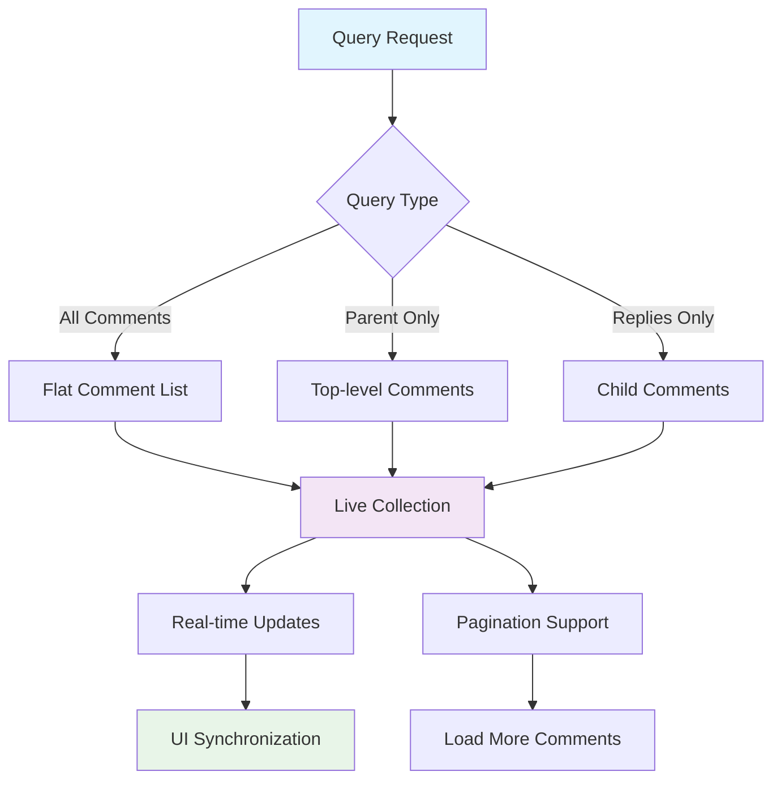
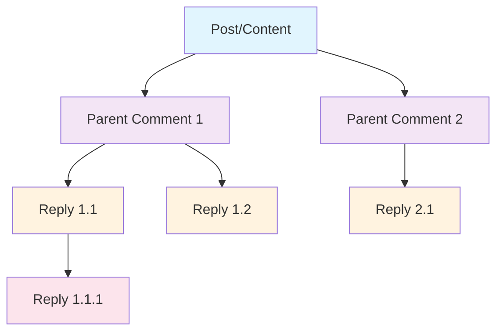

# Query Comments

Build powerful comment systems with advanced querying capabilities including thread filtering, real-time updates, pagination, and flexible sorting options. The social.plus SDK provides comprehensive comment retrieval with Live Collections for optimal performance.

<Info>
Comment queries return **Live Collections** that automatically update when comments are added, edited, or deleted, providing real-time synchronization across all connected clients.
</Info>

## Architecture Overview



## Query Parameters

### Core Parameters

| Parameter | Type | Description | Default |
|-----------|------|-------------|---------|
| `referenceId` | String | ID of the content being commented on | Required |
| `referenceType` | Enum | Type of content (`post`, `story`, `content`) | Required |
| `parentId` | String | Filter by parent comment ID | `null` (all levels) |
| `includeDeleted` | Boolean | Include soft-deleted comments | `false` |
| `sortBy` | Enum | Sort order (`firstCreated`, `lastCreated`) | `firstCreated` |

### Advanced Filtering

| Filter | Description | Use Case |
|--------|-------------|----------|
| **Parent Comments Only** | `parentId = null` | Show top-level comments |
| **Specific Thread** | `parentId = commentId` | Show replies to comment |
| **All Comments** | No `parentId` filter | Show complete discussion |
| **Include Deleted** | `includeDeleted = true` | Moderation interfaces |

## Basic Comment Querying

Retrieve comments for posts, stories, or custom content with flexible filtering options.

<Tabs>
<Tab title="iOS">
```swift
import AmitySDK

class CommentQueryManager {
    private let commentRepository: AmityCommentRepository
    private var commentCollection: AmityCollection<AmityComment>?
    private var collectionToken: AmityNotificationToken?
    
    init(client: AmityClient) {
        self.commentRepository = AmityCommentRepository(client: client)
    }
    
    // Query all comments for a post
    func queryAllComments(
        for referenceId: String,
        referenceType: AmityCommentReferenceType,
        completion: @escaping (Result<[AmityComment], Error>) -> Void
    ) {
        let builder = AmityCommentQuery.Builder()
        builder.setReferenceId(referenceId)
        builder.setReferenceType(referenceType)
        builder.setSortBy(.firstCreated)
        
        commentCollection = commentRepository.getComments(with: builder.build())
        
        collectionToken = commentCollection?.observe { [weak self] collection, change, error in
            if let error = error {
                completion(.failure(error))
                return
            }
            
            guard let comments = collection?.allObjects() else {
                completion(.success([]))
                return
            }
            
            completion(.success(Array(comments)))
        }
    }
    
    // Query only parent-level comments
    func queryParentComments(
        for referenceId: String,
        referenceType: AmityCommentReferenceType,
        completion: @escaping (Result<[AmityComment], Error>) -> Void
    ) {
        let builder = AmityCommentQuery.Builder()
        builder.setReferenceId(referenceId)
        builder.setReferenceType(referenceType)
        builder.setParentId(nil) // Only parent comments
        builder.setIncludeDeleted(false)
        
        commentCollection = commentRepository.getComments(with: builder.build())
        
        collectionToken = commentCollection?.observe { collection, change, error in
            if let error = error {
                completion(.failure(error))
                return
            }
            
            let comments = collection?.allObjects() ?? []
            completion(.success(Array(comments)))
        }
    }
    
    // Query replies to specific comment
    func queryReplies(
        to parentCommentId: String,
        referenceId: String,
        referenceType: AmityCommentReferenceType,
        completion: @escaping (Result<[AmityComment], Error>) -> Void
    ) {
        let builder = AmityCommentQuery.Builder()
        builder.setReferenceId(referenceId)
        builder.setReferenceType(referenceType)
        builder.setParentId(parentCommentId) // Only replies to this comment
        builder.setSortBy(.firstCreated)
        
        commentCollection = commentRepository.getComments(with: builder.build())
        
        collectionToken = commentCollection?.observe { collection, change, error in
            if let error = error {
                completion(.failure(error))
                return
            }
            
            let replies = collection?.allObjects() ?? []
            completion(.success(Array(replies)))
        }
    }
    
    // Advanced query with pagination
    func queryCommentsWithPagination(
        for referenceId: String,
        referenceType: AmityCommentReferenceType,
        delegate: CommentCollectionDelegate
    ) {
        let builder = AmityCommentQuery.Builder()
        builder.setReferenceId(referenceId)
        builder.setReferenceType(referenceType)
        
        commentCollection = commentRepository.getComments(with: builder.build())
        
        // Set up real-time updates
        collectionToken = commentCollection?.observe { collection, change, error in
            delegate.didUpdateComments(collection?.allObjects() ?? [], change: change, error: error)
        }
        
        // Load initial page
        commentCollection?.nextPage()
    }
    
    // Load more comments (pagination)
    func loadMoreComments() {
        commentCollection?.nextPage()
    }
    
    // Clean up resources
    func dispose() {
        collectionToken?.invalidate()
        collectionToken = nil
        commentCollection = nil
    }
}

// Delegate protocol for comment updates
protocol CommentCollectionDelegate: AnyObject {
    func didUpdateComments(_ comments: [AmityComment], change: AmityCollectionChange?, error: Error?)
}

// Example usage in view controller
class CommentsViewController: UIViewController {
    private let commentQueryManager: CommentQueryManager
    private let postId: String
    private var comments: [AmityComment] = []
    
    init(postId: String, client: AmityClient) {
        self.postId = postId
        self.commentQueryManager = CommentQueryManager(client: client)
        super.init(nibName: nil, bundle: nil)
    }
    
    override func viewDidLoad() {
        super.viewDidLoad()
        setupCommentsTable()
        loadComments()
    }
    
    private func loadComments() {
        commentQueryManager.queryCommentsWithPagination(
            for: postId,
            referenceType: .post,
            delegate: self
        )
    }
    
    @IBAction func loadMoreComments() {
        commentQueryManager.loadMoreComments()
    }
    
    deinit {
        commentQueryManager.dispose()
    }
}

extension CommentsViewController: CommentCollectionDelegate {
    func didUpdateComments(_ comments: [AmityComment], change: AmityCollectionChange?, error: Error?) {
        if let error = error {
            showError("Failed to load comments: \(error.localizedDescription)")
            return
        }
        
        DispatchQueue.main.async {
            self.comments = comments
            self.commentsTableView.reloadData()
        }
    }
}
```
</Tab>

<Tab title="Android">
```kotlin
import com.amity.socialcloud.sdk.social.comment.*

class CommentQueryManager(private val client: AmityClient) {
    private val commentRepository = AmityCommentRepository(client)
    
    // Query all comments for a post
    fun queryAllComments(
        referenceId: String,
        referenceType: AmityCommentReferenceType,
        callback: (PagingData<AmityComment>) -> Unit
    ): Disposable {
        val query = AmityCommentQuery.Builder()
            .setReferenceId(referenceId)
            .setReferenceType(referenceType)
            .setSortBy(AmityCommentSortOption.FIRST_CREATED)
            .build()
        
        return commentRepository.getComments(query)
            .observeOn(AndroidSchedulers.mainThread())
            .subscribe { pagingData ->
                callback(pagingData)
            }
    }
    
    // Query only parent-level comments
    fun queryParentComments(
        referenceId: String,
        referenceType: AmityCommentReferenceType,
        callback: (PagingData<AmityComment>) -> Unit
    ): Disposable {
        val query = AmityCommentQuery.Builder()
            .setReferenceId(referenceId)
            .setReferenceType(referenceType)
            .setParentId(null) // Only parent comments
            .setIncludeDeleted(false)
            .build()
        
        return commentRepository.getComments(query)
            .observeOn(AndroidSchedulers.mainThread())
            .subscribe { pagingData ->
                callback(pagingData)
            }
    }
    
    // Query replies to specific comment
    fun queryReplies(
        parentCommentId: String,
        referenceId: String,
        referenceType: AmityCommentReferenceType,
        callback: (PagingData<AmityComment>) -> Unit
    ): Disposable {
        val query = AmityCommentQuery.Builder()
            .setReferenceId(referenceId)
            .setReferenceType(referenceType)
            .setParentId(parentCommentId) // Only replies to this comment
            .setSortBy(AmityCommentSortOption.FIRST_CREATED)
            .build()
        
        return commentRepository.getComments(query)
            .observeOn(AndroidSchedulers.mainThread())
            .subscribe { pagingData ->
                callback(pagingData)
            }
    }
    
    // Advanced query with custom filters
    fun queryCommentsWithFilters(
        referenceId: String,
        referenceType: AmityCommentReferenceType,
        includeDeleted: Boolean = false,
        sortBy: AmityCommentSortOption = AmityCommentSortOption.FIRST_CREATED,
        callback: (PagingData<AmityComment>) -> Unit
    ): Disposable {
        val query = AmityCommentQuery.Builder()
            .setReferenceId(referenceId)
            .setReferenceType(referenceType)
            .setIncludeDeleted(includeDeleted)
            .setSortBy(sortBy)
            .build()
        
        return commentRepository.getComments(query)
            .observeOn(AndroidSchedulers.mainThread())
            .subscribe { pagingData ->
                callback(pagingData)
            }
    }
}

// Usage in Activity/Fragment with RecyclerView
class PostCommentsActivity : AppCompatActivity() {
    private lateinit var commentQueryManager: CommentQueryManager
    private lateinit var commentsAdapter: CommentsAdapter
    private var commentsDisposable: Disposable? = null
    private lateinit var postId: String
    
    override fun onCreate(savedInstanceState: Bundle?) {
        super.onCreate(savedInstanceState)
        setContentView(R.layout.activity_post_comments)
        
        postId = intent.getStringExtra("POST_ID") ?: ""
        commentQueryManager = CommentQueryManager(AmityClient.getInstance())
        
        setupRecyclerView()
        loadComments()
    }
    
    private fun setupRecyclerView() {
        commentsAdapter = CommentsAdapter(
            onReplyClick = { comment ->
                showReplyDialog(comment)
            },
            onLoadReplies = { comment ->
                loadReplies(comment.getCommentId())
            }
        )
        
        commentsRecyclerView.apply {
            adapter = commentsAdapter
            layoutManager = LinearLayoutManager(this@PostCommentsActivity)
        }
    }
    
    private fun loadComments() {
        commentsDisposable?.dispose()
        
        commentsDisposable = commentQueryManager.queryParentComments(
            referenceId = postId,
            referenceType = AmityCommentReferenceType.POST
        ) { pagingData ->
            commentsAdapter.submitData(lifecycle, pagingData)
        }
    }
    
    private fun loadReplies(parentCommentId: String) {
        commentQueryManager.queryReplies(
            parentCommentId = parentCommentId,
            referenceId = postId,
            referenceType = AmityCommentReferenceType.POST
        ) { pagingData ->
            // Handle replies display in adapter
            commentsAdapter.updateReplies(parentCommentId, pagingData)
        }
    }
    
    private fun showReplyDialog(parentComment: AmityComment) {
        ReplyDialogFragment.newInstance(parentComment.getCommentId())
            .show(supportFragmentManager, "reply_dialog")
    }
    
    override fun onDestroy() {
        super.onDestroy()
        commentsDisposable?.dispose()
    }
}

// Custom adapter for handling nested comments
class CommentsAdapter(
    private val onReplyClick: (AmityComment) -> Unit,
    private val onLoadReplies: (AmityComment) -> Unit
) : PagingDataAdapter<AmityComment, CommentViewHolder>(CommentDiffCallback()) {
    
    private val repliesMap = mutableMapOf<String, List<AmityComment>>()
    
    override fun onCreateViewHolder(parent: ViewGroup, viewType: Int): CommentViewHolder {
        val view = LayoutInflater.from(parent.context)
            .inflate(R.layout.item_comment, parent, false)
        return CommentViewHolder(view, onReplyClick, onLoadReplies)
    }
    
    override fun onBindViewHolder(holder: CommentViewHolder, position: Int) {
        val comment = getItem(position)
        comment?.let { 
            holder.bind(it, repliesMap[it.getCommentId()] ?: emptyList())
        }
    }
    
    fun updateReplies(parentCommentId: String, replies: PagingData<AmityComment>) {
        // Update replies for specific comment
        // Implementation depends on your threading UI design
    }
}

class CommentDiffCallback : DiffUtil.ItemCallback<AmityComment>() {
    override fun areItemsTheSame(oldItem: AmityComment, newItem: AmityComment): Boolean {
        return oldItem.getCommentId() == newItem.getCommentId()
    }
    
    override fun areContentsTheSame(oldItem: AmityComment, newItem: AmityComment): Boolean {
        return oldItem.getUpdatedAt() == newItem.getUpdatedAt() &&
               oldItem.getReactionsCount() == newItem.getReactionsCount()
    }
}
```
</Tab>

<Tab title="TypeScript">
```typescript
import { 
    AmityClient, 
    CommentRepository, 
    AmityComment,
    AmityCommentReferenceType,
    AmityCommentQuery,
    AmityCommentSortOption,
    LiveCollection 
} from '@amityco/ts-sdk';

interface CommentQueryOptions {
    referenceId: string;
    referenceType: AmityCommentReferenceType;
    parentId?: string | null;
    includeDeleted?: boolean;
    sortBy?: AmityCommentSortOption;
}

class CommentQueryManager {
    private commentRepository: CommentRepository;
    private activeSubscriptions: Map<string, () => void> = new Map();
    
    constructor(client: AmityClient) {
        this.commentRepository = new CommentRepository(client);
    }
    
    // Query all comments with real-time updates
    async queryComments(
        options: CommentQueryOptions,
        onUpdate: (comments: AmityComment[]) -> void,
        onError?: (error: Error) -> void
    ): Promise<string> {
        const {
            referenceId,
            referenceType,
            parentId,
            includeDeleted = false,
            sortBy = AmityCommentSortOption.FIRST_CREATED
        } = options;
        
        try {
            const query: AmityCommentQuery = {
                referenceId,
                referenceType,
                parentId,
                includeDeleted,
                sortBy
            };
            
            const liveCollection = this.commentRepository.getComments(query);
            const subscriptionId = `${referenceId}_${parentId || 'all'}`;
            
            // Subscribe to real-time updates
            const unsubscribe = liveCollection.subscribe((comments, error) => {
                if (error) {
                    onError?.(error);
                    return;
                }
                onUpdate(comments);
            });
            
            // Store subscription for cleanup
            this.activeSubscriptions.set(subscriptionId, unsubscribe);
            
            return subscriptionId;
        } catch (error) {
            onError?.(error as Error);
            throw error;
        }
    }
    
    // Query only parent-level comments
    async queryParentComments(
        referenceId: string,
        referenceType: AmityCommentReferenceType,
        onUpdate: (comments: AmityComment[]) -> void,
        onError?: (error: Error) -> void
    ): Promise<string> {
        return this.queryComments({
            referenceId,
            referenceType,
            parentId: null, // Only parent comments
            includeDeleted: false
        }, onUpdate, onError);
    }
    
    // Query replies to specific comment
    async queryReplies(
        parentCommentId: string,
        referenceId: string,
        referenceType: AmityCommentReferenceType,
        onUpdate: (replies: AmityComment[]) -> void,
        onError?: (error: Error) -> void
    ): Promise<string> {
        return this.queryComments({
            referenceId,
            referenceType,
            parentId: parentCommentId,
            includeDeleted: false
        }, onUpdate, onError);
    }
    
    // Query with pagination support
    async createPaginatedQuery(
        options: CommentQueryOptions
    ): Promise<LiveCollection<AmityComment>> {
        const query: AmityCommentQuery = {
            referenceId: options.referenceId,
            referenceType: options.referenceType,
            parentId: options.parentId,
            includeDeleted: options.includeDeleted || false,
            sortBy: options.sortBy || AmityCommentSortOption.FIRST_CREATED
        };
        
        return this.commentRepository.getComments(query);
    }
    
    // Load more comments for pagination
    async loadMoreComments(liveCollection: LiveCollection<AmityComment>): Promise<void> {
        await liveCollection.nextPage();
    }
    
    // Unsubscribe from specific query
    unsubscribe(subscriptionId: string): void {
        const unsubscribe = this.activeSubscriptions.get(subscriptionId);
        if (unsubscribe) {
            unsubscribe();
            this.activeSubscriptions.delete(subscriptionId);
        }
    }
    
    // Clean up all subscriptions
    dispose(): void {
        this.activeSubscriptions.forEach(unsubscribe => unsubscribe());
        this.activeSubscriptions.clear();
    }
}

// React hook for comment querying
function useComments(
    referenceId: string,
    referenceType: AmityCommentReferenceType,
    options: Partial<CommentQueryOptions> = {}
) {
    const [comments, setComments] = React.useState<AmityComment[]>([]);
    const [loading, setLoading] = React.useState(true);
    const [error, setError] = React.useState<Error | null>(null);
    const [hasMore, setHasMore] = React.useState(true);
    
    const queryManagerRef = React.useRef<CommentQueryManager | null>(null);
    const liveCollectionRef = React.useRef<LiveCollection<AmityComment> | null>(null);
    
    React.useEffect(() => {
        const client = AmityClient.getInstance();
        queryManagerRef.current = new CommentQueryManager(client);
        
        const loadComments = async () => {
            setLoading(true);
            setError(null);
            
            try {
                const liveCollection = await queryManagerRef.current!.createPaginatedQuery({
                    referenceId,
                    referenceType,
                    ...options
                });
                
                liveCollectionRef.current = liveCollection;
                
                liveCollection.subscribe((comments, error) => {
                    if (error) {
                        setError(error);
                        setLoading(false);
                        return;
                    }
                    
                    setComments(comments);
                    setHasMore(liveCollection.hasNextPage);
                    setLoading(false);
                });
                
                // Load initial page
                await liveCollection.nextPage();
                
            } catch (err) {
                setError(err as Error);
                setLoading(false);
            }
        };
        
        loadComments();
        
        return () => {
            queryManagerRef.current?.dispose();
        };
    }, [referenceId, referenceType, JSON.stringify(options)]);
    
    const loadMore = React.useCallback(async () => {
        if (liveCollectionRef.current && hasMore) {
            await queryManagerRef.current!.loadMoreComments(liveCollectionRef.current);
        }
    }, [hasMore]);
    
    return {
        comments,
        loading,
        error,
        hasMore,
        loadMore
    };
}

// Usage in React component
const CommentsSection: React.FC<{ postId: string }> = ({ postId }) => {
    const { comments, loading, error, hasMore, loadMore } = useComments(
        postId,
        AmityCommentReferenceType.POST,
        { parentId: null } // Only parent comments
    );
    
    const [repliesMap, setRepliesMap] = React.useState<Map<string, AmityComment[]>>(new Map());
    
    const loadReplies = async (parentCommentId: string) => {
        const queryManager = new CommentQueryManager(AmityClient.getInstance());
        
        const subscriptionId = await queryManager.queryReplies(
            parentCommentId,
            postId,
            AmityCommentReferenceType.POST,
            (replies) => {
                setRepliesMap(prev => new Map(prev.set(parentCommentId, replies)));
            },
            (error) => {
                console.error('Failed to load replies:', error);
            }
        );
        
        // Store subscription for cleanup
        return subscriptionId;
    };
    
    if (loading) return <div>Loading comments...</div>;
    if (error) return <div>Error loading comments: {error.message}</div>;
    
    return (
        <div className="comments-section">
            {comments.map(comment => (
                <CommentItem
                    key={comment.commentId}
                    comment={comment}
                    replies={repliesMap.get(comment.commentId) || []}
                    onLoadReplies={() => loadReplies(comment.commentId)}
                />
            ))}
            
            {hasMore && (
                <button onClick={loadMore} className="load-more-button">
                    Load More Comments
                </button>
            )}
        </div>
    );
};
```
</Tab>

<Tab title="Flutter">
```dart
import 'package:amity_sdk/amity_sdk.dart';
import 'package:flutter/material.dart';

class CommentQueryManager {
  final AmitySDK _amitySDK;
  final Map<String, StreamSubscription> _subscriptions = {};
  
  CommentQueryManager(this._amitySDK);
  
  // Query all comments with real-time updates
  String queryComments({
    required String referenceId,
    required AmityCommentReferenceType referenceType,
    String? parentId,
    bool includeDeleted = false,
    AmityCommentSortOption sortBy = AmityCommentSortOption.firstCreated,
    required Function(List<AmityComment>) onUpdate,
    Function(Object)? onError,
  }) {
    final query = AmityCommentQuery(
      referenceId: referenceId,
      referenceType: referenceType,
      parentId: parentId,
      includeDeleted: includeDeleted,
      sortBy: sortBy,
    );
    
    final subscriptionId = '${referenceId}_${parentId ?? 'all'}';
    
    final subscription = _amitySDK.commentRepository
        .getComments(query)
        .listen(
          (comments) => onUpdate(comments),
          onError: (error) => onError?.call(error),
        );
    
    _subscriptions[subscriptionId] = subscription;
    return subscriptionId;
  }
  
  // Query only parent-level comments
  String queryParentComments({
    required String referenceId,
    required AmityCommentReferenceType referenceType,
    required Function(List<AmityComment>) onUpdate,
    Function(Object)? onError,
  }) {
    return queryComments(
      referenceId: referenceId,
      referenceType: referenceType,
      parentId: null, // Only parent comments
      includeDeleted: false,
      onUpdate: onUpdate,
      onError: onError,
    );
  }
  
  // Query replies to specific comment
  String queryReplies({
    required String parentCommentId,
    required String referenceId,
    required AmityCommentReferenceType referenceType,
    required Function(List<AmityComment>) onUpdate,
    Function(Object)? onError,
  }) {
    return queryComments(
      referenceId: referenceId,
      referenceType: referenceType,
      parentId: parentCommentId,
      includeDeleted: false,
      onUpdate: onUpdate,
      onError: onError,
    );
  }
  
  // Create paginated query
  AmityCommentLiveCollection createPaginatedQuery({
    required String referenceId,
    required AmityCommentReferenceType referenceType,
    String? parentId,
    bool includeDeleted = false,
    AmityCommentSortOption sortBy = AmityCommentSortOption.firstCreated,
  }) {
    final query = AmityCommentQuery(
      referenceId: referenceId,
      referenceType: referenceType,
      parentId: parentId,
      includeDeleted: includeDeleted,
      sortBy: sortBy,
    );
    
    return _amitySDK.commentRepository.getCommentsCollection(query);
  }
  
  // Load more comments for pagination
  Future<void> loadMoreComments(AmityCommentLiveCollection collection) async {
    await collection.loadNext();
  }
  
  // Unsubscribe from specific query
  void unsubscribe(String subscriptionId) {
    _subscriptions[subscriptionId]?.cancel();
    _subscriptions.remove(subscriptionId);
  }
  
  // Clean up all subscriptions
  void dispose() {
    _subscriptions.values.forEach((subscription) => subscription.cancel());
    _subscriptions.clear();
  }
}

// Widget for displaying comments with threading
class CommentsWidget extends StatefulWidget {
  final String postId;
  
  const CommentsWidget({Key? key, required this.postId}) : super(key: key);
  
  @override
  State<CommentsWidget> createState() => _CommentsWidgetState();
}

class _CommentsWidgetState extends State<CommentsWidget> {
  late CommentQueryManager _queryManager;
  List<AmityComment> _comments = [];
  Map<String, List<AmityComment>> _repliesMap = {};
  bool _loading = true;
  String? _error;
  AmityCommentLiveCollection? _liveCollection;
  
  @override
  void initState() {
    super.initState();
    _queryManager = CommentQueryManager(AmitySDK.instance);
    _loadComments();
  }
  
  @override
  void dispose() {
    _queryManager.dispose();
    super.dispose();
  }
  
  void _loadComments() {
    setState(() {
      _loading = true;
      _error = null;
    });
    
    // Create paginated collection for parent comments
    _liveCollection = _queryManager.createPaginatedQuery(
      referenceId: widget.postId,
      referenceType: AmityCommentReferenceType.post,
      parentId: null, // Only parent comments
    );
    
    // Subscribe to real-time updates
    _liveCollection!.listen(
      (comments) {
        setState(() {
          _comments = comments;
          _loading = false;
        });
      },
      onError: (error) {
        setState(() {
          _error = error.toString();
          _loading = false;
        });
      },
    );
    
    // Load initial page
    _loadMoreComments();
  }
  
  void _loadReplies(String parentCommentId) {
    _queryManager.queryReplies(
      parentCommentId: parentCommentId,
      referenceId: widget.postId,
      referenceType: AmityCommentReferenceType.post,
      onUpdate: (replies) {
        setState(() {
          _repliesMap[parentCommentId] = replies;
        });
      },
      onError: (error) {
        print('Failed to load replies: $error');
      },
    );
  }
  
  Future<void> _loadMoreComments() async {
    if (_liveCollection != null) {
      await _queryManager.loadMoreComments(_liveCollection!);
    }
  }
  
  @override
  Widget build(BuildContext context) {
    if (_loading) {
      return const Center(child: CircularProgressIndicator());
    }
    
    if (_error != null) {
      return Center(
        child: Column(
          mainAxisAlignment: MainAxisAlignment.center,
          children: [
            Text('Error loading comments: $_error'),
            ElevatedButton(
              onPressed: _loadComments,
              child: const Text('Retry'),
            ),
          ],
        ),
      );
    }
    
    return Column(
      children: [
        Expanded(
          child: ListView.builder(
            itemCount: _comments.length,
            itemBuilder: (context, index) {
              final comment = _comments[index];
              final replies = _repliesMap[comment.commentId] ?? [];
              
              return CommentItem(
                comment: comment,
                replies: replies,
                onLoadReplies: () => _loadReplies(comment.commentId),
                onReply: (replyText) => _createReply(comment.commentId, replyText),
              );
            },
          ),
        ),
        
        // Load more button
        if (_liveCollection?.hasNext == true)
          Padding(
            padding: const EdgeInsets.all(16),
            child: ElevatedButton(
              onPressed: _loadMoreComments,
              child: const Text('Load More Comments'),
            ),
          ),
      ],
    );
  }
  
  Future<void> _createReply(String parentCommentId, String text) async {
    try {
      await AmitySDK.instance.commentRepository.createComment(
        widget.postId,
        AmityCommentReferenceType.post,
        AmityCommentCreationData(
          text: text,
          parentId: parentCommentId,
        ),
      );
      
      // Refresh replies
      _loadReplies(parentCommentId);
    } catch (error) {
      print('Failed to create reply: $error');
    }
  }
}

// Individual comment item widget
class CommentItem extends StatelessWidget {
  final AmityComment comment;
  final List<AmityComment> replies;
  final VoidCallback onLoadReplies;
  final Function(String) onReply;
  
  const CommentItem({
    Key? key,
    required this.comment,
    required this.replies,
    required this.onLoadReplies,
    required this.onReply,
  }) : super(key: key);
  
  @override
  Widget build(BuildContext context) {
    return Card(
      margin: const EdgeInsets.symmetric(horizontal: 8, vertical: 4),
      child: Padding(
        padding: const EdgeInsets.all(12),
        child: Column(
          crossAxisAlignment: CrossAxisAlignment.start,
          children: [
            // Main comment
            _buildCommentContent(),
            
            const SizedBox(height: 8),
            
            // Action buttons
            _buildActionButtons(context),
            
            // Replies section
            if (replies.isNotEmpty) ...[
              const SizedBox(height: 8),
              _buildRepliesSection(),
            ],
            
            // Load replies button
            if (comment.childrenNumber > 0 && replies.isEmpty) ...[
              const SizedBox(height: 8),
              TextButton(
                onPressed: onLoadReplies,
                child: Text('Load ${comment.childrenNumber} replies'),
              ),
            ],
          ],
        ),
      ),
    );
  }
  
  Widget _buildCommentContent() {
    return Column(
      crossAxisAlignment: CrossAxisAlignment.start,
      children: [
        Text(
          comment.userId,
          style: const TextStyle(fontWeight: FontWeight.bold),
        ),
        const SizedBox(height: 4),
        Text(comment.data?['text'] ?? ''),
        const SizedBox(height: 4),
        Text(
          _formatTimestamp(comment.createdAt),
          style: const TextStyle(
            color: Colors.grey,
            fontSize: 12,
          ),
        ),
      ],
    );
  }
  
  Widget _buildActionButtons(BuildContext context) {
    return Row(
      children: [
        TextButton(
          onPressed: () => _showReplyDialog(context),
          child: const Text('Reply'),
        ),
        TextButton(
          onPressed: () {
            // Handle like action
          },
          child: Text('Like (${comment.reactionsCount})'),
        ),
      ],
    );
  }
  
  Widget _buildRepliesSection() {
    return Container(
      margin: const EdgeInsets.only(left: 16),
      child: Column(
        children: replies.map((reply) {
          return Container(
            padding: const EdgeInsets.symmetric(vertical: 4),
            child: Row(
              crossAxisAlignment: CrossAxisAlignment.start,
              children: [
                const SizedBox(width: 16),
                Expanded(
                  child: Column(
                    crossAxisAlignment: CrossAxisAlignment.start,
                    children: [
                      Text(
                        reply.userId,
                        style: const TextStyle(fontWeight: FontWeight.bold),
                      ),
                      Text(reply.data?['text'] ?? ''),
                      Text(
                        _formatTimestamp(reply.createdAt),
                        style: const TextStyle(
                          color: Colors.grey,
                          fontSize: 12,
                        ),
                      ),
                    ],
                  ),
                ),
              ],
            ),
          );
        }).toList(),
      ),
    );
  }
  
  void _showReplyDialog(BuildContext context) {
    final controller = TextEditingController();
    
    showDialog(
      context: context,
      builder: (context) => AlertDialog(
        title: const Text('Reply to Comment'),
        content: TextField(
          controller: controller,
          decoration: const InputDecoration(
            hintText: 'Write your reply...',
          ),
          maxLines: 3,
        ),
        actions: [
          TextButton(
            onPressed: () => Navigator.of(context).pop(),
            child: const Text('Cancel'),
          ),
          ElevatedButton(
            onPressed: () {
              if (controller.text.trim().isNotEmpty) {
                onReply(controller.text.trim());
                Navigator.of(context).pop();
              }
            },
            child: const Text('Reply'),
          ),
        ],
      ),
    );
  }
  
  String _formatTimestamp(DateTime dateTime) {
    final now = DateTime.now();
    final difference = now.difference(dateTime);
    
    if (difference.inDays > 0) {
      return '${difference.inDays}d ago';
    } else if (difference.inHours > 0) {
      return '${difference.inHours}h ago';
    } else if (difference.inMinutes > 0) {
      return '${difference.inMinutes}m ago';
    } else {
      return 'now';
    }
  }
}
```
</Tab>
</Tabs>

<Info>
Refer to [#create-comment](./#create-comment "mention") for a more detailed explanation of the `referenceType` parameter.
</Info>

## Query Comments with Images

To query for image comments only, you can use the `dataTypes` parameter and pass the value `TEXT`, `IMAGE`, or both. There are two options for the `dataTypes` parameter: `any` and `exact`.

* `any` - When you use the `any` option, the retrieved comments will include any comment that contains at least one of the specified data types. For example, if you pass `[image, text]`, the retrieved comments may contain only image content, only text content, or both image and text content.
* `exact` - On the other hand, when you use the `exact` option, the retrieved comments will include only comments that contain all of the specified data types. For example, if you pass `[image, text]`, the retrieved comments must contain both image and text content. If you pass `[image]`, the retrieved comments must contain only image content.

To query for comments containing only image content:

<Tabs>
  <Tab title="iOS">
Using exact filer parameter:

<CodeGroup>
  <CodeGroupItem>
```swift
let comments = AmityCommentQuery()
    .referenceId("postId")
    .referenceType("post")
    .dataTypes([.image], filter: .exact)
    .build()
```
  </CodeGroupItem>
</CodeGroup>

Using any filter parameter:

<CodeGroup>
  <CodeGroupItem>
```swift
let comments = AmityCommentQuery()
    .referenceId("postId")
    .referenceType("post")
    .dataTypes([.image, .text], filter: .any)
    .build()
```
  </CodeGroupItem>
</CodeGroup>
  </Tab>

  <Tab title="Android">
    <CodeGroup>
      <CodeGroupItem>
```java
CommentQuery query = new CommentQuery.Builder()
    .referenceId("postId")
    .referenceType("post")
    .dataTypes(Arrays.asList(DataType.IMAGE), FilterType.EXACT)
    .build();
```
      </CodeGroupItem>
    </CodeGroup>
  </Tab>

  <Tab title="TypeScript">
    <CodeGroup>
      <CodeGroupItem>
```typescript
const comments = await client.getComments({
    referenceId: 'postId',
    referenceType: 'post',
    dataTypes: ['image'],
    filter: 'exact'
});
```
      </CodeGroupItem>
    </CodeGroup>
  </Tab>

  <Tab title="Flutter">
The functionality isn't currently supported by this SDK.
  </Tab>
</Tabs>

_Refer to the following_ [_Limitations_](create-comment.md#limitations) _on the use of images in comments._

## Threading and Hierarchy

Comments support multi-level threading for organized discussions. Understanding the comment hierarchy is crucial for building effective comment interfaces.

### Comment Hierarchy Levels



### Threading Strategies

<AccordionGroup>
<Accordion title="Flat Structure (All Comments)">
Query all comments regardless of hierarchy level. Useful for search or moderation interfaces.

```typescript
// Query all comments - flat structure
const allComments = await queryManager.queryComments({
    referenceId: postId,
    referenceType: AmityCommentReferenceType.POST
    // No parentId specified - returns all levels
});
```
</Accordion>

<Accordion title="Two-Level Threading">
Display parent comments with their immediate replies. Most common pattern for social feeds.

```typescript
// Step 1: Query parent comments
const parentComments = await queryManager.queryParentComments(
    postId,
    AmityCommentReferenceType.POST,
    (comments) => setParentComments(comments)
);

// Step 2: Query replies for each parent
parentComments.forEach(async (comment) => {
    const replies = await queryManager.queryReplies(
        comment.commentId,
        postId,
        AmityCommentReferenceType.POST,
        (replies) => updateReplies(comment.commentId, replies)
    );
});
```
</Accordion>

<Accordion title="Infinite Threading">
Support unlimited nesting levels with recursive loading. Best for forum-style discussions.

```typescript
// Recursive function to load nested replies
async function loadNestedReplies(parentId: string, level: number = 0) {
    const replies = await queryManager.queryReplies(
        parentId,
        postId,
        AmityCommentReferenceType.POST
    );
    
    // Recursively load replies to replies
    for (const reply of replies) {
        if (reply.childrenNumber > 0) {
            await loadNestedReplies(reply.commentId, level + 1);
        }
    }
}
```
</Accordion>
</AccordionGroup>

## Pagination and Performance

Efficient pagination is crucial for handling large comment threads without performance issues.

### Pagination Parameters

| Parameter | Description | Default | Best Practice |
|-----------|-------------|---------|---------------|
| **Page Size** | Comments per page | 20 | 10-50 depending on content |
| **Load Strategy** | When to load more | Manual | Automatic near scroll end |
| **Cache Size** | Comments kept in memory | Unlimited | Limit to 200-500 comments |

### Performance Optimization

<Tabs>
<Tab title="Virtual Scrolling">
```typescript
// React example with virtual scrolling
import { FixedSizeList as List } from 'react-window';

const VirtualizedComments: React.FC<{ comments: AmityComment[] }> = ({ comments }) => {
    const Row = ({ index, style }) => (
        <div style={style}>
            <CommentItem comment={comments[index]} />
        </div>
    );
    
    return (
        <List
            height={600}
            itemCount={comments.length}
            itemSize={120}
            onItemsRendered={({ visibleStopIndex }) => {
                // Load more when near end
                if (visibleStopIndex >= comments.length - 5) {
                    loadMoreComments();
                }
            }}
        >
            {Row}
        </List>
    );
};
```
</Tab>

<Tab title="Lazy Loading">
```typescript
// Intersection Observer for lazy loading
const useLazyComments = (containerRef: RefObject<HTMLElement>) => {
    const [shouldLoad, setShouldLoad] = useState(false);
    
    useEffect(() => {
        const observer = new IntersectionObserver(
            ([entry]) => {
                if (entry.isIntersecting) {
                    setShouldLoad(true);
                }
            },
            { threshold: 0.1 }
        );
        
        if (containerRef.current) {
            observer.observe(containerRef.current);
        }
        
        return () => observer.disconnect();
    }, []);
    
    return shouldLoad;
};
```
</Tab>

<Tab title="Memory Management">
```typescript
// Comment cache with LRU eviction
class CommentCache {
    private cache = new Map<string, AmityComment>();
    private maxSize = 500;
    
    set(commentId: string, comment: AmityComment) {
        if (this.cache.size >= this.maxSize) {
            // Remove oldest entry
            const firstKey = this.cache.keys().next().value;
            this.cache.delete(firstKey);
        }
        
        this.cache.set(commentId, comment);
    }
    
    get(commentId: string): AmityComment | undefined {
        const comment = this.cache.get(commentId);
        
        if (comment) {
            // Move to end (most recently used)
            this.cache.delete(commentId);
            this.cache.set(commentId, comment);
        }
        
        return comment;
    }
}
```
</Tab>
</Tabs>

## Real-time Updates

Comments automatically update in real-time through Live Collections, ensuring users see new content immediately.

### Update Types

| Update Type | Description | UI Behavior |
|-------------|-------------|-------------|
| **New Comment** | Comment added to discussion | Smooth insertion animation |
| **Edit** | Comment content modified | Fade update transition |
| **Delete** | Comment removed | Fade out with placeholder |
| **Reaction** | Like/reaction count changed | Counter animation |

### Handling Updates

```typescript
// Real-time update handler
const handleCommentUpdates = (
    comments: AmityComment[],
    change: CollectionChange,
    error?: Error
) => {
    if (error) {
        console.error('Comment update error:', error);
        return;
    }
    
    switch (change.type) {
        case 'insert':
            // New comment added
            animateCommentInsertion(change.insertedItems);
            break;
            
        case 'update':
            // Comment modified
            animateCommentUpdate(change.updatedItems);
            break;
            
        case 'delete':
            // Comment removed
            animateCommentRemoval(change.deletedItems);
            break;
            
        case 'move':
            // Comment order changed
            reorderComments(change.movedItems);
            break;
    }
    
    // Update state
    setComments(comments);
};
```

## Best Practices

<AccordionGroup>
<Accordion title="Query Optimization">
- **Specific Queries**: Use parentId filters to reduce data transfer
- **Minimal Fields**: Only request needed comment properties
- **Batch Loading**: Load multiple comment threads simultaneously
- **Cache Strategy**: Implement intelligent caching for frequently accessed comments
- **Subscription Management**: Properly dispose of query subscriptions
</Accordion>

<Accordion title="User Experience">
- **Progressive Loading**: Show parent comments first, then load replies on demand
- **Loading States**: Display skeleton screens during comment loading
- **Error Handling**: Provide retry mechanisms for failed queries
- **Infinite Scroll**: Implement smooth infinite scrolling for large threads
- **Search Integration**: Add comment search with highlighting
</Accordion>

<Accordion title="Performance">
- **Virtual Scrolling**: Use virtualization for large comment lists
- **Image Lazy Loading**: Defer image loading in comment attachments
- **Thread Collapsing**: Allow users to collapse large comment threads
- **Memory Limits**: Implement comment cache size limits
- **Background Updates**: Refresh comments periodically in background
</Accordion>
</AccordionGroup>

## Error Handling

| Error Type | Description | Recommended Action |
|------------|-------------|-------------------|
| **Network Error** | Connection issues during query | Retry with exponential backoff |
| **Permission Denied** | User lacks access to comments | Hide comment section |
| **Invalid Reference** | Referenced content not found | Show "Comments unavailable" message |
| **Rate Limit** | Too many requests | Implement request throttling |
| **Parse Error** | Malformed comment data | Log error and skip malformed items |

## Common Use Cases

<CardGroup cols={2}>
<Card title="Social Media Feed" icon="feed">
Load parent comments with expandable replies, real-time updates, and infinite scroll for engaging social discussions.
</Card>

<Card title="News Comments" icon="newspaper">
Display chronological comments with sorting options, moderation features, and user reputation indicators.
</Card>

<Card title="Forum Discussions" icon="comments">
Implement threaded discussions with unlimited nesting, search functionality, and user mention notifications.
</Card>

<Card title="Product Reviews" icon="star">
Show product feedback with rating filters, verified purchase indicators, and helpful vote sorting.
</Card>
</CardGroup>

<Note>
Always implement proper pagination and real-time update handling to ensure optimal performance and user experience. Consider your application's specific threading requirements when choosing between flat, two-level, or infinite threading strategies.
</Note>