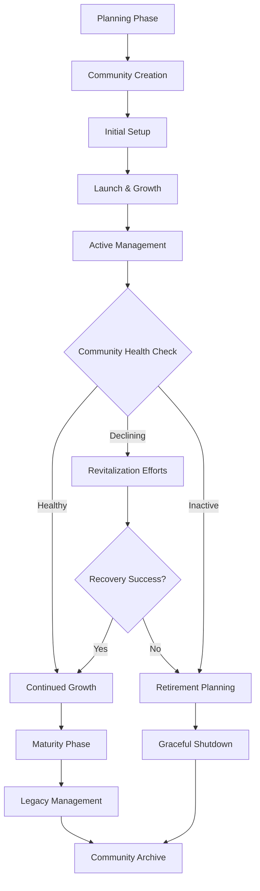

# Community Lifecycle Management

Handle every stage of a community's existence with comprehensive lifecycle management tools. From initial creation and growth to maturity and eventual retirement, ensure smooth transitions and healthy community evolution.

<CardGroup cols={2}>
  <Card title="Create Community" icon="plus" href="create-community">
    Set up new communities with proper configuration and initial settings
  </Card>
  <Card title="Update Community" icon="edit" href="update-community">
    Modify community settings, branding, and configuration as needs evolve
  </Card>
  <Card title="Delete Community" icon="trash" href="delete-community">
    Safely retire communities with proper data handling and user migration
  </Card>
  <Card title="Community Health" icon="heart-pulse" href="community-health">
    Monitor and maintain community health throughout its lifecycle
  </Card>
</CardGroup>

## Community Lifecycle Stages



## Lifecycle Stages Explained

<AccordionGroup>
  <Accordion title="Planning & Creation">
    **Pre-Launch Planning**
    - Define community purpose and goals
    - Identify target audience and demographics
    - Establish community guidelines and policies
    - Plan initial content and seeding strategy
    
    **Community Setup**
    - Configure basic settings and permissions
    - Design community branding and identity
    - Set up moderation tools and rules
    - Prepare onboarding experience
  </Accordion>
  
  <Accordion title="Launch & Growth">
    **Initial Launch**
    - Invite founding members and early adopters
    - Seed with high-quality initial content
    - Establish posting rhythm and engagement
    - Monitor early feedback and adjust
    
    **Growth Phase**
    - Implement member acquisition strategies
    - Foster organic growth through engagement
    - Build community culture and traditions
    - Scale moderation and management tools
  </Accordion>
  
  <Accordion title="Active Management">
    **Ongoing Operations**
    - Regular content curation and quality control
    - Member engagement and retention programs
    - Community event planning and execution
    - Performance monitoring and optimization
    
    **Evolution & Adaptation**
    - Respond to changing member needs
    - Update policies and guidelines as needed
    - Integrate new features and capabilities
    - Manage community growth and scaling
  </Accordion>
  
  <Accordion title="Maturity & Retirement">
    **Mature Community Management**
    - Focus on sustainability and long-term health
    - Develop member leadership and governance
    - Maintain quality while managing scale
    - Plan for leadership transitions
    
    **Retirement Planning**
    - Recognize signs of declining engagement
    - Attempt revitalization if appropriate
    - Plan graceful shutdown and data preservation
    - Migrate members to alternative communities
  </Accordion>
</AccordionGroup>

## Implementation Guide

<Tabs>
  <Tab title="Community Creation">
    ```typescript
    // Create a new community with full configuration
    const createFullCommunity = async (communityData: CommunitySetup) => {
      // Step 1: Create basic community
      const community = await AmitySDK.createCommunity({
        displayName: communityData.name,
        description: communityData.description,
        isPublic: communityData.visibility === 'public',
        categoryIds: communityData.categories,
        metadata: {
          purpose: communityData.purpose,
          targetAudience: communityData.targetAudience,
          createdBy: communityData.creatorId,
          launchDate: Date.now()
        }
      });
      
      // Step 2: Configure advanced settings
      await AmitySDK.updateCommunitySettings(community.communityId, {
        postSettings: {
          allowPostCreation: communityData.settings.allowPosts,
          requireApproval: communityData.settings.requireApproval,
          allowedPostTypes: communityData.settings.allowedPostTypes
        },
        memberSettings: {
          allowMembershipRequest: communityData.settings.openMembership,
          requireApproval: communityData.settings.requireMemberApproval,
          allowMemberInvitation: communityData.settings.allowInvitations
        },
        moderationSettings: {
          autoModeration: communityData.moderation.autoModeration,
          profanityFilter: communityData.moderation.profanityFilter,
          spamDetection: communityData.moderation.spamDetection
        }
      });
      
      // Step 3: Set up initial content and moderation
      if (communityData.initialContent) {
        await seedCommunityContent(community.communityId, communityData.initialContent);
      }
      
      if (communityData.moderators) {
        await assignCommunityModerators(community.communityId, communityData.moderators);
      }
      
      return community;
    };
    ```
  </Tab>
  
  <Tab title="Community Health Monitoring">
    ```typescript
    // Monitor community health metrics
    const monitorCommunityHealth = async (communityId: string) => {
      const healthMetrics = await AmitySDK.getCommunityHealth(communityId, {
        timeRange: 'last_30_days',
        metrics: [
          'member_count',
          'active_members',
          'post_frequency',
          'engagement_rate',
          'retention_rate',
          'moderation_actions'
        ]
      });
      
      // Analyze health indicators
      const healthScore = calculateHealthScore(healthMetrics);
      const recommendations = generateHealthRecommendations(healthMetrics);
      
      // Check for concerning trends
      const alerts = [];
      if (healthMetrics.activeMembers / healthMetrics.memberCount < 0.1) {
        alerts.push('Low member engagement - consider revitalization efforts');
      }
      
      if (healthMetrics.postFrequency < 1) {
        alerts.push('Very low posting activity - may need content seeding');
      }
      
      if (healthMetrics.moderationActions > healthMetrics.postCount * 0.1) {
        alerts.push('High moderation activity - review community guidelines');
      }
      
      return {
        healthScore,
        metrics: healthMetrics,
        recommendations,
        alerts,
        status: determineHealthStatus(healthScore)
      };
    };
    
    // Automated health checks
    const setupAutomatedHealthChecks = (communityId: string) => {
      return AmitySDK.scheduleHealthCheck({
        communityId,
        frequency: 'weekly',
        thresholds: {
          memberEngagement: 0.15,
          postFrequency: 2,
          moderationRatio: 0.05
        },
        actions: {
          sendAlerts: true,
          createReports: true,
          suggestInterventions: true
        }
      });
    };
    ```
  </Tab>
  
  <Tab title="Community Evolution">
    ```typescript
    // Handle community updates and evolution
    const evolveCommunity = async (communityId: string, evolutionPlan: CommunityEvolution) => {
      // Phase 1: Prepare for changes
      const preparationResult = await prepareCommunityUpdate(communityId, {
        notifyMembers: evolutionPlan.notifyMembers,
        backupData: evolutionPlan.backupData,
        migrationPlan: evolutionPlan.migrationPlan
      });
      
      // Phase 2: Implement changes
      const updates = await AmitySDK.updateCommunity(communityId, {
        displayName: evolutionPlan.newName,
        description: evolutionPlan.newDescription,
        categoryIds: evolutionPlan.newCategories,
        metadata: {
          ...evolutionPlan.metadata,
          lastMajorUpdate: Date.now(),
          evolutionPhase: evolutionPlan.phase
        }
      });
      
      // Phase 3: Update settings and policies
      if (evolutionPlan.settingsChanges) {
        await AmitySDK.updateCommunitySettings(communityId, evolutionPlan.settingsChanges);
      }
      
      // Phase 4: Handle member communications
      if (evolutionPlan.memberCommunication) {
        await sendCommunityUpdateNotification(communityId, {
          title: 'Community Update',
          message: evolutionPlan.memberCommunication.message,
          changes: evolutionPlan.memberCommunication.highlightChanges
        });
      }
      
      return {
        success: true,
        updates,
        memberNotifications: evolutionPlan.notifyMembers,
        nextReviewDate: evolutionPlan.nextReviewDate
      };
    };
    ```
  </Tab>
</Tabs>

## Health Monitoring & Analytics

<AccordionGroup>
  <Accordion title="Key Health Indicators">
    - **Member Engagement**: Active vs. total members ratio
    - **Content Quality**: Post engagement rates and quality scores
    - **Growth Trends**: Member acquisition and retention patterns
    - **Community Vitality**: Discussion depth and interaction frequency
  </Accordion>
  
  <Accordion title="Early Warning Systems">
    - **Declining Engagement**: Automatic alerts for engagement drops
    - **Content Gaps**: Identification of content drought periods
    - **Member Churn**: Detection of unusual member departure patterns
    - **Quality Degradation**: Monitoring for content quality issues
  </Accordion>
  
  <Accordion title="Intervention Strategies">
    - **Engagement Campaigns**: Targeted campaigns to boost participation
    - **Content Seeding**: Strategic content addition to spark discussions
    - **Member Outreach**: Direct communication with at-risk members
    - **Feature Introductions**: New features to renew interest
  </Accordion>
</AccordionGroup>

## Best Practices

<AccordionGroup>
  <Accordion title="Sustainable Growth">
    - **Organic Development**: Focus on natural, sustainable growth patterns
    - **Quality over Quantity**: Prioritize engaged members over large numbers
    - **Community-Led Evolution**: Let community needs drive changes
    - **Long-term Planning**: Consider long-term sustainability in decisions
  </Accordion>
  
  <Accordion title="Change Management">
    - **Gradual Transitions**: Implement changes incrementally when possible
    - **Member Input**: Involve community in major decisions
    - **Clear Communication**: Explain changes and their benefits clearly
    - **Rollback Plans**: Have contingency plans for unsuccessful changes
  </Accordion>
  
  <Accordion title="Legacy Preservation">
    - **Data Archival**: Preserve important community content and history
    - **Member Migration**: Help members find alternative communities
    - **Graceful Endings**: Handle community retirement with dignity
    - **Lessons Learned**: Document insights for future community creation
  </Accordion>
</AccordionGroup>
