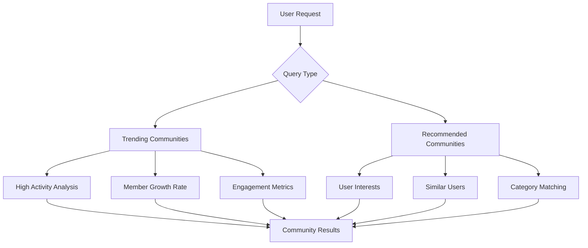

Help users discover active communities through trending algorithms and personalized recommendations. Boost community engagement by surfacing relevant communities users might want to join.

## Overview

Community discovery features help users find relevant communities to join:

- **Trending Communities**: Popular communities with high activity (user may or may not be a member)
- **Recommended Communities**: Personalized suggestions based on user interests (user is not a member)
- **Smart Algorithms**: Platform-driven discovery based on activity patterns

<Note>
Both trending and recommended queries return a maximum of 15 communities per request for optimal performance.
</Note>

## Architecture



## Trending Communities

Get communities with high activity levels across the platform:

<Tabs>
  <Tab title="iOS">
    ```swift
    import AmitySDK

    class CommunityDiscoveryManager {
        private let communityRepository: AmityCommunityRepository
        private var trendingToken: AmityNotificationToken?
        
        init(client: AmityClient) {
            self.communityRepository = AmityCommunityRepository(client: client)
        }
        
        func getTrendingCommunities() {
            let query = AmityCommunityTrendingQuery()
            
            let collection = communityRepository.getTrendingCommunities(with: query)
            
            trendingToken = collection.observe { [weak self] result in
                switch result {
                case .initial(let communities):
                    print("Loaded \(communities.count) trending communities")
                    self?.handleTrendingCommunities(communities)
                    
                case .update(let communities, let changes):
                    print("Trending communities updated: \(changes)")
                    self?.handleTrendingCommunities(communities)
                    
                case .error(let error):
                    print("Failed to load trending communities: \(error)")
                    self?.handleError(error)
                }
            }
        }
        
        private func handleTrendingCommunities(_ communities: [AmityCommunity]) {
            DispatchQueue.main.async {
                // Update trending communities section
                // Show in discovery feed or dedicated trending view
                print("Trending communities:")
                communities.forEach { community in
                    print("- \(community.displayName): \(community.membersCount) members")
                }
            }
        }
        
        private func handleError(_ error: AmityError) {
            DispatchQueue.main.async {
                // Show error state in UI
                // Could show cached communities or retry option
            }
        }
        
        deinit {
            trendingToken?.invalidate()
        }
    }
    ```
  </Tab>
  
  <Tab title="Android">
    ```kotlin
    import com.amity.socialcloud.sdk.api.social.AmitySocialClient
    import com.amity.socialcloud.sdk.model.social.community.AmityCommunity

    class CommunityDiscoveryManager(private val client: AmitySocialClient) {
        private var trendingDisposable: Disposable? = null
        
        fun getTrendingCommunities() {
            val query = AmityCommunityTrendingQuery.Builder().build()
            
            trendingDisposable = client.community()
                .getTrendingCommunities(query)
                .subscribeOn(Schedulers.io())
                .observeOn(AndroidSchedulers.mainThread())
                .subscribe(
                    { communitiesList ->
                        val communities = communitiesList.data
                        println("Loaded ${communities.size} trending communities")
                        handleTrendingCommunities(communities)
                    },
                    { error ->
                        println("Failed to load trending communities: ${error.message}")
                        handleError(error)
                    }
                )
        }
        
        private fun handleTrendingCommunities(communities: List<AmityCommunity>) {
            // Update trending communities section
            // Show in discovery feed or dedicated trending view
            println("Trending communities:")
            communities.forEach { community ->
                println("- ${community.getDisplayName()}: ${community.getMemberCount()} members")
            }
        }
        
        private fun handleError(error: Throwable) {
            // Show error state in UI
            // Could show cached communities or retry option
        }
        
        fun cleanup() {
            trendingDisposable?.dispose()
        }
    }
    ```
  </Tab>
  
  <Tab title="TypeScript">
    ```typescript
    import { 
        CommunityRepository, 
        Community,
        CommunityTrendingQuery,
        LiveCollection 
    } from '@amityco/js-sdk';

    class CommunityDiscoveryManager {
        private communityRepository: CommunityRepository;
        private trendingCollection?: LiveCollection<Community>;
        
        constructor() {
            this.communityRepository = new CommunityRepository();
        }
        
        async getTrendingCommunities(): Promise<Community[]> {
            try {
                const query = new CommunityTrendingQuery();
                
                this.trendingCollection = await this.communityRepository
                    .getTrendingCommunities(query);
                
                // Subscribe to real-time updates
                this.trendingCollection.on('dataUpdated', (communities) => {
                    console.log(`Loaded ${communities.length} trending communities`);
                    this.handleTrendingCommunities(communities);
                });
                
                this.trendingCollection.on('dataError', (error) => {
                    console.error('Failed to load trending communities:', error);
                    this.handleError(error);
                });
                
                // Return initial data
                return this.trendingCollection.models;
                
            } catch (error) {
                console.error('Failed to get trending communities:', error);
                this.handleError(error);
                return [];
            }
        }
        
        private handleTrendingCommunities(communities: Community[]) {
            // Update trending communities section
            // Show in discovery feed or dedicated trending view
            console.log('Trending communities:');
            communities.forEach(community => {
                console.log(`- ${community.displayName}: ${community.membersCount} members`);
            });
            
            // Emit event for UI updates
            this.emit('trendingUpdated', communities);
        }
        
        private handleError(error: any) {
            // Show error state in UI
            // Could show cached communities or retry option
            this.emit('trendingError', error);
        }
        
        cleanup() {
            this.trendingCollection?.dispose();
        }
    }
    ```
  </Tab>
  
  <Tab title="Flutter">
    ```dart
    import 'package:amity_sdk/amity_sdk.dart';

    class CommunityDiscoveryManager {
      final AmitySocialClient _socialClient;
      StreamSubscription? _trendingSubscription;
      
      CommunityDiscoveryManager(this._socialClient);
      
      Stream<List<AmityCommunity>> getTrendingCommunities() {
        try {
          final query = AmityCommunityTrendingQuery();
          
          final collection = _socialClient
              .newCommunityRepository()
              .getTrendingCommunities(query: query);
          
          return collection.getStreamController().stream.map((snapshot) {
            if (snapshot.loading) {
              return <AmityCommunity>[];
            }
            
            if (snapshot.error != null) {
              print('Failed to load trending communities: ${snapshot.error}');
              throw snapshot.error!;
            }
            
            final communities = snapshot.data ?? <AmityCommunity>[];
            print('Loaded ${communities.length} trending communities');
            
            // Log trending communities
            print('Trending communities:');
            for (final community in communities) {
              print('- ${community.displayName}: ${community.membersCount} members');
            }
            
            return communities;
          });
          
        } catch (error) {
          print('Failed to get trending communities: $error');
          rethrow;
        }
      }
      
      void dispose() {
        _trendingSubscription?.cancel();
      }
    }
    ```
  </Tab>
</Tabs>

## Recommended Communities

Get personalized community recommendations for users:

<Tabs>
  <Tab title="iOS">
    ```swift
    func getRecommendedCommunities() {
        let query = AmityCommunityRecommendedQuery()
        
        let collection = communityRepository.getRecommendedCommunities(with: query)
        
        recommendedToken = collection.observe { [weak self] result in
            switch result {
            case .initial(let communities):
                print("Loaded \(communities.count) recommended communities")
                self?.handleRecommendedCommunities(communities)
                
            case .update(let communities, let changes):
                print("Recommended communities updated: \(changes)")
                self?.handleRecommendedCommunities(communities)
                
            case .error(let error):
                print("Failed to load recommended communities: \(error)")
                self?.handleError(error)
            }
        }
    }
    
    private func handleRecommendedCommunities(_ communities: [AmityCommunity]) {
        DispatchQueue.main.async {
            // Filter out communities user is already a member of
            let nonMemberCommunities = communities.filter { !$0.isJoined }
            
            // Update recommended communities section
            print("Recommended communities (not joined):")
            nonMemberCommunities.forEach { community in
                print("- \(community.displayName): \(community.description ?? "No description")")
            }
            
            // Show join suggestions in UI
        }
    }
    ```
  </Tab>
  
  <Tab title="Android">
    ```kotlin
    fun getRecommendedCommunities() {
        val query = AmityCommunityRecommendedQuery.Builder().build()
        
        recommendedDisposable = client.community()
            .getRecommendedCommunities(query)
            .subscribeOn(Schedulers.io())
            .observeOn(AndroidSchedulers.mainThread())
            .subscribe(
                { communitiesList ->
                    val communities = communitiesList.data
                    println("Loaded ${communities.size} recommended communities")
                    handleRecommendedCommunities(communities)
                },
                { error ->
                    println("Failed to load recommended communities: ${error.message}")
                    handleError(error)
                }
            )
    }
    
    private fun handleRecommendedCommunities(communities: List<AmityCommunity>) {
        // Filter out communities user is already a member of
        val nonMemberCommunities = communities.filter { !it.isJoined() }
        
        // Update recommended communities section
        println("Recommended communities (not joined):")
        nonMemberCommunities.forEach { community ->
            println("- ${community.getDisplayName()}: ${community.getDescription() ?: "No description"}")
        }
        
        // Show join suggestions in UI
    }
    ```
  </Tab>
  
  <Tab title="TypeScript">
    ```typescript
    async getRecommendedCommunities(): Promise<Community[]> {
        try {
            const query = new CommunityRecommendedQuery();
            
            this.recommendedCollection = await this.communityRepository
                .getRecommendedCommunities(query);
            
            // Subscribe to real-time updates
            this.recommendedCollection.on('dataUpdated', (communities) => {
                console.log(`Loaded ${communities.length} recommended communities`);
                this.handleRecommendedCommunities(communities);
            });
            
            this.recommendedCollection.on('dataError', (error) => {
                console.error('Failed to load recommended communities:', error);
                this.handleError(error);
            });
            
            return this.recommendedCollection.models;
            
        } catch (error) {
            console.error('Failed to get recommended communities:', error);
            this.handleError(error);
            return [];
        }
    }
    
    private handleRecommendedCommunities(communities: Community[]) {
        // Filter out communities user is already a member of
        const nonMemberCommunities = communities.filter(community => !community.isJoined);
        
        // Update recommended communities section
        console.log('Recommended communities (not joined):');
        nonMemberCommunities.forEach(community => {
            console.log(`- ${community.displayName}: ${community.description || "No description"}`);
        });
        
        // Emit event for UI updates
        this.emit('recommendedUpdated', nonMemberCommunities);
    }
    ```
  </Tab>
  
  <Tab title="Flutter">
    ```dart
    Stream<List<AmityCommunity>> getRecommendedCommunities() {
      try {
        final query = AmityCommunityRecommendedQuery();
        
        final collection = _socialClient
            .newCommunityRepository()
            .getRecommendedCommunities(query: query);
        
        return collection.getStreamController().stream.map((snapshot) {
          if (snapshot.loading) {
            return <AmityCommunity>[];
          }
          
          if (snapshot.error != null) {
            print('Failed to load recommended communities: ${snapshot.error}');
            throw snapshot.error!;
          }
          
          final communities = snapshot.data ?? <AmityCommunity>[];
          print('Loaded ${communities.length} recommended communities');
          
          // Filter out communities user is already a member of
          final nonMemberCommunities = communities
              .where((community) => !community.isJoined!)
              .toList();
          
          // Log recommended communities
          print('Recommended communities (not joined):');
          for (final community in nonMemberCommunities) {
            print('- ${community.displayName}: ${community.description ?? "No description"}');
          }
          
          return nonMemberCommunities;
        });
        
      } catch (error) {
        print('Failed to get recommended communities: $error');
        rethrow;
      }
    }
    ```
  </Tab>
</Tabs>

## Best Practices

<AccordionGroup>
  <Accordion title="Discovery UX">
    - Show trending communities in horizontal scroll for browsing
    - Display recommended communities with detailed descriptions
    - Include join buttons and member counts for context
    - Implement pull-to-refresh for fresh recommendations
  </Accordion>
  
  <Accordion title="Performance">
    - Cache discovery results to reduce API calls
    - Implement lazy loading for community images
    - Use pagination if extending beyond 15 items
    - Update discovery data periodically, not on every view
  </Accordion>
  
  <Accordion title="Personalization">
    - Track user interactions with recommendations
    - Show join success states and onboarding
    - Filter out already joined communities from recommendations
    - Consider user preferences in discovery algorithms
  </Accordion>
</AccordionGroup>

## Limitations

<Warning>
**Query Limits**: Both trending and recommended queries return a maximum of 15 communities per request. This limit is enforced for optimal performance.
</Warning>

## Common Use Cases

- **Onboarding**: Help new users find relevant communities to join
- **Discovery Feed**: Create engaging community discovery experiences
- **Engagement Boost**: Surface active communities to increase participation
- **Content Strategy**: Identify trending topics and popular community themes