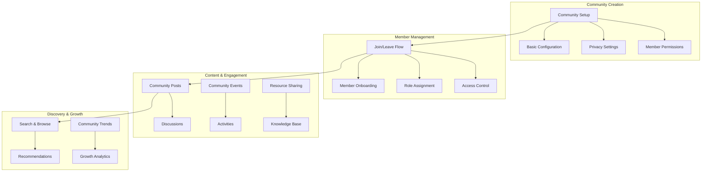

# Communities & Spaces

Create and manage vibrant communities that bring users together around shared interests, goals, and experiences. Our comprehensive community management system provides everything you need to build thriving social spaces.

<CardGroup cols={2}>
  <Card title="Community Lifecycle" icon="cycle" href="community-lifecycle/overview">
    Create, update, and manage community lifecycles from inception to retirement
  </Card>
  <Card title="Membership Management" icon="users" href="membership/overview">
    Handle member onboarding, roles, permissions, and community access control
  </Card>
  <Card title="Organization & Structure" icon="folder-tree" href="organization/overview">
    Organize communities with categories, hierarchies, and structured content
  </Card>
  <Card title="Community Discovery" icon="search" href="discovery/overview">
    Help users find and join relevant communities through search and recommendations
  </Card>
  <Card title="Community Governance" icon="gavel" href="governance/overview">
    Establish rules, moderation policies, and governance structures for healthy communities
  </Card>
</CardGroup>

## Community Architecture



## Community Types

<Tabs>
  <Tab title="Public Communities">
    **Open and Discoverable**
    - Visible to all users
    - Anyone can join without approval
    - Searchable and discoverable
    - Public content and discussions
    
    **Best For:**
    - General interest topics
    - Brand communities
    - Open source projects
    - Public discussions
  </Tab>
  
  <Tab title="Private Communities">
    **Exclusive and Invitation-Only**
    - Only visible to members and invitees
    - Requires invitation or approval to join
    - Not searchable by non-members
    - Private content and discussions
    
    **Best For:**
    - Internal teams
    - Exclusive groups
    - Sensitive discussions
    - Premium memberships
  </Tab>
  
  <Tab title="Hybrid Communities">
    **Mixed Visibility and Access**
    - Public profile with private content areas
    - Multiple membership tiers
    - Some content public, some restricted
    - Flexible access controls
    
    **Best For:**
    - Organizations with multiple audiences
    - Educational institutions
    - Professional networks
    - Multi-tier membership models
  </Tab>
</Tabs>

## Quick Start Guide

<Steps>
  <Step title="Plan Your Community">
    Define your community's purpose, target audience, and structure:
    - **Purpose**: What brings members together?
    - **Audience**: Who are your target members?
    - **Structure**: How will content be organized?
    - **Rules**: What are your community guidelines?
  </Step>
  <Step title="Create Community">
    Set up your community with basic configuration:
    ```typescript
    const community = await AmitySDK.createCommunity({
      displayName: 'Tech Innovators Hub',
      description: 'A community for technology enthusiasts and innovators',
      isPublic: true,
      categoryIds: ['technology', 'innovation'],
      tags: ['tech', 'startup', 'innovation']
    });
    ```
  </Step>
  <Step title="Configure Settings">
    Set up permissions, moderation, and member management:
    - Configure post permissions
    - Set up moderation rules
    - Define member roles and permissions
    - Establish community guidelines
  </Step>
  <Step title="Grow Your Community">
    Attract and engage members:
    - Create compelling content
    - Invite initial members
    - Encourage discussions
    - Monitor and moderate activities
  </Step>
</Steps>

## Best Practices

<AccordionGroup>
  <Accordion title="Community Building">
    - **Clear Purpose**: Define a clear mission and value proposition
    - **Welcoming Environment**: Create inclusive onboarding experiences
    - **Active Moderation**: Maintain healthy discussions and enforce guidelines
    - **Regular Engagement**: Post regular content and encourage participation
  </Accordion>
  
  <Accordion title="Member Experience">
    - **Easy Discovery**: Make it simple for users to find and join your community
    - **Smooth Onboarding**: Guide new members through community features
    - **Recognition Systems**: Acknowledge active and valuable contributors
    - **Feedback Loops**: Regularly gather and act on member feedback
  </Accordion>
  
  <Accordion title="Growth & Retention">
    - **Content Strategy**: Plan regular, valuable content that drives engagement
    - **Community Events**: Host activities that bring members together
    - **Analytics Tracking**: Monitor growth, engagement, and member satisfaction
    - **Continuous Improvement**: Regularly update and improve community features
  </Accordion>
</AccordionGroup>

## Related Features

- **[Content Management](../content-management/overview)** - Create and manage community content
- **[User Interactions](../user-interactions/overview)** - Enable member connections and relationships
- **[Discovery & Engagement](../discovery-engagement/overview)** - Help users discover and engage with communities
