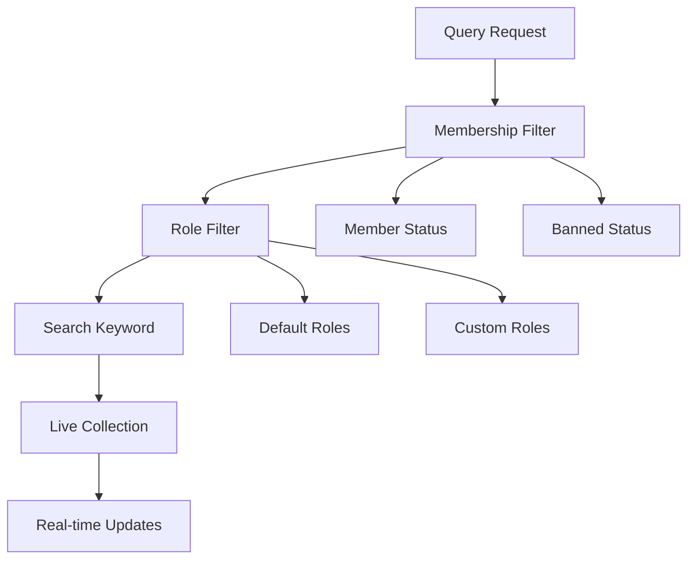

Query and search community members with powerful filtering options. Get real-time member lists with live collections that automatically update when members join, leave, or change status.

## Architecture Overview



## Query Parameters

Configure your member queries with these parameters:

| Parameter | Type | Description | Default |
|-----------|------|-------------|---------|
| `membershipOptions` | Array | Filter by membership status (`member`, `ban`) | `member` |
| `roles` | Array | Filter by roles (moderator roles or custom role IDs) | All roles |
| `includeDeleted` | Boolean | Include members whose users have been deleted | `false` |
| `sortBy` | String | Sort method (`displayName`, `firstCreated`, `lastCreated`) | `firstCreated` |
| `keyword` | String | Search by display name or user ID | None |

<Info>
**Live Collections**: All member queries return [Live Collections](/social-plus-sdk/core-concepts/realtime-communication/live-objects-collections/overview) that automatically update when membership changes occur.
</Info>

## Query Community Members

Get a filtered list of community members:

<Tabs>
  <Tab title="iOS">
    ```swift
    import AmitySDK

    class CommunityMemberManager {
        private let communityRepository: AmityCommunityRepository
        private var membersToken: AmityNotificationToken?
        
        init(client: AmityClient) {
            self.communityRepository = AmityCommunityRepository(client: client)
        }
        
        func queryMembers(
            communityId: String,
            membershipOptions: [AmityCommunityMembershipFilter] = [.member],
            roles: [String] = [],
            includeDeleted: Bool = false,
            sortBy: AmityCommunityMemberSortOption = .firstCreated
        ) {
            let query = AmityCommunityMemberQuery()
            query.membershipFilter = membershipOptions
            query.roles = roles
            query.includeDeleted = includeDeleted
            query.sortBy = sortBy
            
            let collection = communityRepository.getMembers(
                communityId: communityId,
                query: query
            )
            
            membersToken = collection.observe { [weak self] result in
                switch result {
                case .initial(let members):
                    print("Initial members loaded: \(members.count)")
                    self?.handleMembers(members)
                    
                case .update(let members, let changes):
                    print("Members updated: \(changes)")
                    self?.handleMembers(members)
                    
                case .error(let error):
                    print("Failed to load members: \(error)")
                }
            }
        }
        
        // Query moderators only
        func queryModerators(communityId: String) {
            queryMembers(
                communityId: communityId,
                roles: ["community-moderator", "channel-moderator"]
            )
        }
        
        // Query banned members (admin only)
        func queryBannedMembers(communityId: String) {
            queryMembers(
                communityId: communityId,
                membershipOptions: [.ban]
            )
        }
        
        private func handleMembers(_ members: [AmityCommunityMember]) {
            // Update UI with member list
            DispatchQueue.main.async {
                // Update table view or collection view
            }
        }
        
        deinit {
            membersToken?.invalidate()
        }
    }
    ```
  </Tab>
  
  <Tab title="Android">
    ```kotlin
    import com.amity.socialcloud.sdk.api.social.AmitySocialClient
    import com.amity.socialcloud.sdk.model.social.community.*

    class CommunityMemberManager(private val client: AmitySocialClient) {
        private var membersDisposable: Disposable? = null
        
        fun queryMembers(
            communityId: String,
            membershipOptions: List<AmityCommunityMembershipFilter> = listOf(
                AmityCommunityMembershipFilter.MEMBER
            ),
            roles: List<String> = emptyList(),
            includeDeleted: Boolean = false,
            sortBy: AmityCommunityMemberSortOption = AmityCommunityMemberSortOption.FIRST_CREATED
        ) {
            val query = AmityCommunityMemberQuery.Builder()
                .membershipFilter(membershipOptions)
                .roles(roles)
                .includeDeleted(includeDeleted)
                .sortBy(sortBy)
                .build()
            
            membersDisposable = client.community()
                .membership(communityId)
                .getMembers(query)
                .subscribeOn(Schedulers.io())
                .observeOn(AndroidSchedulers.mainThread())
                .subscribe(
                    { membersList ->
                        handleMembers(membersList.data)
                    },
                    { error ->
                        println("Failed to load members: ${error.message}")
                    }
                )
        }
        
        // Query moderators only
        fun queryModerators(communityId: String) {
            queryMembers(
                communityId = communityId,
                roles = listOf("community-moderator", "channel-moderator")
            )
        }
        
        // Query banned members (admin only)
        fun queryBannedMembers(communityId: String) {
            queryMembers(
                communityId = communityId,
                membershipOptions = listOf(AmityCommunityMembershipFilter.BAN)
            )
        }
        
        private fun handleMembers(members: List<AmityCommunityMember>) {
            // Update UI with member list
            // Update RecyclerView adapter
        }
        
        fun cleanup() {
            membersDisposable?.dispose()
        }
    }
    ```
  </Tab>
  
  <Tab title="TypeScript">
    ```typescript
    import { 
        CommunityRepository, 
        CommunityMember,
        LiveCollection,
        CommunityMembershipFilter,
        CommunityMemberSortOption 
    } from '@amityco/js-sdk';

    interface MemberQueryOptions {
        membershipOptions?: CommunityMembershipFilter[];
        roles?: string[];
        includeDeleted?: boolean;
        sortBy?: CommunityMemberSortOption;
    }

    class CommunityMemberManager {
        private communityRepository: CommunityRepository;
        private memberCollections: Map<string, LiveCollection<CommunityMember>>;
        
        constructor() {
            this.communityRepository = new CommunityRepository();
            this.memberCollections = new Map();
        }
        
        async queryMembers(
            communityId: string, 
            options: MemberQueryOptions = {}
        ): Promise<LiveCollection<CommunityMember>> {
            try {
                const {
                    membershipOptions = ['member'],
                    roles = [],
                    includeDeleted = false,
                    sortBy = 'firstCreated'
                } = options;
                
                const collection = await this.communityRepository.getMembers({
                    communityId,
                    membershipOptions,
                    roles,
                    includeDeleted,
                    sortBy
                });
                
                // Store collection for cleanup
                this.memberCollections.set(communityId, collection);
                
                // Subscribe to updates
                collection.on('dataUpdated', (members) => {
                    console.log(`Members updated for community ${communityId}:`, members.length);
                    this.handleMembers(communityId, members);
                });
                
                collection.on('dataError', (error) => {
                    console.error('Failed to load members:', error);
                });
                
                return collection;
                
            } catch (error) {
                console.error('Failed to query members:', error);
                throw error;
            }
        }
        
        // Query moderators only
        async queryModerators(communityId: string) {
            return this.queryMembers(communityId, {
                roles: ['community-moderator', 'channel-moderator']
            });
        }
        
        // Query banned members (admin only)
        async queryBannedMembers(communityId: string) {
            return this.queryMembers(communityId, {
                membershipOptions: ['ban']
            });
        }
        
        // Query with custom role
        async queryCustomRole(communityId: string, roleId: string) {
            return this.queryMembers(communityId, {
                roles: [roleId]
            });
        }
        
        private handleMembers(communityId: string, members: CommunityMember[]) {
            // Update UI with member list
            // Emit event or update state management
        }
        
        cleanup(communityId?: string) {
            if (communityId) {
                const collection = this.memberCollections.get(communityId);
                collection?.dispose();
                this.memberCollections.delete(communityId);
            } else {
                // Cleanup all collections
                this.memberCollections.forEach(collection => collection.dispose());
                this.memberCollections.clear();
            }
        }
    }
    ```
  </Tab>
  
  <Tab title="Flutter">
    ```dart
    import 'package:amity_sdk/amity_sdk.dart';

    enum MembershipFilter { member, ban }
    enum MemberSortOption { displayName, firstCreated, lastCreated }

    class CommunityMemberManager {
      final AmitySocialClient _socialClient;
      final Map<String, StreamSubscription> _subscriptions = {};
      
      CommunityMemberManager(this._socialClient);
      
      Stream<List<AmityCommunityMember>> queryMembers(
        String communityId, {
        List<MembershipFilter> membershipOptions = const [MembershipFilter.member],
        List<String> roles = const [],
        bool includeDeleted = false,
        MemberSortOption sortBy = MemberSortOption.firstCreated,
      }) {
        try {
          final query = AmityCommunityMemberQuery.builder()
              .membershipFilter(_convertMembershipFilters(membershipOptions))
              .roles(roles)
              .includeDeleted(includeDeleted)
              .sortBy(_convertSortOption(sortBy))
              .build();
          
          final collection = _socialClient
              .newCommunityRepository()
              .getMembers(communityId: communityId, query: query);
          
          return collection.getStreamController().stream.map((snapshot) {
            if (snapshot.loading) {
              return <AmityCommunityMember>[];
            }
            
            if (snapshot.error != null) {
              throw snapshot.error!;
            }
            
            return snapshot.data ?? <AmityCommunityMember>[];
          });
          
        } catch (error) {
          print('Failed to query members: $error');
          rethrow;
        }
      }
      
      // Query moderators only
      Stream<List<AmityCommunityMember>> queryModerators(String communityId) {
        return queryMembers(
          communityId,
          roles: ['community-moderator', 'channel-moderator'],
        );
      }
      
      // Query banned members (admin only)
      Stream<List<AmityCommunityMember>> queryBannedMembers(String communityId) {
        return queryMembers(
          communityId,
          membershipOptions: [MembershipFilter.ban],
        );
      }
      
      // Query with custom role
      Stream<List<AmityCommunityMember>> queryCustomRole(
        String communityId, 
        String roleId
      ) {
        return queryMembers(
          communityId,
          roles: [roleId],
        );
      }
      
      List<AmityCommunityMembershipFilter> _convertMembershipFilters(
        List<MembershipFilter> filters
      ) {
        return filters.map((filter) {
          switch (filter) {
            case MembershipFilter.member:
              return AmityCommunityMembershipFilter.MEMBER;
            case MembershipFilter.ban:
              return AmityCommunityMembershipFilter.BAN;
          }
        }).toList();
      }
      
      AmityCommunityMemberSortOption _convertSortOption(MemberSortOption option) {
        switch (option) {
          case MemberSortOption.displayName:
            return AmityCommunityMemberSortOption.DISPLAY_NAME;
          case MemberSortOption.firstCreated:
            return AmityCommunityMemberSortOption.FIRST_CREATED;
          case MemberSortOption.lastCreated:
            return AmityCommunityMemberSortOption.LAST_CREATED;
        }
      }
      
      void dispose() {
        _subscriptions.values.forEach((subscription) => subscription.cancel());
        _subscriptions.clear();
      }
    }
    ```
  </Tab>
</Tabs>

## Search Community Members

Search for specific members by keyword:

<Tabs>
  <Tab title="iOS">
    ```swift
    func searchMembers(
        communityId: String,
        keyword: String,
        membershipOptions: [AmityCommunityMembershipFilter] = [.member],
        roles: [String] = [],
        includeDeleted: Bool = false,
        sortBy: AmityCommunityMemberSortOption = .displayName
    ) {
        let query = AmityCommunityMemberQuery()
        query.keyword = keyword
        query.membershipFilter = membershipOptions
        query.roles = roles
        query.includeDeleted = includeDeleted
        query.sortBy = sortBy
        
        let collection = communityRepository.searchMembers(
            communityId: communityId,
            query: query
        )
        
        membersToken = collection.observe { [weak self] result in
            switch result {
            case .initial(let members):
                print("Search results: \(members.count) members found")
                self?.handleSearchResults(members, keyword: keyword)
                
            case .update(let members, _):
                self?.handleSearchResults(members, keyword: keyword)
                
            case .error(let error):
                print("Search failed: \(error)")
            }
        }
    }
    
    // Debounced search
    private var searchTimer: Timer?
    
    func performDebouncedSearch(
        communityId: String,
        keyword: String,
        delay: TimeInterval = 0.5
    ) {
        searchTimer?.invalidate()
        searchTimer = Timer.scheduledTimer(withTimeInterval: delay, repeats: false) { _ in
            self.searchMembers(communityId: communityId, keyword: keyword)
        }
    }
    ```
  </Tab>
  
  <Tab title="Android">
    ```kotlin
    fun searchMembers(
        communityId: String,
        keyword: String,
        membershipOptions: List<AmityCommunityMembershipFilter> = listOf(
            AmityCommunityMembershipFilter.MEMBER
        ),
        roles: List<String> = emptyList(),
        includeDeleted: Boolean = false,
        sortBy: AmityCommunityMemberSortOption = AmityCommunityMemberSortOption.DISPLAY_NAME
    ) {
        val query = AmityCommunityMemberQuery.Builder()
            .keyword(keyword)
            .membershipFilter(membershipOptions)
            .roles(roles)
            .includeDeleted(includeDeleted)
            .sortBy(sortBy)
            .build()
        
        membersDisposable?.dispose()
        membersDisposable = client.community()
            .membership(communityId)
            .searchMembers(query)
            .subscribeOn(Schedulers.io())
            .observeOn(AndroidSchedulers.mainThread())
            .subscribe(
                { membersList ->
                    println("Search results: ${membersList.data.size} members found")
                    handleSearchResults(membersList.data, keyword)
                },
                { error ->
                    println("Search failed: ${error.message}")
                }
            )
    }
    
    // Debounced search with RxJava
    private val searchSubject = PublishSubject.create<String>()
    
    init {
        searchSubject
            .debounce(500, TimeUnit.MILLISECONDS)
            .distinctUntilChanged()
            .subscribe { keyword ->
                if (keyword.isNotEmpty()) {
                    searchMembers(currentCommunityId, keyword)
                }
            }
    }
    
    fun performDebouncedSearch(keyword: String) {
        searchSubject.onNext(keyword)
    }
    ```
  </Tab>
  
  <Tab title="TypeScript">
    ```typescript
    async searchMembers(
        communityId: string, 
        keyword: string,
        options: MemberQueryOptions = {}
    ): Promise<LiveCollection<CommunityMember>> {
        try {
            const {
                membershipOptions = ['member'],
                roles = [],
                includeDeleted = false,
                sortBy = 'displayName'
            } = options;
            
            const collection = await this.communityRepository.searchMembers({
                communityId,
                keyword,
                membershipOptions,
                roles,
                includeDeleted,
                sortBy
            });
            
            collection.on('dataUpdated', (members) => {
                console.log(`Search results: ${members.length} members found`);
                this.handleSearchResults(communityId, members, keyword);
            });
            
            return collection;
            
        } catch (error) {
            console.error('Search failed:', error);
            throw error;
        }
    }
    
    // Debounced search
    private searchTimeouts = new Map<string, NodeJS.Timeout>();
    
    performDebouncedSearch(
        communityId: string, 
        keyword: string, 
        delay: number = 500
    ) {
        // Clear existing timeout
        const existingTimeout = this.searchTimeouts.get(communityId);
        if (existingTimeout) {
            clearTimeout(existingTimeout);
        }
        
        // Set new timeout
        const timeout = setTimeout(() => {
            if (keyword.trim()) {
                this.searchMembers(communityId, keyword);
            }
            this.searchTimeouts.delete(communityId);
        }, delay);
        
        this.searchTimeouts.set(communityId, timeout);
    }
    
    private handleSearchResults(
        communityId: string, 
        members: CommunityMember[], 
        keyword: string
    ) {
        // Update search results in UI
        // Highlight matching text
        // Update state management
    }
    ```
  </Tab>
  
  <Tab title="Flutter">
    ```dart
    Stream<List<AmityCommunityMember>> searchMembers(
      String communityId,
      String keyword, {
      List<MembershipFilter> membershipOptions = const [MembershipFilter.member],
      List<String> roles = const [],
      bool includeDeleted = false,
      MemberSortOption sortBy = MemberSortOption.displayName,
    }) {
      try {
        final query = AmityCommunityMemberQuery.builder()
            .keyword(keyword)
            .membershipFilter(_convertMembershipFilters(membershipOptions))
            .roles(roles)
            .includeDeleted(includeDeleted)
            .sortBy(_convertSortOption(sortBy))
            .build();
        
        final collection = _socialClient
            .newCommunityRepository()
            .searchMembers(communityId: communityId, query: query);
        
        return collection.getStreamController().stream.map((snapshot) {
          if (snapshot.loading) {
            return <AmityCommunityMember>[];
          }
          
          if (snapshot.error != null) {
            throw snapshot.error!;
          }
          
          print('Search results: ${snapshot.data?.length ?? 0} members found');
          return snapshot.data ?? <AmityCommunityMember>[];
        });
        
      } catch (error) {
        print('Search failed: $error');
        rethrow;
      }
    }
    
    // Debounced search with Timer
    Timer? _searchTimer;
    
    void performDebouncedSearch(
      String communityId,
      String keyword, {
      Duration delay = const Duration(milliseconds: 500),
    }) {
      _searchTimer?.cancel();
      _searchTimer = Timer(delay, () {
        if (keyword.trim().isNotEmpty) {
          searchMembers(communityId, keyword);
        }
      });
    }
    
    @override
    void dispose() {
      _searchTimer?.cancel();
      super.dispose();
    }
    ```
  </Tab>
</Tabs>

## Permission Restrictions

<Warning>
**Banned Member Queries**: Only users with `Admin` role can query banned members. Moderators and regular users will receive permission errors.
</Warning>

| Query Type | Required Permission | Notes |
|------------|-------------------|-------|
| Active Members | Any member | Default behavior |
| Banned Members | Admin only | Moderators cannot access |
| All Members | Any member | Includes deleted users if specified |
| Role-based | Depends on role | Custom roles require proper assignment |

## Best Practices

<AccordionGroup>
  <Accordion title="Performance Optimization">
    - Implement pagination for large member lists
    - Use debounced search to reduce API calls
    - Cache member data appropriately
    - Dispose of live collections to prevent memory leaks
  </Accordion>
  
  <Accordion title="Search UX">
    - Show loading states during search
    - Highlight matching text in results
    - Provide search suggestions
    - Handle empty search results gracefully
  </Accordion>
  
  <Accordion title="Role Management">
    - Verify permissions before role-based queries
    - Handle custom roles properly
    - Consider role inheritance in queries
    - Document available roles for developers
  </Accordion>
</AccordionGroup>

## Common Use Cases

- **Member Directory**: Display searchable community member lists
- **Moderation Tools**: Find and manage banned or problematic members
- **Role Assignment**: Query members for role management interfaces
- **Activity Analytics**: Track member engagement and participation