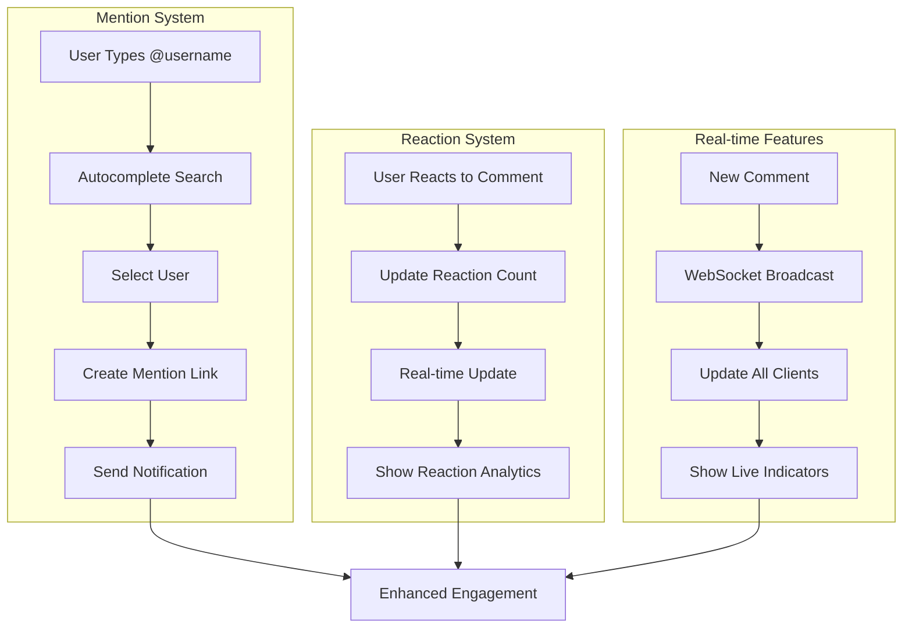

# Advanced Comment Features

Enhance your comment system with sophisticated features that increase engagement and improve user experience. Enable mentions, reactions, and intelligent comment handling.

<CardGroup cols={2}>
  <Card title="User Mentions" icon="at" href="mention-in-comment">
    Tag users in comments with automatic notifications and linking
  </Card>
  <Card title="Comment Reactions" icon="heart" href="get-comment-reaction-data">
    Enable reactions on comments with detailed analytics and engagement data
  </Card>
  <Card title="Latest Comments" icon="clock" href="get-latest-comment">
    Efficiently retrieve and display the most recent comments
  </Card>
  <Card title="Smart Features" icon="sparkles" href="smart-features">
    AI-powered features like sentiment analysis and content suggestions
  </Card>
</CardGroup>

## Advanced Features Architecture



## Core Advanced Features

<AccordionGroup>
  <Accordion title="User Mentions">
    - **Autocomplete Search**: Real-time user search as users type @username
    - **Smart Suggestions**: Suggest relevant users based on context and relationships
    - **Notification System**: Automatic notifications when users are mentioned
    - **Permission Handling**: Respect user privacy settings for mentions
  </Accordion>
  
  <Accordion title="Comment Reactions">
    - **Multiple Reaction Types**: Support various emotions (like, love, laugh, angry, etc.)
    - **Reaction Analytics**: Track reaction patterns and engagement metrics
    - **Real-time Updates**: Live reaction counts and visual feedback
    - **User History**: Track which users reacted and when
  </Accordion>
  
  <Accordion title="Intelligent Features">
    - **Sentiment Analysis**: Automatically detect comment sentiment and tone
    - **Content Suggestions**: Suggest relevant content based on comment context
    - **Language Detection**: Identify comment language for proper handling
    - **Spam Detection**: Automatically identify and handle spam comments
  </Accordion>
  
  <Accordion title="Real-time Capabilities">
    - **Live Typing Indicators**: Show when users are composing comments
    - **Instant Updates**: Real-time comment delivery and updates
    - **Presence Awareness**: Show which users are currently viewing the discussion
    - **Collaborative Features**: Enable collaborative comment editing
  </Accordion>
</AccordionGroup>

## Implementation Examples

<Tabs>
  <Tab title="Mentions System">
    ```typescript
    // Search users for mentions
    const searchUsers = async (query: string) => {
      const users = await AmitySDK.queryUsers({
        search: query,
        limit: 10,
        sortBy: 'displayName'
      });
      return users.data;
    };
    
    // Create comment with mentions
    const commentWithMentions = await AmitySDK.createComment({
      referenceId: 'post-123',
      referenceType: 'post',
      text: 'Great insight @john.doe! What do you think @jane.smith?',
      mentionees: [
        { userId: 'john-doe-id', type: 'user' },
        { userId: 'jane-smith-id', type: 'user' }
      ],
      metadata: {
        mentionPositions: [
          { start: 15, end: 24, userId: 'john-doe-id' },
          { start: 46, end: 56, userId: 'jane-smith-id' }
        ]
      }
    });
    ```
  </Tab>
  
  <Tab title="Reaction System">
    ```typescript
    // Add reaction to comment
    await AmitySDK.addReaction({
      referenceId: 'comment-123',
      referenceType: 'comment',
      reactionName: 'like'
    });
    
    // Get comment reaction data
    const reactionData = await AmitySDK.getCommentReactionData('comment-123');
    console.log('Total reactions:', reactionData.totalCount);
    console.log('My reactions:', reactionData.myReactions);
    console.log('Reaction breakdown:', reactionData.reactionsByType);
    
    // Listen for reaction updates
    const reactionLiveData = AmitySDK.queryReactions({
      referenceId: 'comment-123',
      referenceType: 'comment'
    });
    
    reactionLiveData.on('dataUpdated', (reactions) => {
      updateReactionUI(reactions);
    });
    ```
  </Tab>
  
  <Tab title="Real-time Features">
    ```typescript
    // Get latest comments with real-time updates
    const latestComments = AmitySDK.queryComments({
      referenceId: 'post-123',
      referenceType: 'post',
      sortBy: 'lastCreated',
      limit: 5
    });
    
    latestComments.on('dataUpdated', (comments) => {
      displayLatestComments(comments);
    });
    
    // Implement typing indicators
    const typingIndicator = AmitySDK.createTypingIndicator({
      referenceId: 'post-123',
      referenceType: 'post'
    });
    
    // Show typing indicator
    typingIndicator.startTyping();
    
    // Hide typing indicator
    setTimeout(() => {
      typingIndicator.stopTyping();
    }, 3000);
    ```
  </Tab>
</Tabs>

## Advanced Use Cases

<AccordionGroup>
  <Accordion title="Community Discussions">
    - **Expert Mentions**: Automatically suggest domain experts for complex discussions
    - **Thread Summaries**: AI-generated summaries of long comment threads
    - **Topic Extraction**: Identify key topics and themes from comment discussions
    - **Sentiment Tracking**: Monitor community sentiment and discussion health
  </Accordion>
  
  <Accordion title="Content Moderation">
    - **Auto-moderation**: Automatically flag potentially problematic comments
    - **Context Awareness**: Understand comment context for better moderation decisions
    - **Escalation Workflows**: Route complex moderation cases to human moderators
    - **Community Self-moderation**: Enable community members to help moderate discussions
  </Accordion>
  
  <Accordion title="Engagement Optimization">
    - **Engagement Scoring**: Score comments based on engagement potential
    - **Recommendation Engine**: Suggest comments that might interest users
    - **Personalization**: Customize comment display based on user preferences
    - **A/B Testing**: Test different comment features for optimal engagement
  </Accordion>
</AccordionGroup>

## Best Practices

<AccordionGroup>
  <Accordion title="User Experience">
    - **Smooth Interactions**: Ensure mentions and reactions feel responsive
    - **Clear Feedback**: Provide visual feedback for all user actions
    - **Accessibility**: Support screen readers and keyboard navigation
    - **Mobile Optimization**: Optimize advanced features for mobile devices
  </Accordion>
  
  <Accordion title="Performance">
    - **Efficient Queries**: Optimize database queries for mention searches
    - **Caching Strategy**: Cache reaction data and user information
    - **Real-time Optimization**: Use efficient WebSocket connections
    - **Batch Operations**: Process multiple reactions or mentions efficiently
  </Accordion>
  
  <Accordion title="Privacy & Security">
    - **Mention Permissions**: Respect user privacy settings for mentions
    - **Data Protection**: Secure user data in reactions and mentions
    - **Spam Prevention**: Prevent abuse of mention and reaction systems
    - **Rate Limiting**: Implement appropriate rate limits for advanced features
  </Accordion>
</AccordionGroup>
