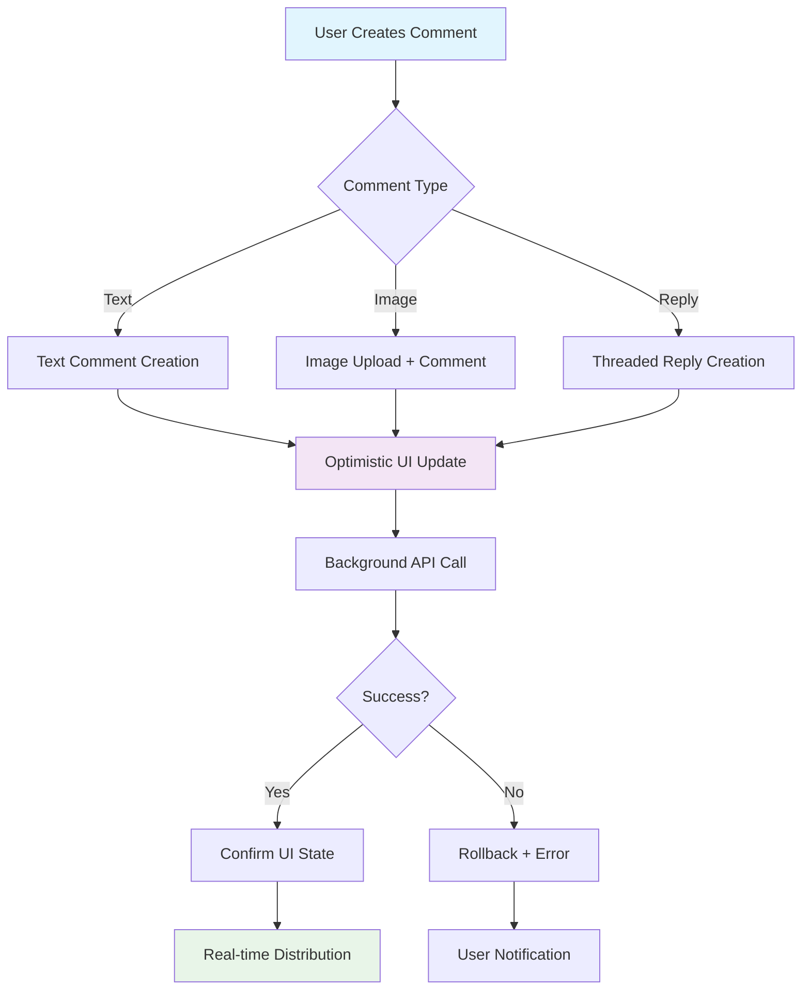

# Create Comment

Create rich, interactive comments with text, images, mentions, and threaded replies. The Social+ SDK provides optimistic updates for immediate user feedback and supports various content types for comprehensive commenting experiences.

<Info>
**Optimistic Updates**: Comments appear immediately in the UI while the SDK handles creation in the background, providing seamless user experience with automatic rollback on failure.
</Info>

## Architecture Overview



## Comment Reference Types

| Reference Type | Description | Use Cases | Character Limit |
|---------------|-------------|-----------|-----------------|
| **`post`** | Comments on regular posts | Text posts, media posts, shared content | 20,000 characters |
| **`story`** | Comments on story content | Temporary stories, story highlights | 20,000 characters |
| **`content`** | Comments on specialized content | Articles, custom content types | 20,000 characters |

## Create Text Comment

Create text-based comments with support for mentions, custom metadata, and optimistic updates.

<Tabs>
<Tab title="iOS">
```swift
import AmitySDK

class CommentManager {
    private let commentRepository: AmityCommentRepository
    private var commentToken: AmityNotificationToken?
    
    init(client: AmityClient) {
        self.commentRepository = AmityCommentRepository(client: client)
    }
    
    func createTextComment(
        on referenceId: String,
        referenceType: AmityCommentReferenceType,
        text: String,
        parentId: String? = nil,
        mentionUsers: [String] = [],
        metadata: [String: Any]? = nil,
        completion: @escaping (Result<AmityComment, Error>) -> Void
    ) {
        // Create comment with optimistic updates
        let builder = AmityCommentCreationDataBuilder()
        builder.setText(text)
        builder.setParentId(parentId)
        builder.setMetadata(metadata)
        builder.setMentionUsers(mentionUsers)
        
        commentToken = commentRepository.createComment(
            for: referenceId,
            referenceType: referenceType,
            with: builder.build()
        ).observeOnce { result in
            switch result {
            case .success(let comment):
                print("Comment created successfully: \(comment.commentId)")
                completion(.success(comment))
            case .failure(let error):
                print("Failed to create comment: \(error)")
                completion(.failure(error))
            }
        }
    }
    
    // Create comment with mentions and custom metadata
    func createCommentWithMentions(
        on postId: String,
        text: String,
        mentionUsers: [String],
        completion: @escaping (Result<AmityComment, Error>) -> Void
    ) {
        let metadata: [String: Any] = [
            "mentions": mentionUsers.map { userId in
                [
                    "userId": userId,
                    "type": "user",
                    "length": 10, // Length of mention text
                    "index": 0    // Position in text
                ]
            }
        ]
        
        createTextComment(
            on: postId,
            referenceType: .post,
            text: text,
            mentionUsers: mentionUsers,
            metadata: metadata,
            completion: completion
        )
    }
    
    // Create threaded reply
    func createReply(
        to parentCommentId: String,
        on referenceId: String,
        text: String,
        completion: @escaping (Result<AmityComment, Error>) -> Void
    ) {
        createTextComment(
            on: referenceId,
            referenceType: .post,
            text: text,
            parentId: parentCommentId,
            completion: completion
        )
    }
}

// Example usage in UIViewController
class PostCommentsViewController: UIViewController {
    private let commentManager: CommentManager
    private let postId: String
    
    init(postId: String, commentManager: CommentManager) {
        self.postId = postId
        self.commentManager = commentManager
        super.init(nibName: nil, bundle: nil)
    }
    
    @IBAction func submitComment() {
        guard let commentText = commentTextField.text, !commentText.isEmpty else {
            return
        }
        
        // Show loading state
        showCommentLoadingState()
        
        commentManager.createTextComment(
            on: postId,
            referenceType: .post,
            text: commentText
        ) { [weak self] result in
            DispatchQueue.main.async {
                self?.handleCommentCreation(result)
            }
        }
    }
    
    private func handleCommentCreation(_ result: Result<AmityComment, Error>) {
        hideCommentLoadingState()
        
        switch result {
        case .success(let comment):
            // Clear input and refresh comments
            commentTextField.text = ""
            refreshCommentsList()
            
        case .failure(let error):
            showError("Failed to post comment: \(error.localizedDescription)")
        }
    }
}
```
</Tab>

<Tab title="Android">
```kotlin
import com.amity.socialcloud.sdk.social.comment.*

class CommentManager(private val client: AmityClient) {
    private val commentRepository = AmityCommentRepository(client)
    
    fun createTextComment(
        referenceId: String,
        referenceType: AmityCommentReferenceType,
        text: String,
        parentId: String? = null,
        mentionUsers: List<String> = emptyList(),
        metadata: Map<String, Any>? = null,
        callback: (Result<AmityComment>) -> Unit
    ) {
        val builder = AmityCommentCreationDataBuilder().apply {
            setText(text)
            parentId?.let { setParentId(it) }
            setMentionUsers(mentionUsers)
            metadata?.let { setMetadata(it) }
        }
        
        commentRepository.createComment(referenceId, referenceType, builder.build())
            .observeOn(AndroidSchedulers.mainThread())
            .subscribe(
                { comment ->
                    Log.d("CommentManager", "Comment created: ${comment.getCommentId()}")
                    callback(Result.success(comment))
                },
                { error ->
                    Log.e("CommentManager", "Failed to create comment", error)
                    callback(Result.failure(RuntimeException(error)))
                }
            )
    }
    
    // Create comment with mentions
    fun createCommentWithMentions(
        postId: String,
        text: String,
        mentionUsers: List<String>,
        callback: (Result<AmityComment>) -> Unit
    ) {
        val mentionMetadata = mapOf(
            "mentions" to mentionUsers.mapIndexed { index, userId ->
                mapOf(
                    "userId" to userId,
                    "type" to "user",
                    "index" to index * 10, // Adjust based on actual text positions
                    "length" to 10
                )
            }
        )
        
        createTextComment(
            referenceId = postId,
            referenceType = AmityCommentReferenceType.POST,
            text = text,
            mentionUsers = mentionUsers,
            metadata = mentionMetadata,
            callback = callback
        )
    }
    
    // Create threaded reply
    fun createReply(
        parentCommentId: String,
        referenceId: String,
        text: String,
        callback: (Result<AmityComment>) -> Unit
    ) {
        createTextComment(
            referenceId = referenceId,
            referenceType = AmityCommentReferenceType.POST,
            text = text,
            parentId = parentCommentId,
            callback = callback
        )
    }
}

// Usage in Activity/Fragment
class PostCommentsActivity : AppCompatActivity() {
    private lateinit var commentManager: CommentManager
    private lateinit var postId: String
    
    override fun onCreate(savedInstanceState: Bundle?) {
        super.onCreate(savedInstanceState)
        setContentView(R.layout.activity_post_comments)
        
        commentManager = CommentManager(AmityClient.getInstance())
        postId = intent.getStringExtra("POST_ID") ?: ""
        
        setupCommentInput()
    }
    
    private fun setupCommentInput() {
        submitCommentButton.setOnClickListener {
            val commentText = commentEditText.text.toString().trim()
            if (commentText.isNotEmpty()) {
                submitComment(commentText)
            }
        }
    }
    
    private fun submitComment(text: String) {
        // Show loading state
        showCommentLoadingState(true)
        
        commentManager.createTextComment(
            referenceId = postId,
            referenceType = AmityCommentReferenceType.POST,
            text = text
        ) { result ->
            showCommentLoadingState(false)
            
            when {
                result.isSuccess -> {
                    // Clear input and refresh
                    commentEditText.text.clear()
                    refreshCommentsList()
                }
                result.isFailure -> {
                    showError("Failed to post comment: ${result.exceptionOrNull()?.message}")
                }
            }
        }
    }
}
```
</Tab>

<Tab title="TypeScript">
```typescript
import { 
    AmityClient, 
    CommentRepository, 
    AmityComment,
    AmityCommentReferenceType,
    CommentCreationData 
} from '@amityco/ts-sdk';

interface MentionMetadata {
    userId: string;
    type: 'user';
    index: number;
    length: number;
}

class CommentManager {
    private commentRepository: CommentRepository;
    
    constructor(client: AmityClient) {
        this.commentRepository = new CommentRepository(client);
    }
    
    async createTextComment(options: {
        referenceId: string;
        referenceType: AmityCommentReferenceType;
        text: string;
        parentId?: string;
        mentionUsers?: string[];
        metadata?: Record<string, any>;
    }): Promise<AmityComment> {
        const {
            referenceId,
            referenceType,
            text,
            parentId,
            mentionUsers = [],
            metadata
        } = options;
        
        // Validate input
        if (text.length > 20000) {
            throw new Error('Comment text exceeds 20,000 character limit');
        }
        
        const commentData: CommentCreationData = {
            text,
            parentId,
            mentionUsers,
            metadata
        };
        
        try {
            const comment = await this.commentRepository.createComment(
                referenceId,
                referenceType,
                commentData
            );
            
            console.log('Comment created successfully:', comment.commentId);
            return comment;
        } catch (error) {
            console.error('Failed to create comment:', error);
            throw error;
        }
    }
    
    // Create comment with mentions
    async createCommentWithMentions(
        postId: string,
        text: string,
        mentionUsers: string[]
    ): Promise<AmityComment> {
        // Create mention metadata for proper rendering
        const mentionMetadata: Record<string, MentionMetadata[]> = {
            mentions: mentionUsers.map((userId, index) => ({
                userId,
                type: 'user',
                index: this.findMentionIndex(text, userId, index),
                length: this.calculateMentionLength(userId)
            }))
        };
        
        return this.createTextComment({
            referenceId: postId,
            referenceType: AmityCommentReferenceType.POST,
            text,
            mentionUsers,
            metadata: mentionMetadata
        });
    }
    
    // Create threaded reply
    async createReply(
        parentCommentId: string,
        referenceId: string,
        text: string
    ): Promise<AmityComment> {
        return this.createTextComment({
            referenceId,
            referenceType: AmityCommentReferenceType.POST,
            text,
            parentId: parentCommentId
        });
    }
    
    private findMentionIndex(text: string, userId: string, fallbackIndex: number): number {
        // Find actual position of mention in text
        const mentionPattern = new RegExp(`@${userId}`, 'i');
        const match = text.match(mentionPattern);
        return match?.index ?? fallbackIndex * 10;
    }
    
    private calculateMentionLength(userId: string): number {
        // Calculate actual length of mention display
        return userId.length + 1; // +1 for @ symbol
    }
}

// Usage in React component
class CommentInput extends React.Component<{
    postId: string;
    onCommentCreated: (comment: AmityComment) => void;
}> {
    private commentManager: CommentManager;
    
    constructor(props) {
        super(props);
        this.commentManager = new CommentManager(AmityClient.getInstance());
        this.state = {
            commentText: '',
            isSubmitting: false,
            error: null
        };
    }
    
    handleSubmitComment = async () => {
        const { commentText } = this.state;
        const { postId, onCommentCreated } = this.props;
        
        if (!commentText.trim()) return;
        
        this.setState({ isSubmitting: true, error: null });
        
        try {
            const comment = await this.commentManager.createTextComment({
                referenceId: postId,
                referenceType: AmityCommentReferenceType.POST,
                text: commentText.trim()
            });
            
            // Clear input and notify parent
            this.setState({ commentText: '' });
            onCommentCreated(comment);
            
        } catch (error) {
            this.setState({ 
                error: `Failed to post comment: ${error.message}` 
            });
        } finally {
            this.setState({ isSubmitting: false });
        }
    };
    
    render() {
        const { commentText, isSubmitting, error } = this.state;
        
        return (
            <div className="comment-input">
                <textarea
                    value={commentText}
                    onChange={(e) => this.setState({ commentText: e.target.value })}
                    placeholder="Write a comment..."
                    maxLength={20000}
                    disabled={isSubmitting}
                />
                
                <button
                    onClick={this.handleSubmitComment}
                    disabled={!commentText.trim() || isSubmitting}
                >
                    {isSubmitting ? 'Posting...' : 'Post Comment'}
                </button>
                
                {error && (
                    <div className="error-message">{error}</div>
                )}
            </div>
        );
    }
}
```
</Tab>

<Tab title="Flutter">
```dart
import 'package:amity_sdk/amity_sdk.dart';

class CommentManager {
  final AmitySDK _amitySDK;
  
  CommentManager(this._amitySDK);
  
  Future<AmityComment> createTextComment({
    required String referenceId,
    required AmityCommentReferenceType referenceType,
    required String text,
    String? parentId,
    List<String> mentionUsers = const [],
    Map<String, dynamic>? metadata,
  }) async {
    // Validate input
    if (text.length > 20000) {
      throw Exception('Comment text exceeds 20,000 character limit');
    }
    
    final commentData = AmityCommentCreationData(
      text: text,
      parentId: parentId,
      mentionUsers: mentionUsers,
      metadata: metadata,
    );
    
    try {
      final comment = await _amitySDK.commentRepository.createComment(
        referenceId,
        referenceType,
        commentData,
      );
      
      print('Comment created successfully: ${comment.commentId}');
      return comment;
    } catch (error) {
      print('Failed to create comment: $error');
      rethrow;
    }
  }
  
  // Create comment with mentions
  Future<AmityComment> createCommentWithMentions(
    String postId,
    String text,
    List<String> mentionUsers,
  ) async {
    final mentionMetadata = <String, dynamic>{
      'mentions': mentionUsers.asMap().entries.map((entry) {
        final index = entry.key;
        final userId = entry.value;
        return {
          'userId': userId,
          'type': 'user',
          'index': _findMentionIndex(text, userId, index),
          'length': _calculateMentionLength(userId),
        };
      }).toList(),
    };
    
    return createTextComment(
      referenceId: postId,
      referenceType: AmityCommentReferenceType.post,
      text: text,
      mentionUsers: mentionUsers,
      metadata: mentionMetadata,
    );
  }
  
  // Create threaded reply
  Future<AmityComment> createReply(
    String parentCommentId,
    String referenceId,
    String text,
  ) async {
    return createTextComment(
      referenceId: referenceId,
      referenceType: AmityCommentReferenceType.post,
      text: text,
      parentId: parentCommentId,
    );
  }
  
  int _findMentionIndex(String text, String userId, int fallbackIndex) {
    final mentionPattern = RegExp('@$userId', caseSensitive: false);
    final match = mentionPattern.firstMatch(text);
    return match?.start ?? fallbackIndex * 10;
  }
  
  int _calculateMentionLength(String userId) {
    return userId.length + 1; // +1 for @ symbol
  }
}

// Usage in Flutter widget
class CommentInputWidget extends StatefulWidget {
  final String postId;
  final Function(AmityComment) onCommentCreated;
  
  const CommentInputWidget({
    Key? key,
    required this.postId,
    required this.onCommentCreated,
  }) : super(key: key);
  
  @override
  State<CommentInputWidget> createState() => _CommentInputWidgetState();
}

class _CommentInputWidgetState extends State<CommentInputWidget> {
  final TextEditingController _commentController = TextEditingController();
  final CommentManager _commentManager = CommentManager(AmitySDK.instance);
  bool _isSubmitting = false;
  String? _error;
  
  @override
  void dispose() {
    _commentController.dispose();
    super.dispose();
  }
  
  Future<void> _submitComment() async {
    final commentText = _commentController.text.trim();
    if (commentText.isEmpty) return;
    
    setState(() {
      _isSubmitting = true;
      _error = null;
    });
    
    try {
      final comment = await _commentManager.createTextComment(
        referenceId: widget.postId,
        referenceType: AmityCommentReferenceType.post,
        text: commentText,
      );
      
      // Clear input and notify parent
      _commentController.clear();
      widget.onCommentCreated(comment);
      
    } catch (error) {
      setState(() {
        _error = 'Failed to post comment: $error';
      });
    } finally {
      setState(() {
        _isSubmitting = false;
      });
    }
  }
  
  @override
  Widget build(BuildContext context) {
    return Column(
      crossAxisAlignment: CrossAxisAlignment.stretch,
      children: [
        TextField(
          controller: _commentController,
          decoration: const InputDecoration(
            hintText: 'Write a comment...',
            border: OutlineInputBorder(),
          ),
          maxLength: 20000,
          maxLines: 3,
          enabled: !_isSubmitting,
        ),
        
        const SizedBox(height: 8),
        
        ElevatedButton(
          onPressed: _commentController.text.trim().isEmpty || _isSubmitting
              ? null
              : _submitComment,
          child: _isSubmitting
              ? const SizedBox(
                  width: 16,
                  height: 16,
                  child: CircularProgressIndicator(strokeWidth: 2),
                )
              : const Text('Post Comment'),
        ),
        
        if (_error != null)
          Padding(
            padding: const EdgeInsets.only(top: 8),
            child: Text(
              _error!,
              style: TextStyle(color: Theme.of(context).errorColor),
            ),
          ),
      ],
    );
  }
}
```
</Tab>
</Tabs>

## Create Image Comment

Add rich visual content to discussions with image comments. The SDK handles image upload and comment creation seamlessly with optimistic updates for immediate user feedback.

### Image Upload Process

1. **Upload Image**: First upload the image file to get a `fileId`
2. **Create Comment**: Use the `fileId` to create an image comment
3. **Optimistic Update**: Comment appears immediately in UI
4. **Background Processing**: SDK handles creation and error handling

### Supported Image Formats

| Format | Max Size | Optimization | Use Case |
|--------|----------|--------------|----------|
| **JPEG** | 10MB | Automatic compression | Photos, general images |
| **PNG** | 10MB | Transparency preserved | Graphics, screenshots |
| **GIF** | 5MB | Animation supported | Animated reactions |
| **WebP** | 8MB | Superior compression | Modern web images |

<Tabs>
<Tab title="iOS">
```swift
import AmitySDK
import UIKit

extension CommentManager {
    func createImageComment(
        on referenceId: String,
        referenceType: AmityCommentReferenceType,
        image: UIImage,
        caption: String? = nil,
        parentId: String? = nil,
        completion: @escaping (Result<AmityComment, Error>) -> Void
    ) {
        // Step 1: Upload image first
        uploadImage(image) { [weak self] result in
            switch result {
            case .success(let fileId):
                // Step 2: Create comment with fileId
                self?.createCommentWithFile(
                    fileId: fileId,
                    referenceId: referenceId,
                    referenceType: referenceType,
                    caption: caption,
                    parentId: parentId,
                    completion: completion
                )
            case .failure(let error):
                completion(.failure(error))
            }
        }
    }
    
    private func uploadImage(
        _ image: UIImage,
        completion: @escaping (Result<String, Error>) -> Void
    ) {
        guard let imageData = image.jpegData(compressionQuality: 0.8) else {
            completion(.failure(CommentError.invalidImageData))
            return
        }
        
        let fileRepository = AmityFileRepository(client: client)
        
        fileRepository.uploadImage(imageData, progress: { progress in
            print("Upload progress: \(progress)")
        }) { result in
            switch result {
            case .success(let fileInfo):
                completion(.success(fileInfo.fileId))
            case .failure(let error):
                completion(.failure(error))
            }
        }
    }
    
    private func createCommentWithFile(
        fileId: String,
        referenceId: String,
        referenceType: AmityCommentReferenceType,
        caption: String?,
        parentId: String?,
        completion: @escaping (Result<AmityComment, Error>) -> Void
    ) {
        let builder = AmityCommentCreationDataBuilder()
        builder.setFileId(fileId)
        builder.setParentId(parentId)
        
        if let caption = caption {
            builder.setText(caption)
        }
        
        commentToken = commentRepository.createComment(
            for: referenceId,
            referenceType: referenceType,
            with: builder.build()
        ).observeOnce { result in
            completion(result)
        }
    }
}

// Image picker and comment creation
class ImageCommentViewController: UIViewController {
    private let commentManager: CommentManager
    private let postId: String
    
    init(postId: String, commentManager: CommentManager) {
        self.postId = postId
        self.commentManager = commentManager
        super.init(nibName: nil, bundle: nil)
    }
    
    @IBAction func addImageComment() {
        presentImagePicker()
    }
    
    private func presentImagePicker() {
        let imagePicker = UIImagePickerController()
        imagePicker.delegate = self
        imagePicker.sourceType = .photoLibrary
        imagePicker.allowsEditing = true
        present(imagePicker, animated: true)
    }
    
    private func createImageComment(with image: UIImage, caption: String?) {
        showUploadProgress(true)
        
        commentManager.createImageComment(
            on: postId,
            referenceType: .post,
            image: image,
            caption: caption
        ) { [weak self] result in
            DispatchQueue.main.async {
                self?.handleImageCommentCreation(result)
            }
        }
    }
    
    private func handleImageCommentCreation(_ result: Result<AmityComment, Error>) {
        showUploadProgress(false)
        
        switch result {
        case .success(let comment):
            print("Image comment created: \(comment.commentId)")
            refreshCommentsList()
        case .failure(let error):
            showError("Failed to upload image: \(error.localizedDescription)")
        }
    }
}

extension ImageCommentViewController: UIImagePickerControllerDelegate, UINavigationControllerDelegate {
    func imagePickerController(_ picker: UIImagePickerController, didFinishPickingMediaWithInfo info: [UIImagePickerController.InfoKey : Any]) {
        picker.dismiss(animated: true)
        
        guard let image = info[.editedImage] as? UIImage ?? info[.originalImage] as? UIImage else {
            return
        }
        
        // Prompt for optional caption
        showCaptionAlert { [weak self] caption in
            self?.createImageComment(with: image, caption: caption)
        }
    }
}

enum CommentError: LocalizedError {
    case invalidImageData
    
    var errorDescription: String? {
        switch self {
        case .invalidImageData:
            return "Unable to process image data"
        }
    }
}
```
</Tab>

<Tab title="Android">
```kotlin
import com.amity.socialcloud.sdk.social.comment.*
import com.amity.socialcloud.sdk.social.file.*
import android.graphics.Bitmap
import java.io.ByteArrayOutputStream

class CommentManager(private val client: AmityClient) {
    private val commentRepository = AmityCommentRepository(client)
    private val fileRepository = AmityFileRepository(client)
    
    fun createImageComment(
        referenceId: String,
        referenceType: AmityCommentReferenceType,
        imageBitmap: Bitmap,
        caption: String? = null,
        parentId: String? = null,
        progressCallback: ((Int) -> Unit)? = null,
        callback: (Result<AmityComment>) -> Unit
    ) {
        // Step 1: Upload image first
        uploadImage(imageBitmap, progressCallback) { uploadResult ->
            uploadResult.fold(
                onSuccess = { fileId ->
                    // Step 2: Create comment with fileId
                    createCommentWithFile(
                        fileId = fileId,
                        referenceId = referenceId,
                        referenceType = referenceType,
                        caption = caption,
                        parentId = parentId,
                        callback = callback
                    )
                },
                onFailure = { error ->
                    callback(Result.failure(error))
                }
            )
        }
    }
    
    private fun uploadImage(
        bitmap: Bitmap,
        progressCallback: ((Int) -> Unit)?,
        callback: (Result<String>) -> Unit
    ) {
        val stream = ByteArrayOutputStream()
        bitmap.compress(Bitmap.CompressFormat.JPEG, 80, stream)
        val imageBytes = stream.toByteArray()
        
        fileRepository.uploadImage(imageBytes)
            .doOnNext { uploadInfo ->
                progressCallback?.invoke(uploadInfo.getProgress())
            }
            .observeOn(AndroidSchedulers.mainThread())
            .subscribe(
                { fileInfo ->
                    if (fileInfo.isComplete()) {
                        callback(Result.success(fileInfo.getFileId()))
                    }
                },
                { error ->
                    callback(Result.failure(RuntimeException(error)))
                }
            )
    }
    
    private fun createCommentWithFile(
        fileId: String,
        referenceId: String,
        referenceType: AmityCommentReferenceType,
        caption: String?,
        parentId: String?,
        callback: (Result<AmityComment>) -> Unit
    ) {
        val builder = AmityCommentCreationDataBuilder().apply {
            setFileId(fileId)
            parentId?.let { setParentId(it) }
            caption?.let { setText(it) }
        }
        
        commentRepository.createComment(referenceId, referenceType, builder.build())
            .observeOn(AndroidSchedulers.mainThread())
            .subscribe(
                { comment ->
                    callback(Result.success(comment))
                },
                { error ->
                    callback(Result.failure(RuntimeException(error)))
                }
            )
    }
}

// Activity with image comment functionality
class PostCommentsActivity : AppCompatActivity() {
    private lateinit var commentManager: CommentManager
    private lateinit var postId: String
    private val imagePickerLauncher = registerForActivityResult(
        ActivityResultContracts.GetContent()
    ) { uri ->
        uri?.let { handleImageSelected(it) }
    }
    
    override fun onCreate(savedInstanceState: Bundle?) {
        super.onCreate(savedInstanceState)
        setContentView(R.layout.activity_post_comments)
        
        commentManager = CommentManager(AmityClient.getInstance())
        postId = intent.getStringExtra("POST_ID") ?: ""
        
        setupImageCommentButton()
    }
    
    private fun setupImageCommentButton() {
        imageCommentButton.setOnClickListener {
            imagePickerLauncher.launch("image/*")
        }
    }
    
    private fun handleImageSelected(uri: Uri) {
        try {
            val bitmap = MediaStore.Images.Media.getBitmap(contentResolver, uri)
            showCaptionDialog { caption ->
                createImageComment(bitmap, caption)
            }
        } catch (e: Exception) {
            showError("Failed to load image: ${e.message}")
        }
    }
    
    private fun createImageComment(bitmap: Bitmap, caption: String?) {
        showUploadProgress(true)
        
        commentManager.createImageComment(
            referenceId = postId,
            referenceType = AmityCommentReferenceType.POST,
            imageBitmap = bitmap,
            caption = caption,
            progressCallback = { progress ->
                updateUploadProgress(progress)
            }
        ) { result ->
            showUploadProgress(false)
            
            when {
                result.isSuccess -> {
                    Log.d("Comments", "Image comment created successfully")
                    refreshCommentsList()
                }
                result.isFailure -> {
                    showError("Failed to upload image: ${result.exceptionOrNull()?.message}")
                }
            }
        }
    }
    
    private fun showCaptionDialog(onCaptionEntered: (String?) -> Unit) {
        AlertDialog.Builder(this)
            .setTitle("Add Caption")
            .setView(R.layout.dialog_caption_input)
            .setPositiveButton("Post") { dialog, _ ->
                val editText = (dialog as AlertDialog).findViewById<EditText>(R.id.captionEditText)
                val caption = editText?.text?.toString()?.takeIf { it.isNotBlank() }
                onCaptionEntered(caption)
            }
            .setNegativeButton("Cancel", null)
            .show()
    }
    
    private fun showUploadProgress(show: Boolean) {
        uploadProgressBar.visibility = if (show) View.VISIBLE else View.GONE
        imageCommentButton.isEnabled = !show
    }
    
    private fun updateUploadProgress(progress: Int) {
        uploadProgressBar.progress = progress
    }
}
```
</Tab>

<Tab title="TypeScript">
```typescript
import { 
    CommentRepository, 
    FileRepository,
    AmityComment,
    AmityCommentReferenceType 
} from '@amityco/ts-sdk';

class CommentManager {
    private commentRepository: CommentRepository;
    private fileRepository: FileRepository;
    
    constructor(client: AmityClient) {
        this.commentRepository = new CommentRepository(client);
        this.fileRepository = new FileRepository(client);
    }
    
    async createImageComment(options: {
        referenceId: string;
        referenceType: AmityCommentReferenceType;
        imageFile: File;
        caption?: string;
        parentId?: string;
        onProgress?: (progress: number) => void;
    }): Promise<AmityComment> {
        const {
            referenceId,
            referenceType,
            imageFile,
            caption,
            parentId,
            onProgress
        } = options;
        
        // Validate image file
        this.validateImageFile(imageFile);
        
        try {
            // Step 1: Upload image
            const fileId = await this.uploadImage(imageFile, onProgress);
            
            // Step 2: Create comment with fileId
            return await this.createCommentWithFile({
                fileId,
                referenceId,
                referenceType,
                caption,
                parentId
            });
        } catch (error) {
            console.error('Failed to create image comment:', error);
            throw error;
        }
    }
    
    private validateImageFile(file: File): void {
        const maxSize = 10 * 1024 * 1024; // 10MB
        const allowedTypes = ['image/jpeg', 'image/png', 'image/gif', 'image/webp'];
        
        if (file.size > maxSize) {
            throw new Error('Image file size exceeds 10MB limit');
        }
        
        if (!allowedTypes.includes(file.type)) {
            throw new Error('Unsupported image format. Please use JPEG, PNG, GIF, or WebP');
        }
    }
    
    private async uploadImage(
        file: File,
        onProgress?: (progress: number) => void
    ): Promise<string> {
        return new Promise((resolve, reject) => {
            this.fileRepository.uploadImage(file, {
                onProgress: (progressEvent) => {
                    if (onProgress && progressEvent.total) {
                        const progress = Math.round(
                            (progressEvent.loaded / progressEvent.total) * 100
                        );
                        onProgress(progress);
                    }
                },
                onSuccess: (fileInfo) => {
                    resolve(fileInfo.fileId);
                },
                onError: (error) => {
                    reject(error);
                }
            });
        });
    }
    
    private async createCommentWithFile(options: {
        fileId: string;
        referenceId: string;
        referenceType: AmityCommentReferenceType;
        caption?: string;
        parentId?: string;
    }): Promise<AmityComment> {
        const { fileId, referenceId, referenceType, caption, parentId } = options;
        
        const commentData = {
            fileId,
            text: caption,
            parentId
        };
        
        return await this.commentRepository.createComment(
            referenceId,
            referenceType,
            commentData
        );
    }
}

// React component for image comments
interface ImageCommentInputProps {
    postId: string;
    onCommentCreated: (comment: AmityComment) => void;
}

class ImageCommentInput extends React.Component<ImageCommentInputProps> {
    private commentManager: CommentManager;
    private fileInputRef: React.RefObject<HTMLInputElement>;
    
    constructor(props: ImageCommentInputProps) {
        super(props);
        this.commentManager = new CommentManager(AmityClient.getInstance());
        this.fileInputRef = React.createRef();
        this.state = {
            isUploading: false,
            uploadProgress: 0,
            caption: '',
            error: null
        };
    }
    
    handleImageSelect = (event: React.ChangeEvent<HTMLInputElement>) => {
        const file = event.target.files?.[0];
        if (file) {
            this.uploadImageComment(file);
        }
    };
    
    uploadImageComment = async (file: File) => {
        const { postId, onCommentCreated } = this.props;
        const { caption } = this.state;
        
        this.setState({ 
            isUploading: true, 
            uploadProgress: 0, 
            error: null 
        });
        
        try {
            const comment = await this.commentManager.createImageComment({
                referenceId: postId,
                referenceType: AmityCommentReferenceType.POST,
                imageFile: file,
                caption: caption.trim() || undefined,
                onProgress: (progress) => {
                    this.setState({ uploadProgress: progress });
                }
            });
            
            // Clear state and notify parent
            this.setState({ caption: '' });
            if (this.fileInputRef.current) {
                this.fileInputRef.current.value = '';
            }
            onCommentCreated(comment);
            
        } catch (error) {
            this.setState({ 
                error: `Failed to upload image: ${error.message}` 
            });
        } finally {
            this.setState({ isUploading: false, uploadProgress: 0 });
        }
    };
    
    render() {
        const { isUploading, uploadProgress, caption, error } = this.state;
        
        return (
            <div className="image-comment-input">
                <div className="caption-input">
                    <textarea
                        value={caption}
                        onChange={(e) => this.setState({ caption: e.target.value })}
                        placeholder="Add a caption (optional)..."
                        disabled={isUploading}
                    />
                </div>
                
                <div className="upload-controls">
                    <input
                        ref={this.fileInputRef}
                        type="file"
                        accept="image/jpeg,image/png,image/gif,image/webp"
                        onChange={this.handleImageSelect}
                        disabled={isUploading}
                        style={{ display: 'none' }}
                    />
                    
                    <button
                        onClick={() => this.fileInputRef.current?.click()}
                        disabled={isUploading}
                        className="image-upload-button"
                    >
                        {isUploading ? (
                            <>
                                <span>Uploading... {uploadProgress}%</span>
                                <div className="progress-bar">
                                    <div 
                                        className="progress-fill"
                                        style={{ width: `${uploadProgress}%` }}
                                    />
                                </div>
                            </>
                        ) : (
                            <>
                                <i className="icon-camera" />
                                Add Image
                            </>
                        )}
                    </button>
                </div>
                
                {error && (
                    <div className="error-message">{error}</div>
                )}
            </div>
        );
    }
}
```
</Tab>

<Tab title="Flutter">
```dart
import 'package:amity_sdk/amity_sdk.dart';
import 'package:image_picker/image_picker.dart';
import 'dart:io';

class CommentManager {
  final AmitySDK _amitySDK;
  
  CommentManager(this._amitySDK);
  
  Future<AmityComment> createImageComment({
    required String referenceId,
    required AmityCommentReferenceType referenceType,
    required File imageFile,
    String? caption,
    String? parentId,
    Function(int)? onProgress,
  }) async {
    // Validate image file
    await _validateImageFile(imageFile);
    
    try {
      // Step 1: Upload image
      final fileId = await _uploadImage(imageFile, onProgress);
      
      // Step 2: Create comment with fileId
      return await _createCommentWithFile(
        fileId: fileId,
        referenceId: referenceId,
        referenceType: referenceType,
        caption: caption,
        parentId: parentId,
      );
    } catch (error) {
      print('Failed to create image comment: $error');
      rethrow;
    }
  }
  
  Future<void> _validateImageFile(File file) async {
    const maxSize = 10 * 1024 * 1024; // 10MB
    const allowedExtensions = ['.jpg', '.jpeg', '.png', '.gif', '.webp'];
    
    final fileSize = await file.length();
    if (fileSize > maxSize) {
      throw Exception('Image file size exceeds 10MB limit');
    }
    
    final fileName = file.path.toLowerCase();
    final hasValidExtension = allowedExtensions.any(fileName.endsWith);
    
    if (!hasValidExtension) {
      throw Exception('Unsupported image format. Please use JPEG, PNG, GIF, or WebP');
    }
  }
  
  Future<String> _uploadImage(File file, Function(int)? onProgress) async {
    final completer = Completer<String>();
    
    _amitySDK.fileRepository.uploadImage(
      file,
      onProgress: (progress) {
        onProgress?.call(progress);
      },
      onSuccess: (fileInfo) {
        completer.complete(fileInfo.fileId);
      },
      onError: (error) {
        completer.completeError(error);
      },
    );
    
    return completer.future;
  }
  
  Future<AmityComment> _createCommentWithFile({
    required String fileId,
    required String referenceId,
    required AmityCommentReferenceType referenceType,
    String? caption,
    String? parentId,
  }) async {
    final commentData = AmityCommentCreationData(
      fileId: fileId,
      text: caption,
      parentId: parentId,
    );
    
    return await _amitySDK.commentRepository.createComment(
      referenceId,
      referenceType,
      commentData,
    );
  }
}

// Widget for image comment input
class ImageCommentInput extends StatefulWidget {
  final String postId;
  final Function(AmityComment) onCommentCreated;
  
  const ImageCommentInput({
    Key? key,
    required this.postId,
    required this.onCommentCreated,
  }) : super(key: key);
  
  @override
  State<ImageCommentInput> createState() => _ImageCommentInputState();
}

class _ImageCommentInputState extends State<ImageCommentInput> {
  final CommentManager _commentManager = CommentManager(AmitySDK.instance);
  final TextEditingController _captionController = TextEditingController();
  final ImagePicker _imagePicker = ImagePicker();
  
  bool _isUploading = false;
  int _uploadProgress = 0;
  String? _error;
  
  @override
  void dispose() {
    _captionController.dispose();
    super.dispose();
  }
  
  Future<void> _selectAndUploadImage() async {
    try {
      final XFile? imageFile = await _imagePicker.pickImage(
        source: ImageSource.gallery,
        maxWidth: 1920,
        maxHeight: 1920,
        imageQuality: 80,
      );
      
      if (imageFile != null) {
        await _uploadImageComment(File(imageFile.path));
      }
    } catch (error) {
      setState(() {
        _error = 'Failed to select image: $error';
      });
    }
  }
  
  Future<void> _uploadImageComment(File imageFile) async {
    setState(() {
      _isUploading = true;
      _uploadProgress = 0;
      _error = null;
    });
    
    try {
      final comment = await _commentManager.createImageComment(
        referenceId: widget.postId,
        referenceType: AmityCommentReferenceType.post,
        imageFile: imageFile,
        caption: _captionController.text.trim().isEmpty 
            ? null 
            : _captionController.text.trim(),
        onProgress: (progress) {
          setState(() {
            _uploadProgress = progress;
          });
        },
      );
      
      // Clear input and notify parent
      _captionController.clear();
      widget.onCommentCreated(comment);
      
    } catch (error) {
      setState(() {
        _error = 'Failed to upload image: $error';
      });
    } finally {
      setState(() {
        _isUploading = false;
        _uploadProgress = 0;
      });
    }
  }
  
  @override
  Widget build(BuildContext context) {
    return Column(
      crossAxisAlignment: CrossAxisAlignment.stretch,
      children: [
        // Caption input
        TextField(
          controller: _captionController,
          decoration: const InputDecoration(
            hintText: 'Add a caption (optional)...',
            border: OutlineInputBorder(),
          ),
          maxLines: 2,
          enabled: !_isUploading,
        ),
        
        const SizedBox(height: 12),
        
        // Upload button with progress
        ElevatedButton.icon(
          onPressed: _isUploading ? null : _selectAndUploadImage,
          icon: _isUploading 
              ? SizedBox(
                  width: 16,
                  height: 16,
                  child: CircularProgressIndicator(
                    strokeWidth: 2,
                    value: _uploadProgress / 100,
                  ),
                )
              : const Icon(Icons.camera_alt),
          label: Text(
            _isUploading 
                ? 'Uploading... $_uploadProgress%'
                : 'Add Image Comment',
          ),
        ),
        
        // Error message
        if (_error != null)
          Padding(
            padding: const EdgeInsets.only(top: 8),
            child: Text(
              _error!,
              style: TextStyle(
                color: Theme.of(context).errorColor,
                fontSize: 14,
              ),
            ),
          ),
      ],
    );
  }
}
```
</Tab>
</Tabs>

## Best Practices

<AccordionGroup>
<Accordion title="Optimistic Updates">
- **Immediate Feedback**: Show comments in UI immediately for better UX
- **Loading States**: Display appropriate loading indicators during creation
- **Error Handling**: Implement rollback mechanisms for failed operations
- **Network Resilience**: Queue comments for retry when offline
- **Status Indicators**: Show comment sync status (pending, sent, failed)
</Accordion>

<Accordion title="Performance Optimization">
- **Image Compression**: Compress images before upload to reduce bandwidth
- **Batch Operations**: Group multiple comment operations when possible
- **Lazy Loading**: Load comment threads progressively
- **Memory Management**: Properly dispose of resources and subscriptions
- **Caching Strategy**: Cache frequently accessed comment data
</Accordion>

<Accordion title="User Experience">
- **Character Limits**: Show remaining character count for long comments
- **Auto-save Drafts**: Save comment drafts to prevent data loss
- **Mention Autocomplete**: Provide user suggestions for mentions
- **Rich Text Editor**: Support formatting for enhanced comments
- **Accessibility**: Ensure proper screen reader support
</Accordion>
</AccordionGroup>

## Error Handling

| Error Type | Description | Recommended Action |
|------------|-------------|-------------------|
| **Network Error** | Request failed due to connectivity | Retry with exponential backoff |
| **Character Limit** | Comment exceeds 20,000 characters | Show warning and truncate |
| **Permission Denied** | User lacks comment permissions | Hide comment creation UI |
| **Invalid Reference** | Referenced post/content not found | Validate reference before creation |
| **Upload Failed** | Image upload encountered error | Retry upload or show error message |

## Real-World Use Cases

<CardGroup cols={2}>
<Card title="Social Media Feed" icon="feed">
Enable threaded discussions on posts with support for text, images, and reactions for comprehensive social engagement.
</Card>

<Card title="Customer Support" icon="headset">
Create support ticket comments with image attachments for detailed issue reporting and resolution tracking.
</Card>

<Card title="Educational Platform" icon="graduation-cap">
Facilitate course discussions with threaded replies, mentions for instructor attention, and image sharing for examples.
</Card>

<Card title="Community Forums" icon="users">
Build forum-style discussions with nested replies, user mentions, and rich content for knowledge sharing.
</Card>
</CardGroup>

<Note>
Comments support real-time updates through Live Objects. Ensure proper subscription management to maintain optimal performance and prevent memory leaks in your application.
</Note>