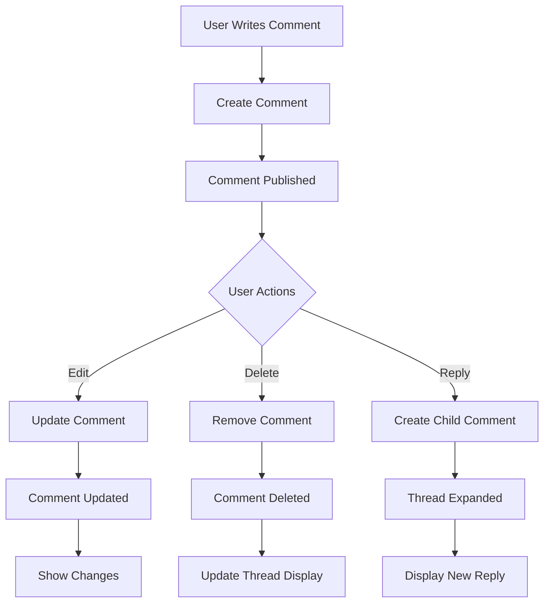

# Basic Comment Operations

Master the fundamental comment operations that form the foundation of discussion features. Create, edit, delete, and view comments with proper threading and user management.

<CardGroup cols={2}>
  <Card title="Create Comments" icon="plus" href="create-comment">
    Add new comments to posts and create threaded discussions
  </Card>
  <Card title="Edit Comments" icon="edit" href="edit-comment">
    Update comment content while preserving discussion context
  </Card>
  <Card title="Delete Comments" icon="trash" href="delete-comment">
    Remove comments with proper cleanup and thread management
  </Card>
  <Card title="View Comments" icon="eye" href="view-comment">
    Display and navigate comment threads with proper formatting
  </Card>
</CardGroup>

## Comment Lifecycle



## Core Features

<AccordionGroup>
  <Accordion title="Comment Creation">
    - **Text Comments**: Support rich text formatting and basic markup
    - **Reply Threading**: Create replies to existing comments with proper nesting
    - **Parent-Child Relationships**: Maintain clear comment hierarchy
    - **Real-time Publishing**: Instant comment delivery to all connected users
  </Accordion>
  
  <Accordion title="Comment Editing">
    - **Inline Editing**: Edit comments directly in the interface
    - **Edit History**: Track changes and show edit indicators
    - **Time Limits**: Set reasonable windows for comment editing
    - **Permission Controls**: Restrict editing based on user roles and ownership
  </Accordion>
  
  <Accordion title="Comment Deletion">
    - **Soft Delete**: Remove comments while preserving thread structure
    - **Hard Delete**: Permanently remove comments and associated data
    - **Thread Integrity**: Handle deletions without breaking discussion flow
    - **Cascading Actions**: Manage child comments when parent is deleted
  </Accordion>
  
  <Accordion title="Comment Display">
    - **Threaded View**: Show comment hierarchy with proper indentation
    - **Collapse/Expand**: Allow users to hide/show comment threads
    - **Pagination**: Load comments efficiently with progressive loading
    - **Real-time Updates**: Show new comments and changes immediately
  </Accordion>
</AccordionGroup>

## Implementation Examples

<Tabs>
  <Tab title="Creating Comments">
    ```typescript
    // Create a root comment
    const comment = await AmitySDK.createComment({
      referenceId: 'post-123',
      referenceType: 'post',
      text: 'Great post! Thanks for sharing.',
      metadata: {
        source: 'web_app'
      }
    });
    
    // Create a reply to existing comment
    const reply = await AmitySDK.createComment({
      referenceId: 'post-123',
      referenceType: 'post',
      parentId: 'comment-456',
      text: 'I totally agree with your point!',
      mentionees: [{ userId: 'user-789', type: 'user' }]
    });
    ```
  </Tab>
  
  <Tab title="Managing Comments">
    ```typescript
    // Edit an existing comment
    const updatedComment = await AmitySDK.updateComment('comment-123', {
      text: 'Updated: Great post! Thanks for sharing this insight.',
      metadata: {
        edited: true,
        editedAt: Date.now()
      }
    });
    
    // Delete a comment
    await AmitySDK.deleteComment('comment-123', {
      deleteType: 'soft', // or 'hard'
      reason: 'user_request'
    });
    
    // Restore a soft-deleted comment
    await AmitySDK.undeleteComment('comment-123');
    ```
  </Tab>
  
  <Tab title="Displaying Comments">
    ```typescript
    // Query comments for a post
    const comments = AmitySDK.queryComments({
      referenceId: 'post-123',
      referenceType: 'post',
      sortBy: 'firstCreated',
      limit: 20,
      includeReplies: true
    });
    
    // Listen for real-time updates
    comments.on('dataUpdated', (updatedComments) => {
      renderComments(updatedComments);
    });
    
    // Get comment with full thread
    const commentWithReplies = await AmitySDK.getComment('comment-123', {
      includeChildren: true,
      childrenLimit: 10
    });
    ```
  </Tab>
</Tabs>

## Best Practices

<AccordionGroup>
  <Accordion title="User Experience">
    - **Auto-save Drafts**: Save comment drafts automatically as users type
    - **Character Limits**: Set reasonable limits to encourage concise comments
    - **Rich Text Support**: Allow basic formatting like bold, italic, and links
    - **Preview Mode**: Let users preview comments before publishing
  </Accordion>
  
  <Accordion title="Performance">
    - **Lazy Loading**: Load comments progressively to improve page load times
    - **Efficient Threading**: Optimize comment tree structure for fast rendering
    - **Caching Strategy**: Cache frequently accessed comments locally
    - **Pagination**: Use proper pagination for large comment threads
  </Accordion>
  
  <Accordion title="Content Quality">
    - **Input Validation**: Validate comment content before saving
    - **Spam Prevention**: Implement rate limiting and spam detection
    - **Content Filtering**: Filter inappropriate content automatically
    - **Edit Tracking**: Show when comments have been edited for transparency
  </Accordion>
</AccordionGroup>
