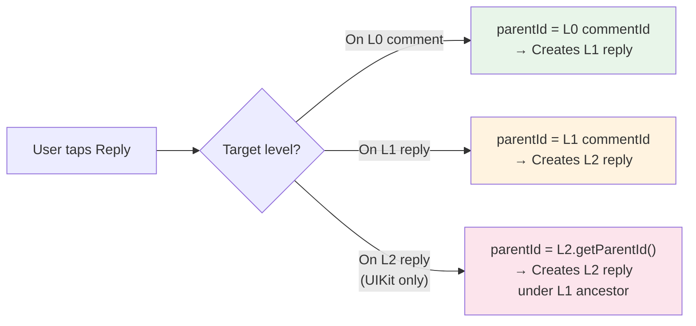

import CommentReply from '/snippets/social-plus-sdk/social/comment-reply.mdx';
import CommentRepositoryInitialization from '/snippets/social-plus-sdk/social/comment-repository-initialization.mdx';
import CreateCommentFlagger from '/snippets/social-plus-sdk/social/create-comment-flagger.mdx';
import CreateCommentRepository from '/snippets/social-plus-sdk/social/create-comment-repository.mdx';
import CreateCommentEditor from '/snippets/social-plus-sdk/social/create-comment-editor.mdx';
import QueryComment from '/snippets/social-plus-sdk/social/query-comment.mdx';
import CreateTextComment from '/snippets/social-plus-sdk/social/create-text-comment.mdx';
import GetComment from '/snippets/social-plus-sdk/social/get-comment.mdx';
import QueryCommentByReference from '/snippets/social-plus-sdk/social/query-comment-by-reference.mdx';
import CommentCreateWithMention from '/snippets/social-plus-sdk/social/comment-create-with-mention.mdx';
import CommentCreateWithLinks from '/snippets/social-plus-sdk/social/comment-create-with-links.mdx';

---
title: "Text Comment"
description: "Create engaging comments with optimistic updates, mentions, links, and threaded replies"
---

import CommentCreate from '/snippets/social-plus-sdk/social/comment-create.mdx';
import CommentCreateImage from '/snippets/social-plus-sdk/social/comment-create-image.mdx';
import CommentCreateText from '/snippets/social-plus-sdk/social/comment-create-text.mdx';

social.plus SDK's comment creation is designed to handle comments efficiently and reliably across your application. Each comment is assigned a unique, immutable commentId, and the SDK includes an optimistic update feature to enhance user experience.

<CardGroup cols={3}>
  <Card title="Optimistic Updates" icon="bolt-lightning">
    Comments appear instantly with automatic rollback on failure
  </Card>
  <Card title="Threaded Replies" icon="reply">
    Support nested conversations with parent-child relationships
  </Card>
  <Card title="Rich Content" icon="sparkles">
    Text comments with mentions, metadata, links, and custom data
  </Card>
</CardGroup>

<Info>
**Optimistic Updates**: Comments appear immediately in the UI while the SDK handles creation in the background, providing seamless user experience with automatic rollback on failure.
</Info>

## Reference Types

Comments can be created on different types of content by specifying the appropriate reference type.

| Reference Type | Description | Use Cases | Character Limit |
|---------------|-------------|-----------|-----------------|
| **`post`** | Comments on regular posts | Text posts, media posts, shared content | 20,000 characters |
| **`story`** | Comments on story content | Temporary stories, story highlights | 20,000 characters |
| **`content`** | Comments on specialized content | Articles, custom content types | 20,000 characters |

<Warning>
A comment should not exceed 20,000 characters in length. Comments exceeding this limit will be rejected by the API.
</Warning>

## Create Text Comment

To work with comments, you'll need to use the CommentRepository. With the SDK's optimistic creation feature, you don't need to manually create a commentId. Instead, the SDK generates one automatically.

### Parameters

| Parameter | Type | Required | Description |
|-----------|------|----------|-------------|
| `referenceId` | String |  ✅ | ID of the content being commented on |
| `referenceType` | Enum |  ✅ | Type of content (post, story, content) |
| `text` | String |  ✅ | Comment text content (max 20,000 characters) |
| `parentId` | String |  ❌ | ID of parent comment for threaded replies (see [reply hierarchy](/social-plus-sdk/social/content-management/comments/overview#comment-hierarchy-multi-level-replies)) |
| `metadata` | Object |  ❌ | Custom metadata for the comment |
| `links` | Array\<Object\> |  ❌ | Links detected in text. Each item follows: `{ url, renderPreview, index?, length?, domain?, title?, imageUrl? }`. |
| `attachments` | Array\<Object\>	 |  ❌ | Files to attach to the comment. Each item is an object: `[{ type: "image", fileId: "file_id_1" }, { type: "image", fileId: "file_id_2" }]`|
| `mentionees` | Array\<Object\>	 |  ❌ | Users to mention in the comment. Each item is an object: `[{ type: "user", userIds: ["userId1","userId2"] }]`|

<Note>
`links` is optional. If omitted, SDKs do not send the `links` field. For update APIs, passing an empty array clears links while `nil` or `null` keeps existing links unchanged.
</Note>

### Create Text Comment with Links

Use the platform-specific `links` API to attach detected URLs to a text comment.

<CommentCreateText />

<CommentCreateImage />

## Reply to a Comment

In addition to creating top-level comments, social.plus SDK enables you to reply to existing comments in addition to creating top-level comments.

To reply to a comment, you must:

- Specify the parent comment's `commentId` using the `parentId` parameter.
- Ensure the `referenceId` and `referenceType` match the original comment's content.

<CommentCreate />

## Creating Replies (Multi-Level)

The social.plus comment system supports replies **up to Level 2**. The way you pass `parentId` differs depending on which level the target comment is at:

<Note>
The third path (replying to an L2 comment) applies only if you are building a UI that displays L2 replies with a Reply action. The UIKit handles this automatically by resolving to the L1 ancestor. If you are using the SDK directly, **Level 2 is the maximum supported depth** — avoid creating replies beyond it.
</Note>

| Scenario | `parentId` Value | Result |
|----------|-----------------|--------|
| Reply to **L0 comment** | The L0 `commentId` | Creates an **L1** reply |
| Reply to **L1 reply** | The L1 `commentId` | Creates an **L2** reply |

<Warning>
**The system supports up to Level 2 only.** While the SDK does not prevent you from passing an L2 comment's ID as `parentId` (which would technically create an L3 reply), doing so is **not supported**. System features such as `childrenCount`, reply aggregation, and notifications only work up to Level 2. Any replies beyond Level 2 will not be counted or displayed correctly.

If you are building a custom UI that allows replying to L2 comments, you should resolve the `parentId` to the **L1 ancestor** using the target comment's `getParentId()` method, so the new reply is created as another L2 comment.
</Warning>

<Info>
**@Mention Pre-fill**: When replying to L1 or L2 replies, the compose bar typically pre-fills the text input with `@[author-name]` of the comment being replied to, making it clear who the reply is directed at.
</Info>

## Best Practices

<AccordionGroup>
  <Accordion title="Optimistic Updates">
    - **Immediate Feedback**: Show comments instantly in the UI for better user experience
    - **Rollback Strategy**: Implement proper error handling to remove failed comments
    - **Loading States**: Show appropriate indicators during comment submission
    - **Network Resilience**: Handle offline scenarios with queued comment creation
  </Accordion>

  <Accordion title="Performance Optimization">
    - **Text Validation**: Validate comment length before API calls
    - **Debounce Input**: Prevent rapid successive submissions
    - **Memory Management**: Properly dispose of notification tokens
    - **Background Processing**: Handle comment creation asynchronously
  </Accordion>

  <Accordion title="User Experience">
    - **Character Limits**: Show remaining character count to users
    - **Auto-save Drafts**: Save comment drafts as users type
    - **Keyboard Management**: Handle keyboard appearance for better UX
    - **Visual Feedback**: Provide clear success/error indicators
  </Accordion>

  <Accordion title="Content Guidelines">
    - **Moderation**: Implement client-side content filtering if needed
    - **Rich Text**: Support basic text formatting where appropriate
    - **Mention Handling**: Provide user-friendly mention input interfaces
    - **Thread Management**: Display reply hierarchies clearly
  </Accordion>
</AccordionGroup>

## Troubleshooting

<AccordionGroup>
  <Accordion title="Comment creation fails">
    - Verify user has permission to comment on the content
    - Check if the reference ID exists and is accessible
    - Ensure comment text doesn't exceed 20,000 character limit
    - Validate network connectivity and authentication status
  </Accordion>
  
  <Accordion title="Optimistic updates not working">
    - Confirm UI update logic is executed on main thread
    - Check if error handling properly removes failed comments
    - Test with different network conditions
  </Accordion>
  
  <Accordion title="Threaded replies not appearing correctly">
    - Ensure parentId is valid and references existing comment
    - Check comment hierarchy depth limits
    - Verify UI properly handles nested comment display
    - Test reply functionality with different comment types
  </Accordion>
  
  <Accordion title="Performance issues">
    - Implement proper pagination for comment lists
    - Optimize comment rendering for large threads
    - Monitor memory usage with extensive comment trees
    - Use efficient data structures for comment hierarchies
  </Accordion>
</AccordionGroup>

## Practical Examples

<CardGroup cols={2}>
  <Card title="Social Media Feed" icon="rss">
    Enable threaded discussions on posts with support for text comments and reactions for comprehensive social engagement.
  </Card>
  
  <Card title="Customer Support" icon="headset">
    Create support ticket comments with proper threading for detailed issue reporting and resolution tracking.
  </Card>
  
  <Card title="Educational Platform" icon="graduation-cap">
    Facilitate course discussions with threaded replies and user mentions for instructor attention and peer interaction.
  </Card>
  
  <Card title="Community Forums" icon="users">
    Build forum-style discussions with nested replies and rich content for knowledge sharing and community building.
  </Card>
</CardGroup>

## Related Topics

<CardGroup cols={2}>
  <Card title="Comment Retrieval" icon="magnifying-glass" href="/social-plus-sdk/social/content-management/comments/retrieval/query-comments">
    Learn how to query and retrieve comments from posts and stories
  </Card>
  <Card title="Comment Actions" icon="pen-to-square" href="/social-plus-sdk/social/content-management/comments/actions/edit-comment">
    Explore comment editing and deletion functionality
  </Card>
  <Card title="Comment Engagement" icon="heart" href="/social-plus-sdk/social/comments/get-comment-reaction-data">
    Discover how to implement reactions and interactions on comments
  </Card>
  <Card title="Mentions" icon="at" href="/social-plus-sdk/social/comments/mention-in-comment">
    Understand how to implement user mentions in comments
  </Card>
</CardGroup>
