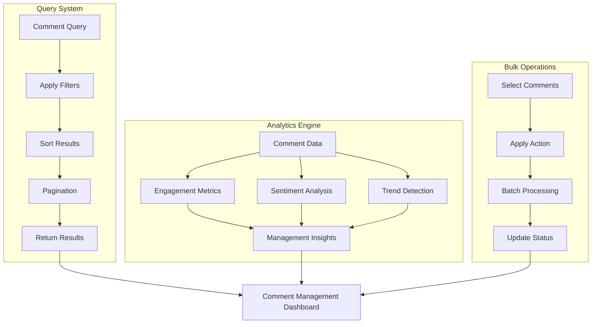

# Comment Management

Efficiently manage large volumes of comments with powerful querying, searching, and organizational tools. Handle comment moderation, analytics, and user experience optimization.

<CardGroup cols={2}>
  <Card title="Query Comments" icon="search" href="query-comment">
    Search and filter comments with advanced querying capabilities
  </Card>
  <Card title="Get Comments" icon="download" href="get-comment">
    Retrieve specific comments with full context and metadata
  </Card>
  <Card title="Comment Analytics" icon="chart-line" href="comment-analytics">
    Analyze comment patterns, engagement, and community health
  </Card>
  <Card title="Bulk Operations" icon="layers" href="bulk-operations">
    Perform bulk actions on multiple comments efficiently
  </Card>
</CardGroup>

## Management Architecture



## Core Management Features

<AccordionGroup>
  <Accordion title="Advanced Querying">
    - **Multi-field Search**: Search across comment text, metadata, and user information
    - **Filter Combinations**: Combine multiple filters for precise results
    - **Real-time Queries**: Live-updating query results with new comments
    - **Saved Searches**: Save frequently used query combinations
  </Accordion>
  
  <Accordion title="Comment Organization">
    - **Thread Management**: Navigate and organize complex comment threads
    - **Categorization**: Tag and categorize comments for better organization
    - **Priority Systems**: Mark important or problematic comments
    - **Status Tracking**: Track comment review and moderation status
  </Accordion>
  
  <Accordion title="Analytics & Insights">
    - **Engagement Metrics**: Track comment engagement and interaction patterns
    - **User Behavior**: Analyze how users interact with comments
    - **Content Quality**: Measure comment quality and relevance
    - **Community Health**: Monitor discussion health and sentiment
  </Accordion>
  
  <Accordion title="Moderation Tools">
    - **Bulk Moderation**: Handle multiple comments simultaneously
    - **Automated Actions**: Set up rules for automatic comment handling
    - **Review Queues**: Organize comments that need manual review
    - **Escalation Workflows**: Route complex cases to appropriate moderators
  </Accordion>
</AccordionGroup>

## Implementation Examples

<Tabs>
  <Tab title="Advanced Querying">
    ```typescript
    // Complex comment query with multiple filters
    const comments = AmitySDK.queryComments({
      referenceId: 'post-123',
      referenceType: 'post',
      filters: {
        dateRange: {
          start: '2024-01-01',
          end: '2024-01-31'
        },
        userTypes: ['verified', 'premium'],
        hasReactions: true,
        minReactionCount: 5,
        sentiment: ['positive', 'neutral'],
        languages: ['en', 'es']
      },
      sortBy: 'engagement_score',
      limit: 50,
      includeMetadata: true
    });
    
    // Search comments by content
    const searchResults = AmitySDK.searchComments({
      query: 'machine learning',
      fields: ['text', 'metadata.tags'],
      fuzzySearch: true,
      highlight: true
    });
    ```
  </Tab>
  
  <Tab title="Comment Analytics">
    ```typescript
    // Get comment analytics for a post
    const analytics = await AmitySDK.getCommentAnalytics('post-123', {
      timeRange: 'last_30_days',
      metrics: [
        'total_comments',
        'unique_commenters',
        'average_thread_depth',
        'engagement_rate',
        'sentiment_breakdown'
      ]
    });
    
    // Track comment performance over time
    const performanceData = await AmitySDK.getCommentPerformance({
      postId: 'post-123',
      granularity: 'daily',
      metrics: ['comment_count', 'reaction_count', 'reply_count']
    });
    
    // Get top performing comments
    const topComments = await AmitySDK.getTopComments({
      postId: 'post-123',
      sortBy: 'engagement_score',
      limit: 10,
      timeRange: 'last_7_days'
    });
    ```
  </Tab>
  
  <Tab title="Bulk Operations">
    ```typescript
    // Bulk approve comments
    const approveResults = await AmitySDK.bulkApproveComments({
      commentIds: ['comment-1', 'comment-2', 'comment-3'],
      reason: 'Batch approval after review',
      notifyUsers: true
    });
    
    // Bulk delete spam comments
    const deleteResults = await AmitySDK.bulkDeleteComments({
      filters: {
        flaggedAsSpam: true,
        createdAfter: '2024-01-01',
        userReputationBelow: 10
      },
      deleteType: 'soft',
      reason: 'Automated spam cleanup'
    });
    
    // Bulk update comment metadata
    const updateResults = await AmitySDK.bulkUpdateComments({
      commentIds: ['comment-1', 'comment-2'],
      updates: {
        metadata: {
          reviewed: true,
          reviewedBy: 'moderator-123',
          reviewedAt: Date.now()
        }
      }
    });
    ```
  </Tab>
</Tabs>

## Management Dashboard

<AccordionGroup>
  <Accordion title="Comment Overview">
    - **Daily Statistics**: Comments per day, engagement rates, user participation
    - **Quality Metrics**: Average comment length, reaction rates, thread depths
    - **Moderation Status**: Pending reviews, flagged content, resolved issues
    - **User Insights**: Top commenters, new vs. returning commenters
  </Accordion>
  
  <Accordion title="Content Analysis">
    - **Topic Trends**: Most discussed topics and themes
    - **Sentiment Tracking**: Overall discussion sentiment and mood changes
    - **Language Analytics**: Primary languages and translation needs
    - **Engagement Patterns**: Peak commenting times and user behavior
  </Accordion>
  
  <Accordion title="Moderation Tools">
    - **Review Queue**: Comments waiting for moderation approval
    - **Flagged Content**: User-reported comments requiring attention
    - **Automated Actions**: Rules and filters for automatic comment handling
    - **Moderator Activity**: Moderation team performance and workload
  </Accordion>
</AccordionGroup>

## Best Practices

<AccordionGroup>
  <Accordion title="Query Optimization">
    - **Index Strategy**: Ensure proper database indexing for fast queries
    - **Pagination**: Use cursor-based pagination for large comment sets
    - **Caching**: Cache frequently accessed comment data and query results
    - **Lazy Loading**: Load comment details on-demand to improve performance
  </Accordion>
  
  <Accordion title="Management Efficiency">
    - **Automated Workflows**: Set up rules for common moderation tasks
    - **Batch Processing**: Group similar operations for efficiency
    - **Priority Systems**: Focus on high-impact comments first
    - **Team Collaboration**: Enable multiple moderators to work efficiently
  </Accordion>
  
  <Accordion title="User Experience">
    - **Transparent Actions**: Clearly communicate moderation actions to users
    - **Appeal Process**: Provide ways for users to appeal moderation decisions
    - **Community Guidelines**: Maintain clear, accessible commenting policies
    - **Feedback Loops**: Use analytics to improve comment system continuously
  </Accordion>
</AccordionGroup>
