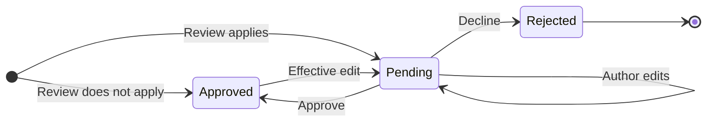

Turn on comment review when a community should read a comment before anyone else does. A held comment still belongs to its author, who can keep editing it, but it stays out of comment lists and public comment counts until a reviewer approves it. Reviewers work from a community-wide queue and approve or decline by comment ID.

## Platform Support

| Platform   | Read approval status          | Query review queue                                          | Approve                                       | Decline                                                |
| ---------- | ----------------------------- | ----------------------------------------------------------- | --------------------------------------------- | ------------------------------------------------------ |
| TypeScript | `comment.approvalStatus`      | `CommentRepository.getCommentReviewQueue(params, callback)` | `CommentRepository.approveComment(commentId)` | `CommentRepository.declineComment(commentId, reason?)` |
| iOS        | `comment.approvalStatus`      | `commentRepository.getCommentReviewQueue(with:)`            | `commentRepository.approveComment(withId:)`   | `commentRepository.declineComment(withId:reason:)`     |
| Android    | `comment.getApprovalStatus()` | `commentRepository.getCommentReviewQueue(communityId)`      | `commentRepository.approveComment(commentId)` | `commentRepository.declineComment(commentId, reason)`  |

## Approval Lifecycle

Every comment carries an `approvalStatus`. This section is the single reference for when a comment is held, how its status moves, and what each move changes on the comment and its post. The method sections below show the calls.

### When Review Applies

A comment is held for review only when all three of these are true:

1. It is written on a post that belongs to a community. This includes replies: a reply on such a post is held under the same rule as a top-level comment.
2. That community has `needApprovalOnCommentCreation` turned on. See [Require Review for Community Comments](#require-review-for-community-comments).
3. Its author cannot review that community's comments. The community's creator, and anyone who holds `REVIEW_COMMUNITY_COMMENT` on the community, publish immediately. Community moderators hold that permission by default.

Every other comment is approved when it is written.

| Comment on | Held for review |
| --- | --- |
| A post in a community with review on, written by a member who cannot review | Yes |
| A post in a community with review on, written by the community's creator or a holder of `REVIEW_COMMUNITY_COMMENT` | No |
| A post in a community with review off | No |
| A post that is itself awaiting post review | Follows the same rule as any other post in its community |
| A post on a user's own feed | No. There is no community to carry the setting. |
| A story | No, even when the story's community has review on |
| Your own content IDs (`referenceType: "content"`) | No |

Changing the setting affects future transitions, not existing comments:

- **Turning review on** changes no existing comment. A comment written before the switch enters review only if someone who cannot review later makes an effective edit to it. See [How the Status Changes](#how-the-status-changes).
- **Turning review off** does not drain the queue. Comments already pending stay pending, stay in the review queue, and can still be approved or declined.

### Statuses

| Status   | TypeScript   | iOS         | Android    | What it means |
| -------- | ------------ | ----------- | ---------- | ------------- |
| Pending  | `"pending"`  | `.pending`  | `PENDING`  | Held for review. Its author, the community's reviewers, and network admins can fetch it by ID; everyone else gets `404`. It appears in no comment query on TypeScript, iOS, or Android, not even its author's; reviewers find it in the [review queue](#query-the-review-queue). It accepts no replies, reactions, or flags. |
| Approved | `"approved"` | `.approved` | `APPROVED` | Visible to everyone. Not terminal: an effective edit can send it back to pending. |
| Rejected | `"rejected"` | `.rejected` | `REJECTED` | Declined by a reviewer. Terminal, and the comment is deleted at the same time. |

<Note>
  The server omits `approvalStatus` on a comment that has never been through
  review, which includes every comment written before this feature. Every SDK
  reads an absent value as **approved**. Read the value from the SDK model, not
  the field's presence on the raw payload, and do not write your own defaulting.
</Note>

### Comment Queries Show Approved Comments Only

The TypeScript, iOS, and Android SDKs filter comment queries to approved comments, for every viewer, including the author of a pending comment. The same applies to a post's latest-comment previews and to reply lists. You do not need to filter pending comments out yourself, and you cannot get one back through a comment query.

To show an author their own pending comment, keep the comment that create or edit returns and render it outside the list, for example with an "Awaiting review" label. Reviewers read pending comments through the [review queue](#query-the-review-queue).

### How the Status Changes



| From | Trigger | Result |
| --- | --- | --- |
| New comment | Written where [review applies](#when-review-applies) | `pending` |
| New comment | Written anywhere else, or by someone who can review | `approved` |
| `pending` | A reviewer approves | `approved` |
| `pending` | A reviewer declines | `rejected`, and the comment is deleted |
| `pending` | The author edits | Stays `pending` and keeps its place in the queue. Refused with `403` / `400300` when the network's `isAllowEditCommentWhenReviewingEnabled` is `false`. |
| `pending` | The author or a moderator deletes it | Deleted, and removed from the review queue |
| `approved` | An effective edit by someone who cannot review, while the community has review on | `pending`. The comment leaves public comment lists and returns to the top of the review queue. |
| `approved` | An edit that changes nothing, or an edit by someone who can review | Stays `approved` |
| `approved` or `rejected` | Approve or decline again | Refused with `403` / `400300` |
| `rejected` | Anything | Nothing. A rejected comment cannot be approved, edited, or restored. |

<Note>
  An edit is **effective** when it changes the comment's text, or when it sends
  attachments, links, or metadata at all, even the same values as before. An
  edit that sends only unchanged text leaves the status as it is.
</Note>

### What Approving or Declining Changes

Only `approvalStatus` records the outcome on the comment. The other changes land on visibility, counts, and events.

| What changes | Approve (`pending` → `approved`) | Decline (`pending` → `rejected`) | Re-review (`approved` → `pending`) |
| --- | --- | --- | --- |
| `approvalStatus` | `approved` | `rejected` | `pending` |
| Who sees it | Everyone | No one: the comment is deleted | Author, reviewers, and network admins by ID only; it leaves every comment query |
| `isDeleted` | Unchanged (`false`) | `true`, and its attachments are removed | Unchanged (`false`) |
| Position in the thread | Where it was written, because `createdAt` does not change | Not shown | Keeps its `createdAt` |
| `post.commentsCount` and the parent's reply count | Increase by one for everyone | Unchanged; a pending comment was never counted | Decrease by one until it is approved again |
| Realtime event | `comment.approved` | A comment deletion. There is no `comment.declined` event. | A comment update carrying the `pending` status |
| Notifications | Sent now, on the first approval only; none are sent while a comment is pending | None | None |

The reviewer who decided, the time of the decision, and the decline `reason` are kept for the moderation record only. No SDK returns them.

## Permission

Reading the queue and deciding on a comment both require the `REVIEW_COMMUNITY_COMMENT` permission on the target community. A client-side check is for hiding controls only; the server enforces the permission on every call, and a reviewer can never review their own comment.

<CodeGroup>

{/* doc-as-test: skip (comment review ships after the currently pinned Android SDK) */}

```kotlin Android
import com.amity.socialcloud.sdk.model.core.permission.AmityPermission

AmityCoreClient
    .hasPermission(permission = AmityPermission.REVIEW_COMMUNITY_COMMENT)
    .atCommunity(communityId = communityId)
    .check()
    .doOnNext { canReview: Boolean ->
        showSuccessMessage(canReview)
    }
    .subscribe()
```

{/* doc-as-test: skip (comment review ships after the currently pinned iOS SDK) */}

```swift iOS
let canReview = await client.hasPermission(
    .reviewCommunityComment,
    forCommunity: "community-id"
)

showSuccessMessage(canReview)
```

```typescript TypeScript
const canReview = client
  .hasPermission(Amity.Permission.ReviewCommunityCommentPermission)
  .community(communityId);

renderResults(canReview);
```

</CodeGroup>

## Require Review for Community Comments

Set `needApprovalOnCommentCreation` when you create or update the community. After it is on, new comments and effective edits in that community enter the queue, unless their author can review the community's comments. See [Approval Lifecycle](#approval-lifecycle) for the full rule.

<CodeGroup>

{/* doc-as-test: skip (comment review ships after the currently pinned Android SDK) */}

```kotlin Android
AmitySocialClient.newCommunityRepository()
    .editCommunity(communityId = "community-id")
    .isCommentReviewEnabled(isCommentReviewEnabled = true)
    .build()
    .apply()
    .doOnSuccess { community: AmityCommunity ->
        renderResults(community.isCommentReviewEnabled())
    }
    .subscribe()
```

{/* doc-as-test: skip (comment review ships after the currently pinned iOS SDK) */}

```swift iOS
let updateOptions = AmityCommunityUpdateOptions()
updateOptions.setNeedApprovalOnCommentCreation(true)

let community = try await communityRepository.editCommunity(
    withId: "community-id",
    options: updateOptions
)

renderResults(community.isCommentReviewEnabled)
```

```typescript TypeScript
import { CommunityRepository } from "@amityco/ts-sdk";

const { data: community } = await CommunityRepository.updateCommunity(
  communityId,
  {
    needApprovalOnCommentCreation: true,
  },
);

renderResults(community.needApprovalOnCommentCreation);
```

</CodeGroup>

<Note>
  Turning the setting off does not drain the queue. Comments already waiting
  stay waiting, and the review queue keeps serving them until each one is
  decided.
</Note>

## Read Approval Status on a Comment

Read the status on any comment you hold — including the one returned by create and edit — before you show it as published. In a community that requires review, a create or an effective edit comes back pending.

In a community that requires review, create comments with optimistic creation turned off. An optimistic create writes a local comment before the server answers, and the SDK cannot determine that comment's approval status yet; the correct status is reflected once the server responds. With optimistic creation off, nothing is written locally until the server confirms the comment, so the comment you receive already carries its approval status.

| Platform | Turn optimistic creation off |
| --- | --- |
| Android | Call `.isOptimistic(false)` on the comment creator builder |
| iOS | Pass `isOptimistic: false` to `AmityCommentCreateOptions` |
| TypeScript | Pass `false` as the second argument: `createComment(bundle, false)` |

<CodeGroup>

{/* doc-as-test: skip (comment review ships after the currently pinned Android SDK) */}

```kotlin Android
import com.amity.socialcloud.sdk.api.social.comment.review.AmityCommentApprovalStatus

AmitySocialClient.newCommentRepository()
    .createComment()
    .post(postId = postId)
    .with()
    .text(text = "Hello world!")
    .isOptimistic(isOptimistic = false) // wait for the server's approval status
    .build()
    .send()
    .subscribe(
        { comment ->
            when (comment.getApprovalStatus()) {
                AmityCommentApprovalStatus.PENDING ->
                    showSuccessMessage("Awaiting review — only you can see this comment")
                AmityCommentApprovalStatus.APPROVED -> showSuccessMessage(comment.getCommentId())
                AmityCommentApprovalStatus.REJECTED -> showSuccessMessage("declined")
            }
        },
        { error -> handleGeneralError(error) },
    )
```

{/* doc-as-test: skip (comment review ships after the currently pinned iOS SDK) */}

```swift iOS
let options = AmityCommentCreateOptions(
    referenceId: "post-id",
    referenceType: .post,
    text: "Hello world!",
    isOptimistic: false // wait for the server's approval status
)

let comment = try await commentRepository.createComment(with: options)

switch comment.approvalStatus {
case .pending:
    showSuccessMessage("Awaiting review — only you can see this comment")
case .approved:
    showSuccessMessage(comment.commentId)
case .rejected:
    showSuccessMessage("declined")
}
```

```typescript TypeScript
import { CommentRepository } from "@amityco/ts-sdk";

const { data: comment } = await CommentRepository.createComment(
  {
    referenceId: postId,
    referenceType: "post",
    data: { text: "Hello world!" },
  },
  false, // isOptimistic: wait for the server's approval status
);

if (comment.approvalStatus === "pending") {
  renderResults("Awaiting review — only you can see this comment");
} else {
  renderResults(comment);
}
```

</CodeGroup>

## Query the Review Queue

List a community's pending comments, newest first by when each entered the queue. A comment sent back for re-review returns to the top.

| Input | Required | Description |
| --- | --- | --- |
| `communityId` | Yes | Community whose pending comments to list. |
| `postId` | No | Narrows the queue to one post. A post from another community returns an empty list, not an error. |
| `startDate` / `endDate` | No | Filter on when the comment was **written**, not when it entered the queue. `endDate` includes the whole calendar day. |
| `timeZone` | No | IANA time-zone name the date filters are read in. Defaults to `UTC`. |
| Page size | No | Defaults to **10** on this route, not the SDK-wide 20, and is capped at 100. | The queue is community-wide unless you narrow it to one post, and it stays readable after the community's review setting is turned off.

<CodeGroup>

{/* doc-as-test: skip (comment review ships after the currently pinned Android SDK) */}

```kotlin Android
import org.joda.time.DateTime

AmitySocialClient.newCommentRepository()
    .getCommentReviewQueue(communityId = communityId)
    .startDate(startDate = DateTime.parse("2026-09-01"))
    .endDate(endDate = DateTime.parse("2026-09-30"))
    .timeZone(timeZone = "Asia/Bangkok")
    .pageSize(pageSize = 10)
    .build()
    .query()
    .subscribe(
        { pagingData -> getPagingData(pagingData) },
        { error -> handleGeneralError(error) }
    )
```

{/* doc-as-test: skip (comment review ships after the currently pinned iOS SDK) */}

```swift iOS
let options = AmityCommentReviewQueueQueryOptions(
    communityId: "community-id",
    postId: nil,
    startDate: nil,
    endDate: nil,
    timeZone: "Asia/Bangkok",
    pageSize: 10
)

token = commentRepository.getCommentReviewQueue(with: options).observe { collection, error in
    if let error = error {
        handleError(error)
        return
    }

    showSuccessMessage(collection.snapshots.count)
}
```

```typescript TypeScript
import { CommentRepository } from "@amityco/ts-sdk";

const unsubscribe = CommentRepository.getCommentReviewQueue(
  {
    communityId,
    startDate: "2026-09-01",
    endDate: "2026-09-30",
    timeZone: "Asia/Bangkok",
    limit: 10,
  },
  ({ data: comments, loading, error, onNextPage, hasNextPage }) => {
    if (loading) return;
    if (error) {
      handleError(error);
      return;
    }

    renderResults(comments);

    if (hasNextPage) {
      onNextPage?.();
    }
  },
);
```

</CodeGroup>

## Approve or Decline a Comment

Approve to reveal the comment to everyone and move the post's comment count by one. Decline to reject it — a declined comment is deleted at the same time. [What Approving or Declining Changes](#what-approving-or-declining-changes) lists every effect of both.

Both calls take the comment ID. Decline also takes an optional `reason`, at most 250 characters, kept for the moderation record only.

Neither call is idempotent. A second decision on a comment that was already decided is refused, so two reviewers acting at once cannot both record an outcome.

<CodeGroup>

{/* doc-as-test: skip (comment review ships after the currently pinned Android SDK) */}

```kotlin Android
AmitySocialClient.newCommentRepository()
    .approveComment(commentId = commentId)
    .subscribe(
        { showSuccessMessage(commentId) },
        { error -> handleGeneralError(error) }
    )

AmitySocialClient.newCommentRepository()
    .declineComment(commentId = commentId, reason = "Off-topic")
    .subscribe(
        { showSuccessMessage(commentId) },
        { error -> handleGeneralError(error) }
    )
```

{/* doc-as-test: skip (comment review ships after the currently pinned iOS SDK) */}

```swift iOS
try await commentRepository.approveComment(withId: "comment-id")
try await commentRepository.declineComment(withId: "comment-id", reason: "Off-topic")

showSuccessMessage()
```

```typescript TypeScript
import { CommentRepository } from "@amityco/ts-sdk";

const { data: approvedComment } =
  await CommentRepository.approveComment(commentId);

const { data: declinedComment } = await CommentRepository.declineComment(
  commentId,
  "Off-topic",
);

renderResults([approvedComment, declinedComment]);
```

</CodeGroup>

## Related SDK Functions

Comment review changes how several other comment, post, and community APIs behave. The reference for each is on its own page; this table says only how review affects it.

| Function | How comment review affects it | Reference |
| --- | --- | --- |
| Query comments (`getComments`) | Returns approved comments only, for every viewer including the author, on TypeScript, iOS, and Android. You do not filter pending comments out yourself. Show an author their own pending comment from the object create or edit returns. | [Query Comments](/social-plus-sdk/social/content-management/comments/retrieval/query-comments) |
| Get a comment by ID | Its author, the community's reviewers, and network admins get a pending comment; everyone else gets `404`, which does not mean the comment was deleted. | [Get Comment](/social-plus-sdk/social/content-management/comments/retrieval/get-comment) |
| Create a comment or reply | Comes back `pending` where review applies. In a community that requires review, create with optimistic creation off: an optimistic create cannot determine the comment's approval status until the server responds. A reply to a pending comment is refused. | [Create Comment](/social-plus-sdk/social/content-management/comments/creation/create-comment) · [Read Approval Status on a Comment](#read-approval-status-on-a-comment) |
| Edit a comment | An effective edit sends an approved comment back to `pending`. Editing a pending comment fails when the network's `isAllowEditCommentWhenReviewingEnabled` social setting is `false`. | [Edit Comment](/social-plus-sdk/social/content-management/comments/actions/edit-comment) |
| Delete a comment | The author or a moderator can delete a pending comment; it leaves the review queue. A decline also arrives as a deletion. | [Delete Comment](/social-plus-sdk/social/content-management/comments/actions/delete-comment) |
| Add a reaction | Refused on a pending comment: `400` for its author, `404` for everyone else. | [Reactions](/social-plus-sdk/core-concepts/content-handling/reactions) |
| Flag a comment | Refused on a pending comment. | [Flag a Comment](/social-plus-sdk/social/content-management/moderation/content-flagging#flag-a-comment) |
| Post comment counts (`commentsCount`, `getLocalCommentCount`) | `post.commentsCount` counts approved comments only, for everyone. `getLocalCommentCount(includePending: true)` adds the current user's own pending comments. | [Live Comment Count](/social-plus-sdk/social/content-management/posts/overview#live-comment-count) |
| Create or update a community | Carries the comment review setting: `needApprovalOnCommentCreation` on TypeScript, `setNeedApprovalOnCommentCreation(_:)` on iOS, and `isCommentReviewEnabled(_:)` on Android. | [Update Community](/social-plus-sdk/social/communities-spaces/community-lifecycle/update-community) · [Require Review](#require-review-for-community-comments) |
| Check a permission (`hasPermission`) | `REVIEW_COMMUNITY_COMMENT` decides who can read the queue and decide, and whose own comments skip review. | [Roles and Permissions](/social-plus-sdk/core-concepts/user-management/roles-permissions) · [Permission](#permission) |
| Subscribe to a realtime topic | Without a community or post comment subscription, approvals and declines do not reach the client. | [Social Realtime Events](/social-plus-sdk/core-concepts/realtime-communication/realtime-events/social-realtime-events) |

## Related Topics

<CardGroup cols={2}>
  <Card
    title="Post Review"
    href="/social-plus-sdk/social/content-management/posts/moderation/post-review"
    icon="gavel"
  >
    Approve, decline, and query posts held for community review.
  </Card>
  <Card
    title="Edit Comment"
    href="/social-plus-sdk/social/content-management/comments/actions/edit-comment"
    icon="pen"
  >
    Update comment text and attachments, and see when an edit needs review
    again.
  </Card>
  <Card
    title="Query Comments"
    href="/social-plus-sdk/social/content-management/comments/retrieval/query-comments"
    icon="filter"
  >
    List comments and replies on a post, story, or custom content ID.
  </Card>
  <Card
    title="Social Realtime Events"
    href="/social-plus-sdk/core-concepts/realtime-communication/realtime-events/social-realtime-events"
    icon="bolt"
  >
    Subscribe to community and post topics so comment events reach the client.
  </Card>
</CardGroup>
