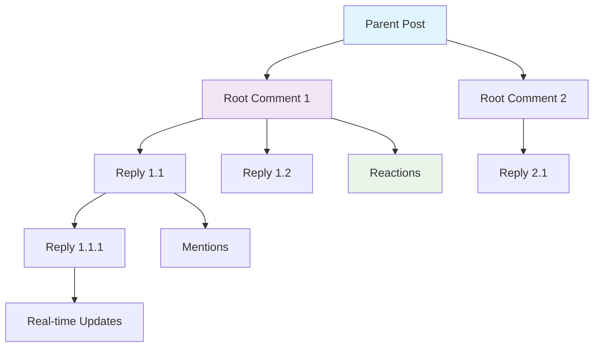

# Comments System

Build engaging discussions with a comprehensive comment system that supports threading, real-time updates, mentions, reactions, and moderation tools. Comments enable meaningful interactions between users on posts, stories, and other content.

<CardGroup cols={3}>
  <Card title="Basic Operations" icon="message" href="basic-operations/overview">
    Core comment functionality for creating and managing comments
  </Card>
  <Card title="Advanced Features" icon="sparkles" href="advanced-features/overview">
    Enhanced capabilities like mentions, reactions, and real-time updates
  </Card>
  <Card title="Comment Management" icon="list" href="management/overview">
    Query, search, and organize comments effectively
  </Card>
</CardGroup>

## Comment Architecture

Comments support a flexible structure with threading and real-time capabilities:



## Key Features

<AccordionGroup>
  <Accordion title="Threaded Discussions">
    - **Multi-level Threading**: Support for nested comment replies
    - **Parent-Child Relationships**: Clear comment hierarchy
    - **Thread Navigation**: Easy navigation through comment threads
    - **Collapse/Expand**: Manage long discussion threads
  </Accordion>
  
  <Accordion title="Real-time Capabilities">
    - **Live Updates**: Instant comment delivery across all clients
    - **Real-time Reactions**: Live reaction updates and counts
    - **Typing Indicators**: Show when users are composing comments
    - **Presence Awareness**: Track active users in discussions
  </Accordion>
  
  <Accordion title="Rich Content Support">
    - **Text Formatting**: Support for rich text and markdown
    - **Media Attachments**: Images and files in comments
    - **User Mentions**: Tag and notify specific users
    - **Custom Metadata**: Extensible comment properties
  </Accordion>
  
  <Accordion title="Moderation Tools">
    - **Content Flagging**: Report inappropriate comments
    - **Auto-moderation**: Built-in content filtering
    - **Moderation Queue**: Review flagged content
    - **User Management**: Handle problematic users
  </Accordion>
</AccordionGroup>

## Quick Start Guide

<Steps>
  <Step title="Enable Comments">
    Set up basic comment functionality on your posts:
    ```typescript
    // Enable comments on a post
    const post = await AmitySDK.createPost({
      type: 'text',
      text: 'What do you think about this?',
      commentsEnabled: true
    });
    ```
  </Step>
  <Step title="Create Comments">
    Allow users to add comments to content:
    ```typescript
    // Create a comment on a post
    const comment = await AmitySDK.createComment({
      referenceId: post.postId,
      referenceType: 'post',
      text: 'Great post! Thanks for sharing.'
    });
    ```
  </Step>
  <Step title="Add Threading">
    Enable reply functionality for discussions:
    ```typescript
    // Create a reply to a comment
    const reply = await AmitySDK.createComment({
      referenceId: post.postId,
      referenceType: 'post',
      parentId: comment.commentId,
      text: 'I agree with your point!'
    });
    ```
  </Step>
  <Step title="Implement Real-time">
    Set up live updates for dynamic discussions:
    ```typescript
    // Listen for new comments
    const liveComments = AmitySDK.queryComments({
      referenceId: post.postId,
      referenceType: 'post'
    });
    
    liveComments.on('dataUpdated', (comments) => {
      // Update UI with new comments
      updateCommentsUI(comments);
    });
    ```
  </Step>
</Steps>

## Best Practices

<AccordionGroup>
  <Accordion title="User Experience">
    - **Responsive Design**: Ensure comments work well on all devices
    - **Loading States**: Show progress when loading comments
    - **Pagination**: Load comments progressively for performance
    - **Offline Support**: Cache comments for offline viewing
  </Accordion>
  
  <Accordion title="Performance">
    - **Lazy Loading**: Load comments on demand
    - **Efficient Queries**: Use proper filtering and pagination
    - **Caching Strategy**: Cache frequently accessed comments
    - **Image Optimization**: Compress comment images
  </Accordion>
  
  <Accordion title="Moderation">
    - **Pre-moderation**: Review comments before publishing if needed
    - **Community Guidelines**: Provide clear commenting rules
    - **Easy Reporting**: Make it simple to flag inappropriate content
    - **Transparent Actions**: Communicate moderation decisions clearly
  </Accordion>
</AccordionGroup>

## Related Features

- **[Posts](../posts/overview)** - Create content that supports comments
- **[Moderation](../moderation/overview)** - Keep discussions healthy and safe
- **[Reactions](../../discovery-engagement/reactions/overview)** - Add reactions to comments
